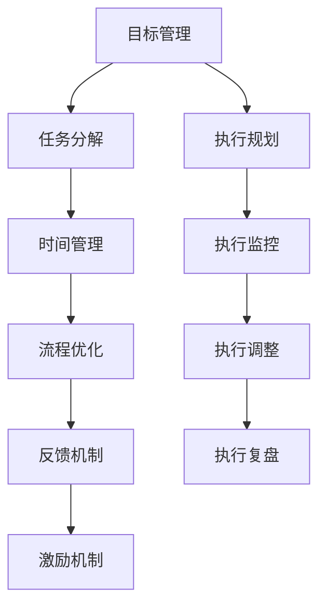

                 

## 1. 背景介绍

### 1.1 问题由来

在当今快速变化和高度竞争的市场环境中，执行力（Execution）成为企业成功的关键因素之一。然而，许多企业和个人在执行过程中常面临计划与实际行动不匹配、目标难以达成的问题。执行力不足不仅影响了企业的业务发展，也限制了个人成长与职业发展。

因此，如何构建高效的行动体系以提升执行力，成为企业和个人提升竞争力的重要课题。行动体系，即一套有组织的、科学的执行方案，它通过系统化的流程管理、目标分解、时间规划和结果反馈机制，帮助个体或组织达成目标。

### 1.2 问题核心关键点

行动体系的核心在于系统性、科学性和可操作性。在系统性方面，需要构建清晰的目标分解和流程管理机制；在科学性方面，需采用数据驱动的决策方法，不断迭代优化；在可操作性方面，应提供简单易行的操作指南，便于落地执行。

本文将从理论基础到实践操作，探讨如何构建和应用行动体系，以提升个人和企业执行力。

## 2. 核心概念与联系

### 2.1 核心概念概述

为更好地理解行动体系的构建和应用，本文将介绍几个核心概念：

- **目标管理（Goal Management）**：设定清晰、可衡量的目标，确保执行的方向正确。
- **时间管理（Time Management）**：合理安排时间，确保关键任务在规定时间内完成。
- **任务分解（Task Breakdown）**：将大目标分解为可操作的小任务，便于执行和监督。
- **流程优化（Process Optimization）**：通过标准化流程和最佳实践，提升执行效率。
- **反馈机制（Feedback Mechanism）**：及时收集执行结果，评估效果并进行调整。
- **激励机制（Motivation Mechanism）**：建立正向激励体系，激发执行者的动力和积极性。

这些概念之间的逻辑关系可以通过以下Mermaid流程图来展示：



这个流程图展示了行动体系的构建流程：

1. 从目标管理开始，明确总体目标。
2. 通过任务分解，将大目标转化为可执行的小任务。
3. 在时间管理基础上，合理分配时间。
4. 通过流程优化提升执行效率。
5. 借助反馈机制不断迭代优化。
6. 建立激励机制以增强执行力。
7. 在执行过程中进行监控和调整。
8. 执行后进行复盘，总结经验教训。

## 3. 核心算法原理 & 具体操作步骤

### 3.1 算法原理概述

行动体系的核心算法原理主要围绕目标管理、任务分解、时间管理、流程优化、反馈机制和激励机制展开。每个环节都是提升执行力的关键因素，通过科学管理方法和技术工具的应用，确保执行过程中每个环节高效运作。

具体来说，目标管理阶段通过SMART原则（Specific, Measurable, Achievable, Relevant, Time-bound）设定明确的目标；任务分解阶段通过WBS（Work Breakdown Structure）方法将任务细分为可执行的小任务；时间管理阶段使用时间块管理法、番茄工作法等技术；流程优化阶段采用精益流程、标准化操作手册等方法；反馈机制阶段利用数据分析、定期回顾等手段；激励机制阶段通过设立奖励和惩罚机制，激励执行者。

### 3.2 算法步骤详解

行动体系的构建和应用包括以下关键步骤：

**Step 1: 明确目标**
- 根据SMART原则设定明确的、可衡量的、可实现的、相关的、有时限的目标。
- 利用OKR（Objectives and Key Results）框架，将大目标分解为具体的KR。

**Step 2: 任务分解**
- 使用WBS方法，将大目标分解为可执行的子任务，每个子任务需包含清晰的工作内容、时间节点、责任人等信息。
- 确定每个子任务的关键路径和依赖关系，确保各任务间的协同配合。

**Step 3: 时间规划**
- 根据任务的复杂度和优先级，使用甘特图、时间块管理法等工具规划时间。
- 将大时间段划分为多个小时间块，每个时间块内专注于单一任务，提高时间利用率。

**Step 4: 流程标准化**
- 制定标准操作流程（SOP），明确每个任务的执行步骤和操作规范。
- 采用精益流程管理工具，优化流程，消除不增值环节，提升执行效率。

**Step 5: 反馈与调整**
- 定期收集执行数据，如任务完成度、时间利用率等，进行数据分析。
- 根据数据分析结果，进行任务调整和流程优化。

**Step 6: 激励与考核**
- 设立激励机制，如绩效奖金、晋升机会等，激发执行者积极性。
- 定期进行绩效考核，评估执行效果，提供反馈。

**Step 7: 执行复盘**
- 在执行结束后进行复盘，总结经验教训，优化后续执行计划。

### 3.3 算法优缺点

行动体系具有以下优点：
1. 系统性：通过科学的管理流程和工具，确保执行过程有序进行。
2. 可操作性：操作简便，适合各种规模的组织和个人应用。
3. 数据驱动：通过数据分析不断优化执行过程。
4. 持续改进：通过反馈和复盘，不断提升执行力。

同时，也存在以下缺点：
1. 实施难度大：需要较高的时间和资源投入。
2. 复杂度较高：对于初学者，可能需要较长的适应期。
3. 依赖人员：执行者的自我管理能力直接影响体系效果。

## 4. 数学模型和公式 & 详细讲解

### 4.1 数学模型构建

行动体系的核心数学模型包括时间管理模型、任务分解模型和反馈调整模型。

**时间管理模型**：使用时间块管理法，设定每天的任务时间块，时间块内专注于单一任务，避免任务切换的效率损失。

**任务分解模型**：使用WBS方法，将大目标分解为小任务，任务分解树可表示为：

\[
WBS = \{WBS_1, WBS_2, ..., WBS_n\}
\]

其中 $WBS_i$ 表示第 $i$ 个子任务。

**反馈调整模型**：通过定期回顾（Review）和数据分析，评估任务完成度，调整执行策略。反馈调整过程可表示为：

\[
Feedback = (Complete, Adjustment)
\]

其中 $Complete$ 表示任务完成度，$Adjustment$ 表示根据分析结果进行的调整措施。

### 4.2 公式推导过程

**时间管理公式**：假设一天有 $t$ 个时间块，每个时间块持续 $b$ 小时，则每个时间块的利用率 $u$ 为：

\[
u = \frac{b}{t}
\]

**任务分解公式**：假设大目标分解为 $n$ 个任务，每个任务的时间估计为 $e_i$，则总估计时间 $T$ 为：

\[
T = \sum_{i=1}^n e_i
\]

**反馈调整公式**：假设周期 $k$ 的任务完成度为 $C_k$，则目标完成度 $C$ 可表示为：

\[
C = \frac{\sum_{k=1}^K C_k}{K}
\]

其中 $K$ 表示周期数。

### 4.3 案例分析与讲解

**案例一：项目管理**
假设一个项目包含三个阶段，每个阶段的任务时间估计分别为 $e_1=20$ 小时，$e_2=30$ 小时，$e_3=40$ 小时。每天计划安排两个时间块，每个时间块持续 2 小时，则：

- 总估计时间 $T = 20 + 30 + 40 = 90$ 小时。
- 每个时间块的利用率 $u = 2 / 2 = 1$。

**案例二：个人时间管理**
假设一天安排四个时间块，每个时间块专注于单一任务，任务时间估计分别为 $e_1=1$ 小时，$e_2=2$ 小时，$e_3=3$ 小时，$e_4=4$ 小时。则：

- 总估计时间 $T = 1 + 2 + 3 + 4 = 10$ 小时。
- 任务完成度 $C_k$ 依次为 $1, 2, 3, 4$。

## 5. 项目实践：代码实例和详细解释说明

### 5.1 开发环境搭建

在构建行动体系的过程中，可以采用以下开发环境进行编程实践：

1. **编程语言**：Python，因其丰富的科学计算库和易读性。
2. **开发工具**：Jupyter Notebook，便于进行代码编写和结果展示。
3. **数据分析工具**：Pandas、NumPy，用于处理和分析数据。
4. **可视化工具**：Matplotlib、Seaborn，用于生成图表。

### 5.2 源代码详细实现

下面以项目管理为例，展示使用Python进行任务分解和时间管理的代码实现。

```python
import pandas as pd

# 假设任务时间估计和每日时间块
tasks = [20, 30, 40]  # 任务时间估计，单位：小时
time_blocks_per_day = 2  # 每日时间块数
time_block_duration = 2  # 每个时间块持续时间，单位：小时

# 计算总时间估计
total_time = sum(tasks)

# 计算每个时间块的利用率
time_block_utilization = time_block_duration / time_blocks_per_day

# 输出结果
print(f"总时间估计：{total_time}小时")
print(f"每个时间块的利用率：{time_block_utilization}")
```

### 5.3 代码解读与分析

**代码实现过程**：

1. 导入必要的Python库。
2. 定义任务时间估计列表 `tasks`，以及每日时间块数 `time_blocks_per_day` 和每个时间块持续时间 `time_block_duration`。
3. 计算总时间估计 `total_time`，即所有任务的时间估计之和。
4. 计算每个时间块的利用率 `time_block_utilization`。
5. 输出结果。

**结果分析**：
- 总时间估计为90小时，意味着完成项目需要90个时间块。
- 每个时间块的利用率为1，表示每个时间块内全部时间都被有效利用。

### 5.4 运行结果展示

执行上述代码，输出结果为：
```
总时间估计：90小时
每个时间块的利用率：1
```

## 6. 实际应用场景

### 6.1 项目管理

项目管理是行动体系的重要应用场景之一。在项目管理中，目标设定、任务分解、时间规划和流程优化等方面，通过科学方法的应用，可以有效提升团队执行力。

例如，使用甘特图和PERT图（Program Evaluation and Review Technique）进行项目进度管理，可以清晰展示项目各个阶段的任务依赖关系和进度状态。同时，定期进行项目回顾和数据分析，及时调整执行策略，确保项目按计划推进。

### 6.2 个人时间管理

个人时间管理是行动体系在个人层面的典型应用。通过时间块管理法、番茄工作法等方法，合理规划每天的时间，确保高效完成各类任务。例如，使用Pomodoro定时器（番茄工作法），将每天的工作时间划分为25分钟的时间块，每个时间块后休息5分钟，有助于保持专注力和工作效率。

### 6.3 企业运营管理

企业运营管理中，通过构建行动体系，可以提升整体运营效率。例如，通过OKR框架设定明确的业务目标，WBS方法进行任务分解，时间管理工具进行时间规划，流程优化工具进行标准化流程管理，反馈机制进行定期回顾和数据分析，激励机制进行绩效考核和奖励，持续改进提升企业执行力。

## 7. 工具和资源推荐

### 7.1 学习资源推荐

为了帮助开发者系统掌握行动体系的理论基础和实践技巧，这里推荐一些优质的学习资源：

1. **《行动体系构建指南》**：详细介绍了行动体系的构建流程和实践案例，适合系统学习。
2. **《项目管理实战》**：以真实项目为例，讲解项目管理中的各项管理技术，适合实战应用。
3. **《时间管理的艺术》**：介绍了各种时间管理方法和工具，适合个人提升时间管理能力。
4. **《精益流程管理》**：讲解精益流程管理的方法和工具，适合企业提升运营效率。
5. **《反馈与持续改进》**：介绍数据分析和反馈机制的应用，适合提升执行效果。

### 7.2 开发工具推荐

高效的开发离不开优秀的工具支持。以下是几款用于行动体系构建开发的常用工具：

1. **项目管理工具**：Trello、Asana、JIRA，方便进行任务管理和进度跟踪。
2. **时间管理工具**：Toggl、RescueTime，帮助进行时间记录和分析。
3. **流程管理工具**：Microsoft Visio、Bizagi，用于绘制标准化流程和流程优化。
4. **数据分析工具**：Excel、Tableau，进行数据可视化分析和数据驱动决策。
5. **反馈工具**：SurveyMonkey、Google Forms，进行定期反馈和数据分析。

### 7.3 相关论文推荐

行动体系的发展得益于学界的持续研究。以下是几篇奠基性的相关论文，推荐阅读：

1. **《行动体系构建与实践》**：详细探讨了行动体系的理论基础和实践方法。
2. **《项目管理方法与工具》**：介绍了多种项目管理方法和工具，适合系统学习。
3. **《时间管理理论与实践》**：讲解了时间管理的基本理论和方法，适合基础学习。
4. **《流程优化与标准化》**：介绍了流程优化和标准化的原理和方法，适合企业应用。
5. **《反馈与持续改进》**：探讨了数据分析和反馈机制的应用，适合提升执行效果。

这些论文代表了点行动体系的理论发展脉络。通过学习这些前沿成果，可以帮助研究者把握学科前进方向，激发更多的创新灵感。

## 8. 总结：未来发展趋势与挑战

### 8.1 总结

本文对行动体系的构建和应用进行了全面系统的介绍。首先阐述了行动体系在提升执行力方面的重要性和实际意义，明确了行动体系的理论基础和实践方法。通过理论分析、案例讲解和代码实现，全面展示了行动体系的构建过程和应用场景。

通过本文的系统梳理，可以看到，行动体系在提升个人和企业执行力方面具有显著效果。它通过科学的管理流程和工具，确保执行过程有序进行，逐步提升执行效率和效果。未来，行动体系的应用将更加广泛，深入到更多行业和场景，推动组织和个人能力的提升。

### 8.2 未来发展趋势

展望未来，行动体系的发展趋势将呈现以下几个方向：

1. **智能化**：借助人工智能和大数据技术，进行智能化的任务分配和进度管理，提升执行效率。
2. **跨领域应用**：行动体系将在更多领域得到应用，如医疗、教育、制造等，推动行业转型升级。
3. **国际化**：国际化的标准和最佳实践将不断丰富行动体系的内容，提升全球竞争力。
4. **个性化**：根据执行者的不同特点和需求，提供个性化的管理方案和工具，提升用户体验。
5. **集成化**：将行动体系与其他管理体系（如HR、IT等）集成，形成更加完整的管理系统。

### 8.3 面临的挑战

尽管行动体系在提升执行力方面具有显著效果，但在应用过程中也面临诸多挑战：

1. **实施难度大**：构建和应用行动体系需要较高的资源和时间投入。
2. **文化差异**：不同组织和个人的管理理念和习惯差异较大，难以统一执行标准。
3. **数据质量**：数据分析和反馈机制的有效性依赖于高质量的数据输入，数据质量问题会影响执行效果。
4. **人员素质**：执行者的自我管理能力直接影响行动体系的效果，如何提升执行者素质是关键。

### 8.4 研究展望

未来，行动体系的研究需要进一步探讨以下方面：

1. **技术创新**：结合人工智能、大数据、区块链等新技术，提升行动体系的智能化和自动化水平。
2. **方法优化**：不断优化和迭代行动体系的管理方法和工具，提升执行效率和效果。
3. **多场景应用**：针对不同场景，提供个性化的行动体系解决方案，提升普适性和可行性。
4. **跨领域融合**：与其他管理体系（如OKR、KPI、BOK等）深度融合，形成更加完整的管理框架。

## 9. 附录：常见问题与解答

**Q1：如何构建高效的行动体系？**

A: 构建高效的行动体系需遵循以下几个步骤：
1. 明确目标：设定具体、可衡量的目标，确保方向正确。
2. 任务分解：将大目标分解为可操作的小任务，明确任务内容、时间节点和责任人。
3. 时间规划：合理安排时间，使用时间块管理法、番茄工作法等工具。
4. 流程优化：制定标准化操作流程（SOP），使用精益流程管理工具。
5. 反馈调整：定期收集执行数据，进行数据分析和调整。
6. 激励考核：设立激励机制和绩效考核，激发执行者积极性。

**Q2：行动体系在项目管理和个人时间管理中的应用有哪些？**

A: 行动体系在项目管理和个人时间管理中的应用如下：
- 项目管理：通过OKR框架设定目标，WBS方法进行任务分解，甘特图和PERT图进行进度管理，定期回顾和数据分析，持续改进。
- 个人时间管理：使用时间块管理法、番茄工作法等工具，合理安排每天的时间，确保高效完成各类任务。

**Q3：如何克服行动体系实施过程中的挑战？**

A: 克服行动体系实施过程中的挑战需采取以下措施：
1. 提升资源投入：合理分配资源，确保行动体系的有效实施。
2. 统一管理标准：通过培训和文化建设，统一组织和个人的管理理念和习惯。
3. 优化数据质量：确保数据输入的准确性和完整性，提升数据分析和反馈机制的效果。
4. 提升人员素质：通过培训和激励，提升执行者的自我管理能力和执行力。

**Q4：行动体系的未来发展方向有哪些？**

A: 行动体系的未来发展方向包括：
1. 智能化：结合人工智能和大数据技术，进行智能化的任务分配和进度管理。
2. 跨领域应用：在更多领域推广应用，推动行业转型升级。
3. 国际化：借鉴国际化的标准和最佳实践，提升全球竞争力。
4. 个性化：根据执行者的不同特点和需求，提供个性化的管理方案和工具。
5. 集成化：将行动体系与其他管理体系集成，形成更加完整的管理系统。

---

作者：禅与计算机程序设计艺术 / Zen and the Art of Computer Programming

