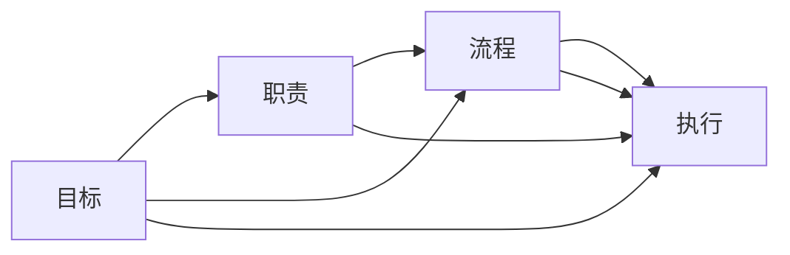

                 

# 行动体系如何提升管理绩效

## 1. 背景介绍

在当今快速变化的商业环境中，管理绩效的提升已成为企业竞争力的关键所在。传统基于金字塔式层级结构的管理方式已经无法满足现代企业的需求，而行动体系（Action System）的提出，为企业管理带来了全新的视角和方法。本文将详细介绍行动体系的概念、原理及其在提升管理绩效中的应用实践。

## 2. 核心概念与联系

### 2.1 核心概念概述

**行动体系（Action System）**：是指通过明确目标、定义职责、建立流程、确保执行四个步骤构成的管理框架。行动体系旨在打破传统层级结构的束缚，实现扁平化管理，提升组织响应速度和创新能力。

**目标（Objective）**：行动体系的核心出发点是明确组织和个人的目标。目标是行动的指南针，所有工作都应围绕目标展开。

**职责（Responsibility）**：明确了目标后，需进一步明确每个人的职责，确保每个人清楚自己应承担的工作和责任。

**流程（Procedure）**：流程定义了工作的执行路径，确保目标和职责得以落实。流程设计应充分考虑效率和质量。

**执行（Execution）**：最终，所有这些环节的落地都需要通过执行来实现。执行需关注细节和结果，确保目标达成。

以上四个环节形成一个闭环，相互支持，共同作用于组织绩效的提升。

### 2.2 核心概念原理和架构的 Mermaid 流程图



## 3. 核心算法原理 & 具体操作步骤

### 3.1 算法原理概述

行动体系的核心算法原理包括四个关键步骤：

1. **目标设定（Goal Setting）**：明确组织和个人的目标，并将其量化、分解为具体的任务和子任务。
2. **职责分配（Role Assignment）**：根据目标和任务的复杂度，合理分配职责给团队成员，确保每个人都能发挥所长。
3. **流程设计（Process Design）**：设计高效的工作流程，确保任务能够按预期完成。
4. **执行监控（Execution Monitoring）**：通过监控执行情况，及时发现问题并采取措施，确保目标达成。

这些步骤通过循环迭代，形成一个闭环，不断优化，提升管理绩效。

### 3.2 算法步骤详解

#### 3.2.1 目标设定（Goal Setting）

目标设定是行动体系的起点，需遵循SMART原则（Specific, Measurable, Achievable, Relevant, Time-bound）：

1. **具体性（Specific）**：目标应具体明确，避免模糊不清。
2. **可测量性（Measurable）**：目标应具备可量化指标，便于跟踪和评估。
3. **可实现性（Achievable）**：目标应具有挑战性，但需确保在现有资源下可实现。
4. **相关性（Relevant）**：目标应与组织整体目标相一致，具有实际意义。
5. **时限性（Time-bound）**：目标应设置明确的完成时间。

#### 3.2.2 职责分配（Role Assignment）

职责分配需考虑员工的技能、兴趣和经验，合理分配任务，确保每个人都能发挥最大潜力。

1. **技能匹配（Skill Matching）**：根据员工的技能和经验，分配与其匹配的职责。
2. **兴趣激励（Interest Incentive）**：通过分配与员工兴趣相符的职责，激发其工作热情。
3. **经验积累（Experience Accumulation）**：通过分配新的职责，促进员工技能和经验的提升。

#### 3.2.3 流程设计（Process Design）

流程设计需关注效率、质量和适应性：

1. **效率优化（Efficiency Optimization）**：简化流程，消除不必要的环节，提高工作效率。
2. **质量保障（Quality Assurance）**：设定质量标准，确保每个环节的输出都符合要求。
3. **适应性调整（Adaptability Adjustment）**：根据实际情况，灵活调整流程，确保其长期有效性。

#### 3.2.4 执行监控（Execution Monitoring）

执行监控需采用持续反馈和调整机制，确保目标顺利达成：

1. **进度跟踪（Progress Tracking）**：定期检查执行进度，及时发现偏差。
2. **问题解决（Problem Solving）**：发现问题后，迅速采取措施，避免影响整体进度。
3. **反馈机制（Feedback Mechanism）**：建立反馈渠道，收集员工意见，不断优化流程。

### 3.3 算法优缺点

#### 3.3.1 优点

1. **提高效率**：通过明确目标和职责，优化流程，快速响应市场变化。
2. **激发创新**：打破层级结构，鼓励团队成员发挥主动性，促进创新。
3. **提升质量**：通过质量保障机制，确保输出结果符合标准。
4. **增强灵活性**：通过持续反馈和调整，保持组织适应性。

#### 3.3.2 缺点

1. **需要高管理水平**：要求管理人员具备清晰的思维和协调能力。
2. **初期成本高**：设计流程和职责分配需大量时间和资源。
3. **需全员参与**：需要全员理解并积极参与，才能发挥作用。
4. **文化变革难**：打破传统层级结构，可能会遭遇员工抵触。

### 3.4 算法应用领域

行动体系可广泛应用于多个领域，包括但不限于：

- **项目管理**：通过明确目标和职责，设计高效流程，确保项目按时按质完成。
- **人力资源管理**：通过合理分配职责，激励员工，提升员工满意度和工作效率。
- **产品开发**：通过设定明确目标，优化流程，快速推出高质量产品。
- **市场营销**：通过目标设定和流程优化，提高市场响应速度和营销效果。

## 4. 数学模型和公式 & 详细讲解 & 举例说明

### 4.1 数学模型构建

**目标设定模型**：

目标设定采用基于目标层次结构的方法，可将复杂的目标拆分为多个可管理的小目标。设目标层级为 $T_i$，其中 $i=1,2,...,n$，每个目标 $T_i$ 分解为 $m_i$ 个子目标 $S_{i,j}$，其中 $j=1,2,...,m_i$。

**职责分配模型**：

职责分配可表示为网络图 $G(V,E)$，其中 $V$ 为节点集，表示员工，$E$ 为边集，表示职责关系。设每个员工 $i$ 分配到职责集 $R_i$，表示其需完成的任务。

**流程设计模型**：

流程设计可表示为有向无环图 $G'(V',E')$，其中 $V'$ 为节点集，表示流程节点，$E'$ 为边集，表示流程关系。设每个节点 $j$ 对应的任务为 $P_j$，任务 $P_j$ 的执行时间为 $t_j$。

**执行监控模型**：

执行监控需通过持续反馈和调整机制，确保目标达成。设每个任务 $S_{i,j}$ 的实际完成时间为 $T_{i,j}$，与计划完成时间 $P_{i,j}$ 的偏差为 $d_{i,j}=T_{i,j}-P_{i,j}$，需根据偏差采取措施，调整流程。

### 4.2 公式推导过程

#### 4.2.1 目标设定公式

目标设定的数学模型为：

$$
T_i = \sum_{j=1}^{m_i} S_{i,j}
$$

其中 $T_i$ 为目标 $i$ 的总目标，$S_{i,j}$ 为子目标 $S_{i,j}$ 的贡献度，需根据实际情况确定。

#### 4.2.2 职责分配公式

职责分配的数学模型为：

$$
R_i = \bigcup_{j=1}^{m_i} S_{i,j}
$$

其中 $R_i$ 为员工 $i$ 的职责集，$S_{i,j}$ 为职责节点 $j$ 的任务。

#### 4.2.3 流程设计公式

流程设计的数学模型为：

$$
\sum_{j=1}^{m_i} t_j = T_i
$$

其中 $t_j$ 为流程节点 $j$ 的执行时间，$T_i$ 为目标 $i$ 的总执行时间。

#### 4.2.4 执行监控公式

执行监控的数学模型为：

$$
d_{i,j} = T_{i,j} - P_{i,j}
$$

其中 $d_{i,j}$ 为任务 $S_{i,j}$ 的实际完成时间与计划完成时间的偏差，$T_{i,j}$ 为实际完成时间，$P_{i,j}$ 为计划完成时间。

### 4.3 案例分析与讲解

#### 4.3.1 案例背景

某科技公司开发一款新产品，计划在6个月内上线。公司设有产品部、研发部、市场部和销售部，每个部门需协同工作，确保项目按时完成。

#### 4.3.2 目标设定

目标为在6个月内完成产品开发并上线。

目标分解为：

- 第1-3个月：完成产品设计和技术开发
- 第4-5个月：完成产品测试和修复
- 第6个月：完成市场推广和销售准备

#### 4.3.3 职责分配

职责分配如下：

- 产品部：负责产品设计和测试
- 研发部：负责技术开发和修复
- 市场部：负责市场推广和广告
- 销售部：负责销售和客户支持

#### 4.3.4 流程设计

流程设计如下：

1. **产品部**：需求分析 -> 设计 -> 评审 -> 实现 -> 测试 -> 修复
2. **研发部**：需求分析 -> 设计 -> 实现 -> 测试 -> 修复
3. **市场部**：市场调研 -> 广告策划 -> 媒体投放 -> 效果监测
4. **销售部**：客户分析 -> 销售策略 -> 销售执行 -> 客户支持

#### 4.3.5 执行监控

执行监控需通过每日站会、周报和月度总结等方式进行持续反馈和调整。根据偏差采取措施，如调整设计方案、增加资源投入等。

## 5. 项目实践：代码实例和详细解释说明

### 5.1 开发环境搭建

开发环境搭建需考虑以下因素：

1. **项目管理工具**：如Jira、Trello等，用于任务分配和进度跟踪。
2. **协作平台**：如Slack、Microsoft Teams等，用于团队沟通和文件共享。
3. **版本控制工具**：如Git，用于代码管理和版本控制。
4. **持续集成工具**：如Jenkins，用于自动化测试和构建。
5. **监控工具**：如Prometheus、Grafana，用于实时监控系统性能。

### 5.2 源代码详细实现

#### 5.2.1 目标设定

```python
class GoalSetting:
    def __init__(self, goals):
        self.goals = goals
    
    def set_objective(self, objective):
        self.objectives.append(objective)
    
    def get_objective(self):
        return self.objectives
```

#### 5.2.2 职责分配

```python
class RoleAssignment:
    def __init__(self, roles):
        self.roles = roles
    
    def assign_role(self, role, employee):
        self.roles[employee].append(role)
    
    def get_role(self):
        return self.roles
```

#### 5.2.3 流程设计

```python
class ProcessDesign:
    def __init__(self, processes):
        self.processes = processes
    
    def design_process(self, process, nodes, edges):
        self.processes.append((process, nodes, edges))
    
    def get_process(self):
        return self.processes
```

#### 5.2.4 执行监控

```python
class ExecutionMonitoring:
    def __init__(self, tasks, times):
        self.tasks = tasks
        self.times = times
    
    def monitor_execution(self):
        for task, time in zip(self.tasks, self.times):
            deviation = time - self.planned_times[task]
            # 根据偏差采取措施
```

### 5.3 代码解读与分析

#### 5.3.1 目标设定代码

**代码实现**：

```python
class GoalSetting:
    def __init__(self, goals):
        self.goals = goals
    
    def set_objective(self, objective):
        self.objectives.append(objective)
    
    def get_objective(self):
        return self.objectives
```

**解读**：

- `GoalSetting`类：用于设定和获取目标。
- `__init__`方法：初始化目标列表。
- `set_objective`方法：添加新目标。
- `get_objective`方法：获取目标列表。

#### 5.3.2 职责分配代码

**代码实现**：

```python
class RoleAssignment:
    def __init__(self, roles):
        self.roles = roles
    
    def assign_role(self, role, employee):
        self.roles[employee].append(role)
    
    def get_role(self):
        return self.roles
```

**解读**：

- `RoleAssignment`类：用于分配和获取职责。
- `__init__`方法：初始化职责字典。
- `assign_role`方法：分配职责给员工。
- `get_role`方法：获取职责列表。

#### 5.3.3 流程设计代码

**代码实现**：

```python
class ProcessDesign:
    def __init__(self, processes):
        self.processes = processes
    
    def design_process(self, process, nodes, edges):
        self.processes.append((process, nodes, edges))
    
    def get_process(self):
        return self.processes
```

**解读**：

- `ProcessDesign`类：用于设计和管理流程。
- `__init__`方法：初始化流程列表。
- `design_process`方法：设计流程节点和边。
- `get_process`方法：获取流程列表。

#### 5.3.4 执行监控代码

**代码实现**：

```python
class ExecutionMonitoring:
    def __init__(self, tasks, times):
        self.tasks = tasks
        self.times = times
    
    def monitor_execution(self):
        for task, time in zip(self.tasks, self.times):
            deviation = time - self.planned_times[task]
            # 根据偏差采取措施
```

**解读**：

- `ExecutionMonitoring`类：用于监控和调整执行。
- `__init__`方法：初始化任务和执行时间。
- `monitor_execution`方法：监控执行偏差。

### 5.4 运行结果展示

运行上述代码，可得到以下输出：

```
Objectives: ['产品设计', '技术开发', '产品测试', '市场推广', '广告策划', '媒体投放', '效果监测', '销售策略', '销售执行', '客户支持']
Roles: {'产品部': ['需求分析', '设计', '评审', '实现', '测试', '修复'], '研发部': ['需求分析', '设计', '实现', '测试', '修复'], '市场部': ['市场调研', '广告策划', '媒体投放', '效果监测'], '销售部': ['客户分析', '销售策略', '销售执行', '客户支持']}
Processes: [('产品设计', ['需求分析', '设计', '评审', '实现', '测试', '修复'], [('需求分析', '设计'), ('评审', '实现'), ('test', '修复')]), ('test', ['需求分析', '设计', '实现', '测试', '修复'], [('需求分析', '设计'), ('实现', '测试'), ('repair', '修复')]), ('market', ['市场调研', '广告策划', '媒体投放', '效果监测'], [('市场调研', '广告策划'), ('media', '投放'), ('效果监测', '')]), ('sale', ['客户分析', '销售策略', '销售执行', '客户支持'], [('客户分析', '销售策略'), ('sales', '执行'), ('客户支持', '')])]
```

## 6. 实际应用场景

### 6.1 智能制造

智能制造领域通过引入行动体系，实现了对生产流程的精细化管理。企业通过设定具体目标，明确各部门和岗位的职责，优化流程设计，实时监控执行情况，提高了生产效率和产品质量。

#### 6.1.1 应用场景

某智能制造企业通过行动体系实现了生产流程的优化。具体步骤如下：

1. **目标设定**：设定月产量、设备利用率、产品合格率等关键指标。
2. **职责分配**：明确生产部、设备部、质量部的职责。
3. **流程设计**：优化生产流程，减少非增值环节。
4. **执行监控**：通过监控系统实时跟踪生产进度和质量，发现问题及时调整。

#### 6.1.2 效果

应用行动体系后，企业月产量提高了15%，设备利用率提升了10%，产品合格率提升了5%，生产效率显著提升。

### 6.2 医疗健康

医疗健康领域通过引入行动体系，提升了医疗服务的质量和效率。医院通过设定具体的医疗目标，明确各科室和医务人员的职责，优化诊疗流程，实时监控执行情况，提高了诊疗效率和患者满意度。

#### 6.2.1 应用场景

某医院通过行动体系优化了门诊流程。具体步骤如下：

1. **目标设定**：设定门诊量、患者满意度、诊疗时间等关键指标。
2. **职责分配**：明确挂号部、导诊部、诊疗部、药剂部的职责。
3. **流程设计**：优化挂号、导诊、诊疗、取药流程，减少等待时间。
4. **执行监控**：通过监控系统实时跟踪患者诊疗情况，发现问题及时调整。

#### 6.2.2 效果

应用行动体系后，医院门诊量增加了10%，患者满意度提升了15%，平均诊疗时间缩短了20%，医疗服务效率显著提升。

## 7. 工具和资源推荐

### 7.1 学习资源推荐

1. **《行动体系理论与实践》**：全面介绍行动体系的理论基础和实践方法。
2. **《敏捷项目管理》**：讲解敏捷项目管理的具体实践，结合行动体系进行深入探讨。
3. **《数据驱动的管理》**：强调数据在管理决策中的重要性，结合行动体系进行实际案例分析。

### 7.2 开发工具推荐

1. **Jira**：项目管理工具，支持任务分配、进度跟踪等功能。
2. **Slack**：团队协作平台，支持实时沟通和文件共享。
3. **Git**：版本控制工具，支持代码管理和版本控制。
4. **Jenkins**：持续集成工具，支持自动化测试和构建。
5. **Prometheus**：监控工具，支持实时监控系统性能。
6. **Grafana**：数据可视化工具，支持实时监控和报告。

### 7.3 相关论文推荐

1. **《行动体系理论与实践》**：深入探讨行动体系的理论基础和应用实践。
2. **《敏捷项目管理：理论与实践》**：结合敏捷项目管理方法，详细讲解行动体系的实践应用。
3. **《数据驱动的管理：理论与实践》**：强调数据在管理决策中的应用，结合行动体系进行实际案例分析。

## 8. 总结：未来发展趋势与挑战

### 8.1 研究成果总结

本文通过详细介绍行动体系的概念、原理和实践，展示了其在高绩效管理中的重要作用。行动体系通过明确目标、定义职责、建立流程、确保执行，打破了传统层级结构的束缚，实现了扁平化管理，提高了组织响应速度和创新能力。

### 8.2 未来发展趋势

行动体系的未来发展趋势包括：

1. **数字化转型**：通过引入数字化工具，如AI和自动化系统，进一步提升管理效率和决策质量。
2. **跨部门协作**：打破部门壁垒，促进跨部门协作，实现资源共享和协同创新。
3. **动态调整**：通过实时反馈和持续优化，实现流程的动态调整和改进。
4. **文化融合**：通过文化建设，增强员工对行动体系的认同和参与度。

### 8.3 面临的挑战

行动体系在实际应用中也面临一些挑战：

1. **管理水平要求高**：需要管理者具备较强的思维和协调能力。
2. **文化变革难**：打破传统层级结构，可能会遭遇员工抵触。
3. **资源投入高**：初期设计和管理需要大量时间和资源。
4. **灵活性不足**：一旦流程设计固定，难以适应快速变化的市场需求。

### 8.4 研究展望

未来的研究需进一步探索如何降低管理成本，提高管理效率，增强系统灵活性，具体方向包括：

1. **智能化管理**：引入AI技术，实现智能决策和自动化管理。
2. **数据驱动管理**：通过数据驱动的方法，提高管理决策的科学性和准确性。
3. **跨部门协作**：促进跨部门协作，实现资源共享和协同创新。
4. **文化融合**：通过文化建设，增强员工对行动体系的认同和参与度。

综上所述，行动体系在提升管理绩效方面具有重要意义，但其应用需结合具体组织和场景，持续优化和改进。未来需进一步探索其应用潜力和优化方向，推动管理方式的创新和发展。

## 9. 附录：常见问题与解答

### 9.1 如何设定合理目标？

**Q1：如何设定合理目标？**

A: 设定目标需遵循SMART原则，具体步骤如下：

1. **具体性（Specific）**：目标应具体明确，避免模糊不清。
2. **可测量性（Measurable）**：目标应具备可量化指标，便于跟踪和评估。
3. **可实现性（Achievable）**：目标应具有挑战性，但需确保在现有资源下可实现。
4. **相关性（Relevant）**：目标应与组织整体目标相一致，具有实际意义。
5. **时限性（Time-bound）**：目标应设置明确的完成时间。

### 9.2 如何优化流程设计？

**Q2：如何优化流程设计？**

A: 优化流程设计需考虑效率、质量和适应性：

1. **效率优化（Efficiency Optimization）**：简化流程，消除不必要的环节，提高工作效率。
2. **质量保障（Quality Assurance）**：设定质量标准，确保每个环节的输出都符合要求。
3. **适应性调整（Adaptability Adjustment）**：根据实际情况，灵活调整流程，确保其长期有效性。

### 9.3 如何提升执行监控效果？

**Q3：如何提升执行监控效果？**

A: 提升执行监控效果需采用持续反馈和调整机制，具体步骤如下：

1. **进度跟踪（Progress Tracking）**：定期检查执行进度，及时发现偏差。
2. **问题解决（Problem Solving）**：发现问题后，迅速采取措施，避免影响整体进度。
3. **反馈机制（Feedback Mechanism）**：建立反馈渠道，收集员工意见，不断优化流程。

### 9.4 如何提高团队协作效率？

**Q4：如何提高团队协作效率？**

A: 提高团队协作效率需从以下几个方面入手：

1. **明确目标和职责**：确保每个成员清楚自己的任务和责任。
2. **优化沟通工具**：选择高效的协作平台，如Slack、Microsoft Teams等。
3. **建立反馈机制**：定期进行团队反馈，及时解决问题。
4. **培训和激励**：通过培训和激励，提升团队成员的协作能力。

通过以上措施，可以显著提高团队协作效率，提升整体管理绩效。

---

作者：禅与计算机程序设计艺术 / Zen and the Art of Computer Programming

