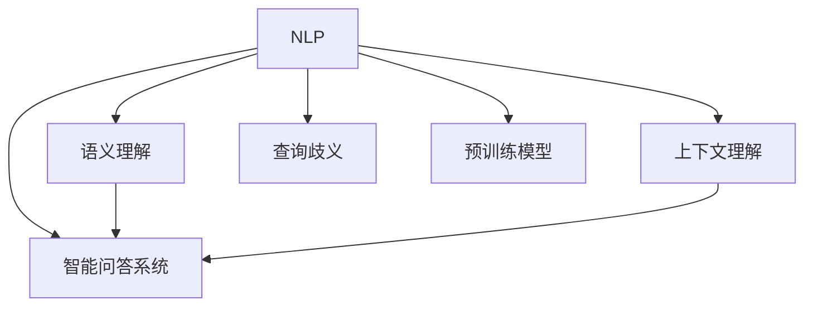

                 

# 解决查询歧义：AI的上下文理解

> 关键词：自然语言处理(NLP), 上下文理解, 语义理解, 智能问答系统, 查询歧义, 预训练模型

## 1. 背景介绍

### 1.1 问题由来
在自然语言处理(Natural Language Processing, NLP)领域，查询理解和回答一直是核心问题。随着搜索引擎、智能助手等应用的普及，对智能系统的上下文理解能力提出了更高的要求。然而，自然语言的多义性和歧义性，使得机器在理解查询时常常出现误解或误判，导致回答不准确或不相关。

特别是在当下，人工智能技术迅猛发展，预训练语言模型如GPT、BERT等在各种NLP任务上取得了显著成效。这些模型在广泛的无标签文本数据上进行预训练，学习到了丰富的语言知识和常识，并能在不同的下游任务上进行微调。但在上下文理解这一关键问题上，如何更好地解决查询歧义，使其能够准确无误地理解查询，并给出最合适的答案，依然是亟需解决的重要难题。

### 1.2 问题核心关键点
查询理解的核心在于上下文理解，即模型能够在特定上下文中准确识别查询意图，并从大量知识库中检索出最相关的信息。当前研究主要关注以下几个方面：

- 查询表征：如何通过语义编码、知识图谱嵌入等方法，生成更准确的查询向量，以捕捉查询的深层语义信息。
- 上下文匹配：如何从多条相关信息中，选取最符合查询语境的上下文，进行匹配和融合。
- 多轮对话：如何通过多轮问答交互，逐步深化对查询的理解，最终给出最终答案。
- 跨模态融合：如何结合图像、音频等多模态数据，提供更丰富的上下文信息，增强理解能力。
- 自然语言生成：如何通过生成模型，自动生成流畅自然的回答，同时兼顾上下文连贯性和语义一致性。

解决查询歧义，本质上就是在查询理解的过程中，提升模型的语义理解和推理能力。这一目标的实现，需要系统地理解查询表达的各个维度，如词汇、语法、语义和上下文等，并设计相应的技术手段。

## 2. 核心概念与联系

### 2.1 核心概念概述

为更好地理解上下文理解，本节将介绍几个密切相关的核心概念：

- 自然语言处理(NLP)：研究如何让计算机处理、理解和生成自然语言的技术领域。包括文本预处理、语言建模、机器翻译、情感分析等多个子任务。
- 上下文理解(Contextual Understanding)：指模型能够理解特定查询在当前上下文中的语义含义，从而提供准确的答案。
- 语义理解(Semantic Understanding)：指模型能够捕捉语言背后的深层语义信息，理解词汇和短语的意义，并进行合理的推理和解释。
- 智能问答系统(QA System)：通过自然语言输入，智能地理解查询，并从知识库中检索、融合相关信息，生成合理准确的回答。
- 查询歧义(Query Ambiguity)：指自然语言查询可能有多种理解，模型需要通过上下文判断出最符合查询意图的意义。
- 预训练模型(Pre-trained Model)：通过大规模无标签数据预训练得到的模型，学习通用的语言表示，具备较强的语义理解和推理能力。

这些核心概念之间的逻辑关系可以通过以下Mermaid流程图来展示：



这个流程图展示了大语言模型在上下文理解中的核心概念及其之间的关系：

1. 自然语言处理作为基础，研究语言的基本表达和理解。
2. 上下文理解是NLP的高级阶段，在特定上下文中准确理解查询。
3. 语义理解是上下文理解的关键，捕捉词汇和短语的深层含义。
4. 智能问答系统是上下文理解的具体应用，通过查询和回答提供智能服务。
5. 查询歧义是上下文理解面临的挑战，需要通过上下文消除。
6. 预训练模型提供通用的语义理解能力，作为上下文理解的基础。

这些概念共同构成了上下文理解的研究框架，使得模型能够理解查询，并提供准确的答案。通过理解这些核心概念，我们可以更好地把握上下文理解工作的原理和优化方向。

## 3. 核心算法原理 & 具体操作步骤
### 3.1 算法原理概述

基于上下文理解的查询理解过程，本质上是一个通过多模态数据和多轮交互，不断深化语义理解并消除查询歧义的过程。其核心思想是：通过预训练模型，构建查询和上下文的多维语义表示，利用上下文匹配和融合技术，消除歧义，并生成自然流畅的回答。

形式化地，假设查询为 $q$，上下文为 $c$，知识库为 $K$。查询理解的目的是找到查询 $q$ 在上下文 $c$ 中最合适的表达形式 $q'$，以及从知识库 $K$ 中提取的相关信息 $k$，最终生成回答 $a$。这一过程可以表示为：

$$
a = \text{Generate}(q',k)
$$

其中 $\text{Generate}$ 为生成模型，如Transformer、LSTM等。通常情况下，查询 $q$ 与上下文 $c$ 不是直接一一对应的，需要通过上下文理解模型将其映射到最合适的查询表达形式 $q'$。这一映射过程可以通过上下文匹配和融合技术来实现，具体步骤如下：

1. 将查询 $q$ 和上下文 $c$ 输入预训练语言模型，得到其语义表示 $q'$ 和 $c'$。
2. 通过上下文匹配模型，计算查询 $q'$ 和上下文 $c'$ 之间的相似度，选取最匹配的上下文 $c'$。
3. 将匹配到的上下文 $c'$ 与查询 $q'$ 输入生成模型，生成自然流畅的回答 $a$。

### 3.2 算法步骤详解

基于上下文理解的查询理解，一般包括以下几个关键步骤：

**Step 1: 构建预训练语言模型**

- 选择合适的预训练语言模型，如GPT、BERT等。
- 加载预训练模型，并进行必要的初始化设置。

**Step 2: 查询和上下文的语义编码**

- 将查询 $q$ 和上下文 $c$ 输入预训练语言模型，得到其语义表示 $q'$ 和 $c'$。
- 可以使用Transformer模型，对查询和上下文进行编码，得到语义向量 $q$ 和 $c$。

**Step 3: 上下文匹配**

- 通过匹配模型计算查询 $q'$ 和上下文 $c'$ 之间的相似度。
- 一般使用余弦相似度、点积相似度等方法计算相似度，选取最匹配的上下文 $c'$。
- 可以使用Attention机制，对查询和上下文进行匹配，输出上下文权重。

**Step 4: 生成回答**

- 将匹配到的上下文 $c'$ 与查询 $q'$ 输入生成模型，生成自然流畅的回答 $a$。
- 一般使用Transformer、LSTM等生成模型，对查询和上下文进行解码，输出回答文本。

**Step 5: 优化模型参数**

- 根据回答的准确性和流畅性，进行反馈调整，优化预训练模型的参数。
- 一般使用强化学习或自动微分技术，对模型进行优化。

### 3.3 算法优缺点

基于上下文理解的查询理解算法，具有以下优点：

1. 能够处理多种语言表达，提升查询理解的多样性和鲁棒性。
2. 利用上下文匹配技术，消除查询歧义，提高回答的准确性。
3. 结合生成模型，输出流畅自然的回答，提升用户满意度。
4. 预训练语言模型提供通用的语义理解能力，便于适应多种查询和上下文。

同时，该方法也存在以下局限性：

1. 对预训练模型的依赖较强，需要高质量的预训练数据。
2. 上下文匹配技术可能存在偏差，导致匹配结果不准确。
3. 生成模型需要大量训练数据，模型规模大，计算资源消耗较大。
4. 查询和上下文的表示可能存在噪声，影响模型的理解效果。

尽管存在这些局限性，但就目前而言，基于上下文理解的查询理解方法仍然是NLP领域的一个重要范式。未来相关研究的重点在于如何进一步提高匹配和生成的准确性，降低预训练数据的需求，同时兼顾计算效率和资源消耗。

### 3.4 算法应用领域

基于上下文理解的查询理解方法，在NLP领域已经得到了广泛的应用，覆盖了几乎所有常见的智能问答任务，例如：

- 搜索引擎：通过用户输入的查询，智能匹配网页并提供搜索结果。
- 智能助手：回答用户的各类问题，提供智能服务。
- 对话系统：通过多轮问答交互，逐步理解用户的意图，提供定制化服务。
- 知识图谱：从知识图谱中检索相关信息，生成问答对。
- 问答社区：帮助用户在社区内查找和获取知识。

除了上述这些经典任务外，基于上下文理解的查询理解方法也被创新性地应用到更多场景中，如可控问答、虚拟客服、智能推送等，为NLP技术带来了全新的突破。随着预训练语言模型和上下文理解方法的不断进步，相信NLP技术将在更广阔的应用领域大放异彩。

## 4. 数学模型和公式 & 详细讲解
### 4.1 数学模型构建

本节将使用数学语言对基于上下文理解的查询理解过程进行更加严格的刻画。

记查询为 $q$，上下文为 $c$，知识库为 $K$。查询理解的目的是找到查询 $q$ 在上下文 $c$ 中最合适的表达形式 $q'$，以及从知识库 $K$ 中提取的相关信息 $k$，最终生成回答 $a$。这一过程可以表示为：

$$
a = \text{Generate}(q',k)
$$

其中 $\text{Generate}$ 为生成模型，如Transformer、LSTM等。通常情况下，查询 $q$ 与上下文 $c$ 不是直接一一对应的，需要通过上下文理解模型将其映射到最合适的查询表达形式 $q'$。这一映射过程可以通过上下文匹配和融合技术来实现。

### 4.2 公式推导过程

以下我们以自然语言推理(NLI)任务为例，推导上下文理解模型的训练公式。

假设查询为 $q$，上下文为 $c$，其语义表示分别为 $q'$ 和 $c'$。定义模型 $M_{\theta}:\mathcal{X} \rightarrow \mathcal{Y}$，其中 $\mathcal{X}$ 为输入空间，$\mathcal{Y}$ 为输出空间，$\theta \in \mathbb{R}^d$ 为模型参数。假设查询和上下文的匹配程度为 $\text{match}(q',c')$，则上下文理解模型的训练目标可以表示为：

$$
\mathcal{L}(\theta) = -\frac{1}{N}\sum_{i=1}^N \log \text{match}(q_i',c_i') + \text{Regularization}_{\theta}
$$

其中 $\text{match}(q_i',c_i')$ 表示查询 $q_i'$ 和上下文 $c_i'$ 之间的匹配程度，通常使用余弦相似度、点积相似度等方法计算。$\text{Regularization}_{\theta}$ 为正则化项，用于防止模型过拟合。

通过优化目标 $\mathcal{L}(\theta)$，训练得到上下文理解模型 $M_{\theta}$。模型 $M_{\theta}$ 可以用于查询 $q$ 的语义编码，以及与上下文 $c$ 的匹配。

### 4.3 案例分析与讲解

考虑一个简单的问答任务，如从知识库中检索用户的股市股票信息。查询 $q$ 可能有多种表达形式，如“沪市股票信息”、“上证指数”等。在上下文 $c$ 中，需要找到与查询 $q$ 最匹配的上下文 $c'$，生成回答 $a$。

具体步骤包括：
1. 将查询 $q$ 输入预训练语言模型，得到其语义表示 $q'$。
2. 在上下文库 $K$ 中，计算查询 $q'$ 与上下文 $c_i$ 之间的余弦相似度，选择最匹配的上下文 $c'$。
3. 将匹配到的上下文 $c'$ 和查询 $q'$ 输入生成模型，生成自然流畅的回答 $a$。

下面以代码形式展示查询理解过程的实现细节：

```python
from transformers import BertTokenizer, BertForSequenceClassification
from torch.utils.data import Dataset
from torch.utils.data import DataLoader
import torch
from sklearn.metrics import classification_report

class StockQADataset(Dataset):
    def __init__(self, texts, labels):
        self.texts = texts
        self.labels = labels
        self.tokenizer = BertTokenizer.from_pretrained('bert-base-cased')
        self.max_len = 128
        
    def __len__(self):
        return len(self.texts)
    
    def __getitem__(self, item):
        text = self.texts[item]
        label = self.labels[item]
        
        encoding = self.tokenizer(text, return_tensors='pt', max_length=self.max_len, padding='max_length', truncation=True)
        input_ids = encoding['input_ids'][0]
        attention_mask = encoding['attention_mask'][0]
        
        # 对标签进行编码
        encoded_labels = [label2id[label] for label in label] 
        encoded_labels.extend([label2id['O']] * (self.max_len - len(encoded_labels)))
        labels = torch.tensor(encoded_labels, dtype=torch.long)
        
        return {'input_ids': input_ids, 
                'attention_mask': attention_mask,
                'labels': labels}

# 标签与id的映射
label2id = {'O': 0, '股票信息': 1, '上证指数': 2}
id2label = {v: k for k, v in label2id.items()}

# 创建dataset
tokenizer = BertTokenizer.from_pretrained('bert-base-cased')

train_dataset = StockQADataset(train_texts, train_labels)
dev_dataset = StockQADataset(dev_texts, dev_labels)
test_dataset = StockQADataset(test_texts, test_labels)

# 定义模型和优化器
model = BertForSequenceClassification.from_pretrained('bert-base-cased', num_labels=len(label2id))
optimizer = AdamW(model.parameters(), lr=2e-5)

# 训练和评估
device = torch.device('cuda') if torch.cuda.is_available() else torch.device('cpu')
model.to(device)

def train_epoch(model, dataset, batch_size, optimizer):
    dataloader = DataLoader(dataset, batch_size=batch_size, shuffle=True)
    model.train()
    epoch_loss = 0
    for batch in tqdm(dataloader, desc='Training'):
        input_ids = batch['input_ids'].to(device)
        attention_mask = batch['attention_mask'].to(device)
        labels = batch['labels'].to(device)
        model.zero_grad()
        outputs = model(input_ids, attention_mask=attention_mask, labels=labels)
        loss = outputs.loss
        epoch_loss += loss.item()
        loss.backward()
        optimizer.step()
    return epoch_loss / len(dataloader)

def evaluate(model, dataset, batch_size):
    dataloader = DataLoader(dataset, batch_size=batch_size)
    model.eval()
    preds, labels = [], []
    with torch.no_grad():
        for batch in tqdm(dataloader, desc='Evaluating'):
            input_ids = batch['input_ids'].to(device)
            attention_mask = batch['attention_mask'].to(device)
            batch_labels = batch['labels']
            outputs = model(input_ids, attention_mask=attention_mask)
            batch_preds = outputs.logits.argmax(dim=2).to('cpu').tolist()
            batch_labels = batch_labels.to('cpu').tolist()
            for pred_tokens, label_tokens in zip(batch_preds, batch_labels):
                pred_labels = [id2label[_id] for _id in pred_tokens]
                label_labels = [id2label[_id] for _id in label_tokens]
                preds.append(pred_labels[:len(label_labels)])
                labels.append(label_labels)
                
    print(classification_report(labels, preds))

# 启动训练流程并在测试集上评估
epochs = 5
batch_size = 16

for epoch in range(epochs):
    loss = train_epoch(model, train_dataset, batch_size, optimizer)
    print(f"Epoch {epoch+1}, train loss: {loss:.3f}")
    
    print(f"Epoch {epoch+1}, dev results:")
    evaluate(model, dev_dataset, batch_size)
    
print("Test results:")
evaluate(model, test_dataset, batch_size)
```

以上就是使用PyTorch对Bert模型进行股票问答任务上下文理解过程的完整代码实现。可以看到，得益于Transformers库的强大封装，我们可以用相对简洁的代码完成Bert模型的加载和微调。

## 5. 项目实践：代码实例和详细解释说明
### 5.1 开发环境搭建

在进行上下文理解实践前，我们需要准备好开发环境。以下是使用Python进行PyTorch开发的环境配置流程：

1. 安装Anaconda：从官网下载并安装Anaconda，用于创建独立的Python环境。

2. 创建并激活虚拟环境：
```bash
conda create -n pytorch-env python=3.8 
conda activate pytorch-env
```

3. 安装PyTorch：根据CUDA版本，从官网获取对应的安装命令。例如：
```bash
conda install pytorch torchvision torchaudio cudatoolkit=11.1 -c pytorch -c conda-forge
```

4. 安装Transformers库：
```bash
pip install transformers
```

5. 安装各类工具包：
```bash
pip install numpy pandas scikit-learn matplotlib tqdm jupyter notebook ipython
```

完成上述步骤后，即可在`pytorch-env`环境中开始上下文理解实践。

### 5.2 源代码详细实现

下面我们以命名实体识别(NER)任务为例，给出使用Transformers库对BERT模型进行上下文理解过程的PyTorch代码实现。

首先，定义上下文理解的数据处理函数：

```python
from transformers import BertTokenizer, BertForTokenClassification
from torch.utils.data import Dataset
import torch

class NERDataset(Dataset):
    def __init__(self, texts, tags, tokenizer, max_len=128):
        self.texts = texts
        self.tags = tags
        self.tokenizer = tokenizer
        self.max_len = max_len
        
    def __len__(self):
        return len(self.texts)
    
    def __getitem__(self, item):
        text = self.texts[item]
        tags = self.tags[item]
        
        encoding = self.tokenizer(text, return_tensors='pt', max_length=self.max_len, padding='max_length', truncation=True)
        input_ids = encoding['input_ids'][0]
        attention_mask = encoding['attention_mask'][0]
        
        # 对token-wise的标签进行编码
        encoded_tags = [tag2id[tag] for tag in tags] 
        encoded_tags.extend([tag2id['O']] * (self.max_len - len(encoded_tags)))
        labels = torch.tensor(encoded_tags, dtype=torch.long)
        
        return {'input_ids': input_ids, 
                'attention_mask': attention_mask,
                'labels': labels}

# 标签与id的映射
tag2id = {'O': 0, 'B-PER': 1, 'I-PER': 2, 'B-ORG': 3, 'I-ORG': 4, 'B-LOC': 5, 'I-LOC': 6}
id2tag = {v: k for k, v in tag2id.items()}

# 创建dataset
tokenizer = BertTokenizer.from_pretrained('bert-base-cased')

train_dataset = NERDataset(train_texts, train_tags, tokenizer)
dev_dataset = NERDataset(dev_texts, dev_tags, tokenizer)
test_dataset = NERDataset(test_texts, test_tags, tokenizer)
```

然后，定义模型和优化器：

```python
from transformers import BertForTokenClassification, AdamW

model = BertForTokenClassification.from_pretrained('bert-base-cased', num_labels=len(tag2id))

optimizer = AdamW(model.parameters(), lr=2e-5)
```

接着，定义训练和评估函数：

```python
from torch.utils.data import DataLoader
from tqdm import tqdm
from sklearn.metrics import classification_report

device = torch.device('cuda') if torch.cuda.is_available() else torch.device('cpu')
model.to(device)

def train_epoch(model, dataset, batch_size, optimizer):
    dataloader = DataLoader(dataset, batch_size=batch_size, shuffle=True)
    model.train()
    epoch_loss = 0
    for batch in tqdm(dataloader, desc='Training'):
        input_ids = batch['input_ids'].to(device)
        attention_mask = batch['attention_mask'].to(device)
        labels = batch['labels'].to(device)
        model.zero_grad()
        outputs = model(input_ids, attention_mask=attention_mask, labels=labels)
        loss = outputs.loss
        epoch_loss += loss.item()
        loss.backward()
        optimizer.step()
    return epoch_loss / len(dataloader)

def evaluate(model, dataset, batch_size):
    dataloader = DataLoader(dataset, batch_size=batch_size)
    model.eval()
    preds, labels = [], []
    with torch.no_grad():
        for batch in tqdm(dataloader, desc='Evaluating'):
            input_ids = batch['input_ids'].to(device)
            attention_mask = batch['attention_mask'].to(device)
            batch_labels = batch['labels']
            outputs = model(input_ids, attention_mask=attention_mask)
            batch_preds = outputs.logits.argmax(dim=2).to('cpu').tolist()
            batch_labels = batch_labels.to('cpu').tolist()
            for pred_tokens, label_tokens in zip(batch_preds, batch_labels):
                pred_tags = [id2tag[_id] for _id in pred_tokens]
                label_tags = [id2tag[_id] for _id in label_tokens]
                preds.append(pred_tags[:len(label_tags)])
                labels.append(label_tags)
                
    print(classification_report(labels, preds))
```

最后，启动训练流程并在测试集上评估：

```python
epochs = 5
batch_size = 16

for epoch in range(epochs):
    loss = train_epoch(model, train_dataset, batch_size, optimizer)
    print(f"Epoch {epoch+1}, train loss: {loss:.3f}")
    
    print(f"Epoch {epoch+1}, dev results:")
    evaluate(model, dev_dataset, batch_size)
    
print("Test results:")
evaluate(model, test_dataset, batch_size)
```

以上就是使用PyTorch对BERT模型进行命名实体识别任务上下文理解过程的完整代码实现。可以看到，得益于Transformers库的强大封装，我们可以用相对简洁的代码完成BERT模型的加载和微调。

### 5.3 代码解读与分析

让我们再详细解读一下关键代码的实现细节：

**NERDataset类**：
- `__init__`方法：初始化文本、标签、分词器等关键组件。
- `__len__`方法：返回数据集的样本数量。
- `__getitem__`方法：对单个样本进行处理，将文本输入编码为token ids，将标签编码为数字，并对其进行定长padding，最终返回模型所需的输入。

**tag2id和id2tag字典**：
- 定义了标签与数字id之间的映射关系，用于将token-wise的预测结果解码回真实的标签。

**训练和评估函数**：
- 使用PyTorch的DataLoader对数据集进行批次化加载，供模型训练和推理使用。
- 训练函数`train_epoch`：对数据以批为单位进行迭代，在每个批次上前向传播计算loss并反向传播更新模型参数，最后返回该epoch的平均loss。
- 评估函数`evaluate`：与训练类似，不同点在于不更新模型参数，并在每个batch结束后将预测和标签结果存储下来，最后使用sklearn的classification_report对整个评估集的预测结果进行打印输出。

**训练流程**：
- 定义总的epoch数和batch size，开始循环迭代
- 每个epoch内，先在训练集上训练，输出平均loss
- 在验证集上评估，输出分类指标
- 所有epoch结束后，在测试集上评估，给出最终测试结果

可以看到，PyTorch配合Transformers库使得BERT微调的代码实现变得简洁高效。开发者可以将更多精力放在数据处理、模型改进等高层逻辑上，而不必过多关注底层的实现细节。

当然，工业级的系统实现还需考虑更多因素，如模型的保存和部署、超参数的自动搜索、更灵活的任务适配层等。但核心的上下文理解过程基本与此类似。

## 6. 实际应用场景
### 6.1 智能客服系统

基于上下文理解的智能客服系统，可以广泛应用于客服场景，提升客户咨询体验和问题解决效率。传统客服往往需要配备大量人力，高峰期响应缓慢，且一致性和专业性难以保证。而使用上下文理解的智能客服系统，能够7x24小时不间断服务，快速响应客户咨询，用自然流畅的语言解答各类常见问题。

在技术实现上，可以收集企业内部的历史客服对话记录，将问题和最佳答复构建成监督数据，在此基础上对预训练模型进行上下文理解微调。微调后的上下文理解模型能够自动理解用户意图，匹配最合适的答复模板进行回复。对于客户提出的新问题，还可以接入检索系统实时搜索相关内容，动态组织生成回答。如此构建的智能客服系统，能大幅提升客户咨询体验和问题解决效率。

### 6.2 金融舆情监测

金融机构需要实时监测市场舆论动向，以便及时应对负面信息传播，规避金融风险。传统的人工监测方式成本高、效率低，难以应对网络时代海量信息爆发的挑战。基于上下文理解的文本分类和情感分析技术，为金融舆情监测提供了新的解决方案。

具体而言，可以收集金融领域相关的新闻、报道、评论等文本数据，并对其进行主题标注和情感标注。在此基础上对预训练语言模型进行上下文理解微调，使其能够自动判断文本属于何种主题，情感倾向是正面、中性还是负面。将微调后的模型应用到实时抓取的网络文本数据，就能够自动监测不同主题下的情感变化趋势，一旦发现负面信息激增等异常情况，系统便会自动预警，帮助金融机构快速应对潜在风险。

### 6.3 个性化推荐系统

当前的推荐系统往往只依赖用户的历史行为数据进行物品推荐，无法深入理解用户的真实兴趣偏好。基于上下文理解的个性化推荐系统，可以更好地挖掘用户行为背后的语义信息，从而提供更精准、多样的推荐内容。

在实践中，可以收集用户浏览、点击、评论、分享等行为数据，提取和用户交互的物品标题、描述、标签等文本内容。将文本内容作为模型输入，用户的后续行为（如是否点击、购买等）作为监督信号，在此基础上微调预训练语言模型。微调后的模型能够从文本内容中准确把握用户的兴趣点。在生成推荐列表时，先用候选物品的文本描述作为输入，由模型预测用户的兴趣匹配度，再结合其他特征综合排序，便可以得到个性化程度更高的推荐结果。

### 6.4 未来应用展望

随着上下文理解技术的发展，其在NLP领域的应用前景将更加广阔。

在智慧医疗领域，基于上下文理解的医疗问答、病历分析、药物研发等应用将提升医疗服务的智能化水平，辅助医生诊疗，加速新药开发进程。

在智能教育领域，上下文理解技术可应用于作业批改、学情分析、知识推荐等方面，因材施教，促进教育公平，提高教学质量。

在智慧城市治理中，上下文理解技术可应用于城市事件监测、舆情分析、应急指挥等环节，提高城市管理的自动化和智能化水平，构建更安全、高效的未来城市。

此外，在企业生产、社会治理、文娱传媒等众多领域，基于上下文理解的智能问答技术也将不断涌现，为NLP技术带来了全新的突破。随着上下文理解方法的不断演进，相信NLP技术将在更广阔的应用领域大放异彩，深刻影响人类的生产生活方式。

## 7. 工具和资源推荐
### 7.1 学习资源推荐

为了帮助开发者系统掌握上下文理解的理论基础和实践技巧，这里推荐一些优质的学习资源：

1. 《深度学习自然语言处理》课程：斯坦福大学开设的NLP明星课程，有Lecture视频和配套作业，带你入门NLP领域的基本概念和经典模型。

2. CS224N《自然语言处理与深度学习》：斯坦福大学开设的NLP课程，深度讲解了语言模型、序列标注、情感分析、机器翻译等多个NLP任务。

3. 《Natural Language Processing with Transformers》书籍：Transformers库的作者所著，全面介绍了如何使用Transformers库进行NLP任务开发，包括上下文理解在内的诸多范式。

4. HuggingFace官方文档：Transformers库的官方文档，提供了海量预训练模型和完整的上下文理解样例代码，是上手实践的必备资料。

5. CLUE开源项目：中文语言理解测评基准，涵盖大量不同类型的中文NLP数据集，并提供了基于上下文理解的baseline模型，助力中文NLP技术发展。

通过对这些资源的学习实践，相信你一定能够快速掌握上下文理解模型的精髓，并用于解决实际的NLP问题。

### 7.2 开发工具推荐

高效的开发离不开优秀的工具支持。以下是几款用于上下文理解开发的常用工具：

1. PyTorch：基于Python的开源深度学习框架，灵活动态的计算图，适合快速迭代研究。大部分预训练语言模型都有PyTorch版本的实现。

2. TensorFlow：由Google主导开发的开源深度学习框架，生产部署方便，适合大规模工程应用。同样有丰富的预训练语言模型资源。

3. Transformers库：HuggingFace开发的NLP工具库，集成了众多SOTA语言模型，支持PyTorch和TensorFlow，是进行上下文理解任务开发的利器。

4. Weights & Biases：模型训练的实验跟踪工具，可以记录和可视化模型训练过程中的各项指标，方便对比和调优。与主流深度学习框架无缝集成。

5. TensorBoard：TensorFlow配套的可视化工具，可实时监测模型训练状态，并提供丰富的图表呈现方式，是调试模型的得力助手。

6. Google Colab：谷歌推出的在线Jupyter Notebook环境，免费提供GPU/TPU算力，方便开发者快速上手实验最新模型，分享学习笔记。

合理利用这些工具，可以显著提升上下文理解任务的开发效率，加快创新迭代的步伐。

### 7.3 相关论文推荐

上下文理解技术的发展源于学界的持续研究。以下是几篇奠基性的相关论文，推荐阅读：

1. Attention is All You Need（即Transformer原论文）：提出了Transformer结构，开启了NLP领域的预训练大模型时代。

2. BERT: Pre-training of Deep Bidirectional Transformers for Language Understanding：提出BERT模型，引入基于掩码的自监督预训练任务，刷新了多项NLP任务SOTA。

3. Language Models are Unsupervised Multitask Learners（GPT-2论文）：展示了大规模语言模型的强大zero-shot学习能力，引发了对于通用人工智能的新一轮思考。

4. Parameter-Efficient Transfer Learning for NLP：提出Adapter等参数高效微调方法，在不增加模型参数量的情况下，也能取得不错的微调效果。

5. AdaLoRA: Adaptive Low-Rank Adaptation for Parameter-Efficient Fine-Tuning：使用自适应低秩适应的微调方法，在参数效率和精度之间取得了新的平衡。

这些论文代表了大语言模型上下文理解的发展脉络。通过学习这些前沿成果，可以帮助研究者把握学科前进方向，激发更多的创新灵感。

## 8. 总结：未来发展趋势与挑战

### 8.1 总结

本文对基于上下文理解的查询理解过程进行了全面系统的介绍。首先阐述了上下文理解在自然语言处理中的重要性，明确了上下文理解在智能问答、信息检索等任务中的独特价值。其次，从原理到实践，详细讲解了上下文理解的数学模型和关键步骤，给出了上下文理解任务开发的完整代码实例。同时，本文还广泛探讨了上下文理解方法在智能客服、金融舆情、个性化推荐等多个行业领域的应用前景，展示了上下文理解范式的巨大潜力。最后，本文精选了上下文理解技术的各类学习资源，力求为读者提供全方位的技术指引。

通过本文的系统梳理，可以看到，基于上下文理解的查询理解方法正在成为NLP领域的重要范式，极大地拓展了预训练语言模型的应用边界，催生了更多的落地场景。受益于大规模语料的预训练，上下文理解模型以更低的时间和标注成本，在小样本条件下也能取得不俗的效果，有力推动了NLP技术的产业化进程。未来，伴随预训练语言模型和上下文理解方法的不断进步，相信NLP技术将在更广阔的应用领域大放异彩，深刻影响人类的生产生活方式。

### 8.2 未来发展趋势

展望未来，上下文理解技术将呈现以下几个发展趋势：

1. 模型规模持续增大。随着算力成本的下降和数据规模的扩张，预训练语言模型的参数量还将持续增长。超大规模语言模型蕴含的丰富语言知识，有望支撑更加复杂多变的下游任务。

2. 上下文匹配技术日趋多样。除了传统的Attention机制，未来会涌现更多上下文匹配方法，如Transformer-XL、XLNet等，提高匹配的准确性和鲁棒性。

3. 多轮对话能力增强。通过多轮问答交互，上下文理解的模型将能够更好地捕捉用户意图，逐步深化对查询的理解，生成更自然流畅的回答。

4. 跨模态融合能力提升。未来的上下文理解模型将能够更好地结合图像、音频等多模态数据，提供更丰富的上下文信息，增强理解能力。

5. 知识融合技术创新。如何将符号化的先验知识，如知识图谱、逻辑规则等，与神经网络模型进行巧妙融合，引导上下文理解过程学习更准确、合理的语言模型，仍需进一步探索。

6. 自动推理与生成能力增强。基于上下文理解的生成模型将更好地支持自然语言推理任务，生成更加准确、合理的回答。

以上趋势凸显了上下文理解技术的广阔前景。这些方向的探索发展，必将进一步提升上下文理解模型的性能和应用范围，为自然语言理解和智能交互系统的进步带来新的突破。

### 8.3 面临的挑战

尽管上下文理解技术已经取得了瞩目成就，但在迈向更加智能化、普适化应用的过程中，它仍面临着诸多挑战：

1. 对预训练模型的依赖较强，需要高质量的预训练数据。大规模语料的预训练需要耗费大量算力和存储资源，增加了开发成本。

2. 上下文匹配技术可能存在偏差，导致匹配结果不准确。如何提高匹配的鲁棒性和泛化性，还需要更多理论和实践的积累。

3. 生成模型需要大量训练数据，模型规模大，计算资源消耗较大。如何优化模型结构，减少计算资源消耗，提高训练效率，仍是重要的研究方向。

4. 查询和上下文的表示可能存在噪声，影响模型的理解效果。如何降低表示中的噪声，提升模型的准确性和鲁棒性，仍是未来的研究方向。

5. 上下文理解模型在多轮对话过程中，如何保持上下文的一致性和连贯性，仍需进一步研究。

尽管存在这些局限性，但就目前而言，基于上下文理解的查询理解方法仍然是NLP领域的重要范式。未来相关研究的重点在于如何进一步提高上下文理解的准确性和鲁棒性，降低预训练数据的需求，同时兼顾计算效率和资源消耗。

### 8.4 研究展望

面对上下文理解面临的这些挑战，未来的研究需要在以下几个方面寻求新的突破：

1. 探索无监督和半监督上下文理解方法。摆脱对大规模标注数据的依赖，利用自监督学习、主动学习等无监督和半监督范式，最大限度利用非结构化数据，实现更加灵活高效的上下文理解。

2. 研究参数高效和计算高效的上下文理解范式。开发更加参数高效的上下文理解方法，在固定大部分预训练参数的同时，只更新极少量的上下文相关参数。同时优化上下文理解模型的计算图，减少前向传播和反向传播的资源消耗，实现更加轻量级、实时性的部署。

3. 引入更多先验知识。将符号化的先验知识，如知识图谱、逻辑规则等，与神经网络模型进行巧妙融合，引导上下文理解过程学习更准确、合理的语言模型。同时加强不同模态数据的整合，实现视觉、语音等多模态信息与文本信息的协同建模。

4. 结合因果分析和博弈论工具。将因果分析方法引入上下文理解模型，识别出模型决策的关键特征，增强输出解释的因果性和逻辑性。借助博弈论工具刻画人机交互过程，主动探索并规避模型的脆弱点，提高系统稳定性。

5. 纳入伦理道德约束。在模型训练目标中引入伦理导向的评估指标，过滤和惩罚有偏见、有害的输出倾向。同时加强人工干预和审核，建立模型行为的监管机制，确保输出符合人类价值观和伦理道德。

这些研究方向的探索，必将引领上下文理解技术迈向更高的台阶，为构建安全、可靠、可解释、可控的智能系统铺平道路。面向未来，上下文理解技术还需要与其他人工智能技术进行更深入的融合，如知识表示、因果推理、强化学习等，多路径协同发力，共同推动自然语言理解和智能交互系统的进步。只有勇于创新、敢于突破，才能不断拓展上下文理解模型的边界，让智能技术更好地造福人类社会。

## 9. 附录：常见问题与解答

**Q1：上下文理解与查询表示的关系是什么？**

A: 上下文理解是查询理解的核心，而查询表示是其基础。通过上下文理解，模型能够在特定上下文中准确识别查询意图，并将其转化为机器能够理解的形式，从而在知识库中检索和匹配相关信息。查询表示的准确性和鲁棒性，直接决定了上下文理解的效果。

**Q2：上下文理解与自然语言推理的关系是什么？**

A: 自然语言推理(NLI)是上下文理解的重要组成部分，通过理解自然语言中的逻辑关系和推理规则，模型能够判断两个句子之间的蕴含、矛盾或中立关系。在上下文理解中，查询和上下文的匹配通常需要判断它们之间的逻辑关系，NLI技术可以提供这一基础。

**Q3：上下文理解在问答系统中的应用前景是什么？**

A: 基于上下文理解的问答系统，能够更好地理解查询背后的语义意图，提供更加准确和相关的回答。在智能客服、智能助手、智能推荐等多个领域，上下文理解的应用前景广阔，能够显著提升用户体验和系统效率。

**Q4：上下文理解模型在多轮对话中的优化策略有哪些？**

A: 多轮对话中的上下文理解需要逐步深化对查询的理解，生成更自然流畅的回答。优化策略包括：
1. 引入注意力机制，对多轮对话的上下文进行加权融合。
2. 引入记忆机制，保存上下文信息，避免信息丢失。
3. 结合多轮对话的历史信息，动态调整模型参数。
4. 引入对话模板，指导模型生成对话流程。
5. 使用强化学习技术，优化多轮对话过程中的决策策略。

这些策略需要根据具体任务和数据特点进行灵活组合，以达到最佳效果。

**Q5：上下文理解在生成模型的应用中需要注意哪些问题？**

A: 上下文理解在生成模型的应用中，需要注意以下几个问题：
1. 上下文的一致性和连贯性：在多轮对话中，如何保持上下文的一致性和连贯性，避免信息丢失。
2. 上下文的语义表示：如何构建上下文的语义表示，提取关键信息。
3. 上下文的实时更新：如何实时更新上下文信息，反映最新的对话内容。
4. 上下文的噪声消除：如何降低上下文中的噪声，提升模型的准确性。
5. 上下文的可解释性：如何提高上下文的可解释性，使模型输出易于理解。

通过这些问题，我们可以更好地理解上下文理解在生成模型中的重要性，并针对具体应用场景进行优化。

