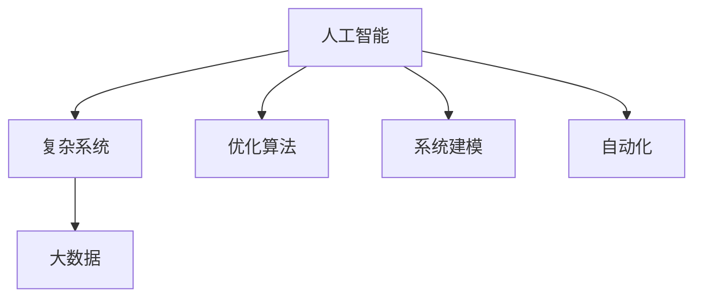

                 

# AI如何帮助解决复杂的全球性问题

> 关键词：人工智能, 复杂系统, 全球问题, 大数据, 优化算法, 系统建模, 自动化

## 1. 背景介绍

随着科技的进步和社会的发展，人类面临的全球性问题也日益复杂多样，如气候变化、疾病控制、资源分配、环境保护等。这些问题往往涉及多个领域和多个因素，具有高度的复杂性、不确定性和动态性，给传统解决方案带来了巨大挑战。幸运的是，人工智能（AI）技术的迅速发展，为解决这些问题提供了新的方法和工具。

## 2. 核心概念与联系

### 2.1 核心概念概述

为了更好地理解AI如何帮助解决复杂全球性问题，首先需要明确几个核心概念：

- **人工智能（AI）**：通过计算机科学和数学方法，使计算机具备类似于人类智能的行为，如学习、推理、感知和自然语言处理。
- **复杂系统（Complex System）**：由大量交互作用的简单单元构成的系统，其行为和动态难以精确预测，如生态系统、交通系统、金融市场等。
- **全球问题（Global Issues）**：影响全球或多个国家的重大挑战，如气候变化、传染病、贫困、战争等。
- **大数据（Big Data）**：规模巨大、高速增长、多样化和真实性的数据集合，是AI的重要基础。
- **优化算法（Optimization Algorithms）**：通过迭代搜索和优化方法，求解复杂问题的最优解或近似解。
- **系统建模（System Modeling）**：使用数学或计算模型描述复杂系统的结构和动态，辅助决策和预测。
- **自动化（Automation）**：通过算法和规则，自动完成重复性、规则性任务，提高效率和准确性。

### 2.2 核心概念原理和架构的 Mermaid 流程图(Mermaid 流程节点中不要有括号、逗号等特殊字符)



这个流程图展示了一个基本的AI框架，其核心思想是通过数据分析和优化算法，构建复杂的系统模型，最终实现自动化决策和预测，解决全球问题。

## 3. 核心算法原理 & 具体操作步骤

### 3.1 算法原理概述

AI在解决复杂全球性问题时，主要遵循以下算法原理：

1. **数据驱动**：利用大数据和机器学习算法，从历史数据中提取模式和规律，为决策提供科学依据。
2. **模型优化**：使用优化算法，寻找复杂问题的最优解或可行解，如遗传算法、粒子群优化等。
3. **系统仿真**：构建系统模型，通过模拟仿真，预测和评估不同策略的效果。
4. **自动化决策**：通过AI算法和规则，自动进行决策和预测，减少人为干预和错误。

### 3.2 算法步骤详解

基于以上原理，解决复杂全球性问题的AI系统通常包括以下几个关键步骤：

**Step 1: 数据收集与预处理**
- 收集与问题相关的各种数据源，如卫星遥感、传感器数据、社交媒体等。
- 对数据进行清洗、去重、归一化等预处理，确保数据质量和一致性。

**Step 2: 特征工程与建模**
- 通过特征选择、降维等技术，提取对问题有贡献的关键特征。
- 选择合适的模型（如回归、分类、聚类等），并使用历史数据进行训练和验证。

**Step 3: 模型评估与优化**
- 使用测试数据集对模型进行评估，计算准确率、召回率等指标。
- 通过交叉验证、网格搜索等技术，优化模型参数和结构，提高模型性能。

**Step 4: 系统仿真与模拟**
- 构建系统的动态模型，使用仿真工具进行模拟，评估不同策略的效果。
- 根据模拟结果，调整模型参数，优化系统行为。

**Step 5: 自动化决策与执行**
- 将训练好的模型集成到决策系统中，自动化生成决策和预测。
- 通过监控和反馈机制，持续优化模型和策略，确保系统稳定性。

### 3.3 算法优缺点

AI在解决复杂全球性问题时，具有以下优点：

1. **高效性**：通过自动化和算法优化，能够快速处理大量数据，得出科学决策。
2. **精确性**：使用数学和统计方法，减少人为错误，提高预测和决策的准确性。
3. **动态适应性**：能够实时监控和调整系统行为，适应动态变化的环境。
4. **可扩展性**：通过并行计算和大规模数据处理，可以处理更加复杂和庞大的问题。

同时，也存在一些缺点：

1. **数据质量依赖**：模型的准确性依赖于数据的质量和全面性，数据不足或数据偏差可能导致错误决策。
2. **模型复杂性**：解决复杂问题需要构建高维度的模型，计算复杂度较高。
3. **隐私和安全问题**：处理敏感数据时，需要考虑隐私保护和数据安全问题。
4. **解释性不足**：许多AI模型，尤其是深度学习模型，缺乏可解释性，难以理解其内部逻辑。

### 3.4 算法应用领域

AI在解决复杂全球性问题时，已经广泛应用于多个领域，如：

- **环境监测**：使用卫星遥感和大数据分析，监测气候变化、生态系统等。
- **疾病控制**：通过大数据分析和机器学习，预测疫情传播，优化疫苗接种策略。
- **资源管理**：利用优化算法和系统建模，优化能源、水资源等资源的分配和利用。
- **金融市场**：使用预测模型和大数据分析，进行风险评估和投资策略优化。
- **灾害预测**：通过机器学习和遥感数据，预测地震、洪水、火灾等自然灾害。
- **智能交通**：使用数据驱动和系统仿真，优化交通流量和减少拥堵。
- **城市规划**：利用大数据和系统建模，优化城市发展和资源配置。

## 4. 数学模型和公式 & 详细讲解 & 举例说明

### 4.1 数学模型构建

解决复杂全球性问题的AI系统，通常包括以下几个关键数学模型：

- **回归模型**：用于预测连续型变量，如气温变化、经济增长等。
- **分类模型**：用于分类问题，如疾病诊断、信用评估等。
- **聚类模型**：用于将数据分为不同群体，如市场细分、客户分类等。
- **优化模型**：用于求解复杂问题的最优解，如遗传算法、粒子群优化等。

### 4.2 公式推导过程

以回归模型为例，其基本公式为：

$$y = f(x;\theta)$$

其中，$y$ 为预测值，$x$ 为输入变量，$\theta$ 为模型参数。常见的回归模型有线性回归、多项式回归、支持向量回归等。

在实际应用中，需要根据问题选择合适的模型，并使用历史数据进行训练和验证。通过最小化损失函数，求解模型参数$\theta$。常见的损失函数包括均方误差（MSE）、平均绝对误差（MAE）等。

### 4.3 案例分析与讲解

以气候变化预测为例，可以构建基于机器学习的回归模型，使用历史气象数据和CO2浓度数据进行训练。模型的输入为月平均气温、降雨量、CO2浓度等变量，输出为未来一年内的气温变化预测。通过模型评估和优化，可以得到较为准确的预测结果。

## 5. 项目实践：代码实例和详细解释说明

### 5.1 开发环境搭建

要构建一个解决复杂全球性问题的AI系统，首先需要搭建开发环境。以下是使用Python进行Scikit-learn开发的环境配置流程：

1. 安装Anaconda：从官网下载并安装Anaconda，用于创建独立的Python环境。

2. 创建并激活虚拟环境：
```bash
conda create -n myenv python=3.8 
conda activate myenv
```

3. 安装Scikit-learn和其他相关库：
```bash
conda install scikit-learn pandas numpy matplotlib tqdm jupyter notebook ipython
```

完成上述步骤后，即可在`myenv`环境中开始项目开发。

### 5.2 源代码详细实现

下面以气候变化预测为例，给出使用Scikit-learn进行机器学习建模的Python代码实现。

```python
import pandas as pd
from sklearn.model_selection import train_test_split
from sklearn.linear_model import LinearRegression
from sklearn.metrics import mean_squared_error

# 加载数据
data = pd.read_csv('climate.csv')

# 特征选择
X = data[['temp', 'rain', 'co2']]
y = data['future_temp']

# 划分训练集和测试集
X_train, X_test, y_train, y_test = train_test_split(X, y, test_size=0.2, random_state=42)

# 训练模型
model = LinearRegression()
model.fit(X_train, y_train)

# 预测并评估
y_pred = model.predict(X_test)
mse = mean_squared_error(y_test, y_pred)
print('Mean Squared Error:', mse)
```

### 5.3 代码解读与分析

让我们再详细解读一下关键代码的实现细节：

**特征选择**：
- 数据加载：使用pandas库读取数据文件，并进行初步清洗。
- 特征选择：选择对问题有贡献的变量，如气温、降雨量、CO2浓度等。
- 划分数据集：使用train_test_split函数，将数据集划分为训练集和测试集。

**模型训练**：
- 模型选择：选择线性回归模型，使用训练集数据进行拟合。
- 预测和评估：使用测试集数据进行预测，并计算均方误差（MSE）评估模型性能。

**模型评估与优化**：
- 模型训练后，可以使用交叉验证、网格搜索等技术，优化模型参数和结构。

**系统仿真与模拟**：
- 使用模拟工具（如Python的simpy库），建立系统的动态模型，进行仿真和优化。
- 根据仿真结果，调整模型参数，优化系统行为。

**自动化决策与执行**：
- 将训练好的模型集成到决策系统中，自动进行预测和决策。
- 通过监控和反馈机制，持续优化模型和策略，确保系统稳定性。

## 6. 实际应用场景

### 6.1 环境监测

AI在环境监测中，可以实时监测和预测气候变化、生态系统、污染水平等。例如，利用卫星遥感和气象数据，可以构建预测模型，预测未来的气候变化趋势，为环境保护和应对措施提供科学依据。

### 6.2 疾病控制

AI在疾病控制中，可以预测疫情传播，优化疫苗接种策略，提高疾病防控效率。例如，利用历史病例数据和地理位置信息，构建传播模型，预测疫情的传播路径和趋势，制定科学的防控措施。

### 6.3 资源管理

AI在资源管理中，可以优化能源、水资源等资源的分配和利用。例如，利用气象数据和用电数据，构建能源需求预测模型，优化电力系统的运行，减少能源浪费。

### 6.4 金融市场

AI在金融市场中，可以进行风险评估和投资策略优化。例如，利用历史交易数据和大数据，构建市场预测模型，优化投资组合和交易策略，提高投资回报率。

### 6.5 灾害预测

AI在灾害预测中，可以预测地震、洪水、火灾等自然灾害。例如，利用地质数据和气象数据，构建灾害预测模型，提前预警，减少灾害损失。

### 6.6 智能交通

AI在智能交通中，可以优化交通流量和减少拥堵。例如，利用交通数据和城市信息，构建交通仿真模型，优化交通信号和路线，提高交通效率。

### 6.7 城市规划

AI在城市规划中，可以优化城市发展和资源配置。例如，利用城市数据和大数据，构建城市发展模型，优化土地利用和资源配置，提升城市生活质量。

## 7. 工具和资源推荐

### 7.1 学习资源推荐

为了帮助开发者系统掌握AI解决复杂全球性问题的方法，这里推荐一些优质的学习资源：

1. **《机器学习实战》系列书籍**：由机器学习领域的专家撰写，深入浅出地介绍了机器学习算法和实践，适合初学者和进阶学习者。
2. **CS229《机器学习》课程**：斯坦福大学开设的机器学习明星课程，涵盖机器学习的理论和算法，并提供了大量的项目实践。
3. **Coursera《深度学习》课程**：由斯坦福大学教授Andrew Ng主讲，涵盖深度学习的理论和应用，适合全面了解AI技术。
4. **Kaggle竞赛**：参加机器学习和AI领域的Kaggle竞赛，实践各种数据处理和模型构建技术。
5. **Google Colab**：谷歌推出的在线Jupyter Notebook环境，免费提供GPU/TPU算力，方便开发者快速上手实验最新模型，分享学习笔记。

通过这些资源的学习实践，相信你一定能够快速掌握AI解决复杂全球性问题的方法，并用于解决实际的NLP问题。

### 7.2 开发工具推荐

高效的开发离不开优秀的工具支持。以下是几款用于AI开发和应用的工具：

1. **Scikit-learn**：Python的机器学习库，提供了各种回归、分类、聚类等算法，简单易用。
2. **TensorFlow**：由Google主导开发的深度学习框架，生产部署方便，适合大规模工程应用。
3. **PyTorch**：Facebook开发的深度学习框架，灵活高效，适合研究和原型开发。
4. **Matplotlib**：Python的数据可视化库，用于绘制图表和可视化结果。
5. **Jupyter Notebook**：交互式编程环境，支持代码和图表的混合展示。
6. **Git/GitHub**：版本控制和代码托管平台，方便团队协作和代码管理。

合理利用这些工具，可以显著提升AI开发和应用的效率，加快创新迭代的步伐。

### 7.3 相关论文推荐

AI在解决复杂全球性问题时，受到了广泛的研究和关注。以下是几篇奠基性的相关论文，推荐阅读：

1. **《大规模机器学习》**：由Yann LeCun等人撰写，详细介绍了深度学习和大规模机器学习的基础和应用。
2. **《深度学习》**：由Ian Goodfellow等人撰写，涵盖了深度学习的理论和算法，并提供了丰富的案例分析。
3. **《强化学习》**：由Richard S. Sutton等人撰写，介绍了强化学习的理论基础和应用实践。
4. **《基于深度学习的环境建模》**：介绍如何使用深度学习模型构建环境监测和预测系统。
5. **《基于AI的疾病控制与预测》**：介绍如何使用AI技术进行疾病预测和防控。
6. **《基于AI的资源管理与优化》**：介绍如何使用AI技术优化资源管理和配置。

这些论文代表了AI技术在解决复杂全球性问题中的前沿进展，通过学习这些前沿成果，可以帮助研究者把握学科前进方向，激发更多的创新灵感。

## 8. 总结：未来发展趋势与挑战

### 8.1 总结

本文对AI如何帮助解决复杂全球性问题进行了全面系统的介绍。首先阐述了AI在解决复杂全球性问题中的重要性，明确了AI在数据驱动、模型优化、系统建模和自动化决策等方面的独特优势。其次，从原理到实践，详细讲解了AI在复杂系统建模和优化算法中的应用，给出了实际项目开发的完整代码实例。同时，本文还广泛探讨了AI在环境监测、疾病控制、资源管理等多个领域的应用前景，展示了AI技术的巨大潜力。

通过本文的系统梳理，可以看到，AI在解决复杂全球性问题方面具有广阔的应用前景，可以显著提升问题解决的效率和效果。未来，伴随AI技术的不断演进，相信AI必将在更多领域发挥更大的作用，推动全球问题的有效解决。

### 8.2 未来发展趋势

展望未来，AI在解决复杂全球性问题时将呈现以下几个发展趋势：

1. **多模态数据融合**：未来的AI系统将融合视觉、声音、文本等多种模态数据，提升系统的综合分析和决策能力。
2. **自适应学习**：未来的AI系统将具备自适应学习能力，能够不断学习和调整模型，适应新的环境和问题。
3. **联邦学习**：未来的AI系统将采用联邦学习技术，保护隐私和数据安全的同时，提升系统的协同能力和性能。
4. **自动化模型优化**：未来的AI系统将自动进行模型优化和超参数调整，减少人为干预，提升模型效果。
5. **实时反馈与迭代**：未来的AI系统将具备实时反馈和迭代能力，能够动态调整策略和预测，提升系统的适应性和稳定性。

这些趋势凸显了AI技术在解决复杂全球性问题中的广阔前景，为构建更高效、更智能的解决方案提供了新的方向。

### 8.3 面临的挑战

尽管AI在解决复杂全球性问题时已经取得了显著成果，但在迈向更加智能化、普适化应用的过程中，仍面临诸多挑战：

1. **数据质量问题**：数据质量和全面性对AI系统的性能有重要影响，如何获取高质量和全面性的数据，是亟待解决的问题。
2. **模型复杂度问题**：解决复杂问题需要构建高维度的模型，计算复杂度较高，如何简化模型结构，降低计算资源消耗，是重要的优化方向。
3. **隐私和安全问题**：处理敏感数据时，需要考虑隐私保护和数据安全问题，如何设计安全的模型和算法，保障数据隐私和系统安全，是亟待解决的问题。
4. **可解释性问题**：许多AI模型，尤其是深度学习模型，缺乏可解释性，难以理解其内部逻辑，如何提高模型的可解释性，是重要的研究方向。
5. **鲁棒性和适应性问题**：AI系统在面对动态变化的环境时，可能出现鲁棒性不足的问题，如何提高系统的鲁棒性和适应性，是重要的优化方向。

这些挑战凸显了AI技术在解决复杂全球性问题中的复杂性和不确定性，需要更多的研究和技术突破。

### 8.4 研究展望

面对AI在解决复杂全球性问题时面临的挑战，未来的研究需要在以下几个方面寻求新的突破：

1. **数据增强和补全技术**：探索数据增强和补全方法，提升数据的质量和全面性，保障系统的稳定性和准确性。
2. **高效模型构建技术**：开发高效模型构建技术，如知识图谱、符号推理等，提升模型的简洁性和可解释性。
3. **联邦学习与隐私保护**：研究联邦学习和隐私保护技术，保护数据隐私和系统安全，保障数据和算法的公平性和透明性。
4. **模型解释和可视化**：开发模型解释和可视化工具，提高模型的可解释性，增强系统的透明度和可控性。
5. **鲁棒性和自适应学习**：研究鲁棒性和自适应学习技术，提高系统的鲁棒性和适应性，增强系统的稳定性和效率。

这些研究方向的探索，必将引领AI技术在解决复杂全球性问题中迈向更高的台阶，为构建更高效、更智能的解决方案提供新的突破。

## 9. 附录：常见问题与解答

**Q1：AI在解决复杂全球性问题时，数据的质量和全面性对系统性能有重要影响，如何获取高质量和全面性的数据？**

A: 获取高质量和全面性的数据是AI系统成功的关键。以下是一些获取高质量数据的策略：

1. **数据采集**：通过传感器、卫星遥感、社交媒体等多种渠道采集数据，确保数据的全面性和多样性。
2. **数据清洗**：对采集到的数据进行清洗和预处理，去除噪声和异常值，提高数据质量。
3. **数据补全**：利用数据插值、插补等技术，补全缺失数据，提高数据完整性。
4. **数据标注**：对数据进行标注，提供标签和注释信息，提升数据的可用性和可解释性。

**Q2：AI在解决复杂全球性问题时，模型的复杂度较高，如何简化模型结构，降低计算资源消耗？**

A: 简化模型结构是提高AI系统性能和效率的重要方向。以下是一些简化模型的策略：

1. **模型压缩**：通过剪枝、量化等技术，压缩模型大小，降低计算资源消耗。
2. **知识图谱**：利用知识图谱，构建符号化的模型，提升模型的可解释性和效率。
3. **符号推理**：引入符号推理技术，提高模型的逻辑性和可解释性，减少计算复杂度。
4. **多模态融合**：融合视觉、声音、文本等多种模态数据，提升模型的综合分析和决策能力，简化计算过程。

**Q3：AI在解决复杂全球性问题时，如何提高模型的可解释性和透明度？**

A: 提高模型的可解释性和透明度，是AI系统走向实用化的重要方向。以下是一些提高模型可解释性的策略：

1. **可视化工具**：使用可视化工具（如TensorBoard、t-SNE等），展示模型的输入输出和中间结果，增强系统的透明度。
2. **解释模型**：开发可解释的模型（如决策树、线性模型等），提供明确的决策依据和解释信息。
3. **模型分解**：通过分解模型，分析各个部分的贡献和影响，增强模型的可解释性。
4. **用户反馈**：通过用户反馈和交互，理解模型的行为和决策，提高模型的可解释性和透明度。

**Q4：AI在解决复杂全球性问题时，如何提高系统的鲁棒性和自适应能力？**

A: 提高系统的鲁棒性和自适应能力，是AI系统稳定运行的重要保障。以下是一些提高系统鲁棒性的策略：

1. **数据增强**：通过数据增强技术，丰富训练集多样性，增强系统的鲁棒性。
2. **对抗训练**：引入对抗样本，训练鲁棒的模型，提高系统的抗干扰能力。
3. **自适应学习**：引入自适应学习技术，根据环境和数据的变化，动态调整模型和策略，提高系统的适应性。
4. **反馈机制**：建立反馈机制，实时监控和调整系统行为，提高系统的稳定性和效率。

**Q5：AI在解决复杂全球性问题时，如何设计安全的模型和算法？**

A: 设计安全的模型和算法，是保护数据隐私和系统安全的重要保障。以下是一些设计安全模型的策略：

1. **隐私保护技术**：使用隐私保护技术（如差分隐私、联邦学习等），保护数据隐私和系统安全。
2. **安全评估**：进行安全评估和测试，发现和修复系统的漏洞和安全隐患。
3. **数据加密**：使用数据加密技术，保护数据的传输和存储安全。
4. **访问控制**：建立访问控制机制，限制对数据的访问权限，保障数据安全。

通过这些措施，可以显著提高AI系统在解决复杂全球性问题时的安全性和可靠性，保障系统的稳定运行和数据隐私。

---

作者：禅与计算机程序设计艺术 / Zen and the Art of Computer Programming

