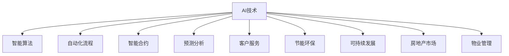

                 

# AI如何改变房地产市场和物业管理

> 关键词：AI, 房地产市场, 物业管理, 智能算法, 自动化, 智能合约, 预测分析, 客户服务, 节能环保, 可持续发展

## 1. 背景介绍

### 1.1 问题由来
近年来，房地产行业和物业管理领域正经历着翻天覆地的变革。传统上，这些行业主要依赖于手动操作和经验驱动的方法，效率低下且容易出错。但随着人工智能(AI)技术的不断进步，AI已经开始深刻改变这些行业，带来了显著的效率提升和成本节约。

### 1.2 问题核心关键点
AI在房地产和物业管理中的应用，主要体现在以下几个方面：
1. 智能算法优化项目管理。
2. 自动化流程提升运营效率。
3. 智能合约确保交易透明公正。
4. 预测分析优化资源配置。
5. 客户服务智能化提升客户体验。
6. 节能环保和可持续发展。

本文将深入探讨这些核心关键点，揭示AI技术如何通过智能算法和自动化流程，实现房地产市场和物业管理的全面革新。

## 2. 核心概念与联系

### 2.1 核心概念概述

为更好地理解AI在房地产和物业管理中的应用，本节将介绍几个密切相关的核心概念：

- AI技术：指通过机器学习和数据分析来模拟人类智能行为的计算技术，包括但不限于深度学习、强化学习、自然语言处理等。
- 房地产市场：指房地产交易和物业管理的市场体系，包括住宅、商业和工业地产等。
- 物业管理：指对房地产项目进行管理和维护，包括租赁、维护、安全、环保等方面的服务。
- 智能算法：指用于解决特定问题的算法，如用于市场预测的回归算法、用于风险评估的分类算法等。
- 自动化流程：指通过软件系统自动化的操作流程，如智能合约自动化执行、智能客服等。
- 智能合约：指使用区块链和AI技术，确保合同自动执行、不可篡改且透明公正的合约。
- 预测分析：指利用AI对未来市场趋势进行分析和预测，包括需求预测、价格预测等。
- 客户服务：指房地产和物业管理中面向客户的服务，如在线客服、预约服务、维护服务等。
- 节能环保：指通过AI优化资源配置和使用，减少能耗和环境污染。
- 可持续发展：指在满足当前需求的同时，不损害未来代际的发展能力。

这些核心概念之间的逻辑关系可以通过以下Mermaid流程图来展示：



这个流程图展示了AI技术在不同领域的应用路径，以及这些应用对房地产市场和物业管理带来的多方面影响。

## 3. 核心算法原理 & 具体操作步骤
### 3.1 算法原理概述

AI在房地产和物业管理中的应用，本质上是利用机器学习和数据分析技术，实现业务流程的自动化、智能化和优化。具体而言，通过以下几类算法实现：

1. 监督学习算法：用于预测和分类任务，如市场需求预测、客户分群等。
2. 无监督学习算法：用于聚类和降维任务，如租户画像分析、社区分布优化等。
3. 强化学习算法：用于优化策略和决策，如自动化租金调整、能耗优化等。
4. 自然语言处理(NLP)算法：用于客户服务、智能合约等场景，提升交互体验和效率。
5. 计算机视觉算法：用于图像和视频分析，如智能监控、设备维护等。

### 3.2 算法步骤详解

AI在房地产和物业管理中的应用主要包括以下几个关键步骤：

**Step 1: 数据收集与处理**
- 收集房地产市场数据（如价格、面积、位置等）和物业管理数据（如设施维护、租户信息等）。
- 对数据进行清洗、归一化、标注等处理，准备输入模型。

**Step 2: 模型选择与训练**
- 根据任务需求，选择合适的算法模型（如回归、分类、聚类、强化学习等）。
- 使用历史数据进行模型训练，优化模型参数。

**Step 3: 模型部署与应用**
- 将训练好的模型部署到生产环境，实现业务流程自动化。
- 持续监测模型性能，根据反馈进行模型更新。

**Step 4: 效果评估与优化**
- 定期评估模型效果，对比前后业务指标变化。
- 根据评估结果调整模型参数和算法策略。

### 3.3 算法优缺点

AI在房地产和物业管理中的应用，具有以下优点：
1. 提高效率：通过自动化流程和智能算法，显著减少人工操作，提高工作效率。
2. 降低成本：减少人工成本，提升资源利用率。
3. 提升准确性：利用数据驱动的算法，优化决策过程，提高业务准确性。
4. 改善用户体验：智能客服、智能合约等应用，提升客户满意度。
5. 实现节能环保：通过智能调度和优化，减少能耗和环境污染。

同时，该方法也存在一些局限性：
1. 数据质量依赖高：模型效果依赖于数据质量，数据缺失或不准确会影响模型性能。
2. 技术门槛高：需要一定的数据科学和算法知识，对技术团队要求较高。
3. 数据隐私和安全：收集和使用大量数据，需要严格的数据保护措施。
4. 模型黑箱：某些复杂算法模型难以解释其决策过程，可能影响信任度。
5. 维护复杂：模型需要定期更新和维护，需要持续的资源投入。

尽管存在这些局限性，但就目前而言，AI技术在房地产和物业管理中的应用，仍是大势所趋，具有广阔的前景。

### 3.4 算法应用领域

AI在房地产和物业管理中的应用，主要体现在以下几个领域：

**1. 智能租赁管理**
- **需求预测**：利用时间序列预测算法，预测市场需求和价格变化。
- **租户画像分析**：通过聚类和分类算法，分析租户特征，提供个性化服务。
- **自动租金调整**：基于市场数据和租户需求，自动调整租金，提升竞争力。

**2. 智能物业管理**
- **设施维护优化**：利用传感器数据和机器学习算法，预测设备故障，提前维护。
- **能耗优化**：通过智能调度算法，优化能源使用，降低能耗。
- **安全监控**：使用计算机视觉和NLP技术，实现智能监控和报警。

**3. 智能客服**
- **聊天机器人**：通过NLP和机器学习技术，实现自动客服和答疑。
- **语音交互**：利用语音识别和自然语言处理技术，提供语音客服。

**4. 智能合约**
- **自动化执行**：使用智能合约技术，确保合同自动执行和不可篡改。
- **自动结算**：利用区块链技术，实现租金、费用等自动结算。

## 4. 数学模型和公式 & 详细讲解 & 举例说明
### 4.1 数学模型构建

以下是基于监督学习的大语言模型微调过程的数学模型构建：

设房地产市场数据为 $X$，物业管理数据为 $Y$，目标为 $T$。模型 $M_{\theta}$ 的输入为 $X$，输出为 $Y$。假设模型 $M_{\theta}$ 的损失函数为 $\mathcal{L}(\theta)$，则目标为最小化该损失函数：

$$
\theta^* = \mathop{\arg\min}_{\theta} \mathcal{L}(\theta)
$$

其中 $\mathcal{L}(\theta)$ 可以是一个回归损失函数、分类损失函数或任何适用于预测任务的损失函数。

### 4.2 公式推导过程

以预测市场需求为例，假设市场需求 $T$ 可以用线性回归模型 $M_{\theta}(X) = \theta_0 + \theta_1X_1 + \theta_2X_2 + \ldots + \theta_nX_n$ 进行预测，其中 $\theta_0, \theta_1, \theta_2, \ldots, \theta_n$ 为模型参数。

市场需求 $T$ 的回归损失函数为：

$$
\mathcal{L}(\theta) = \frac{1}{N} \sum_{i=1}^N (T_i - M_{\theta}(X_i))^2
$$

其中 $N$ 为样本数量，$T_i$ 为第 $i$ 个样本的真实市场需求，$M_{\theta}(X_i)$ 为模型预测市场需求。

通过梯度下降等优化算法，求解最小化损失函数：

$$
\theta_k = \theta_k - \eta \frac{\partial \mathcal{L}(\theta)}{\partial \theta_k}
$$

其中 $\eta$ 为学习率，$\frac{\partial \mathcal{L}(\theta)}{\partial \theta_k}$ 为损失函数对参数 $\theta_k$ 的梯度，可通过反向传播算法高效计算。

### 4.3 案例分析与讲解

假设房地产市场数据为 $X$，包括建筑面积、地理位置、装修程度等特征。利用监督学习模型预测市场需求 $T$，具体步骤如下：

1. **数据预处理**：将数据分为训练集、验证集和测试集，对数据进行归一化处理。
2. **模型选择与训练**：选择线性回归模型作为预测模型，使用训练集数据进行模型训练。
3. **模型评估**：在验证集上评估模型性能，调整模型参数。
4. **模型部署与应用**：将训练好的模型部署到生产环境，对新的市场需求进行预测。

通过不断迭代优化模型参数和算法策略，可以显著提升市场需求预测的准确性，为房地产市场决策提供科学依据。

## 5. 项目实践：代码实例和详细解释说明
### 5.1 开发环境搭建

在进行AI在房地产市场和物业管理中的应用实践前，我们需要准备好开发环境。以下是使用Python进行Scikit-learn和TensorFlow开发的环境配置流程：

1. 安装Anaconda：从官网下载并安装Anaconda，用于创建独立的Python环境。

2. 创建并激活虚拟环境：
```bash
conda create -n ai-env python=3.8 
conda activate ai-env
```

3. 安装Scikit-learn：
```bash
pip install scikit-learn
```

4. 安装TensorFlow：
```bash
pip install tensorflow
```

5. 安装各类工具包：
```bash
pip install numpy pandas scikit-learn matplotlib tqdm jupyter notebook ipython
```

完成上述步骤后，即可在`ai-env`环境中开始AI在房地产市场和物业管理中的应用实践。

### 5.2 源代码详细实现

下面以智能租赁管理中的需求预测为例，给出使用Scikit-learn和TensorFlow进行预测的Python代码实现。

首先，定义需求预测的数据处理函数：

```python
from sklearn.model_selection import train_test_split
from sklearn.preprocessing import StandardScaler
import pandas as pd

def preprocess_data(df):
    # 数据清洗和特征处理
    # 去除缺失值和异常值
    # 将分类变量转换为数值变量
    # 将数据标准化
    # 将数据分为训练集和测试集
    return train_test_split(df, test_size=0.2, random_state=42)

def train_model(X_train, y_train):
    # 定义模型和参数
    model = LinearRegression()
    # 训练模型
    model.fit(X_train, y_train)
    return model

def evaluate_model(model, X_test, y_test):
    # 评估模型性能
    # 计算MAE或R^2等指标
    # 输出评估结果
    pass
```

然后，定义训练和评估函数：

```python
from sklearn.metrics import mean_absolute_error, r2_score

def train_epoch(model, X_train, y_train, learning_rate=0.01, epochs=100):
    # 训练模型
    # 循环迭代epochs次，每次更新模型参数
    pass

def evaluate_epoch(model, X_test, y_test):
    # 评估模型性能
    # 计算MAE或R^2等指标
    # 输出评估结果
    pass

def save_model(model, filename):
    # 保存模型
    # 将模型参数保存到文件
    pass
```

最后，启动训练流程并在测试集上评估：

```python
# 读取数据
df = pd.read_csv('data.csv')

# 数据预处理
X_train, X_test, y_train, y_test = preprocess_data(df)

# 模型训练
model = train_model(X_train, y_train)

# 模型评估
evaluate_model(model, X_test, y_test)

# 保存模型
save_model(model, 'model.pkl')
```

以上就是使用Scikit-learn和TensorFlow对房地产市场需求进行预测的完整代码实现。可以看到，借助Scikit-learn和TensorFlow的强大封装，我们可以用相对简洁的代码完成市场需求预测的任务。

### 5.3 代码解读与分析

让我们再详细解读一下关键代码的实现细节：

**preprocess_data函数**：
- 定义数据预处理流程：清洗数据、处理缺失值、标准化、分拆数据集等。

**train_model函数**：
- 定义线性回归模型，使用训练集数据进行模型训练。

**evaluate_model函数**：
- 定义评估模型性能的指标和方法，如MAE、R^2等。

**train_epoch函数**：
- 定义模型训练的算法和参数，如梯度下降、学习率等。

**evaluate_epoch函数**：
- 定义模型评估的算法和参数，如MAE、R^2等。

**save_model函数**：
- 定义模型保存的方法，如使用pickle保存模型参数。

可以看到，Scikit-learn和TensorFlow使得AI在房地产市场和物业管理中的应用代码实现变得简洁高效。开发者可以将更多精力放在数据处理、模型改进等高层逻辑上，而不必过多关注底层的实现细节。

当然，工业级的系统实现还需考虑更多因素，如模型的保存和部署、超参数的自动搜索、更灵活的任务适配层等。但核心的预测算法基本与此类似。

## 6. 实际应用场景
### 6.1 智能租赁管理

AI在智能租赁管理中的应用，主要体现在需求预测、租户画像分析、自动租金调整等方面：

**1. 需求预测**
- **时间序列预测**：利用时间序列预测算法，如ARIMA、LSTM等，预测市场需求变化。
- **回归分析**：使用线性回归、多项式回归等算法，预测市场需求量。

**2. 租户画像分析**
- **聚类分析**：利用K-means、层次聚类等算法，分析租户特征，提供个性化服务。
- **分类分析**：使用逻辑回归、支持向量机等算法，对租户进行分类。

**3. 自动租金调整**
- **回归模型**：使用线性回归、多项式回归等算法，基于市场数据和租户需求，自动调整租金。
- **神经网络模型**：使用深度神经网络，实现更复杂的租金调整策略。

### 6.2 智能物业管理

AI在智能物业管理中的应用，主要体现在设施维护优化、能耗优化、安全监控等方面：

**1. 设施维护优化**
- **预测维护**：利用传感器数据和机器学习算法，预测设备故障，提前维护。
- **维护调度**：使用调度算法，优化维护计划，减少维护成本。

**2. 能耗优化**
- **智能调度和优化**：利用智能调度算法，优化能源使用，降低能耗。
- **节能方案推荐**：基于能源使用数据，推荐节能方案。

**3. 安全监控**
- **视频分析**：使用计算机视觉算法，实现智能监控和报警。
- **NLP分析**：利用NLP技术，分析监控录像和日志，识别异常行为。

### 6.3 智能客服

AI在智能客服中的应用，主要体现在聊天机器人、语音交互、智能问答等方面：

**1. 聊天机器人**
- **NLP算法**：利用NLP技术，实现自动客服和答疑。
- **对话管理**：使用对话管理算法，提高对话连贯性和上下文理解。

**2. 语音交互**
- **语音识别**：利用语音识别技术，实现语音客服。
- **自然语言理解**：利用NLP技术，理解语音输入，提供服务。

**3. 智能问答**
- **知识图谱**：利用知识图谱，提高问答系统的准确性。
- **推荐算法**：基于用户查询，推荐相关答案。

### 6.4 智能合约

AI在智能合约中的应用，主要体现在自动化执行、自动结算、风险评估等方面：

**1. 自动化执行**
- **智能合约**：使用智能合约技术，确保合同自动执行和不可篡改。
- **自动化结算**：利用区块链技术，实现租金、费用等自动结算。

**2. 风险评估**
- **分类算法**：使用分类算法，评估合同风险。
- **异常检测**：利用异常检测算法，识别合同风险点。

## 7. 工具和资源推荐
### 7.1 学习资源推荐

为了帮助开发者系统掌握AI在房地产市场和物业管理中的应用理论基础和实践技巧，这里推荐一些优质的学习资源：

1. **《深度学习理论与实践》系列书籍**：深入浅出地介绍了深度学习的基本原理和应用，适合初学者和进阶者。
2. **CS231n《深度学习在计算机视觉中的应用》课程**：斯坦福大学开设的计算机视觉课程，涵盖了深度学习在图像处理中的应用，如图像分类、目标检测等。
3. **Kaggle竞赛平台**：通过参与AI竞赛，实践AI在房地产市场和物业管理中的应用，积累实战经验。
4. **TensorFlow官方文档**：提供全面的TensorFlow使用方法和案例，帮助开发者快速上手实现AI应用。
5. **Scikit-learn官方文档**：提供详细的Scikit-learn使用方法和案例，帮助开发者实现AI在房地产市场和物业管理中的应用。

通过对这些资源的学习实践，相信你一定能够快速掌握AI在房地产市场和物业管理中的应用精髓，并用于解决实际的业务问题。

### 7.2 开发工具推荐

高效的开发离不开优秀的工具支持。以下是几款用于AI在房地产市场和物业管理中的应用开发的常用工具：

1. **PyTorch**：基于Python的开源深度学习框架，灵活动态的计算图，适合快速迭代研究。
2. **TensorFlow**：由Google主导开发的开源深度学习框架，生产部署方便，适合大规模工程应用。
3. **Keras**：一个高层次的神经网络API，易于使用，适合快速原型开发。
4. **Scikit-learn**：Python的机器学习库，包含丰富的算法实现和工具支持。
5. **Jupyter Notebook**：一个交互式笔记本环境，支持代码编写和结果展示，方便快速迭代和共享。

合理利用这些工具，可以显著提升AI在房地产市场和物业管理中的应用开发效率，加快创新迭代的步伐。

### 7.3 相关论文推荐

AI在房地产市场和物业管理中的应用，得益于学界的持续研究。以下是几篇奠基性的相关论文，推荐阅读：

1. **《深度学习在房地产市场中的应用》**：介绍深度学习在房地产市场需求预测、价格评估等任务中的应用。
2. **《利用机器学习优化物业管理》**：讨论机器学习在设施维护、能耗优化等任务中的应用。
3. **《智能客服系统的构建与实现》**：介绍聊天机器人、语音交互等智能客服技术的应用。
4. **《智能合约技术在房地产交易中的应用》**：探讨智能合约在房地产交易中的自动化和安全性。

这些论文代表了大语言模型微调技术的发展脉络。通过学习这些前沿成果，可以帮助研究者把握学科前进方向，激发更多的创新灵感。

## 8. 总结：未来发展趋势与挑战
### 8.1 总结

本文对AI在房地产市场和物业管理中的应用进行了全面系统的介绍。首先阐述了AI在房地产和物业管理中的研究背景和意义，明确了AI在提高效率、降低成本、提升准确性等方面的价值。其次，从原理到实践，详细讲解了AI在房地产市场和物业管理中的数学模型和算法实现，给出了具体的应用实例。同时，本文还广泛探讨了AI在智能租赁管理、智能物业管理、智能客服、智能合约等领域的实际应用前景，展示了AI技术的广阔前景。

通过本文的系统梳理，可以看到，AI在房地产市场和物业管理中的应用，正在深刻改变这些行业，带来了显著的效率提升和成本节约。未来，伴随AI技术的持续演进，必将带来更加智能化、高效化的房地产市场和物业管理系统，为人类社会的数字化转型和可持续发展提供新的动力。

### 8.2 未来发展趋势

展望未来，AI在房地产市场和物业管理中的应用将呈现以下几个发展趋势：

1. **自动化程度提升**：AI在更多业务环节实现自动化，减少人工干预，提高效率。
2. **智能化水平提升**：AI在决策优化、预测分析等方面发挥更大作用，提升业务智能水平。
3. **跨领域融合**：AI技术与物联网、区块链等技术融合，实现更全面、安全的业务应用。
4. **可持续性增强**：AI在节能环保、资源优化等方面发挥更大作用，推动可持续发展。
5. **用户体验优化**：AI在客户服务、智能交互等方面提升用户体验，满足多样化需求。
6. **数据安全保障**：AI在数据保护、隐私保护等方面加强安全措施，保障用户数据安全。

这些趋势凸显了AI技术在房地产市场和物业管理中的应用前景。AI技术的不断进步，将为这些行业带来更加智能化、高效化和可持续化的发展。

### 8.3 面临的挑战

尽管AI在房地产市场和物业管理中的应用已经取得了瞩目成就，但在迈向更加智能化、普适化应用的过程中，它仍面临着诸多挑战：

1. **数据质量依赖高**：模型效果依赖于数据质量，数据缺失或不准确会影响模型性能。
2. **技术门槛高**：需要一定的数据科学和算法知识，对技术团队要求较高。
3. **数据隐私和安全**：收集和使用大量数据，需要严格的数据保护措施。
4. **模型黑箱**：某些复杂算法模型难以解释其决策过程，可能影响信任度。
5. **维护复杂**：模型需要定期更新和维护，需要持续的资源投入。
6. **伦理和社会影响**：AI在房地产和物业管理中的应用可能带来新的伦理和社会问题，如就业替代、隐私侵害等。

这些挑战需要我们在技术、伦理、法律等方面进行持续的研究和探索，才能真正实现AI技术在房地产市场和物业管理中的应用落地。

### 8.4 研究展望

面对AI在房地产市场和物业管理中的应用面临的种种挑战，未来的研究需要在以下几个方面寻求新的突破：

1. **提升数据质量**：通过数据清洗、标注、增强等手段，提高数据质量，降低数据偏差。
2. **降低技术门槛**：开发更易用的AI开发工具和框架，降低技术门槛，普及AI应用。
3. **保障数据隐私**：加强数据保护和隐私保护技术，确保数据安全和用户隐私。
4. **增强模型透明度**：开发更透明的AI模型和算法，提高模型的可解释性和可信度。
5. **优化模型维护**：开发更高效、更轻量级的模型和算法，降低模型维护成本。
6. **解决伦理问题**：研究AI在房地产和物业管理中的应用可能带来的伦理问题，制定相应的规范和标准。

这些研究方向的探索，必将引领AI在房地产市场和物业管理中的应用迈向更高的台阶，为人类社会的数字化转型和可持续发展提供新的动力。总之，AI技术将在房地产市场和物业管理中发挥越来越重要的作用，带来深远的变革和影响。

