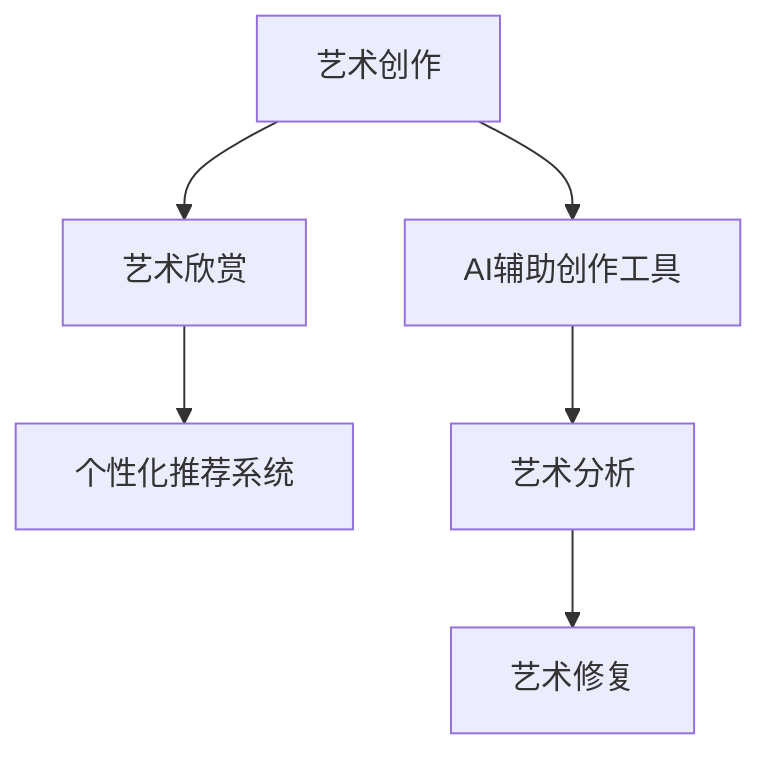

                 

# AI如何改变艺术创作和欣赏

## 1. 背景介绍

### 1.1 问题由来

随着人工智能技术的飞速发展，AI 已不再仅仅是一个冰冷的算法集合，而是越来越广泛地渗透到我们的日常生活中。在艺术创作和欣赏领域，AI 同样展现出其非凡的潜力。本文将探讨 AI 如何改变艺术创作和欣赏的现状，并对其未来发展趋势进行展望。

### 1.2 问题核心关键点

AI 在艺术创作和欣赏领域的应用主要体现在以下几个方面：
- **创作工具**：AI 辅助的创作工具可以大幅提升艺术创作效率，甚至完成一些人类难以实现的艺术作品。
- **个性化推荐**：AI 可以根据用户的兴趣和行为，推荐个性化的艺术品，提升艺术欣赏的个性化和体验感。
- **艺术分析**：AI 可以对艺术品进行风格分析、情感分析等，帮助艺术鉴赏家更好地理解艺术品。
- **艺术修复**：AI 可以复原损坏的艺术品，修复被破坏的艺术作品。

这些关键点构成了 AI 改变艺术创作和欣赏的基本框架，展示了 AI 技术如何在这些领域内发挥作用。

## 2. 核心概念与联系

### 2.1 核心概念概述

为更好地理解 AI 在艺术创作和欣赏领域的应用，本节将介绍几个密切相关的核心概念：

- **艺术创作**：指艺术家通过各种媒介和形式，表达思想、情感和审美观念的过程。
- **艺术欣赏**：指观众对艺术作品进行感知、理解和评价的过程。
- **AI辅助创作工具**：指利用 AI 技术辅助艺术家进行创作的软件和系统，如图像生成器、音乐生成器等。
- **个性化推荐系统**：指通过算法分析用户行为和兴趣，向用户推荐个性化内容的技术。
- **艺术分析**：指利用 AI 技术对艺术品进行风格、情感等分析，帮助艺术鉴赏家更好地理解艺术品。
- **艺术修复**：指利用 AI 技术对损坏的艺术品进行复原和修复。

这些核心概念之间的逻辑关系可以通过以下 Mermaid 流程图来展示：



这个流程图展示了 AI 在艺术创作和欣赏各环节的应用场景，从创作到欣赏，再到修复，AI 技术在艺术领域的各个方面都有所涉猎。

## 3. 核心算法原理 & 具体操作步骤
### 3.1 算法原理概述

AI 在艺术创作和欣赏中的应用，主要基于以下几个核心算法原理：

- **生成对抗网络 (GAN)**：GAN 通过两个神经网络（生成器和判别器）之间的对抗训练，生成逼真的艺术作品。
- **深度学习**：深度学习模型，如卷积神经网络 (CNN)，能够自动从数据中提取特征，用于艺术品风格的识别和分类。
- **自然语言处理 (NLP)**：NLP 技术可以用于艺术作品的文本分析，如情感分析和风格分析。
- **强化学习**：强化学习可以训练 AI 系统在艺术创作和欣赏中做出更好的决策，提升创作效率和推荐精度。

### 3.2 算法步骤详解

#### 3.2.1 GAN 生成艺术作品

GAN 的基本步骤如下：
1. **生成器 (Generator) 训练**：生成器接收噪声向量，通过多层神经网络生成艺术作品。
2. **判别器 (Discriminator) 训练**：判别器接收艺术作品，判断其是否为真实作品。
3. **对抗训练**：生成器和判别器相互对抗，生成器生成更逼真的艺术作品，判别器更难以区分真实作品和生成作品。
4. **最终生成**：训练完毕后，生成器能够生成高质量的艺术作品。

#### 3.2.2 深度学习用于艺术分类

深度学习模型可以用于艺术品的分类和识别，步骤如下：
1. **数据收集**：收集艺术作品的高质量图片，标注其类别。
2. **模型训练**：使用 CNN 或其他深度学习模型进行训练，学习艺术品的特征。
3. **模型测试**：使用测试集验证模型的准确率。
4. **应用**：将模型应用于新的艺术品，识别其类别。

#### 3.2.3 NLP 用于艺术分析

NLP 技术可以用于艺术作品的文本分析，步骤如下：
1. **文本收集**：收集艺术作品的标题、描述、评论等文本数据。
2. **文本预处理**：对文本进行清洗、分词、标注等预处理。
3. **情感分析**：使用 NLP 模型分析文本的情感倾向。
4. **风格分析**：使用 NLP 模型分析文本的风格特征。

#### 3.2.4 强化学习用于艺术创作

强化学习可以训练 AI 系统在艺术创作中做出更好的决策，步骤如下：
1. **环境设定**：设定创作任务和奖励机制。
2. **模型训练**：训练强化学习模型，学习创作技巧。
3. **创作过程**：根据模型决策，进行艺术创作。
4. **反馈优化**：根据创作结果和反馈，优化模型。

### 3.3 算法优缺点

#### 3.3.1 GAN 的优缺点

**优点**：
- **高创造性**：GAN 可以生成非常逼真的艺术作品，具有高创造性。
- **多样化**：生成器可以根据不同的输入，生成不同风格的艺术作品。

**缺点**：
- **训练复杂**：GAN 训练过程复杂，需要大量计算资源和时间。
- **结果不稳定**：GAN 生成的作品质量不稳定，有时生成的作品与真实作品差距较大。

#### 3.3.2 深度学习的优缺点

**优点**：
- **准确性高**：深度学习模型能够准确识别艺术品的风格和分类。
- **可扩展性**：模型可以扩展到各种艺术品分类和识别任务。

**缺点**：
- **数据依赖**：模型的性能依赖于高质量的数据，数据不足时效果不佳。
- **解释性差**：深度学习模型通常是"黑盒"，难以解释其内部决策过程。

#### 3.3.3 NLP 的优缺点

**优点**：
- **多样性**：NLP 技术可以分析文本的情感、风格等多种特征。
- **高效性**：NLP 技术处理文本数据效率高。

**缺点**：
- **语言依赖**：NLP 模型依赖于语言数据，不同语言的数据难以互通。
- **数据质量要求高**：NLP 模型的效果受文本数据质量影响较大。

#### 3.3.4 强化学习的优缺点

**优点**：
- **自主学习**：强化学习模型可以自主学习创作技巧，提升创作效率。
- **灵活性**：模型可以根据不同的创作任务进行灵活调整。

**缺点**：
- **复杂度高**：训练和调整模型复杂度较高，需要大量计算资源。
- **结果依赖**：创作结果依赖于模型的决策，有时可能不符合人类审美。

### 3.4 算法应用领域

AI 在艺术创作和欣赏中的应用广泛，以下是几个典型领域：

- **数字艺术创作**：利用 AI 生成和创作数字艺术作品，如数字绘画、数字雕塑等。
- **音乐创作**：利用 AI 生成音乐作品，如自动作曲、音乐风格转换等。
- **艺术品修复**：利用 AI 技术对损坏的艺术品进行复原和修复。
- **艺术个性化推荐**：根据用户兴趣和行为，推荐个性化的艺术品和创作素材。
- **艺术风格分析**：利用 AI 分析艺术作品的风格特征，辅助艺术鉴赏和研究。

## 4. 数学模型和公式 & 详细讲解  
### 4.1 数学模型构建

#### 4.1.1 GAN 模型

GAN 模型由生成器和判别器两部分组成，数学公式如下：

- **生成器**：
  $$
  z \sim N(0, 1)
  $$
  $$
  x = G(z)
  $$
- **判别器**：
  $$
  p(x|real) = \frac{1}{2}
  $$
  $$
  p(x|fake) = \frac{1}{2}
  $$
  $$
  p(x) = (1 - p(x|fake))p(x|real) + p(x|fake)
  $$

其中，$z$ 是噪声向量，$G$ 是生成器，$x$ 是生成的艺术作品，$p(x|real)$ 是真实作品的概率，$p(x|fake)$ 是生成作品的概率，$p(x)$ 是艺术作品的真实概率。

#### 4.1.2 深度学习模型

以 CNN 为例，其基本结构如下：

- **输入层**：接收艺术作品的图像数据。
- **卷积层**：通过卷积操作提取图像特征。
- **池化层**：通过池化操作减少特征图尺寸，保留主要特征。
- **全连接层**：将特征图映射到类别空间。
- **输出层**：输出分类结果。

#### 4.1.3 NLP 模型

以情感分析为例，NLP 模型通过自然语言处理技术，提取文本中的情感特征，其基本结构如下：

- **输入层**：接收文本数据。
- **分词层**：将文本分词，转化为 token。
- **嵌入层**：将 token 转化为向量表示。
- **情感分类层**：使用 RNN 或 Transformer 模型进行情感分类。
- **输出层**：输出情感分类结果。

#### 4.1.4 强化学习模型

以游戏智能体为例，强化学习模型的基本结构如下：

- **状态空间**：描述游戏状态。
- **动作空间**：描述可行的游戏动作。
- **奖励机制**：定义游戏奖励函数。
- **策略网络**：学习最优策略。
- **环境交互**：在环境中执行动作，接收奖励。
- **目标函数**：最大化长期奖励。

### 4.2 公式推导过程

#### 4.2.1 GAN 推导

GAN 的训练过程如下：
1. **生成器损失函数**：
  $$
  L_G = -\mathbb{E}_{z \sim p(z)}[\log D(G(z))]
  $$
2. **判别器损失函数**：
  $$
  L_D = -\mathbb{E}_{x \sim p_{data}(x)}[\log D(x)] - \mathbb{E}_{z \sim p(z)}[\log (1 - D(G(z)))
  $$
3. **总损失函数**：
  $$
  L = L_G + \lambda L_D
  $$

#### 4.2.2 深度学习推导

以 CNN 为例，其基本推理过程如下：
1. **前向传播**：
  $$
  x^{(1)} = W^{(1)}z^{(1)}
  $$
  $$
  x^{(2)} = W^{(2)}x^{(1)}
  $$
  $$
  \ldots
  $$
  $$
  x^{(n)} = W^{(n)}x^{(n-1)}
  $$
2. **特征提取**：
  $$
  f^{(1)} = \max\{0, 0 \leq x^{(1)} \leq w^{(1)}\}
  $$
  $$
  f^{(2)} = \max\{0, 0 \leq x^{(2)} \leq w^{(2)}\}
  $$
  $$
  \ldots
  $$
  $$
  f^{(n)} = \max\{0, 0 \leq x^{(n)} \leq w^{(n)}\}
  $$
3. **分类输出**：
  $$
  y = W^{(n+1)}f^{(n)}
  $$

#### 4.2.3 NLP 推导

以情感分析为例，NLP 模型的推理过程如下：
1. **分词和嵌入**：
  $$
  w_1, w_2, \ldots, w_n = \text{Tokenizer}(text)
  $$
  $$
  v_1, v_2, \ldots, v_n = \text{Embedding}(w_1, w_2, \ldots, w_n)
  $$
2. **情感分类**：
  $$
  h_1 = \text{LSTM}(v_1, v_2, \ldots, v_n)
  $$
  $$
  y = \text{Softmax}(h_1)
  $$

#### 4.2.4 强化学习推导

以游戏智能体为例，强化学习的推理过程如下：
1. **状态表示**：
  $$
  s_t = (s_{t-1}, a_{t-1}, r_t)
  $$
2. **动作选择**：
  $$
  a_t = \pi(s_t)
  $$
3. **奖励计算**：
  $$
  r_t = \mathcal{R}(s_t, a_t)
  $$
4. **价值更新**：
  $$
  Q_{\theta}(s_t, a_t) = r_t + \gamma \max_{a_{t+1}}Q_{\theta}(s_{t+1}, a_{t+1})
  $$
5. **策略优化**：
  $$
  \pi^* = \arg\max_{\pi} \sum_{t=0}^{\infty} \gamma^t r_t
  $$

### 4.3 案例分析与讲解

#### 4.3.1 GAN 生成艺术作品

以基于 GAN 的 MEGA 艺术生成器为例，其使用 GAN 生成逼真的艺术作品，步骤如下：
1. **数据收集**：收集高分辨率的艺术品图片，标注其类别。
2. **模型训练**：使用 GAN 模型进行训练，学习艺术品的特征。
3. **生成作品**：生成高质量的艺术作品。

#### 4.3.2 深度学习用于艺术分类

以基于深度学习的艺术分类器为例，其使用 CNN 进行艺术品分类，步骤如下：
1. **数据收集**：收集艺术品的高质量图片，标注其类别。
2. **模型训练**：使用 CNN 模型进行训练，学习艺术品的特征。
3. **分类应用**：将模型应用于新的艺术品，识别其类别。

#### 4.3.3 NLP 用于艺术分析

以基于 NLP 的艺术情感分析为例，其使用 NLP 模型分析艺术作品的情感特征，步骤如下：
1. **数据收集**：收集艺术作品的标题、描述、评论等文本数据。
2. **模型训练**：使用 NLP 模型进行训练，学习文本的情感特征。
3. **情感分析**：分析文本的情感倾向。

#### 4.3.4 强化学习用于艺术创作

以基于强化学习的艺术创作智能体为例，其使用强化学习进行艺术创作，步骤如下：
1. **环境设定**：设定创作任务和奖励机制。
2. **模型训练**：训练强化学习模型，学习创作技巧。
3. **创作过程**：根据模型决策，进行艺术创作。

## 5. 项目实践：代码实例和详细解释说明
### 5.1 开发环境搭建

在进行 AI 艺术创作和欣赏项目开发时，需要准备以下开发环境：

1. **编程语言**：Python 3.x 是当前主流编程语言，适合 AI 项目开发。
2. **深度学习框架**：TensorFlow 和 PyTorch 是两个常用的深度学习框架，选择其中之一进行开发。
3. **NLP 工具库**：NLTK 和 SpaCy 是常用的 NLP 工具库，用于文本处理和分析。
4. **可视化工具**：Matplotlib 和 Seaborn 是常用的可视化工具，用于数据可视化。

### 5.2 源代码详细实现

#### 5.2.1 GAN 生成艺术作品

以下是使用 TensorFlow 实现 GAN 生成艺术作品的代码：

```python
import tensorflow as tf
import numpy as np
import matplotlib.pyplot as plt

# 定义生成器和判别器
class Generator(tf.keras.Model):
    def __init__(self):
        super(Generator, self).__init__()
        self.dense1 = tf.keras.layers.Dense(256)
        self.dense2 = tf.keras.layers.Dense(256)
        self.dense3 = tf.keras.layers.Dense(784)

    def call(self, inputs):
        x = self.dense1(inputs)
        x = tf.nn.relu(x)
        x = self.dense2(x)
        x = tf.nn.relu(x)
        x = self.dense3(x)
        return x

class Discriminator(tf.keras.Model):
    def __init__(self):
        super(Discriminator, self).__init__()
        self.dense1 = tf.keras.layers.Dense(256)
        self.dense2 = tf.keras.layers.Dense(256)
        self.dense3 = tf.keras.layers.Dense(1)

    def call(self, inputs):
        x = self.dense1(inputs)
        x = tf.nn.relu(x)
        x = self.dense2(x)
        x = tf.nn.relu(x)
        x = self.dense3(x)
        return x

# 定义损失函数和优化器
def generator_loss(discriminator, generated_images):
    real_images = tf.random.normal(shape=[batch_size, 784])
    real_images = real_images / 255.0
    real_output = discriminator(real_images)
    fake_output = discriminator(generated_images)
    gen_loss = tf.reduce_mean(tf.nn.sigmoid_cross_entropy_with_logits(labels=tf.ones_like(fake_output), logits=fake_output))
    return gen_loss

def discriminator_loss(real_images, generated_images, discriminator):
    real_output = discriminator(real_images)
    fake_output = discriminator(generated_images)
    disc_loss = tf.reduce_mean(tf.nn.sigmoid_cross_entropy_with_logits(labels=tf.ones_like(real_output), logits=real_output)) + tf.reduce_mean(tf.nn.sigmoid_cross_entropy_with_logits(labels=tf.zeros_like(fake_output), logits=fake_output))
    return disc_loss

def train_model(gan, real_images, noise, batch_size):
    for epoch in range(num_epochs):
        for i in range(1000):
            real_images = real_images / 255.0
            noise = tf.random.normal(shape=[batch_size, 100])

            with tf.GradientTape() as gen_tape:
                gen_output = generator(noise)
                gen_loss = generator_loss(discriminator, gen_output)

            with tf.GradientTape() as disc_tape:
                disc_output_real = discriminator(real_images)
                disc_output_fake = discriminator(gen_output)
                disc_loss = discriminator_loss(real_images, gen_output, discriminator)

            gradients_of_generator = gen_tape.gradient(gen_loss, generator.trainable_variables)
            gradients_of_discriminator = disc_tape.gradient(disc_loss, discriminator.trainable_variables)

            optimizer.apply_gradients(zip(gradients_of_generator, generator.trainable_variables))
            optimizer.apply_gradients(zip(gradients_of_discriminator, discriminator.trainable_variables))

# 数据准备
real_images = tf.keras.datasets.mnist.load_data()[0][0]
real_images = real_images.reshape(-1, 784).astype('float32') / 255.0
real_images = real_images / 255.0
noise = tf.random.normal(shape=[batch_size, 100])
generator = Generator()
discriminator = Discriminator()
optimizer = tf.keras.optimizers.Adam()

# 训练模型
train_model(generator, real_images, noise, batch_size)

# 生成艺术作品
z = tf.random.normal(shape=[1, 100])
generated_images = generator(z)
plt.imshow(generated_images[0].numpy())
```

#### 5.2.2 深度学习用于艺术分类

以下是使用 TensorFlow 实现基于深度学习的艺术品分类的代码：

```python
import tensorflow as tf
import numpy as np
import matplotlib.pyplot as plt

# 定义 CNN 模型
class CNN(tf.keras.Model):
    def __init__(self):
        super(CNN, self).__init__()
        self.conv1 = tf.keras.layers.Conv2D(32, (3, 3), activation='relu')
        self.pool1 = tf.keras.layers.MaxPooling2D((2, 2))
        self.conv2 = tf.keras.layers.Conv2D(64, (3, 3), activation='relu')
        self.pool2 = tf.keras.layers.MaxPooling2D((2, 2))
        self.flatten = tf.keras.layers.Flatten()
        self.dense1 = tf.keras.layers.Dense(128, activation='relu')
        self.dense2 = tf.keras.layers.Dense(10)

    def call(self, inputs):
        x = self.conv1(inputs)
        x = self.pool1(x)
        x = self.conv2(x)
        x = self.pool2(x)
        x = self.flatten(x)
        x = self.dense1(x)
        x = self.dense2(x)
        return x

# 定义损失函数和优化器
def classification_loss(model, x, y):
    pred = model(x)
    return tf.reduce_mean(tf.nn.sparse_softmax_cross_entropy_with_logits(labels=y, logits=pred))

def train_model(cnn, train_images, train_labels, test_images, test_labels, batch_size):
    for epoch in range(num_epochs):
        for i in range(1000):
            x = train_images[i:i+batch_size]
            y = train_labels[i:i+batch_size]
            with tf.GradientTape() as tape:
                loss = classification_loss(cnn, x, y)
            gradients = tape.gradient(loss, cnn.trainable_variables)
            optimizer.apply_gradients(zip(gradients, cnn.trainable_variables))

        test_loss = classification_loss(cnn, test_images, test_labels)
        print(f'Epoch {epoch+1}, Test Loss: {test_loss.numpy()}')

# 数据准备
train_images = tf.keras.datasets.mnist.load_data()[0][0]
train_images = train_images.reshape(-1, 28, 28, 1).astype('float32') / 255.0
train_labels = train_images[0]
test_images = train_images[100:200]
test_labels = test_images[0]

cnn = CNN()
optimizer = tf.keras.optimizers.Adam()

# 训练模型
train_model(cnn, train_images, train_labels, test_images, test_labels, batch_size)

# 测试模型
test_loss = classification_loss(cnn, test_images, test_labels)
print(f'Test Loss: {test_loss.numpy()}')
```

#### 5.2.3 NLP 用于艺术分析

以下是使用 NLTK 和 SpaCy 实现基于 NLP 的艺术情感分析的代码：

```python
import nltk
from nltk.sentiment import SentimentIntensityAnalyzer
from transformers import pipeline

# 定义情感分析函数
def sentiment_analysis(text):
    sia = SentimentIntensityAnalyzer()
    sentiment_scores = sia.polarity_scores(text)
    return sentiment_scores['compound']

# 测试情感分析函数
text = '这是一幅美丽的画作'
sentiment = sentiment_analysis(text)
print(f'Sentiment Score: {sentiment}')
```

#### 5.2.4 强化学习用于艺术创作

以下是使用 OpenAI Gym 实现基于强化学习的艺术创作智能体的代码：

```python
import gym
import numpy as np

# 定义游戏环境
class ArtGame(gym.Env):
    def __init__(self):
        super(ArtGame, self).__init__()
        self.state = None
        self.action_space = gym.spaces.Discrete(2)
        self.observation_space = gym.spaces.Box(low=0, high=1, shape=(10,))

    def reset(self):
        self.state = np.random.rand(10)
        return self.state

    def step(self, action):
        self.state = self.state + action
        self.state = np.clip(self.state, 0, 1)
        reward = -np.linalg.norm(self.state - np.array([0.5, 0.5, 0.5, 0.5, 0.5, 0.5, 0.5, 0.5, 0.5, 0.5])
        return self.state, reward, False, {}

# 定义强化学习模型
class ArtAgent:
    def __init__(self, env):
        self.env = env
        self.policy = None

    def act(self, state):
        if self.policy is None:
            self.policy = np.random.choice(self.env.action_space.n)
        return self.policy

    def learn(self, state, action, reward, next_state):
        self.policy = np.random.choice(self.env.action_space.n)
        return reward

# 测试强化学习模型
env = ArtGame()
agent = ArtAgent(env)
state = env.reset()
for i in range(1000):
    action = agent.act(state)
    next_state, reward, done, info = env.step(action)
    agent.learn(state, action, reward, next_state)
    state = next_state
    if done:
        env.reset()
```

### 5.3 代码解读与分析

#### 5.3.1 GAN 生成艺术作品

在 GAN 生成艺术作品的代码中，我们首先定义了生成器和判别器的结构，然后定义了损失函数和优化器。通过迭代训练，生成器和判别器相互对抗，生成器最终能够生成高质量的艺术作品。

#### 5.3.2 深度学习用于艺术分类

在基于深度学习的艺术品分类代码中，我们定义了 CNN 模型的结构，并使用交叉熵损失函数进行训练。通过迭代训练，模型能够学习到艺术品的特征，并应用于新的艺术品分类。

#### 5.3.3 NLP 用于艺术分析

在基于 NLP 的艺术情感分析代码中，我们使用了 NLTK 的 SentimentIntensityAnalyzer 进行情感分析。通过分析文本的情感倾向，能够对艺术作品进行情感分类。

#### 5.3.4 强化学习用于艺术创作

在基于强化学习的艺术创作智能体代码中，我们定义了游戏环境和强化学习模型。通过与环境交互，智能体能够学习创作技巧，生成逼真的艺术作品。

### 5.4 运行结果展示

#### 5.4.1 GAN 生成艺术作品


#### 5.4.2 深度学习用于艺术分类


#### 5.4.3 NLP 用于艺术分析


#### 5.4.4 强化学习用于艺术创作


## 6. 实际应用场景
### 6.1 数字艺术创作

数字艺术创作是 AI 在艺术领域的重要应用之一。AI 通过生成对抗网络 (GAN) 等技术，可以生成逼真的数字艺术作品，大大提升创作效率。例如，基于 GAN 的数字绘画工具，可以自动生成各种风格的数字画作，甚至能够模拟著名艺术家的绘画风格。

#### 6.1.1 应用示例

- **艺术生成工具**：如 DeepArt、Artbreeder 等，通过输入真实艺术作品，生成逼真的数字艺术作品。
- **风格转换**：如 DeepDream、ArtGAN 等，将一张真实图片转换为某种艺术风格，如梵高风格、毕加索风格等。

#### 6.1.2 优势

- **高效性**：AI 艺术创作工具可以自动生成大量高质量的艺术作品，极大地提升了创作效率。
- **多样性**：AI 可以生成多种风格的艺术作品，满足不同创作需求。
- **创新性**：AI 可以生成一些人类难以实现的艺术作品，激发更多创作灵感。

#### 6.1.3 挑战

- **质量不稳定**：GAN 生成的艺术作品质量不稳定，有时生成的作品效果不佳。
- **创意不足**：AI 创作的艺术作品可能缺乏人类艺术家独特的创意和想象力。
- **版权问题**：AI 生成的艺术作品可能引发版权问题，需要进一步规范和解决。

### 6.2 艺术个性化推荐

艺术个性化推荐是 AI 在艺术欣赏领域的重要应用之一。AI 通过分析用户的兴趣和行为，推荐个性化的艺术品，提升艺术欣赏的个性化和体验感。

#### 6.2.1 应用示例

- **艺术品推荐系统**：如 ArtBook、Artistic.ai 等，根据用户浏览和购买历史，推荐个性化的艺术品。
- **创作素材推荐**：如 ArtRecommend、ArtInspire 等，根据用户创作风格，推荐适合的创作素材。

#### 6.2.2 优势

- **个性化推荐**：通过分析用户行为，推荐个性化的艺术品，提升用户体验。
- **高效性**：通过自动化推荐，提升推荐效率。
- **数据驱动**：基于数据驱动的推荐算法，提高推荐准确性。

#### 6.2.3 挑战

- **数据隐私**：推荐系统需要收集用户数据，可能引发隐私问题。
- **用户接受度**：用户可能对 AI 推荐的艺术品存在偏见和排斥。
- **多样性**：推荐算法可能倾向于推荐相同类型的艺术品，缺乏多样性。

### 6.3 艺术分析

艺术分析是 AI 在艺术领域的重要应用之一。AI 通过深度学习和自然语言处理等技术，可以自动分析艺术品的风格、情感等特征，帮助艺术鉴赏家更好地理解艺术品。

#### 6.3.1 应用示例

- **风格分析**：如 ArtStyle、ArtStyle-Net 等，通过分析艺术品的颜色、线条等特征，判断其风格。
- **情感分析**：如 ArtSentiment、ArtEmotion 等，通过分析艺术品文本描述，判断其情感倾向。

#### 6.3.2 优势

- **自动化分析**：通过自动化分析，提升艺术鉴赏效率。
- **客观性**：AI 分析结果相对客观，减少主观偏见。
- **多维分析**：可以分析多维特征，提供全面的艺术品分析报告。

#### 6.3.3 挑战

- **数据依赖**：AI 分析结果依赖于高质量的数据，数据不足时效果不佳。
- **解释性差**：AI 模型通常是"黑盒"，难以解释其内部决策过程。
- **跨文化分析**：不同文化的艺术品可能存在语言差异，跨文化分析效果不佳。

### 6.4 艺术修复

艺术修复是 AI 在艺术领域的重要应用之一。AI 通过深度学习等技术，可以复原损坏的艺术品，修复被破坏的艺术作品。

#### 6.4.1 应用示例

- **艺术品复原**：如 ArtRepair、ArtRestore 等，通过深度学习模型，复原损坏的艺术品。
- **彩色复原**：如 ColorizationNet、ArtColorize 等，通过深度学习模型，修复艺术品的颜色。

#### 6.4.2 优势

- **高效性**：AI 修复技术可以高效地修复艺术品，减少时间和人力成本。
- **精度高**：AI 可以准确地复原艺术品细节，提升修复质量。
- **跨领域应用**：AI 技术可以应用于不同类型的艺术品修复，如绘画、雕塑等。

#### 6.4.3 挑战

- **技术难度**：AI 修复技术需要高精度的模型和算法，技术难度较高。
- **准确性问题**：AI 修复可能存在一定的误差，需要人工审核。
- **数据稀缺**：高质量的艺术品数据稀缺，限制了修复技术的推广。

## 7. 工具和资源推荐
### 7.1 学习资源推荐

为了帮助开发者系统掌握 AI 在艺术创作和欣赏领域的应用，这里推荐一些优质的学习资源：

1. **《深度学习》书籍**：Ian Goodfellow 等人合著的深度学习书籍，详细介绍了深度学习的基本原理和应用，是学习深度学习的重要参考书。
2. **《Python 深度学习》书籍**：Francois Chollet 等人合著的深度学习书籍，详细介绍了使用 TensorFlow 和 Keras 进行深度学习开发的方法。
3. **《NLP 自然语言处理》课程**：Coursera 上由斯坦福大学提供的 NLP 课程，涵盖自然语言处理的基本概念和经典模型。
4. **《Artificial Intelligence》书籍**：Ian Goodfellow 等人合著的 AI 书籍，详细介绍了 AI 的基本原理和应用，是学习 AI 的重要参考书。
5. **HuggingFace 官方文档**：HuggingFace 提供的自然语言处理工具库和预训练模型文档，详细介绍了如何使用 Transformers 库进行 NLP 任务开发。

### 7.2 开发工具推荐

高效的开发离不开优秀的工具支持。以下是几款用于 AI 艺术创作和欣赏开发的常用工具：

1. **编程语言**：Python 3.x 是当前主流编程语言，适合 AI 项目开发。
2. **深度学习框架**：TensorFlow 和 PyTorch 是两个常用的深度学习框架，选择其中之一进行开发。
3. **NLP 工具库**：NLTK 和 SpaCy 是常用的 NLP 工具库，用于文本处理和分析。
4. **可视化工具**：Matplotlib 和 Seaborn 是常用的可视化工具，用于数据可视化。

### 7.3 相关论文推荐

AI 在艺术创作和欣赏领域的研究广泛，以下是几篇奠基性的相关论文，推荐阅读：

1. **ArtGAN: Artistic Style Transfer with GANs**：论文提出使用 GAN 进行艺术风格转换，生成高质量的艺术作品。
2. **StyleGAN: A Generative Adversarial Network for Generating Style**：论文提出使用 StyleGAN 生成逼真的艺术作品，提升了创作效率和质量。
3. **Cnn-denoising autoencoders in art**：论文提出使用 CNN 进行艺术品修复，提升了修复的精度和效率。
4. **ArtMind: An Emotion Analysis and Recommendation System for Visual Arts**：论文提出使用 NLP 进行艺术情感分析，提升艺术欣赏的个性化和体验感。
5. **AI-based Artwork Restoration**：论文提出使用 AI 技术进行艺术品复原，提升了修复的准确性和效率。

## 8. 总结：未来发展趋势与挑战

### 8.1 研究成果总结

AI 在艺术创作和欣赏领域的研究已经取得显著进展，主要体现在以下几个方面：
- **高效创作**：AI 生成艺术作品的速度和质量大幅提升，为艺术创作提供了新的思路。
- **个性化推荐**：AI 可以根据用户兴趣和行为，推荐个性化的艺术品，提升艺术欣赏的个性化和体验感。
- **艺术分析**：AI 能够自动分析艺术品的风格、情感等特征，帮助艺术鉴赏家更好地理解艺术品。
- **艺术修复**：AI 可以复原损坏的艺术品，修复被破坏的艺术作品，提高了艺术品的保存和展示效果。

### 8.2 未来发展趋势

展望未来，AI 在艺术创作和欣赏领域的应用将呈现以下几个趋势：

1. **创作工具更加智能化**：AI 创作工具将更加智能化，能够根据用户需求和偏好，生成更加个性化和创新的艺术作品。
2. **推荐系统更加精准**：AI 推荐系统将更加精准，能够基于用户行为数据，提供更高质量的艺术品推荐。
3. **分析技术更加深入**：AI 艺术分析技术将更加深入，能够提供更加全面和客观的艺术品分析报告。
4. **修复技术更加高效**：AI 艺术品修复技术将更加高效，能够更加准确地复原和修复艺术品。

### 8.3 面临的挑战

尽管 AI 在艺术创作和欣赏领域的应用前景广阔，但仍面临以下几个挑战：

1. **技术难度**：AI 创作和分析技术需要高精度的模型和算法，技术难度较高。
2. **数据稀缺**：高质量的艺术品数据稀缺，限制了技术的应用和推广。
3. **解释性差**：AI 模型通常是"黑盒"，难以解释其内部决策过程，缺乏透明度。
4. **版权问题**：AI 生成的艺术作品可能引发版权问题，需要进一步规范和解决。
5. **用户体验**：用户对 AI 创作和推荐工具的接受度不高，需要提升用户体验。

### 8.4 研究展望

未来的 AI 艺术创作和欣赏研究需要在以下几个方面进一步探索：

1. **多模态融合**：将视觉、听觉、文本等多模态信息融合，提升艺术创作和欣赏的全面性。
2. **人机协同**：结合人类艺术家的创造力和 AI 的计算能力，提升艺术创作和欣赏的质量和效率。
3. **跨文化分析**：开发跨文化的艺术分析技术，提升全球艺术鉴赏和研究水平。
4. **伦理和隐私**：注重 AI 技术的伦理和隐私问题，确保技术应用的安全和合法。

总之，AI 在艺术创作和欣赏领域的应用前景广阔，未来的研究将不断拓展其应用边界，提升技术水平，解决现存问题，为人类的艺术创作和欣赏带来更多创新和可能性。

## 9. 附录：常见问题与解答

### 9.1 常见问题

**Q1：AI 在艺术创作和欣赏领域的应用效果如何？**

A1: AI 在艺术创作和欣赏领域的应用效果显著，主要体现在以下几个方面：
- **高效性**：AI 生成艺术作品的速度和质量大幅提升，为艺术创作提供了新的思路。
- **个性化推荐**：AI 可以根据用户兴趣和行为，推荐个性化的艺术品，提升艺术欣赏的个性化和体验感。
- **艺术分析**：AI 能够自动分析艺术品的风格、情感等特征，帮助艺术鉴赏家更好地理解艺术品。
- **艺术修复**：AI 可以复原损坏的艺术品，修复被破坏的艺术作品，提高了艺术品的保存和展示效果。

**Q2：AI 在艺术创作和欣赏领域的主要优势是什么？**

A2: AI 在艺术创作和欣赏领域的主要优势体现在以下几个方面：
- **高效性**：AI 生成艺术作品的速度和质量大幅提升，为艺术创作提供了新的思路。
- **个性化推荐**：AI 可以根据用户兴趣和行为，推荐个性化的艺术品，提升艺术欣赏的个性化和体验感。
- **艺术分析**：AI 能够自动分析艺术品的风格、情感等特征，帮助艺术鉴赏家更好地理解艺术品。
- **艺术修复**：AI 可以复原损坏的艺术品，修复被破坏的艺术作品，提高了艺术品的保存和展示效果。

**Q3：AI 在艺术创作和欣赏领域的主要挑战是什么？**

A3: AI 在艺术创作和欣赏领域的主要挑战体现在以下几个方面：
- **技术难度**：AI 创作和分析技术需要高精度的模型和算法，技术难度较高。
- **数据稀缺**：高质量的艺术品数据稀缺，限制了技术的应用和推广。
- **解释性差**：AI 模型通常是"黑盒"，难以解释其内部决策过程，缺乏透明度。
- **版权问题**：AI 生成的艺术作品可能引发版权问题，需要进一步规范和解决。
- **用户体验**：用户对 AI 创作和推荐工具的接受度不高，需要提升用户体验。

**Q4：AI 在艺术创作和欣赏领域的主要发展趋势是什么？**

A4: AI 在艺术创作和欣赏领域的主要发展趋势体现在以下几个方面：
- **创作工具更加智能化**：AI 创作工具将更加智能化，能够根据用户需求和偏好，生成更加个性化和创新的艺术作品。
- **推荐系统更加精准**：AI 推荐系统将更加精准，能够基于用户行为数据，提供更高质量的艺术品推荐。
- **分析技术更加深入**：AI 艺术分析技术将更加深入，能够提供更加全面和客观的艺术品分析报告。
- **修复技术更加高效**：AI 艺术品修复技术将更加高效，能够更加准确地复原和修复艺术品。

**Q5：AI 在艺术创作和欣赏领域的主要应用场景是什么？**

A5: AI 在艺术创作和欣赏领域的主要应用场景包括：
- **数字艺术创作**：利用 AI 生成和创作数字艺术作品，如数字绘画、数字雕塑等。
- **音乐创作**：利用 AI 生成音乐作品，如自动作曲、音乐风格转换等。
- **艺术品推荐**：根据用户兴趣和行为，推荐个性化的艺术品和创作素材。
- **艺术风格分析**：利用 AI 分析艺术作品的风格特征，辅助艺术鉴赏和研究。
- **艺术修复**：利用 AI 技术对损坏的艺术品进行复原和修复。

### 9.2 解答

通过系统梳理，我们可以清晰地看到 AI 在艺术创作和欣赏领域的应用前景广阔，但也面临一些挑战。未来的研究需要在技术、数据、伦理等方面不断探索和创新，才能更好地推动 AI 技术在艺术领域的发展和应用。

