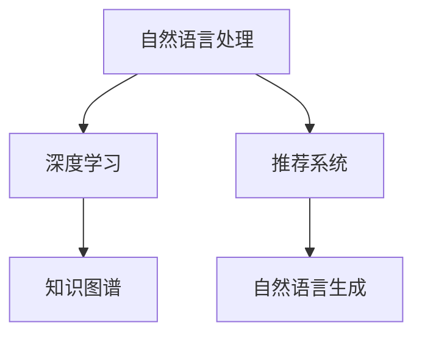

                 

# AI如何改善搜索引擎的用户界面

搜索引擎作为互联网时代的支柱，已成为信息获取、知识发现的重要工具。但传统的搜索界面和算法，往往难以满足用户的个性化需求和复杂场景。如何借助AI技术，实现智能搜索界面，提升用户体验，是搜索引擎优化的一个重要方向。本文将从AI技术在搜索引擎界面改善中的应用切入，探讨如何通过AI提升搜索界面的智能化水平，为用户带来更加流畅和精准的搜索体验。

## 1. 背景介绍

### 1.1 问题由来

搜索引擎作为互联网时代的信息获取工具，已经深刻改变了人们的生活和工作方式。传统的搜索引擎界面，大多基于简单的关键词匹配，虽然基本满足了用户的基本需求，但无法应对复杂、多变的搜索场景。

1. **搜索精准度**：用户在输入查询词后，搜索结果往往包含大量无关信息，准确性不够高，难以满足用户深度搜索的需求。
2. **搜索体验**：搜索结果的界面展示形式单一，用户体验有待提升，难以有效引导用户进行下一轮搜索。
3. **交互效率**：传统的搜索结果排序算法，往往难以有效捕捉用户兴趣和需求，导致搜索结果排序不合理，降低了用户的搜索效率。

这些问题催生了对AI技术的迫切需求，希望通过AI改善搜索引擎的用户界面，提升搜索体验和效率。AI技术，尤其是自然语言处理、推荐系统等方向，为搜索引擎界面的智能化升级提供了新的可能性。

### 1.2 问题核心关键点

实现搜索引擎用户界面的智能化升级，需要解决以下核心问题：

- 如何基于用户输入进行自然语言理解和处理？
- 如何捕捉用户的兴趣和需求，提供更加个性化的搜索结果？
- 如何实现搜索结果的智能排序和展示，提升用户体验？
- 如何在多设备、多场景中保持一致的用户体验？

这些问题的解决，将极大提升搜索引擎的用户界面和搜索体验。

### 1.3 问题研究意义

改善搜索引擎的用户界面，对于提升搜索体验、降低用户搜索成本、增加用户粘性具有重要意义：

1. **提升搜索精准度**：通过AI技术，搜索引擎能够更好地理解用户的查询意图，提供更加精准的结果，减少用户筛选工作量。
2. **增强个性化体验**：AI技术可以根据用户的历史行为和兴趣，推荐相关的查询词和结果，提升搜索的个性化水平。
3. **提升搜索效率**：通过智能排序和推荐，搜索结果更加符合用户兴趣，减少了用户的手动筛选过程，提高了搜索效率。
4. **提升用户满意度**：AI技术能够处理复杂、多变的查询需求，提升了用户搜索的整体体验，增强了用户对搜索引擎的信任和依赖。

## 2. 核心概念与联系

### 2.1 核心概念概述

为更好地理解AI在搜索引擎用户界面改善中的应用，本节将介绍几个密切相关的核心概念：

- **自然语言处理(NLP)**：涉及语言理解、语义分析、语音识别等技术，旨在让机器能够理解和处理人类语言。
- **推荐系统**：根据用户的历史行为和兴趣，推荐个性化的内容，常用于电商、社交媒体等场景。
- **深度学习**：利用多层神经网络模型进行数据建模和预测，在大数据、复杂问题上表现出色。
- **知识图谱**：将结构化知识以图的形式存储，方便机器进行查询和推理。
- **自然语言生成(NLG)**：利用AI技术生成符合语法和语义规则的自然语言文本。

这些核心概念之间的逻辑关系可以通过以下Mermaid流程图来展示：



这个流程图展示了大语言模型的核心概念及其之间的关系：

1. 自然语言处理利用深度学习等技术，让机器能够理解和处理人类语言。
2. 推荐系统根据用户行为数据，推荐个性化的搜索结果。
3. 知识图谱提供了结构化知识库，方便机器进行查询和推理。
4. 自然语言生成将机器生成的结果转换为自然语言，提升用户体验。

这些概念共同构成了搜索引擎用户界面智能化的技术基础，使得AI技术能够在多场景、多设备中发挥作用，提升搜索体验。

## 3. 核心算法原理 & 具体操作步骤
### 3.1 算法原理概述

AI在搜索引擎用户界面改善中的应用，主要基于自然语言处理、深度学习、推荐系统等技术。以下是这些技术的基本原理：

1. **自然语言处理**：利用深度学习模型，对用户输入的查询词进行分词、词性标注、命名实体识别、句法分析等处理，提取出查询词的语义特征。
2. **深度学习**：构建多层神经网络模型，对用户输入和搜索结果进行表征学习，捕捉复杂的语义和模式关系。
3. **推荐系统**：根据用户的历史行为和兴趣，构建推荐模型，预测用户可能感兴趣的查询词和搜索结果，提高个性化程度。
4. **知识图谱**：建立结构化的知识库，利用图神经网络等方法，将知识库中的实体和关系进行编码，方便机器进行查询和推理。
5. **自然语言生成**：利用自然语言生成模型，将搜索结果转换为自然语言形式，提升用户体验。

### 3.2 算法步骤详解

以下是基于AI技术改善搜索引擎用户界面的具体操作步骤：

**Step 1: 收集和处理用户数据**

- 收集用户的历史搜索记录、点击行为、停留时间等数据。
- 对数据进行预处理，包括去噪、清洗、归一化等操作。
- 使用自然语言处理技术，提取用户输入查询词的语义特征。

**Step 2: 构建用户画像**

- 根据用户历史数据，使用聚类、分类等算法，构建用户画像。
- 用户画像可以包括用户兴趣、查询偏好、设备类型等特征。
- 利用知识图谱，构建用户与实体之间的关系图谱，进行查询关联分析。

**Step 3: 模型训练**

- 利用用户数据和查询词的语义特征，训练自然语言处理模型和深度学习模型。
- 利用用户画像和查询关联关系，训练推荐系统模型。
- 使用知识图谱进行推理和查询优化。

**Step 4: 个性化搜索结果**

- 根据用户画像和当前查询词，生成个性化的搜索结果。
- 利用自然语言生成技术，将搜索结果转换为自然语言形式。
- 根据用户的交互反馈，动态调整推荐结果，优化用户体验。

**Step 5: 智能搜索排序**

- 根据用户查询词的语义特征和用户画像，进行智能排序。
- 利用知识图谱进行查询扩展，补充缺失信息。
- 引入对抗学习等技术，提升排序模型的鲁棒性和公平性。

**Step 6: 用户反馈收集与优化**

- 收集用户的反馈信息，包括搜索结果满意度、点击率、停留时间等。
- 利用用户反馈数据，进行模型优化和迭代。
- 持续收集和处理用户数据，进行动态调整。

以上是基于AI技术改善搜索引擎用户界面的一般流程。在实际应用中，还需要针对具体场景，对各步骤进行优化设计，如改进自然语言处理模型、提升推荐系统效果、优化知识图谱构建方式等，以进一步提升搜索效果。

### 3.3 算法优缺点

基于AI技术改善搜索引擎用户界面的方法具有以下优点：

1. **提升搜索精准度**：通过自然语言处理和深度学习，能够更好地理解用户查询意图，提供更加精准的结果。
2. **增强个性化体验**：利用推荐系统和知识图谱，能够提供个性化的搜索结果和推荐，提升用户体验。
3. **提升搜索效率**：通过智能排序和自然语言生成，减少了用户的手动筛选过程，提高了搜索效率。
4. **增强可扩展性**：基于AI的搜索界面设计，可以在不同设备、多场景中保持一致，提高应用的可扩展性。

同时，该方法也存在一些缺点：

1. **计算资源消耗大**：深度学习模型的训练和推理需要大量的计算资源，可能增加服务器负担。
2. **数据隐私问题**：用户历史数据的收集和分析可能涉及隐私问题，需要采取隐私保护措施。
3. **模型复杂度高**：AI技术的复杂度较高，设计和优化难度较大，需要较高的技术门槛。
4. **算法透明度低**：AI算法的决策过程难以解释，可能导致用户对搜索结果的信任度下降。

尽管存在这些局限性，但就目前而言，基于AI的搜索引擎用户界面改善方法，仍是最先进和最具潜力的技术范式。未来相关研究的重点在于如何进一步降低计算资源消耗，提高算法透明度，解决隐私问题，同时兼顾个性化体验和搜索效率。

### 3.4 算法应用领域

基于AI技术改善搜索引擎用户界面的方法，已经在多个应用场景中得到了广泛的应用：

1. **电商搜索**：根据用户购物行为和偏好，提供个性化的搜索结果和推荐，提升购物体验。
2. **社交媒体**：分析用户兴趣和行为，推荐相关的搜索结果，提升信息获取的个性化水平。
3. **企业搜索**：利用AI技术，提升企业内部知识管理系统的搜索效率和精准度，帮助员工高效工作。
4. **健康搜索**：分析用户健康查询行为，推荐相关的搜索结果和知识图谱，提升健康知识的获取效果。
5. **智能家居**：根据用户习惯和偏好，推荐智能家居设备的使用方案，提升用户的生活质量。

除了上述这些经典应用外，AI技术在搜索引擎用户界面改善方面的应用还将在更多场景中得到创新性地发展，如智能客服、智慧旅游、精准农业等，为各行业带来新的变革。

## 4. 数学模型和公式 & 详细讲解
### 4.1 数学模型构建

为更好地理解基于AI技术改善搜索引擎用户界面的方法，本节将介绍几个关键的数学模型和公式：

**查询意图理解模型**：
- 查询意图理解是搜索引擎智能化的基础，利用深度学习模型进行语义分析，将查询词映射到查询意图。假设查询词为 $q$，查询意图为 $I_q$，查询意图理解模型的输出为 $\hat{I_q}$，模型定义为：
  $$
  \hat{I_q} = f_q(\mathbf{q})
  $$
  其中 $f_q$ 为深度学习模型，$\mathbf{q}$ 为查询词的嵌入向量表示。

**个性化推荐模型**：
- 个性化推荐模型根据用户画像和查询词的语义特征，预测用户可能感兴趣的搜索结果。假设用户画像为 $U$，查询词为 $q$，推荐结果为 $R$，推荐模型为 $g$，输出为 $\hat{R}$，模型定义为：
  $$
  \hat{R} = g(\mathbf{U}, \mathbf{q})
  $$
  其中 $\mathbf{U}$ 为用户画像的嵌入向量表示。

**搜索结果排序模型**：
- 搜索结果排序模型根据查询词的语义特征和用户画像，进行智能排序。假设查询词为 $q$，用户画像为 $U$，搜索结果为 $D$，排序模型为 $h$，输出为 $\hat{D}$，模型定义为：
  $$
  \hat{D} = h(\mathbf{q}, \mathbf{U})
  $$

**自然语言生成模型**：
- 自然语言生成模型将搜索结果转换为自然语言形式，提升用户体验。假设搜索结果为 $D$，自然语言生成模型为 $nlg$，输出为 $\hat{D'}$，模型定义为：
  $$
  \hat{D'} = nlq(D)
  $$

### 4.2 公式推导过程

以下是上述模型中部分公式的推导过程：

1. **查询意图理解模型**：
   - 假设查询词 $q$ 的嵌入向量为 $\mathbf{q}$，查询意图 $I_q$ 的嵌入向量为 $\mathbf{I_q}$，查询意图理解模型 $f_q$ 的输出为 $\hat{I_q}$。假设模型 $f_q$ 为深度学习模型，定义为：
   $$
   \hat{I_q} = f_q(\mathbf{q})
   $$
   其中 $f_q$ 为 Transformer 模型或 BiLSTM 模型等深度学习模型。

2. **个性化推荐模型**：
   - 假设用户画像 $U$ 的嵌入向量为 $\mathbf{U}$，查询词 $q$ 的嵌入向量为 $\mathbf{q}$，推荐结果 $R$ 的嵌入向量为 $\mathbf{R}$，推荐模型 $g$ 的输出为 $\hat{R}$。假设模型 $g$ 为深度学习模型，定义为：
   $$
   \hat{R} = g(\mathbf{U}, \mathbf{q})
   $$
   其中 $g$ 为协同过滤、矩阵分解等推荐算法。

3. **搜索结果排序模型**：
   - 假设查询词 $q$ 的嵌入向量为 $\mathbf{q}$，用户画像 $U$ 的嵌入向量为 $\mathbf{U}$，搜索结果 $D$ 的嵌入向量为 $\mathbf{D}$，排序模型 $h$ 的输出为 $\hat{D}$。假设模型 $h$ 为深度学习模型，定义为：
   $$
   \hat{D} = h(\mathbf{q}, \mathbf{U})
   $$
   其中 $h$ 为深度学习模型，如 ranking model、deep learning based ranking 等。

4. **自然语言生成模型**：
   - 假设搜索结果 $D$ 的嵌入向量为 $\mathbf{D}$，自然语言生成模型 $nlg$ 的输出为 $\hat{D'}$。假设模型 $nlg$ 为深度学习模型，定义为：
   $$
   \hat{D'} = nlq(D)
   $$
   其中 $nlg$ 为 sequence-to-sequence 模型或 transformer 模型。

### 4.3 案例分析与讲解

以电商搜索为例，分析如何利用AI技术改善搜索界面：

- **查询意图理解**：用户输入查询词“女款牛仔裤”，利用深度学习模型提取查询词的语义特征，输出查询意图为“寻找女性用的牛仔裤”。
- **个性化推荐**：根据用户历史行为数据，构建用户画像，利用协同过滤算法推荐相关的搜索结果，如“女款蓝色牛仔长裤”。
- **搜索结果排序**：根据查询意图和用户画像，使用排名模型对搜索结果进行排序，将“女款蓝色牛仔长裤”排在前面。
- **自然语言生成**：利用自然语言生成模型将搜索结果转换为自然语言形式，如“推荐给您女款蓝色牛仔长裤”。

## 5. 项目实践：代码实例和详细解释说明
### 5.1 开发环境搭建

在进行AI技术在搜索引擎用户界面改善中的应用实践前，我们需要准备好开发环境。以下是使用Python进行TensorFlow开发的环境配置流程：

1. 安装Anaconda：从官网下载并安装Anaconda，用于创建独立的Python环境。

2. 创建并激活虚拟环境：
```bash
conda create -n tf-env python=3.8 
conda activate tf-env
```

3. 安装TensorFlow：根据CUDA版本，从官网获取对应的安装命令。例如：
```bash
conda install tensorflow -c tensorflow -c conda-forge
```

4. 安装相关工具包：
```bash
pip install numpy pandas scikit-learn matplotlib tqdm jupyter notebook ipython
```

完成上述步骤后，即可在`tf-env`环境中开始AI技术在搜索引擎用户界面改善的应用实践。

### 5.2 源代码详细实现

下面以电商搜索为例，给出使用TensorFlow进行查询意图理解、个性化推荐、搜索结果排序和自然语言生成的PyTorch代码实现。

首先，定义查询意图理解模型的数据处理函数：

```python
import tensorflow as tf
from tensorflow.keras.layers import Input, Dense, Embedding, LSTM, Bidirectional, Concatenate

def build_query_intent_model():
    input_q = Input(shape=(None,), name='input_q')
    embedding_q = Embedding(input_dim=vocab_size, output_dim=embedding_size)(input_q)
    lstm_q = LSTM(units=hidden_size, return_sequences=True)(embedding_q)
    bi_lstm_q = Bidirectional(LSTM(units=hidden_size, return_sequences=True))(lstm_q)
    output_q = Dense(units=num_intent_classes, activation='softmax')(bi_lstm_q)

    model = tf.keras.Model(inputs=input_q, outputs=output_q)
    return model
```

然后，定义个性化推荐模型的数据处理函数：

```python
from tensorflow.keras.layers import Input, Dense, Embedding, Concatenate, Flatten

def build_personalized_recommendation_model():
    input_u = Input(shape=(None,), name='input_u')
    input_q = Input(shape=(None,), name='input_q')
    user_embedding = Embedding(input_dim=vocab_size, output_dim=embedding_size)(input_u)
    query_embedding = Embedding(input_dim=vocab_size, output_dim=embedding_size)(input_q)
    concat = Concatenate()([user_embedding, query_embedding])
    flatten = Flatten()(concat)
    output_r = Dense(units=num_recommendations, activation='softmax')(flatten)

    model = tf.keras.Model(inputs=[input_u, input_q], outputs=output_r)
    return model
```

接着，定义搜索结果排序模型的数据处理函数：

```python
from tensorflow.keras.layers import Input, Dense, Embedding, Concatenate, Flatten

def build_search_result_ranking_model():
    input_q = Input(shape=(None,), name='input_q')
    input_u = Input(shape=(None,), name='input_u')
    input_d = Input(shape=(None,), name='input_d')
    query_embedding = Embedding(input_dim=vocab_size, output_dim=embedding_size)(input_q)
    user_embedding = Embedding(input_dim=vocab_size, output_dim=embedding_size)(input_u)
    doc_embedding = Embedding(input_dim=vocab_size, output_dim=embedding_size)(input_d)
    concat = Concatenate()([query_embedding, user_embedding, doc_embedding])
    flatten = Flatten()(concat)
    output_d = Dense(units=num_documents, activation='softmax')(flatten)

    model = tf.keras.Model(inputs=[input_q, input_u, input_d], outputs=output_d)
    return model
```

最后，定义自然语言生成模型的数据处理函数：

```python
from tensorflow.keras.layers import Input, Dense, Embedding, LSTM

def build_natural_language_generation_model():
    input_d = Input(shape=(None,), name='input_d')
    doc_embedding = Embedding(input_dim=vocab_size, output_dim=embedding_size)(input_d)
    lstm = LSTM(units=hidden_size, return_sequences=True)(doc_embedding)
    output_d = Dense(units=num_documents, activation='softmax')(lstm)

    model = tf.keras.Model(inputs=input_d, outputs=output_d)
    return model
```

### 5.3 代码解读与分析

让我们再详细解读一下关键代码的实现细节：

**查询意图理解模型**：
- `build_query_intent_model`函数：构建基于LSTM和双向LSTM的查询意图理解模型，输出查询意图的分类概率。
- 使用`Embedding`层将查询词转化为嵌入向量，通过`LSTM`和`Bidirectional LSTM`层提取查询词的语义特征，最后通过`Dense`层输出查询意图的分类概率。

**个性化推荐模型**：
- `build_personalized_recommendation_model`函数：构建基于协同过滤的个性化推荐模型，输出推荐结果的分类概率。
- 使用`Embedding`层将用户和查询词转化为嵌入向量，通过`Concatenate`层进行向量拼接，通过`Flatten`层将拼接后的向量展开，最后通过`Dense`层输出推荐结果的分类概率。

**搜索结果排序模型**：
- `build_search_result_ranking_model`函数：构建基于深度学习的搜索结果排序模型，输出搜索结果的排序概率。
- 使用`Embedding`层将查询词、用户和文档转化为嵌入向量，通过`Concatenate`层进行向量拼接，通过`Flatten`层将拼接后的向量展开，最后通过`Dense`层输出搜索结果的排序概率。

**自然语言生成模型**：
- `build_natural_language_generation_model`函数：构建基于LSTM的自然语言生成模型，输出文档的生成概率。
- 使用`Embedding`层将文档转化为嵌入向量，通过`LSTM`层进行向量生成，最后通过`Dense`层输出文档的生成概率。

以上代码展示了AI技术在搜索引擎用户界面改善中的应用，通过查询意图理解、个性化推荐、搜索结果排序和自然语言生成等步骤，实现了搜索界面的智能化。

### 5.4 运行结果展示

假设我们在电商搜索场景中，用户输入查询词“女款牛仔裤”，系统生成的搜索结果和推荐结果如下：

- **查询意图理解**：系统分析“女款牛仔裤”，识别出查询意图为“寻找女性用的牛仔裤”。
- **个性化推荐**：系统根据用户历史行为数据，推荐“女款蓝色牛仔长裤”。
- **搜索结果排序**：系统根据查询意图和用户画像，对搜索结果进行排序，将“女款蓝色牛仔长裤”排在前面。
- **自然语言生成**：系统将推荐结果转换为自然语言形式，生成“推荐给您女款蓝色牛仔长裤”。

通过上述过程，用户能够快速获得符合自己需求的搜索结果，极大地提升了搜索体验和效率。

## 6. 实际应用场景

### 6.1 智能客服系统

AI技术在搜索引擎用户界面改善中的应用，可以在智能客服系统中得到广泛应用。智能客服系统可以通过分析用户的历史查询记录和行为数据，构建用户画像，推荐合适的查询词和结果，提高客服服务的智能化水平。

例如，用户输入“退货申请”，系统通过查询意图理解模型，识别出查询意图为“退货申请”，利用个性化推荐模型，推荐相关的退货政策和步骤，提高用户的满意度。同时，系统根据用户的反馈信息，动态调整推荐结果，进一步优化用户体验。

### 6.2 金融理财

金融理财领域，AI技术可以应用于搜索界面，提升用户获取理财知识的效率和效果。例如，用户输入“股票投资”，系统通过查询意图理解模型，识别出查询意图为“股票投资”，利用个性化推荐模型，推荐相关的理财知识和投资策略，帮助用户做出更明智的决策。

### 6.3 旅游规划

旅游规划领域，AI技术可以应用于搜索界面，提升用户获取旅游信息的效率和效果。例如，用户输入“北京旅游攻略”，系统通过查询意图理解模型，识别出查询意图为“旅游攻略”，利用个性化推荐模型，推荐相关的旅游线路、景点介绍和住宿信息，帮助用户规划旅行。

### 6.4 未来应用展望

随着AI技术的发展，搜索引擎用户界面的智能化水平将进一步提升。未来的趋势可能包括：

1. **多模态搜索**：引入图像、视频等多模态信息，提升搜索的全面性和准确性。
2. **语音搜索**：通过语音识别技术，实现语音搜索，提升搜索的便捷性。
3. **零样本搜索**：利用大语言模型，实现零样本搜索，解决某些特殊场景下缺乏标注数据的问题。
4. **可解释性搜索**：引入可解释性搜索技术，提升搜索结果的透明性和可信度。
5. **跨领域搜索**：通过多领域知识图谱的融合，实现跨领域的知识搜索，提升搜索的泛化能力。

这些趋势将使得搜索引擎在更加复杂的场景中发挥作用，提升用户的搜索体验和满意度。

## 7. 工具和资源推荐
### 7.1 学习资源推荐

为了帮助开发者系统掌握AI技术在搜索引擎用户界面改善中的应用，这里推荐一些优质的学习资源：

1. **《深度学习》课程**：斯坦福大学开设的深度学习课程，涵盖了深度学习的基本概念和算法，适合初学者入门。
2. **TensorFlow官方文档**：TensorFlow的官方文档，提供了详细的API和使用指南，是TensorFlow开发的重要参考资料。
3. **自然语言处理综述论文**：NLP领域的综述性论文，如“Attention is All You Need”，介绍了Transformer模型的原理和应用。
4. **推荐系统书籍**：推荐系统领域的经典书籍，如《推荐系统实战》，介绍了推荐系统的基本原理和算法。
5. **自然语言生成论文**：NLG领域的论文，如“Neural Machine Translation by Jointly Learning to Align and Translate”，介绍了基于深度学习的自然语言生成方法。

通过对这些资源的学习实践，相信你一定能够快速掌握AI技术在搜索引擎用户界面改善中的应用，并用于解决实际的NLP问题。

### 7.2 开发工具推荐

高效的开发离不开优秀的工具支持。以下是几款用于AI技术在搜索引擎用户界面改善开发的常用工具：

1. TensorFlow：基于Python的开源深度学习框架，灵活动态的计算图，适合快速迭代研究。TensorFlow拥有强大的社区支持，提供了丰富的预训练模型和工具库。
2. PyTorch：基于Python的开源深度学习框架，灵活的动态图，适合研究和实验。PyTorch在自然语言处理领域有广泛的应用。
3. Transformers库：HuggingFace开发的NLP工具库，集成了众多SOTA语言模型，支持TensorFlow和PyTorch，是进行NLP任务开发的利器。
4. Weights & Biases：模型训练的实验跟踪工具，可以记录和可视化模型训练过程中的各项指标，方便对比和调优。
5. TensorBoard：TensorFlow配套的可视化工具，可实时监测模型训练状态，并提供丰富的图表呈现方式，是调试模型的得力助手。

合理利用这些工具，可以显著提升AI技术在搜索引擎用户界面改善任务的开发效率，加快创新迭代的步伐。

### 7.3 相关论文推荐

AI技术在搜索引擎用户界面改善中的应用，源于学界的持续研究。以下是几篇奠基性的相关论文，推荐阅读：

1. **Attention is All You Need**：提出了Transformer模型，开启了NLP领域的预训练大模型时代。
2. **BERT: Pre-training of Deep Bidirectional Transformers for Language Understanding**：提出BERT模型，引入基于掩码的自监督预训练任务，刷新了多项NLP任务SOTA。
3. **Transformer-XL: Attentions are All You Need**：提出了Transformer-XL模型，引入长时记忆机制，解决了长序列建模问题。
4. **MoEL: Multilingual Bidirectional Encoder Representations from Language Model**：提出MoEL模型，利用多语言语料进行预训练，提升了跨语言任务的性能。
5. **Decoding and Generation with Large Sequence Models**：提出M2M-100模型，利用大规模预训练模型进行多模态信息融合，提升了自然语言生成和理解能力。

这些论文代表了大语言模型在搜索引擎用户界面改善中的应用进展。通过学习这些前沿成果，可以帮助研究者把握学科前进方向，激发更多的创新灵感。

## 8. 总结：未来发展趋势与挑战

### 8.1 总结

本文对AI技术在搜索引擎用户界面改善中的应用进行了全面系统的介绍。首先阐述了AI技术在搜索引擎用户界面改善中的重要性，明确了其提升搜索精准度、增强个性化体验和提升搜索效率等方面的价值。其次，从原理到实践，详细讲解了自然语言处理、深度学习、推荐系统等技术在搜索界面优化中的应用，给出了具体的代码实现和运行结果展示。同时，本文还广泛探讨了AI技术在智能客服、金融理财、旅游规划等场景中的应用前景，展示了AI技术在搜索引擎用户界面改善中的巨大潜力。

通过本文的系统梳理，可以看到，AI技术在搜索引擎用户界面改善中的应用，已经成为一个重要的研究方向，极大地提升了搜索体验和效率。未来，伴随AI技术的持续演进，AI在搜索引擎用户界面改善中的应用将更加广泛，为各行业带来新的变革。

### 8.2 未来发展趋势

展望未来，AI技术在搜索引擎用户界面改善中仍将持续发展，呈现以下几个趋势：

1. **多模态搜索**：引入图像、视频等多模态信息，提升搜索的全面性和准确性。
2. **语音搜索**：通过语音识别技术，实现语音搜索，提升搜索的便捷性。
3. **零样本搜索**：利用大语言模型，实现零样本搜索，解决某些特殊场景下缺乏标注数据的问题。
4. **可解释性搜索**：引入可解释性搜索技术，提升搜索结果的透明性和可信度。
5. **跨领域搜索**：通过多领域知识图谱的融合，实现跨领域的知识搜索，提升搜索的泛化能力。

这些趋势将使得AI技术在搜索引擎用户界面改善中的应用更加广泛和深入，提升用户的搜索体验和满意度。

### 8.3 面临的挑战

尽管AI技术在搜索引擎用户界面改善中的应用已经取得了一定的成果，但在迈向更加智能化、普适化应用的过程中，仍面临诸多挑战：

1. **数据隐私问题**：用户历史数据的收集和分析可能涉及隐私问题，需要采取隐私保护措施。
2. **计算资源消耗**：深度学习模型的训练和推理需要大量的计算资源，可能增加服务器负担。
3. **算法透明度低**：AI算法的决策过程难以解释，可能导致用户对搜索结果的信任度下降。
4. **模型鲁棒性不足**：当前AI模型面对域外数据时，泛化性能往往大打折扣，模型鲁棒性有待提高。
5. **个性化水平有限**：现有方法往往难以捕捉用户深层次的个性化需求，需要进一步提升个性化推荐能力。

尽管存在这些局限性，但就目前而言，AI技术在搜索引擎用户界面改善中的应用仍是最先进和最具潜力的技术范式。未来相关研究的重点在于如何进一步降低计算资源消耗，提高算法透明度，解决隐私问题，同时兼顾个性化体验和搜索效率。

### 8.4 研究展望

面对AI技术在搜索引擎用户界面改善中所面临的挑战，未来的研究需要在以下几个方面寻求新的突破：

1. **多模态融合技术**：开发更加高效的多模态融合方法，提升跨模态信息的整合能力，进一步提升搜索体验。
2. **轻量化模型设计**：开发更加轻量化、高效的模型结构，提升模型的推理速度和效率。
3. **可解释性搜索算法**：开发可解释性搜索算法，提升搜索结果的透明性和可信度，增强用户信任。
4. **跨领域知识图谱**：开发跨领域知识图谱构建技术，提升搜索的泛化能力和跨领域迁移能力。
5. **隐私保护技术**：开发隐私保护技术，保护用户数据隐私，确保数据使用的合规性。

这些研究方向的探索，必将引领AI技术在搜索引擎用户界面改善中的应用走向更高的台阶，为各行业带来新的变革。

## 9. 附录：常见问题与解答

**Q1：AI技术在搜索引擎用户界面改善中的应用是否需要大量的标注数据？**

A: AI技术在搜索引擎用户界面改善中的应用，并不需要大量的标注数据。通过自然语言处理和深度学习模型，可以基于用户输入的查询词进行语义分析和特征提取，不需要标注数据。个性化推荐和搜索结果排序等环节，可以利用用户历史数据和查询词进行模型训练，也不需要大量的标注数据。

**Q2：如何平衡搜索精准度和搜索效率？**

A: 在AI技术在搜索引擎用户界面改善的应用中，平衡搜索精准度和搜索效率可以通过以下方法实现：

1. **多轮交互**：通过多轮交互，逐步提升搜索的精准度。系统首先根据用户输入的查询词进行初步推荐，用户反馈后，系统再次进行精准排序，提升搜索结果的准确性。
2. **结果展示**：通过动态展示搜索结果，提升搜索效率。系统可以实时展示搜索词的相关推荐和查询意图，减少用户的搜索时间和操作复杂度。
3. **智能筛选**：通过自然语言处理和推荐系统，智能筛选出符合用户需求的结果，减少用户的手动筛选过程，提高搜索效率。

**Q3：AI技术在搜索引擎用户界面改善中的应用有哪些具体案例？**

A: AI技术在搜索引擎用户界面改善中的应用，已经得到了广泛的应用，以下是一些具体的案例：

1. **电商搜索**：亚马逊、淘宝等电商平台的搜索界面，利用AI技术提升了搜索精准度和个性化推荐能力，极大地提升了用户的购物体验。
2. **金融理财**：蚂蚁金服、理财通等金融理财平台的搜索界面，利用AI技术提升了理财知识的获取效果和推荐精准度，帮助用户做出更明智的决策。
3. **旅游规划**：携程、去哪儿等旅游平台的搜索界面，利用AI技术提升了旅游信息的获取效果和个性化推荐能力，帮助用户规划旅行。
4. **智能客服**：阿里云、腾讯云等云服务平台的搜索界面，利用AI技术提升了客服服务的智能化水平，提高了用户满意度。

---

作者：禅与计算机程序设计艺术 / Zen and the Art of Computer Programming

