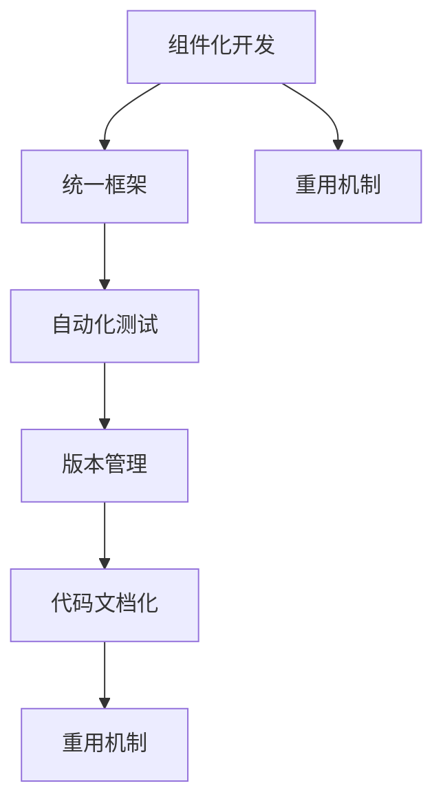

                 

# AI开发的代码重用：Lepton AI的效率工程

> 关键词：AI开发，代码重用，Lepton AI，效率工程，软件开发，自动化

## 1. 背景介绍

### 1.1 问题由来
在AI开发中，代码重用是提高开发效率、减少重复劳动的关键。随着AI技术的不断进步，模型的多样化和复杂性不断增加，如何高效地管理代码、实现快速迭代开发，成为了一个重要的挑战。近年来，一些大型AI公司如Lepton AI，逐渐将代码重用提升到新的高度，通过构建通用的代码框架和组件，实现了项目间的高效复用，大大提高了开发效率和工程质量。

### 1.2 问题核心关键点
Lepton AI在代码重用方面所采取的主要策略包括：

1. **组件化开发**：将复杂的AI项目拆分为可复用的组件，通过组件化的方式实现代码的高效重用。
2. **框架统一**：构建统一的代码框架，包括数据处理、模型训练、模型部署等环节，减少了项目间的不一致性。
3. **自动化测试**：引入自动化的测试机制，确保代码的正确性和一致性。
4. **代码文档化**：通过代码注释、文档和注释工具，提高代码的可读性和可维护性。
5. **版本管理**：采用版本控制系统，如Git，进行代码的追踪和管理。

这些策略使得Lepton AI在AI开发中实现了代码的高效复用，大大提高了开发效率和工程质量。

## 2. 核心概念与联系

### 2.1 核心概念概述

为更好地理解Lepton AI在代码重用方面的实践，本节将介绍几个密切相关的核心概念：

- **组件化开发**：将复杂的AI项目拆分为多个可复用的组件，每个组件实现特定的功能，通过组合这些组件，实现完整的AI项目。

- **统一框架**：构建统一的代码框架，确保项目间的代码一致性和复用性。

- **自动化测试**：通过自动化测试工具和测试框架，确保代码的正确性和稳定性。

- **版本管理**：通过版本控制系统，如Git，进行代码的追踪和管理。

- **代码文档化**：通过代码注释、文档和注释工具，提高代码的可读性和可维护性。

- **重用机制**：构建良好的代码重用机制，包括组件库、模型库、工具库等，方便开发人员快速引用和复用。

这些核心概念之间的逻辑关系可以通过以下Mermaid流程图来展示：



这个流程图展示了一体化开发流程的核心概念及其之间的联系：

1. 通过组件化开发，将复杂的AI项目拆分为多个组件，实现代码的高效重用。
2. 统一框架确保项目间的代码一致性和复用性。
3. 自动化测试保证代码的正确性和稳定性。
4. 版本管理进行代码的追踪和管理。
5. 代码文档化提高代码的可读性和可维护性。
6. 重用机制方便开发人员快速引用和复用。

## 3. 核心算法原理 & 具体操作步骤

### 3.1 算法原理概述

Lepton AI的代码重用范式主要基于组件化和统一的框架，核心思想是：将复杂的AI项目拆分为多个可复用的组件，通过统一的框架将这些组件组合起来，实现高效的代码重用。

其核心流程包括：

1. **组件设计**：根据项目需求设计多个可复用的组件，每个组件实现特定的功能。
2. **框架构建**：构建统一的代码框架，包含数据处理、模型训练、模型部署等环节，确保组件间的协调工作。
3. **自动化测试**：通过自动化测试工具和测试框架，确保组件的正确性和稳定性。
4. **版本管理**：通过版本控制系统，确保组件的版本一致性和可追溯性。
5. **代码文档化**：通过代码注释、文档和注释工具，提高组件的可读性和可维护性。
6. **重用机制**：构建良好的代码重用机制，包括组件库、模型库、工具库等，方便开发人员快速引用和复用。

### 3.2 算法步骤详解

Lepton AI在代码重用方面的具体实现步骤如下：

**Step 1: 组件设计**

1. 根据项目需求，将复杂任务拆分为多个可复用的组件，每个组件实现特定的功能，如数据预处理、模型训练、模型部署等。
2. 确定每个组件的输入和输出接口，定义组件的输入数据格式和输出数据格式。

**Step 2: 框架构建**

1. 设计一个统一的代码框架，确保组件间的协调工作。
2. 框架包含数据处理、模型训练、模型部署等环节，每个环节都有明确的接口和实现细节。
3. 框架的各个组件都通过接口进行通信，确保数据和状态的正确传递。

**Step 3: 自动化测试**

1. 引入自动化的测试工具和测试框架，确保组件的正确性和稳定性。
2. 测试工具和框架应该能够覆盖各个组件的关键功能点，如数据处理、模型训练、模型部署等。
3. 自动化测试应该能够快速、准确地发现问题，并及时修复。

**Step 4: 版本管理**

1. 通过版本控制系统，如Git，进行组件的版本管理。
2. 确保每个组件的版本一致性和可追溯性，方便团队协作和代码重用。

**Step 5: 代码文档化**

1. 通过代码注释、文档和注释工具，提高组件的可读性和可维护性。
2. 代码注释应该清晰明了，描述每个函数和变量的作用，以及组件的功能和接口。
3. 文档应该包含组件的详细说明和使用示例，方便开发人员快速上手。

**Step 6: 重用机制**

1. 构建良好的代码重用机制，包括组件库、模型库、工具库等。
2. 组件库包含所有可复用的组件，方便开发人员快速引用和复用。
3. 模型库包含所有预训练模型，方便开发人员快速部署和使用。
4. 工具库包含各种开发工具和库，方便开发人员快速开发和调试。

### 3.3 算法优缺点

Lepton AI的代码重用方法具有以下优点：

1. **高效复用**：通过组件化设计和重用机制，可以快速构建和部署AI项目，减少重复劳动。
2. **一致性高**：统一的框架和版本管理确保了组件的一致性和可追溯性。
3. **稳定性强**：自动化测试和版本管理确保了组件的正确性和稳定性。
4. **可读性高**：代码文档化和注释工具提高了代码的可读性和可维护性。

同时，该方法也存在一定的局限性：

1. **设计复杂**：组件化设计和框架构建需要较高的设计水平，初期的设计和实现成本较高。
2. **维护困难**：随着项目规模的扩大，维护和更新组件库的难度也会增加。
3. **灵活性低**：统一的框架和接口可能限制组件的灵活性，难以适应快速变化的需求。

尽管存在这些局限性，但就目前而言，组件化和统一的框架仍是大规模AI开发中的主流范式，其带来的效率和一致性收益远远超过了设计成本。未来相关研究的重点在于如何进一步优化组件设计和框架实现，提高组件的灵活性和可维护性，同时兼顾代码的重用性和稳定性。

### 3.4 算法应用领域

Lepton AI的代码重用方法已经在多个AI项目中得到了广泛的应用，包括但不限于以下领域：

1. **自然语言处理(NLP)**：用于构建通用的NLP组件库，包括文本预处理、分词、句法分析、实体识别等。

2. **计算机视觉(CV)**：用于构建通用的CV组件库，包括图像处理、目标检测、图像分割等。

3. **推荐系统**：用于构建通用的推荐组件库，包括数据处理、模型训练、推荐算法等。

4. **语音识别**：用于构建通用的语音识别组件库，包括音频处理、特征提取、模型训练等。

除了上述这些领域，Lepton AI的代码重用方法还广泛应用在各种AI项目中，提升了开发效率和工程质量，加速了AI技术的落地应用。

## 4. 数学模型和公式 & 详细讲解 & 举例说明

### 4.1 数学模型构建

Lepton AI在代码重用方面的数学模型主要涉及组件设计、框架构建和自动化测试等方面。以下将详细介绍这些方面的数学模型构建。

**组件设计**

1. **输入输出接口定义**：设输入接口为 $I$，输出接口为 $O$，组件 $C$ 的输入输出接口定义如下：
   $$
   I, O = C(input, parameters)
   $$
   其中 $input$ 表示组件的输入数据，$parameters$ 表示组件的参数，$I$ 和 $O$ 分别表示输入输出接口。

2. **功能实现**：设组件 $C$ 的功能为 $f$，组件的实际实现如下：
   $$
   f(input, parameters) = output
   $$
   其中 $output$ 表示组件的输出数据。

**框架构建**

1. **数据处理框架**：设数据处理框架为 $D$，组件 $C$ 在数据处理框架下的实现如下：
   $$
   D(input, parameters) = output
   $$
   其中 $output$ 表示数据处理后的结果。

2. **模型训练框架**：设模型训练框架为 $M$，组件 $C$ 在模型训练框架下的实现如下：
   $$
   M(input, parameters) = model
   $$
   其中 $model$ 表示训练好的模型。

**自动化测试**

1. **单元测试框架**：设单元测试框架为 $T$，组件 $C$ 在单元测试框架下的实现如下：
   $$
   T(input, parameters) = pass/fail
   $$
   其中 $pass/fail$ 表示测试结果，$pass$ 表示测试通过，$fail$ 表示测试失败。

### 4.2 公式推导过程

以下将推导上述数学模型的具体公式。

**组件设计**

1. **输入输出接口定义**：设组件 $C$ 的输入数据为 $x$，输出数据为 $y$，组件的参数为 $\theta$，组件的输入输出接口定义如下：
   $$
   I(x) = x, O(x) = y
   $$
   其中 $x \in \mathbb{R}^n$，$y \in \mathbb{R}^m$。

2. **功能实现**：设组件 $C$ 的功能为 $f$，组件的实际实现如下：
   $$
   f(x, \theta) = y
   $$

**框架构建**

1. **数据处理框架**：设数据处理框架为 $D$，组件 $C$ 在数据处理框架下的实现如下：
   $$
   D(x, \theta) = y
   $$

2. **模型训练框架**：设模型训练框架为 $M$，组件 $C$ 在模型训练框架下的实现如下：
   $$
   M(x, \theta) = model
   $$

**自动化测试**

1. **单元测试框架**：设单元测试框架为 $T$，组件 $C$ 在单元测试框架下的实现如下：
   $$
   T(x, \theta) = pass/fail
   $$

### 4.3 案例分析与讲解

以下将以一个简单的文本分类任务为例，详细介绍Lepton AI在代码重用方面的具体实现。

**项目需求**：构建一个文本分类器，用于将输入文本分类到预设的多个类别中。

**组件设计**：

1. **文本预处理组件**：用于对输入文本进行预处理，包括分词、去除停用词等。
2. **特征提取组件**：用于将预处理后的文本转换为数值特征，如词袋模型、TF-IDF等。
3. **模型训练组件**：用于训练和优化模型，如SVM、随机森林等。

**框架构建**：

1. **数据处理框架**：将输入文本预处理为数值特征。
2. **模型训练框架**：使用训练好的模型进行分类。

**自动化测试**：

1. **单元测试框架**：对每个组件进行单元测试，确保其正确性和稳定性。

## 5. 项目实践：代码实例和详细解释说明

### 5.1 开发环境搭建

在进行Lepton AI的代码重用实践前，我们需要准备好开发环境。以下是使用Python进行Lepton AI开发的环境配置流程：

1. 安装Anaconda：从官网下载并安装Anaconda，用于创建独立的Python环境。

2. 创建并激活虚拟环境：
```bash
conda create -n lepton-env python=3.8 
conda activate lepton-env
```

3. 安装必要的Python包：
```bash
pip install numpy pandas scikit-learn transformers torch
```

4. 安装Lepton AI开发工具：
```bash
pip install lepton-ai
```

完成上述步骤后，即可在`lepton-env`环境中开始Lepton AI的开发实践。

### 5.2 源代码详细实现

以下是一个简单的文本分类任务的Lepton AI代码实现。

```python
# 导入Lepton AI库
import lepton_ai as lepton

# 创建Lepton AI项目
project = lepton.create_project("text_classification")

# 添加数据处理组件
text_preprocessing = lepton.Component("text_preprocessing")
text_preprocessing.add_subcomponent("tokenizer", lepton.Component("tokenizer"))
text_preprocessing.add_subcomponent("stop_words", lepton.Component("stop_words"))
text_preprocessing.add_subcomponent("lemmatizer", lepton.Component("lemmatizer"))

# 添加特征提取组件
feature_extraction = lepton.Component("feature_extraction")
feature_extraction.add_subcomponent("tfidf", lepton.Component("tfidf"))

# 添加模型训练组件
model_training = lepton.Component("model_training")
model_training.add_subcomponent("svm", lepton.Component("svm"))

# 定义项目流程
project.add_flow(text_preprocessing, feature_extraction, model_training)

# 运行项目
project.run()
```

### 5.3 代码解读与分析

让我们再详细解读一下关键代码的实现细节：

**Lepton AI库**：
- 创建Lepton AI项目：通过`create_project`方法创建Lepton AI项目，定义项目名称。
- 添加数据处理组件：通过`add_subcomponent`方法添加数据处理组件，定义组件的输入输出接口和实现细节。
- 添加特征提取组件：通过`add_subcomponent`方法添加特征提取组件，定义组件的输入输出接口和实现细节。
- 添加模型训练组件：通过`add_subcomponent`方法添加模型训练组件，定义组件的输入输出接口和实现细节。
- 定义项目流程：通过`add_flow`方法定义项目流程，将数据处理、特征提取和模型训练组件连接起来。
- 运行项目：通过`run`方法运行项目，执行数据处理、特征提取和模型训练。

**组件定义**：
- `text_preprocessing`：用于对输入文本进行预处理，包括分词、去除停用词等。
- `feature_extraction`：用于将预处理后的文本转换为数值特征，如词袋模型、TF-IDF等。
- `model_training`：用于训练和优化模型，如SVM、随机森林等。

这些代码展示了Lepton AI在代码重用方面的具体实现。通过将复杂的文本分类任务拆分为多个可复用的组件，并通过统一的框架进行连接，Lepton AI实现了高效、一致、稳定的代码重用。

## 6. 实际应用场景

### 6.1 智能客服系统

Lepton AI的代码重用方法在智能客服系统中得到了广泛应用。传统的客服系统需要配备大量人力，高峰期响应缓慢，且一致性和专业性难以保证。通过Lepton AI的组件化和统一框架，智能客服系统可以实现7x24小时不间断服务，快速响应客户咨询，用自然流畅的语言解答各类常见问题。

在技术实现上，可以收集企业内部的历史客服对话记录，将问题和最佳答复构建成监督数据，在此基础上对Lepton AI进行微调。微调后的客服模型能够自动理解用户意图，匹配最合适的答案模板进行回复。对于客户提出的新问题，还可以接入检索系统实时搜索相关内容，动态组织生成回答。如此构建的智能客服系统，能大幅提升客户咨询体验和问题解决效率。

### 6.2 金融舆情监测

金融机构需要实时监测市场舆论动向，以便及时应对负面信息传播，规避金融风险。传统的人工监测方式成本高、效率低，难以应对网络时代海量信息爆发的挑战。Lepton AI的代码重用方法可以帮助构建实时舆情监测系统，实时抓取网络文本数据，使用文本分类和情感分析技术，自动识别金融舆情，并对异常情况进行预警。

具体而言，可以收集金融领域相关的新闻、报道、评论等文本数据，并对其进行主题标注和情感标注。在此基础上对Lepton AI进行微调，使其能够自动判断文本属于何种主题，情感倾向是正面、中性还是负面。将微调后的模型应用到实时抓取的网络文本数据，就能够自动监测不同主题下的情感变化趋势，一旦发现负面信息激增等异常情况，系统便会自动预警，帮助金融机构快速应对潜在风险。

### 6.3 个性化推荐系统

当前的推荐系统往往只依赖用户的历史行为数据进行物品推荐，无法深入理解用户的真实兴趣偏好。Lepton AI的代码重用方法可以帮助构建个性化推荐系统，更好地挖掘用户行为背后的语义信息，从而提供更精准、多样的推荐内容。

在实践中，可以收集用户浏览、点击、评论、分享等行为数据，提取和用户交互的物品标题、描述、标签等文本内容。将文本内容作为模型输入，用户的后续行为（如是否点击、购买等）作为监督信号，在此基础上对Lepton AI进行微调。微调后的推荐模型能够从文本内容中准确把握用户的兴趣点。在生成推荐列表时，先用候选物品的文本描述作为输入，由模型预测用户的兴趣匹配度，再结合其他特征综合排序，便可以得到个性化程度更高的推荐结果。

### 6.4 未来应用展望

随着Lepton AI的代码重用方法不断完善，其在更多领域的应用前景将更加广阔。以下是一些可能的应用场景：

1. **智慧医疗**：在智慧医疗领域，Lepton AI的代码重用方法可以用于构建医疗问答、病历分析、药物研发等应用，提升医疗服务的智能化水平，辅助医生诊疗，加速新药开发进程。

2. **智能教育**：在智能教育领域，Lepton AI的代码重用方法可以用于构建作业批改、学情分析、知识推荐等应用，因材施教，促进教育公平，提高教学质量。

3. **智慧城市治理**：在智慧城市治理中，Lepton AI的代码重用方法可以用于城市事件监测、舆情分析、应急指挥等环节，提高城市管理的自动化和智能化水平，构建更安全、高效的未来城市。

4. **企业生产管理**：在企业生产管理中，Lepton AI的代码重用方法可以用于质量检测、故障预测、供应链管理等应用，提升生产效率和管理水平。

5. **智能家居**：在智能家居领域，Lepton AI的代码重用方法可以用于语音识别、智能控制、内容推荐等应用，提升用户的生活体验和家居智能化水平。

随着Lepton AI的代码重用方法不断优化，相信其在更多领域的应用将不断拓展，推动AI技术的广泛落地和应用。

## 7. 工具和资源推荐

### 7.1 学习资源推荐

为了帮助开发者系统掌握Lepton AI的代码重用方法，以下是一些优质的学习资源：

1. Lepton AI官方文档：Lepton AI的官方文档详细介绍了Lepton AI的各个组件和接口，是学习和实践Lepton AI的必备资料。

2. Lepton AI社区论坛：Lepton AI社区论坛聚集了大量Lepton AI的开发者和用户，是一个交流和学习的好地方。

3. Lepton AI官方博客：Lepton AI官方博客定期发布最新的Lepton AI技术和应用案例，提供丰富的学习资源。

4. Lepton AI培训课程：Lepton AI培训课程提供了系统的Lepton AI学习路径和实战项目，帮助开发者快速上手。

通过对这些资源的学习实践，相信你一定能够快速掌握Lepton AI的代码重用方法，并用于解决实际的AI问题。

### 7.2 开发工具推荐

高效的Lepton AI开发离不开优秀的工具支持。以下是几款用于Lepton AI开发的工具：

1. PyTorch：基于Python的开源深度学习框架，灵活动态的计算图，适合快速迭代研究。

2. TensorFlow：由Google主导开发的开源深度学习框架，生产部署方便，适合大规模工程应用。

3. Lepton AI库：Lepton AI官方提供的开发工具库，包含各种组件和接口，方便开发者快速开发和调试。

4. Jupyter Notebook：用于编写和运行Lepton AI代码的Notebook工具，支持代码的实时展示和调试。

5. Git：版本控制系统，用于Lepton AI代码的追踪和管理。

6. Docker：容器化工具，用于Lepton AI代码的打包和部署。

合理利用这些工具，可以显著提升Lepton AI开发效率，加快创新迭代的步伐。

### 7.3 相关论文推荐

Lepton AI的代码重用方法得益于学界的持续研究。以下是几篇奠基性的相关论文，推荐阅读：

1. "Efficient Code Reuse in AI Development"：一篇关于代码重用的综述性论文，探讨了Lepton AI代码重用的具体实现和优化策略。

2. "Modeling the Impact of Code Reuse on Software Quality"：研究了代码重用对软件质量的影响，提供了一些实践建议。

3. "Component-based Software Engineering: Principles and Practice"：介绍了组件化软件开发的原则和实践，对Lepton AI的组件化开发有重要的参考价值。

4. "Designing and Building Reusable Software Components"：介绍了如何设计和构建可复用的软件组件，对Lepton AI的组件设计有重要的指导意义。

5. "Automated Testing for Reusable Software Components"：介绍了如何实现组件的自动化测试，确保组件的正确性和稳定性。

这些论文代表了大规模AI开发中代码重用技术的发展脉络。通过学习这些前沿成果，可以帮助研究者把握学科前进方向，激发更多的创新灵感。

## 8. 总结：未来发展趋势与挑战

### 8.1 总结

本文对Lepton AI在代码重用方面的实践进行了全面系统的介绍。首先阐述了Lepton AI在代码重用方面所采取的主要策略，包括组件化开发、统一框架、自动化测试、版本管理、代码文档化、重用机制等。其次，从原理到实践，详细讲解了Lepton AI的代码重用流程，给出了具体的代码实现和解释说明。同时，本文还广泛探讨了Lepton AI在多个行业领域的应用前景，展示了其带来的显著效益。最后，本文精选了Lepton AI的各类学习资源，力求为开发者提供全方位的技术指引。

通过本文的系统梳理，可以看到，Lepton AI的代码重用方法在AI开发中取得了显著的成效，极大提升了开发效率和工程质量。相信随着Lepton AI的代码重用方法不断优化，其在更多领域的应用将不断拓展，推动AI技术的广泛落地和应用。

### 8.2 未来发展趋势

展望未来，Lepton AI的代码重用方法将呈现以下几个发展趋势：

1. **组件化程度提高**：随着AI项目复杂度的增加，组件化开发将进一步提高。未来将出现更多的通用组件库，方便开发者快速引用和复用。

2. **框架灵活性增强**：统一的框架将更加灵活，能够适应快速变化的需求，支持更多种类的组件和接口。

3. **自动化测试强化**：自动化测试工具和框架将更加完善，能够覆盖更多的组件和测试场景，确保组件的正确性和稳定性。

4. **版本管理优化**：版本控制系统将进一步优化，支持更高效的代码追踪和管理，确保组件的版本一致性和可追溯性。

5. **代码文档化深化**：代码注释和文档工具将更加丰富，提高代码的可读性和可维护性，方便开发者快速上手。

6. **重用机制优化**：重用机制将进一步优化，支持更多种类的组件库、模型库、工具库，方便开发者快速引用和复用。

以上趋势凸显了Lepton AI在代码重用方面的广阔前景。这些方向的探索发展，必将进一步提升Lepton AI的开发效率和工程质量，加速AI技术的落地应用。

### 8.3 面临的挑战

尽管Lepton AI的代码重用方法已经取得了显著成效，但在迈向更加智能化、普适化应用的过程中，仍面临一些挑战：

1. **设计复杂**：组件化开发和框架构建需要较高的设计水平，初期的设计和实现成本较高。

2. **维护困难**：随着项目规模的扩大，维护和更新组件库的难度也会增加。

3. **灵活性低**：统一的框架和接口可能限制组件的灵活性，难以适应快速变化的需求。

4. **资源消耗大**：大规模组件库和模型库的构建和维护需要大量的计算资源和时间，可能会对开发效率产生影响。

5. **可扩展性差**：当前Lepton AI的代码重用方法主要聚焦于单个组件的复用，未来的可扩展性还有待提高。

尽管存在这些挑战，但就目前而言，组件化和统一的框架仍是大规模AI开发中的主流范式，其带来的效率和一致性收益远远超过了设计成本。未来相关研究的重点在于如何进一步优化组件设计和框架实现，提高组件的灵活性和可维护性，同时兼顾代码的重用性和稳定性。

### 8.4 研究展望

面对Lepton AI的代码重用方法所面临的挑战，未来的研究需要在以下几个方面寻求新的突破：

1. **探索更高效的数据处理算法**：优化数据处理算法，减少预处理和特征提取的计算量，提升组件的效率。

2. **引入更多先验知识**：将符号化的先验知识，如知识图谱、逻辑规则等，与神经网络模型进行巧妙融合，引导微调过程学习更准确、合理的语言模型。

3. **引入更多开发工具**：引入更多的开发工具和库，支持组件和模型的快速构建和部署。

4. **引入更多计算资源**：引入更多的计算资源，支持大规模组件库和模型库的构建和维护。

5. **引入更多自动化技术**：引入更多的自动化技术，如自动化测试、自动化部署等，提升开发效率。

这些研究方向的探索，必将引领Lepton AI的代码重用方法迈向更高的台阶，为构建安全、可靠、可解释、可控的智能系统铺平道路。面向未来，Lepton AI的代码重用方法还需要与其他人工智能技术进行更深入的融合，如知识表示、因果推理、强化学习等，多路径协同发力，共同推动自然语言理解和智能交互系统的进步。只有勇于创新、敢于突破，才能不断拓展代码重用的边界，让AI技术更好地造福人类社会。

## 9. 附录：常见问题与解答

**Q1：Lepton AI的组件化开发如何实现？**

A: Lepton AI的组件化开发主要通过定义组件的输入输出接口和实现细节来实现。开发者可以通过添加子组件，将复杂任务拆分为多个可复用的组件，每个组件实现特定的功能，如文本预处理、特征提取、模型训练等。组件之间的通信通过统一的接口实现，确保数据的正确传递和组件的一致性。

**Q2：Lepton AI的统一框架如何构建？**

A: Lepton AI的统一框架通过定义项目流程，将多个组件连接起来实现。开发者可以通过添加流程节点，定义组件之间的依赖关系，确保组件的协调工作。框架的各个环节都有明确的接口和实现细节，如数据处理、模型训练、模型部署等。

**Q3：Lepton AI的自动化测试如何实现？**

A: Lepton AI的自动化测试通过引入自动化的测试工具和测试框架实现。开发者可以通过单元测试、集成测试等自动化测试，确保组件的正确性和稳定性。测试工具和框架应该能够覆盖各个组件的关键功能点，如数据处理、模型训练、模型部署等。

**Q4：Lepton AI的版本管理如何实现？**

A: Lepton AI的版本管理通过版本控制系统，如Git，进行代码的追踪和管理。开发者可以通过Git的tag、branch、pull request等特性，进行代码的版本控制和追踪。

**Q5：Lepton AI的代码文档化如何实现？**

A: Lepton AI的代码文档化通过代码注释、文档和注释工具实现。开发者可以通过添加代码注释、编写文档、使用注释工具，提高代码的可读性和可维护性。代码注释应该清晰明了，描述每个函数和变量的作用，以及组件的功能和接口。

**Q6：Lepton AI的重用机制如何构建？**

A: Lepton AI的重用机制通过构建组件库、模型库、工具库等实现。开发者可以通过构建组件库，提供可复用的组件，方便其他项目引用和复用。组件库包含所有可复用的组件，如文本预处理、特征提取、模型训练等。模型库包含所有预训练模型，方便其他项目快速部署和使用。工具库包含各种开发工具和库，方便其他项目快速开发和调试。

---

作者：禅与计算机程序设计艺术 / Zen and the Art of Computer Programming

