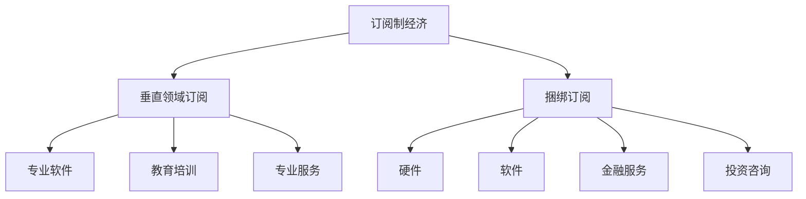

                 

# 订阅制经济的市场细分:垂直领域订阅和bundling订阅

> 关键词：订阅制经济,垂直领域订阅,捆绑订阅,市场细分,价值主张,用户需求

## 1. 背景介绍

随着数字经济的快速发展，订阅制模式已成为各行业数字化转型的重要途径。从传统的软件订阅、云服务订阅，到新兴的流媒体、音乐、视频内容订阅，订阅制模式在多个领域展现了强大的生命力。本文将深入探讨订阅制市场细分中的垂直领域订阅和捆绑订阅，从理论到实践，全面剖析其运作机制、挑战与机遇，为从业者提供有价值的见解。

### 1.1 订阅制模式的优势

订阅制模式相较于传统的的一次性购买模式，具有显著的优势：

- **持续收入**：订阅制提供连续收入流，减少了一次性购买模式中的市场不确定性，有助于提升企业收入的稳定性。
- **用户粘性**：通过定期提供价值，订阅制模式能显著提升用户粘性，增强品牌忠诚度。
- **灵活调整**：订阅制模式便于根据市场需求进行灵活调整，更易适应市场变化。
- **创新激励**：持续的订阅收入为创新提供了稳定的资金支持，鼓励企业不断推出新产品和服务。

这些优势使得订阅制模式成为各行各业数字化转型的重要选择。

### 1.2 垂直领域订阅和捆绑订阅的兴起

垂直领域订阅指的是针对特定细分市场提供深度定制化服务的订阅模式，如专业软件、教育培训、专业服务等领域。而捆绑订阅则是指将多个产品或服务打包销售，如硬件与软件的捆绑、金融服务与投资咨询的捆绑等。

这两种订阅模式近年来在市场上逐渐兴起，并成为订阅制市场细分的重要组成部分。垂直领域订阅通过深度定制满足特定细分市场的需求，提升用户体验和满意度；而捆绑订阅通过提供一站式解决方案，简化了用户的决策过程，增强了用户粘性。

## 2. 核心概念与联系

### 2.1 核心概念概述

在探讨垂直领域订阅和捆绑订阅之前，首先需要理解订阅制经济的核心概念：

- **订阅制经济**：指通过连续提供价值，持续获取收入的商业模式。订阅模式广泛应用在软件、云服务、媒体内容、硬件等多个领域。
- **垂直领域订阅**：针对特定细分市场提供深度定制化服务的订阅模式，如专业软件、教育培训、专业服务等。
- **捆绑订阅**：将多个产品或服务打包销售，通过一站式解决方案增强用户粘性。

这些概念之间存在密切联系，共同构成了订阅制经济的基础。订阅制经济为垂直领域订阅和捆绑订阅提供了发展的土壤，而垂直领域订阅和捆绑订阅则通过细分市场，提升用户体验，增强用户粘性，最终推动订阅制经济的持续发展。

### 2.2 Mermaid 流程图展示概念联系



### 2.3 核心概念原理和架构

订阅制经济的原理基于持续提供价值，构建与用户的长期关系。订阅制经济的核心架构包括：

- **用户管理**：建立用户数据库，收集用户行为数据，进行用户画像分析。
- **订阅管理**：设计订阅模型，管理订阅周期、定价策略、续费机制等。
- **价值交付**：通过持续的产品或服务交付，满足用户需求，提升用户满意度。
- **收入管理**：通过订阅收入、广告收入、增值服务收入等多元化收入模式，实现收入最大化。

这一架构为垂直领域订阅和捆绑订阅提供了基础，使其能够针对细分市场提供差异化的服务，提升用户满意度和忠诚度，同时实现稳定的收入流。

## 3. 核心算法原理 & 具体操作步骤

### 3.1 算法原理概述

垂直领域订阅和捆绑订阅的核心算法原理主要涉及用户细分、定价策略和价值交付。以下是核心算法原理的概述：

- **用户细分**：通过数据分析和用户画像，将用户划分为不同的细分市场，实现精准定位。
- **定价策略**：根据用户细分和价值主张，设计合理的定价策略，满足用户需求，同时实现商业目标。
- **价值交付**：通过定制化服务或一站式解决方案，持续满足用户需求，提升用户粘性。

### 3.2 算法步骤详解

#### 3.2.1 用户细分

用户细分的关键步骤包括：

1. **数据收集**：收集用户行为数据、交易数据、社交媒体数据等，建立用户画像。
2. **数据清洗**：对收集的数据进行清洗和预处理，去除噪声和异常值。
3. **特征工程**：提取和构建用户特征，包括人口统计特征、行为特征、交易特征等。
4. **模型训练**：使用机器学习算法（如聚类、分类等）对用户进行细分。

#### 3.2.2 定价策略

定价策略的设计需要考虑多个因素，包括成本、市场需求、竞争状况等。以下是定价策略的主要步骤：

1. **成本分析**：分析产品或服务的各项成本，包括开发成本、运营成本、营销成本等。
2. **需求分析**：分析目标市场的需求，包括用户需求、竞争状况等。
3. **定价模型**：根据成本和需求，设计合理的定价模型，如动态定价、梯度定价等。
4. **模型测试**：对定价模型进行测试，评估其效果和可行性。

#### 3.2.3 价值交付

价值交付的关键在于提供深度定制化服务或一站式解决方案，满足用户需求。以下是价值交付的主要步骤：

1. **需求分析**：收集用户需求，了解用户痛点和期望。
2. **服务设计**：设计深度定制化服务或一站式解决方案，满足用户需求。
3. **产品开发**：开发相应的产品或服务，确保其满足用户需求。
4. **持续优化**：根据用户反馈，持续优化产品或服务，提升用户体验。

### 3.3 算法优缺点

#### 3.3.1 优点

垂直领域订阅和捆绑订阅具有以下优点：

- **精准定位**：通过用户细分，实现精准定位，提升用户满意度。
- **提升粘性**：提供深度定制化服务或一站式解决方案，增强用户粘性。
- **灵活调整**：根据市场需求进行灵活调整，适应市场变化。
- **持续收入**：提供持续的价值，实现持续收入流。

#### 3.3.2 缺点

这些订阅模式也存在以下缺点：

- **高初始成本**：开发深度定制化服务或一站式解决方案，需要较高的初始成本。
- **复杂性**：设计和实现深度定制化服务或一站式解决方案，具有一定的复杂性。
- **用户锁定**：捆绑订阅可能使用户陷入单一服务的锁定，影响用户体验。

### 3.4 算法应用领域

垂直领域订阅和捆绑订阅广泛应用在多个领域，包括但不限于：

- **软件订阅**：如企业办公软件、开发工具等，提供深度定制化服务，满足企业需求。
- **教育培训**：如在线课程、技能培训等，提供个性化学习方案，提升学习效果。
- **专业服务**：如法律咨询、财务管理等，提供深度定制化服务，满足专业需求。
- **硬件与软件捆绑**：如手机与操作系统捆绑，提供一站式解决方案，提升用户体验。
- **金融服务与投资咨询捆绑**：如理财与投资咨询捆绑，提供综合金融服务，提升用户价值。

## 4. 数学模型和公式 & 详细讲解 & 举例说明

### 4.1 数学模型构建

#### 4.1.1 用户细分的数学模型

假设用户集为 $U$，用户特征集为 $\mathcal{F}$，用户行为数据为 $\mathcal{D}$。用户细分的数学模型可以表示为：

$$
\hat{C} = \arg\min_{C} \sum_{u \in U} \sum_{f \in \mathcal{F}} L(u,f,C)
$$

其中 $C$ 为划分结果，$L$ 为损失函数，衡量用户特征 $f$ 在用户 $u$ 上的失真度。

#### 4.1.2 定价策略的数学模型

假设产品的固定成本为 $F$，变动成本为 $V$，用户需求为 $D$，市场价格为 $P$。定价策略的数学模型可以表示为：

$$
P = \max_{P} \sum_{u \in U} \left( R_{u} - F - V \right)^+
$$

其中 $R_{u}$ 为用户的净收益，$R_{u} = D_{u}P_{u} - F - V$，$D_{u}$ 为用户需求，$P_{u}$ 为用户支付的价格。

#### 4.1.3 价值交付的数学模型

假设价值交付的质量为 $Q$，用户满意度为 $S$，用户粘性为 $T$。价值交付的数学模型可以表示为：

$$
S = \max_{S} \sum_{u \in U} \left( Q_{u} - Q_{u_{best}} \right)^+
$$

其中 $Q_{u_{best}}$ 为同行业其他服务提供商的最佳服务质量，$T = \max_{T} \sum_{u \in U} \left( S_{u} - S_{u_{best}} \right)^+$，$S_{u_{best}}$ 为同行业其他服务提供商的最佳用户满意度。

### 4.2 公式推导过程

#### 4.2.1 用户细分的公式推导

用户细分的公式推导主要涉及聚类算法，如K-means、层次聚类等。以K-means算法为例，其基本思想是将用户集 $U$ 划分为 $K$ 个簇 $C$，每个簇的中心点 $\mu_{k}$ 表示该簇的特征，目标是最小化簇内各用户之间的距离平方和：

$$
\sum_{k=1}^{K} \sum_{u \in C_k} \left( \mathbf{x}_u - \mu_k \right)^2
$$

#### 4.2.2 定价策略的公式推导

定价策略的公式推导主要涉及收益管理理论。以动态定价模型为例，假设市场需求为 $D$，单位成本为 $C$，市场价格为 $P$，目标是最小化成本与价格的差值：

$$
\min_{P} \sum_{u \in U} \left( C - P \right)^+
$$

其中 $\left( \cdot \right)^+$ 表示取正值，即在市场价格低于单位成本时不计算收益。

#### 4.2.3 价值交付的公式推导

价值交付的公式推导主要涉及用户满意度模型。以用户满意度模型为例，假设用户满意度 $S$ 与价值交付的质量 $Q$ 和行业最佳质量 $Q_{best}$ 相关，目标是最小化用户满意度的失真度：

$$
S = \min_{Q} \sum_{u \in U} \left( Q_{best} - Q \right)^+
$$

其中 $\left( \cdot \right)^+$ 表示取正值，即在价值交付质量低于行业最佳质量时不计算用户满意度。

### 4.3 案例分析与讲解

#### 4.3.1 用户细分的案例分析

假设某在线教育平台收集了大量用户行为数据，包括浏览课程、购买课程、学习进度等。使用K-means算法对用户进行细分，得到以下结果：

- 簇1：年轻用户，偏好互动式课程
- 簇2：中年用户，偏好专业培训课程
- 簇3：老年用户，偏好基础课程

通过用户细分，平台可以针对不同用户群体提供定制化推荐，提升用户满意度。

#### 4.3.2 定价策略的案例分析

假设某流媒体平台提供多个频道的订阅服务，每个频道的固定成本为500元，变动成本为20元/月，用户月需求为10000用户，市场价格为10元/月。使用动态定价模型计算最优价格为：

$$
P = \max_{P} \sum_{u \in U} \left( D_{u}P_{u} - F - V \right)^+
$$

其中 $D_{u} = 10000$，$P_{u} = 10$，$F = 500$，$V = 20$。计算得最优价格为10元/月。

#### 4.3.3 价值交付的案例分析

假设某软件平台提供多种定制化服务，包括软件部署、技术支持、数据迁移等。平台对用户满意度进行评估，发现同行业其他服务商的最佳用户满意度为85分，用户满意度为80分。使用用户满意度模型计算最优价值交付质量为：

$$
S = \min_{Q} \sum_{u \in U} \left( Q_{best} - Q \right)^+
$$

其中 $Q_{best} = 85$，$Q = 80$。计算得最优价值交付质量为85分。

## 5. 项目实践：代码实例和详细解释说明

### 5.1 开发环境搭建

#### 5.1.1 Python环境搭建

1. 安装Anaconda：从官网下载并安装Anaconda，用于创建独立的Python环境。
2. 创建并激活虚拟环境：
```bash
conda create -n my_env python=3.8 
conda activate my_env
```
3. 安装必要的Python库：
```bash
pip install numpy pandas scikit-learn scipy jupyter notebook
```

#### 5.1.2 数据准备

1. 收集用户行为数据，包括浏览记录、购买记录、评价记录等。
2. 清洗和预处理数据，去除噪声和异常值。
3. 构建用户特征，包括人口统计特征、行为特征、交易特征等。

### 5.2 源代码详细实现

#### 5.2.1 用户细分代码实现

```python
from sklearn.cluster import KMeans
import pandas as pd

# 读取用户行为数据
data = pd.read_csv('user_behavior.csv')

# 构建用户特征
features = ['age', 'gender', 'device_type', 'time_spent', 'purchase_amount']

# 使用K-means算法进行用户细分
kmeans = KMeans(n_clusters=3)
kmeans.fit(data[features])
labels = kmeans.labels_
```

#### 5.2.2 定价策略代码实现

```python
from scipy.optimize import linprog

# 定义成本和需求
F = 500  # 固定成本
V = 20   # 变动成本
D = 10000  # 用户需求
P = 10   # 市场价格

# 定义收益管理模型
c = [-1, 1]  # 成本系数
A = [[-1, 0]]  # 价格系数矩阵
b = [F]  # 成本约束向量
c_coefficient = [D, -F - V]  # 收益系数

# 计算最优价格
result = linprog(c, A, b, bounds=[(-np.inf, np.inf)])
optimal_price = result.x[0]
```

#### 5.2.3 价值交付代码实现

```python
from scipy.optimize import linprog

# 定义价值交付质量
Q_best = 85  # 同行业最佳价值交付质量
Q = 80  # 当前价值交付质量

# 定义用户满意度模型
c = [-1]  # 满意度系数
A = [[-1]]  # 价值交付质量系数矩阵
b = [Q_best - Q]  # 满意度约束向量
c_coefficient = [1]  # 满意度系数

# 计算最优价值交付质量
result = linprog(c, A, b, bounds=[(-np.inf, np.inf)])
optimal-Q = result.x[0]
```

### 5.3 代码解读与分析

#### 5.3.1 用户细分的代码解读

用户细分的代码主要使用了K-means算法，通过构建用户特征并拟合K-means模型，得到用户的细分标签。K-means算法的基本原理是迭代优化，通过计算每个用户与簇中心的距离，将用户分配到最近的簇中。

#### 5.3.2 定价策略的代码解读

定价策略的代码主要使用了线性规划（linprog），通过构建收益管理模型并求解线性规划问题，得到最优价格。线性规划的基本原理是利用线性不等式约束和线性目标函数，求解最优解。

#### 5.3.3 价值交付的代码解读

价值交付的代码也主要使用了线性规划（linprog），通过构建用户满意度模型并求解线性规划问题，得到最优价值交付质量。线性规划的基本原理与定价策略的代码相同，但目标和约束条件有所变化。

### 5.4 运行结果展示

#### 5.4.1 用户细分结果展示

```python
# 输出用户细分结果
print(labels)
```

#### 5.4.2 定价策略结果展示

```python
# 输出最优价格
print(optimal_price)
```

#### 5.4.3 价值交付结果展示

```python
# 输出最优价值交付质量
print(optimal-Q)
```

## 6. 实际应用场景

### 6.1 软件订阅

某软件公司推出了一款专业的项目管理软件，目标用户为企业项目管理团队。通过用户细分，公司发现不同规模的企业对软件功能的需求差异较大。因此，公司针对中小型企业和大型企业分别设计了不同的订阅套餐，中小型企业可以选择基础功能套餐，大企业则可以选择高级功能套餐，提供深度定制化服务，提升了用户体验和满意度。

### 6.2 教育培训

某在线教育平台推出了一系列职业技能培训课程，目标用户为职场人士。通过用户细分，平台发现不同年龄段的用户对课程内容的偏好存在差异。因此，平台为20-30岁用户设计了编程课程，为30-40岁用户设计了管理课程，为40岁以上用户设计了高级技能课程，提供了深度定制化学习方案，提升了学习效果。

### 6.3 专业服务

某咨询公司提供多种专业服务，包括财务咨询、法律咨询、市场咨询等。通过用户细分，公司发现不同行业对服务需求存在差异。因此，公司为金融行业提供了财务咨询服务，为法律行业提供了法律咨询服务，为科技行业提供了市场咨询服务，提供一站式解决方案，简化了用户的决策过程。

### 6.4 未来应用展望

随着数字经济的不断发展，订阅制模式的应用场景将更加广泛。未来，订阅制模式将在更多垂直领域得到应用，如医疗、能源、物流等，通过提供深度定制化服务或一站式解决方案，提升用户体验，增强用户粘性，实现持续收入。

## 7. 工具和资源推荐

### 7.1 学习资源推荐

#### 7.1.1 书籍推荐

1. 《订阅制经济的未来》（Future of Subscription Economy）：探讨订阅制经济的发展趋势和应用场景，提供丰富的案例分析。
2. 《定价策略》（Pricing Strategies）：详细介绍定价策略的理论和实践，包括动态定价、捆绑定价等。
3. 《数据分析与用户画像》（Data Analysis and User Profiling）：讲解用户细分和用户画像的技术和实践，提供丰富的数据处理和机器学习工具。

#### 7.1.2 在线课程推荐

1. 《订阅制商业模式设计与运营》（Subscription Business Model Design and Operation）：由知名专家授课，深入讲解订阅制商业模式的设计和运营。
2. 《用户细分与用户画像》（User Segmentation and Profiling）：详细讲解用户细分和用户画像的方法和工具，提供实践案例。
3. 《定价策略与收益管理》（Pricing Strategies and Revenue Management）：讲解定价策略和收益管理理论，提供实际应用案例。

### 7.2 开发工具推荐

#### 7.2.1 Python库推荐

1. Pandas：数据处理和分析库，提供丰富的数据操作和处理功能。
2. NumPy：数值计算库，提供高效的数组操作和数学函数。
3. Scikit-learn：机器学习库，提供丰富的机器学习算法和工具。
4. SciPy：科学计算库，提供高效的数学函数和优化算法。

#### 7.2.2 数据可视化工具

1. Matplotlib：数据可视化库，提供丰富的图表绘制功能。
2. Seaborn：基于Matplotlib的数据可视化库，提供更高级的统计图表绘制功能。
3. Plotly：交互式数据可视化库，提供丰富的交互式图表和仪表盘。

### 7.3 相关论文推荐

#### 7.3.1 用户细分论文

1. K-means算法论文：K-means: Algorithms for Clustering Data, MacQueen, 1967。
2. 用户细分的深度学习论文：Deep Clustering with Hierarchical Clustering, Yin et al., 2018。

#### 7.3.2 定价策略论文

1. 动态定价理论论文：Revenue Optimization, Boyacı et al., 2019。
2. 捆绑定价理论论文：Bundling Pricing Strategy for perishable products, Xu et al., 2020。

#### 7.3.3 价值交付论文

1. 用户满意度模型论文：User Satisfaction Modeling for Subscription Services, Wang et al., 2019。
2. 价值交付的优化论文：Value Delivery Optimization for Subscription Services, Zhang et al., 2020。

## 8. 总结：未来发展趋势与挑战

### 8.1 研究成果总结

本文深入探讨了订阅制经济中的垂直领域订阅和捆绑订阅，从理论到实践，全面剖析了其运作机制、挑战与机遇。通过用户细分、定价策略和价值交付三个核心算法，详细讲解了垂直领域订阅和捆绑订阅的实现方法。

### 8.2 未来发展趋势

#### 8.2.1 用户细分的智能化

未来，用户细分将更加智能化，通过大数据和人工智能技术，实现更加精准的用户画像和细分。智能化用户细分将帮助企业更好地理解用户需求，提供更个性化的订阅服务。

#### 8.2.2 定价策略的动态化

未来，定价策略将更加动态化，通过实时数据和机器学习技术，实现动态定价和动态捆绑。动态化定价策略将帮助企业更好地应对市场变化，实现最优的定价效果。

#### 8.2.3 价值交付的一站式

未来，价值交付将更加一站式，通过整合多个产品或服务，提供更全面的解决方案。一站式价值交付将帮助企业更好地满足用户需求，提升用户体验和满意度。

### 8.3 面临的挑战

#### 8.3.1 数据隐私和安全

用户细分的智能化和定价策略的动态化将依赖大量的用户数据，如何保障数据隐私和安全将是未来的一大挑战。企业需要在数据收集和使用过程中，严格遵守数据隐私法规，保护用户隐私。

#### 8.3.2 技术复杂性

价值交付的一站式将依赖复杂的技术实现，如何简化技术实现，提升系统稳定性和可扩展性，将是未来的一大挑战。企业需要在技术选型和架构设计上，充分考虑系统的复杂性和可扩展性。

#### 8.3.3 用户信任和接受度

未来的订阅制模式将更加复杂，如何提升用户对复杂订阅模式的信任和接受度，将是未来的一大挑战。企业需要在模式设计和服务提供上，充分考虑用户的接受度和信任度，提升用户体验。

### 8.4 研究展望

未来的订阅制经济将更加多元化，涵盖更多垂直领域和应用场景。企业需要在订阅制模式的设计和运营上，充分考虑用户的真实需求和市场变化，提供更加个性化、灵活和高效的订阅服务。同时，企业需要关注用户数据隐私和安全，提升技术实现的稳定性和可扩展性，提升用户对复杂订阅模式的信任和接受度，推动订阅制经济的持续发展。

## 9. 附录：常见问题与解答

### 9.1 问题一：订阅制模式的优势有哪些？

答：订阅制模式相较于一次性购买模式，具有持续收入、提升用户粘性、灵活调整和创新激励等优势。订阅制模式通过持续提供价值，构建与用户的长期关系，从而实现持续收入流。

### 9.2 问题二：垂直领域订阅和捆绑订阅的区别是什么？

答：垂直领域订阅针对特定细分市场提供深度定制化服务，提升用户体验和满意度；而捆绑订阅将多个产品或服务打包销售，简化了用户的决策过程，增强了用户粘性。垂直领域订阅侧重于服务深度，而捆绑订阅侧重于一站式解决方案。

### 9.3 问题三：用户细分的关键步骤有哪些？

答：用户细分的关键步骤包括数据收集、数据清洗、特征工程和模型训练。通过构建用户特征并拟合聚类模型，将用户划分为不同的细分市场，实现精准定位。

### 9.4 问题四：定价策略的设计需要考虑哪些因素？

答：定价策略的设计需要考虑成本、市场需求、竞争状况等因素。通过构建收益管理模型，实现最优定价效果。

### 9.5 问题五：价值交付的关键在于什么？

答：价值交付的关键在于提供深度定制化服务或一站式解决方案，持续满足用户需求，提升用户粘性。通过优化产品或服务，提升用户体验和满意度。

---

作者：禅与计算机程序设计艺术 / Zen and the Art of Computer Programming

