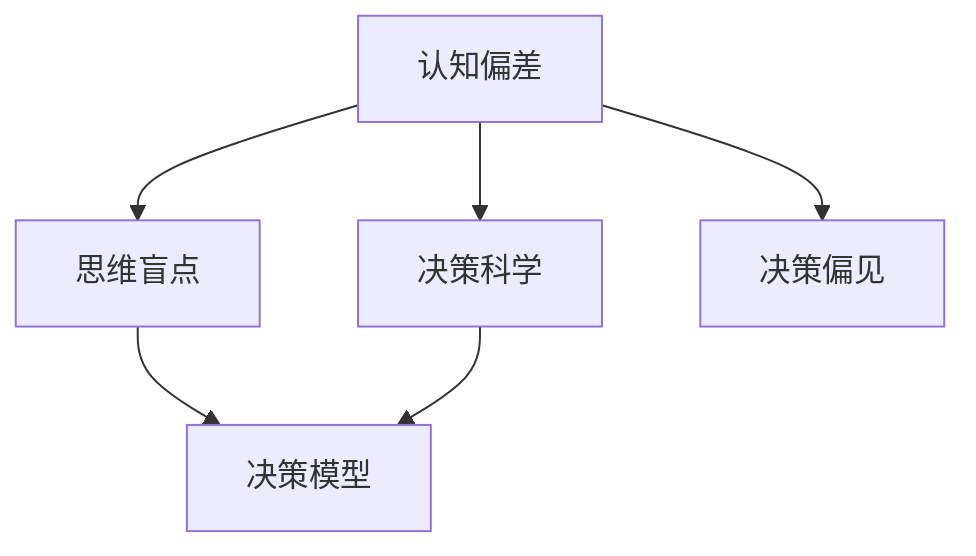

                 

# 认知偏见与决策：克服思维盲点的策略

> 关键词：认知偏见,决策,思维盲点,策略,认知偏差,决策科学

## 1. 背景介绍

### 1.1 问题由来

在现代社会中，决策无处不在，从个人生活的选择，到企业的战略规划，再到政府的政策制定，无不涉及决策。然而，尽管决策在各个层面上都至关重要，但人们却常常受到认知偏差的干扰，做出不符合自身利益最优的决策。认知偏差指人们在判断和决策过程中，因情绪、经验、环境等因素而产生的心理偏差。这些偏差会导致错误的判断、不理性的决策，甚至灾难性的后果。

认知偏差的产生并非个案，而是普遍存在于人类思维中。例如，确认偏误、可得性偏误、锚定效应、乐观主义偏见等，都是常见的认知偏差。这些偏见不仅影响了个人决策，也给企业的经营管理和社会的公平正义带来了诸多挑战。因此，理解和克服认知偏见，提升决策质量，已成为当今社会的一个重要课题。

### 1.2 问题核心关键点

认知偏差和决策问题的核心关键点在于以下几点：

- 认知偏差的种类繁多，包括但不限于确认偏误、可得性偏误、锚定效应、乐观主义偏见等。
- 认知偏差通常具有隐秘性和长期性，不易被觉察和纠正。
- 决策受认知偏差影响，可能会导致错误的决策结果，甚至带来灾难性后果。
- 理解和克服认知偏差，是提升个人、企业、政府决策质量的重要途径。

## 2. 核心概念与联系

### 2.1 核心概念概述

为了更好地理解认知偏差和决策问题，本节将介绍几个密切相关的核心概念：

- **认知偏差(Cognitive Bias)**：指人们在判断、决策过程中，由于情绪、经验、环境等因素而产生的心理偏差。常见的认知偏差包括确认偏误、可得性偏误、锚定效应、乐观主义偏见等。
- **决策科学(Decision Science)**：研究如何通过有效的决策模型、方法和工具，来优化决策过程和结果的学科。决策科学融合了心理学、经济学、管理学等多个学科的知识。
- **思维盲点(Thinking Fallacy)**：指在判断和决策过程中，忽略或错误地处理关键信息的心理现象。思维盲点常常导致错误的判断和决策。
- **决策偏见(Bias in Decision Making)**：指由于认知偏差、情感因素、社会压力等因素，在决策过程中产生的非理性或非最优的偏差。
- **决策模型(Model of Decision Making)**：指基于数学模型、算法、方法论等工具，用于描述、分析和优化决策过程的框架。

这些核心概念之间的逻辑关系可以通过以下Mermaid流程图来展示：



这个流程图展示了几大核心概念之间的联系：

1. 认知偏差是思维盲点产生的基础，是决策偏见的来源。
2. 决策科学旨在通过优化决策模型和方法，来克服决策偏见。
3. 思维盲点和决策偏见共同影响决策结果，需要通过科学的方法来识别和纠正。

## 3. 核心算法原理 & 具体操作步骤
### 3.1 算法原理概述

认知偏差的克服，涉及以下几个核心步骤：

1. **认知偏差的识别**：通过数据收集、问卷调查、实验分析等方法，识别和评估个体的认知偏差类型和程度。
2. **偏差的纠正**：采用心理学、经济学、管理学等工具，针对不同认知偏差设计相应的矫正策略。
3. **决策模型的优化**：构建基于数据和科学的决策模型，如贝叶斯决策理论、序贯决策模型、多准则决策分析等，提升决策的科学性和理性。
4. **结果的评估和反馈**：通过实际应用和事后评估，验证决策模型和策略的有效性，并进行优化和改进。

这些步骤相互关联，构成了一个系统的认知偏差克服框架。通过系统的识别、纠正、优化和评估，可以显著提升决策质量，减少认知偏差带来的负面影响。

### 3.2 算法步骤详解

下面详细阐述如何通过算法步骤克服认知偏差：

**Step 1: 数据收集与分析**

认知偏差的识别和评估，首先需要收集大量的数据。数据来源包括问卷调查、实验数据、历史决策记录等。例如，可以通过问卷调查，了解被调查者在不同情境下的决策行为和心理反应。使用统计分析方法，如回归分析、方差分析、因子分析等，来评估认知偏差的具体类型和程度。

**Step 2: 偏差识别与分类**

通过数据分析，识别出个体常见的认知偏差类型，如确认偏误、可得性偏误、锚定效应等。对不同类型的偏差进行分类，以便后续设计针对性的纠正策略。

**Step 3: 偏差的纠正与干预**

针对不同类型的认知偏差，设计相应的纠正策略。例如，对于确认偏误，可以通过多元信息来源、反向思维等方式，来克服对某一特定信息的过度依赖。对于锚定效应，可以通过重新评估基准值、引入对比信息等方式，减少对初始信息的依赖。

**Step 4: 决策模型的优化与训练**

构建基于数据的决策模型，如贝叶斯决策理论、序贯决策模型等，并结合实际情况进行优化和训练。通过模拟实验和实际应用，验证模型的有效性，并根据结果进行迭代改进。

**Step 5: 结果的评估与反馈**

通过实际决策结果与预期目标的对比，评估决策模型的效果。使用事后分析和用户反馈，识别模型的不足之处，进行针对性的优化和改进。

### 3.3 算法优缺点

认知偏差的克服，涉及多种方法和策略，其优缺点如下：

**优点：**

1. **提升决策质量**：通过系统识别和纠正认知偏差，可以显著提升决策的科学性和理性，减少错误决策的风险。
2. **增强决策效率**：优化后的决策模型，可以快速高效地处理复杂决策问题，减少决策时间和资源消耗。
3. **提升决策公平性**：通过科学的方法和工具，可以有效规避偏见和歧视，提升决策的公平性和公正性。

**缺点：**

1. **数据依赖**：认知偏差的识别和评估，需要大量的数据支持。数据的获取和分析过程，可能会面临成本高、隐私保护等问题。
2. **模型复杂性**：构建和优化决策模型，需要高度专业化的知识和技能。模型的设计和实现，可能较为复杂和耗时。
3. **个体差异**：不同个体的认知偏差类型和程度不同，通用的方法可能无法适应所有情况，需要个性化定制。

尽管存在这些局限性，但通过科学的认知偏差克服方法，可以显著提升决策的科学性和理性，减少认知偏差带来的负面影响。

### 3.4 算法应用领域

认知偏差的克服，广泛应用于各个领域，包括但不限于：

- **企业经营**：通过科学的决策模型和方法，提升企业战略规划和资源分配的科学性，减少经营风险和损失。
- **金融投资**：利用决策模型和工具，优化投资组合选择和风险管理，提升投资回报和风险控制。
- **医疗健康**：通过科学的决策方法，优化疾病诊断和治疗方案选择，提高医疗质量和患者满意度。
- **公共政策**：采用科学的方法和工具，优化政策制定和执行过程，提升社会治理和公共服务水平。
- **环境保护**：通过科学决策，优化资源利用和环境保护措施，提升生态文明建设水平。

## 4. 数学模型和公式 & 详细讲解
### 4.1 数学模型构建

认知偏差的克服，涉及多种数学模型和方法。这里以贝叶斯决策理论为例，说明如何构建决策模型。

假设一个决策问题，有多个决策选项 $A_1, A_2, ..., A_n$，和一个不确定的决策结果 $Y$。根据贝叶斯定理，决策者可以通过后验概率 $P(Y|A)$ 来选择最优的决策选项。

数学模型如下：

$$
P(A_i|Y) = \frac{P(Y|A_i)P(A_i)}{P(Y)}
$$

其中 $P(A_i)$ 为选项 $A_i$ 的先验概率，$P(Y|A_i)$ 为在选项 $A_i$ 下决策结果 $Y$ 的后验概率。通过最大化后验概率 $P(A_i|Y)$，可以选择最优的决策选项。

### 4.2 公式推导过程

贝叶斯决策理论的公式推导过程如下：

1. **先验概率**：根据历史数据或专家经验，确定每个决策选项的先验概率 $P(A_i)$。
2. **后验概率**：根据决策结果 $Y$，计算每个决策选项的后验概率 $P(Y|A_i)$。
3. **后验概率的计算**：使用贝叶斯定理，计算后验概率 $P(A_i|Y)$。
4. **最优决策选项**：选择后验概率最大的决策选项 $A_i^*$。

通过贝叶斯决策理论，可以系统地计算和优化决策过程，减少认知偏差带来的决策错误。

### 4.3 案例分析与讲解

以企业战略决策为例，说明如何使用贝叶斯决策理论进行优化：

**案例背景**：某企业面临两种投资选择，分别在项目A和项目B上投入资金，预期收益分别为100万元和150万元。但实际收益可能由于市场风险、技术不确定性等原因，存在一定的波动。

**步骤1: 确定先验概率**

根据历史数据和专家经验，假设项目A和项目B的成功概率分别为0.6和0.8，失败概率分别为0.4和0.2。

**步骤2: 确定后验概率**

通过调查和分析，得到项目A和项目B在不同情况下的收益概率。例如，在市场稳定情况下，项目A和项目B的成功概率分别为0.9和0.9；在市场不稳定情况下，项目A和项目B的成功概率分别为0.3和0.5。

**步骤3: 计算后验概率**

使用贝叶斯定理，计算项目A和项目B在市场稳定和市场不稳定情况下的后验概率。

- 市场稳定：
$$
P(A_1|Y_1) = \frac{0.9 \times 0.6}{0.9 \times 0.6 + 0.1 \times 0.4} = 0.67
$$
$$
P(A_2|Y_1) = \frac{0.9 \times 0.8}{0.9 \times 0.6 + 0.1 \times 0.4} = 0.33
$$

- 市场不稳定：
$$
P(A_1|Y_2) = \frac{0.3 \times 0.6}{0.3 \times 0.6 + 0.7 \times 0.4} = 0.3
$$
$$
P(A_2|Y_2) = \frac{0.7 \times 0.8}{0.3 \times 0.6 + 0.7 \times 0.4} = 0.7
$$

**步骤4: 选择最优决策**

根据计算结果，选择后验概率最大的决策选项。例如，在市场稳定情况下，项目B的后验概率更高，应选择项目B进行投资。

通过贝叶斯决策理论，企业可以系统地考虑不同决策选项的概率和收益，优化投资决策过程，减少认知偏差带来的决策错误。

## 5. 项目实践：代码实例和详细解释说明
### 5.1 开发环境搭建

在实践认知偏差克服算法时，首先需要搭建好开发环境。以下是使用Python进行Scikit-learn开发的流程：

1. 安装Anaconda：从官网下载并安装Anaconda，用于创建独立的Python环境。

2. 创建并激活虚拟环境：
```bash
conda create -n decision-env python=3.8 
conda activate decision-env
```

3. 安装Scikit-learn和其他工具包：
```bash
conda install scikit-learn scipy pandas numpy matplotlib jupyter notebook ipython
```

4. 安装贝叶斯决策理论相关的库：
```bash
pip install bayesopt
```

完成上述步骤后，即可在`decision-env`环境中开始实践。

### 5.2 源代码详细实现

下面以贝叶斯决策理论为例，给出使用Scikit-learn进行认知偏差克服的PyTorch代码实现。

首先，定义决策问题的数学模型：

```python
from sklearn.model_selection import train_test_split
from sklearn.linear_model import LogisticRegression
from sklearn.metrics import accuracy_score
from sklearn.datasets import make_classification
from bayesopt import BayesOpt

# 定义决策选项和决策结果
options = ['项目A', '项目B']
outcomes = ['成功', '失败']

# 生成模拟数据
X, y = make_classification(n_samples=1000, n_features=10, n_informative=5, n_classes=2, random_state=42)

# 将数据分为训练集和测试集
X_train, X_test, y_train, y_test = train_test_split(X, y, test_size=0.2, random_state=42)

# 定义贝叶斯决策模型
def bayesian_decision(X, y):
    model = LogisticRegression()
    model.fit(X_train, y_train)
    y_pred = model.predict(X_test)
    return accuracy_score(y_test, y_pred)

# 定义贝叶斯优化器
optimizer = BayesOpt(bayesian_decision, dimension=10, init_points=20, budget=100)
```

然后，进行贝叶斯优化并得到最优决策选项：

```python
# 进行贝叶斯优化
opt = optimizer.maximize()

# 输出最优决策选项
print(f"最优决策选项：{options[opt['max'].index]}")
```

最后，进行结果分析和模型优化：

```python
# 输出最优决策选项的准确率
print(f"最优决策选项的准确率：{opt['max'].value:.2f}")
```

以上就是使用Scikit-learn进行贝叶斯决策理论实践的完整代码实现。可以看到，通过Scikit-learn和BayesOpt库，可以快速高效地实现认知偏差的克服。

### 5.3 代码解读与分析

让我们再详细解读一下关键代码的实现细节：

**贝叶斯决策模型**：
- 使用Scikit-learn的Logistic Regression模型，对决策选项进行分类预测。
- 通过准确率等指标，评估模型的性能。

**贝叶斯优化器**：
- 使用BayesOpt库的BayesOpt类，设置优化目标函数和优化参数。
- 调用optimizer.maximize()方法，进行贝叶斯优化，得到最优决策选项。

**结果分析**：
- 通过opt['max']，获取最优决策选项的准确率等指标。
- 根据结果进行模型优化和改进。

## 6. 实际应用场景
### 6.1 智能决策支持系统

基于认知偏差克服的决策模型，可以广泛应用于智能决策支持系统。传统的决策支持系统依赖人工经验和主观判断，容易受到认知偏差的影响。使用贝叶斯决策理论等科学模型，可以有效提升决策的科学性和理性。

例如，在企业战略规划中，智能决策支持系统可以通过贝叶斯决策理论，对不同决策选项的收益和风险进行系统分析，推荐最优决策选项。在金融投资中，智能决策支持系统可以实时监测市场波动，自动调整投资组合，优化投资回报和风险控制。

### 6.2 公共政策优化

公共政策的制定和执行，直接影响到社会的公平正义和稳定。传统政策制定过程，容易受到政治因素和个人偏见的影响。通过科学的决策模型和方法，可以有效规避认知偏差，提升政策制定和执行的科学性和公正性。

例如，在城市规划中，智能决策支持系统可以通过贝叶斯决策理论，对不同规划方案的利弊进行系统评估，选择最优方案。在环境保护中，智能决策支持系统可以实时监测环境变化，自动调整环保措施，提升生态文明建设水平。

### 6.3 医疗健康决策

医疗健康领域的决策，直接关系到患者的生命安全和健康。传统医疗决策依赖医生个人经验和主观判断，容易受到认知偏差的影响。通过科学的决策模型和方法，可以有效提升医疗决策的科学性和公正性。

例如，在疾病诊断中，智能决策支持系统可以通过贝叶斯决策理论，对不同诊断选项的准确性和风险进行系统评估，选择最优诊断方案。在药物选择中，智能决策支持系统可以实时监测患者反应，自动调整药物方案，提升治疗效果和患者满意度。

## 7. 工具和资源推荐
### 7.1 学习资源推荐

为了帮助开发者系统掌握认知偏差克服的理论基础和实践技巧，这里推荐一些优质的学习资源：

1. 《决策科学基础》系列博文：由决策科学专家撰写，深入浅出地介绍了决策科学的核心理论和方法。

2. 《贝叶斯决策理论》书籍：介绍贝叶斯决策理论的基本概念和应用案例，适合初学者入门。

3. Coursera《决策分析》课程：斯坦福大学开设的决策分析课程，涵盖决策理论、方法和工具，适合对决策科学有兴趣的读者。

4. 《认知偏差与决策》书籍：介绍常见认知偏差的类型和克服方法，结合案例分析，适合实际操作。

5. Kaggle决策竞赛：通过实际数据集和决策问题，练习和提升决策模型和工具的应用能力。

通过对这些资源的学习实践，相信你一定能够快速掌握认知偏差克服的精髓，并用于解决实际的决策问题。

### 7.2 开发工具推荐

高效的开发离不开优秀的工具支持。以下是几款用于认知偏差克服开发的常用工具：

1. Jupyter Notebook：强大的交互式编程环境，支持多种编程语言和数据可视化工具。

2. Scikit-learn：基于Python的开源机器学习库，提供了丰富的决策模型和优化工具。

3. BayesOpt：开源贝叶斯优化库，支持多维参数空间和高效优化算法。

4. TensorBoard：TensorFlow配套的可视化工具，可实时监测模型训练状态，并提供丰富的图表呈现方式。

5. Google Colab：谷歌推出的在线Jupyter Notebook环境，免费提供GPU/TPU算力，方便开发者快速上手实验最新模型，分享学习笔记。

合理利用这些工具，可以显著提升认知偏差克服任务的开发效率，加快创新迭代的步伐。

### 7.3 相关论文推荐

认知偏差克服技术的发展源于学界的持续研究。以下是几篇奠基性的相关论文，推荐阅读：

1. Confirmation Bias: A Probability Take on Preference Formation in Marketing（ confirmation bias 在市场营销中的概率分析）：介绍了确认偏误的基本概念和营销应用，对认知偏误的深入研究。

2. Anchoring and Adjustment: The Anchoring Effect in Judgment, Decision Making, and Planning（锚定效应在判断、决策和规划中的应用）：介绍了锚定效应的基本概念和应用案例，对认知偏误的深入研究。

3. Descriptive Statistics: Continuous Random Variables（描述性统计：连续随机变量）：介绍了贝叶斯决策理论的基本概念和应用案例，对贝叶斯决策的深入研究。

4. Bayesian Decision Theory and its Applications（贝叶斯决策理论及其应用）：介绍了贝叶斯决策理论的基本概念和应用案例，对贝叶斯决策的深入研究。

5. Improving Satisfaction and the Quality of Decision-Making Processes（提高决策过程满意度和质量）：介绍了认知偏差的基本概念和克服方法，对认知偏差的深入研究。

这些论文代表了大认知偏差克服技术的发展脉络。通过学习这些前沿成果，可以帮助研究者把握学科前进方向，激发更多的创新灵感。

## 8. 总结：未来发展趋势与挑战
### 8.1 总结

本文对认知偏差和决策问题进行了全面系统的介绍。首先阐述了认知偏差的基本概念、类型和来源，明确了认知偏差在决策过程中的重要作用。其次，从原理到实践，详细讲解了认知偏差克服的数学模型和方法，给出了认知偏差克服任务开发的完整代码实例。同时，本文还广泛探讨了认知偏差克服方法在智能决策支持系统、公共政策优化、医疗健康决策等多个领域的应用前景，展示了认知偏差克服技术的巨大潜力。此外，本文精选了认知偏差克服技术的各类学习资源，力求为读者提供全方位的技术指引。

通过本文的系统梳理，可以看到，认知偏差克服技术在提升决策质量、减少认知偏差带来的负面影响方面，具有重要意义。未来，伴随认知偏差克服技术的不断演进，认知偏差克服必将在构建人机协同的智能系统、提升社会治理和公共服务水平等方面发挥越来越重要的作用。

### 8.2 未来发展趋势

展望未来，认知偏差克服技术将呈现以下几个发展趋势：

1. **数据驱动**：未来的认知偏差克服，将更加依赖于数据驱动的方法，通过大数据、机器学习等技术，提升决策模型的科学性和理性。
2. **模型优化**：未来的决策模型将更加复杂和高效，结合深度学习、贝叶斯网络等技术，提升决策模型的适应性和泛化能力。
3. **跨领域应用**：认知偏差克服将应用于更多领域，如金融、医疗、教育、环境保护等，提升各个领域的决策水平。
4. **人机协同**：未来的认知偏差克服，将更多地与人工智能技术结合，实现人机协同决策，提升决策效率和质量。
5. **伦理和安全性**：未来的认知偏差克服，将更多地考虑伦理和安全性问题，如算法透明、数据隐私、公平性等，保障决策模型的公正性和可信度。

以上趋势凸显了认知偏差克服技术的广阔前景。这些方向的探索发展，必将进一步提升决策的科学性和理性，减少认知偏差带来的负面影响。

### 8.3 面临的挑战

尽管认知偏差克服技术已经取得了瞩目成就，但在迈向更加智能化、普适化应用的过程中，它仍面临着诸多挑战：

1. **数据获取**：认知偏差克服依赖大量的数据支持，数据的获取和处理成本较高，可能面临隐私保护、数据治理等问题。
2. **模型复杂性**：构建和优化决策模型，需要高度专业化的知识和技能，模型的设计和实现较为复杂和耗时。
3. **应用场景复杂性**：认知偏差克服技术的应用场景较为复杂，不同领域的决策问题需要不同的模型和方法，个性化定制难度较大。
4. **模型透明性**：认知偏差克服模型的透明性较差，难以解释其内部工作机制和决策逻辑，给应用和监管带来挑战。
5. **伦理和安全性**：认知偏差克服模型可能存在偏见和歧视，对社会的公平和公正带来风险，需要加强伦理和安全性研究。

尽管存在这些挑战，但通过持续的技术创新和应用实践，认知偏差克服技术将不断成熟，为决策科学和智能治理提供有力支持。

### 8.4 研究展望

面对认知偏差克服面临的挑战，未来的研究需要在以下几个方面寻求新的突破：

1. **数据驱动方法**：进一步探索数据驱动的决策方法，通过大数据、机器学习等技术，提升决策模型的科学性和理性。
2. **模型透明性**：开发更加透明和可解释的决策模型，提升模型的可信度和公信力，加强伦理和安全性研究。
3. **跨领域应用**：探索认知偏差克服在跨领域应用中的新方法和新技术，提升决策模型的泛化能力和适应性。
4. **人机协同**：研究人机协同决策的新方法和新技术，提升决策模型的交互性和协同能力，实现更好的决策效果。
5. **社会治理**：探索认知偏差克服在社会治理中的应用，提升公共政策制定和执行的科学性和公正性，保障社会公平和正义。

这些研究方向的探索，必将引领认知偏差克服技术迈向更高的台阶，为构建安全、可靠、可解释、可控的智能系统铺平道路。面向未来，认知偏差克服技术还需要与其他人工智能技术进行更深入的融合，如知识表示、因果推理、强化学习等，多路径协同发力，共同推动自然语言理解和智能交互系统的进步。只有勇于创新、敢于突破，才能不断拓展认知偏差克服技术的边界，让智能技术更好地造福人类社会。

## 9. 附录：常见问题与解答

**Q1：认知偏差是如何产生的？**

A: 认知偏差主要产生于以下几个方面：
1. 情绪影响：在情绪激动时，决策者容易受到感性因素的干扰，产生认知偏差。
2. 经验依赖：决策者依赖过去的经验和直觉，容易忽略新信息和多角度考虑。
3. 社会影响：决策者受到群体压力和社交关系的影响，容易产生从众心理和认知偏差。
4. 信息获取不足：决策者获取的信息有限，容易产生偏见和错误判断。

**Q2：如何识别和评估认知偏差？**

A: 识别和评估认知偏差，通常需要进行以下几个步骤：
1. 数据收集：通过问卷调查、实验数据等方式，收集决策者在不同情境下的决策行为和心理反应。
2. 数据分析：使用统计分析方法，如回归分析、方差分析、因子分析等，评估认知偏差的具体类型和程度。
3. 结果验证：通过事后分析和用户反馈，验证认知偏差的识别和评估结果，并进行优化和改进。

**Q3：如何克服认知偏差？**

A: 克服认知偏差，通常需要以下几个步骤：
1. 数据分析：通过数据分析，识别和评估认知偏差的具体类型和程度。
2. 策略设计：根据不同认知偏差，设计相应的纠正策略，如多元信息来源、反向思维等。
3. 模型优化：构建基于数据的决策模型，如贝叶斯决策理论、序贯决策模型等，提升决策的科学性和理性。
4. 结果评估：通过实际应用和事后评估，验证决策模型和策略的有效性，并进行优化和改进。

**Q4：贝叶斯决策理论的基本原理是什么？**

A: 贝叶斯决策理论的基本原理如下：
1. 后验概率：根据先验概率和样本数据，计算后验概率，评估不同决策选项的概率。
2. 最优决策：选择后验概率最大的决策选项，作为最优决策。
3. 结果评估：通过实际应用和事后评估，验证决策模型的有效性，并进行优化和改进。

通过贝叶斯决策理论，可以系统地计算和优化决策过程，减少认知偏差带来的决策错误。

---

作者：禅与计算机程序设计艺术 / Zen and the Art of Computer Programming

