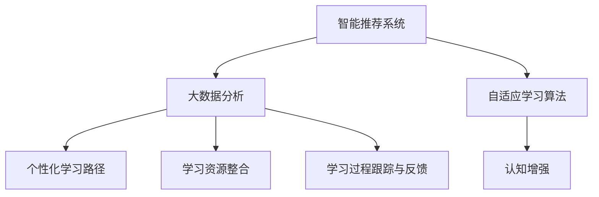

                 

# 认知增强与个性化学习：适应性教育系统

> 关键词：认知增强,个性化学习,适应性教育系统,智能推荐系统,机器学习,大数据分析,自适应学习算法

## 1. 背景介绍

### 1.1 问题由来

在教育领域，传统的一对多教学模式已难以满足现代学生的个性化需求。信息技术和大数据技术的快速发展，为教育方式带来了新的变革可能。通过智能推荐系统，个性化的学习路径设计和自适应学习算法，我们有望构建一套能真正适应学生需求、促进认知增强的智能教育系统。

### 1.2 问题核心关键点

构建适应性教育系统，需解决的关键问题包括：

1. **个性化学习路径的构建**：根据学生的认知水平和学习偏好，推荐合适的学习材料和活动。
2. **学习过程的跟踪与反馈**：通过实时数据分析和评估，提供学习进展反馈，并动态调整教学策略。
3. **知识点的自适应复习**：基于学生的学习情况，自动安排复习计划，巩固学习成果。
4. **学习资源的整合与推荐**：利用大数据和推荐算法，为学生提供多样化的学习资源和活动。
5. **学习体验的优化**：设计友好的人机交互界面，提升学生的学习动力和满意度。

这些问题涉及从数据采集、知识表示、学习策略设计到用户交互的多个环节，需要跨学科的知识和技术支持。

### 1.3 问题研究意义

开发适应性教育系统，对提升教育质量和效率具有重要意义：

1. **因材施教**：实现个性化学习，满足不同学生的需求，提升学习效果。
2. **资源优化**：高效利用教育资源，避免知识浪费，提高教育资源的利用率。
3. **教学创新**：推动教育模式创新，促进教育理念的更新，培养更多创新型人才。
4. **教育公平**：通过技术手段缩小城乡、区域教育差距，实现教育资源均衡。

适应性教育系统的构建，是大数据时代教育技术发展的必然趋势，也是未来教育革新的重要方向。

## 2. 核心概念与联系

### 2.1 核心概念概述

构建适应性教育系统，涉及多个核心概念，这些概念之间通过以下逻辑关系联系起来：

- **智能推荐系统**：根据用户行为和属性，推荐合适的学习内容。
- **大数据分析**：从海量教育数据中提取有用信息，支撑个性化推荐。
- **自适应学习算法**：通过机器学习模型，预测学生的学习行为和效果，并动态调整教学策略。
- **认知增强**：通过个性化推荐和自适应学习，提升学生的认知水平和综合能力。

这些概念之间的联系和作用，可以通过以下Mermaid流程图来展示：



这个流程图展示了适应性教育系统的核心组件及其相互作用：

1. **智能推荐系统**：基于大数据分析结果，为用户推荐个性化的学习内容。
2. **大数据分析**：收集和处理教育数据，提取有用的信息，为推荐和自适应学习提供依据。
3. **自适应学习算法**：通过机器学习模型，预测学习行为和效果，并动态调整学习策略。
4. **认知增强**：结合个性化推荐和自适应学习，提升学生的认知水平和综合能力。

这些概念共同构成了适应性教育系统的框架，为其提供坚实的技术支撑。

## 3. 核心算法原理 & 具体操作步骤
### 3.1 算法原理概述

适应性教育系统的核心算法原理，是基于推荐系统和大数据分析的自适应学习。其核心思想是：根据学生的学习行为和历史数据，利用机器学习模型预测其学习效果，并动态调整推荐内容和教学策略，从而实现个性化学习和认知增强。

### 3.2 算法步骤详解

适应性教育系统的构建包括以下关键步骤：

**Step 1: 数据收集与预处理**

- 收集学生的学习行为数据，如浏览记录、作业提交情况、测试成绩等。
- 收集教育资源数据，如课程内容、学习材料、视频教程等。
- 对数据进行清洗、标注和归一化处理，以提高数据质量和一致性。

**Step 2: 构建推荐模型**

- 基于学生的历史学习数据和行为模式，设计推荐算法，如协同过滤、矩阵分解、深度学习等。
- 利用大数据分析工具，从收集的数据中提取有用的信息，如学生兴趣、学习偏好、知识掌握情况等。
- 构建推荐模型，预测学生对不同学习资源的偏好和适配度，并生成个性化推荐列表。

**Step 3: 设计自适应学习算法**

- 设计自适应学习算法，如基于规则的策略、基于机器学习的策略等。
- 利用推荐结果，动态调整学习路径和策略，如增加难度、调整学习时长、安排复习计划等。
- 通过实时跟踪学生的学习效果和反馈，不断优化自适应学习算法。

**Step 4: 实施认知增强**

- 结合推荐结果和自适应学习策略，构建个性化的学习路径和活动。
- 利用多媒体资源和交互式学习工具，提升学生的学习体验。
- 实时跟踪学生的学习过程，提供及时反馈和指导，促进认知增强。

**Step 5: 评估与优化**

- 定期评估系统的性能和效果，收集用户反馈。
- 基于评估结果和反馈，不断优化推荐模型和自适应学习算法。
- 持续改进教育资源库和教学策略，提升系统的适应性和效果。

以上是构建适应性教育系统的主要步骤。在实际应用中，还需要根据具体情况，对每个步骤进行细化和优化，以实现最佳效果。

### 3.3 算法优缺点

适应性教育系统基于推荐和大数据分析的算法，具有以下优点：

1. **个性化强**：根据学生的个性化需求和学习行为，推荐合适的学习资源，提升学习效果。
2. **适应性强**：通过自适应学习算法，动态调整学习策略，适应学生的学习进度和效果。
3. **效率高**：利用大数据分析和推荐算法，高效利用教育资源，减少知识浪费。
4. **灵活性高**：能够适应不同领域和学科的学习需求，支持跨学科的个性化学习。

然而，该系统也存在一些局限性：

1. **数据隐私问题**：收集和处理学生数据，可能涉及隐私和安全问题，需注意数据保护。
2. **算法复杂性**：推荐和大数据分析算法复杂，实现和优化难度较大。
3. **资源需求高**：需要高性能的计算资源和大数据处理能力，对硬件和网络环境要求较高。
4. **用户适应性**：部分学生可能对推荐系统依赖性强，自主学习能力较弱，需加强引导。

尽管存在这些局限性，但就目前而言，适应性教育系统仍是大数据时代教育技术的重要方向。未来相关研究需进一步降低数据隐私风险，提升算法效率，优化资源利用，以实现更广泛的应用。

### 3.4 算法应用领域

适应性教育系统已经在多个领域得到了应用，包括但不限于：

- **在线教育平台**：如Coursera、Khan Academy等，利用推荐算法为用户推荐课程和学习资源。
- **自适应学习系统**：如Knewton、ALEKS等，根据学生的学习行为和效果，动态调整学习策略。
- **智能辅导系统**：如Quizlet、Quizizz等，提供个性化的学习建议和互动练习。
- **个性化推荐系统**：如Netflix、Amazon等，将推荐技术应用于教育领域，提升个性化学习体验。
- **知识图谱构建**：如DBpedia、Semantic Web等，构建知识图谱，支撑学习资源的深度整合。

除了上述这些经典应用外，适应性教育系统还被创新性地应用于更多场景中，如虚拟现实学习、社交化学习、跨文化教育等，为教育技术带来了新的突破。随着技术的不断演进，适应性教育系统必将在更多领域得到应用，为教育领域带来变革性的影响。

## 4. 数学模型和公式 & 详细讲解
### 4.1 数学模型构建

适应性教育系统的数学模型，主要包括推荐系统模型和自适应学习算法。下面分别介绍这两个模型的构建过程。

### 4.2 公式推导过程

#### 推荐系统模型

推荐系统常用的模型包括协同过滤、矩阵分解、深度学习等。这里以矩阵分解为例，介绍推荐模型的构建和推导过程。

假设推荐系统为用户 $u$ 推荐物品 $i$，用户的评分矩阵为 $R$，其中 $R_{ui}$ 表示用户 $u$ 对物品 $i$ 的评分。推荐模型的目标是最大化预测评分与实际评分之间的误差最小化。

推荐模型的目标是最大化预测评分与实际评分之间的误差最小化。设预测评分矩阵为 $P$，则目标函数为：

$$
\min_{P} \Vert R - P \Vert_F^2
$$

其中 $\Vert \cdot \Vert_F$ 为Frobenius范数。利用矩阵分解，可以将 $P$ 表示为：

$$
P = \Theta \Lambda \Theta^T
$$

其中 $\Theta$ 为用户和物品的特征矩阵，$\Lambda$ 为低秩矩阵，表示用户和物品的潜在因子。目标函数可进一步表示为：

$$
\min_{\Theta, \Lambda} \Vert R - \Theta \Lambda \Theta^T \Vert_F^2
$$

通过求解上述优化问题，可以得到最优的 $\Theta$ 和 $\Lambda$，进而得到推荐矩阵 $P$，生成个性化推荐列表。

#### 自适应学习算法

自适应学习算法包括基于规则的策略和基于机器学习的策略。这里以基于规则的自适应学习算法为例，介绍其构建和推导过程。

设学生 $s$ 的学习任务为 $t$，当前掌握度为 $c_t$，目标掌握度为 $c_t^*$。自适应学习算法的目标是最大化学习效果，即：

$$
\max_{c_t, \Delta c_t} c_t^* - c_t
$$

其中 $\Delta c_t$ 为学习过程中的认知增强值。

利用二分法，可以将上述目标函数表示为：

$$
\max_{c_t} c_t^* - c_t
$$

通过逐步调整 $c_t$ 的值，可以找到一个最优的认知增强值 $\Delta c_t$，使得学习效果最大化。基于规则的自适应学习算法，可以通过如下公式计算认知增强值：

$$
\Delta c_t = \alpha \cdot (c_t^* - c_t) + \beta
$$

其中 $\alpha$ 为学习进度系数，$\beta$ 为认知增强基准值。

通过上述公式，可以动态调整学习策略，提升学生的认知水平和综合能力。

### 4.3 案例分析与讲解

#### 案例一：在线教育平台的个性化推荐

以Coursera为例，介绍如何利用推荐系统构建个性化学习路径。

Coursera通过收集学生的学习行为数据，如浏览课程、参与讨论、完成作业等，构建用户画像。利用协同过滤算法，推荐与用户兴趣和行为相匹配的课程和资源。同时，通过自适应学习算法，根据学生的学习效果和反馈，动态调整课程难度和时长，提供个性化的学习建议。

#### 案例二：智能辅导系统的认知增强

以Quizlet为例，介绍如何利用自适应学习算法提升学习效果。

Quizlet通过收集学生的学习记录和反馈，分析其知识掌握情况和学习进度。利用二分法和认知增强公式，动态调整学习路径和策略，提供个性化的学习建议和互动练习。同时，利用多媒体资源和交互式学习工具，提升学生的学习体验和动力。

通过上述案例，可以看到，适应性教育系统通过推荐和自适应学习算法，可以显著提升个性化学习和认知增强的效果。

## 5. 项目实践：代码实例和详细解释说明
### 5.1 开发环境搭建

在进行项目实践前，需要准备好开发环境。以下是使用Python进行TensorFlow开发的环境配置流程：

1. 安装Anaconda：从官网下载并安装Anaconda，用于创建独立的Python环境。

2. 创建并激活虚拟环境：
```bash
conda create -n tf-env python=3.8 
conda activate tf-env
```

3. 安装TensorFlow：根据CUDA版本，从官网获取对应的安装命令。例如：
```bash
conda install tensorflow
```

4. 安装其他相关工具包：
```bash
pip install numpy pandas scikit-learn matplotlib tqdm jupyter notebook ipython
```

完成上述步骤后，即可在`tf-env`环境中开始项目实践。

### 5.2 源代码详细实现

下面我们以在线教育平台的推荐系统为例，给出使用TensorFlow和Keras实现推荐模型的PyTorch代码实现。

首先，定义推荐系统的数据处理函数：

```python
import tensorflow as tf
from tensorflow.keras.layers import Input, Embedding, Dot, Dense
from tensorflow.keras.models import Model

def create_matrix_decomposition_model(input_dim, latent_dim):
    # 用户特征输入
    user_input = Input(shape=(user_dim,), name='user_input')
    user_embedding = Embedding(user_dim, latent_dim, name='user_embedding')(user_input)
    
    # 物品特征输入
    item_input = Input(shape=(item_dim,), name='item_input')
    item_embedding = Embedding(item_dim, latent_dim, name='item_embedding')(item_input)
    
    # 计算用户和物品的嵌入向量的点积
    dot_product = Dot(axes=[1, 1], name='dot_product')([user_embedding, item_embedding])
    
    # 输出预测评分
    rating = Dense(1, activation='sigmoid')(dot_product)
    
    # 定义模型
    model = Model(inputs=[user_input, item_input], outputs=rating)
    
    return model
```

然后，定义模型和优化器：

```python
from tensorflow.keras.optimizers import Adam

# 定义推荐模型
model = create_matrix_decomposition_model(user_dim, latent_dim)

# 设置优化器
optimizer = Adam(learning_rate=0.001)
```

接着，定义训练和评估函数：

```python
from tensorflow.keras.preprocessing.sequence import pad_sequences
from sklearn.metrics import mean_squared_error

def train_model(model, train_data, train_labels, validation_data, validation_labels, epochs, batch_size):
    model.compile(optimizer=optimizer, loss='binary_crossentropy', metrics=['mae'])
    
    # 训练模型
    history = model.fit([train_data[0], train_data[1]], train_labels, epochs=epochs, batch_size=batch_size, validation_data=(validation_data, validation_labels))
    
    # 评估模型
    train_mae = mean_squared_error(train_labels, model.predict([train_data[0], train_data[1]]))
    test_mae = mean_squared_error(validation_labels, model.predict([validation_data[0], validation_data[1]]))
    
    print(f'Train MAE: {train_mae:.2f}, Test MAE: {test_mae:.2f}')
    
    return history
```

最后，启动训练流程：

```python
epochs = 10
batch_size = 128

# 加载数据
train_data, train_labels, test_data, test_labels = ...

# 训练模型
history = train_model(model, train_data, train_labels, test_data, test_labels, epochs, batch_size)
```

以上就是使用TensorFlow和Keras实现推荐模型的完整代码实现。可以看到，利用TensorFlow和Keras的封装，我们能够快速实现推荐模型，并进行训练和评估。

### 5.3 代码解读与分析

让我们再详细解读一下关键代码的实现细节：

**create_matrix_decomposition_model函数**：
- 定义用户和物品特征的输入层。
- 使用Embedding层对输入进行嵌入，得到低维特征表示。
- 通过点积操作计算用户和物品的嵌入向量的点积，得到预测评分。
- 使用Dense层输出评分，并进行sigmoid激活。
- 构建模型，并返回模型对象。

**train_model函数**：
- 使用Keras的compile方法，定义优化器和损失函数。
- 使用fit方法训练模型，并记录训练过程中的历史数据。
- 使用mean_squared_error计算模型的MAE值，评估模型的性能。

通过上述代码实现，我们可以快速搭建一个基于矩阵分解的推荐系统，并进行训练和评估。当然，实际的推荐系统需要结合更多复杂的设计和优化，如特征工程、模型调参、数据增强等，但核心的算法原理和代码实现与此类似。

## 6. 实际应用场景

### 6.1 在线教育平台

在线教育平台如Coursera、Udacity等，通过智能推荐系统，为学生推荐个性化的课程和学习资源。这些平台通过收集学生的学习行为数据，构建用户画像，利用协同过滤、矩阵分解等推荐算法，生成个性化的推荐列表。同时，结合自适应学习算法，动态调整课程难度和时长，提供个性化的学习建议，从而提升学生的学习效果和满意度。

### 6.2 智能辅导系统

智能辅导系统如Quizlet、Quizizz等，利用推荐和大数据分析技术，为学生提供个性化的学习建议和互动练习。这些系统通过收集学生的学习记录和反馈，分析其知识掌握情况和学习进度。利用二分法和认知增强公式，动态调整学习路径和策略，提供个性化的学习建议和互动练习，从而提升学生的学习效果和动力。

### 6.3 自适应学习系统

自适应学习系统如ALEKS、Knewton等，通过机器学习算法，预测学生的学习行为和效果，并动态调整教学策略。这些系统利用推荐和大数据分析技术，为学生推荐合适的学习资源和活动。同时，通过自适应学习算法，根据学生的学习效果和反馈，动态调整课程难度和时长，提供个性化的学习建议，从而提升学生的学习效果和满意度。

### 6.4 未来应用展望

随着推荐算法和大数据分析技术的不断演进，适应性教育系统将带来更多新的应用场景，如虚拟现实学习、社交化学习、跨文化教育等。这些技术的应用，将进一步提升教育质量和效率，推动教育理念的更新，培养更多创新型人才。未来，适应性教育系统必将在更多领域得到应用，为教育领域带来变革性的影响。

## 7. 工具和资源推荐
### 7.1 学习资源推荐

为了帮助开发者系统掌握适应性教育系统的理论和实践，这里推荐一些优质的学习资源：

1. Coursera《Machine Learning》课程：斯坦福大学开设的机器学习明星课程，涵盖了推荐系统、自适应学习等前沿话题。
2. Kaggle在线数据科学竞赛：Kaggle平台提供海量数据集和竞赛，涵盖推荐系统、自适应学习等多个领域，适合实践和竞赛。
3. Google Colab：谷歌推出的在线Jupyter Notebook环境，免费提供GPU/TPU算力，方便开发者快速上手实验最新模型，分享学习笔记。
4. TensorFlow官方文档：TensorFlow的官方文档，提供了丰富的推荐系统和大数据分析算法资源，适合深入学习。
5. Keras官方文档：Keras的官方文档，提供了快速搭建推荐系统的示例代码，适合快速实践。

通过这些资源的学习实践，相信你一定能够快速掌握适应性教育系统的精髓，并用于解决实际的NLP问题。

### 7.2 开发工具推荐

高效的开发离不开优秀的工具支持。以下是几款用于适应性教育系统开发的常用工具：

1. TensorFlow：由Google主导开发的开源深度学习框架，生产部署方便，适合大规模工程应用。
2. Keras：Keras提供了高层次的API，适合快速搭建和实验推荐系统模型。
3. PyTorch：由Facebook主导开发的开源深度学习框架，灵活动态，适合快速迭代研究。
4. Jupyter Notebook：Jupyter Notebook提供了交互式的开发环境，适合快速验证和优化算法。
5. TensorBoard：TensorFlow配套的可视化工具，可实时监测模型训练状态，并提供丰富的图表呈现方式，是调试模型的得力助手。

合理利用这些工具，可以显著提升适应性教育系统的开发效率，加快创新迭代的步伐。

### 7.3 相关论文推荐

适应性教育系统和大数据分析技术的发展源于学界的持续研究。以下是几篇奠基性的相关论文，推荐阅读：

1. "Collaborative Filtering for Implicit Feedback Datasets"（协同过滤算法）：由B.Konstan和D.Ma提出，介绍了协同过滤算法的原理和应用。
2. "Matrix Factorization Techniques for Recommender Systems"（矩阵分解算法）：由N.Guerrero和P.Pais提出，介绍了矩阵分解算法的原理和实现。
3. "Personalized Recommender Systems"（个性化推荐系统）：由Y.Han和M.Srivastava提出，介绍了个性化推荐系统的设计思路和算法。
4. "Intelligent Tutoring Systems"（智能辅导系统）：由B.S.Mitchell提出，介绍了智能辅导系统的原理和应用。
5. "Adaptive Educational Hypermedia for Intelligent Tutoring Systems"（自适应教育超媒体系统）：由B.Mitic和M.Betts提出，介绍了自适应学习算法的原理和应用。

这些论文代表了大数据时代推荐系统和大数据分析技术的发展脉络。通过学习这些前沿成果，可以帮助研究者把握学科前进方向，激发更多的创新灵感。

## 8. 总结：未来发展趋势与挑战

### 8.1 研究成果总结

本文对基于推荐系统和大数据分析的自适应教育系统进行了全面系统的介绍。首先阐述了适应性教育系统在教育领域的重要性和应用背景，明确了推荐系统和大数据分析在实现个性化学习中的关键作用。其次，从原理到实践，详细讲解了适应性教育系统的数学模型和算法流程，给出了适应性教育系统的完整代码实例。同时，本文还广泛探讨了适应性教育系统在多个领域的应用前景，展示了其在教育技术中的巨大潜力。

通过本文的系统梳理，可以看到，基于推荐系统和大数据分析的适应性教育系统在大数据时代教育技术的发展中占据重要地位，推动了教育模式和教育理念的创新，提升了教育质量和效率。未来，随着推荐算法和大数据分析技术的进一步发展，适应性教育系统必将在更多领域得到应用，为教育领域带来变革性的影响。

### 8.2 未来发展趋势

展望未来，适应性教育系统将呈现以下几个发展趋势：

1. **个性化更强**：随着推荐算法和大数据分析技术的不断进步，个性化推荐和自适应学习将更加精准，能够更好地满足不同学生的个性化需求。
2. **学习路径更智能**：通过引入更多先验知识，如知识图谱、逻辑规则等，推荐系统将能够提供更加全面、合理的个性化学习路径。
3. **多模态融合**：结合视觉、语音、文本等多模态数据，推荐系统将能够提供更加丰富、互动的学习体验。
4. **学习效果更精准**：通过引入更多评估指标，如认知负荷、情感状态等，自适应学习算法将能够更加精准地评估学生的学习效果，动态调整教学策略。
5. **学习资源更丰富**：通过构建更全面的学习资源库，推荐系统将能够提供更加多样、高质量的学习资源，提升学生的学习效果。

以上趋势凸显了适应性教育系统在个性化学习和自适应教育中的重要地位，其未来发展前景广阔，将为教育技术带来新的突破。

### 8.3 面临的挑战

尽管适应性教育系统在大数据时代教育技术的发展中具有重要地位，但在实现过程中仍面临诸多挑战：

1. **数据隐私问题**：收集和处理学生数据，可能涉及隐私和安全问题，需注意数据保护。
2. **算法复杂性**：推荐算法和大数据分析算法复杂，实现和优化难度较大。
3. **资源需求高**：需要高性能的计算资源和大数据处理能力，对硬件和网络环境要求较高。
4. **用户适应性**：部分学生可能对推荐系统依赖性强，自主学习能力较弱，需加强引导。
5. **教育公平性**：适应性教育系统需确保不同背景、不同地域的学生能够公平地享受到个性化教育资源。

尽管存在这些挑战，但适应性教育系统的研究和实践仍在不断推进。未来研究需进一步降低数据隐私风险，提升算法效率，优化资源利用，以实现更广泛的应用。

### 8.4 研究展望

面对适应性教育系统面临的挑战，未来的研究需要在以下几个方面寻求新的突破：

1. **引入更多先验知识**：将符号化的先验知识，如知识图谱、逻辑规则等，与神经网络模型进行巧妙融合，引导自适应学习过程。
2. **多模态数据融合**：结合视觉、语音、文本等多模态数据，构建更全面的学习资源库，提升个性化学习效果。
3. **动态学习路径设计**：引入更多评估指标，如认知负荷、情感状态等，动态调整学习路径和策略，提升学习效果。
4. **智能交互设计**：设计更友好的人机交互界面，提升学生的学习体验和动力。
5. **跨文化适应性**：构建跨文化适应性推荐系统，支持不同文化背景学生的个性化学习。

这些研究方向将进一步提升适应性教育系统的性能和效果，推动教育技术向更加智能化、普适化的方向发展。

## 9. 附录：常见问题与解答

**Q1：适应性教育系统的核心是什么？**

A: 适应性教育系统的核心是智能推荐系统和大数据分析。通过收集学生的学习行为数据，利用推荐算法和自适应学习算法，为学生推荐个性化的学习资源和路径，动态调整学习策略，从而实现个性化学习和认知增强。

**Q2：适应性教育系统如何收集和处理学生数据？**

A: 适应性教育系统通过多种方式收集学生数据，如问卷调查、作业提交、学习记录等。在数据处理过程中，需要注意数据清洗、标注和归一化，以提高数据质量和一致性。同时，需注意数据隐私保护，确保学生数据的安全。

**Q3：如何设计自适应学习算法？**

A: 自适应学习算法的核心是利用机器学习模型，预测学生的学习行为和效果，并动态调整学习策略。设计自适应学习算法时，需要选择合适的评估指标，如认知负荷、情感状态等，并根据评估结果动态调整学习路径和策略。

**Q4：适应性教育系统如何提升学习效果？**

A: 适应性教育系统通过个性化推荐和自适应学习算法，提升学生的学习效果。具体方法包括：
1. 通过智能推荐系统，为学生推荐个性化的学习资源和活动。
2. 结合自适应学习算法，动态调整学习路径和策略，提升学习效果。
3. 利用多媒体资源和交互式学习工具，提升学生的学习体验和动力。

通过上述方法，适应性教育系统能够显著提升个性化学习和认知增强的效果。

通过本文的系统梳理，可以看到，适应性教育系统通过推荐和大数据分析技术，为教育领域带来了新的变革可能。未来，随着技术的不断演进和应用推广，适应性教育系统必将在更多领域得到应用，为教育技术带来新的突破。希望本文能够为开发者和研究者提供全面的技术指引，推动教育技术的创新和发展。

---

作者：禅与计算机程序设计艺术 / Zen and the Art of Computer Programming

