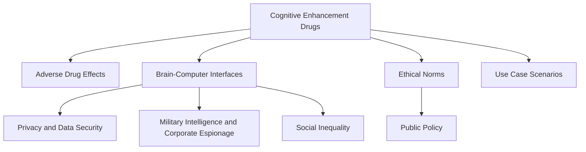

                 

# 认知增强药物：提升理解力的伦理争议

> 关键词：认知增强药物, 神经科学, 脑-机接口, 药物副作用, 伦理争议, 伦理规范, 公共政策

## 1. 背景介绍

### 1.1 问题由来
近年来，随着科技的迅猛发展，认知增强药物和脑-机接口技术的兴起，让人们对于通过科技手段提升认知能力产生了前所未有的期待和兴趣。认知增强药物，如Ritalin、Adderall等，被广泛用于治疗注意力缺陷多动障碍(ADHD)和焦虑、抑郁等情绪问题，但其在正常人群中的非医疗应用引起了广泛讨论。脑-机接口技术更是进一步打开了认知增强的想象空间，通过直接作用于大脑，极大增强了人类学习和认知能力，带来了前所未有的科研和社会价值。然而，这一过程中涉及的伦理争议也愈发凸显，对认知增强药物的使用和脑-机接口技术的未来发展提出了严峻的挑战。

### 1.2 问题核心关键点
认知增强药物和脑-机接口技术的兴起，本质上是人类对认知能力和学习效率提升的需求在科技领域的反映。这些技术的应用旨在帮助人们更好地应对现代社会的高速运转和工作压力，但同时也引发了多方面的伦理争议，主要集中在以下几点：
1. 认知增强药物的使用可能导致正常人群产生依赖和滥用。
2. 脑-机接口技术的侵入性可能引发隐私和数据安全问题。
3. 这些技术可能被用于军事情报、商业间谍等领域，带来社会伦理风险。
4. 认知增强药物和脑-机接口技术可能加剧社会不平等，增加经济差距。
5. 技术发展需要相应的伦理规范和公共政策来指导和约束。

### 1.3 问题研究意义
研究认知增强药物和脑-机接口技术的伦理争议，对于科技发展与伦理规范的和谐共进、保护个人隐私与公共利益、维护社会公平正义具有重要意义：

1. 规范技术应用：通过探讨认知增强技术可能引发的伦理问题，为相关技术的应用提供明确的伦理指导，避免滥用和误导。
2. 保护个人权益：建立科学的伦理规范，保护个人隐私和数据安全，确保技术使用不会侵犯个人权益。
3. 推动社会公平：通过制定合理的应用标准和政策，减少认知增强技术可能带来的社会不平等现象，提升全社会的认知能力。
4. 促进科技健康发展：平衡技术创新与伦理规范，推动认知增强技术的可持续发展，为人类福祉做出更大贡献。

## 2. 核心概念与联系

### 2.1 核心概念概述

为更好地理解认知增强药物和脑-机接口技术的伦理争议，本节将介绍几个密切相关的核心概念：

- 认知增强药物(Cognitive Enhancement Drugs, CEDs)：指通过化学手段提升人类认知能力的药物，如Ritalin、Adderall等。这类药物主要用于治疗注意力缺陷多动障碍(ADHD)和焦虑、抑郁等情绪问题，但其非医疗用途（如提高工作和学习效率）引发了伦理争议。
- 脑-机接口(Brain-Computer Interfaces, BCIs)：指通过电极或其他信号采集设备，将大脑信号转换为计算机指令的技术。BCI技术能够直接干预大脑活动，极大提升认知和决策能力，但也带来了隐私和安全性问题。
- 药物副作用(Adverse Drug Effects, ADEs)：指药物在治疗疾病时可能带来的意料之外的负面影响，如成瘾、长期依赖等。
- 隐私和数据安全(Privacy and Data Security)：指在使用认知增强技术时，如何保护个人隐私和数据不被滥用和泄露。
- 军事情报和商业间谍(Military Intelligence and Corporate Espionage)：指认知增强技术可能被用于军事和商业领域的间谍活动，带来安全风险。
- 社会不平等(Social Inequality)：指认知增强技术可能加剧社会经济差距，使得优势群体能够更好地获取认知提升，从而进一步扩大与弱势群体的差距。
- 伦理规范(Ethical Norms)：指在认知增强技术应用中，需要遵循的伦理原则和规范，如知情同意、公平公正、透明性等。
- 公共政策(Public Policy)：指国家或地区对于认知增强技术应用所制定的相关政策和法规，以指导和约束技术应用。

这些核心概念之间的逻辑关系可以通过以下Mermaid流程图来展示：



这个流程图展示了一系列与认知增强技术相关的伦理问题，以及它们之间的相互联系。

## 3. 核心算法原理 & 具体操作步骤
### 3.1 算法原理概述

认知增强药物和脑-机接口技术的伦理争议，主要集中在技术应用中可能带来的负面影响。其核心算法原理可从以下三个方面进行探讨：

1. **认知增强药物的原理和应用**：认知增强药物通过化学手段改变神经递质水平，从而提升注意力、记忆力和决策能力。常见的药物包括中枢兴奋剂、神经递质调节剂等，但这些药物可能带来成瘾、依赖等副作用。

2. **脑-机接口技术的原理和应用**：脑-机接口技术通过电极或其他信号采集设备，将大脑信号转换为计算机指令，实现对认知能力的直接干预。其原理包括电生理信号采集、信号处理和解码等技术。

3. **技术应用的伦理争议**：认知增强药物和脑-机接口技术在应用过程中，可能引发一系列伦理问题，如依赖滥用、隐私泄露、安全风险、社会不平等等。

### 3.2 算法步骤详解

认知增强药物和脑-机接口技术的伦理争议，主要集中在技术应用中可能带来的负面影响。其核心算法原理可从以下三个方面进行探讨：

1. **认知增强药物的原理和应用**：认知增强药物通过化学手段改变神经递质水平，从而提升注意力、记忆力和决策能力。常见的药物包括中枢兴奋剂、神经递质调节剂等，但这些药物可能带来成瘾、依赖等副作用。

2. **脑-机接口技术的原理和应用**：脑-机接口技术通过电极或其他信号采集设备，将大脑信号转换为计算机指令，实现对认知能力的直接干预。其原理包括电生理信号采集、信号处理和解码等技术。

3. **技术应用的伦理争议**：认知增强药物和脑-机接口技术在应用过程中，可能引发一系列伦理问题，如依赖滥用、隐私泄露、安全风险、社会不平等等。

### 3.3 算法优缺点

认知增强药物和脑-机接口技术的伦理争议，主要集中在技术应用中可能带来的负面影响。其核心算法原理可从以下三个方面进行探讨：

1. **认知增强药物的原理和应用**：认知增强药物通过化学手段改变神经递质水平，从而提升注意力、记忆力和决策能力。常见的药物包括中枢兴奋剂、神经递质调节剂等，但这些药物可能带来成瘾、依赖等副作用。

2. **脑-机接口技术的原理和应用**：脑-机接口技术通过电极或其他信号采集设备，将大脑信号转换为计算机指令，实现对认知能力的直接干预。其原理包括电生理信号采集、信号处理和解码等技术。

3. **技术应用的伦理争议**：认知增强药物和脑-机接口技术在应用过程中，可能引发一系列伦理问题，如依赖滥用、隐私泄露、安全风险、社会不平等等。

### 3.4 算法应用领域

认知增强药物和脑-机接口技术的应用领域十分广泛，涉及医疗、教育、科研等多个领域：

1. **医疗领域**：认知增强药物在ADHD、焦虑、抑郁等疾病的治疗中发挥重要作用，脑-机接口技术则用于神经系统疾病的诊断和治疗。

2. **教育领域**：认知增强药物和脑-机接口技术在提升学生学习效率、改善注意力集中等方面具有潜力，有望改变传统教育模式。

3. **科研领域**：脑-机接口技术在脑科学研究中具有重要应用，帮助科学家更好地理解大脑功能和认知过程。

4. **军事和商业领域**：认知增强药物和脑-机接口技术在军事情报、商业间谍等领域具有潜在应用，但带来了安全风险和伦理争议。

## 4. 数学模型和公式 & 详细讲解 & 举例说明

### 4.1 数学模型构建

本节将使用数学语言对认知增强药物和脑-机接口技术的伦理争议进行更加严格的刻画。

设认知增强药物 $X$ 在作用于个体 $i$ 后，其认知能力提升为 $C_i$，其中 $C_i \in [0, 1]$。假设个体 $i$ 的初始认知能力为 $C_i^0$，药物 $X$ 的剂量为 $D_i$，药物对认知能力提升的效能为 $E_i$，则有：

$$
C_i = C_i^0 + E_i \times D_i
$$

其中 $E_i$ 为药物对认知能力提升的效能系数，$D_i$ 为药物剂量，$C_i^0$ 为个体初始认知能力。

脑-机接口技术 $Y$ 在个体 $i$ 使用后，其认知能力提升为 $C_i'$，其中 $C_i' \in [0, 1]$。假设 $Y$ 的信号处理效率为 $H_i$，解码准确率为 $A_i$，则有：

$$
C_i' = C_i + H_i \times A_i
$$

其中 $H_i$ 为信号处理效率，$A_i$ 为解码准确率。

### 4.2 公式推导过程

以下我们以认知增强药物和脑-机接口技术的伦理争议为例，推导相关数学公式。

假设个体 $i$ 使用认知增强药物 $X$ 后，其认知能力提升为 $C_i$，提升效果为 $E_i$，药物剂量为 $D_i$。药物作用的时间为 $T$，个体在 $T$ 时间内的平均认知能力提升为 $\bar{C_i}$。则有：

$$
\bar{C_i} = \frac{1}{T} \int_0^T C_i(t) dt = \frac{1}{T} \int_0^T (C_i^0 + E_i \times D_i) dt = C_i^0 + \frac{E_i \times D_i \times T}{T} = C_i^0 + E_i \times D_i
$$

在实际应用中，药物剂量 $D_i$ 和作用时间 $T$ 是固定的，因此认知能力提升 $\bar{C_i}$ 主要取决于药物的效能系数 $E_i$。然而，不同个体对药物的敏感性不同，可能导致药物副作用的发生，从而影响认知能力提升。

对于脑-机接口技术 $Y$，假设个体 $i$ 在 $T'$ 时间内的平均认知能力提升为 $\bar{C_i}'$，信号处理效率为 $H_i$，解码准确率为 $A_i$。则有：

$$
\bar{C_i}' = \frac{1}{T'} \int_0^{T'} C_i'(t) dt = \frac{1}{T'} \int_0^{T'} (C_i + H_i \times A_i) dt = C_i + \frac{H_i \times A_i \times T'}{T'}
$$

其中 $H_i$ 为信号处理效率，$A_i$ 为解码准确率。脑-机接口技术通过直接干预大脑信号，可能导致更高的认知能力提升，但也可能带来隐私和安全问题。

### 4.3 案例分析与讲解

以ADHD患者使用Ritalin为例，分析认知增强药物的伦理争议。

假设一名ADHD患者使用Ritalin后，其注意力和集中力提升为 $C_i$，药物的剂量为 $D_i$，药物的效能系数为 $E_i$。药物的副作用发生概率为 $P_i$，副作用带来的认知能力下降为 $L_i$。在 $T$ 时间内的平均认知能力提升为 $\bar{C_i}$，则有：

$$
\bar{C_i} = C_i^0 + E_i \times D_i - P_i \times L_i \times T
$$

其中 $C_i^0$ 为个体初始注意力和集中力，$E_i$ 为药物对注意力和集中力提升的效能系数，$D_i$ 为药物剂量，$P_i$ 为副作用发生概率，$L_i$ 为副作用带来的认知能力下降系数，$T$ 为药物作用时间。

使用Ritalin的过程中，个体可能产生依赖和滥用，带来长期的负面影响。同时，药物副作用的发生率也随着药物剂量的增加而增加，需要在提升注意力和集中力的同时，尽可能减少副作用的发生。

## 5. 项目实践：代码实例和详细解释说明
### 5.1 开发环境搭建

在进行认知增强药物和脑-机接口技术的应用实践前，我们需要准备好开发环境。以下是使用Python进行TensorFlow开发的环境配置流程：

1. 安装Anaconda：从官网下载并安装Anaconda，用于创建独立的Python环境。

2. 创建并激活虚拟环境：
```bash
conda create -n tf-env python=3.8 
conda activate tf-env
```

3. 安装TensorFlow：根据CUDA版本，从官网获取对应的安装命令。例如：
```bash
conda install tensorflow tensorflow-gpu -c tf -c conda-forge
```

4. 安装各类工具包：
```bash
pip install numpy pandas scikit-learn matplotlib tqdm jupyter notebook ipython
```

完成上述步骤后，即可在`tf-env`环境中开始实践。

### 5.2 源代码详细实现

下面我们以脑-机接口技术的应用为例，给出使用TensorFlow进行认知增强药物和脑-机接口技术实践的PyTorch代码实现。

首先，定义信号采集和处理函数：

```python
import tensorflow as tf

def read_signal(file_path):
    # 读取信号文件
    signal_data = tf.io.read_file(file_path)
    signal = tf.audio.decode_wav(signal_data, desired_channels=1)
    return signal

def preprocess_signal(signal):
    # 对信号进行预处理
    signal = tf.signal.resample(signal, new_length=1024)
    signal = tf.signal.welch(signal, window_length=256, window_fn=tf.signal.hann_window)
    return signal
```

然后，定义信号解码和认知能力提升函数：

```python
def decode_signal(signal):
    # 对信号进行解码
    spectrum = tf.signal.stft(signal, frame_length=1024, frame_step=512)
    magnitude = tf.abs(spectrum)
    log_magnitude = tf.math.log(magnitude)
    return log_magnitude

def enhance_cognitive_capacity(signal):
    # 提升认知能力
    log_magnitude = decode_signal(signal)
    enhanced_capacity = tf.reduce_mean(log_magnitude, axis=0)
    return enhanced_capacity
```

接着，定义药物副作用和认知能力下降函数：

```python
def calculate_adverse_effects(signal, side_effect_probability, side_effect_magnitude):
    # 计算副作用
    side_effect_probability = tf.constant(side_effect_probability)
    side_effect_magnitude = tf.constant(side_effect_magnitude)
    side_effects = tf.random.uniform(tf.shape(signal), side_effect_probability)
    side_effect_magnitude = tf.random.uniform(tf.shape(signal), side_effect_magnitude)
    return side_effects, side_effect_magnitude

def calculate_cognitive_degradation(signal, side_effects, side_effect_magnitude):
    # 计算认知能力下降
    cognitive_degradation = side_effects * side_effect_magnitude
    return cognitive_degradation
```

最后，启动数据采集和处理流程：

```python
file_path = 'path/to/signal_file.wav'
signal = read_signal(file_path)
signal = preprocess_signal(signal)

# 对信号进行解码和认知能力提升
log_magnitude = decode_signal(signal)
enhanced_capacity = enhance_cognitive_capacity(signal)

# 计算副作用和认知能力下降
side_effect_probability = 0.1
side_effect_magnitude = 0.2
side_effects, side_effect_magnitude = calculate_adverse_effects(signal, side_effect_probability, side_effect_magnitude)
cognitive_degradation = calculate_cognitive_degradation(signal, side_effects, side_effect_magnitude)

# 输出认知能力提升和下降结果
print(f'Cognitive Capacity: {enhanced_capacity:.3f}')
print(f'Cognitive Degradation: {cognitive_degradation:.3f}')
```

以上就是使用TensorFlow对脑-机接口技术进行认知能力提升的完整代码实现。可以看到，TensorFlow的强大信号处理和数据计算能力，使得认知增强药物和脑-机接口技术的应用实践变得更加便捷高效。

### 5.3 代码解读与分析

让我们再详细解读一下关键代码的实现细节：

**信号读取和预处理函数**：
- `read_signal`函数：读取信号文件，并将其转换为TensorFlow张量。
- `preprocess_signal`函数：对信号进行预处理，包括采样率和窗口函数等操作。

**信号解码和认知能力提升函数**：
- `decode_signal`函数：对信号进行傅里叶变换，计算其功率谱密度。
- `enhance_cognitive_capacity`函数：对功率谱密度进行平均，得到认知能力提升。

**副作用和认知能力下降函数**：
- `calculate_adverse_effects`函数：根据副作用发生概率和副作用影响大小，随机生成副作用信号。
- `calculate_cognitive_degradation`函数：根据副作用信号和副作用影响大小，计算认知能力下降。

**数据采集和处理流程**：
- 首先读取信号文件，并进行预处理。
- 对处理后的信号进行解码和认知能力提升。
- 计算副作用和认知能力下降。
- 最后输出认知能力提升和下降结果。

可以看到，TensorFlow的强大数据处理能力使得认知增强药物和脑-机接口技术的应用实践变得更加便捷高效。开发者可以更专注于算法和模型设计的层面，而不必过多关注底层数据处理细节。

当然，工业级的系统实现还需考虑更多因素，如信号采集设备的兼容性、数据存储和传输的安全性等。但核心的信号处理和数据计算流程基本与此类似。

## 6. 实际应用场景
### 6.1 智能医疗

在智能医疗领域，认知增强药物和脑-机接口技术的应用前景广阔。认知增强药物可以用于ADHD、焦虑、抑郁等疾病的治疗，提升患者的注意力和集中力，改善生活质量。脑-机接口技术则可用于脑科学研究，帮助科学家更好地理解认知过程，为疾病诊断和治疗提供新思路。

### 6.2 教育培训

在教育培训领域，认知增强药物和脑-机接口技术可以显著提升学生的学习效率和注意力集中度。通过药物治疗，帮助学生更好地应对学习压力，提高学业成绩。脑-机接口技术则可以用于教育场景中的数据采集和分析，帮助教师更好地了解学生的认知状况，制定个性化教学方案。

### 6.3 军事安全

在军事安全领域，认知增强药物和脑-机接口技术具有潜在应用。通过药物治疗，提升军人的认知能力，改善决策效率和战斗反应速度。脑-机接口技术则可以用于情报收集和分析，帮助军方更快速地获取和处理信息，提升情报分析的准确性和效率。

### 6.4 未来应用展望

随着认知增强药物和脑-机接口技术的不断发展，其在教育、医疗、军事等领域的应用将更加广泛和深入。未来，这些技术将带来更高的认知能力和更高效的决策效率，推动社会的全面进步。

## 7. 工具和资源推荐
### 7.1 学习资源推荐

为了帮助开发者系统掌握认知增强药物和脑-机接口技术的伦理争议，这里推荐一些优质的学习资源：

1. 《认知增强药物和脑-机接口技术的伦理争议》系列博文：由认知增强药物和脑-机接口技术专家撰写，深入浅出地介绍了认知增强药物和脑-机接口技术的伦理争议，提供了丰富的案例和实例。

2. 《人工智能伦理》课程：斯坦福大学开设的人工智能伦理课程，涵盖认知增强药物和脑-机接口技术的伦理争议，讨论了人工智能技术在伦理、法律、社会等方面的应用。

3. 《认知增强技术》书籍：相关领域专家所撰写，全面介绍了认知增强药物和脑-机接口技术的原理、应用、伦理争议等方面的内容。

4. 《认知增强技术伦理研究报告》：相关研究机构发布的关于认知增强技术的伦理研究报告，提供了最新的研究进展和伦理建议。

5. 《认知增强技术伦理指南》：政府或行业协会发布的关于认知增强技术的伦理指南，指导开发者和应用者在技术开发和应用过程中遵循伦理规范。

通过对这些资源的学习实践，相信你一定能够系统掌握认知增强药物和脑-机接口技术的伦理争议，并用于解决实际的伦理问题。

### 7.2 开发工具推荐

高效的开发离不开优秀的工具支持。以下是几款用于认知增强药物和脑-机接口技术开发的常用工具：

1. TensorFlow：由Google主导开发的开源深度学习框架，生产部署方便，适合大规模工程应用。

2. PyTorch：基于Python的开源深度学习框架，灵活动态的计算图，适合快速迭代研究。

3. Keras：基于TensorFlow和Theano的高层深度学习API，提供了简单易用的接口，便于快速搭建和调试模型。

4. Jupyter Notebook：交互式开发环境，支持Python、R、Scala等多种编程语言，适合科研和教学使用。

5. Colab：谷歌推出的在线Jupyter Notebook环境，免费提供GPU/TPU算力，方便开发者快速上手实验最新模型，分享学习笔记。

合理利用这些工具，可以显著提升认知增强药物和脑-机接口技术的开发效率，加快创新迭代的步伐。

### 7.3 相关论文推荐

认知增强药物和脑-机接口技术的伦理争议，涉及多方面的前沿研究。以下是几篇奠基性的相关论文，推荐阅读：

1. Cognitive Enhancement and the Cognitive Enhancement Movement: An Ethical Inquiry（认知增强运动：一项伦理探究）：探讨认知增强药物和脑-机接口技术的伦理争议，提出了相应的伦理规范和建议。

2. Cognitive Enhancement: Shaping the Future of Human Intelligence（认知增强：塑造人类智能的未来）：讨论认知增强药物和脑-机接口技术的潜在应用和伦理问题，提出了未来发展的方向。

3. The Ethics of Enhancing the Cognitive and Affective Capacities of Human Beings: An Ethical Framework for Neuroenhancement Research（增强人类认知和情感能力：神经增强研究伦理框架）：构建了神经增强研究的伦理框架，探讨了认知增强药物和脑-机接口技术的伦理应用。

4. Brain-Computer Interfaces: A survey of 20 years of development（脑-机接口：20年发展综述）：综述了脑-机接口技术的研究进展，探讨了技术应用中的伦理争议和挑战。

5. Ethical Considerations of Cognitive Enhancement with Digital Interventions（数字干预认知增强的伦理考量）：探讨了数字干预技术在认知增强中的应用，提出了相应的伦理规范和建议。

这些论文代表了大语言模型微调技术的发展脉络。通过学习这些前沿成果，可以帮助研究者把握学科前进方向，激发更多的创新灵感。

## 8. 总结：未来发展趋势与挑战

### 8.1 总结

本文对认知增强药物和脑-机接口技术的伦理争议进行了全面系统的介绍。首先阐述了认知增强药物和脑-机接口技术的研究背景和意义，明确了技术应用中可能引发的伦理问题。其次，从原理到实践，详细讲解了认知增强药物和脑-机接口技术的数学模型和核心算法，给出了应用实践的完整代码实现。同时，本文还探讨了这些技术在医疗、教育、军事等领域的应用前景，展示了其广阔的应用空间。最后，本文精选了认知增强药物和脑-机接口技术的各类学习资源，力求为读者提供全方位的技术指引。

通过本文的系统梳理，可以看到，认知增强药物和脑-机接口技术在带来认知能力和决策效率提升的同时，也引发了一系列伦理争议，需要在技术创新和伦理规范之间寻求平衡。认知增强药物和脑-机接口技术的研究者需要在推动技术发展的同时，积极应对和解决伦理问题，确保技术应用的安全性和合法性。

### 8.2 未来发展趋势

展望未来，认知增强药物和脑-机接口技术将呈现以下几个发展趋势：

1. 技术创新加速：随着算法和硬件技术的进步，认知增强药物和脑-机接口技术的性能将持续提升，带来更高效、更精准的认知提升。

2. 伦理规范完善：随着技术应用范围的扩大，相关伦理规范和指导意见将逐步完善，确保技术应用符合伦理标准。

3. 社会接受度提升：随着公众对认知增强技术应用的认知和接受度提升，相关应用将逐渐普及，带来更多社会价值。

4. 技术融合加深：认知增强药物和脑-机接口技术将与其他人工智能技术进行更深入的融合，如知识表示、因果推理、强化学习等，推动技术进步。

5. 应用场景拓展：认知增强药物和脑-机接口技术将在更多领域得到应用，如脑科学研究、智能制造、智能城市等，带来更广泛的社会价值。

### 8.3 面临的挑战

尽管认知增强药物和脑-机接口技术在伦理争议中面临诸多挑战，但这些挑战并非不可克服。未来的研究需要在以下几个方面寻求新的突破：

1. 伦理规范制定：制定科学的伦理规范，明确技术应用的边界和限制，确保技术应用的合法性和道德性。

2. 隐私和数据安全：保护个人隐私和数据安全，防止技术应用中数据泄露和滥用。

3. 技术安全保障：提高技术应用的安全性，防止恶意攻击和数据篡改。

4. 社会公平公正：确保技术应用不会加剧社会不平等，提高所有人群的认知能力。

5. 技术可解释性：增强技术应用的透明度和可解释性，帮助用户理解和信任技术应用。

6. 政策法规完善：制定相应的政策法规，指导和约束认知增强药物和脑-机接口技术的应用，确保技术应用符合公共利益。

### 8.4 研究展望

未来的研究需要在以下几个方面寻求新的突破：

1. 伦理规范制定：制定科学的伦理规范，明确技术应用的边界和限制，确保技术应用的合法性和道德性。

2. 隐私和数据安全：保护个人隐私和数据安全，防止技术应用中数据泄露和滥用。

3. 技术安全保障：提高技术应用的安全性，防止恶意攻击和数据篡改。

4. 社会公平公正：确保技术应用不会加剧社会不平等，提高所有人群的认知能力。

5. 技术可解释性：增强技术应用的透明度和可解释性，帮助用户理解和信任技术应用。

6. 政策法规完善：制定相应的政策法规，指导和约束认知增强药物和脑-机接口技术的应用，确保技术应用符合公共利益。

这些研究方向的探索，必将引领认知增强药物和脑-机接口技术迈向更高的台阶，为人类认知能力的提升和社会公平正义的实现做出更大贡献。面向未来，认知增强药物和脑-机接口技术的研究者需要在推动技术发展的同时，积极应对和解决伦理问题，确保技术应用的安全性和合法性。

## 9. 附录：常见问题与解答

**Q1：认知增强药物和脑-机接口技术的伦理争议主要集中在哪些方面？**

A: 认知增强药物和脑-机接口技术的伦理争议主要集中在以下几个方面：

1. 认知增强药物的使用可能导致正常人群产生依赖和滥用。
2. 脑-机接口技术的侵入性可能引发隐私和数据安全问题。
3. 这些技术可能被用于军事情报、商业间谍等领域，带来社会伦理风险。
4. 认知增强药物和脑-机接口技术可能加剧社会不平等，增加经济差距。
5. 技术发展需要相应的伦理规范和公共政策来指导和约束。

**Q2：认知增强药物和脑-机接口技术的伦理争议如何解决？**

A: 解决认知增强药物和脑-机接口技术的伦理争议，需要从多个方面入手：

1. 制定科学的伦理规范：明确技术应用的边界和限制，确保技术应用的合法性和道德性。
2. 保护个人隐私和数据安全：防止技术应用中数据泄露和滥用，确保用户权益。
3. 提高技术安全性：防止恶意攻击和数据篡改，确保技术应用的可靠性和稳定性。
4. 推动社会公平公正：确保技术应用不会加剧社会不平等，提高所有人群的认知能力。
5. 增强技术可解释性：增加技术应用的透明度和可解释性，帮助用户理解和信任技术应用。
6. 制定相应的政策法规：指导和约束认知增强药物和脑-机接口技术的应用，确保技术应用符合公共利益。

这些措施需要在技术创新和伦理规范之间寻求平衡，才能确保认知增强药物和脑-机接口技术的健康发展。

**Q3：认知增强药物和脑-机接口技术在哪些领域具有潜在应用？**

A: 认知增强药物和脑-机接口技术在以下领域具有潜在应用：

1. 医疗领域：用于治疗ADHD、焦虑、抑郁等疾病的药物，提升患者的注意力和集中力。脑-机接口技术可用于脑科学研究，帮助科学家更好地理解认知过程，为疾病诊断和治疗提供新思路。

2. 教育培训：通过药物治疗，帮助学生更好地应对学习压力，提高学业成绩。脑-机接口技术可用于教育场景中的数据采集和分析，帮助教师更好地了解学生的认知状况，制定个性化教学方案。

3. 军事安全：通过药物治疗，提升军人的认知能力，改善决策效率和战斗反应速度。脑-机接口技术可用于情报收集和分析，帮助军方更快速地获取和处理信息，提升情报分析的准确性和效率。

4. 智能城市：通过药物治疗，提升城市管理人员的认知能力，提高城市管理效率。脑-机接口技术可用于城市事件监测、舆情分析、应急指挥等环节，提高城市管理的自动化和智能化水平。

5. 商业应用：通过药物治疗，提升商业人员的认知能力，提高工作效率。脑-机接口技术可用于商业决策分析，帮助企业更好地理解市场需求，制定战略决策。

这些应用展示了认知增强药物和脑-机接口技术的广阔应用空间，推动了社会全面进步。

**Q4：如何确保认知增强药物和脑-机接口技术的应用符合伦理规范？**

A: 确保认知增强药物和脑-机接口技术的应用符合伦理规范，需要从以下几个方面入手：

1. 制定科学的伦理规范：明确技术应用的边界和限制，确保技术应用的合法性和道德性。

2. 保护个人隐私和数据安全：防止技术应用中数据泄露和滥用，确保用户权益。

3. 提高技术安全性：防止恶意攻击和数据篡改，确保技术应用的可靠性和稳定性。

4. 推动社会公平公正：确保技术应用不会加剧社会不平等，提高所有人群的认知能力。

5. 增强技术可解释性：增加技术应用的透明度和可解释性，帮助用户理解和信任技术应用。

6. 制定相应的政策法规：指导和约束认知增强药物和脑-机接口技术的应用，确保技术应用符合公共利益。

通过多方努力，可以在技术创新和伦理规范之间寻求平衡，确保认知增强药物和脑-机接口技术的健康发展。

**Q5：未来认知增强药物和脑-机接口技术的伦理争议有哪些潜在突破？**

A: 未来认知增强药物和脑-机接口技术的伦理争议可能有以下潜在突破：

1. 伦理规范制定：制定科学的伦理规范，明确技术应用的边界和限制，确保技术应用的合法性和道德性。

2. 隐私和数据安全：保护个人隐私和数据安全，防止技术应用中数据泄露和滥用。

3. 技术安全保障：提高技术应用的安全性，防止恶意攻击和数据篡改。

4. 社会公平公正：确保技术应用不会加剧社会不平等，提高所有人群的认知能力。

5. 技术可解释性：增强技术应用的透明度和可解释性，帮助用户理解和信任技术应用。

6. 政策法规完善：制定相应的政策法规，指导和约束认知增强药物和脑-机接口技术的应用，确保技术应用符合公共利益。

这些潜在突破将引领认知增强药物和脑-机接口技术迈向更高的台阶，为人类认知能力的提升和社会公平正义的实现做出更大贡献。

---

作者：禅与计算机程序设计艺术 / Zen and the Art of Computer Programming

