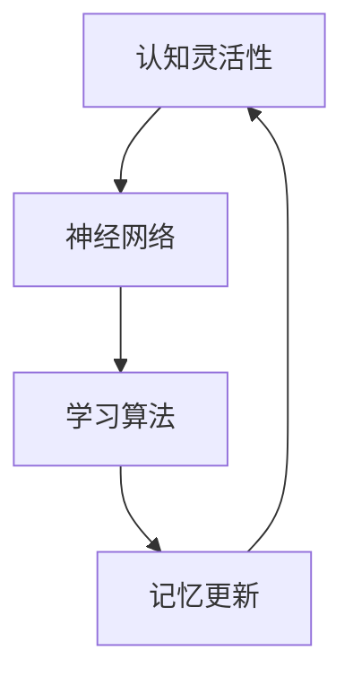

                 

# 认知灵活性：适应新知识的大脑机制

> 关键词：认知灵活性, 大脑机制, 神经网络, 学习算法, 记忆更新, 认知功能

## 1. 背景介绍

### 1.1 问题由来
认知灵活性是心理学、神经科学和人工智能领域中一个核心概念，指的是个体或模型在面对新环境、新任务时，快速适应并高效利用已有知识的能力。在不断变化的世界中，认知灵活性对于个体和机器的生存、学习和成长至关重要。

在大数据、云计算和深度学习的驱动下，现代人工智能系统被赋予了强大的学习和推理能力。然而，这些系统在面对新知识、新任务时，是否能够迅速适应并高效利用现有知识，仍然是一个挑战。在人类认知灵活性的启发下，研究者们试图通过理解和模拟大脑机制，构建更加智能、灵活的人工智能系统。

### 1.2 问题核心关键点
认知灵活性涉及多个关键点：
- 快速适应新环境和新任务：如何在未经历新任务的情况下，高效利用已有知识进行推理和学习。
- 知识重用：如何在不同任务间进行知识的迁移和重用，避免重复学习。
- 动态调整：如何在任务中动态调整策略和模型参数，以优化适应性。
- 记忆更新：如何处理和更新记忆，使其与新知识保持一致。

这些关键点共同构成了一个复杂、动态的认知灵活性模型。本文将从这些核心关键点出发，深入探讨认知灵活性的大脑机制及其在人工智能中的应用。

## 2. 核心概念与联系

### 2.1 核心概念概述

为更好地理解认知灵活性，首先需要介绍几个关键概念：

- **认知灵活性**：指个体或模型在面对新环境、新任务时，能够快速适应并高效利用已有知识的能力。
- **神经网络**：由大量人工神经元组成的计算模型，能够通过学习数据中的模式和规律，进行推理和决策。
- **学习算法**：用于训练神经网络，使其适应新任务的算法，包括监督学习、无监督学习、强化学习等。
- **记忆更新**：通过学习新数据，动态调整和更新神经网络中的权重和参数，以适应新的认知任务。

这些概念之间的逻辑关系可以通过以下Mermaid流程图来展示：



这个流程图展示了认知灵活性的实现过程：
1. 认知灵活性依赖于神经网络，通过神经元之间的连接和权重调整，实现推理和学习。
2. 学习算法训练神经网络，使其适应新任务，实现知识获取和推理。
3. 记忆更新机制，通过学习新数据，动态调整神经网络的参数，以适应新的认知任务。

## 3. 核心算法原理 & 具体操作步骤
### 3.1 算法原理概述

认知灵活性的大脑机制主要基于神经网络的学习算法和记忆更新机制。其核心思想是通过学习新数据，动态调整神经网络的参数，以实现快速适应新任务的目标。

以神经网络中的反向传播算法为例，其原理如下：
1. 输入数据经过前向传播，产生输出。
2. 将输出与真实标签进行比较，计算损失函数。
3. 通过反向传播，计算每个神经元的梯度。
4. 根据梯度更新神经元之间的权重和偏置，最小化损失函数。

这个过程不断迭代，直到收敛。通过调整权重和偏置，神经网络能够学习新数据中的模式，从而实现对新任务的适应。

### 3.2 算法步骤详解

认知灵活性的算法步骤可以分为以下几个关键环节：

**Step 1: 数据预处理**
- 对输入数据进行标准化、归一化等预处理，使其适合神经网络的输入范围。
- 划分训练集、验证集和测试集，准备训练数据。

**Step 2: 构建神经网络**
- 选择合适的神经网络结构，如卷积神经网络、循环神经网络、变分自编码器等。
- 定义神经元之间的连接方式、激活函数、损失函数等。

**Step 3: 初始化网络参数**
- 对网络参数进行初始化，如均值为0、方差为1的正态分布。

**Step 4: 训练神经网络**
- 将训练集数据输入神经网络，进行前向传播和反向传播。
- 计算损失函数，根据梯度更新网络参数。
- 在验证集上评估模型性能，避免过拟合。
- 重复上述过程，直至模型收敛。

**Step 5: 测试和评估**
- 在测试集上评估模型性能，对比训练前后的精度提升。
- 使用训练好的模型对新样本进行推理预测。

### 3.3 算法优缺点

认知灵活性的算法具有以下优点：
1. 灵活性高。通过动态调整参数，能够适应多种不同类型的新任务。
2. 泛化能力强。经过训练后的神经网络，能够在未经历的任务上表现良好。
3. 可扩展性强。通过增加网络层数、神经元数量等，可以提升模型的性能。

同时，该算法也存在一些局限性：
1. 计算成本高。特别是大规模神经网络，计算量巨大，需要高性能计算资源。
2. 容易出现过拟合。如果数据量不足，模型容易在训练集上过拟合，影响泛化性能。
3. 需要大量标注数据。神经网络的训练依赖于标注数据，数据获取成本高。
4. 可解释性差。神经网络是黑盒模型，难以解释其内部决策过程。

尽管存在这些局限性，但神经网络凭借其强大的学习能力，已成为认知灵活性研究的重要工具。未来相关研究的重点在于如何进一步提高神经网络的泛化能力、减少计算成本、提升可解释性等，以实现更加智能和灵活的人工智能系统。

### 3.4 算法应用领域

认知灵活性的算法已经在多个领域得到应用，如：

- 自然语言处理(NLP)：通过神经网络模型学习语言模式，实现机器翻译、情感分析、文本分类等任务。
- 计算机视觉(CV)：通过卷积神经网络学习图像特征，实现图像分类、目标检测、图像生成等任务。
- 语音识别(SR)：通过循环神经网络学习音频特征，实现语音识别、语音合成等任务。
- 推荐系统：通过神经网络模型学习用户偏好，实现个性化推荐。
- 金融预测：通过神经网络模型学习历史数据，进行市场预测和风险评估。

## 4. 数学模型和公式 & 详细讲解 & 举例说明

### 4.1 数学模型构建

认知灵活性的数学模型主要基于神经网络的学习算法和记忆更新机制。以下以多层感知器(Multilayer Perceptron, MLP)为例，构建一个简单的认知灵活性模型。

假设有一个输入层、两个隐藏层和一个输出层的MLP模型，其中每个隐藏层有 $n$ 个神经元，输出层有 $m$ 个神经元。模型的输入为 $x \in \mathbb{R}^d$，输出为 $y \in \mathbb{R}^m$。

定义 $x$ 经过第 $l$ 层的映射为 $h^{(l)} = \sigma(W^{(l)}h^{(l-1)}+b^{(l)})$，其中 $h^{(0)}=x$，$\sigma$ 为激活函数，$W^{(l)} \in \mathbb{R}^{n_l \times n_{l-1}}$ 和 $b^{(l)} \in \mathbb{R}^{n_l}$ 分别为第 $l$ 层的权重和偏置向量。

定义输出层 $y$ 的映射为 $y=\sigma(W^{(m)}h^{(m-1)}+b^{(m)})$，其中 $W^{(m)} \in \mathbb{R}^{m \times n_m}$ 和 $b^{(m)} \in \mathbb{R}^{m}$ 分别为输出层的权重和偏置向量。

### 4.2 公式推导过程

以二分类任务为例，假设模型的目标是预测 $x$ 属于类别 $y=1$ 的概率。定义损失函数为交叉熵损失函数：

$$
L = -\frac{1}{N} \sum_{i=1}^N [y_i \log \hat{y}_i + (1-y_i) \log (1-\hat{y}_i)]
$$

其中 $y_i \in \{0,1\}$ 为真实标签，$\hat{y}_i \in [0,1]$ 为模型的预测概率。

根据反向传播算法，损失函数对权重 $W^{(l)}$ 和偏置 $b^{(l)}$ 的梯度分别为：

$$
\frac{\partial L}{\partial W^{(l)}} = \frac{1}{N}\sum_{i=1}^N [(\hat{y}_i-y_i)h^{(l-1)}]^T
$$

$$
\frac{\partial L}{\partial b^{(l)}} = \frac{1}{N}\sum_{i=1}^N (\hat{y}_i-y_i)
$$

将这些梯度用于更新权重和偏置，即：

$$
W^{(l)} \leftarrow W^{(l)} - \eta \frac{\partial L}{\partial W^{(l)}}
$$

$$
b^{(l)} \leftarrow b^{(l)} - \eta \frac{\partial L}{\partial b^{(l)}}
$$

其中 $\eta$ 为学习率。

### 4.3 案例分析与讲解

以一个简单的手写数字识别为例，分析神经网络如何通过反向传播算法实现认知灵活性。

假设有一个输入层有 $784$ 个神经元，两个隐藏层分别有 $128$ 和 $64$ 个神经元，输出层有 $10$ 个神经元，对应数字 $0-9$。定义一个二分类任务，即预测输入的图像属于哪个数字类别。

首先，将输入的 $28 \times 28$ 像素的图像 $x$ 展开成 $784$ 维向量，输入到神经网络中。

其次，通过多个隐藏层进行特征提取，最终得到 $10$ 维的输出向量 $y$。

接着，将 $y$ 与真实标签 $y'$ 进行比较，计算交叉熵损失函数 $L$。

最后，通过反向传播算法更新权重和偏置，最小化损失函数。

通过不断迭代，神经网络能够学习图像中的特征，从而实现对新输入图像的快速识别。在这个过程中，神经网络的权重和偏置动态调整，实现了对新任务的适应。

## 5. 项目实践：代码实例和详细解释说明
### 5.1 开发环境搭建

在进行认知灵活性算法实践前，我们需要准备好开发环境。以下是使用Python进行TensorFlow开发的环境配置流程：

1. 安装Anaconda：从官网下载并安装Anaconda，用于创建独立的Python环境。

2. 创建并激活虚拟环境：
```bash
conda create -n tf-env python=3.8 
conda activate tf-env
```

3. 安装TensorFlow：根据CUDA版本，从官网获取对应的安装命令。例如：
```bash
conda install tensorflow tensorflow-gpu=2.6 -c conda-forge -c pytorch
```

4. 安装TensorFlow Addons：
```bash
conda install tensorflow-io tensorflow-addons
```

5. 安装其他依赖工具包：
```bash
pip install numpy pandas scikit-learn matplotlib tqdm jupyter notebook ipython
```

完成上述步骤后，即可在`tf-env`环境中开始认知灵活性算法的实践。

### 5.2 源代码详细实现

下面我们以手写数字识别为例，给出使用TensorFlow进行多层感知器(MLP)训练的代码实现。

首先，定义数据集和标签：

```python
import tensorflow as tf
import numpy as np

train_images = np.load('train_images.npy').reshape((60000, 28, 28, 1)).astype(np.float32)
train_labels = np.load('train_labels.npy').astype(np.int32)

test_images = np.load('test_images.npy').reshape((10000, 28, 28, 1)).astype(np.float32)
test_labels = np.load('test_labels.npy').astype(np.int32)
```

然后，构建MLP模型：

```python
model = tf.keras.Sequential([
    tf.keras.layers.InputLayer(input_shape=(28, 28, 1)),
    tf.keras.layers.Reshape(target_shape=(784,)),
    tf.keras.layers.Dense(units=128, activation='relu'),
    tf.keras.layers.Dense(units=64, activation='relu'),
    tf.keras.layers.Dense(units=10, activation='softmax')
])
```

接着，定义损失函数和优化器：

```python
loss_fn = tf.keras.losses.SparseCategoricalCrossentropy()
optimizer = tf.keras.optimizers.Adam()
```

然后，定义训练和评估函数：

```python
@tf.function
def train_step(images, labels):
    with tf.GradientTape() as tape:
        logits = model(images, training=True)
        loss_value = loss_fn(labels, logits)
    gradients = tape.gradient(loss_value, model.trainable_variables)
    optimizer.apply_gradients(zip(gradients, model.trainable_variables))
    return loss_value

@tf.function
def evaluate_step(images, labels):
    logits = model(images, training=False)
    predictions = tf.argmax(logits, axis=1)
    accuracy = tf.reduce_mean(tf.cast(tf.equal(predictions, labels), dtype=tf.float32))
    return accuracy
```

最后，启动训练流程并在测试集上评估：

```python
epochs = 10

for epoch in range(epochs):
    train_loss = 0
    for images, labels in train_dataset:
        train_loss += train_step(images, labels)
    train_loss /= len(train_dataset)
    print(f'Epoch {epoch+1}, train loss: {train_loss:.3f}')
    
    test_accuracy = evaluate_step(test_images, test_labels)
    print(f'Epoch {epoch+1}, test accuracy: {test_accuracy:.3f}')
```

以上就是使用TensorFlow进行MLP训练的完整代码实现。可以看到，TensorFlow的高级API使得模型构建和训练变得简洁高效。

### 5.3 代码解读与分析

让我们再详细解读一下关键代码的实现细节：

**数据加载**：
- 使用`np.load`加载训练集和测试集的图像和标签，并转换为TensorFlow可以处理的格式。

**模型定义**：
- 使用`tf.keras.Sequential`定义一个多层感知器模型，包含输入层、两个隐藏层和输出层。
- 使用`tf.keras.layers`定义每一层的具体实现，如输入层、全连接层和激活函数。

**损失函数和优化器**：
- 使用`tf.keras.losses.SparseCategoricalCrossentropy`定义交叉熵损失函数。
- 使用`tf.keras.optimizers.Adam`定义Adam优化器，学习率为$10^{-3}$。

**训练和评估函数**：
- 定义`train_step`函数，使用`tf.GradientTape`记录梯度，使用`optimizer.apply_gradients`更新模型参数。
- 定义`evaluate_step`函数，使用`tf.argmax`获取预测标签，使用`tf.equal`计算预测准确率。

**训练流程**：
- 循环训练多个epoch，每个epoch内对训练集进行迭代训练。
- 在每个epoch结束后，计算训练集和测试集的损失和准确率，并输出结果。

可以看到，TensorFlow提供了丰富的API和函数，可以大大简化模型构建和训练过程，提高开发效率。

## 6. 实际应用场景
### 6.1 智能推荐系统

认知灵活性在智能推荐系统中的应用主要体现在用户的兴趣动态变化和推荐内容的个性化适配上。通过神经网络模型学习用户的历史行为数据和兴趣特征，实时更新推荐策略，从而实现高效的个性化推荐。

在具体实现中，可以使用循环神经网络或变分自编码器模型，学习用户的行为序列或兴趣向量，并动态调整推荐模型，以适应用户的新兴趣。通过不断优化和更新模型，推荐系统能够更加精准地预测用户需求，提升用户体验和满意度。

### 6.2 智能客服系统

在智能客服系统中，认知灵活性可以通过神经网络模型实现对用户问题的快速响应和准确解答。通过训练数据集，模型学习不同类型的客户问题和答案模板，并在新问题出现时，动态调整输出策略，匹配最合适的答案。

例如，使用自然语言处理(NLP)技术，将客户问题转换为结构化数据，输入到神经网络中进行推理，生成对应的回答。通过不断优化和更新模型，智能客服系统能够更好地理解用户需求，提供更智能、高效的服务。

### 6.3 金融风险管理

在金融风险管理中，认知灵活性可以通过神经网络模型实现对市场动态的实时监测和风险预测。通过训练历史金融数据，模型学习市场变化的规律和趋势，并在新数据出现时，动态调整预测模型，识别潜在的风险点。

例如，使用卷积神经网络或循环神经网络，学习市场走势和波动特征，并动态调整预测模型。通过不断优化和更新模型，金融系统能够更好地识别风险因素，制定应对策略，降低风险损失。

### 6.4 未来应用展望

随着认知灵活性研究的不断深入，未来其在人工智能系统中的应用将更加广泛和深入。以下列举几个可能的未来应用方向：

1. **自动驾驶**：在自动驾驶中，认知灵活性可以通过神经网络模型实现对不同交通场景的快速适应和决策。通过学习不同交通条件下的驾驶策略，系统能够在复杂的环境中做出智能决策。

2. **医疗诊断**：在医疗诊断中，认知灵活性可以通过神经网络模型实现对不同疾病的快速诊断和决策。通过学习病历和影像数据，系统能够在新的病患数据出现时，快速生成诊断结果。

3. **虚拟助手**：在虚拟助手中，认知灵活性可以通过神经网络模型实现对不同用户需求的快速响应和处理。通过学习用户的个性化需求和行为特征，系统能够提供更加个性化和智能的服务。

4. **教育系统**：在教育系统中，认知灵活性可以通过神经网络模型实现对不同学生的快速评估和指导。通过学习学生的学习行为和知识掌握情况，系统能够生成个性化的学习建议和评估报告。

这些应用方向展示了认知灵活性在人工智能系统中的广泛应用潜力，相信未来会有更多的实际场景涌现。

## 7. 工具和资源推荐
### 7.1 学习资源推荐

为了帮助开发者系统掌握认知灵活性的大脑机制及其应用，这里推荐一些优质的学习资源：

1. 《深度学习》课程（Coursera）：由斯坦福大学的Andrew Ng教授主讲，系统介绍深度学习的基本概念和算法。
2. 《神经网络与深度学习》（Goodfellow, Bengio & Courville）：深度学习领域的经典教材，详细介绍神经网络和深度学习的原理与实现。
3. 《深度学习入门》（斋藤康毅）：通过案例讲解深度学习的实际应用，适合初学者入门。
4. 《TensorFlow官方文档》：详细介绍了TensorFlow的使用方法、API和示例，适合实践操作。
5. 《PyTorch官方文档》：详细介绍了PyTorch的使用方法、API和示例，适合实践操作。

通过这些资源的学习，相信你一定能够掌握认知灵活性的核心算法原理，并应用于实际开发中。

### 7.2 开发工具推荐

高效的开发离不开优秀的工具支持。以下是几款用于认知灵活性算法开发的常用工具：

1. TensorFlow：由Google主导开发的深度学习框架，功能强大，易于使用。支持GPU/TPU加速，适合大规模计算。
2. PyTorch：由Facebook开发，基于Python的深度学习框架，灵活性高，适合科研和创新。
3. TensorFlow Addons：提供了一些高级API和工具，方便开发者进行模型构建和调试。
4. Keras：基于TensorFlow和Theano的高层API，提供了更简洁的模型构建方式。
5. Jupyter Notebook：交互式笔记本环境，方便编写和运行代码，支持版本控制和协作开发。

合理利用这些工具，可以显著提升认知灵活性算法的开发效率，加快创新迭代的步伐。

### 7.3 相关论文推荐

认知灵活性研究涉及神经科学、心理学和计算机科学等多个领域，以下是几篇奠基性的相关论文，推荐阅读：

1. "Human Cognitive Control: A Review of the Cognitive Neuroscience Literature"（2010）：综述了认知控制的研究进展，介绍了认知灵活性的神经机制。
2. "Learning with Transformers"（2021）：介绍了Transformer结构在深度学习中的应用，包括认知灵活性的实现。
3. "Attention is All You Need"（2017）：提出了Transformer结构，为认知灵活性的实现提供了新的思路。
4. "A Computational Framework for Understanding Spontaneous Brain Activity"（2013）：研究了大脑活动的基本机制，为认知灵活性提供了神经科学基础。
5. "Cognitive Flexibility and Intelligence"（2015）：研究了认知灵活性对智力的影响，提供了心理学视角。

这些论文代表了大语言模型微调技术的发展脉络。通过学习这些前沿成果，可以帮助研究者把握学科前进方向，激发更多的创新灵感。

## 8. 总结：未来发展趋势与挑战

### 8.1 研究成果总结

本文对认知灵活性的大脑机制及其在人工智能中的应用进行了全面系统的介绍。首先阐述了认知灵活性的研究背景和意义，明确了认知灵活性在人工智能系统中的重要作用。其次，从原理到实践，详细讲解了神经网络的学习算法和记忆更新机制，给出了认知灵活性算法的完整代码实例。同时，本文还探讨了认知灵活性在多个领域的应用前景，展示了其在智能推荐、智能客服、金融风险管理等方面的潜在价值。

通过本文的系统梳理，可以看到，认知灵活性在人工智能系统中具有广泛的应用前景，能够有效提升系统的适应性和性能。神经网络的学习算法和记忆更新机制，为认知灵活性提供了坚实的理论基础和实现手段。

### 8.2 未来发展趋势

展望未来，认知灵活性在人工智能系统中的应用将更加广泛和深入。以下列举几个可能的未来发展趋势：

1. **实时性提升**：未来，随着硬件计算能力的提升和算法优化，认知灵活性算法将能够更快地响应新任务，提高系统的实时性。
2. **多模态融合**：未来，认知灵活性算法将能够更好地融合视觉、听觉、触觉等多种模态数据，提升系统的综合感知能力。
3. **跨领域迁移**：未来，认知灵活性算法将能够实现跨领域知识迁移，在多个领域中发挥更大的作用。
4. **知识图谱整合**：未来，认知灵活性算法将能够更好地与知识图谱等外部知识库结合，形成更加全面、准确的信息整合能力。
5. **自适应学习**：未来，认知灵活性算法将能够实现自适应学习，根据环境变化动态调整模型参数，提升系统的灵活性和适应性。

这些趋势凸显了认知灵活性在人工智能系统中的广阔前景，相信未来会有更多的应用场景涌现。

### 8.3 面临的挑战

尽管认知灵活性在人工智能系统中的应用前景广阔，但在迈向更加智能化、普适化应用的过程中，仍面临诸多挑战：

1. **计算资源限制**：大规模神经网络需要高性能计算资源，如何优化算法、减少计算量，是未来研究的重要方向。
2. **数据获取困难**：认知灵活性算法依赖于大量标注数据，如何高效获取和利用标注数据，是未来研究的难点。
3. **模型鲁棒性不足**：认知灵活性算法在面对新任务时，容易出现鲁棒性不足的问题，如何提高模型的泛化性能，是未来研究的重点。
4. **模型可解释性差**：神经网络是黑盒模型，难以解释其内部决策过程，如何提高模型的可解释性，是未来研究的方向之一。
5. **伦理和安全问题**：认知灵活性算法在实际应用中，可能涉及隐私保护、伦理道德等问题，如何确保模型的安全和伦理性，是未来研究的难点。

正视这些挑战，积极应对并寻求突破，将使认知灵活性算法在人工智能系统中的应用更加广泛和深入。

### 8.4 研究展望

面对认知灵活性算法面临的挑战，未来的研究需要在以下几个方面寻求新的突破：

1. **高效算法**：开发更加高效的算法，减少计算量，提高实时性。如分布式计算、剪枝优化、量化压缩等方法。
2. **数据生成**：开发数据生成技术，通过模拟和合成数据，弥补标注数据的不足。如数据增强、对抗生成网络等方法。
3. **模型泛化**：提高模型的泛化性能，使其能够在不同的环境和任务中表现良好。如迁移学习、多任务学习等方法。
4. **模型可解释**：提高模型的可解释性，增强模型的透明度和可信度。如可解释AI、注意力机制等方法。
5. **伦理和安全**：研究如何确保模型的伦理性和安全性，避免模型的误用和滥用。如模型审计、隐私保护等方法。

这些研究方向的探索，必将引领认知灵活性算法迈向更高的台阶，为构建安全、可靠、可解释、可控的智能系统铺平道路。面向未来，认知灵活性算法还需要与其他人工智能技术进行更深入的融合，如知识表示、因果推理、强化学习等，多路径协同发力，共同推动自然语言理解和智能交互系统的进步。只有勇于创新、敢于突破，才能不断拓展认知灵活性的边界，让智能技术更好地造福人类社会。

## 9. 附录：常见问题与解答

**Q1：认知灵活性在人工智能系统中的作用是什么？**

A: 认知灵活性在人工智能系统中的作用主要体现在以下几个方面：
1. **适应性**：能够快速适应新环境和任务，提高系统的灵活性和泛化能力。
2. **迁移能力**：能够在不同任务间进行知识迁移，避免重复学习。
3. **动态调整**：能够在任务中动态调整策略和模型参数，优化适应性。
4. **记忆更新**：能够处理和更新记忆，使其与新知识保持一致。

通过认知灵活性，人工智能系统能够更好地应对不断变化的环境和任务，提升系统的智能水平。

**Q2：如何提高认知灵活性算法的泛化性能？**

A: 提高认知灵活性算法的泛化性能，可以从以下几个方面入手：
1. **数据增强**：通过数据增强技术，扩充训练集，增加模型的泛化能力。如回译、近义替换等方法。
2. **正则化**：使用正则化技术，避免模型过拟合，提高泛化性能。如L2正则、Dropout等方法。
3. **多任务学习**：在训练过程中加入多个任务，提高模型的泛化能力。如多任务学习、元学习等方法。
4. **迁移学习**：通过迁移学习，利用已有知识，提升模型的泛化性能。如知识蒸馏、联邦学习等方法。
5. **对抗训练**：通过对抗训练，提高模型的鲁棒性，增强泛化能力。

通过这些方法，可以显著提升认知灵活性算法的泛化性能，使其在更多场景中发挥作用。

**Q3：认知灵活性算法在开发过程中需要注意哪些问题？**

A: 在认知灵活性算法开发过程中，需要注意以下几个问题：
1. **数据质量**：数据质量和标注数据的重要性不容忽视，必须保证数据的准确性和多样性。
2. **模型复杂度**：模型的复杂度需要根据任务需求进行平衡，避免过于复杂导致过拟合或资源消耗过大。
3. **计算效率**：大规模神经网络需要高性能计算资源，如何优化算法、减少计算量，是未来研究的重要方向。
4. **模型可解释**：神经网络是黑盒模型，难以解释其内部决策过程，如何提高模型的可解释性，是未来研究的方向之一。
5. **伦理和安全**：认知灵活性算法在实际应用中，可能涉及隐私保护、伦理道德等问题，如何确保模型的伦理性和安全性，是未来研究的难点。

这些问题的处理需要开发者在模型设计、数据获取、算法优化等环节进行全面考虑和优化。

**Q4：认知灵活性算法在实际应用中需要注意哪些问题？**

A: 在认知灵活性算法实际应用中，需要注意以下几个问题：
1. **实时性**：如何提高算法的实时性，确保系统能够快速响应新任务。
2. **多模态融合**：如何融合视觉、听觉、触觉等多种模态数据，提升系统的综合感知能力。
3. **跨领域迁移**：如何实现跨领域知识迁移，在多个领域中发挥更大的作用。
4. **知识图谱整合**：如何更好地与知识图谱等外部知识库结合，形成更加全面、准确的信息整合能力。
5. **自适应学习**：如何实现自适应学习，根据环境变化动态调整模型参数，提升系统的灵活性和适应性。

这些问题的处理需要开发者在算法设计、系统集成、用户交互等环节进行全面考虑和优化。

---

作者：禅与计算机程序设计艺术 / Zen and the Art of Computer Programming

