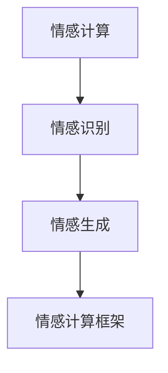

                 

## 1. 背景介绍

### 1.1 问题由来

在近年来，人工智能（AI）技术快速发展的同时，人们逐渐开始关注机器对人类情感的理解。情感作为人类认知的重要组成部分，直接影响着人类的决策、行为和交互。如何在AI系统中加入情感理解能力，已经成为人工智能领域研究的热点。

情感计算（Affective Computing），即研究如何让计算机更好地理解和处理人类的情感信息。这种技术可以应用于医疗、教育、娱乐等多个领域，提升用户体验和效率。在AI系统的应用中，情感理解可以帮助机器更好地进行人机交互，增强机器的情感共鸣和自然语言理解能力，甚至用于预测和引导人类的情感状态。

### 1.2 问题核心关键点

目前，情感理解已成为情感计算研究的核心问题。其关键点包括：

1. **情感识别**：机器如何识别并理解人类的情感状态。
2. **情感生成**：机器如何产生符合情感语境的响应。
3. **情感计算框架**：如何将情感知识与机器学习模型结合起来，构建有效的情感理解系统。

这些问题的解决，将使AI系统更加智能化和人性化。

## 2. 核心概念与联系

### 2.1 核心概念概述

为更好地理解AI系统如何理解人类情感，我们将介绍几个核心概念：

- **情感计算**：研究如何让计算机理解和处理人类情感的科学和工程领域。
- **情感识别**：识别出人类的情感状态，如愤怒、快乐、悲伤等。
- **情感生成**：根据识别到的情感状态，产生符合情境的情感响应。
- **情感计算框架**：构建包含情感识别、情感生成等模块的情感理解系统。

这些概念之间的联系和互动，形成了AI系统情感理解的完整框架。

### 2.2 核心概念原理和架构的 Mermaid 流程图



该流程图展示了情感计算的基本架构：情感计算体系由情感识别、情感生成和情感计算框架组成。情感识别模块负责将输入的文本、声音等转换为情感状态；情感生成模块根据情感状态产生情感响应；情感计算框架将这两部分集成，构建出完整的情感理解系统。

## 3. 核心算法原理 & 具体操作步骤

### 3.1 算法原理概述

情感理解的核心算法包括：

- **情感识别算法**：使用机器学习模型（如深度学习、支持向量机等）对输入数据进行情感分类。
- **情感生成算法**：利用自然语言处理（NLP）技术，如基于规则的生成、基于序列的生成等，生成符合情感状态的响应。
- **情感计算框架**：整合情感识别和情感生成模块，形成完整的情感理解系统。

### 3.2 算法步骤详解

**情感识别算法**：

1. **数据收集**：收集情感数据，如社交媒体文本、语音、面部表情等。
2. **特征提取**：从原始数据中提取情感特征，如词汇、语调、语速、音调等。
3. **模型训练**：使用情感分类算法（如深度学习中的CNN、RNN等）对特征进行训练，构建情感识别模型。
4. **模型评估**：使用测试集对模型进行评估，调整参数以提高识别精度。

**情感生成算法**：

1. **情感状态定义**：定义情感状态，如愤怒、快乐、悲伤等。
2. **生成模型训练**：使用基于规则或基于序列的生成模型训练情感生成器。
3. **生成响应**：根据情感状态和上下文信息，生成符合情感语境的响应。

**情感计算框架**：

1. **模块集成**：将情感识别和情感生成模块集成，构建情感计算框架。
2. **用户交互设计**：设计用户界面，使用户能够自然地与情感计算系统交互。
3. **系统测试和优化**：对系统进行测试，优化各模块的性能和互动方式。

### 3.3 算法优缺点

**情感识别算法的优点**：

1. **高精度**：深度学习等模型可以处理复杂的情感特征，提高识别精度。
2. **鲁棒性**：不同来源的情感数据可以用于训练，提高模型的鲁棒性。

**情感识别算法的缺点**：

1. **数据需求**：需要大量标注数据进行训练，获取数据的成本较高。
2. **泛化能力**：不同文化背景下的情感表达可能存在差异，模型泛化能力有限。

**情感生成算法的优点**：

1. **自然性**：基于规则或序列的生成模型可以产生自然的情感响应。
2. **可控性**：可以根据用户需求，生成特定情感的响应。

**情感生成算法的缺点**：

1. **多样性**：生成的响应可能缺乏多样性，过于单调。
2. **质量控制**：生成的响应需要人工审核，保证其质量和情感准确性。

**情感计算框架的优点**：

1. **集成化**：将情感识别和生成模块集成，形成完整的情感理解系统。
2. **可扩展性**：可以根据需要添加新的情感识别和生成模块。

**情感计算框架的缺点**：

1. **复杂度**：系统构建和维护相对复杂，需要跨学科的知识。
2. **实时性**：生成情感响应需要时间，可能无法实时响应。

### 3.4 算法应用领域

情感计算技术已经在多个领域得到应用：

1. **医疗领域**：用于心理健康监测、情绪治疗等。
2. **教育领域**：用于评估学生的情绪状态，改善教学效果。
3. **娱乐领域**：用于游戏角色生成自然对话、情感反应等。
4. **人机交互**：用于改善人机交互体验，提升用户满意度。

## 4. 数学模型和公式 & 详细讲解 & 举例说明

### 4.1 数学模型构建

情感计算模型的核心数学模型包括：

- **情感识别模型**：$M_{\text{识别}}(x_i) = \hat{y}_i$，其中 $x_i$ 为输入数据，$\hat{y}_i$ 为识别出的情感状态。
- **情感生成模型**：$G_{\text{生成}}(\hat{y}_i) = \text{response}_i$，其中 $\hat{y}_i$ 为情感状态，$\text{response}_i$ 为生成的情感响应。

### 4.2 公式推导过程

以情感识别模型为例，假设输入数据为 $x_i$，情感状态为 $y_i$，使用深度学习模型进行训练，其公式推导如下：

$$
\hat{y}_i = M_{\text{识别}}(x_i) = \text{softmax}(\text{softmax}(\text{MLP}(x_i)))
$$

其中，$\text{MLP}$ 为多层感知器（Multilayer Perceptron），$\text{softmax}$ 为softmax激活函数。训练数据为 $(x_i, y_i)$，损失函数为交叉熵损失函数：

$$
L = -\frac{1}{N}\sum_{i=1}^N y_i\log M_{\text{识别}}(x_i) + (1-y_i)\log(1-M_{\text{识别}}(x_i))
$$

通过反向传播算法，不断调整模型参数，最小化损失函数。

### 4.3 案例分析与讲解

以语音情感识别为例，假设输入为语音信号 $x$，情感状态为 $y$。

1. **特征提取**：使用MFCC（Mel Frequency Cepstral Coefficients）提取语音特征。
2. **情感识别模型**：使用卷积神经网络（CNN）或循环神经网络（RNN）对MFCC特征进行训练。
3. **情感生成模型**：根据识别出的情感状态，使用基于规则的生成器或序列生成器生成情感响应。

## 5. 项目实践：代码实例和详细解释说明

### 5.1 开发环境搭建

开发情感计算系统需要以下环境：

1. **Python环境**：使用Anaconda创建虚拟环境，安装必要的Python包。
2. **深度学习框架**：安装TensorFlow、PyTorch等深度学习框架。
3. **语音处理库**：安装Librosa、PyAudio等库，用于处理语音数据。
4. **文本处理库**：安装NLTK、spaCy等库，用于处理文本数据。

### 5.2 源代码详细实现

以下是一个简单的情感识别系统代码示例：

```python
import tensorflow as tf
import numpy as np
import librosa

# 加载数据
x_train = ...
y_train = ...

# 构建模型
model = tf.keras.Sequential([
    tf.keras.layers.Conv2D(32, (3, 3), activation='relu', input_shape=(128, 128, 1)),
    tf.keras.layers.MaxPooling2D((2, 2)),
    tf.keras.layers.Flatten(),
    tf.keras.layers.Dense(128, activation='relu'),
    tf.keras.layers.Dense(2, activation='softmax')
])

# 编译模型
model.compile(optimizer='adam', loss='categorical_crossentropy', metrics=['accuracy'])

# 训练模型
model.fit(x_train, y_train, epochs=10, batch_size=32)

# 加载测试数据
x_test = ...
y_test = ...

# 评估模型
test_loss, test_acc = model.evaluate(x_test, y_test)
print('Test accuracy:', test_acc)
```

### 5.3 代码解读与分析

以上代码展示了使用TensorFlow进行情感识别的基本流程：

1. **数据加载**：使用Numpy加载训练和测试数据。
2. **模型构建**：使用TensorFlow定义卷积神经网络模型。
3. **模型编译**：设置优化器、损失函数和评估指标。
4. **模型训练**：使用训练数据拟合模型。
5. **模型评估**：使用测试数据评估模型性能。

### 5.4 运行结果展示

使用上述代码训练得到的模型，可以在新的语音数据上测试其情感识别能力，例如：

```python
# 加载新的语音数据
x_new = ...

# 预测情感状态
y_pred = model.predict(x_new)

# 输出预测结果
print(y_pred)
```

## 6. 实际应用场景

### 6.1 医疗领域

在医疗领域，情感计算可以用于心理健康监测和治疗。通过分析患者的语音、面部表情、文本等信息，识别其情绪状态，提供个性化的心理健康建议和治疗方案。例如，使用情感识别模型分析患者的语音，判断其是否处于焦虑状态，并根据结果提供放松技巧或进行心理咨询。

### 6.2 教育领域

在教育领域，情感计算可以用于评估学生的情绪状态，改善教学效果。通过分析学生的课堂发言、作业、考试等信息，识别其情绪状态，及时调整教学内容和方式。例如，使用情感识别模型分析学生的语音和文本，判断其是否处于困惑或沮丧状态，并根据结果调整教学策略或提供心理辅导。

### 6.3 娱乐领域

在娱乐领域，情感计算可以用于游戏角色生成自然对话和情感反应。通过分析玩家的游戏行为和语音，识别其情绪状态，生成符合情感语境的对话和反应。例如，在角色扮演游戏中，根据玩家的语音和文本，判断其角色是否生气或开心，并根据结果调整角色的言行举止。

### 6.4 未来应用展望

随着情感计算技术的发展，未来将有更多应用场景涌现：

1. **个性化推荐**：通过分析用户的情感状态，提供更符合其兴趣和情绪的推荐内容。
2. **智能客服**：使用情感计算技术提高客服系统的响应速度和情感共鸣，提升用户满意度。
3. **社会治理**：用于分析社会情感状态，预测和防范社会风险。

## 7. 工具和资源推荐

### 7.1 学习资源推荐

为了掌握情感计算技术，推荐以下学习资源：

1. **《情感计算：理论与实践》**：这本书系统介绍了情感计算的基本概念和技术，适合初学者和研究者。
2. **Coursera情感计算课程**：由斯坦福大学开设的情感计算课程，讲解情感识别的基本方法和应用。
3. **Kaggle情感计算竞赛**：通过参加情感计算竞赛，实践情感识别的技术和算法。

### 7.2 开发工具推荐

以下是一些用于情感计算开发的常用工具：

1. **TensorFlow**：开源深度学习框架，支持多种模型和算法。
2. **PyTorch**：开源深度学习框架，灵活易用。
3. **NLTK**：Python自然语言处理库，支持情感分析等任务。
4. **Librosa**：Python语音处理库，支持音频特征提取和处理。

### 7.3 相关论文推荐

以下是几篇情感计算领域的经典论文，推荐阅读：

1. **A Survey on Affective Computing: Technical and Ethical Issues**：概述情感计算的发展现状和存在问题。
2. **Facial Expression Recognition Using Deep Convolutional Neural Networks**：使用卷积神经网络进行面部表情识别，展示了情感计算在计算机视觉中的应用。
3. **Towards Smart Interactions for Speech-Based Human-AI Interaction**：研究情感计算在语音交互中的应用，提出基于语音情感识别的交互系统。

## 8. 总结：未来发展趋势与挑战

### 8.1 研究成果总结

本文对情感计算技术的原理、模型和应用进行了详细探讨，展示了情感计算在医疗、教育、娱乐等领域的潜在应用。情感计算技术在提高用户体验和改善社会治理等方面具有重要意义。

### 8.2 未来发展趋势

未来情感计算技术将呈现以下趋势：

1. **多模态融合**：结合语音、面部表情、文本等多种模态信息，提高情感识别的准确性。
2. **实时处理**：提高情感计算系统的实时性，使其能够快速响应实时数据。
3. **跨领域应用**：将情感计算技术应用于更多领域，如智能交通、智慧城市等。

### 8.3 面临的挑战

尽管情感计算技术在多个领域展示了巨大潜力，但仍面临以下挑战：

1. **数据稀缺**：情感数据获取难度大，数据量不足可能影响识别精度。
2. **文化差异**：不同文化背景下的情感表达存在差异，模型泛化能力有限。
3. **隐私保护**：情感数据涉及隐私问题，如何保护用户隐私是一个重要挑战。
4. **伦理道德**：情感计算可能引发伦理道德问题，如过度监控、情感操纵等。

### 8.4 研究展望

为了应对这些挑战，未来的研究需要：

1. **数据增强**：通过数据合成和迁移学习等方法，增加情感数据量。
2. **跨文化模型**：构建跨文化适用的情感计算模型，提高模型的泛化能力。
3. **隐私保护**：使用差分隐私等技术保护用户隐私，确保情感数据的匿名化。
4. **伦理审查**：建立情感计算技术的伦理审查机制，确保其应用符合道德规范。

## 9. 附录：常见问题与解答

**Q1：情感计算系统如何保护用户隐私？**

A: 情感计算系统需要采集用户的语音、文本等数据，为保护用户隐私，可以采用以下措施：

1. **匿名化处理**：对采集的数据进行匿名化处理，去除个人身份信息。
2. **差分隐私**：使用差分隐私技术，保护用户数据不被泄露。
3. **加密存储**：将用户数据加密存储，防止数据泄露。

**Q2：情感计算系统如何处理多模态信息？**

A: 多模态情感计算系统需要同时处理语音、面部表情、文本等多种信息。可以采用以下方法：

1. **特征融合**：将不同模态的特征进行融合，构建统一的情感表示。
2. **多模态模型**：使用多模态深度学习模型，同时处理多种数据模态。
3. **跨模态对齐**：对齐不同模态的数据，使得不同模态的信息一致。

**Q3：情感计算系统如何应对跨文化差异？**

A: 跨文化情感计算需要考虑不同文化背景下的情感表达差异。可以采用以下方法：

1. **文化适应**：训练跨文化的情感计算模型，适应不同文化背景下的情感表达。
2. **文化数据集**：使用跨文化的情感数据集进行训练，提高模型的泛化能力。
3. **文化规范**：参考不同文化背景下的情感规范，构建符合各文化背景的情感识别模型。

**Q4：情感计算系统如何实现实时处理？**

A: 情感计算系统需要快速响应实时数据，可以采用以下方法：

1. **高效模型**：使用高效的情感识别模型，减少计算时间。
2. **分布式计算**：使用分布式计算架构，提高计算速度。
3. **异步处理**：采用异步处理机制，处理实时数据流。

---

作者：禅与计算机程序设计艺术 / Zen and the Art of Computer Programming

