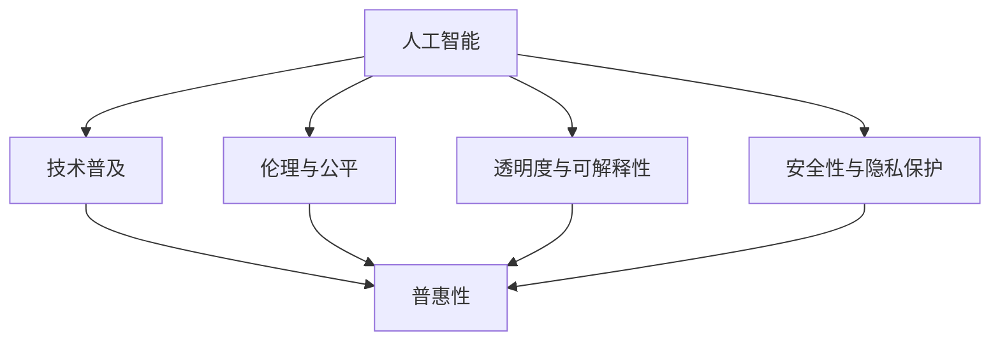

                 

# AI技术的普惠性:让更多人受益的途径

> 关键词：人工智能,普惠性,技术普及,AI伦理,社会责任

## 1. 背景介绍

### 1.1 问题由来
近年来，人工智能（AI）技术的快速发展，正逐渐渗透到社会的各个领域。从医疗、教育到金融、制造，AI技术的应用，正在改变着人们的工作和生活方式。然而，尽管AI技术带来了诸多便利和创新，但其发展和应用的普及，却面临着一些棘手的挑战：技术鸿沟、伦理问题、隐私保护等。这些问题不仅制约了AI技术的广泛应用，也使得AI技术的发展方向引起了社会各界的广泛关注。

### 1.2 问题核心关键点
如何使AI技术更好地服务于大众，实现其普惠性，是当前AI研究的重要方向。这一方向不仅包括技术的普及和应用，更关乎伦理、隐私、公平等核心价值。

AI技术的普惠性，主要体现在以下几个方面：
- **普及性**：使得更多的普通用户能够使用AI技术，无论其背景、知识和技能水平如何。
- **公平性**：保证不同背景和社会群体的AI技术应用机会均等。
- **可访问性**：降低使用AI技术的门槛，使得其在资源受限的环境下也能得到应用。
- **透明度**：增加AI技术的决策过程透明度，提升公众对AI技术的信任度。
- **安全性**：确保AI技术的安全性和隐私保护，防止滥用和误用。

本研究聚焦于如何从技术、伦理和社会责任的视角，探讨如何让AI技术更加普惠，更好地服务于社会大众。

## 2. 核心概念与联系

### 2.1 核心概念概述

为更好地理解AI技术普惠性的实现，本节将介绍几个核心概念：

- **人工智能(AI)**：指通过计算机程序实现的人类智能活动。包括机器学习、深度学习、自然语言处理等多种技术。
- **普惠性(Accessibility)**：指使AI技术可以被更广泛地使用，不分社会背景和资源限制。
- **技术普及**：指使AI技术的基础知识和应用技能普及到更多人群，降低使用门槛。
- **伦理与公平**：指在AI技术开发与应用过程中，遵循伦理原则，保证不同群体之间的公平使用。
- **透明度与可解释性**：指AI模型的决策过程透明，用户可以理解和解释AI的输出结果。
- **安全性与隐私保护**：指在AI技术应用过程中，确保数据安全和个人隐私的保护。

这些核心概念之间的逻辑关系可以通过以下Mermaid流程图来展示：



这个流程图展示了几大核心概念之间的联系：

1. 人工智能技术是普惠性的基础。
2. 技术普及是实现普惠性的关键手段。
3. 伦理与公平是普惠性的重要保障。
4. 透明度与可解释性提升普惠性的可信度。
5. 安全性与隐私保护是普惠性的底线要求。

这些概念共同构成了AI技术普惠性的实现框架，使其能够更好地服务于社会大众。

## 3. 核心算法原理 & 具体操作步骤

### 3.1 算法原理概述

实现AI技术的普惠性，涉及多方面的算法和技术手段，主要包括：

- **技术普及**：通过易于理解的教学材料和示范应用，使更多人掌握AI技术。
- **伦理与公平**：在AI技术设计中遵循伦理原则，确保不同群体之间的公平使用。
- **透明度与可解释性**：通过设计易于理解的模型和接口，提升AI模型决策的透明性和可解释性。
- **安全性与隐私保护**：采用隐私保护技术，确保数据安全和个人隐私不受侵犯。

### 3.2 算法步骤详解

#### 3.2.1 技术普及

**步骤1：创建易于理解的教材与教程**

- **教材撰写**：邀请AI领域的专家撰写易懂的技术教材，涵盖基础理论和应用实践。
- **多媒体制作**：制作简单易懂的教学视频、案例演示、交互式教程，方便不同层次的读者学习。

**步骤2：提供实践机会**

- **在线平台**：搭建线上学习平台，提供丰富的实验和实训项目。
- **线下工作坊**：定期举办线下技术工作坊，组织面对面的技术交流和互动。

**步骤3：推广应用案例**

- **成功案例**：收集并推广成功应用AI技术的企业和案例，展示其经济效益和社会价值。
- **案例分析**：分析不同应用场景下的技术挑战和解决方案，提供实用经验。

#### 3.2.2 伦理与公平

**步骤1：伦理原则制定**

- **多方参与**：邀请学术界、产业界、政策制定者等多方参与，共同制定AI伦理指南。
- **伦理委员会**：成立专门的AI伦理委员会，对AI技术应用进行伦理审查。

**步骤2：公平性设计**

- **数据多样性**：确保训练数据的多样性，避免模型偏向特定群体。
- **算法透明**：公开算法设计和决策依据，便于公众监督。

#### 3.2.3 透明度与可解释性

**步骤1：设计可解释性模型**

- **可解释性模型**：采用可解释性强的模型架构，如决策树、线性回归等。
- **解释性工具**：开发解释性工具，如LIME、SHAP等，帮助用户理解模型决策过程。

**步骤2：提供解释性界面**

- **可视界面**：设计友好的用户界面，展示模型输出和决策依据。
- **交互式演示**：提供交互式演示，让用户通过示例数据验证模型输出。

#### 3.2.4 安全性与隐私保护

**步骤1：数据加密与匿名化**

- **加密技术**：采用数据加密技术，保护数据在传输和存储过程中的安全。
- **匿名化处理**：对敏感数据进行匿名化处理，防止个人信息泄露。

**步骤2：访问控制与审计**

- **权限管理**：实现严格的访问控制，确保只有授权人员可以访问敏感数据。
- **审计日志**：记录和审计数据访问和使用情况，防止滥用和误用。

### 3.3 算法优缺点

**优点：**

1. **广泛覆盖**：通过普惠性技术普及，使得更多人群能够接触和应用AI技术。
2. **伦理保障**：通过伦理审查和公平性设计，确保AI技术应用的道德底线。
3. **透明度提升**：通过可解释性模型和界面，提升用户对AI技术的信任度。
4. **隐私保护**：通过数据加密和匿名化处理，保障用户数据的安全性和隐私。

**缺点：**

1. **技术门槛**：在普及过程中，仍需一定的技术知识和技术积累。
2. **资源消耗**：普及和公平性设计可能增加一定的资源消耗和成本。
3. **复杂度提升**：可解释性设计和安全性措施可能增加模型复杂度。

### 3.4 算法应用领域

AI技术的普惠性应用，已经覆盖了教育、医疗、金融、制造等多个领域，具体如下：

- **教育**：AI辅助教学、个性化学习、自动化批改等。
- **医疗**：AI辅助诊断、药物研发、病人监护等。
- **金融**：AI风险评估、智能投顾、客户服务等。
- **制造**：AI质量控制、供应链管理、设备维护等。

## 4. 数学模型和公式 & 详细讲解 & 举例说明

### 4.1 数学模型构建

#### 4.1.1 数据驱动模型

**模型定义**：

假设有一个分类问题，输入为 $x$，输出为 $y$，模型为 $f(x; \theta)$。训练集为 $D = \{(x_i, y_i)\}_{i=1}^N$。

**目标函数**：

最小化经验风险 $J_{emp}(\theta) = \frac{1}{N} \sum_{i=1}^N \ell(y_i, f(x_i; \theta))$，其中 $\ell$ 为损失函数。

**学习算法**：

使用梯度下降法更新模型参数 $\theta$，即 $\theta \leftarrow \theta - \eta \nabla_\theta J_{emp}(\theta)$。

### 4.2 公式推导过程

**公式推导**：

1. **损失函数定义**：交叉熵损失 $L = -\frac{1}{N} \sum_{i=1}^N y_i \log f(x_i; \theta) + (1-y_i) \log (1-f(x_i; \theta))$。
2. **梯度计算**：$\nabla_\theta L = -\frac{1}{N} \sum_{i=1}^N \left( y_i \nabla_\theta \log f(x_i; \theta) + (1-y_i) \nabla_\theta \log (1-f(x_i; \theta)) \right)$。
3. **更新规则**：$\theta \leftarrow \theta - \eta \nabla_\theta L$。

**案例分析**：

以医疗诊断为例，假设输入为患者的病历数据 $x$，输出为诊断结果 $y$（如癌症与否）。模型 $f(x; \theta)$ 为神经网络模型，训练集 $D$ 包含多例患者的病历数据及其诊断结果。通过最小化交叉熵损失，模型不断调整参数 $\theta$，以逼近真实的诊断结果。

### 4.3 案例分析与讲解

**医疗诊断案例**：

1. **数据准备**：收集大量患者的病历数据，包括症状、体征、诊断结果等。
2. **模型训练**：使用医疗诊断数据对神经网络模型进行训练，最小化交叉熵损失。
3. **模型验证**：在独立的验证集上评估模型的性能，确保模型的泛化能力。
4. **应用实践**：将训练好的模型应用到新的患者数据上，辅助医生进行诊断决策。

## 5. 项目实践：代码实例和详细解释说明

### 5.1 开发环境搭建

#### 5.1.1 环境安装

1. **Python环境**：
   - 安装Anaconda，搭建虚拟环境。
   - 安装必要的Python库，如numpy、pandas、scikit-learn等。

2. **深度学习框架**：
   - 安装TensorFlow或PyTorch，搭建深度学习模型。
   - 安装TensorBoard，用于可视化模型训练过程。

3. **数据处理工具**：
   - 安装Pandas，用于数据预处理和加载。
   - 安装Matplotlib，用于数据可视化。

### 5.2 源代码详细实现

#### 5.2.1 数据准备

```python
import pandas as pd
from sklearn.model_selection import train_test_split

# 加载医疗数据
data = pd.read_csv('medical_data.csv')

# 数据预处理
features = data[['age', 'gender', 'symptoms', 'labs']]
labels = data['diagnosis']
features = features.drop(columns=['diagnosis'])

# 数据拆分
train_features, test_features, train_labels, test_labels = train_test_split(features, labels, test_size=0.2, random_state=42)
```

#### 5.2.2 模型构建

```python
import tensorflow as tf
from tensorflow.keras.models import Sequential
from tensorflow.keras.layers import Dense, Dropout

# 定义模型
model = Sequential([
    Dense(64, activation='relu', input_shape=(4,)),
    Dropout(0.5),
    Dense(32, activation='relu'),
    Dropout(0.5),
    Dense(1, activation='sigmoid')
])

# 编译模型
model.compile(optimizer='adam', loss='binary_crossentropy', metrics=['accuracy'])

# 训练模型
model.fit(train_features, train_labels, epochs=10, validation_data=(test_features, test_labels))
```

#### 5.2.3 结果展示

```python
# 在测试集上评估模型
test_loss, test_accuracy = model.evaluate(test_features, test_labels)
print(f'Test accuracy: {test_accuracy:.2f}')
```

### 5.3 代码解读与分析

**代码解释**：

1. **数据准备**：使用Pandas加载医疗数据，进行特征选择和数据拆分。
2. **模型构建**：使用Keras搭建一个包含两个隐藏层的神经网络模型，使用Dropout层避免过拟合。
3. **模型训练**：在训练集上使用Adam优化器进行模型训练，并在验证集上评估模型性能。
4. **结果展示**：在测试集上评估模型准确率。

## 6. 实际应用场景

### 6.1 智能医疗

**背景**：

智能医疗是AI技术普惠性的典型应用场景之一。通过AI技术，可以有效提高医疗诊断的准确性、效率和可及性。

**具体应用**：

1. **诊断辅助**：AI辅助医生进行疾病诊断，提供参考意见。
2. **病人监护**：实时监测病人健康数据，及时发现异常情况。
3. **药物研发**：通过分析大量生物数据，加速药物研发进程。

**优势**：

- **提升诊断准确性**：AI技术可以快速分析大量病历数据，发现细微的异常信号。
- **提高诊疗效率**：AI技术可以辅助医生进行初步诊断，缩短诊断时间。
- **扩大医疗可及性**：在资源匮乏的地区，通过远程医疗和AI技术，提供高质量的医疗服务。

### 6.2 智慧教育

**背景**：

智慧教育是AI技术在教育领域的重要应用，通过AI技术，可以实现个性化学习、智能辅导等功能，提升教育质量和公平性。

**具体应用**：

1. **智能辅导**：AI辅助教师进行学生辅导，提供个性化学习建议。
2. **作业批改**：使用AI技术自动批改作业，减少教师工作负担。
3. **课程推荐**：根据学生的学习行为和兴趣，推荐合适的学习资源。

**优势**：

- **提升教学质量**：AI技术可以实时监测学生的学习状态，提供个性化的学习建议。
- **减轻教师负担**：通过AI技术自动批改作业和答疑，教师可以集中精力在教学设计上。
- **实现教育公平**：通过在线学习平台，无论地理位置如何，学生都能获得高质量的教育资源。

### 6.3 智能制造

**背景**：

智能制造是制造业的未来发展方向，通过AI技术，可以实现生产过程的自动化、智能化和柔性化。

**具体应用**：

1. **质量控制**：AI技术实时监测生产过程，发现并消除质量问题。
2. **供应链管理**：通过AI技术优化供应链管理，降低成本，提高效率。
3. **设备维护**：AI技术监测设备运行状态，预测设备故障，提前进行维护。

**优势**：

- **提高生产效率**：AI技术可以实时监测生产过程，优化生产流程，减少浪费。
- **降低生产成本**：通过智能化的设备维护，减少设备停机时间，提高生产效率。
- **提升产品质量**：AI技术可以实时监测产品质量，及时发现和纠正问题。

## 7. 工具和资源推荐

### 7.1 学习资源推荐

#### 7.1.1 开源项目

1. **TensorFlow**：由Google开发的深度学习框架，提供了丰富的预训练模型和教程。
2. **PyTorch**：Facebook开发的深度学习框架，灵活性高，易于调试。
3. **Keras**：高层次的深度学习框架，易于上手。

#### 7.1.2 在线课程

1. **Coursera**：提供众多AI相关的在线课程，涵盖机器学习、深度学习、自然语言处理等。
2. **edX**：提供高质量的AI课程，包括MIT、Harvard等名校的课程。
3. **Udacity**：提供AI和机器学习的纳米学位课程，涵盖实际应用场景。

#### 7.1.3 书籍推荐

1. **《深度学习》（Ian Goodfellow等）**：深度学习领域的经典教材，涵盖深度学习的基本理论和应用。
2. **《Python深度学习》（Francois Chollet）**：Keras库的作者所写，全面介绍Keras的使用和深度学习实践。
3. **《机器学习实战》（Peter Harrington）**：通过实际案例，介绍机器学习的基本原理和应用。

### 7.2 开发工具推荐

#### 7.2.1 深度学习框架

1. **TensorFlow**：支持大规模分布式训练，适合生产部署。
2. **PyTorch**：灵活性和动态计算图设计，适合研究实验。
3. **Keras**：高层次API，易于快速原型设计和调试。

#### 7.2.2 数据处理工具

1. **Pandas**：数据处理和分析工具，支持多种数据格式。
2. **NumPy**：科学计算库，支持高效的数据处理和计算。
3. **SciPy**：科学计算库，支持数据分析、优化、统计等功能。

#### 7.2.3 可视化工具

1. **Matplotlib**：常用的2D绘图库，支持多种绘图风格。
2. **Seaborn**：基于Matplotlib的高级绘图库，支持复杂统计图表。
3. **TensorBoard**：TensorFlow配套的可视化工具，支持模型训练和结果展示。

### 7.3 相关论文推荐

#### 7.3.1 深度学习

1. **《ImageNet Classification with Deep Convolutional Neural Networks》（AlexNet论文）**：介绍深度卷积神经网络的经典论文。
2. **《Bengio Y. Deep learning for natural language processing》**：Bengio在NLP领域深度学习的综述。
3. **《TensorFlow: A System for Large-Scale Machine Learning》（TensorFlow论文）**：介绍TensorFlow框架的设计和实现。

#### 7.3.2 伦理与公平

1. **《Fairness, Accountability and Transparency》（FAccT会议论文）**：FAccT会议是伦理与公平研究的顶尖会议。
2. **《Ethical AI: Crafting Technology We Can Trust》**：有关AI伦理的书籍，讨论AI技术的社会影响和伦理问题。
3. **《Towards a Theory of Algorithmic Fairness and Accountability》**：一篇关于算法公平性的综述论文。

## 8. 总结：未来发展趋势与挑战

### 8.1 总结

本文对AI技术普惠性的实现进行了全面系统的介绍。首先阐述了AI技术普惠性的重要性和多方面的核心概念，明确了普惠性的目标和实现路径。其次，从技术普及、伦理与公平、透明度与可解释性、安全性与隐私保护等维度，详细讲解了实现AI普惠性的关键步骤和算法原理。同时，通过具体案例和代码实现，展示了AI普惠性的实际应用场景和技术落地方法。最后，总结了未来AI普惠性的发展趋势和面临的挑战，提供了深入的研究展望。

通过本文的系统梳理，可以看到，AI技术普惠性是一个涉及多方面技术和伦理的复杂问题。只有从技术、伦理和社会责任的多个维度进行深入研究和实践，才能真正实现AI技术的广泛普及和应用。未来，AI技术的发展需要更多跨学科的合作和持续的社会关注，才能最大化其普惠性，更好地服务于社会大众。

### 8.2 未来发展趋势

展望未来，AI技术普惠性将呈现以下几个发展趋势：

1. **技术普及**：AI技术的普及速度将加快，更多人群将能够接触到和使用AI技术。
2. **伦理与公平**：AI技术的伦理审查和公平性设计将更加严格和完善。
3. **透明度与可解释性**：AI模型的透明性和可解释性将得到更大提升，增强公众信任。
4. **安全性与隐私保护**：数据安全和隐私保护将得到更加严格的保障。
5. **跨领域应用**：AI技术将在更多领域得到应用，推动相关行业的发展。

### 8.3 面临的挑战

尽管AI技术普惠性取得了显著进展，但在实现过程中仍面临诸多挑战：

1. **技术门槛**：AI技术普及过程中，仍需一定的技术知识和技能，部分人群可能难以掌握。
2. **伦理问题**：AI技术的伦理审查和公平性设计仍需进一步完善。
3. **隐私保护**：数据安全和隐私保护仍需加强，防止滥用和泄露。
4. **社会信任**：AI模型的透明性和可解释性仍需提升，增强公众信任。

### 8.4 研究展望

面对AI技术普惠性所面临的挑战，未来的研究需要在以下几个方面寻求新的突破：

1. **技术普及**：开发更加易于理解和使用的人工智能应用，降低技术门槛。
2. **伦理审查**：建立完善的AI伦理审查机制，确保公平使用。
3. **透明度提升**：开发可解释性更强、透明度更高的AI模型。
4. **安全性保障**：采用先进的隐私保护技术，确保数据安全。

这些研究方向的探索，必将引领AI技术普惠性走向更高的台阶，为构建安全、可靠、可解释、可控的智能系统铺平道路。面向未来，AI技术普惠性需要与其他人工智能技术进行更深入的融合，如知识表示、因果推理、强化学习等，多路径协同发力，共同推动自然语言理解和智能交互系统的进步。只有勇于创新、敢于突破，才能不断拓展AI技术的边界，让智能技术更好地造福人类社会。

## 9. 附录：常见问题与解答

**Q1：如何提高AI技术的普及性和可访问性？**

A: 提高AI技术的普及性和可访问性，可以通过以下措施：
1. **简化技术接口**：设计易于理解和使用的人工智能应用，降低技术门槛。
2. **提供培训资源**：提供丰富的培训材料和课程，帮助更多人掌握AI技术。
3. **支持开源社区**：鼓励和支持开源社区的发展，共享研究成果和技术资源。

**Q2：AI技术在伦理与公平性方面应如何考虑？**

A: 在AI技术开发与应用过程中，伦理与公平性应考虑以下几点：
1. **多样性数据**：确保训练数据的多样性，避免模型偏见。
2. **透明度设计**：公开算法设计和决策依据，便于公众监督。
3. **伦理委员会**：设立专门的伦理审查机构，对AI技术应用进行审查。

**Q3：如何确保AI技术的透明度与可解释性？**

A: 确保AI技术的透明度与可解释性，可以通过以下措施：
1. **可解释性模型**：采用可解释性强的模型架构，如决策树、线性回归等。
2. **解释性工具**：开发解释性工具，如LIME、SHAP等，帮助用户理解模型决策过程。
3. **友好的用户界面**：设计友好的用户界面，展示模型输出和决策依据。

**Q4：如何保障AI技术的安全性和隐私保护？**

A: 保障AI技术的安全性和隐私保护，可以通过以下措施：
1. **数据加密**：采用数据加密技术，保护数据在传输和存储过程中的安全。
2. **匿名化处理**：对敏感数据进行匿名化处理，防止个人信息泄露。
3. **访问控制**：实现严格的访问控制，确保只有授权人员可以访问敏感数据。

---

作者：禅与计算机程序设计艺术 / Zen and the Art of Computer Programming

