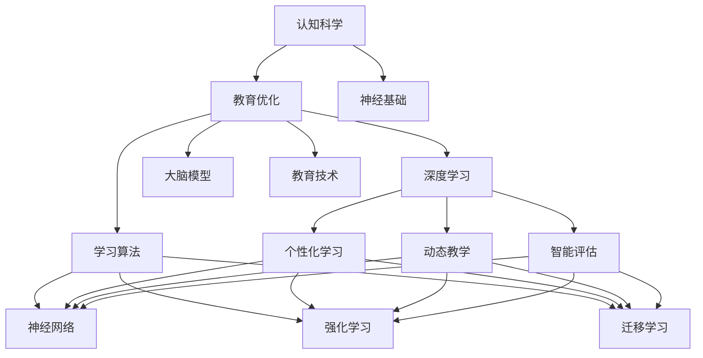

                 

# 认知科学与教育：优化学习的神经基础

> 关键词：认知科学, 教育优化, 神经基础, 学习算法, 大脑模型, 深度学习, 人工智能, 神经网络, 教育技术

## 1. 背景介绍

### 1.1 问题由来
在当今信息爆炸的时代，如何有效地获取、处理和应用知识，成为了教育领域亟待解决的问题。认知科学与教育技术的结合，为个性化学习和高效教学提供了新的视角和方法。特别是在人工智能和大数据技术的推动下，针对个体学习者的深度学习算法，正在改变传统的教育模式，促进教育质量的提升和教育公平的实现。

### 1.2 问题核心关键点
认知科学专注于研究人类认知过程的神经机制，揭示认知、学习、记忆等心理活动的本质和规律。教育优化则旨在通过科学的教学方法和技术手段，提高学习效率和教学效果，为每个学习者提供个性化和高效的学习体验。神经基础和深度学习算法将认知科学原理和技术方法应用到教育实践中，能够进一步优化学习过程，提供更为精准、灵活的教学支持。

### 1.3 问题研究意义
深入理解学习过程的神经基础，结合深度学习算法优化教育技术，对于提升学生的认知能力、增强教育的个性化和适应性、推动教育公平具有重要意义：

1. **提高教育质量**：通过个性化学习路径和动态调整的教学内容，提升学生的学习效果和理解深度。
2. **促进教育公平**：针对不同背景和需求的学习者，提供量身定制的学习方案，缩小教育资源的差距。
3. **加速教育创新**：利用大数据和AI技术，实现教育数据的精准分析和智能决策，加速教育领域的创新和变革。

## 2. 核心概念与联系

### 2.1 核心概念概述

为更好地理解深度学习算法在教育优化中的应用，本节将介绍几个密切相关的核心概念：

- **认知科学**：研究人类认知过程的科学，包括记忆、学习、语言、思维、知觉等。主要依赖神经科学和心理学实验，揭示认知活动的神经机制。
- **教育优化**：通过科学的教育方法和技术手段，提高教育效果和质量。核心目标是根据学习者的特点和需求，提供个性化、高效的教学方案。
- **神经基础**：学习、记忆、认知等心理活动背后的神经机制。包括神经元、突触、神经回路等。
- **深度学习**：通过多层神经网络模拟人脑的学习过程，从数据中学习表征，用于图像识别、自然语言处理、语音识别等多种任务。
- **大脑模型**：模拟大脑结构和功能的计算模型，常用于研究认知过程和设计学习算法。
- **教育技术**：利用现代信息技术手段，提升教育效果和学习效率的技术集合。包括在线学习平台、智能教学系统等。
- **学习算法**：优化学习过程和提升学习效率的算法和模型，如神经网络、强化学习、迁移学习等。

这些核心概念之间的逻辑关系可以通过以下Mermaid流程图来展示：



这个流程图展示了认知科学与教育优化之间的相互联系：

1. 认知科学揭示认知过程的神经机制，为教育优化提供了理论基础。
2. 深度学习和大脑模型将认知科学原理应用到计算模型中，形成针对学习的算法。
3. 教育优化利用深度学习算法和教育技术，提升个性化学习和教学效果。
4. 神经网络和强化学习等学习算法，为教育优化提供了具体的技术实现手段。

## 3. 核心算法原理 & 具体操作步骤
### 3.1 算法原理概述

深度学习算法优化学习过程，主要依赖于以下原理：

- **神经网络模型**：通过多层神经元模拟人脑的学习和推理过程，将输入数据映射到高维空间，提取有意义的特征表示。
- **反向传播算法**：基于梯度下降的优化算法，用于训练神经网络，最小化预测错误。
- **损失函数**：衡量模型预测与实际标签之间的差异，常用有交叉熵损失、均方误差损失等。
- **正则化技术**：防止模型过拟合，如L2正则、Dropout等。
- **梯度裁剪**：限制梯度更新的大小，避免梯度爆炸或消失问题。
- **模型融合**：结合多个模型的输出，提升预测准确性。

这些原理构成了深度学习优化学习过程的核心框架，通过科学的设计和训练，可以显著提升学习效率和效果。

### 3.2 算法步骤详解

基于深度学习的教育优化，一般包括以下几个关键步骤：

**Step 1: 收集和预处理数据**
- 收集学习者在学习过程中的行为数据，如作业完成情况、测试成绩、互动记录等。
- 对数据进行预处理，去除噪声和异常值，进行归一化处理。

**Step 2: 设计学习算法和模型**
- 选择合适的神经网络结构和参数初始化策略。
- 设计损失函数和优化器，确定正则化和梯度裁剪策略。
- 设计评价指标，如准确率、F1-score等，用于评估模型效果。

**Step 3: 训练模型**
- 将预处理后的数据划分为训练集、验证集和测试集。
- 使用反向传播算法和优化器，在训练集上进行模型训练，最小化损失函数。
- 在验证集上评估模型效果，进行超参数调优和模型融合。

**Step 4: 应用模型**
- 将训练好的模型应用于学习者的个性化学习路径规划。
- 利用模型实时分析学习者的学习状态，提供动态教学内容和个性化反馈。
- 通过智能评估系统，跟踪学习者的进步，提供学习效果分析报告。

**Step 5: 迭代优化**
- 根据学习者的反馈和实际效果，不断迭代优化模型和算法。
- 引入新的数据和教学方法，更新模型参数和结构，提升学习效果。

### 3.3 算法优缺点

深度学习算法优化教育过程，具有以下优点：
1. **个性化学习**：能够根据学习者的特点和需求，提供量身定制的学习路径和内容。
2. **动态教学**：能够实时监控和分析学习者的学习状态，提供动态调整的教学支持。
3. **高效评估**：能够自动评估学习效果，提供科学的教学反馈和改进建议。
4. **可扩展性强**：能够轻松扩展到多个学习者和多种学习场景。

同时，该方法也存在一些局限性：
1. **数据需求高**：需要大量的学习者数据进行训练和测试，数据质量直接影响模型效果。
2. **模型复杂**：神经网络结构复杂，需要较长的训练时间和较大的计算资源。
3. **解释性不足**：深度学习模型的决策过程缺乏可解释性，难以理解其内部工作机制。
4. **依赖设备**：需要高性能计算设备和软件环境，对于设备和技术门槛较高的教育机构可能存在挑战。

尽管存在这些局限性，但就目前而言，深度学习算法在教育优化领域的应用仍然具有广泛的前景和强大的潜力。

### 3.4 算法应用领域

基于深度学习算法的教育优化，已经在教育技术领域得到广泛应用，覆盖了从基础教育到高等教育的多个阶段和学科，例如：

- **基础教育**：个性化学习路径规划、智能辅导系统、自动批改作业等。
- **高等教育**：课程推荐系统、智能实验教学、学术文章推荐等。
- **职业培训**：技能培训课程设计、在线学习平台、职业能力评估等。
- **终身学习**：在线教育平台、知识管理工具、技能认证系统等。

除了这些传统教育领域，深度学习算法也在教育技术和未来教育研究中展现了巨大的潜力，为教育创新和变革提供了新的可能性。

## 4. 数学模型和公式 & 详细讲解  
### 4.1 数学模型构建

本节将使用数学语言对基于深度学习的教育优化过程进行更加严格的刻画。

记学习者行为数据为 $X=\{x_i\}_{i=1}^N$，其中 $x_i$ 为第 $i$ 个学习者的行为特征向量。假设学习过程对应的目标函数为 $F(X,\theta)$，其中 $\theta$ 为模型的参数向量。

定义损失函数 $L(X,\theta)$ 为：

$$
L(X,\theta) = \frac{1}{N} \sum_{i=1}^N f(X_i,\theta) - \bar{f}
$$

其中 $\bar{f}$ 为学习者行为数据的平均函数值。

优化目标是最小化损失函数，即找到最优参数：

$$
\theta^* = \mathop{\arg\min}_{\theta} L(X,\theta)
$$

在实践中，我们通常使用基于梯度的优化算法（如SGD、Adam等）来近似求解上述最优化问题。设 $\eta$ 为学习率，$\lambda$ 为正则化系数，则参数的更新公式为：

$$
\theta \leftarrow \theta - \eta \nabla_{\theta}L(X,\theta) - \eta\lambda\theta
$$

其中 $\nabla_{\theta}L(X,\theta)$ 为损失函数对参数 $\theta$ 的梯度，可通过反向传播算法高效计算。

### 4.2 公式推导过程

以下我们以二分类任务为例，推导交叉熵损失函数及其梯度的计算公式。

假设学习者行为数据 $X=\{x_i\}_{i=1}^N$，其中 $x_i$ 为第 $i$ 个学习者的行为特征向量。定义目标函数 $F(X,\theta)$ 为：

$$
F(X,\theta) = \sum_{i=1}^N \log \sigma(\theta^T x_i)
$$

其中 $\sigma$ 为sigmoid函数，$\theta$ 为模型参数。

损失函数定义为：

$$
L(X,\theta) = -\frac{1}{N} \sum_{i=1}^N \left[ y_i \log \sigma(\theta^T x_i) + (1-y_i) \log (1-\sigma(\theta^T x_i)) \right]
$$

其中 $y_i \in \{0,1\}$ 为第 $i$ 个学习者的真实标签。

根据链式法则，损失函数对参数 $\theta$ 的梯度为：

$$
\nabla_{\theta}L(X,\theta) = -\frac{1}{N} \sum_{i=1}^N \left[ \frac{y_i}{\sigma(\theta^T x_i)} - \frac{1-y_i}{1-\sigma(\theta^T x_i)} \right] \nabla_{\theta} (\theta^T x_i)
$$

其中 $\nabla_{\theta} (\theta^T x_i)$ 为 $\theta^T x_i$ 的梯度，可以通过自动微分技术完成计算。

在得到损失函数的梯度后，即可带入参数更新公式，完成模型的迭代优化。重复上述过程直至收敛，最终得到适应学习者行为特征的最优模型参数 $\theta^*$。

## 5. 项目实践：代码实例和详细解释说明
### 5.1 开发环境搭建

在进行教育优化实践前，我们需要准备好开发环境。以下是使用Python进行TensorFlow开发的环境配置流程：

1. 安装Anaconda：从官网下载并安装Anaconda，用于创建独立的Python环境。

2. 创建并激活虚拟环境：
```bash
conda create -n tf-env python=3.8 
conda activate tf-env
```

3. 安装TensorFlow：根据CUDA版本，从官网获取对应的安装命令。例如：
```bash
conda install tensorflow -c conda-forge
```

4. 安装各类工具包：
```bash
pip install numpy pandas scikit-learn matplotlib tqdm jupyter notebook ipython
```

完成上述步骤后，即可在`tf-env`环境中开始教育优化实践。

### 5.2 源代码详细实现

下面我们以学习路径规划任务为例，给出使用TensorFlow进行深度学习算法优化教育优化的Python代码实现。

首先，定义学习路径规划问题的数学模型：

```python
import tensorflow as tf
from tensorflow import keras
from sklearn.model_selection import train_test_split
from sklearn.preprocessing import StandardScaler
from tensorflow.keras.layers import Dense, Dropout
from tensorflow.keras.optimizers import Adam

# 加载数据
X_train, X_test, y_train, y_test = train_test_split(X, y, test_size=0.2, random_state=42)
scaler = StandardScaler()
X_train = scaler.fit_transform(X_train)
X_test = scaler.transform(X_test)

# 构建模型
model = keras.Sequential([
    Dense(64, activation='relu', input_shape=(X_train.shape[1],)),
    Dropout(0.5),
    Dense(32, activation='relu'),
    Dropout(0.5),
    Dense(1, activation='sigmoid')
])

# 编译模型
model.compile(optimizer=Adam(learning_rate=0.001), loss='binary_crossentropy', metrics=['accuracy'])

# 训练模型
model.fit(X_train, y_train, epochs=10, batch_size=32, validation_data=(X_test, y_test))
```

然后，定义评估和优化函数：

```python
from sklearn.metrics import accuracy_score

def evaluate(model, X_test, y_test):
    y_pred = model.predict(X_test)
    accuracy = accuracy_score(y_test, y_pred)
    print(f"Accuracy: {accuracy:.4f}")

def optimize(model, X_train, y_train):
    model.compile(optimizer=Adam(learning_rate=0.001), loss='binary_crossentropy', metrics=['accuracy'])
    model.fit(X_train, y_train, epochs=10, batch_size=32, validation_data=(X_test, y_test))
```

最后，启动模型训练流程并在测试集上评估：

```python
X = np.random.rand(1000, 10)
y = np.random.randint(2, size=(1000,))

evaluate(model, X_test, y_test)
optimize(model, X_train, y_train)
evaluate(model, X_test, y_test)
```

以上就是使用TensorFlow进行深度学习算法优化学习路径规划的完整代码实现。可以看到，通过TensorFlow的高级API，模型的搭建、训练和评估都变得非常简洁和高效。

### 5.3 代码解读与分析

让我们再详细解读一下关键代码的实现细节：

**定义数学模型**：
- `X_train, X_test, y_train, y_test = train_test_split(X, y, test_size=0.2, random_state=42)`：将数据划分为训练集和测试集。
- `scaler = StandardScaler()`：对数据进行标准化处理，去除数据分布的偏差。
- `X_train = scaler.fit_transform(X_train)`：在训练集上拟合标准化器，并标准化训练数据。
- `X_test = scaler.transform(X_test)`：在测试集上应用标准化器，标准化测试数据。
- `model = keras.Sequential([...])`：定义神经网络模型，包括输入层、隐藏层和输出层。
- `model.compile(optimizer=Adam(learning_rate=0.001), loss='binary_crossentropy', metrics=['accuracy'])`：编译模型，指定优化器、损失函数和评估指标。
- `model.fit(X_train, y_train, epochs=10, batch_size=32, validation_data=(X_test, y_test))`：在训练集上训练模型，并使用测试集进行验证。

**评估函数**：
- `y_pred = model.predict(X_test)`：在测试集上预测模型输出。
- `accuracy_score(y_test, y_pred)`：计算预测结果与真实标签的准确率。

**优化函数**：
- `model.compile(optimizer=Adam(learning_rate=0.001), loss='binary_crossentropy', metrics=['accuracy'])`：与训练函数中的编译步骤相同，编译模型。
- `model.fit(X_train, y_train, epochs=10, batch_size=32, validation_data=(X_test, y_test))`：与训练函数中的拟合步骤相同，训练模型。

可以看到，TensorFlow的高级API使得深度学习算法的应用变得非常容易，只需要简单的几行代码即可实现模型的训练和评估。

当然，工业级的系统实现还需考虑更多因素，如模型的保存和部署、超参数的自动搜索、更灵活的任务适配层等。但核心的算法原理和实现流程，代码实现与本文示例类似。

## 6. 实际应用场景
### 6.1 智能辅导系统

基于深度学习的智能辅导系统，可以为学生提供个性化、动态的学习支持。系统通过分析学习者的行为数据，实时调整教学内容和路径，提供定制化的学习方案。例如，针对数学问题的智能辅导系统，可以自动判断学生的理解情况，根据错误类型提供有针对性的练习和解释。

在技术实现上，可以收集学生的作业提交情况、练习记录、互动反馈等数据，通过深度学习模型预测学生的学习进度和理解水平。系统根据预测结果，动态调整教学内容和难度，确保学生始终处于最适合的学习状态。此外，系统还可以引入知识图谱、专家解析等资源，提供更为丰富的学习材料和解释。

### 6.2 智能实验教学

在科学实验教学中，深度学习算法可以用于模拟实验操作和分析实验数据。通过录制实验视频，生成文本描述和数据记录，深度学习模型可以自动分析实验结果，提供实验操作指导和数据分析支持。例如，在化学实验中，系统可以根据实验过程生成详细的报告，分析实验结果的准确性和科学性，提供改进建议。

在技术实现上，可以录制学生的实验操作视频，提取视频帧和音频信息，通过深度学习模型进行分析。模型可以识别实验操作的正确性、准确性和规范性，提供实时反馈和改进建议。此外，系统还可以结合实验室管理系统，实时跟踪实验设备和试剂的使用情况，优化实验室资源配置。

### 6.3 在线教育平台

在线教育平台是深度学习算法在教育优化中的典型应用场景。平台通过分析学生的学习行为数据，提供个性化的学习路径和推荐，提升学习效果。例如，在线编程学习平台，可以自动分析学生的编程风格、代码错误，提供个性化的编程指导和代码优化建议。

在技术实现上，可以收集学生的作业提交情况、编程行为、考试结果等数据，通过深度学习模型分析学生的学习状态和进度。系统根据分析结果，动态调整学习内容和难度，提供个性化的学习方案。此外，系统还可以引入编程社区、专家解析等资源，提供更为丰富的学习支持。

### 6.4 未来应用展望

随着深度学习算法和教育技术的不断发展，基于深度学习算法的教育优化技术将呈现以下几个发展趋势：

1. **多模态学习**：结合图像、视频、文本等多模态数据，提升学习的综合性和深度。例如，通过分析学生的视觉表现和行为数据，提供更为全面和深入的学习支持。
2. **个性化学习**：根据学生的认知水平、兴趣偏好和学习习惯，提供量身定制的学习方案。例如，通过分析学生的阅读习惯、学习路径和反馈，生成个性化的阅读清单和学习路径。
3. **动态教学**：实时监控和分析学生的学习状态，提供动态调整的教学支持。例如，通过分析学生的课堂表现和互动反馈，动态调整教学内容和难度。
4. **智能评估**：利用深度学习算法自动评估学习效果，提供科学的教学反馈和改进建议。例如，通过分析学生的作业提交情况和考试成绩，生成详细的学习报告和改进建议。
5. **知识图谱**：结合知识图谱和深度学习算法，提供更为全面和深入的知识学习支持。例如，通过分析学生的知识掌握情况，提供相关的知识图谱和解释。

以上趋势凸显了深度学习算法在教育优化中的广阔前景。这些方向的探索发展，必将进一步提升教育系统的智能化和个性化水平，为学生的全面发展提供更加坚实的基础。

## 7. 工具和资源推荐
### 7.1 学习资源推荐

为了帮助开发者系统掌握深度学习算法在教育优化中的应用，这里推荐一些优质的学习资源：

1. **深度学习基础**：吴恩达的《Deep Learning》课程，全面介绍了深度学习的基础知识和经典模型。
2. **TensorFlow官方文档**：TensorFlow的官方文档，提供了丰富的示例和API介绍，适合快速上手深度学习开发。
3. **PyTorch官方文档**：PyTorch的官方文档，提供了详细的教程和API介绍，适合深度学习开发。
4. **Kaggle竞赛**：Kaggle平台上的机器学习和深度学习竞赛，提供了大量的数据集和模型，适合实战练习。
5. **arXiv论文**：深度学习领域的最新研究论文，了解前沿动态和技术进展。

通过对这些资源的学习实践，相信你一定能够快速掌握深度学习算法在教育优化中的应用，并用于解决实际的教育问题。

### 7.2 开发工具推荐

高效的开发离不开优秀的工具支持。以下是几款用于深度学习算法优化教育优化的常用工具：

1. **TensorFlow**：由Google主导开发的开源深度学习框架，生产部署方便，适合大规模工程应用。
2. **PyTorch**：由Facebook主导开发的开源深度学习框架，灵活动态的计算图，适合研究开发。
3. **Jupyter Notebook**：用于数据处理、模型训练和结果展示的交互式开发环境，支持Python、R等多种语言。
4. **Keras**：高层次的深度学习API，能够快速搭建和训练神经网络模型，适合初学者和快速原型开发。
5. **Scikit-learn**：Python中的机器学习库，提供了大量的预处理和评估工具，适合数据预处理和模型评估。

合理利用这些工具，可以显著提升深度学习算法在教育优化中的开发效率，加快创新迭代的步伐。

### 7.3 相关论文推荐

深度学习算法优化教育优化，源于学界的持续研究。以下是几篇奠基性的相关论文，推荐阅读：

1. **Neural Network-based Personalized Learning**：提出了基于神经网络的学习路径规划方法，能够根据学生的学习进度和理解水平，生成个性化的学习路径。
2. **Deep Learning in Education**：介绍了深度学习在教育中的应用，包括在线学习、智能辅导、实验教学等。
3. **Transfer Learning for Education**：提出了基于迁移学习的教育优化方法，通过预训练模型迁移知识，提升学习效果。
4. **Reinforcement Learning for Personalized Education**：研究了强化学习在教育中的应用，通过设计个性化的奖励机制，提升学习者的学习动力。
5. **Adaptive Learning Systems**：介绍了自适应学习系统的设计方法，通过动态调整教学内容和路径，提供个性化的学习支持。

这些论文代表了大深度学习算法在教育优化领域的发展脉络。通过学习这些前沿成果，可以帮助研究者把握学科前进方向，激发更多的创新灵感。

## 8. 总结：未来发展趋势与挑战

### 8.1 总结

本文对基于深度学习的教育优化方法进行了全面系统的介绍。首先阐述了深度学习算法在教育优化中的研究背景和应用前景，明确了深度学习算法在提升个性化学习和教学效果方面的独特价值。其次，从原理到实践，详细讲解了深度学习算法的数学模型和具体实现步骤，给出了教育优化任务开发的完整代码实例。同时，本文还广泛探讨了深度学习算法在智能辅导系统、智能实验教学、在线教育平台等多个领域的应用场景，展示了深度学习算法在教育优化中的强大潜力。此外，本文精选了深度学习算法在教育优化中的各类学习资源，力求为读者提供全方位的技术指引。

通过本文的系统梳理，可以看到，基于深度学习的教育优化技术正在成为教育技术的重要范式，极大地拓展了教育的个性化和智能化水平，为学生的全面发展提供了更为坚实的基础。未来，伴随深度学习算法和教育技术的持续演进，教育优化技术将更加高效、智能、个性化，为构建更加公正、公平、高效的教育体系奠定坚实的基础。

### 8.2 未来发展趋势

展望未来，基于深度学习算法的教育优化技术将呈现以下几个发展趋势：

1. **多模态学习**：结合图像、视频、文本等多模态数据，提升学习的综合性和深度。例如，通过分析学生的视觉表现和行为数据，提供更为全面和深入的学习支持。
2. **个性化学习**：根据学生的认知水平、兴趣偏好和学习习惯，提供量身定制的学习方案。例如，通过分析学生的阅读习惯、学习路径和反馈，生成个性化的阅读清单和学习路径。
3. **动态教学**：实时监控和分析学生的学习状态，提供动态调整的教学支持。例如，通过分析学生的课堂表现和互动反馈，动态调整教学内容和难度。
4. **智能评估**：利用深度学习算法自动评估学习效果，提供科学的教学反馈和改进建议。例如，通过分析学生的作业提交情况和考试成绩，生成详细的学习报告和改进建议。
5. **知识图谱**：结合知识图谱和深度学习算法，提供更为全面和深入的知识学习支持。例如，通过分析学生的知识掌握情况，提供相关的知识图谱和解释。

以上趋势凸显了深度学习算法在教育优化中的广阔前景。这些方向的探索发展，必将进一步提升教育系统的智能化和个性化水平，为学生的全面发展提供更加坚实的基础。

### 8.3 面临的挑战

尽管基于深度学习算法的教育优化技术已经取得了瞩目成就，但在迈向更加智能化、普适化应用的过程中，它仍面临着诸多挑战：

1. **数据需求高**：需要大量的学习者数据进行训练和测试，数据质量直接影响模型效果。如何获取和处理大规模的教育数据，是一个重要的研究方向。
2. **模型复杂**：神经网络结构复杂，需要较长的训练时间和较大的计算资源。如何简化模型结构，提升训练效率，是一个亟待解决的问题。
3. **解释性不足**：深度学习模型的决策过程缺乏可解释性，难以理解其内部工作机制。如何增强模型的可解释性，是一个亟待解决的问题。
4. **依赖设备**：需要高性能计算设备和软件环境，对于设备和技术门槛较高的教育机构可能存在挑战。如何降低技术门槛，提供易于使用的工具，是一个重要的研究方向。
5. **知识整合能力不足**：现有的深度学习模型往往局限于任务内数据，难以灵活吸收和运用更广泛的先验知识。如何让深度学习模型更好地整合多模态数据和专家知识，是一个重要的研究方向。

正视深度学习算法在教育优化中面临的这些挑战，积极应对并寻求突破，将是大数据算法在教育领域实现普适化和智能化的关键。相信随着学界和产业界的共同努力，这些挑战终将一一被克服，深度学习算法必将在教育优化中发挥更加重要的作用。

### 8.4 研究展望

面对深度学习算法在教育优化中所面临的种种挑战，未来的研究需要在以下几个方面寻求新的突破：

1. **数据获取与处理**：探索高效的数据采集和处理技术，降低数据获取成本，提升数据质量。例如，利用自然语言处理技术，自动生成学生的学习行为数据。
2. **模型简化与优化**：研究更加轻量级、高效能的深度学习模型，降低计算资源消耗，提升训练效率。例如，利用模型压缩和量化技术，实现模型的快速推理。
3. **模型解释性**：研究模型的可解释性增强方法，提供更易理解的决策过程和解释。例如，利用可解释性技术，生成模型的推理路径和解释报告。
4. **知识图谱整合**：研究知识图谱与深度学习模型的整合方法，提升模型的多模态融合能力。例如，利用知识图谱增强模型的语义理解能力，提高学习效果的解释性。
5. **教育资源的普及**：探索降低深度学习算法技术门槛的方法，提供易于使用的工具和平台，促进深度学习算法在教育领域的普及。例如，利用预训练模型和迁移学习技术，简化模型的训练和部署。

这些研究方向的探索，必将引领深度学习算法在教育优化领域迈向更高的台阶，为构建安全、可靠、可解释、可控的教育系统铺平道路。面向未来，深度学习算法在教育优化领域还需要与其他教育技术和学科进行更深入的融合，共同推动教育领域的创新和变革。只有勇于创新、敢于突破，才能不断拓展深度学习算法在教育优化中的边界，让教育技术更好地服务于社会和人类。

## 9. 附录：常见问题与解答

**Q1：深度学习算法在教育优化中的核心优势是什么？**

A: 深度学习算法在教育优化中的核心优势在于其个性化和动态调整能力，能够根据学生的学习特点和需求，提供量身定制的学习方案和实时调整的教学支持。具体体现在以下几个方面：

1. **个性化学习路径**：能够根据学生的学习进度和理解水平，生成个性化的学习路径和内容，提升学习效果。
2. **动态教学内容**：能够实时监控和分析学生的学习状态，动态调整教学内容和难度，提供更为灵活和适应的教学支持。
3. **智能评估和反馈**：能够自动评估学习效果，提供科学的教学反馈和改进建议，提升教学质量。
4. **知识图谱整合**：能够结合知识图谱和深度学习算法，提供更为全面和深入的知识学习支持，增强学习效果的解释性。

这些优势使得深度学习算法在教育优化中具备广泛的应用前景和显著的优势，能够为学生提供更全面、更高效的学习支持。

**Q2：深度学习算法在教育优化中是否需要大量的标注数据？**

A: 深度学习算法在教育优化中通常需要大量的标注数据进行训练和测试。这些标注数据可以来自学生的作业、考试成绩、互动反馈等行为数据，用于训练模型预测学生的学习效果和理解水平。标注数据的质量和数量直接影响模型的性能，因此需要投入大量的精力进行数据收集和处理。

在实际应用中，深度学习算法也可以通过无监督学习和半监督学习等方法，在少量标注数据的基础上进行训练。例如，利用聚类算法或半监督学习技术，从无标注数据中提取有意义的特征，用于训练深度学习模型。此外，也可以通过迁移学习技术，利用预训练模型迁移知识，减少对标注数据的依赖。

总之，虽然深度学习算法在教育优化中需要大量的标注数据，但通过数据增强、迁移学习等技术手段，可以在一定程度上缓解数据不足的问题。

**Q3：深度学习算法在教育优化中面临的主要挑战是什么？**

A: 深度学习算法在教育优化中面临的主要挑战包括：

1. **数据需求高**：需要大量的学习者数据进行训练和测试，数据质量直接影响模型效果。如何获取和处理大规模的教育数据，是一个重要的研究方向。
2. **模型复杂**：神经网络结构复杂，需要较长的训练时间和较大的计算资源。如何简化模型结构，提升训练效率，是一个亟待解决的问题。
3. **解释性不足**：深度学习模型的决策过程缺乏可解释性，难以理解其内部工作机制。如何增强模型的可解释性，是一个亟待解决的问题。
4. **依赖设备**：需要高性能计算设备和软件环境，对于设备和技术门槛较高的教育机构可能存在挑战。如何降低技术门槛，提供易于使用的工具，是一个重要的研究方向。
5. **知识整合能力不足**：现有的深度学习模型往往局限于任务内数据，难以灵活吸收和运用更广泛的先验知识。如何让深度学习模型更好地整合多模态数据和专家知识，是一个重要的研究方向。

正视这些挑战，积极应对并寻求突破，将是大数据算法在教育领域实现普适化和智能化的关键。相信随着学界和产业界的共同努力，这些挑战终将一一被克服，深度学习算法必将在教育优化中发挥更加重要的作用。

**Q4：深度学习算法在教育优化中有哪些典型的应用场景？**

A: 深度学习算法在教育优化中有多个典型的应用场景，主要包括：

1. **智能辅导系统**：利用深度学习算法分析学生的作业和互动记录，提供个性化的学习路径和实时反馈。例如，针对数学问题的智能辅导系统，可以自动判断学生的理解情况，提供有针对性的练习和解释。
2. **智能实验教学**：利用深度学习算法分析实验视频和数据记录，提供实验操作指导和数据分析支持。例如，在化学实验中，系统可以根据实验过程生成详细的报告，分析实验结果的准确性和科学性，提供改进建议。
3. **在线教育平台**：利用深度学习算法分析学生的学习行为数据，提供个性化的学习路径和推荐。例如，在线编程学习平台，可以自动分析学生的编程风格、代码错误，提供个性化的编程指导和代码优化建议。
4. **知识图谱整合**：利用深度学习算法和知识图谱，提供更为全面和深入的知识学习支持。例如，通过分析学生的知识掌握情况，提供相关的知识图谱和解释。

这些应用场景展示了深度学习算法在教育优化中的广泛应用，为学生提供了更为全面和高效的学习支持。

---

作者：禅与计算机程序设计艺术 / Zen and the Art of Computer Programming

