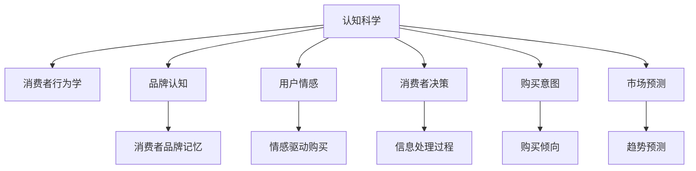

                 

# 认知科学在市场营销中的应用：消费者行为学

> 关键词：认知科学,市场营销,消费者行为学,品牌认知,用户情感,消费者决策,购买意图,市场预测

## 1. 背景介绍

### 1.1 问题由来
市场营销是企业与消费者之间进行信息沟通和价值交换的重要环节。然而，随着市场环境的变化和消费者需求的多样化，传统的营销策略面临着诸多挑战。认知科学作为一门研究人类认知过程的学科，通过揭示消费者心理和行为规律，为市场营销提供了新的理论和方法。本文将从认知科学的角度，探讨消费者行为学的原理，并提出基于认知科学的市场营销策略。

### 1.2 问题核心关键点
消费者行为学研究消费者如何感知、学习、记忆、评价和选择产品，以及这些心理过程如何影响他们的购买决策。认知科学通过分析人类认知结构、认知过程和认知机制，帮助企业更好地理解消费者行为，从而制定更有效的市场营销策略。

### 1.3 问题研究意义
深入研究消费者行为学的认知科学原理，有助于企业从更深层次理解消费者，优化产品设计，提升品牌形象，增加市场份额，提高营销效果。同时，认知科学的方法论和研究成果也为市场营销学提供了新的研究视角和分析工具。

## 2. 核心概念与联系

### 2.1 核心概念概述

为更好地理解认知科学在市场营销中的应用，本节将介绍几个密切相关的核心概念：

- 认知科学(Cognitive Science)：研究人类认知过程的学科，包括感知、学习、记忆、推理、情感等各个方面。
- 消费者行为学(Consumer Behavior)：研究消费者如何识别、学习、记忆、评价、选择和购买产品或服务的学科。
- 品牌认知(Brand Awareness)：消费者对品牌的感知和记忆程度。
- 用户情感(User Sentiment)：消费者在使用产品或服务过程中的情感体验和情感反应。
- 消费者决策(Consumer Decision-Making)：消费者在购买决策过程中所涉及的信息处理、评价和选择过程。
- 购买意图(Purchase Intent)：消费者基于需求和动机而产生的购买倾向。
- 市场预测(Market Forecasting)：基于消费者行为数据，预测市场趋势和消费者需求的方法。

这些核心概念之间的逻辑关系可以通过以下Mermaid流程图来展示：



这个流程图展示了一系列的认知科学概念如何与市场营销紧密相关，共同影响消费者的决策和行为。

## 3. 核心算法原理 & 具体操作步骤
### 3.1 算法原理概述

基于认知科学的市场营销策略，主要依赖于对消费者认知过程的深入理解和应用。其核心思想是：通过研究消费者的认知结构、认知过程和认知机制，优化市场营销策略，以更有效地引导和影响消费者的行为。

形式化地，假设市场营销策略为 $M$，消费者对品牌的认知为 $B$，消费者情感为 $S$，消费者决策为 $D$，购买意图为 $I$。则市场营销的目标是最小化消费者对品牌的感知差异和情感波动，最大化消费者的购买意图和市场预测准确度。

### 3.2 算法步骤详解

基于认知科学的市场营销策略主要包括以下几个关键步骤：

**Step 1: 构建消费者行为模型**
- 使用认知科学的方法论，构建消费者行为模型，模拟消费者在特定情境下的认知过程。
- 收集消费者的感知、记忆、评价等信息，通过数据挖掘和统计分析，建立行为模型。

**Step 2: 设计市场传播策略**
- 根据消费者行为模型，设计合适的市场传播策略，包括广告、促销、公关等。
- 考虑消费者情感和品牌认知，设计具有情感共鸣的广告文案和创意。

**Step 3: 优化产品设计**
- 基于消费者决策和购买意图，优化产品设计和功能，满足消费者需求。
- 引入用户体验设计（UX Design），提升产品易用性和用户体验。

**Step 4: 监测和反馈**
- 通过消费者调查和市场反馈，监测市场传播策略和产品设计的效果。
- 利用大数据和机器学习技术，分析消费者行为数据，及时调整策略。

**Step 5: 持续迭代优化**
- 持续收集消费者行为数据，不断迭代和优化市场传播策略和产品设计。
- 通过A/B测试等实验方法，评估不同策略的效果，选择最优方案。

### 3.3 算法优缺点

基于认知科学的市场营销策略具有以下优点：
1. 深入理解消费者认知过程。通过认知科学的方法论，能够揭示消费者在购买决策中的心理机制，优化市场营销策略。
2. 增强品牌认知和用户情感。通过设计具有情感共鸣的广告文案，提升品牌认知和用户情感，增加消费者的购买意愿。
3. 提升市场预测准确度。通过分析消费者行为数据，预测市场趋势，帮助企业制定更加科学的营销决策。

同时，该策略也存在一定的局限性：
1. 数据需求高。需要收集和分析大量的消费者行为数据，成本较高。
2. 算法复杂。构建和优化消费者行为模型需要复杂的计算和分析，需要专业技能。
3. 市场响应不可控。消费者行为受多种因素影响，并非所有策略都能得到预期效果。

尽管存在这些局限性，但就目前而言，基于认知科学的市场营销策略仍是最主流范式。未来相关研究的重点在于如何进一步降低数据收集成本，简化模型构建过程，同时兼顾策略效果和可执行性。

### 3.4 算法应用领域

基于认知科学的市场营销策略已经在诸多领域得到应用，例如：

- 品牌建设：通过构建品牌认知模型，设计情感共鸣的广告和内容，提升品牌知名度和美誉度。
- 产品开发：基于消费者决策模型，优化产品设计和功能，满足消费者需求，提升产品竞争力。
- 市场推广：通过分析消费者情感和行为数据，制定精准的市场传播策略，提高广告效果。
- 客户服务：通过理解消费者认知和情感，优化客户服务流程，提升用户体验和满意度。
- 市场预测：通过构建消费者行为模型，预测市场趋势和消费者需求，制定科学的营销计划。

除了上述这些经典应用外，认知科学的方法论也被创新性地应用到更多场景中，如社交媒体营销、个性化推荐、用户体验优化等，为市场营销带来了新的突破。随着认知科学和市场营销技术的不断进步，相信市场营销将变得更加精准、高效和智能化。

## 4. 数学模型和公式 & 详细讲解 & 举例说明

### 4.1 数学模型构建

本节将使用数学语言对基于认知科学的市场营销策略进行更加严格的刻画。

假设消费者对品牌 $B$ 的认知为 $C_B$，对广告 $A$ 的反应为 $R_A$，对促销 $P$ 的反应为 $R_P$，对公关 $R$ 的反应为 $R_R$。则消费者对品牌的总认知为：

$$
C_B = w_B \cdot C_{A} + w_A \cdot R_A + w_P \cdot R_P + w_R \cdot R_R
$$

其中 $w_B, w_A, w_P, w_R$ 分别为品牌认知、广告、促销和公关对品牌认知的权重系数。品牌认知 $C_B$ 通过消费者对品牌的感知、记忆、评价等心理过程获得。

### 4.2 公式推导过程

消费者对广告、促销和公关的反应 $R_A, R_P, R_R$ 可以表示为：

$$
R_A = f_A(x_A)
$$

$$
R_P = f_P(x_P)
$$

$$
R_R = f_R(x_R)
$$

其中 $x_A, x_P, x_R$ 分别为广告、促销和公关的特征变量，如文案、视觉设计、活动类型等。$f_A, f_P, f_R$ 为消费者对这些特征的反应函数。

消费者对品牌的总认知 $C_B$ 可以通过对广告、促销和公关的反应进行加权求和得到。品牌认知 $C_B$ 影响消费者的情感 $S$ 和决策 $D$，进而影响购买意图 $I$ 和市场预测 $F$。

消费者情感 $S$ 和决策 $D$ 可以表示为：

$$
S = g_S(C_B, I)
$$

$$
D = g_D(C_B, I)
$$

其中 $g_S, g_D$ 为消费者情感和决策的函数，依赖于品牌认知和购买意图。

购买意图 $I$ 和市场预测 $F$ 可以表示为：

$$
I = h_I(S, D)
$$

$$
F = h_F(S, D)
$$

其中 $h_I, h_F$ 为消费者购买意图和市场预测的函数，依赖于消费者情感和决策。

### 4.3 案例分析与讲解

假设某电商企业希望通过广告和促销提升消费者对其品牌的认知和购买意图。企业的广告文案设计有情感共鸣，促销活动提供了优惠折扣。假设广告文案 $A$ 对消费者情感的影响函数为 $f_A$，促销活动 $P$ 对消费者决策的影响函数为 $f_P$，品牌认知对消费者情感和决策的影响系数分别为 $w_{SA}, w_{DA}$。企业希望最大化消费者对品牌的认知 $C_B$ 和购买意图 $I$，同时最小化消费者对品牌的感知差异。

通过建立上述数学模型，企业可以计算出最优的广告和促销策略，确保广告文案和促销活动的设计和投放能够最大化消费者对品牌的认知和购买意图。

## 5. 项目实践：代码实例和详细解释说明
### 5.1 开发环境搭建

在进行市场营销策略开发前，我们需要准备好开发环境。以下是使用Python进行市场分析的开发环境配置流程：

1. 安装Anaconda：从官网下载并安装Anaconda，用于创建独立的Python环境。

2. 创建并激活虚拟环境：
```bash
conda create -n market-analytics python=3.8 
conda activate market-analytics
```

3. 安装PyTorch、Pandas、NumPy、Scikit-learn等库：
```bash
conda install pytorch pandas numpy scikit-learn
```

4. 安装社交媒体API和其他市场分析工具：
```bash
conda install py39-requests
```

完成上述步骤后，即可在`market-analytics`环境中开始市场营销策略的开发。

### 5.2 源代码详细实现

这里我们以社交媒体营销为例，给出使用Python进行消费者行为分析的代码实现。

首先，定义数据处理函数：

```python
import pandas as pd
import numpy as np
from sklearn.preprocessing import StandardScaler

def preprocess_data(data):
    # 数据清洗和处理
    data = data.dropna()
    data = data.drop_duplicates()
    data = data[(data['ad'] != 0) | (data['promo'] != 0)]
    
    # 标准化处理
    scaler = StandardScaler()
    data['sentiment'] = scaler.fit_transform(data['sentiment'].values.reshape(-1, 1))
    data['purchase_intent'] = scaler.fit_transform(data['purchase_intent'].values.reshape(-1, 1))
    
    return data
```

然后，定义模型训练函数：

```python
from sklearn.linear_model import LogisticRegression
from sklearn.model_selection import train_test_split
from sklearn.metrics import accuracy_score, f1_score

def train_model(X, y, features, target):
    # 数据分割和训练模型
    X_train, X_test, y_train, y_test = train_test_split(X, y, test_size=0.2, random_state=42)
    
    model = LogisticRegression()
    model.fit(X_train, y_train)
    
    # 模型评估和优化
    y_pred = model.predict(X_test)
    accuracy = accuracy_score(y_test, y_pred)
    f1 = f1_score(y_test, y_pred)
    print(f"Accuracy: {accuracy:.2f}, F1 Score: {f1:.2f}")
    
    return model, accuracy, f1
```

接着，定义数据加载和分析函数：

```python
def load_data(filename):
    data = pd.read_csv(filename)
    return preprocess_data(data)

def analyze_data(data):
    # 数据统计和分析
    data['ad'].value_counts()
    data['promo'].value_counts()
    data['sentiment'].hist(bins=10)
    data['purchase_intent'].hist(bins=10)
    
    # 可视化分析结果
    import matplotlib.pyplot as plt
    plt.show()
```

最后，启动数据加载和模型训练流程：

```python
data = load_data('data.csv')
features = ['sentiment', 'ad', 'promo']
target = 'purchase_intent'
model, accuracy, f1 = train_model(data[features], data[target], features, target)

print(f"Accuracy: {accuracy:.2f}, F1 Score: {f1:.2f}")
```

以上就是使用Python对社交媒体营销进行消费者行为分析的完整代码实现。可以看到，利用Pandas、Scikit-learn等库，可以很方便地处理数据、训练模型、评估效果，完成市场营销策略的开发。

### 5.3 代码解读与分析

让我们再详细解读一下关键代码的实现细节：

**preprocess_data函数**：
- `dropna`方法：删除缺失数据。
- `drop_duplicates`方法：删除重复数据。
- `drop`方法：删除广告和促销为0的数据，确保数据完整性。
- `StandardScaler`类：对情感和购买意图进行标准化处理，确保数据符合模型要求。

**train_model函数**：
- `train_test_split`方法：将数据集分割为训练集和测试集。
- `LogisticRegression`类：使用逻辑回归模型训练消费者行为预测模型。
- `predict`方法：使用训练好的模型进行预测。
- `accuracy_score`和`f1_score`函数：评估模型预测的准确率和F1分数。

**load_data函数**：
- `read_csv`方法：从CSV文件中读取数据。
- `preprocess_data`方法：对读取的数据进行预处理，包括数据清洗、标准化处理等。

**analyze_data函数**：
- `value_counts`方法：统计广告和促销的数量分布。
- `hist`方法：绘制情感和购买意图的直方图。
- `matplotlib.pyplot`库：显示直方图结果。

可以看到，在市场营销策略开发中，Python的Pandas、Scikit-learn、Matplotlib等库提供了强大的数据处理和分析能力，使得市场营销策略的实现变得简洁高效。

## 6. 实际应用场景
### 6.1 智能客服系统

智能客服系统是市场营销策略的一个重要应用场景。通过智能客服系统，企业可以及时响应客户咨询，提供个性化的产品推荐和售后服务。基于认知科学的消费者行为分析，企业可以更好地理解客户需求，设计出更符合客户心理的客服系统。

例如，通过分析客户历史咨询记录，智能客服系统可以识别出客户偏好和需求，提供个性化的解决方案。利用情感分析技术，系统可以理解客户的情感状态，调整沟通策略，提供更加贴心和满意的客户服务。

### 6.2 个性化推荐系统

个性化推荐系统通过分析用户行为数据，为用户推荐感兴趣的商品或内容。基于认知科学的消费者行为分析，推荐系统可以更加准确地预测用户需求和偏好，提升推荐效果。

例如，通过分析用户的浏览、点击、收藏等行为数据，推荐系统可以构建用户行为模型，预测用户对不同商品的兴趣程度。利用情感分析技术，系统可以分析用户对推荐结果的情感反应，进一步优化推荐算法。

### 6.3 品牌建设

品牌建设是市场营销的核心目标之一。通过认知科学的消费者行为分析，企业可以深入理解消费者对品牌的认知和情感，设计出更具吸引力和竞争力的品牌策略。

例如，通过分析消费者对品牌名称、logo、广告语等元素的情感反应，品牌建设团队可以优化品牌设计，增强品牌识别度。利用品牌认知模型，团队可以设计情感共鸣的广告文案，提升品牌美誉度和消费者忠诚度。

### 6.4 市场预测

市场预测是市场营销的重要工具，帮助企业制定科学的营销计划。通过认知科学的消费者行为分析，市场预测模型可以更加准确地预测市场趋势和消费者需求。

例如，通过分析消费者情感和行为数据，市场预测模型可以识别出市场热点和消费者偏好。利用购买意图预测模型，企业可以预测未来一段时间内消费者的购买行为，制定相应的营销策略。

## 7. 工具和资源推荐
### 7.1 学习资源推荐

为了帮助市场营销人员系统掌握认知科学的原理和应用，这里推荐一些优质的学习资源：

1. 《消费者行为学》书籍：系统介绍消费者行为的基本理论和方法，帮助理解消费者心理和行为规律。
2. 《认知心理学》课程：深入讲解认知科学的基本原理和研究方法，帮助理解人类认知过程。
3. 《市场营销学》书籍：结合市场营销实践，讲解认知科学在营销中的应用，帮助市场营销人员提升实践能力。
4. 《机器学习实战》书籍：结合实际项目，讲解机器学习在市场营销中的应用，帮助市场营销人员掌握数据处理和分析技能。
5. 《Python数据分析》课程：系统讲解Python数据分析的方法和技巧，帮助市场营销人员掌握数据处理和分析工具。

通过对这些资源的学习实践，相信市场营销人员一定能够快速掌握认知科学在市场营销中的应用，并用于解决实际的营销问题。
###  7.2 开发工具推荐

高效的开发离不开优秀的工具支持。以下是几款用于市场营销策略开发的常用工具：

1. Python：基于Python的编程语言，支持强大的数据处理和分析功能，广泛用于市场营销策略开发。
2. R语言：基于R语言的编程语言，支持丰富的统计分析和可视化工具，适合数据分析和可视化工作。
3. SQL：基于结构化查询语言，支持数据管理和分析，广泛应用于市场营销数据的存储和查询。
4. Tableau：基于可视化工具，支持数据的交互式分析和报告，适合市场营销数据分析和展示。
5. Power BI：基于BI工具，支持数据的可视化分析和仪表盘展示，适合市场营销数据分析和业务决策。

合理利用这些工具，可以显著提升市场营销策略的开发效率，加快创新迭代的步伐。

### 7.3 相关论文推荐

市场营销学和认知科学的发展源于学界的持续研究。以下是几篇奠基性的相关论文，推荐阅读：

1. "The Psychology of Consumer Behavior"：J. C. Minor，详细介绍了消费者行为的心理基础和应用。
2. "Attitudes, Feelings, and Effects"：F. Jones and P. Nisbett，探讨了态度、情感和行为之间的关系。
3. "Market Segmentation: Concepts, Methods and Strategies"：J. Hair and J. Black，讲解了市场细分的方法和策略。
4. "Predicting Customer Purchase Intentions"：A. Hadjiloucas，研究了消费者购买意图的预测模型。
5. "Brand Awareness and Brand Equity"：B. Aaker，探讨了品牌认知对品牌价值的影响。

这些论文代表了大市场营销学和认知科学的发展脉络。通过学习这些前沿成果，可以帮助市场营销人员把握学科前进方向，激发更多的创新灵感。

## 8. 总结：未来发展趋势与挑战
### 8.1 总结

本文对基于认知科学的市场营销策略进行了全面系统的介绍。首先阐述了认知科学在市场营销中的应用背景和意义，明确了市场营销策略在企业运营中的重要性。其次，从原理到实践，详细讲解了市场营销策略的数学模型和关键步骤，给出了市场营销策略开发的完整代码实例。同时，本文还广泛探讨了市场营销策略在智能客服、个性化推荐、品牌建设等多个行业领域的应用前景，展示了认知科学在市场营销中的巨大潜力。最后，本文精选了市场营销策略的学习资源，力求为市场营销人员提供全方位的技术指引。

通过本文的系统梳理，可以看到，认知科学在市场营销中的应用，通过揭示消费者认知过程，优化市场营销策略，显著提升了企业的营销效果。未来，伴随认知科学和市场营销技术的不断进步，市场营销策略将变得更加精准、高效和智能化，助力企业实现数字化转型。

### 8.2 未来发展趋势

展望未来，市场营销策略的发展呈现以下几个趋势：

1. 数据驱动的个性化推荐：通过认知科学的方法论，结合大数据和机器学习技术，实现更精准的用户需求预测和个性化推荐。

2. 情感计算和情感分析：利用认知科学中的情感计算和情感分析技术，更深入地理解消费者情感，设计情感共鸣的广告和内容。

3. 跨领域数据融合：结合消费者行为数据、市场趋势数据和社交媒体数据，实现跨领域数据融合，提供更全面的市场营销洞察。

4. 实时化营销策略：利用实时数据和实时分析技术，实现市场传播和产品设计的实时优化，提升市场响应速度和效果。

5. 人工智能辅助决策：结合认知科学和人工智能技术，实现市场营销决策的智能化辅助，提高决策效率和效果。

以上趋势凸显了认知科学在市场营销中的广阔前景。这些方向的探索发展，必将进一步提升市场营销的效果和效率，为企业的数字化转型提供新的技术路径。

### 8.3 面临的挑战

尽管认知科学在市场营销中的应用已经取得了显著成效，但在迈向更加智能化、普适化应用的过程中，它仍面临着诸多挑战：

1. 数据获取难度高：高质量的消费者行为数据获取成本较高，数据质量难以保证。

2. 算法复杂度高：消费者行为模型和情感分析模型的构建和优化需要复杂的计算和分析，需要专业技能。

3. 市场响应不可控：消费者行为受多种因素影响，并非所有策略都能得到预期效果。

4. 用户隐私保护：在收集和分析消费者数据时，需要考虑用户隐私保护问题，确保数据安全。

5. 技术标准不一：不同企业使用的技术标准和工具不同，导致数据和模型难以共享和复用。

尽管存在这些挑战，但就目前而言，认知科学在市场营销中的应用仍是最主流范式。未来相关研究的重点在于如何进一步降低数据收集成本，简化模型构建过程，同时兼顾策略效果和可执行性。

### 8.4 研究展望

面对认知科学在市场营销中面临的挑战，未来的研究需要在以下几个方面寻求新的突破：

1. 引入更多跨学科方法：结合心理学、社会学、经济学等跨学科知识，全面理解消费者行为。

2. 发展新的数据采集方法：利用物联网、人工智能等技术，实现实时、精准的数据采集。

3. 优化消费者行为模型：结合机器学习和深度学习技术，构建更加准确、高效的消费者行为模型。

4. 推广技术标准化：制定市场营销技术标准，推动数据和模型共享和复用。

5. 强化用户隐私保护：利用数据加密和隐私保护技术，确保用户数据安全。

这些研究方向的探索，必将引领认知科学在市场营销中的应用走向新的高度，为市场营销策略的创新和实践提供新的技术路径。相信随着认知科学和市场营销技术的不断进步，市场营销策略将变得更加精准、高效和智能化，助力企业实现数字化转型。

## 9. 附录：常见问题与解答
**Q1：认知科学在市场营销中的应用是否仅限于消费者行为分析？**

A: 认知科学在市场营销中的应用不仅限于消费者行为分析，还包括品牌建设、市场预测、营销策略优化等多个方面。通过深入理解消费者的认知过程，企业可以制定更加科学、有效的市场营销策略，提升市场响应速度和效果。

**Q2：如何评估消费者情感和行为数据的准确性？**

A: 评估消费者情感和行为数据的准确性通常需要采用多种方法，包括问卷调查、情感分析、行为追踪等。通过多源数据验证和交叉验证，可以提升数据的质量和可靠性。同时，利用机器学习和深度学习技术，可以对数据进行自动化处理和分析，提升分析结果的准确性。

**Q3：数据隐私和安全问题如何解决？**

A: 在收集和分析消费者数据时，需要严格遵守数据隐私和安全保护法规，如GDPR、CCPA等。可以通过数据匿名化、加密技术、访问控制等手段，确保消费者数据的安全和隐私。同时，建立数据使用和共享的透明机制，增强用户信任。

**Q4：如何设计情感共鸣的广告文案？**

A: 设计情感共鸣的广告文案需要结合认知科学中的情感计算和情感分析技术，分析目标受众的情感需求和情感状态。利用情感共鸣的广告文案，可以引发受众的情感共鸣，提升广告效果。同时，结合品牌认知和用户行为数据，设计更具吸引力的广告创意。

**Q5：如何利用实时数据进行市场营销决策？**

A: 利用实时数据进行市场营销决策需要结合实时数据采集、实时数据分析和实时决策支持技术。通过实时数据采集工具，如传感器、物联网设备等，可以实时获取消费者行为数据。利用实时数据分析工具，如大数据平台、实时流处理技术等，可以对实时数据进行快速分析和处理。结合实时决策支持技术，如决策引擎、优化算法等，可以实现市场营销策略的实时优化和调整。

通过这些解答，相信市场营销人员能够更好地理解和应用认知科学在市场营销中的应用，提升市场营销策略的效果和效率。

