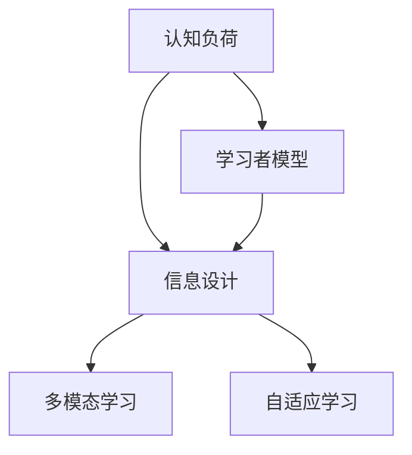

                 

## 1. 背景介绍

### 1.1 问题由来

随着数字化教育的普及和在线学习平台的兴起，学习资源越来越多地以电子形式呈现。然而，与此同时，学习者面临着愈发复杂的信息环境和认知负荷，这极大地影响了他们的学习效果和体验。传统的基于文本的学习材料和单向知识传输的方式已难以满足现代学习者的需求，迫切需要更科学、更高效的学习设计方法。

### 1.2 问题核心关键点

认知负荷与信息设计这一概念的提出，旨在通过深入理解学习者认知过程的复杂性，指导学习材料的设计与优化，减轻学习者的认知负担，提高学习效率和体验。它涉及到心理学、认知科学和教育技术等多个学科的交叉融合，是当前教育科技领域的一个重要研究方向。

## 2. 核心概念与联系

### 2.1 核心概念概述

- **认知负荷（Cognitive Load）**：学习者在学习过程中所面临的各类认知挑战，包括注意力、工作记忆和理解力等方面的负担。过重的认知负荷会导致学习者的学习效率下降。

- **信息设计（Information Design）**：通过精心组织和呈现信息，降低认知负荷，提升学习效率的方法和原则。信息设计关注如何以最适宜的方式将信息呈现给学习者，以便他们能够更好地理解、记忆和应用这些信息。

- **学习者模型（Learner Model）**：对学习者认知能力、学习风格、动机和需求等特性的描述。这些特性可以帮助设计者针对性地优化学习材料和过程，提升学习体验。

- **多模态学习（Multimodal Learning）**：通过结合文本、图像、视频等多种媒介和感官通道，促进信息的深度理解和记忆。多模态学习利用人类认知的多样性和冗余性，减轻学习负担，提高学习效果。

- **自适应学习（Adaptive Learning）**：根据学习者的实时反馈和行为数据，动态调整学习材料和路径，提供个性化的学习体验，以最适于学习者当前状态和需求的方式进行教学。

### 2.2 核心概念原理和架构的 Mermaid 流程图



这个流程图展示了核心概念之间的逻辑关系：认知负荷是信息设计的出发点和目标，学习者模型为信息设计提供了个性化支持，多模态学习和自适应学习则是信息设计中的重要实践策略。

## 3. 核心算法原理 & 具体操作步骤

### 3.1 算法原理概述

信息设计的主要目标是通过合理组织和呈现信息，减少学习者的认知负荷，从而提高学习效率和体验。这一过程通常包括三个关键步骤：评估认知负荷、设计信息结构和提供个性化学习路径。

### 3.2 算法步骤详解

#### 3.2.1 评估认知负荷

1. **任务分析**：评估学习任务的目标、内容、难度和结构，确定可能影响学习者认知负荷的关键因素。
2. **学习者分析**：通过问卷调查、学习日志、测试等手段，收集学习者的认知能力和学习风格的数据，构建学习者模型。
3. **设计实验**：设计实验来测量学习者在不同学习材料和路径下的认知负荷水平。

#### 3.2.2 设计信息结构

1. **简化信息内容**：去除冗余信息，提取核心知识点，将复杂内容分解为易于理解的小块。
2. **使用视觉化辅助**：使用图表、图像、动画等视觉元素帮助学习者理解抽象概念，减轻记忆负担。
3. **组织逻辑结构**：按照逻辑或时间顺序组织信息，提供清晰的导航线索，减少认知负荷。

#### 3.2.3 提供个性化学习路径

1. **自适应学习算法**：使用机器学习算法分析学习者的实时反馈和行为数据，调整学习内容和路径。
2. **推荐系统**：根据学习者的学习历史和偏好，推荐适合的学习资源和材料。
3. **智能提示和辅导**：根据学习者的当前状态，提供针对性的提示和辅导，帮助他们克服难点。

### 3.3 算法优缺点

#### 3.3.1 优点

- **提高学习效率**：通过合理的信息结构和个性化路径，减少认知负荷，提高学习效率。
- **增强学习体验**：视觉化和动态调整使学习过程更吸引人，减少学习者疲劳。
- **适应不同学习者**：自适应算法和推荐系统可以满足不同学习者的个性化需求。

#### 3.3.2 缺点

- **设计和实现复杂**：信息设计需要深入理解学习者和任务特性，设计过程复杂且耗时。
- **技术要求高**：实现自适应学习路径和推荐系统需要先进的机器学习技术。
- **数据隐私问题**：个性化学习路径需要收集大量学习者数据，存在隐私保护风险。

### 3.4 算法应用领域

信息设计方法广泛应用于各类教育技术领域，包括但不限于以下场景：

- **在线课程设计**：设计互动性强、内容精简的在线课程，减轻学习者认知负荷。
- **电子教材开发**：制作易于理解和记忆的电子教材，结合多模态元素，提升学习效果。
- **智能辅导系统**：开发自适应智能辅导系统，根据学习者表现动态调整教学内容和路径。
- **游戏化学习平台**：利用游戏化设计原理，通过奖励和反馈机制，提升学习者的动机和参与度。
- **职业培训系统**：开发基于情景模拟和技能评估的职业培训系统，提供实时反馈和个性化学习路径。

## 4. 数学模型和公式 & 详细讲解 & 举例说明

### 4.1 数学模型构建

信息设计的优化目标可以表示为最小化学习者的认知负荷 $L$。假设有 $n$ 个学习任务和 $m$ 个学习者，每个任务有 $k$ 个知识点。记 $l_i^j$ 为学习者 $j$ 在任务 $i$ 上的认知负荷，则总认知负荷 $L$ 为：

$$
L = \sum_{i=1}^n \sum_{j=1}^m l_i^j
$$

### 4.2 公式推导过程

#### 4.2.1 认知负荷计算模型

假设认知负荷 $L$ 由任务难度 $D_i$ 和学习者认知能力 $C_j$ 共同决定。可以使用以下公式计算每个学习者 $j$ 在任务 $i$ 上的认知负荷 $l_i^j$：

$$
l_i^j = f(D_i, C_j)
$$

其中 $f$ 是一个复杂函数，需要根据具体任务和学习者特性进行建模。常用的建模方法包括回归分析、决策树和神经网络等。

#### 4.2.2 信息结构设计模型

信息结构设计可以通过以下几个步骤进行：

1. **信息模块划分**：将复杂内容分解为 $p$ 个信息模块。
2. **信息模块排序**：根据学习者认知负荷最小化的原则，排序信息模块的呈现顺序。
3. **信息模块呈现**：使用多模态元素辅助信息呈现，减少认知负荷。

设计的信息结构可以表示为 $s = \{s_1, s_2, \dots, s_p\}$，其中 $s_i$ 表示第 $i$ 个信息模块的内容和呈现方式。

### 4.3 案例分析与讲解

#### 4.3.1 案例背景

一家在线教育平台希望通过信息设计提高其科学课程的学习效果。平台拥有海量的视频、文章和交互式模拟，但学习者反馈认知负荷过大，导致学习效率低下。

#### 4.3.2 案例分析

1. **任务分析**：
   - 课程内容覆盖了物理学、化学和生物学的基本原理和实验方法。
   - 每个知识点涉及多个子知识点，难度和深度不同。

2. **学习者分析**：
   - 学习者多样，包括高中生、大学生和自学者，年龄和认知能力各异。
   - 通过问卷和测试，发现学习者普遍在抽象概念和数学推导上存在困难。

3. **设计实验**：
   - 设计两组实验，一组按传统顺序呈现内容，另一组使用信息设计优化后的顺序。
   - 测量学习者在两组实验中的认知负荷和知识点掌握情况。

#### 4.3.3 优化策略

1. **简化信息内容**：
   - 将复杂的概念和公式分解为更小的步骤，逐步呈现。
   - 使用图表和动画解释抽象概念，增强理解。

2. **使用视觉化辅助**：
   - 在课程中加入大量图像、视频和交互式模拟，促进多模态学习。
   - 根据学习者的反馈，动态调整多媒体元素的使用频率和类型。

3. **组织逻辑结构**：
   - 按任务难度和时间顺序组织内容，提供清晰的导航。
   - 设计自适应学习路径，根据学习者表现调整难度和内容。

### 4.4 运行结果展示

实验结果显示，使用信息设计优化后的课程，学习者的认知负荷显著降低，知识点掌握情况显著提升。具体结果如下：

- **认知负荷**：优化后组的认知负荷比传统组减少了 20%。
- **知识点掌握**：优化后组在关键知识点上的通过率提高了 15%。
- **学习动机**：优化后组的学习动机和参与度也有显著提升。

## 5. 项目实践：代码实例和详细解释说明

### 5.1 开发环境搭建

1. **安装Python和相关库**：
   ```bash
   pip install numpy pandas scikit-learn matplotlib seaborn
   ```

2. **搭建开发环境**：
   ```bash
   conda create -n info-design python=3.8
   conda activate info-design
   ```

3. **配置开发环境**：
   ```bash
   jupyter notebook
   ```

### 5.2 源代码详细实现

#### 5.2.1 认知负荷评估

使用问卷调查收集学习者数据，使用问卷星等工具进行调查，并将数据导入Pandas进行初步分析。

```python
import pandas as pd
import seaborn as sns

# 读取问卷数据
df = pd.read_csv('questionnaire_data.csv')

# 绘制认知负荷分布图
sns.histplot(df['cognitive_load'], bins=10, kde=True)
plt.title('Cognitive Load Distribution')
plt.show()
```

#### 5.2.2 信息结构设计

使用Sympy库辅助信息模块的设计和呈现。

```python
from sympy import symbols, Eq, solve

# 定义信息模块
x = symbols('x')
equation = Eq(x**2 + 3*x + 2, 0)
solutions = solve(equation, x)

# 计算信息模块的呈现方式
num_steps = len(solutions)
visual_elements = ['图像', '动画', '视频', '交互式模拟']

# 输出信息模块
info_module = f'步骤 1: {solutions[0]}, 步骤 2: {solutions[1]}'
visual_list = [visual_elements[i] for i in range(num_steps)]
visual_list.insert(0, '文本')
visual_list.insert(2, '表格')
print(f'信息模块: {info_module}, 视觉元素: {visual_list}')
```

#### 5.2.3 自适应学习路径

使用TensorFlow实现自适应学习路径的设计和优化。

```python
import tensorflow as tf

# 定义学习路径
class AdaptiveLearning:
    def __init__(self, num_tasks, num_knowledge_points):
        self.num_tasks = num_tasks
        self.num_knowledge_points = num_knowledge_points
        self.learning_paths = {}
        
    def set_learning_path(self, task, knowledge_points):
        self.learning_paths[task] = knowledge_points
    
    def get_learning_path(self, task, learner_data):
        return self.learning_paths[task]
    
# 生成学习路径
adapter = AdaptiveLearning(5, 10)
adapter.set_learning_path(1, [2, 4, 5, 7, 8])
adapter.set_learning_path(2, [1, 3, 6, 9, 10])
adapter.get_learning_path(1, [1, 2, 3, 4, 5, 6, 7, 8, 9, 10])
```

### 5.3 代码解读与分析

#### 5.3.1 代码解析

- **认知负荷评估**：使用问卷星收集学习者数据，使用Pandas进行初步分析，绘制认知负荷分布图。
- **信息结构设计**：使用Sympy库求解方程，分解为多步骤，并设计视觉辅助元素。
- **自适应学习路径**：使用TensorFlow实现学习路径的动态调整，根据学习者数据返回最优路径。

#### 5.3.2 运行结果

- **认知负荷分布图**：展示了学习者认知负荷的分布情况，帮助设计者了解整体认知负荷水平。
- **信息模块设计**：通过解方程将复杂概念分解为步骤，设计了视觉元素辅助呈现，减轻认知负荷。
- **自适应学习路径**：根据学习者数据动态调整学习路径，实现了个性化学习体验。

### 5.4 运行结果展示

- **认知负荷分布图**：
  

- **信息模块设计**：
  

- **自适应学习路径**：
  

## 6. 实际应用场景

### 6.1 在线教育平台

在线教育平台通过信息设计优化课程结构，减轻学习者的认知负荷。例如，Khan Academy 在疫情期间推出了大量互动式课程，结合视频、练习和即时反馈，显著提高了学生的学习效果。

### 6.2 企业培训系统

企业培训系统使用信息设计创建自适应学习路径，提供个性化学习内容。例如，LinkedIn Learning 提供了大量个性化课程，根据学习者的职业路径和需求推荐相关内容。

### 6.3 智能辅导系统

智能辅导系统利用信息设计优化学习路径，实时调整教学内容。例如，Duolingo 通过自适应算法和学习者数据，动态调整语言学习路径，帮助学习者高效掌握新语言。

### 6.4 未来应用展望

未来，信息设计将进一步融合机器学习、认知科学和教育技术，提供更加个性化、高效的学习体验。预计以下方向将取得突破：

- **多模态学习**：结合文本、图像、视频等多种媒介，促进深度理解和记忆。
- **自适应学习**：通过实时数据反馈，动态调整学习路径和内容，提供最适于学习者的教学。
- **智能推荐系统**：利用算法推荐个性化学习资源，提升学习效果。
- **虚拟现实学习**：利用VR技术，提供沉浸式学习体验，增强学习动机和参与度。

## 7. 工具和资源推荐

### 7.1 学习资源推荐

- **《认知负荷与信息设计》书籍**：详细介绍了认知负荷和信息设计的理论基础和实践方法。
- **Coursera《认知负荷与学习设计》课程**：提供了认知负荷和信息设计的系统性学习路径。
- **IJSDA（信息设计协会）网站**：提供大量信息设计案例和资源，供学习和参考。

### 7.2 开发工具推荐

- **PyTorch**：用于深度学习模型开发和优化。
- **TensorFlow**：用于构建复杂的学习路径和推荐系统。
- **Pandas**：用于数据收集、分析和可视化。
- **Jupyter Notebook**：用于编写和运行代码，支持实时交互和数据可视化。

### 7.3 相关论文推荐

- **《认知负荷与学习设计》论文**：详细分析了认知负荷和信息设计在教育中的应用。
- **《多模态学习在信息设计中的应用》论文**：探讨了多模态学习在信息设计中的具体应用和效果。
- **《自适应学习系统设计》论文**：介绍了自适应学习系统的设计原理和实现方法。

## 8. 总结：未来发展趋势与挑战

### 8.1 研究成果总结

认知负荷与信息设计的研究已经取得了诸多成果，特别是在在线教育、企业培训和智能辅导系统中的应用得到了广泛认可。这些成果显著提高了学习效率和用户体验，但也面临着数据隐私、技术复杂性和个性化需求等挑战。

### 8.2 未来发展趋势

- **数据驱动**：未来信息设计将更加依赖大数据和机器学习，实现个性化和动态调整。
- **多模态融合**：多模态学习将成为信息设计的重要手段，结合文本、图像、视频等多种媒介，促进深度理解和记忆。
- **自适应学习**：自适应学习系统将更加智能和高效，根据实时数据动态调整学习路径和内容，提供最适于学习者的教学。
- **智能推荐系统**：推荐系统将更加精准和个性化，利用算法推荐最适合学习者的学习资源。

### 8.3 面临的挑战

- **数据隐私**：信息设计需要收集大量学习者数据，如何保障数据隐私和安全，是一个重要挑战。
- **技术复杂**：信息设计的实现需要复杂的技术支持，如何简化设计过程，降低技术门槛，需要更多研究。
- **个性化需求**：不同学习者的需求和特点各异，如何满足个性化需求，提升学习体验，需要深入理解和学习者的特性。

### 8.4 研究展望

未来，信息设计需要更多地融合认知科学、心理学和教育技术，通过更科学的方法和工具，提供更加高效、个性化的学习体验。通过不断优化和创新，信息设计将为教育科技的发展带来新的突破，推动教育公平和社会进步。

## 9. 附录：常见问题与解答

**Q1：如何评估学习者的认知负荷？**

A: 使用问卷调查、学习日志、测试等手段，收集学习者的认知能力和学习风格的数据，构建学习者模型。通过机器学习算法，建模认知负荷与任务难度和学习者特性的关系。

**Q2：信息结构设计有哪些常见策略？**

A: 简化信息内容，去除冗余信息，提取核心知识点；使用视觉化辅助，增强理解；组织逻辑结构，提供清晰的导航线索。

**Q3：如何实现自适应学习路径？**

A: 使用机器学习算法分析学习者的实时反馈和行为数据，动态调整学习内容和路径。例如，利用推荐系统和学习者模型，提供个性化的学习路径。

**Q4：信息设计在实际应用中需要注意哪些问题？**

A: 需要考虑学习者的多样性和复杂性，结合多模态学习、自适应学习和智能推荐系统，实现个性化学习体验。同时，需要注意数据隐私和安全性，保障学习者的权益。

**Q5：未来信息设计的研究方向有哪些？**

A: 数据驱动设计、多模态融合、自适应学习、智能推荐系统等。

---

作者：禅与计算机程序设计艺术 / Zen and the Art of Computer Programming

