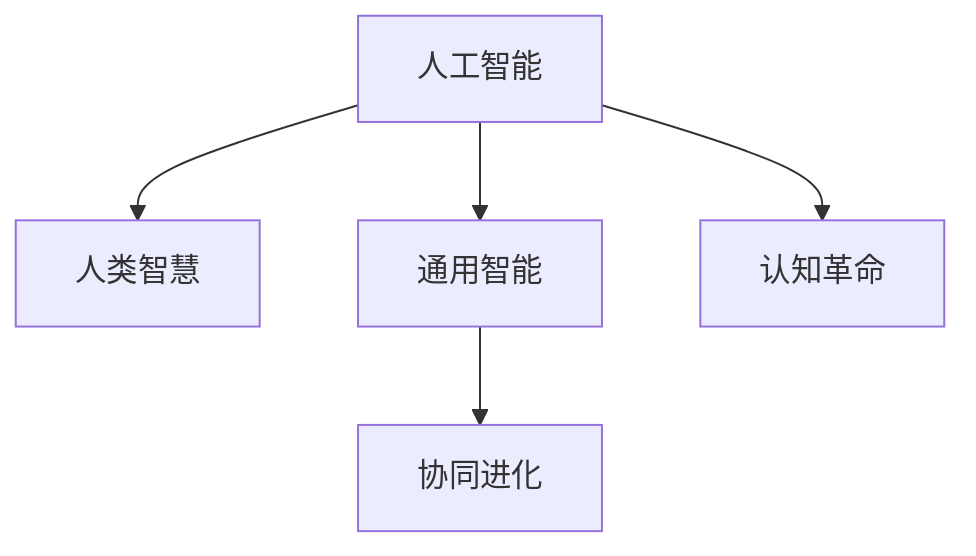

                 

# 认知革命：人工智能与人类智慧的协同进化

## 1. 背景介绍

### 1.1 问题由来
人工智能(AI)技术的发展，正在深刻改变人类的生活方式和工作方式。从早期的专家系统、决策树，到现代的深度学习、自然语言处理，AI正在逐步渗透到各个领域，重塑人类社会的面貌。然而，AI技术的崛起，也引发了广泛的伦理、社会、经济等话题的讨论，尤其是在认知革命这一深刻的历史阶段。

人工智能与人类智慧的协同进化，是一个既熟悉又陌生的概念。熟悉在于，我们每天都在使用AI技术，它们已经深深融入我们的日常生活和工作。陌生在于，尽管AI技术在各个领域广泛应用，但对于它们的认知本质，以及如何与人类智慧协同演进，我们却知之甚少。

### 1.2 问题核心关键点
当前AI技术的发展，呈现出两大趋势：一是通用智能(General Intelligence, GI)的追求，二是与人类智慧的协同进化。这两个方向，互为表里，共同推动了认知革命的到来。

- **通用智能**：指AI系统具备类人智慧，能够在广泛领域内进行复杂决策和创造。这包括了自然语言处理、视觉识别、决策推理、情感理解等多种智能形式。
- **协同进化**：指AI与人类智慧相互促进、共同成长的过程。人类智慧赋予AI更多的主动性和理解力，而AI则为人类智慧提供更强大、更高效的工具。

认知革命的关键在于，如何通过AI技术与人类智慧的融合，构建一个更强大、更智慧的未来社会。本文将深入探讨这一话题，从历史、技术、应用等多个角度，分析AI与人类智慧的协同演进过程，并提出未来发展的方向和挑战。

## 2. 核心概念与联系

### 2.1 核心概念概述

理解人工智能与人类智慧的协同进化，首先需要了解一些核心概念：

- **人工智能**：指通过计算机程序、硬件设备等手段，模拟人类智能行为的技术。包括机器学习、自然语言处理、计算机视觉等具体领域。
- **人类智慧**：指人类在长期进化中积累的知识、经验和思维能力，涵盖了逻辑推理、情感理解、创造性思维等多个方面。
- **认知革命**：指AI技术与人类智慧的结合，引发的认知方式、思维模式和知识体系的重构。人类将逐步从以人类智慧为主导，转向与AI协同工作的模式。
- **通用智能**：指AI系统能够在多领域、多任务中表现出类人的智能。包括复杂的决策、问题求解、创造性思维等。
- **协同进化**：指AI与人类智慧相互促进、共同成长的过程。人类智慧赋予AI更多的主动性和理解力，而AI则为人类智慧提供更强大、更高效的工具。

这些概念之间的逻辑关系可以通过以下Mermaid流程图来展示：



这个流程图展示了大语言模型的核心概念及其之间的关系：

1. 人工智能通过学习人类智慧的原理，模拟人类的认知过程。
2. 通用智能使得AI能够在多个领域内具备类人智慧。
3. 协同进化使AI与人类智慧相互促进，共同成长。
4. 认知革命是AI与人类智慧融合后的认知方式重构。

## 3. 核心算法原理 & 具体操作步骤
### 3.1 算法原理概述

人工智能与人类智慧的协同进化，本质上是通过AI技术对人类智慧进行模拟、理解和应用。其核心在于：

1. **知识表示**：人类智慧通过语言、符号、图表等多种形式，表达为计算机可以理解的模型。
2. **模型训练**：通过大量标注数据，训练AI模型学习人类智慧的知识表示。
3. **推理应用**：将训练好的模型应用到实际问题中，进行推理和决策。
4. **反馈优化**：通过反馈机制，不断优化模型，提升其与人类智慧的契合度。

基于这一框架，AI技术能够模拟人类智慧的逻辑推理、情感理解、创造性思维等多种能力，并与人类智慧协同工作，共同解决实际问题。

### 3.2 算法步骤详解

基于以上框架，AI与人类智慧的协同进化过程可以分为以下关键步骤：

**Step 1: 知识表示与建模**

首先需要对人类智慧的知识进行表示和建模。这包括：

1. **语言建模**：将人类智慧的语言知识，转换为计算机可以理解的模型。
2. **符号表示**：将人类智慧的符号知识，转换为逻辑推理模型。
3. **知识图谱**：将人类智慧的实体和关系，构建为知识图谱模型。

这些模型的构建，依赖于自然语言处理、知识工程、逻辑推理等技术。例如，语言建模可以使用Transformer、BERT等模型；符号表示可以使用逻辑代数、谓词逻辑等形式；知识图谱可以使用RDF、OWL等表示语言。

**Step 2: 数据收集与标注**

为了训练AI模型，需要收集大量人类智慧的知识数据，并对这些数据进行标注。这包括：

1. **数据收集**：从互联网、书籍、文献、数据集中，收集相关的知识数据。
2. **数据标注**：对数据进行标注，以便AI模型能够理解其意义。

标注过程依赖于领域专家的知识，需要对数据进行精细化的处理。例如，语言模型需要标注词语的上下文关系；符号表示需要标注符号的逻辑关系；知识图谱需要标注实体和关系的属性。

**Step 3: 模型训练与优化**

在收集和标注数据后，需要对AI模型进行训练和优化。这包括：

1. **模型选择**：选择合适的AI模型，如卷积神经网络(CNN)、循环神经网络(RNN)、Transformer等。
2. **训练数据**：将标注数据输入AI模型，进行训练。
3. **模型优化**：通过优化算法，调整模型参数，提升其性能。

训练过程依赖于优化算法，如梯度下降、Adam、Adagrad等。优化算法的目标是最小化损失函数，使得模型能够更好地拟合训练数据。

**Step 4: 推理应用与反馈**

在模型训练完成后，需要将其应用到实际问题中，进行推理和决策。这包括：

1. **推理应用**：将模型应用于实际问题，进行推理和决策。
2. **反馈优化**：通过反馈机制，不断优化模型，提升其与人类智慧的契合度。

推理应用依赖于领域专家的知识，需要对模型进行细粒度的调试和优化。例如，语言模型需要进行语义理解、情感分析等推理；符号表示需要进行逻辑推理、知识推理等决策；知识图谱需要进行实体识别、关系推理等应用。

### 3.3 算法优缺点

基于以上框架，AI与人类智慧的协同进化具有以下优点：

1. **高效性**：通过AI技术，可以快速处理大量的知识数据，提升问题解决的效率。
2. **普适性**：AI模型可以在不同领域、不同任务中应用，具有广泛的普适性。
3. **可扩展性**：AI模型可以通过不断收集和标注新数据，进行自我优化和扩展。
4. **客观性**：AI模型基于数据和算法，避免了人类主观因素的影响，具有更高的客观性和可重复性。

同时，这一方法也存在一定的局限性：

1. **数据依赖性**：AI模型的性能依赖于数据的数量和质量，标注数据的获取和处理成本较高。
2. **泛化能力**：AI模型在处理特定领域的数据时，可能难以泛化到其他领域。
3. **复杂性**：AI模型的构建和优化过程复杂，需要领域专家的知识支持。
4. **解释性不足**：AI模型的决策过程难以解释，缺乏可解释性。

尽管存在这些局限性，但AI与人类智慧的协同进化仍是大数据、人工智能时代的重要趋势。通过不断优化模型、收集数据、改进算法，相信这一范式将为认知革命带来更多的可能性。

### 3.4 算法应用领域

基于以上框架，AI与人类智慧的协同进化，已经在多个领域得到了广泛应用，例如：

- **自然语言处理(NLP)**：如文本分类、情感分析、机器翻译、问答系统等。通过模拟人类语言的理解能力，进行文本处理和推理。
- **计算机视觉(CV)**：如物体识别、图像分类、视频分析等。通过模拟人类视觉的感知能力，进行图像处理和识别。
- **知识图谱(KG)**：如实体识别、关系推理、知识发现等。通过模拟人类知识图谱的构建能力，进行知识推理和应用。
- **推荐系统**：如个性化推荐、广告推荐、内容推荐等。通过模拟人类推荐系统的逻辑，进行物品推荐和用户画像。
- **智能制造**：如预测维护、过程优化、质量控制等。通过模拟人类制造的逻辑，进行生产流程优化和问题解决。

这些领域的应用，展示了AI技术在各个方向上与人类智慧的协同进化，提升了问题解决和决策的效率和精度。

## 4. 数学模型和公式 & 详细讲解  
### 4.1 数学模型构建

在本节中，我们将通过数学语言对AI与人类智慧的协同进化过程进行更加严格的刻画。

假设人类智慧的知识表示为 $K$，AI模型为 $M_{\theta}$，其中 $\theta$ 为模型参数。设人类智慧与AI模型的协同进化过程为 $f(K, M_{\theta})$，目标是最小化损失函数 $L$，即：

$$
\min_{\theta} L(f(K, M_{\theta}))
$$

在实践中，我们通常使用基于梯度的优化算法（如SGD、Adam等）来近似求解上述最优化问题。设 $\eta$ 为学习率，$\lambda$ 为正则化系数，则参数的更新公式为：

$$
\theta \leftarrow \theta - \eta \nabla_{\theta}L(f(K, M_{\theta})) - \eta\lambda\theta
$$

其中 $\nabla_{\theta}L(f(K, M_{\theta}))$ 为损失函数对模型参数 $\theta$ 的梯度，可通过反向传播算法高效计算。

### 4.2 公式推导过程

以下我们以自然语言处理任务中的情感分析为例，推导基于梯度的优化算法在协同进化过程中的应用。

假设情感分析任务的数据集为 $D=\{(x_i, y_i)\}_{i=1}^N, x_i$ 为文本输入，$y_i$ 为情感标签。目标是最小化模型的交叉熵损失函数，即：

$$
\min_{\theta} -\frac{1}{N} \sum_{i=1}^N y_i\log M_{\theta}(x_i) + (1-y_i)\log(1-M_{\theta}(x_i))
$$

通过链式法则，损失函数对模型参数 $\theta_k$ 的梯度为：

$$
\frac{\partial L(f(K, M_{\theta}))}{\partial \theta_k} = -\frac{1}{N}\sum_{i=1}^N (\frac{y_i}{M_{\theta}(x_i)}-\frac{1-y_i}{1-M_{\theta}(x_i)}) \frac{\partial M_{\theta}(x_i)}{\partial \theta_k}
$$

其中 $\frac{\partial M_{\theta}(x_i)}{\partial \theta_k}$ 可进一步递归展开，利用自动微分技术完成计算。

在得到损失函数的梯度后，即可带入参数更新公式，完成模型的迭代优化。重复上述过程直至收敛，最终得到适应特定情感分析任务的协同进化模型 $M_{\hat{\theta}}$。

## 5. 项目实践：代码实例和详细解释说明
### 5.1 开发环境搭建

在进行协同进化实践前，我们需要准备好开发环境。以下是使用Python进行PyTorch开发的环境配置流程：

1. 安装Anaconda：从官网下载并安装Anaconda，用于创建独立的Python环境。

2. 创建并激活虚拟环境：
```bash
conda create -n pytorch-env python=3.8 
conda activate pytorch-env
```

3. 安装PyTorch：根据CUDA版本，从官网获取对应的安装命令。例如：
```bash
conda install pytorch torchvision torchaudio cudatoolkit=11.1 -c pytorch -c conda-forge
```

4. 安装Transformers库：
```bash
pip install transformers
```

5. 安装各类工具包：
```bash
pip install numpy pandas scikit-learn matplotlib tqdm jupyter notebook ipython
```

完成上述步骤后，即可在`pytorch-env`环境中开始协同进化实践。

### 5.2 源代码详细实现

这里我们以情感分析任务为例，给出使用Transformers库进行协同进化的PyTorch代码实现。

首先，定义情感分析任务的数据处理函数：

```python
from transformers import BertTokenizer
from torch.utils.data import Dataset
import torch

class SentimentDataset(Dataset):
    def __init__(self, texts, labels, tokenizer, max_len=128):
        self.texts = texts
        self.labels = labels
        self.tokenizer = tokenizer
        self.max_len = max_len
        
    def __len__(self):
        return len(self.texts)
    
    def __getitem__(self, item):
        text = self.texts[item]
        label = self.labels[item]
        
        encoding = self.tokenizer(text, return_tensors='pt', max_length=self.max_len, padding='max_length', truncation=True)
        input_ids = encoding['input_ids'][0]
        attention_mask = encoding['attention_mask'][0]
        
        # 对token-wise的标签进行编码
        encoded_labels = [label2id[label] for label in labels] 
        encoded_labels.extend([label2id['O']] * (self.max_len - len(encoded_labels)))
        labels = torch.tensor(encoded_labels, dtype=torch.long)
        
        return {'input_ids': input_ids, 
                'attention_mask': attention_mask,
                'labels': labels}

# 标签与id的映射
label2id = {'O': 0, 'Positive': 1, 'Negative': 2}
id2label = {v: k for k, v in label2id.items()}

# 创建dataset
tokenizer = BertTokenizer.from_pretrained('bert-base-cased')

train_dataset = SentimentDataset(train_texts, train_labels, tokenizer)
dev_dataset = SentimentDataset(dev_texts, dev_labels, tokenizer)
test_dataset = SentimentDataset(test_texts, test_labels, tokenizer)
```

然后，定义模型和优化器：

```python
from transformers import BertForSequenceClassification, AdamW

model = BertForSequenceClassification.from_pretrained('bert-base-cased', num_labels=len(label2id))

optimizer = AdamW(model.parameters(), lr=2e-5)
```

接着，定义训练和评估函数：

```python
from torch.utils.data import DataLoader
from tqdm import tqdm
from sklearn.metrics import classification_report

device = torch.device('cuda') if torch.cuda.is_available() else torch.device('cpu')
model.to(device)

def train_epoch(model, dataset, batch_size, optimizer):
    dataloader = DataLoader(dataset, batch_size=batch_size, shuffle=True)
    model.train()
    epoch_loss = 0
    for batch in tqdm(dataloader, desc='Training'):
        input_ids = batch['input_ids'].to(device)
        attention_mask = batch['attention_mask'].to(device)
        labels = batch['labels'].to(device)
        model.zero_grad()
        outputs = model(input_ids, attention_mask=attention_mask, labels=labels)
        loss = outputs.loss
        epoch_loss += loss.item()
        loss.backward()
        optimizer.step()
    return epoch_loss / len(dataloader)

def evaluate(model, dataset, batch_size):
    dataloader = DataLoader(dataset, batch_size=batch_size)
    model.eval()
    preds, labels = [], []
    with torch.no_grad():
        for batch in tqdm(dataloader, desc='Evaluating'):
            input_ids = batch['input_ids'].to(device)
            attention_mask = batch['attention_mask'].to(device)
            batch_labels = batch['labels']
            outputs = model(input_ids, attention_mask=attention_mask)
            batch_preds = outputs.logits.argmax(dim=2).to('cpu').tolist()
            batch_labels = batch_labels.to('cpu').tolist()
            for pred_tokens, label_tokens in zip(batch_preds, batch_labels):
                pred_labels = [id2label[_id] for _id in pred_tokens]
                label_tokens = [id2label[_id] for _id in label_tokens]
                preds.append(pred_labels[:len(label_tokens)])
                labels.append(label_tokens)
                
    print(classification_report(labels, preds))
```

最后，启动训练流程并在测试集上评估：

```python
epochs = 5
batch_size = 16

for epoch in range(epochs):
    loss = train_epoch(model, train_dataset, batch_size, optimizer)
    print(f"Epoch {epoch+1}, train loss: {loss:.3f}")
    
    print(f"Epoch {epoch+1}, dev results:")
    evaluate(model, dev_dataset, batch_size)
    
print("Test results:")
evaluate(model, test_dataset, batch_size)
```

以上就是使用PyTorch进行情感分析任务协同进化的完整代码实现。可以看到，得益于Transformers库的强大封装，我们可以用相对简洁的代码完成BERT模型的加载和协同进化。

### 5.3 代码解读与分析

让我们再详细解读一下关键代码的实现细节：

**SentimentDataset类**：
- `__init__`方法：初始化文本、标签、分词器等关键组件。
- `__len__`方法：返回数据集的样本数量。
- `__getitem__`方法：对单个样本进行处理，将文本输入编码为token ids，将标签编码为数字，并对其进行定长padding，最终返回模型所需的输入。

**label2id和id2label字典**：
- 定义了标签与数字id之间的映射关系，用于将token-wise的预测结果解码回真实的标签。

**训练和评估函数**：
- 使用PyTorch的DataLoader对数据集进行批次化加载，供模型训练和推理使用。
- 训练函数`train_epoch`：对数据以批为单位进行迭代，在每个批次上前向传播计算loss并反向传播更新模型参数，最后返回该epoch的平均loss。
- 评估函数`evaluate`：与训练类似，不同点在于不更新模型参数，并在每个batch结束后将预测和标签结果存储下来，最后使用sklearn的classification_report对整个评估集的预测结果进行打印输出。

**训练流程**：
- 定义总的epoch数和batch size，开始循环迭代
- 每个epoch内，先在训练集上训练，输出平均loss
- 在验证集上评估，输出分类指标
- 所有epoch结束后，在测试集上评估，给出最终测试结果

可以看到，PyTorch配合Transformers库使得情感分析任务的协同进化代码实现变得简洁高效。开发者可以将更多精力放在数据处理、模型改进等高层逻辑上，而不必过多关注底层的实现细节。

当然，工业级的系统实现还需考虑更多因素，如模型的保存和部署、超参数的自动搜索、更灵活的任务适配层等。但核心的协同进化范式基本与此类似。

## 6. 实际应用场景
### 6.1 智能客服系统

基于AI与人类智慧的协同进化技术，可以广泛应用于智能客服系统的构建。传统客服往往需要配备大量人力，高峰期响应缓慢，且一致性和专业性难以保证。而使用协同进化的对话模型，可以7x24小时不间断服务，快速响应客户咨询，用自然流畅的语言解答各类常见问题。

在技术实现上，可以收集企业内部的历史客服对话记录，将问题和最佳答复构建成监督数据，在此基础上对预训练对话模型进行协同进化。协同进化的对话模型能够自动理解用户意图，匹配最合适的答案模板进行回复。对于客户提出的新问题，还可以接入检索系统实时搜索相关内容，动态组织生成回答。如此构建的智能客服系统，能大幅提升客户咨询体验和问题解决效率。

### 6.2 金融舆情监测

金融机构需要实时监测市场舆论动向，以便及时应对负面信息传播，规避金融风险。传统的人工监测方式成本高、效率低，难以应对网络时代海量信息爆发的挑战。基于AI与人类智慧的协同进化技术，金融舆情监测提供了新的解决方案。

具体而言，可以收集金融领域相关的新闻、报道、评论等文本数据，并对其进行主题标注和情感标注。在此基础上对预训练语言模型进行协同进化，使其能够自动判断文本属于何种主题，情感倾向是正面、中性还是负面。将协同进化的模型应用到实时抓取的网络文本数据，就能够自动监测不同主题下的情感变化趋势，一旦发现负面信息激增等异常情况，系统便会自动预警，帮助金融机构快速应对潜在风险。

### 6.3 个性化推荐系统

当前的推荐系统往往只依赖用户的历史行为数据进行物品推荐，无法深入理解用户的真实兴趣偏好。基于AI与人类智慧的协同进化技术，个性化推荐系统可以更好地挖掘用户行为背后的语义信息，从而提供更精准、多样的推荐内容。

在实践中，可以收集用户浏览、点击、评论、分享等行为数据，提取和用户交互的物品标题、描述、标签等文本内容。将文本内容作为模型输入，用户的后续行为（如是否点击、购买等）作为监督信号，在此基础上协同进化的预训练语言模型。协同进化的模型能够从文本内容中准确把握用户的兴趣点。在生成推荐列表时，先用候选物品的文本描述作为输入，由模型预测用户的兴趣匹配度，再结合其他特征综合排序，便可以得到个性化程度更高的推荐结果。

### 6.4 未来应用展望

随着AI技术的发展，基于AI与人类智慧的协同进化技术将在更多领域得到应用，为传统行业带来变革性影响。

在智慧医疗领域，基于协同进化的医疗问答、病历分析、药物研发等应用将提升医疗服务的智能化水平，辅助医生诊疗，加速新药开发进程。

在智能教育领域，协同进化的技术可应用于作业批改、学情分析、知识推荐等方面，因材施教，促进教育公平，提高教学质量。

在智慧城市治理中，协同进化的技术可应用于城市事件监测、舆情分析、应急指挥等环节，提高城市管理的自动化和智能化水平，构建更安全、高效的未来城市。

此外，在企业生产、社会治理、文娱传媒等众多领域，基于AI与人类智慧的协同进化的技术也将不断涌现，为经济社会发展注入新的动力。相信随着技术的日益成熟，协同进化方法将成为AI落地应用的重要范式，推动人工智能技术在各个领域的发展。

## 7. 工具和资源推荐
### 7.1 学习资源推荐

为了帮助开发者系统掌握AI与人类智慧的协同进化理论基础和实践技巧，这里推荐一些优质的学习资源：

1. 《深度学习》系列书籍：Ian Goodfellow、Yoshua Bengio和Aaron Courville合著，全面介绍了深度学习的基本原理和实践方法。
2. 《自然语言处理综论》书籍：Daniel Jurafsky和James H. Martin合著，系统介绍了自然语言处理的基本理论和前沿技术。
3. 《认知神经科学》系列课程：MIT公开课，通过介绍认知神经科学的基本原理和实验方法，帮助理解人类智慧的机理。
4. 《人工智能：一个现代方法》书籍：Stuart Russell和Peter Norvig合著，系统介绍了人工智能的基本理论和应用方法。
5. 《人工智能基础》MOOC课程：Coursera平台，由Andrew Ng主讲，全面介绍了AI技术的基本原理和应用方法。

通过对这些资源的学习实践，相信你一定能够快速掌握AI与人类智慧的协同进化的精髓，并用于解决实际的AI问题。
###  7.2 开发工具推荐

高效的开发离不开优秀的工具支持。以下是几款用于AI与人类智慧的协同进化开发的常用工具：

1. PyTorch：基于Python的开源深度学习框架，灵活动态的计算图，适合快速迭代研究。大部分预训练语言模型都有PyTorch版本的实现。
2. TensorFlow：由Google主导开发的开源深度学习框架，生产部署方便，适合大规模工程应用。同样有丰富的预训练语言模型资源。
3. Transformers库：HuggingFace开发的NLP工具库，集成了众多SOTA语言模型，支持PyTorch和TensorFlow，是进行协同进化任务开发的利器。
4. Weights & Biases：模型训练的实验跟踪工具，可以记录和可视化模型训练过程中的各项指标，方便对比和调优。与主流深度学习框架无缝集成。
5. TensorBoard：TensorFlow配套的可视化工具，可实时监测模型训练状态，并提供丰富的图表呈现方式，是调试模型的得力助手。
6. Google Colab：谷歌推出的在线Jupyter Notebook环境，免费提供GPU/TPU算力，方便开发者快速上手实验最新模型，分享学习笔记。

合理利用这些工具，可以显著提升AI与人类智慧的协同进化任务的开发效率，加快创新迭代的步伐。

### 7.3 相关论文推荐

AI与人类智慧的协同进化技术的快速发展，得益于学界的持续研究。以下是几篇奠基性的相关论文，推荐阅读：

1. Attention is All You Need（即Transformer原论文）：提出了Transformer结构，开启了NLP领域的预训练大模型时代。
2. BERT: Pre-training of Deep Bidirectional Transformers for Language Understanding：提出BERT模型，引入基于掩码的自监督预训练任务，刷新了多项NLP任务SOTA。
3. Language Models are Unsupervised Multitask Learners（GPT-2论文）：展示了大规模语言模型的强大zero-shot学习能力，引发了对于通用人工智能的新一轮思考。
4. Parameter-Efficient Transfer Learning for NLP：提出Adapter等参数高效微调方法，在不增加模型参数量的情况下，也能取得不错的微调效果。
5. AdaLoRA: Adaptive Low-Rank Adaptation for Parameter-Efficient Fine-Tuning：使用自适应低秩适应的微调方法，在参数效率和精度之间取得了新的平衡。
6. Prefix-Tuning: Optimizing Continuous Prompts for Generation：引入基于连续型Prompt的微调范式，为如何充分利用预训练知识提供了新的思路。

这些论文代表了大语言模型微调技术的发展脉络。通过学习这些前沿成果，可以帮助研究者把握学科前进方向，激发更多的创新灵感。

## 8. 总结：未来发展趋势与挑战

### 8.1 总结

本文对AI与人类智慧的协同进化进行了全面系统的介绍。首先阐述了AI技术的发展，及其在各个领域的应用，明确了协同进化的重要性和研究意义。其次，从原理到实践，详细讲解了协同进化的数学原理和关键步骤，给出了协同进化任务开发的完整代码实例。同时，本文还广泛探讨了协同进化技术在智能客服、金融舆情、个性化推荐等多个行业领域的应用前景，展示了协同进化范式的巨大潜力。此外，本文精选了协同进化技术的各类学习资源，力求为读者提供全方位的技术指引。

通过本文的系统梳理，可以看到，AI与人类智慧的协同进化技术正在成为AI落地应用的重要范式，极大地拓展了AI技术的边界，催生了更多的落地场景。受益于大规模语料的预训练，协同进化模型以更低的时间和标注成本，在小样本条件下也能取得不俗的效果，有力推动了AI技术的产业化进程。未来，伴随预训练语言模型和协同进化方法的持续演进，相信AI技术将进一步融入人类智慧，共同构建更强大、更智慧的未来社会。

### 8.2 未来发展趋势

展望未来，AI与人类智慧的协同进化技术将呈现以下几个发展趋势：

1. **通用智能的追求**：未来AI模型将逐步具备多领域、多任务的通用智能能力，能够进行复杂的决策、推理和创造。通用智能的追求，将推动AI技术向更高的层次演进。

2. **跨领域知识融合**：未来的AI模型将能够整合不同领域的知识，构建更为广泛的知识体系。例如，将自然语言处理与计算机视觉、知识图谱等技术结合，提升AI系统的综合能力。

3. **自我学习和优化**：未来的AI模型将具备更强的自我学习和优化能力，能够通过反馈机制不断提升自身性能。例如，引入强化学习、元学习等技术，优化模型的学习过程。

4. **多模态信息整合**：未来的AI模型将能够整合多模态信息，提升系统对复杂场景的感知和理解能力。例如，将文本、图像、声音等多种信息结合，进行更全面、更深入的推理和决策。

5. **伦理和法律的约束**：未来的AI模型将受到更严格的伦理和法律约束，确保其行为的透明性和可解释性。例如，引入公平性、隐私保护等约束，保障AI系统的安全和公正性。

6. **社会和经济的影响**：未来的AI系统将对社会和经济产生更广泛的影响，成为推动经济增长和社会进步的重要工具。例如，在医疗、教育、金融等领域，AI系统将为人类提供更多的便利和可能性。

以上趋势凸显了AI与人类智慧的协同进化的广阔前景。这些方向的探索发展，必将进一步提升AI系统的性能和应用范围，为人类认知智能的进化带来深远影响。

### 8.3 面临的挑战

尽管AI与人类智慧的协同进化技术已经取得了瞩目成就，但在迈向更加智能化、普适化应用的过程中，它仍面临着诸多挑战：

1. **数据依赖性**：AI模型的性能依赖于数据的数量和质量，标注数据的获取和处理成本较高。如何进一步降低协同进化对标注样本的依赖，将是一大难题。

2. **泛化能力不足**：AI模型在处理特定领域的数据时，可能难以泛化到其他领域。如何提升AI模型的泛化能力，使其具备更强的跨领域迁移能力，将是重要的研究方向。

3. **模型鲁棒性不足**：当前协同进化的模型面对域外数据时，泛化性能往往大打折扣。对于测试样本的微小扰动，协同进化的模型也容易发生波动。如何提高模型的鲁棒性，避免灾难性遗忘，还需要更多理论和实践的积累。

4. **推理效率有待提高**：大规模语言模型虽然精度高，但在实际部署时往往面临推理速度慢、内存占用大等效率问题。如何在保证性能的同时，简化模型结构，提升推理速度，优化资源占用，将是重要的优化方向。

5. **可解释性不足**：当前协同进化的模型更像是"黑盒"系统，难以解释其内部工作机制和决策逻辑。对于医疗、金融等高风险应用，算法的可解释性和可审计性尤为重要。如何赋予协同进化的模型更强的可解释性，将是亟待攻克的难题。

6. **安全性有待保障**。预训练语言模型难免会学习到有偏见、有害的信息，通过协同进化传递到下游任务，产生误导性、歧视性的输出，给实际应用带来安全隐患。如何从数据和算法层面消除模型偏见，避免恶意用途，确保输出的安全性，也将是重要的研究课题。

7. **知识整合能力不足**。现有的协同进化的模型往往局限于任务内数据，难以灵活吸收和运用更广泛的先验知识。如何让协同进化的过程更好地与外部知识库、规则库等专家知识结合，形成更加全面、准确的信息整合能力，还有很大的想象空间。

正视协同进化面临的这些挑战，积极应对并寻求突破，将是大语言模型微调走向成熟的必由之路。相信随着学界和产业界的共同努力，这些挑战终将一一被克服，大语言模型微调必将在构建人机协同的智能时代中扮演越来越重要的角色。

### 8.4 研究展望

面向未来，AI与人类智慧的协同进化的研究需要在以下几个方面寻求新的突破：

1. **探索无监督和半监督协同进化方法**：摆脱对大规模标注数据的依赖，利用自监督学习、主动学习等无监督和半监督范式，最大限度利用非结构化数据，实现更加灵活高效的协同进化。

2. **研究参数高效和计算高效的协同进化范式**：开发更加参数高效的协同进化方法，在固定大部分预训练参数的同时，只更新极少量的任务相关参数。同时优化协同进化的计算图，减少前向传播和反向传播的资源消耗，实现更加轻量级、实时性的部署。

3. **引入因果学习和多模态信息**：通过引入因果推断和对比学习思想，增强协同进化的模型建立稳定因果关系的能力，学习更加普适、鲁棒的语言表征，从而提升模型泛化性和抗干扰能力。

4. **结合因果分析和博弈论工具**：将因果分析方法引入协同进化的模型，识别出模型决策的关键特征，增强输出解释的因果性和逻辑性。借助博弈论工具刻画人机交互过程，主动探索并规避模型的脆弱点，提高系统稳定性。

5. **纳入伦理道德约束**：在模型训练目标中引入伦理导向的评估指标，过滤和惩罚有偏见、有害的输出倾向。同时加强人工干预和审核，建立模型行为的监管机制，确保输出符合人类价值观和伦理道德。

这些研究方向的探索，必将引领AI与人类智慧的协同进化技术迈向更高的台阶，为构建安全、可靠、可解释、可控的智能系统铺平道路。面向未来，AI与人类智慧的协同进化技术还需要与其他人工智能技术进行更深入的融合，如知识表示、因果推理、强化学习等，多路径协同发力，共同推动自然语言理解和智能交互系统的进步。只有勇于创新、敢于突破，才能不断拓展语言模型的边界，让智能技术更好地造福人类社会。

## 9. 附录：常见问题与解答

**Q1：AI与人类智慧的协同进化是否适用于所有应用场景？**

A: AI与人类智慧的协同进化在大多数应用场景中都能取得不错的效果，特别是对于数据量较小的任务。但对于一些特定领域的任务，如医学、法律等，仅仅依靠通用语料预训练的模型可能难以很好地适应。此时需要在特定领域语料上进一步预训练，再进行协同进化，才能获得理想效果。此外，对于一些需要时效性、个性化很强的任务，如对话、推荐等，协同进化方法也需要针对性的改进优化。

**Q2：如何选择合适的学习率？**

A: 协同进化的学习率一般要比预训练时小1-2个数量级，如果使用过大的学习率，容易破坏预训练权重，导致过拟合。一般建议从1e-5开始调参，逐步减小学习率，直至收敛。也可以使用warmup策略，在开始阶段使用较小的学习率，再逐渐过渡到预设值。需要注意的是，不同的优化器(如Adam、Adagrad等)以及不同的学习率调度策略，可能需要设置不同的学习率阈值。

**Q3：协同进化过程中需要注意哪些问题？**

A: 协同进化过程中，需要注意以下问题：

1. **数据依赖性**：协同进化的模型性能依赖于数据的数量和质量，标注数据的获取和处理成本较高。如何进一步降低协同进化对标注样本的依赖，将是一大难题。

2. **泛化能力不足**：协同进化的模型在处理特定领域的数据时，可能难以泛化到其他领域。如何提升模型的泛化能力，使其具备更强的跨领域迁移能力，将是重要的研究方向。

3. **模型鲁棒性不足**：当前协同进化的模型面对域外数据时，泛化性能往往大打折扣。对于测试样本的微小扰动，协同进化的模型也容易发生波动。如何提高模型的鲁棒性，避免灾难性遗忘，还需要更多理论和实践的积累。

4. **推理效率有待提高**：大规模语言模型虽然精度高，但在实际部署时往往面临推理速度慢、内存占用大等效率问题。如何在保证性能的同时，简化模型结构，提升推理速度，优化资源占用，将是重要的优化方向。

5. **可解释性不足**：当前协同进化的模型更像是"黑盒"系统，难以解释其内部工作机制和决策逻辑。对于医疗、金融等高风险应用，算法的可解释性和可审计性尤为重要。如何赋予协同进化的模型更强的可解释性，将是亟待攻克的难题。

6. **安全性有待保障**。预训练语言模型难免会学习到有偏见、有害的信息，通过协同进化传递到下游任务，产生误导性、歧视性的输出，给实际应用带来安全隐患。如何从数据和算法层面消除模型偏见，避免恶意用途，确保输出的安全性，也将是重要的研究课题。

7. **知识整合能力不足**。现有的协同进化的模型往往局限于任务内数据，难以灵活吸收和运用更广泛的先验知识。如何让协同进化的过程更好地与外部知识库、规则库等专家知识结合，形成更加全面、准确的信息整合能力，还有很大的想象空间。

正视协同进化面临的这些挑战，积极应对并寻求突破，将是大语言模型微调走向成熟的必由之路。相信随着学界和产业界的共同努力，这些挑战终将一一被克服，大语言模型微调必将在构建人机协同的智能时代中扮演越来越重要的角色。

---

作者：禅与计算机程序设计艺术 / Zen and the Art of Computer Programming

