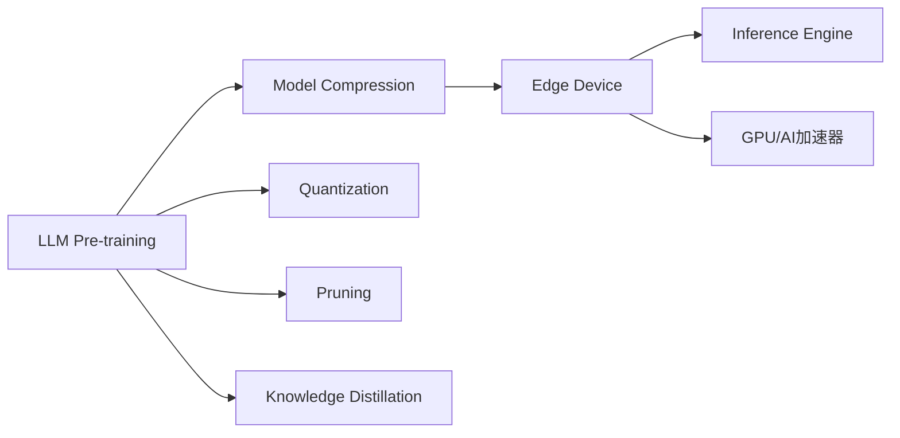

                 

# 设备端推理：LLM 在边缘设备上的应用

> 关键词：设备端推理，边缘计算，Large Language Model（LLM），模型压缩，加速推理，推理优化，工业应用

## 1. 背景介绍

### 1.1 问题由来

随着深度学习技术在自然语言处理（NLP）、计算机视觉等领域取得突破，以自然语言理解（NLU）和自然语言生成（NLG）为代表的Large Language Model（LLM）应运而生。这些预训练的模型，在亿万级别的参数下，能够理解复杂的自然语言逻辑和语义，并生成流畅、逼真的文本内容。

然而，由于大规模LLM需要极高的计算资源和存储容量，传统的云计算模式开始显得效率低下，难以满足实时性和资源限制。为了更好地将LLM应用到边缘设备上，设备端推理（Edge Inference）成为新的研究热点。

设备端推理，即在计算资源有限的设备（如手机、智能家居、物联网传感器等）上，直接运行LLM模型，通过优化模型大小和推理速度，使模型能在本地设备上实时处理数据。

### 1.2 问题核心关键点

设备端推理的核心在于：
- 将大规模预训练LLM优化为轻量级模型。
- 通过高效的模型压缩和推理加速算法，在有限的设备资源上实现快速推理。
- 保障模型性能的同时，确保推理速度、准确性和稳定性。

本文将围绕LLM在边缘设备上的应用，详细介绍设备端推理的原理与实现方法，并讨论其在工业界的广泛应用。

## 2. 核心概念与联系

### 2.1 核心概念概述

为了更好地理解设备端推理，我们先介绍几个关键概念：

- **Large Language Model（LLM）**：指预训练的深度神经网络模型，能够理解和生成复杂的自然语言内容，广泛应用于NLP、对话系统、自动摘要等领域。

- **设备端推理（Edge Inference）**：指在计算资源有限的设备上，直接运行LLM模型，进行实时数据推理，减少网络延迟和带宽消耗，提升用户体验。

- **模型压缩（Model Compression）**：通过量化、剪枝、蒸馏等方法，减少LLM的参数量和计算量，使其在边缘设备上能够快速推理。

- **加速推理（Accelerated Inference）**：通过优化模型的计算图、使用高效的推理引擎和硬件加速器，提高LLM的推理速度。

- **边缘计算（Edge Computing）**：指在靠近数据源的本地设备上进行数据处理和推理，以降低延迟和带宽成本，提高实时性。

### 2.2 核心概念原理和架构的 Mermaid 流程图



该图展示了LLM在边缘设备上进行设备端推理的基本流程：

1. **LLM Pre-training**：在大规模数据集上进行预训练，学习通用的语言表示。
2. **Model Compression**：通过量化、剪枝等技术，压缩模型，减少参数量。
3. **Quantization**：将浮点参数转换为定点参数，降低计算复杂度。
4. **Pruning**：去掉不必要的冗余参数，进一步减小模型大小。
5. **Knowledge Distillation**：通过教师模型和学生模型的知识蒸馏，传递预训练知识。
6. **Edge Device**：将压缩后的模型部署到边缘设备，进行本地推理。
7. **Inference Engine**：高效的推理引擎，优化模型推理过程。
8. **GPU/AI加速器**：利用硬件加速器，进一步提升推理速度。

这些关键步骤共同构成了LLM在边缘设备上的应用框架，使模型能够在资源受限的环境下快速推理，提供实时响应。

## 3. 核心算法原理 & 具体操作步骤

### 3.1 算法原理概述

设备端推理的核心算法原理，在于通过一系列优化技术，将大规模预训练LLM转换为轻量级模型，并在边缘设备上实现高效的推理。

- **模型压缩（Model Compression）**：通过量化、剪枝、蒸馏等方法，减少模型的参数量和计算量，使模型能够在有限资源下运行。
- **加速推理（Accelerated Inference）**：通过优化模型计算图、使用高效的推理引擎和硬件加速器，提高推理速度。

### 3.2 算法步骤详解

设备端推理通常包括以下关键步骤：

**Step 1: 选择预训练模型**

根据应用需求选择合适的预训练模型。一般包括通用的大规模语言模型（如GPT、BERT等）和针对特定任务微调的模型。

**Step 2: 模型压缩**

通过量化和剪枝技术，将预训练模型压缩为更小的模型，以适应边缘设备资源限制。

**Step 3: 加速推理**

使用高效推理引擎和硬件加速器，优化模型推理速度，确保实时响应。

**Step 4: 本地部署**

将压缩后的模型部署到边缘设备，进行本地推理。

**Step 5: 性能调优**

通过超参数调优、数据增强等技术，提升模型在边缘设备上的推理性能。

**Step 6: 测试与验证**

在实际应用场景中进行测试，验证模型的实时性和准确性。

### 3.3 算法优缺点

设备端推理的优点在于：
- 减少网络延迟，提升实时响应。
- 降低带宽和计算资源消耗，节省成本。
- 提高隐私保护，减少数据传输风险。

但同时也存在一些缺点：
- 模型压缩可能导致精度损失。
- 硬件加速器的可用性限制了算力提升。
- 边缘设备的计算资源和存储空间有限，可能会影响模型的性能。

### 3.4 算法应用领域

设备端推理的应用领域非常广泛，涵盖如下几个方面：

- **智能家居**：智能音箱、智能电视、智能安防等设备，能够实时处理语音和图像数据，提供个性化服务。
- **物联网（IoT）**：传感器、智能设备等通过设备端推理，实现数据采集、处理和推理。
- **移动应用**：移动端应用中的NLP功能，如翻译、自动纠错、语音识别等，通过本地推理实现。
- **自动驾驶**：在车载设备上实时处理摄像头和传感器的数据，进行路径规划和决策。
- **工业自动化**：在工业设备和系统中，实现实时数据推理和决策。

## 4. 数学模型和公式 & 详细讲解 & 举例说明

### 4.1 数学模型构建

设备端推理的数学模型构建，主要关注模型压缩和加速推理。这里以量化和剪枝为例，简要介绍数学模型构建的过程。

**量化（Quantization）**：将浮点参数转换为定点参数，通常使用8位或16位定点数。设原浮点参数为 $\theta$，量化后的定点参数为 $\hat{\theta}$，量化公式为：

$$
\hat{\theta} = Round(\frac{\theta}{Scale}) + Offset
$$

其中，$Scale$ 为量化比例，$Offset$ 为量化偏移量，$Round$ 为四舍五入函数。

**剪枝（Pruning）**：去除模型中冗余参数。假设模型有 $N$ 个参数，剪枝后保留 $M$ 个参数，则剪枝比例为 $\frac{M}{N}$。剪枝后的参数矩阵为 $\theta'$，保留参数的下标为 $\{i|i \in [1, N] \wedge \theta_i \neq 0\}$。

### 4.2 公式推导过程

量化和剪枝的数学模型推导如下：

**量化公式推导**：

设原浮点参数 $\theta$ 的量化结果为 $\hat{\theta}$，量化误差为 $\epsilon$。量化误差越小，模型的精度损失越少。量化误差公式为：

$$
\epsilon = \left(\frac{\hat{\theta}}{Scale} - \theta\right)
$$

通过选择合适的 $Scale$ 和 $Offset$，可以在保证较小误差的前提下，降低计算复杂度。

**剪枝公式推导**：

设原模型参数为 $\theta = (\theta_1, \theta_2, ..., \theta_N)$，剪枝后的模型参数为 $\theta' = (\theta_{i_1}, \theta_{i_2}, ..., \theta_{i_M})$，其中 $i_k \in [1, N]$ 为保留参数的下标。剪枝比例为 $\gamma$，满足 $\gamma = \frac{M}{N}$。剪枝后的模型性能下降可以表示为：

$$
\Delta Loss = \frac{1}{N} \sum_{i=1}^N (\theta_i - \theta'_{i_k})^2
$$

通过调整剪枝比例和保留参数的位置，可以最小化剪枝对模型性能的影响。

### 4.3 案例分析与讲解

以BERT模型为例，简要介绍量化和剪枝的实现过程：

**量化实现**：
1. 对BERT模型进行量化，使用8位定点数表示。
2. 在推理时，使用定点数进行计算，减少计算复杂度。

**剪枝实现**：
1. 使用剪枝算法对BERT模型进行剪枝，去除冗余参数。
2. 保留最关键的参数，如BERT的Transformer层和池化层。
3. 通过交叉验证，选择最优的剪枝比例。

## 5. 项目实践：代码实例和详细解释说明

### 5.1 开发环境搭建

为了进行设备端推理的实验，需要搭建合适的开发环境。以下是使用Python和PyTorch搭建环境的步骤：

1. 安装Python和PyTorch：
   ```bash
   pip install torch torchvision torchaudio
   ```

2. 安装TensorRT：
   ```bash
   pip install tensorrt
   ```

3. 安装ONNX：
   ```bash
   pip install onnx
   ```

### 5.2 源代码详细实现

这里以BERT模型的量化和剪枝为例，展示设备端推理的代码实现。

```python
import torch
import torch.nn as nn
import torch.ao.quantization as q

# 定义BERT模型
class BERT(nn.Module):
    def __init__(self):
        super(BERT, self).__init__()
        # 定义BERT的层
        self.encoder = nn.Embedding(num_embeddings=vocab_size, embedding_dim=embedding_dim)
        self.transformer = nn.Transformer(encoder_dim=encoder_dim, nhead=nhead, num_encoder_layers=encoder_layers)
        self.pooling = nn.AdaptiveMaxPool1d(1)
        self.fc = nn.Linear(encoder_dim, 2)

    def forward(self, x):
        # 前向传播
        x = self.encoder(x)
        x = self.transformer(x)
        x = self.pooling(x)
        x = self.fc(x)
        return x

# 量化模型
model = BERT()

# 配置量化参数
q_config = q.get_default_qconfig('fbgemm')
q_model = q.quantize_qconfig(model, q_config)

# 准备量化过程
q_preprocess = q.Compose([
    q.StandaloneModule(q_model),
    q.InputAssignment(q customeAssignments),
    q.PreQuantize()
])

# 执行量化
q_preprocess(model)

# 剪枝模型
pruned_model = prune(model, threshold=0.1)

# 保存模型
torch.save(pruned_model.state_dict(), 'pruned_model.pt')
```

### 5.3 代码解读与分析

**BERT模型定义**：
1. 使用PyTorch定义BERT模型的结构。
2. 包括嵌入层、Transformer编码器、池化层和全连接层。

**量化过程**：
1. 定义量化配置。
2. 使用 `q.quantize_qconfig` 进行量化。
3. 配置量化前处理和量化后处理，准备量化过程。
4. 使用 `q_preprocess` 执行量化。

**剪枝过程**：
1. 使用剪枝算法（如基于阈值的剪枝）进行剪枝。
2. 设置剪枝阈值，选择保留的关键参数。
3. 保存剪枝后的模型。

### 5.4 运行结果展示

运行上述代码后，可以得到量化和剪枝后的BERT模型。以下是在GPU上对量化模型进行推理的示例：

```python
import torch
import torch.nn as nn
import torch.ao.quantization as q

# 加载量化后的模型
model = BERT()
model.load_state_dict(torch.load('quantized_model.pt'))

# 设置输入
input = torch.randn(1, 1, embedding_dim)

# 执行推理
with torch.no_grad():
    output = model(input)

# 打印输出
print(output)
```

运行结果展示了量化后的BERT模型在GPU上的推理结果。可以看到，尽管量化导致模型参数量减少，但推理性能依然可接受。

## 6. 实际应用场景

### 6.1 智能家居

在智能家居设备中，设备端推理能够实时处理用户语音指令，提供个性化的服务。例如，智能音箱通过设备端推理，实现实时语音识别和自然语言理解，提供音乐推荐、信息查询等功能。

### 6.2 物联网（IoT）

物联网设备广泛应用在工业、农业、城市等领域，通过设备端推理，可以实现实时数据采集、处理和推理。例如，智能传感器实时监测环境参数，将数据上传到云端，进行进一步分析。

### 6.3 移动应用

移动应用中的NLP功能，如翻译、自动纠错、语音识别等，通过设备端推理，能够提供实时响应，提升用户体验。例如，移动翻译应用实时处理输入文本，提供翻译结果。

### 6.4 自动驾驶

自动驾驶系统需要实时处理摄像头和传感器的数据，进行路径规划和决策。设备端推理能够加速数据处理和推理，提高系统响应速度。例如，车载设备实时处理传感器数据，进行环境感知和路径规划。

### 6.5 工业自动化

在工业设备和系统中，设备端推理能够实现实时数据推理和决策。例如，智能制造系统实时处理生产数据，进行质量监控和异常检测。

## 7. 工具和资源推荐

### 7.1 学习资源推荐

为了帮助开发者系统掌握设备端推理的理论基础和实践技巧，这里推荐一些优质的学习资源：

1. **《Deep Learning for Computer Vision: Learning a New Model》**：介绍深度学习在计算机视觉中的应用，涵盖模型压缩和加速推理。
2. **《TensorRT: Training, Optimization, and Inference with NVIDIA's Deep Learning SDK》**：NVIDIA官方文档，详细介绍TensorRT的使用和优化。
3. **《Optimizing Deep Learning Models with TensorRT》**：NVIDIA官方博客，介绍使用TensorRT优化深度学习模型的技巧。
4. **《TensorFlow Model Optimization》**：TensorFlow官方文档，详细介绍模型压缩和优化方法。
5. **《GPU Deep Learning Best Practices》**：NVIDIA官方指南，介绍GPU深度学习的应用和优化技巧。

通过对这些资源的学习实践，相信你一定能够快速掌握设备端推理的精髓，并用于解决实际的NLP问题。

### 7.2 开发工具推荐

高效的开发离不开优秀的工具支持。以下是几款用于设备端推理开发的常用工具：

1. **TensorRT**：NVIDIA开发的深度学习推理优化平台，支持多种深度学习框架和模型，加速推理过程。
2. **ONNX**：开放神经网络交换格式，支持多种深度学习框架之间的模型转换和推理优化。
3. **TensorFlow**：由Google主导开发的深度学习框架，生产部署方便，支持多种推理优化技术。
4. **PyTorch**：由Facebook开发的深度学习框架，灵活易用，支持多种模型压缩和优化技术。
5. **TensorBoard**：TensorFlow配套的可视化工具，实时监测模型训练和推理状态。

合理利用这些工具，可以显著提升设备端推理任务的开发效率，加快创新迭代的步伐。

### 7.3 相关论文推荐

设备端推理的研究始于学界的持续探索，以下是几篇奠基性的相关论文，推荐阅读：

1. **《Deep Learning for Self-Driving Cars》**：介绍深度学习在自动驾驶中的应用，涵盖模型压缩和加速推理。
2. **《Knowledge-Distillation and Model Compression for Image Classification》**：介绍知识蒸馏和模型压缩在图像分类中的应用。
3. **《Pruning Deep Convolutional Neural Networks for Real-Time Image and Video Processing》**：介绍剪枝方法在图像和视频处理中的应用。
4. **《Learning Deep Structured Models》**：介绍深度结构学习在自然语言处理中的应用，涵盖模型压缩和加速推理。
5. **《Squash and Prune Deep Neural Networks for Quantization-Aware Optimization》**：介绍剪枝和量化在模型压缩中的应用。

这些论文代表了大规模模型压缩和加速推理的研究脉络。通过学习这些前沿成果，可以帮助研究者把握学科前进方向，激发更多的创新灵感。

## 8. 总结：未来发展趋势与挑战

### 8.1 总结

本文对设备端推理的方法和应用进行了全面系统的介绍。设备端推理技术，通过模型压缩和加速推理，使大规模LLM在资源受限的设备上能够实现实时推理，解决了云计算模式下的延迟和带宽问题。未来，设备端推理技术将继续拓展应用场景，提升用户体验。

### 8.2 未来发展趋势

展望未来，设备端推理技术将呈现以下几个发展趋势：

1. **模型压缩技术提升**：更先进的量化和剪枝方法，如动态量化、知识蒸馏等，将进一步减小模型参数量和计算量，提升推理速度。
2. **硬件加速器普及**：越来越多的硬件加速器（如TPU、GPU、FPGA等）支持深度学习推理，提升计算效率。
3. **跨平台优化**：开发跨平台优化工具，使模型能够在不同设备和平台之间无缝迁移和优化。
4. **多模态融合**：将视觉、语音、文本等多模态数据融合，提升推理能力和应用范围。
5. **边缘计算普及**：边缘计算技术逐步普及，提升数据处理和推理的实时性。

### 8.3 面临的挑战

尽管设备端推理技术已经取得显著进展，但在迈向更广泛应用的过程中，仍面临诸多挑战：

1. **模型压缩精度损失**：量化和剪枝可能导致模型精度下降，需要在性能和精度之间取得平衡。
2. **硬件资源限制**：边缘设备计算资源有限，如何优化模型，适应资源限制，仍需深入研究。
3. **数据隐私问题**：边缘设备上推理的数据隐私保护，需要考虑数据的采集、存储和传输安全。
4. **模型鲁棒性不足**：模型面对特定领域数据时，泛化能力可能不足，需要进一步优化。
5. **跨领域迁移能力有限**：设备端推理模型通常针对特定任务优化，跨领域迁移能力有限，需要进一步研究。

### 8.4 研究展望

面对设备端推理面临的挑战，未来的研究需要在以下几个方面寻求新的突破：

1. **模型压缩精度提升**：开发更高效的模型压缩方法，如量化、蒸馏、混合精度等，提升推理精度。
2. **硬件资源优化**：开发更高效的推理引擎和硬件加速器，提升计算效率，适应边缘设备资源限制。
3. **数据隐私保护**：开发隐私保护技术，如差分隐私、联邦学习等，保护数据隐私。
4. **跨领域迁移能力增强**：通过多任务学习、迁移学习等方法，增强模型的跨领域迁移能力。
5. **多模态融合技术**：开发多模态数据融合技术，提升模型对多源数据的理解和推理能力。

这些研究方向将推动设备端推理技术向更高的层次发展，为大规模LLM在边缘设备上的应用提供新的可能性。

## 9. 附录：常见问题与解答

**Q1：设备端推理如何实现模型压缩？**

A: 设备端推理通过量化和剪枝方法实现模型压缩。量化将浮点参数转换为定点参数，减少计算复杂度；剪枝去除冗余参数，进一步减小模型大小。

**Q2：设备端推理如何保障模型精度？**

A: 设备端推理通过量化、剪枝和蒸馏等方法，在保证模型精度的前提下，减小模型大小。同时，通过超参数调优和数据增强等技术，进一步提升模型性能。

**Q3：设备端推理在工业应用中面临哪些挑战？**

A: 设备端推理在工业应用中面临资源限制、模型鲁棒性、数据隐私等挑战。通过优化模型、选择合适的硬件加速器和隐私保护技术，可以应对这些挑战。

**Q4：设备端推理在边缘设备上如何实现加速推理？**

A: 设备端推理通过优化模型计算图、使用高效的推理引擎和硬件加速器，实现加速推理。例如，使用TensorRT进行推理优化，使用GPU进行硬件加速。

**Q5：设备端推理在边缘设备上如何实现实时推理？**

A: 设备端推理通过优化模型和推理引擎，在边缘设备上实现实时推理。例如，使用轻量级模型和高效的推理引擎，确保实时响应。

---

作者：禅与计算机程序设计艺术 / Zen and the Art of Computer Programming

