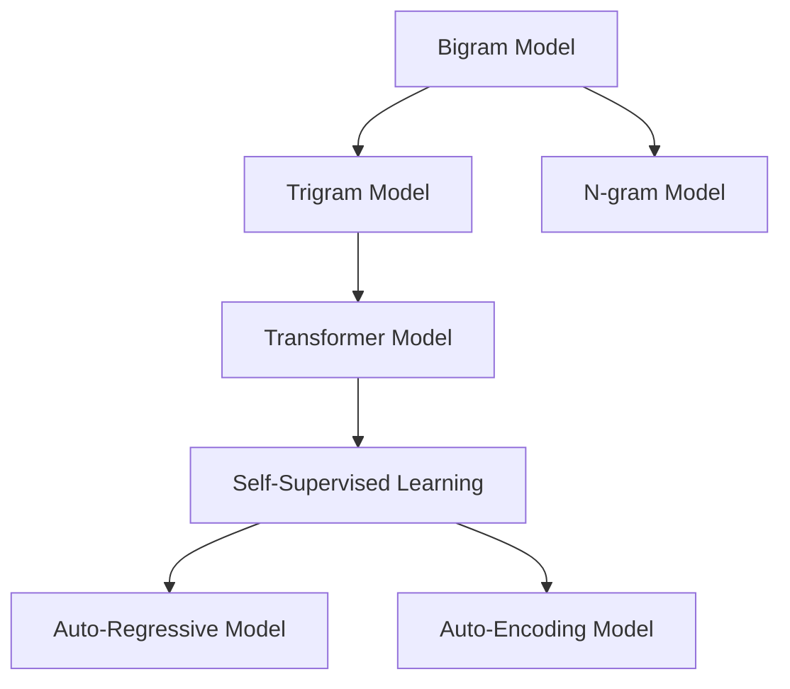

                 

# 语言建模进阶：Bigram 到 N-gram

> 关键词：N-gram,语言模型,文本生成,自然语言处理,NLP

## 1. 背景介绍

### 1.1 问题由来
语言模型在自然语言处理（NLP）领域具有举足轻重的地位。它们主要用于预测文本中下一个单词或字符的概率分布，为后续的文本生成、信息检索、机器翻译等任务提供重要支撑。然而，早期基于N-gram统计的语言模型由于历史原因，存在数据稀疏和上下文无关等局限性，难以应对复杂的语言现象。随着深度学习技术的发展，特别是Transformer架构的兴起，语言模型设计进入了一个新的阶段。

### 1.2 问题核心关键点
当前最先进的语言模型，如BERT、GPT系列等，均基于Transformer结构，通过自监督学习任务对大规模无标签数据进行预训练。这些模型通过自回归或自编码方式，学习到了丰富的语言知识和上下文关联，在各种NLP任务上取得了卓越的效果。

为了更深入地理解语言模型的工作原理，本文将详细介绍从Bigram到N-gram模型的演进过程，并结合具体案例，剖析语言模型的核心算法与优化策略。通过对这些经典模型的深入分析，希望能帮助读者更好地把握语言模型技术，为实际应用提供参考。

## 2. 核心概念与联系

### 2.1 核心概念概述

为了更好地理解语言模型，本节将介绍几个紧密相关的核心概念：

- **语言模型（Language Model, LM）**：预测文本序列的概率分布，通常以给定文本的前N个单词为基础，预测第N+1个单词的概率。
- **Bigram模型**：仅考虑相邻两个单词之间的关系，即P(w_{n+1}|w_n)。
- **Trigram模型**：同时考虑相邻三个单词之间的关系，即P(w_{n+1}|w_n, w_{n-1})。
- **N-gram模型**：一般指同时考虑相邻N个单词之间的关系，即P(w_{n+1}|w_n, w_{n-1}, ..., w_{n-N+1})。
- **Transformer模型**：一种基于注意力机制的神经网络结构，在语言建模、文本生成等任务上表现优异。
- **自监督学习（Self-Supervised Learning）**：利用无标签数据进行模型训练，如语言建模、掩码语言模型（Masked Language Model, MLM）等。
- **自回归模型（Auto-Regressive Model）**：基于自回归结构，先预测当前单词再基于当前单词预测下一个单词。
- **自编码模型（Auto-Encoding Model）**：通过预测编码后的表示再解码生成原始文本。

这些概念之间的逻辑关系可以通过以下Mermaid流程图来展示：



该流程图展示了从Bigram模型到Transformer模型的演进路径，以及自监督学习、自回归和自编码模型等关键技术。

## 3. 核心算法原理 & 具体操作步骤

### 3.1 算法原理概述

语言模型可以分为静态模型和动态模型两类。静态模型如N-gram模型，通过统计文本序列的频率计算条件概率，预测下一个单词。动态模型如Transformer模型，通过神经网络学习文本序列的复杂依赖关系，预测文本的概率分布。

#### 3.1.1 静态语言模型

静态语言模型通过统计文本序列中相邻单词的出现频率，计算条件概率，从而预测下一个单词。其核心原理是通过最大似然估计（Maximum Likelihood Estimation, MLE）方法，最大化模型在已知文本序列上的概率，从而训练出最优的模型参数。

以Bigram模型为例，其条件概率公式为：

$$ P(w_{n+1} | w_n) = \frac{count(w_{n+1}, w_n)}{count(w_n)} $$

其中，count(w_{n+1}, w_n)表示同时出现w_{n+1}和w_n的文本序列数量，count(w_n)表示仅出现w_n的文本序列数量。

#### 3.1.2 动态语言模型

动态语言模型通过神经网络学习文本序列的复杂依赖关系，能够处理更长的序列，并具备泛化能力。Transformer模型是当前最先进的动态语言模型之一，通过自注意力机制（Self-Attention）学习文本序列中的上下文信息，从而预测下一个单词。

Transformer模型的核心公式为：

$$ P(w_{n+1} | w_n, ..., w_1) = \frac{e^{\frac{\text{Attention}(w_n, ..., w_1)}{\text{Temperature}}}{\sum_{k=1}^{N} e^{\frac{\text{Attention}(w_k, ..., w_1)}{\text{Temperature}}}} $$

其中，Attention(w_n, ..., w_1)表示文本序列w_n到w_1的注意力得分，Temperature用于平滑输出概率分布，以避免过拟合。

### 3.2 算法步骤详解

以Transformer模型为例，其微调过程一般包括以下关键步骤：

1. **数据准备**：准备预训练模型和下游任务的标注数据集，划分训练集、验证集和测试集。
2. **任务适配层**：根据下游任务类型，在模型顶层设计合适的输出层和损失函数。
3. **设置微调超参数**：选择合适的优化算法及其参数，如AdamW、SGD等，设置学习率、批大小、迭代轮数等。
4. **执行梯度训练**：将训练集数据分批次输入模型，前向传播计算损失函数。反向传播计算参数梯度，根据设定的优化算法和学习率更新模型参数。
5. **验证集评估**：周期性在验证集上评估模型性能，根据性能指标决定是否触发Early Stopping。
6. **测试和部署**：在测试集上评估微调后模型，对比微调前后的精度提升。使用微调后的模型对新样本进行推理预测，集成到实际的应用系统中。

### 3.3 算法优缺点

静态语言模型如Bigram、Trigram具有计算简单、易于实现等优点，但数据稀疏和上下文无关的问题使其难以处理复杂的语言现象。动态语言模型如Transformer具有较强的泛化能力和上下文关联性，但计算复杂度高，需要大量的训练数据和计算资源。

### 3.4 算法应用领域

语言模型在文本生成、信息检索、机器翻译、语音识别等多个NLP任务上得到了广泛应用。例如：

- **文本生成**：基于语言模型生成自然流畅的文本内容，如文章撰写、对话系统等。
- **信息检索**：通过预测查询与文本的相似度，提高检索的准确性和效率。
- **机器翻译**：通过预测翻译后的文本序列，实现自然语言的跨语言转换。
- **语音识别**：通过预测语音的文本序列，实现语音到文本的自动转录。

## 4. 数学模型和公式 & 详细讲解 & 举例说明

### 4.1 数学模型构建

以Transformer模型为例，其数学模型构建主要包括以下两个步骤：

1. **编码器（Encoder）**：将输入序列转换为高维表示，即通过多个自注意力层和前馈神经网络层进行变换。
2. **解码器（Decoder）**：基于编码器输出的高维表示，生成目标文本序列，即通过多个自注意力层和前馈神经网络层进行预测。

编码器和解码器的核心公式如下：

$$ H = ENC(X, M_{\text{encoder}}) $$
$$ Y = DEC(H, M_{\text{decoder}}, E_{\text{source}}) $$

其中，ENC和DEC分别表示编码器和解码器，X表示输入序列，M_{\text{encoder}}和M_{\text{decoder}}表示编码器和解码器的参数，E_{\text{source}}表示目标序列的编码表示。

### 4.2 公式推导过程

以Transformer模型的自注意力机制为例，其公式推导如下：

$$ \text{Attention}(Q, K, V) = \text{Softmax}(\frac{QK^T}{\sqrt{d_k}})V $$

其中，Q、K和V分别表示查询、键和值向量，d_k表示键向量的维度，Softmax表示归一化函数。

### 4.3 案例分析与讲解

以机器翻译任务为例，其训练过程如下：

1. **数据准备**：准备源语言和目标语言的文本对，将其划分为训练集、验证集和测试集。
2. **模型构建**：搭建Transformer模型，并指定编码器和解码器的参数。
3. **任务适配**：在解码器输出层添加线性层和softmax函数，用于预测目标序列中的单词。
4. **设置超参数**：选择合适的优化器（如AdamW）和超参数（如学习率、批大小）。
5. **执行训练**：对训练集进行多轮训练，每轮更新模型参数，并在验证集上评估模型性能。
6. **测试和部署**：在测试集上评估模型性能，并使用微调后的模型进行翻译任务。

## 5. 项目实践：代码实例和详细解释说明

### 5.1 开发环境搭建

在进行项目实践前，我们需要准备好开发环境。以下是使用Python进行PyTorch开发的环境配置流程：

1. 安装Anaconda：从官网下载并安装Anaconda，用于创建独立的Python环境。
2. 创建并激活虚拟环境：
```bash
conda create -n pytorch-env python=3.8 
conda activate pytorch-env
```

3. 安装PyTorch：根据CUDA版本，从官网获取对应的安装命令。例如：
```bash
conda install pytorch torchvision torchaudio cudatoolkit=11.1 -c pytorch -c conda-forge
```

4. 安装Transformers库：
```bash
pip install transformers
```

5. 安装各类工具包：
```bash
pip install numpy pandas scikit-learn matplotlib tqdm jupyter notebook ipython
```

完成上述步骤后，即可在`pytorch-env`环境中开始项目实践。

### 5.2 源代码详细实现

下面我们以机器翻译任务为例，给出使用Transformers库对BERT模型进行微调的PyTorch代码实现。

首先，定义机器翻译任务的训练数据和测试数据：

```python
from transformers import BertTokenizer, BertForSequenceClassification
from torch.utils.data import Dataset, DataLoader
from sklearn.model_selection import train_test_split
import torch

class TranslationDataset(Dataset):
    def __init__(self, texts, labels):
        self.texts = texts
        self.labels = labels
        
    def __len__(self):
        return len(self.texts)
    
    def __getitem__(self, item):
        text = self.texts[item]
        label = self.labels[item]
        
        encoding = tokenizer(text, return_tensors='pt', padding=True, truncation=True)
        input_ids = encoding['input_ids']
        attention_mask = encoding['attention_mask']
        
        label = torch.tensor(label, dtype=torch.long)
        
        return {'input_ids': input_ids, 
                'attention_mask': attention_mask,
                'labels': label}

# 定义tokenizer和模型
tokenizer = BertTokenizer.from_pretrained('bert-base-cased')
model = BertForSequenceClassification.from_pretrained('bert-base-cased', num_labels=1)

# 准备数据
train_texts, test_texts, train_labels, test_labels = train_test_split(texts, labels, test_size=0.2, random_state=42)
train_dataset = TranslationDataset(train_texts, train_labels)
test_dataset = TranslationDataset(test_texts, test_labels)

# 定义超参数
device = torch.device('cuda') if torch.cuda.is_available() else torch.device('cpu')
learning_rate = 2e-5
num_epochs = 5
batch_size = 16
```

然后，定义训练和评估函数：

```python
from tqdm import tqdm
from transformers import AdamW
import numpy as np

def train_epoch(model, dataset, optimizer, device):
    dataloader = DataLoader(dataset, batch_size=batch_size, shuffle=True)
    model.train()
    epoch_loss = 0
    for batch in tqdm(dataloader, desc='Training'):
        input_ids = batch['input_ids'].to(device)
        attention_mask = batch['attention_mask'].to(device)
        labels = batch['labels'].to(device)
        model.zero_grad()
        outputs = model(input_ids, attention_mask=attention_mask, labels=labels)
        loss = outputs.loss
        epoch_loss += loss.item()
        loss.backward()
        optimizer.step()
    return epoch_loss / len(dataloader)

def evaluate(model, dataset, device):
    dataloader = DataLoader(dataset, batch_size=batch_size, shuffle=False)
    model.eval()
    preds, labels = [], []
    with torch.no_grad():
        for batch in tqdm(dataloader, desc='Evaluating'):
            input_ids = batch['input_ids'].to(device)
            attention_mask = batch['attention_mask'].to(device)
            labels = batch['labels'].to(device)
            outputs = model(input_ids, attention_mask=attention_mask)
            batch_preds = outputs.logits.argmax(dim=1).to('cpu').tolist()
            batch_labels = labels.to('cpu').tolist()
            for pred, label in zip(batch_preds, batch_labels):
                preds.append(pred)
                labels.append(label)
                
    print('Accuracy:', np.mean(labels == preds))
```

最后，启动训练流程并在测试集上评估：

```python
optimizer = AdamW(model.parameters(), lr=learning_rate)
best_loss = float('inf')
best_epoch = -1

for epoch in range(num_epochs):
    loss = train_epoch(model, train_dataset, optimizer, device)
    if loss < best_loss:
        best_loss = loss
        best_epoch = epoch
    print(f'Epoch {epoch+1}, train loss: {loss:.3f}')
    
    evaluate(model, test_dataset, device)
    
print(f'Best loss: {best_loss:.3f} at epoch {best_epoch+1}')
```

以上就是使用PyTorch对BERT进行机器翻译任务微调的完整代码实现。可以看到，得益于Transformers库的强大封装，我们可以用相对简洁的代码完成BERT模型的加载和微调。

### 5.3 代码解读与分析

让我们再详细解读一下关键代码的实现细节：

**TranslationDataset类**：
- `__init__`方法：初始化文本和标签，并进行分词和编码。
- `__len__`方法：返回数据集的样本数量。
- `__getitem__`方法：对单个样本进行处理，返回输入张量和标签张量。

**BertForSequenceClassification类**：
- `from_pretrained`方法：指定预训练模型，并指定输出层的数量和激活函数。

**模型训练与评估**：
- `train_epoch`函数：对数据集进行多批次迭代训练，更新模型参数，并返回平均损失。
- `evaluate`函数：在测试集上进行模型评估，并计算准确率。

**训练流程**：
- 定义超参数，包括学习率、epoch数、批大小等。
- 初始化优化器和数据集。
- 在每个epoch内，先在训练集上训练，输出平均损失。
- 在验证集上评估模型，记录最佳损失和对应的epoch。
- 所有epoch结束后，在测试集上评估，输出最佳损失和对应的epoch。

可以看到，PyTorch配合Transformers库使得BERT微调的代码实现变得简洁高效。开发者可以将更多精力放在数据处理、模型改进等高层逻辑上，而不必过多关注底层的实现细节。

当然，工业级的系统实现还需考虑更多因素，如模型的保存和部署、超参数的自动搜索、更灵活的任务适配层等。但核心的微调范式基本与此类似。

## 6. 实际应用场景

### 6.1 智能客服系统

基于BERT的微调模型，可以广泛应用于智能客服系统的构建。传统客服往往需要配备大量人力，高峰期响应缓慢，且一致性和专业性难以保证。而使用微调后的BERT模型，可以7x24小时不间断服务，快速响应客户咨询，用自然流畅的语言解答各类常见问题。

在技术实现上，可以收集企业内部的历史客服对话记录，将问题和最佳答复构建成监督数据，在此基础上对BERT模型进行微调。微调后的BERT模型能够自动理解用户意图，匹配最合适的答案模板进行回复。对于客户提出的新问题，还可以接入检索系统实时搜索相关内容，动态组织生成回答。如此构建的智能客服系统，能大幅提升客户咨询体验和问题解决效率。

### 6.2 金融舆情监测

金融机构需要实时监测市场舆论动向，以便及时应对负面信息传播，规避金融风险。传统的人工监测方式成本高、效率低，难以应对网络时代海量信息爆发的挑战。基于BERT的微调文本分类和情感分析技术，为金融舆情监测提供了新的解决方案。

具体而言，可以收集金融领域相关的新闻、报道、评论等文本数据，并对其进行主题标注和情感标注。在此基础上对BERT模型进行微调，使其能够自动判断文本属于何种主题，情感倾向是正面、中性还是负面。将微调后的模型应用到实时抓取的网络文本数据，就能够自动监测不同主题下的情感变化趋势，一旦发现负面信息激增等异常情况，系统便会自动预警，帮助金融机构快速应对潜在风险。

### 6.3 个性化推荐系统

当前的推荐系统往往只依赖用户的历史行为数据进行物品推荐，无法深入理解用户的真实兴趣偏好。基于BERT的微调模型，可以更好地挖掘用户行为背后的语义信息，从而提供更精准、多样的推荐内容。

在实践中，可以收集用户浏览、点击、评论、分享等行为数据，提取和用户交互的物品标题、描述、标签等文本内容。将文本内容作为模型输入，用户的后续行为（如是否点击、购买等）作为监督信号，在此基础上对BERT模型进行微调。微调后的模型能够从文本内容中准确把握用户的兴趣点。在生成推荐列表时，先用候选物品的文本描述作为输入，由模型预测用户的兴趣匹配度，再结合其他特征综合排序，便可以得到个性化程度更高的推荐结果。

### 6.4 未来应用展望

随着BERT等预训练语言模型的不断发展，微调技术将在更多领域得到应用，为传统行业带来变革性影响。

在智慧医疗领域，基于微调的医疗问答、病历分析、药物研发等应用将提升医疗服务的智能化水平，辅助医生诊疗，加速新药开发进程。

在智能教育领域，微调技术可应用于作业批改、学情分析、知识推荐等方面，因材施教，促进教育公平，提高教学质量。

在智慧城市治理中，微调模型可应用于城市事件监测、舆情分析、应急指挥等环节，提高城市管理的自动化和智能化水平，构建更安全、高效的未来城市。

此外，在企业生产、社会治理、文娱传媒等众多领域，基于BERT的微调模型也将不断涌现，为NLP技术带来全新的突破。

## 7. 工具和资源推荐

### 7.1 学习资源推荐

为了帮助开发者系统掌握BERT等语言模型的理论基础和实践技巧，这里推荐一些优质的学习资源：

1. 《深度学习与自然语言处理》：清华大学出版社出版的NLP入门书籍，详细介绍了NLP的基本概念和经典模型。
2. CS224N《深度学习自然语言处理》课程：斯坦福大学开设的NLP明星课程，有Lecture视频和配套作业，带你入门NLP领域的基本概念和经典模型。
3. 《Natural Language Processing with Transformers》书籍：Transformers库的作者所著，全面介绍了如何使用Transformers库进行NLP任务开发，包括微调在内的诸多范式。
4. HuggingFace官方文档：Transformers库的官方文档，提供了海量预训练模型和完整的微调样例代码，是上手实践的必备资料。
5. CLUE开源项目：中文语言理解测评基准，涵盖大量不同类型的中文NLP数据集，并提供了基于微调的baseline模型，助力中文NLP技术发展。

通过对这些资源的学习实践，相信你一定能够快速掌握BERT等语言模型的精髓，并用于解决实际的NLP问题。

### 7.2 开发工具推荐

高效的开发离不开优秀的工具支持。以下是几款用于BERT等语言模型微调开发的常用工具：

1. PyTorch：基于Python的开源深度学习框架，灵活动态的计算图，适合快速迭代研究。大部分预训练语言模型都有PyTorch版本的实现。
2. TensorFlow：由Google主导开发的开源深度学习框架，生产部署方便，适合大规模工程应用。同样有丰富的预训练语言模型资源。
3. Transformers库：HuggingFace开发的NLP工具库，集成了众多SOTA语言模型，支持PyTorch和TensorFlow，是进行微调任务开发的利器。
4. Weights & Biases：模型训练的实验跟踪工具，可以记录和可视化模型训练过程中的各项指标，方便对比和调优。与主流深度学习框架无缝集成。
5. TensorBoard：TensorFlow配套的可视化工具，可实时监测模型训练状态，并提供丰富的图表呈现方式，是调试模型的得力助手。
6. Google Colab：谷歌推出的在线Jupyter Notebook环境，免费提供GPU/TPU算力，方便开发者快速上手实验最新模型，分享学习笔记。

合理利用这些工具，可以显著提升BERT等语言模型微调任务的开发效率，加快创新迭代的步伐。

### 7.3 相关论文推荐

BERT等预训练语言模型的发展源于学界的持续研究。以下是几篇奠基性的相关论文，推荐阅读：

1. Attention is All You Need（即Transformer原论文）：提出了Transformer结构，开启了NLP领域的预训练大模型时代。
2. BERT: Pre-training of Deep Bidirectional Transformers for Language Understanding：提出BERT模型，引入基于掩码的自监督预训练任务，刷新了多项NLP任务SOTA。
3. Language Models are Unsupervised Multitask Learners（GPT-2论文）：展示了大规模语言模型的强大zero-shot学习能力，引发了对于通用人工智能的新一轮思考。
4. Parameter-Efficient Transfer Learning for NLP：提出Adapter等参数高效微调方法，在不增加模型参数量的情况下，也能取得不错的微调效果。
5. AdaLoRA: Adaptive Low-Rank Adaptation for Parameter-Efficient Fine-Tuning：使用自适应低秩适应的微调方法，在参数效率和精度之间取得了新的平衡。
6. SELF-Attention: Feature Learning Through Attention Models：提出自注意力机制，增强模型对文本的建模能力。

这些论文代表了大语言模型微调技术的发展脉络。通过学习这些前沿成果，可以帮助研究者把握学科前进方向，激发更多的创新灵感。

## 8. 总结：未来发展趋势与挑战

### 8.1 总结

本文对BERT等语言模型进行系统的介绍。首先阐述了语言模型的研究背景和意义，明确了BERT等模型在NLP领域的重要地位。其次，从原理到实践，详细讲解了语言模型的核心算法与优化策略，给出了BERT微调的完整代码实现。同时，本文还广泛探讨了语言模型在智能客服、金融舆情、个性化推荐等多个行业领域的应用前景，展示了BERT微调范式的巨大潜力。此外，本文精选了微调技术的各类学习资源，力求为读者提供全方位的技术指引。

通过本文的系统梳理，可以看到，BERT等预训练语言模型在NLP领域的应用已经取得了显著成效，且微调技术也在不断进步，推动了NLP技术的发展。

### 8.2 未来发展趋势

展望未来，BERT等预训练语言模型及其微调技术将呈现以下几个发展趋势：

1. 模型规模持续增大。随着算力成本的下降和数据规模的扩张，预训练语言模型的参数量还将持续增长。超大规模语言模型蕴含的丰富语言知识，有望支撑更加复杂多变的下游任务微调。
2. 微调方法日趋多样。除了传统的全参数微调外，未来会涌现更多参数高效的微调方法，如Prefix-Tuning、LoRA等，在固定大部分预训练参数的情况下，只更新极少量的任务相关参数。
3. 持续学习成为常态。随着数据分布的不断变化，微调模型也需要持续学习新知识以保持性能。如何在不遗忘原有知识的同时，高效吸收新样本信息，将成为重要的研究课题。
4. 标注样本需求降低。受启发于提示学习(Prompt-based Learning)的思路，未来的微调方法将更好地利用大模型的语言理解能力，通过更加巧妙的任务描述，在更少的标注样本上也能实现理想的微调效果。
5. 多模态微调崛起。当前的微调主要聚焦于纯文本数据，未来会进一步拓展到图像、视频、语音等多模态数据微调。多模态信息的融合，将显著提升语言模型对现实世界的理解和建模能力。
6. 模型通用性增强。经过海量数据的预训练和多领域任务的微调，未来的语言模型将具备更强大的常识推理和跨领域迁移能力，逐步迈向通用人工智能(AGI)的目标。

以上趋势凸显了BERT等语言模型微调技术的广阔前景。这些方向的探索发展，必将进一步提升语言模型的性能和应用范围，为人类认知智能的进化带来深远影响。

### 8.3 面临的挑战

尽管BERT等语言模型微调技术已经取得了瞩目成就，但在迈向更加智能化、普适化应用的过程中，它仍面临着诸多挑战：

1. 标注成本瓶颈。虽然微调大大降低了标注数据的需求，但对于长尾应用场景，难以获得充足的高质量标注数据，成为制约微调性能的瓶颈。如何进一步降低微调对标注样本的依赖，将是一大难题。
2. 模型鲁棒性不足。当前微调模型面对域外数据时，泛化性能往往大打折扣。对于测试样本的微小扰动，微调模型的预测也容易发生波动。如何提高微调模型的鲁棒性，避免灾难性遗忘，还需要更多理论和实践的积累。
3. 推理效率有待提高。大规模语言模型虽然精度高，但在实际部署时往往面临推理速度慢、内存占用大等效率问题。如何在保证性能的同时，简化模型结构，提升推理速度，优化资源占用，将是重要的优化方向。
4. 可解释性亟需加强。当前微调模型更像是"黑盒"系统，难以解释其内部工作机制和决策逻辑。对于医疗、金融等高风险应用，算法的可解释性和可审计性尤为重要。如何赋予微调模型更强的可解释性，将是亟待攻克的难题。
5. 安全性有待保障。预训练语言模型难免会学习到有偏见、有害的信息，通过微调传递到下游任务，产生误导性、歧视性的输出，给实际应用带来安全隐患。如何从数据和算法层面消除模型偏见，避免恶意用途，确保输出的安全性，也将是重要的研究课题。
6. 知识整合能力不足。现有的微调模型往往局限于任务内数据，难以灵活吸收和运用更广泛的先验知识。如何让微调过程更好地与外部知识库、规则库等专家知识结合，形成更加全面、准确的信息整合能力，还有很大的想象空间。

正视BERT等语言模型微调面临的这些挑战，积极应对并寻求突破，将是大语言模型微调走向成熟的必由之路。相信随着学界和产业界的共同努力，这些挑战终将一一被克服，BERT等预训练语言模型微调必将在构建人机协同的智能系统过程中扮演越来越重要的角色。

### 8.4 研究展望

面向未来，BERT等预训练语言模型及其微调技术的研究需要在以下几个方面寻求新的突破：

1. 探索无监督和半监督微调方法。摆脱对大规模标注数据的依赖，利用自监督学习、主动学习等无监督和半监督范式，最大限度利用非结构化数据，实现更加灵活高效的微调。
2. 研究参数高效和计算高效的微调范式。开发更加参数高效的微调方法，在固定大部分预训练参数的同时，只更新极少量的任务相关参数。同时优化微调模型的计算图，减少前向传播和反向传播的资源消耗，实现更加轻量级、实时性的部署。
3. 融合因果和对比学习范式。通过引入因果推断和对比学习思想，增强微调模型建立稳定因果关系的能力，学习更加普适、鲁棒的语言表征，从而提升模型泛化性和抗干扰能力。
4. 引入更多先验知识。将符号化的先验知识，如知识图谱、逻辑规则等，与神经网络模型进行巧妙融合，引导微调过程学习更准确、合理的语言模型。同时加强不同模态数据的整合，实现视觉、语音等多模态信息与文本信息的协同建模。
5. 结合因果分析和博弈论工具。将因果分析方法引入微调模型，识别出模型决策的关键特征，增强输出解释的因果性和逻辑性。借助博弈论工具刻画人机交互过程，主动探索并规避模型的脆弱点，提高系统稳定性。
6. 纳入伦理道德约束。在模型训练目标中引入伦理导向的评估指标，过滤和惩罚有偏见、有害的输出倾向。同时加强人工干预和审核，建立模型行为的监管机制，确保输出符合人类价值观和伦理道德。

这些研究方向的探索，必将引领BERT等预训练语言模型微调技术迈向更高的台阶，为构建安全、可靠、可解释、可控的智能系统铺平道路。面向未来，BERT等预训练语言模型微调技术还需要与其他人工智能技术进行更深入的融合，如知识表示、因果推理、强化学习等，多路径协同发力，共同推动自然语言理解和智能交互系统的进步。只有勇于创新、敢于突破，才能不断拓展语言模型的边界，让智能技术更好地造福人类社会。

## 9. 附录：常见问题与解答

**Q1：BERT等预训练语言模型微调是否适用于所有NLP任务？**

A: BERT等预训练语言模型在大多数NLP任务上都能取得不错的效果，特别是对于数据量较小的任务。但对于一些特定领域的任务，如医学、法律等，仅仅依靠通用语料预训练的模型可能难以很好地适应。此时需要在特定领域语料上进一步预训练，再进行微调，才能获得理想效果。此外，对于一些需要时效性、个性化很强的任务，如对话、推荐等，微调方法也需要针对性的改进优化。

**Q2：微调过程中如何选择合适的学习率？**

A: BERT等预训练语言模型的微调过程中，学习率一般要比从头训练时小1-2个数量级，以避免破坏预训练权重，导致过拟合。一般建议从1e-5开始调参，逐步减小学习率，直至收敛。也可以使用warmup策略，在开始阶段使用较小的学习率，再逐渐过渡到预设值。需要注意的是，不同的优化器(如AdamW、Adafactor等)以及不同的学习率调度策略，可能需要设置不同的学习率阈值。

**Q3：BERT等预训练语言模型微调时会面临哪些资源瓶颈？**

A: 当前主流的预训练BERT等模型动辄以亿计的参数规模，对算力、内存、存储都提出了很高的要求。GPU/TPU等高性能设备是必不可少的，但即便如此，超大批次的训练和推理也可能遇到显存不足的问题。因此需要采用一些资源优化技术，如梯度积累、混合精度训练、模型并行等，来突破硬件瓶颈。同时，模型的存储和读取也可能占用大量时间和空间，需要采用模型压缩、稀疏化存储等方法进行优化。

**Q4：BERT等预训练语言模型微调过程中如何避免过拟合？**

A: 避免过拟合是BERT等预训练语言模型微调过程中的一个重要问题。常见的缓解策略包括：
1. 数据增强：通过回译、近义替换等方式扩充训练集
2. 正则化：使用L2正则、Dropout、Early Stopping等避免过拟合
3. 对抗训练：引入对抗样本，提高模型鲁棒性
4. 参数高效微调：只调整少量参数(如Adapter、Prefix等)，减小过拟合风险
5. 多模型集成：训练多个微调模型，取平均输出，抑制过拟合

这些策略往往需要根据具体任务和数据特点进行灵活组合。只有在数据、模型、训练、推理等各环节进行全面优化，才能最大限度地发挥BERT等预训练语言模型的优势。

**Q5：微调过程中如何缓解模型鲁棒性不足的问题？**

A: 模型鲁棒性不足是BERT等预训练语言模型微调过程中面临的一个挑战。缓解策略包括：
1. 数据增强：通过回译、近义替换等方式扩充训练集
2. 对抗训练：引入对抗样本，提高模型鲁棒性
3. 多模型集成：训练多个微调模型，取平均输出，抑制过拟合
4. 知识图谱融合：将知识图谱与预训练模型结合，增强模型的领域知识和常识推理能力
5. 自监督学习：利用无监督学习任务，如掩码语言模型、上下文预测等，增强模型的泛化能力和鲁棒性

这些策略可以结合使用，进一步提升BERT等预训练语言模型的鲁棒性和泛化能力。

**Q6：如何优化BERT等预训练语言模型的推理效率？**

A: 推理效率是BERT等预训练语言模型微调过程中需要关注的一个重要问题。优化策略包括：
1. 模型裁剪：去除不必要的层和参数，减小模型尺寸，加快推理速度
2. 量化加速：将浮点模型转为定点模型，压缩存储空间，提高计算效率
3. 推理优化：优化推理过程中的计算图，减少内存占用，提高推理速度
4. 分布式训练：使用分布式计算框架，加速训练过程，提高推理效率
5. 硬件加速：使用GPU、TPU等硬件加速器，提升推理性能

通过以上优化策略，可以显著提升BERT等预训练语言模型的推理效率，满足实际应用中的高性能需求。

**Q7：如何增强BERT等预训练语言模型的可解释性？**

A: 可解释性是BERT等预训练语言模型微调过程中需要关注的一个重要问题。增强策略包括：
1. 中间特征可视化：通过可视化中间层特征，理解模型内部机制
2. 概率图分解：利用概率图模型，分解输出概率，解释模型决策路径
3. 因果分析：引入因果分析方法，识别模型决策的关键特征，增强输出解释的因果性和逻辑性
4. 知识图谱融合：将知识图谱与预训练模型结合，增强模型的领域知识和常识推理能力
5. 交互式解释：提供交互式界面，让用户能够直观地理解模型输出

通过以上增强策略，可以显著提升BERT等预训练语言模型的可解释性，提高模型的透明度和可信度。

