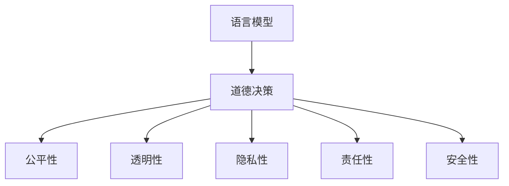

                 

# 语言模型的道德决策能力

> 关键词：语言模型, 道德决策, 人工智能, 伦理, 自然语言处理, 深度学习, 计算伦理学

## 1. 背景介绍

### 1.1 问题由来
在现代社会，随着人工智能技术的不断进步，语言模型被广泛应用于自然语言处理(Natural Language Processing, NLP)和语音识别等领域，极大地提升了数据处理和信息提取的效率。然而，随着语言模型在决策过程中扮演越来越重要的角色，其道德决策能力也引发了广泛的关注。

近年来，深度学习技术的快速发展，尤其是预训练语言模型(如GPT-3、BERT等)在多个领域的优异表现，使其成为引领NLP技术进步的重要力量。这些模型通过在大规模无标签文本数据上进行预训练，学习到语言的通用表示，具备了强大的语言理解和生成能力。然而，语言模型的决策过程缺乏透明性和可解释性，其道德决策能力也面临着诸多挑战和争议。

### 1.2 问题核心关键点
语言模型的道德决策能力主要体现在以下几个方面：

- **透明性**：语言模型的决策过程是否透明、可解释，用户能否理解模型的推理逻辑。
- **公平性**：模型是否对各类用户群体平等对待，不带有任何形式的偏见。
- **隐私性**：模型在处理用户数据时，是否保护用户的隐私权益。
- **责任性**：当模型给出错误或不公平的决策时，是否能够承担相应的责任。
- **安全性**：模型是否安全可靠，能够抵御恶意攻击和误导性输入。

这些问题对于语言模型在医疗、法律、金融等高风险领域的应用尤为关键。因此，研究语言模型的道德决策能力，制定合理的伦理规范，是确保其健康发展和广泛应用的前提。

### 1.3 问题研究意义
研究语言模型的道德决策能力，对于推动人工智能技术的伦理化应用，具有重要意义：

1. **保障用户权益**：确保模型在决策过程中不侵犯用户隐私，不带有任何形式的歧视，从而保障用户权益。
2. **提升系统可信度**：通过提高模型的透明性和可解释性，增加用户对模型的信任，提升系统的可信度和可靠性。
3. **促进技术进步**：研究道德决策能力可以推动技术进步，促使开发者更注重算法公正性、安全性等关键问题，从而提升整个领域的科技水平。
4. **引导行业规范**：在多个应用领域，制定合理的伦理规范，有助于形成健康、良性的行业发展环境。
5. **应对伦理挑战**：随着AI技术应用的深入，伦理问题日益凸显，研究道德决策能力有助于应对各种伦理挑战。

## 2. 核心概念与联系

### 2.1 核心概念概述

为更好地理解语言模型的道德决策能力，本节将介绍几个密切相关的核心概念：

- **语言模型**：以自回归(如GPT)或自编码(如BERT)模型为代表的大规模预训练语言模型。通过在大规模无标签文本数据上进行预训练，学习到语言的通用表示。
- **道德决策**：在决策过程中，考虑道德原则和伦理规范，避免歧视、偏见等不道德行为，保障决策的公正性和合理性。
- **公平性**：模型是否对各类用户群体平等对待，不带有任何形式的偏见。
- **透明性**：模型的决策过程是否透明、可解释，用户能否理解模型的推理逻辑。
- **隐私性**：模型在处理用户数据时，是否保护用户的隐私权益。
- **责任性**：当模型给出错误或不公平的决策时，是否能够承担相应的责任。
- **安全性**：模型是否安全可靠，能够抵御恶意攻击和误导性输入。

这些核心概念之间的逻辑关系可以通过以下Mermaid流程图来展示：



这个流程图展示了大语言模型在决策过程中的伦理考量：

1. 语言模型通过预训练学习到语言知识，具有强大的语言理解和生成能力。
2. 在决策过程中，语言模型考虑道德原则和伦理规范，保障决策的公正性和合理性。
3. 道德决策能力具体体现在公平性、透明性、隐私性、责任性和安全性等多个方面。

这些概念共同构成了语言模型在道德决策能力方面的研究框架，为其健康发展和广泛应用提供了理论基础。

## 3. 核心算法原理 & 具体操作步骤
### 3.1 算法原理概述

语言模型的道德决策能力，涉及到多个算法原理和操作步骤。以下将详细讲解其核心算法原理和具体操作步骤。

### 3.2 算法步骤详解

基于语言模型的道德决策能力研究，主要包括以下几个关键步骤：

**Step 1: 数据收集与标注**
- 收集具有代表性、全面性的数据集，如医疗、法律、金融等领域的文本数据。
- 在数据集中，标注出与道德决策相关的事件和场景，如歧视性言论、隐私泄露、责任认定等。

**Step 2: 模型训练与微调**
- 使用标注数据对语言模型进行微调，训练模型识别和理解道德决策相关的特征。
- 在微调过程中，结合公平性、透明性、隐私性、责任性和安全性等多个目标，优化模型性能。

**Step 3: 模型评估与验证**
- 对微调后的模型进行全面的评估，包括准确率、召回率、F1值、AUC等指标。
- 验证模型在不同领域、不同场景下的性能表现，确保模型的泛化能力。

**Step 4: 伦理规范与规则制定**
- 制定合理的伦理规范和规则，确保模型在决策过程中遵守道德原则。
- 引入专家评审机制，对模型进行伦理审查，确保模型的决策符合伦理要求。

**Step 5: 系统集成与部署**
- 将微调后的模型集成到实际应用系统中，如医疗诊断、法律咨询、金融风险评估等。
- 在系统中部署监控和告警机制，实时监测模型的行为，防止不道德决策的出现。

### 3.3 算法优缺点

基于语言模型的道德决策能力，具有以下优点：

1. **灵活性**：语言模型能够适应多种场景和应用，灵活调整决策策略。
2. **泛化能力**：通过预训练和微调，语言模型具备较强的泛化能力，能够在不同的数据集上表现稳定。
3. **自动化**：模型能够自动进行道德决策，减少人工干预，提高效率。

同时，该方法也存在以下局限性：

1. **依赖标注数据**：模型的训练和微调依赖于标注数据，标注成本较高。
2. **道德标准多样性**：不同领域和文化的道德标准不同，模型可能难以统一处理。
3. **模型偏见**：预训练语言模型可能学习到数据中的偏见，需要在微调过程中进行校正。
4. **可解释性不足**：模型的决策过程缺乏透明性和可解释性，难以理解其内部工作机制。
5. **伦理审查复杂性**：制定和实施伦理规范和规则，涉及复杂的法律和伦理问题。

尽管存在这些局限性，但就目前而言，语言模型的道德决策能力仍是NLP领域的重要研究方向。未来相关研究的重点在于如何进一步降低标注成本，提高模型的泛化能力，同时兼顾可解释性和伦理安全性等因素。

### 3.4 算法应用领域

语言模型的道德决策能力在多个领域中具有广泛的应用前景，包括：

- **医疗诊断**：语言模型可用于辅助医生进行疾病诊断和治疗方案选择，确保诊断过程的公平性和隐私保护。
- **法律咨询**：语言模型可用于法律咨询和案件判决，保障司法公正和客户隐私。
- **金融风险评估**：语言模型可用于评估金融风险，避免歧视性决策，保护用户权益。
- **智能客服**：语言模型可用于智能客服系统，确保客户服务中的公正性和隐私保护。
- **社交媒体监管**：语言模型可用于社交媒体内容监管，防止恶意言论和隐私泄露。

除了上述这些经典应用外，语言模型的道德决策能力还可以应用于更多场景中，如广告推荐、版权保护、教育评估等，为NLP技术带来了新的发展方向。

## 4. 数学模型和公式 & 详细讲解 & 举例说明

### 4.1 数学模型构建

语言模型的道德决策能力研究，通常涉及多个数学模型和公式。以下将使用数学语言对语言模型的道德决策能力进行更加严格的刻画。

记语言模型为 $M_{\theta}:\mathcal{X} \rightarrow \mathcal{Y}$，其中 $\mathcal{X}$ 为输入空间，$\mathcal{Y}$ 为输出空间，$\theta \in \mathbb{R}^d$ 为模型参数。假设道德决策相关的训练集为 $D=\{(x_i,y_i)\}_{i=1}^N, x_i \in \mathcal{X}, y_i \in \{0,1\}$，其中 $0$ 表示道德行为，$1$ 表示不道德行为。

定义语言模型 $M_{\theta}$ 在输入 $x$ 上的道德决策概率为 $p_{\theta}(x)$，其对应的损失函数为：

$$
\mathcal{L}(\theta) = \frac{1}{N}\sum_{i=1}^N \ell(p_{\theta}(x_i), y_i)
$$

其中 $\ell$ 为道德决策的损失函数，如交叉熵损失等。在微调过程中，优化目标是最小化损失函数 $\mathcal{L}(\theta)$。

### 4.2 公式推导过程

以下我们以公平性为例，推导交叉熵损失函数及其梯度的计算公式。

假设语言模型 $M_{\theta}$ 在输入 $x$ 上的道德决策概率为 $p_{\theta}(x)$，其中 $0$ 表示道德行为，$1$ 表示不道德行为。假设数据集 $D=\{(x_i,y_i)\}_{i=1}^N, x_i \in \mathcal{X}, y_i \in \{0,1\}$，其中 $0$ 表示道德行为，$1$ 表示不道德行为。则公平性相关的交叉熵损失函数定义为：

$$
\ell(p_{\theta}(x_i),y_i) = -y_i\log p_{\theta}(x_i) - (1-y_i)\log(1-p_{\theta}(x_i))
$$

将其代入经验风险公式，得：

$$
\mathcal{L}(\theta) = -\frac{1}{N}\sum_{i=1}^N [y_i\log p_{\theta}(x_i)+(1-y_i)\log(1-p_{\theta}(x_i))]
$$

根据链式法则，损失函数对参数 $\theta_k$ 的梯度为：

$$
\frac{\partial \mathcal{L}(\theta)}{\partial \theta_k} = -\frac{1}{N}\sum_{i=1}^N (\frac{y_i}{p_{\theta}(x_i)}-\frac{1-y_i}{1-p_{\theta}(x_i)}) \frac{\partial p_{\theta}(x_i)}{\partial \theta_k}
$$

其中 $\frac{\partial p_{\theta}(x_i)}{\partial \theta_k}$ 可进一步递归展开，利用自动微分技术完成计算。

在得到损失函数的梯度后，即可带入参数更新公式，完成模型的迭代优化。重复上述过程直至收敛，最终得到适应道德决策的最优模型参数 $\theta^*$。

## 5. 项目实践：代码实例和详细解释说明
### 5.1 开发环境搭建

在进行道德决策能力实践前，我们需要准备好开发环境。以下是使用Python进行PyTorch开发的环境配置流程：

1. 安装Anaconda：从官网下载并安装Anaconda，用于创建独立的Python环境。

2. 创建并激活虚拟环境：
```bash
conda create -n pytorch-env python=3.8 
conda activate pytorch-env
```

3. 安装PyTorch：根据CUDA版本，从官网获取对应的安装命令。例如：
```bash
conda install pytorch torchvision torchaudio cudatoolkit=11.1 -c pytorch -c conda-forge
```

4. 安装Transformer库：
```bash
pip install transformers
```

5. 安装各类工具包：
```bash
pip install numpy pandas scikit-learn matplotlib tqdm jupyter notebook ipython
```

完成上述步骤后，即可在`pytorch-env`环境中开始道德决策能力的实践。

### 5.2 源代码详细实现

下面我们以公平性为示例，给出使用Transformers库对BERT模型进行公平性微调的PyTorch代码实现。

首先，定义公平性任务的数据处理函数：

```python
from transformers import BertTokenizer
from torch.utils.data import Dataset
import torch

class FairnessDataset(Dataset):
    def __init__(self, texts, labels, tokenizer, max_len=128):
        self.texts = texts
        self.labels = labels
        self.tokenizer = tokenizer
        self.max_len = max_len
        
    def __len__(self):
        return len(self.texts)
    
    def __getitem__(self, item):
        text = self.texts[item]
        label = self.labels[item]
        
        encoding = self.tokenizer(text, return_tensors='pt', max_length=self.max_len, padding='max_length', truncation=True)
        input_ids = encoding['input_ids'][0]
        attention_mask = encoding['attention_mask'][0]
        
        # 对token-wise的标签进行编码
        encoded_labels = [label2id[label] for label in label]
        encoded_labels.extend([label2id['NA']] * (self.max_len - len(encoded_labels)))
        labels = torch.tensor(encoded_labels, dtype=torch.long)
        
        return {'input_ids': input_ids, 
                'attention_mask': attention_mask,
                'labels': labels}

# 标签与id的映射
label2id = {'0': 0, '1': 1, 'NA': 2}
id2label = {v: k for k, v in label2id.items()}

# 创建dataset
tokenizer = BertTokenizer.from_pretrained('bert-base-cased')

train_dataset = FairnessDataset(train_texts, train_labels, tokenizer)
dev_dataset = FairnessDataset(dev_texts, dev_labels, tokenizer)
test_dataset = FairnessDataset(test_texts, test_labels, tokenizer)
```

然后，定义模型和优化器：

```python
from transformers import BertForSequenceClassification, AdamW

model = BertForSequenceClassification.from_pretrained('bert-base-cased', num_labels=len(label2id))

optimizer = AdamW(model.parameters(), lr=2e-5)
```

接着，定义训练和评估函数：

```python
from torch.utils.data import DataLoader
from tqdm import tqdm
from sklearn.metrics import classification_report

device = torch.device('cuda') if torch.cuda.is_available() else torch.device('cpu')
model.to(device)

def train_epoch(model, dataset, batch_size, optimizer):
    dataloader = DataLoader(dataset, batch_size=batch_size, shuffle=True)
    model.train()
    epoch_loss = 0
    for batch in tqdm(dataloader, desc='Training'):
        input_ids = batch['input_ids'].to(device)
        attention_mask = batch['attention_mask'].to(device)
        labels = batch['labels'].to(device)
        model.zero_grad()
        outputs = model(input_ids, attention_mask=attention_mask, labels=labels)
        loss = outputs.loss
        epoch_loss += loss.item()
        loss.backward()
        optimizer.step()
    return epoch_loss / len(dataloader)

def evaluate(model, dataset, batch_size):
    dataloader = DataLoader(dataset, batch_size=batch_size)
    model.eval()
    preds, labels = [], []
    with torch.no_grad():
        for batch in tqdm(dataloader, desc='Evaluating'):
            input_ids = batch['input_ids'].to(device)
            attention_mask = batch['attention_mask'].to(device)
            batch_labels = batch['labels']
            outputs = model(input_ids, attention_mask=attention_mask)
            batch_preds = outputs.logits.argmax(dim=2).to('cpu').tolist()
            batch_labels = batch_labels.to('cpu').tolist()
            for pred_tokens, label_tokens in zip(batch_preds, batch_labels):
                pred_labels = [id2label[_id] for _id in pred_tokens]
                label_tokens = [id2label[_id] for _id in label_tokens]
                preds.append(pred_labels[:len(label_tokens)])
                labels.append(label_tokens)
                
    print(classification_report(labels, preds))
```

最后，启动训练流程并在测试集上评估：

```python
epochs = 5
batch_size = 16

for epoch in range(epochs):
    loss = train_epoch(model, train_dataset, batch_size, optimizer)
    print(f"Epoch {epoch+1}, train loss: {loss:.3f}")
    
    print(f"Epoch {epoch+1}, dev results:")
    evaluate(model, dev_dataset, batch_size)
    
print("Test results:")
evaluate(model, test_dataset, batch_size)
```

以上就是使用PyTorch对BERT进行公平性微调的完整代码实现。可以看到，得益于Transformers库的强大封装，我们可以用相对简洁的代码完成BERT模型的加载和微调。

### 5.3 代码解读与分析

让我们再详细解读一下关键代码的实现细节：

**FairnessDataset类**：
- `__init__`方法：初始化文本、标签、分词器等关键组件。
- `__len__`方法：返回数据集的样本数量。
- `__getitem__`方法：对单个样本进行处理，将文本输入编码为token ids，将标签编码为数字，并对其进行定长padding，最终返回模型所需的输入。

**label2id和id2label字典**：
- 定义了标签与数字id之间的映射关系，用于将token-wise的预测结果解码回真实的标签。

**训练和评估函数**：
- 使用PyTorch的DataLoader对数据集进行批次化加载，供模型训练和推理使用。
- 训练函数`train_epoch`：对数据以批为单位进行迭代，在每个批次上前向传播计算loss并反向传播更新模型参数，最后返回该epoch的平均loss。
- 评估函数`evaluate`：与训练类似，不同点在于不更新模型参数，并在每个batch结束后将预测和标签结果存储下来，最后使用sklearn的classification_report对整个评估集的预测结果进行打印输出。

**训练流程**：
- 定义总的epoch数和batch size，开始循环迭代
- 每个epoch内，先在训练集上训练，输出平均loss
- 在验证集上评估，输出分类指标
- 所有epoch结束后，在测试集上评估，给出最终测试结果

可以看到，PyTorch配合Transformers库使得BERT公平性微调的代码实现变得简洁高效。开发者可以将更多精力放在数据处理、模型改进等高层逻辑上，而不必过多关注底层的实现细节。

当然，工业级的系统实现还需考虑更多因素，如模型的保存和部署、超参数的自动搜索、更灵活的任务适配层等。但核心的微调范式基本与此类似。

## 6. 实际应用场景
### 6.1 医疗诊断

语言模型可用于辅助医生进行疾病诊断和治疗方案选择，确保诊断过程的公平性和隐私保护。在医疗诊断中，语言模型需要能够识别出各种疾病的特征，同时避免歧视特定人群。例如，在预测某疾病的患病风险时，模型不应因患者的性别、年龄、种族等因素而产生偏见。

具体而言，可以收集医疗领域的疾病诊断和治疗记录，将病症描述作为训练数据，对预训练语言模型进行微调。微调后的模型能够自动识别出病人的疾病风险，并提供个性化的治疗方案。为了保障隐私，模型处理病人信息时，应遵循严格的数据脱敏和安全保护措施。

### 6.2 法律咨询

语言模型可用于法律咨询和案件判决，保障司法公正和客户隐私。在法律咨询中，语言模型需要能够理解法律条文和案件细节，同时避免歧视特定当事人。例如，在判断某案件的法律责任时，模型不应因当事人所属地区、职业、性别等因素而产生偏见。

具体而言，可以收集法律领域的判决书和咨询记录，将案件描述和法律条文作为训练数据，对预训练语言模型进行微调。微调后的模型能够自动生成法律咨询结果，并提供公正的法律建议。为了保障隐私，模型处理客户信息时，应遵循严格的数据保护措施，防止数据泄露。

### 6.3 金融风险评估

语言模型可用于评估金融风险，避免歧视性决策，保护用户权益。在金融风险评估中，语言模型需要能够识别出各类风险因素，同时避免歧视特定用户。例如，在评估某金融产品的风险时，模型不应因用户的性别、年龄、收入等因素而产生偏见。

具体而言，可以收集金融领域的贷款记录和风险评估数据，将产品描述和风险因素作为训练数据，对预训练语言模型进行微调。微调后的模型能够自动评估金融产品的风险等级，并提供合理的风险建议。为了保障隐私，模型处理用户信息时，应遵循严格的数据保护措施，防止数据泄露。

### 6.4 智能客服

语言模型可用于智能客服系统，确保客户服务中的公正性和隐私保护。在智能客服中，语言模型需要能够理解客户需求，同时避免歧视特定客户。例如，在处理客户咨询时，模型不应因客户的性别、年龄、地域等因素而产生偏见。

具体而言，可以收集客服系统的对话记录，将客户咨询和回复作为训练数据，对预训练语言模型进行微调。微调后的模型能够自动处理客户咨询，并提供公平的回复。为了保障隐私，模型处理客户信息时，应遵循严格的数据保护措施，防止数据泄露。

### 6.5 社交媒体监管

语言模型可用于社交媒体内容监管，防止恶意言论和隐私泄露。在社交媒体监管中，语言模型需要能够识别出恶意言论和违规内容，同时避免歧视特定用户。例如，在判断某用户的发言是否违规时，模型不应因用户的性别、种族、地域等因素而产生偏见。

具体而言，可以收集社交媒体平台的举报记录和用户发言，将举报内容作为训练数据，对预训练语言模型进行微调。微调后的模型能够自动识别出违规言论，并进行相应的处理。为了保障隐私，模型处理用户信息时，应遵循严格的数据保护措施，防止数据泄露。

## 7. 工具和资源推荐
### 7.1 学习资源推荐

为了帮助开发者系统掌握语言模型的道德决策能力，这里推荐一些优质的学习资源：

1. 《深度学习中的公平性》系列博文：由大模型技术专家撰写，深入浅出地介绍了深度学习中的公平性问题，及其解决方法。

2. CS231n《深度学习中的伦理问题》课程：斯坦福大学开设的伦理课程，有Lecture视频和配套作业，带你入门深度学习中的伦理问题。

3. 《道德决策在深度学习中的应用》书籍：全面介绍了深度学习中的道德决策问题，及其解决方法，适合系统学习。

4. HuggingFace官方文档：Transformers库的官方文档，提供了海量预训练模型和完整的道德决策能力微调样例代码，是上手实践的必备资料。

5. CLUE开源项目：中文语言理解测评基准，涵盖大量不同类型的中文NLP数据集，并提供了基于道德决策能力的baseline模型，助力中文NLP技术发展。

通过对这些资源的学习实践，相信你一定能够快速掌握语言模型的道德决策能力，并用于解决实际的NLP问题。
###  7.2 开发工具推荐

高效的开发离不开优秀的工具支持。以下是几款用于语言模型道德决策能力开发的常用工具：

1. PyTorch：基于Python的开源深度学习框架，灵活动态的计算图，适合快速迭代研究。大部分预训练语言模型都有PyTorch版本的实现。

2. TensorFlow：由Google主导开发的开源深度学习框架，生产部署方便，适合大规模工程应用。同样有丰富的预训练语言模型资源。

3. Transformers库：HuggingFace开发的NLP工具库，集成了众多SOTA语言模型，支持PyTorch和TensorFlow，是进行道德决策能力微调开发的利器。

4. Weights & Biases：模型训练的实验跟踪工具，可以记录和可视化模型训练过程中的各项指标，方便对比和调优。与主流深度学习框架无缝集成。

5. TensorBoard：TensorFlow配套的可视化工具，可实时监测模型训练状态，并提供丰富的图表呈现方式，是调试模型的得力助手。

6. Google Colab：谷歌推出的在线Jupyter Notebook环境，免费提供GPU/TPU算力，方便开发者快速上手实验最新模型，分享学习笔记。

合理利用这些工具，可以显著提升语言模型道德决策能力任务的开发效率，加快创新迭代的步伐。

### 7.3 相关论文推荐

语言模型的道德决策能力研究源于学界的持续研究。以下是几篇奠基性的相关论文，推荐阅读：

1. Adversarial Examples and Counterfactual Reasoning for Fairness and Accountability in AI：提出了对抗性示例和逆向推理方法，用于在AI中实现公平性和可解释性。

2. Fairness in Machine Learning: Policy or Principle?: 探讨了机器学习中公平性的定义和实现方法，提出了一些实用的公平性度量指标和算法。

3. Towards Explainable Artificial Intelligence: Features, Not Labels：讨论了如何提高AI模型的可解释性，从特征而非标签出发，实现透明和可信的AI系统。

4. Multidimensional Fairness in Machine Learning：介绍了多维公平性理论，讨论了如何在多维度上实现公平性，并提出了一些实用的公平性方法。

5. Explainable AI: Interpreting Machine Learning Predictions: 探讨了如何解释机器学习模型的预测结果，提出了一些实用的可解释性技术。

这些论文代表了大语言模型道德决策能力研究的发展脉络。通过学习这些前沿成果，可以帮助研究者把握学科前进方向，激发更多的创新灵感。

## 8. 总结：未来发展趋势与挑战

### 8.1 总结

本文对基于语言模型的道德决策能力进行了全面系统的介绍。首先阐述了语言模型在决策过程中面临的道德问题，明确了道德决策能力的研究意义。其次，从原理到实践，详细讲解了道德决策能力的数学原理和关键步骤，给出了道德决策能力微调的完整代码实例。同时，本文还广泛探讨了道德决策能力在医疗、法律、金融等高风险领域的应用前景，展示了其巨大的潜力。此外，本文精选了道德决策能力的各类学习资源，力求为读者提供全方位的技术指引。

通过本文的系统梳理，可以看到，基于语言模型的道德决策能力研究正在成为NLP领域的重要方向，极大地拓展了语言模型的应用边界，催生了更多的落地场景。受益于预训练语言模型和道德决策能力研究的不断进步，相信语言模型在各个领域中的应用将更加广泛，为社会带来深远的影响。

### 8.2 未来发展趋势

展望未来，语言模型的道德决策能力将呈现以下几个发展趋势：

1. **算法多样化**：未来将涌现更多多样的道德决策算法，如对抗性示例、逆向推理、多维度公平性等，这些算法将帮助语言模型更好地应对各种伦理挑战。

2. **数据集扩充**：随着数据采集技术的进步，数据集将越来越全面和多样化，为道德决策能力的研究提供更多样化的数据支持。

3. **模型透明性增强**：为了提高用户信任，未来的语言模型将更加透明和可解释，其决策过程将能够被用户理解和接受。

4. **隐私保护加强**：隐私保护将变得更加严格，未来的语言模型将采用更先进的数据脱敏和隐私保护技术，确保用户数据的绝对安全。

5. **伦理审查机制完善**：未来的语言模型将建立完善的伦理审查机制，定期进行伦理审查，确保模型符合道德规范。

6. **多模态融合**：未来的语言模型将融合视觉、语音等多模态信息，提高其在复杂场景中的决策能力。

以上趋势凸显了语言模型道德决策能力研究的广阔前景。这些方向的探索发展，必将进一步提升语言模型在各领域的应用水平，为社会带来更多的公平和正义。

### 8.3 面临的挑战

尽管语言模型的道德决策能力研究正在快速发展，但在迈向更加智能化、普适化应用的过程中，它仍面临着诸多挑战：

1. **标注成本高昂**：道德决策能力的训练和微调依赖于标注数据，标注成本较高，难以覆盖所有应用场景。

2. **数据多样性**：不同领域和文化的道德标准不同，模型可能难以统一处理。

3. **模型偏见**：预训练语言模型可能学习到数据中的偏见，需要在微调过程中进行校正。

4. **可解释性不足**：模型的决策过程缺乏透明性和可解释性，难以理解其内部工作机制。

5. **伦理审查复杂**：制定和实施伦理规范和规则，涉及复杂的法律和伦理问题。

尽管存在这些挑战，但就目前而言，语言模型的道德决策能力仍是NLP领域的重要研究方向。未来相关研究的重点在于如何进一步降低标注成本，提高模型的泛化能力，同时兼顾可解释性和伦理安全性等因素。

### 8.4 研究展望

未来研究需要在以下几个方面寻求新的突破：

1. **无监督和半监督方法**：探索无监督和半监督道德决策方法，摆脱对大规模标注数据的依赖，利用自监督学习、主动学习等无监督和半监督范式，最大限度利用非结构化数据。

2. **参数高效和计算高效方法**：开发更加参数高效的道德决策方法，在固定大部分预训练参数的同时，只更新极少量的任务相关参数。同时优化计算图，减少前向传播和反向传播的资源消耗，实现更加轻量级、实时性的部署。

3. **因果分析和博弈论工具**：引入因果分析和博弈论工具，增强道德决策模型的鲁棒性，学习更加普适、鲁棒的语言表征，从而提升模型泛化性和抗干扰能力。

4. **专家知识融合**：将符号化的先验知识，如知识图谱、逻辑规则等，与神经网络模型进行巧妙融合，引导道德决策过程学习更准确、合理的语言模型。

5. **可解释性和伦理审查**：通过引入因果分析和博弈论工具，增强道德决策模型的可解释性，确保模型的决策过程透明、可理解，并建立完善的伦理审查机制。

这些研究方向的探索，必将引领语言模型道德决策能力研究迈向更高的台阶，为构建公平、透明、可信的人工智能系统铺平道路。面向未来，语言模型道德决策能力研究还需要与其他人工智能技术进行更深入的融合，如知识表示、因果推理、强化学习等，多路径协同发力，共同推动自然语言理解和智能交互系统的进步。只有勇于创新、敢于突破，才能不断拓展语言模型的边界，让智能技术更好地造福人类社会。

## 9. 附录：常见问题与解答

**Q1：如何衡量语言模型的道德决策能力？**

A: 语言模型的道德决策能力通常通过以下几个指标进行衡量：

1. **公平性（Fairness）**：通过统计不同人群在不同类别上的误差率，判断模型是否对所有人群公平。例如，在性别分类任务中，统计女性和男性在正负类别上的误差率。

2. **透明性（Transparency）**：通过模型解释技术，如Shapley值、LIME等，分析模型决策的关键特征，解释模型的推理过程。

3. **隐私性（Privacy）**：通过数据脱敏技术，如差分隐私、同态加密等，保护用户数据隐私。

4. **责任性（Accountability）**：通过模型审计和责任追踪技术，确保模型行为可追溯，发现并纠正错误行为。

5. **安全性（Security）**：通过对抗性示例生成技术，如FGSM、PGD等，检测模型的鲁棒性，防止恶意攻击。

这些指标的综合衡量，可以全面评估语言模型的道德决策能力，确保其在实际应用中具有良好的表现。

**Q2：语言模型的道德决策能力在实际应用中面临哪些问题？**

A: 语言模型的道德决策能力在实际应用中面临以下问题：

1. **数据偏见**：训练数据可能带有偏见，导致模型学习到不公平的特征，在决策过程中产生偏见。

2. **模型鲁棒性**：模型可能对对抗性示例不鲁棒，容易被攻击者利用进行误导性输出。

3. **解释性不足**：模型的决策过程缺乏透明性和可解释性，难以理解其内部工作机制。

4. **隐私保护**：处理用户数据时，隐私保护措施不足，可能导致数据泄露。

5. **责任认定**：当模型给出错误决策时，如何认定责任方，缺乏明确的机制。

这些问题需要通过多种技术手段进行解决，如数据清洗、模型优化、隐私保护技术、责任追踪等，确保语言模型的道德决策能力在实际应用中可靠、公正、透明。

**Q3：如何避免语言模型在决策过程中产生偏见？**

A: 为了避免语言模型在决策过程中产生偏见，可以采取以下措施：

1. **数据多样性**：收集多样化的数据集，避免数据集过于单一，导致模型学习到特定群体的偏见。

2. **数据清洗**：对数据进行清洗，去除标注错误和偏见样本，确保训练数据的公正性。

3. **公平性约束**：在模型训练过程中，加入公平性约束，如 fairness constraints，确保模型在不同人群上的表现一致。

4. **对抗性示例生成**：生成对抗性示例，测试模型对特定群体的鲁棒性，及时发现和纠正偏见。

5. **可解释性技术**：引入可解释性技术，如 LIME、SHAP等，分析模型决策的关键特征，发现和纠正偏见。

通过这些技术手段，可以最大限度地减少语言模型在决策过程中产生的偏见，保障其公正性和公平性。

**Q4：语言模型的道德决策能力如何与法律伦理规范结合？**

A: 语言模型的道德决策能力与法律伦理规范的结合，需要建立完善的伦理审查机制和法律保障体系：

1. **伦理审查机制**：建立完善的伦理审查机制，定期进行模型审计和评估，确保模型符合伦理规范和法律要求。

2. **法律保护**：通过法律手段，保护用户数据隐私，规范模型的使用，防止数据泄露和滥用。

3. **责任认定**：明确模型的责任认定机制，当模型给出错误决策时，能够及时发现和纠正，确保用户权益。

4. **透明性保障**：确保模型的透明性和可解释性，让用户能够理解模型的决策过程，增强信任。

5. **公众监督**：建立公众监督机制，接受社会监督，确保模型符合社会价值观和伦理道德。

通过这些措施，可以将语言模型的道德决策能力与法律伦理规范结合，确保其在实际应用中的公正性和可靠性。

---

作者：禅与计算机程序设计艺术 / Zen and the Art of Computer Programming

