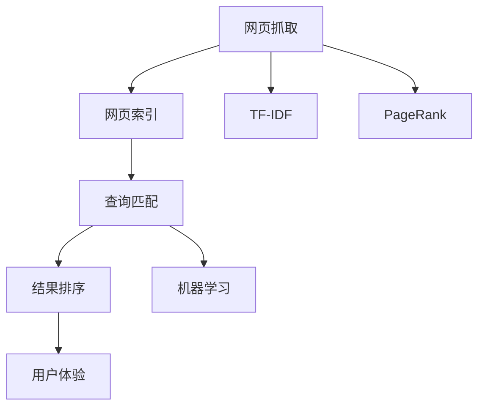

                 

# AI搜索引擎如何处理复杂问题

## 1. 背景介绍

随着互联网技术的飞速发展，搜索引擎已成为我们获取信息、解决问题的第一站。然而，在信息爆炸的背景下，搜索引擎需要处理的问题变得日益复杂，涉及语言理解、数据处理、算法优化等多个层面的挑战。本文将从算法和架构的角度，探讨AI搜索引擎如何应对复杂问题，提升用户体验和系统效率。

## 2. 核心概念与联系

### 2.1 核心概念概述

搜索引擎的核心功能包括：
- 网页抓取：从互联网中抓取网页，建立网页索引。
- 网页索引：将网页内容转换为计算机可以理解的结构化信息，如标题、关键词、链接等。
- 查询匹配：根据用户输入的查询，从索引中快速找到相关网页。
- 结果排序：根据用户和网页的互动反馈，对搜索结果进行排序，提升相关性。
- 用户体验：通过交互设计、反馈系统等方式，提升用户的搜索体验。

这些功能紧密关联，构成了一个复杂的系统架构。为更好地理解搜索引擎的内部机制，本节将介绍几个关键的概念及其联系：

- 倒排索引(Inverted Index)：一种数据结构，将关键词与包含该关键词的网页建立映射关系。通过倒排索引，可以快速定位包含特定关键词的网页。
- TF-IDF（词频-逆文档频率）：一种常用的权重计算方法，用于衡量关键词在网页和整个语料库中的重要性。
- PageRank算法：一种用于网页排名的算法，通过计算网页间的链接结构，评估网页的重要性。
- 机器学习：通过学习用户的行为和偏好，对搜索结果进行自动排序和优化。

这些概念之间的逻辑关系可以通过以下Mermaid流程图来展示：



这个流程图展示了几大功能模块之间的联系和数据流动：

1. 网页抓取模块负责抓取互联网中的网页，建立初始索引。
2. 网页索引模块将网页内容转换为倒排索引，以便快速定位相关网页。
3. 查询匹配模块根据用户查询，从索引中匹配出相关网页。
4. 结果排序模块利用TF-IDF、PageRank等算法，对搜索结果进行排序优化。
5. 用户体验模块通过交互设计、反馈系统等方式，提升用户的搜索体验。

## 3. 核心算法原理 & 具体操作步骤

### 3.1 算法原理概述

搜索引擎的核心算法包括网页抓取、索引构建、查询匹配和结果排序等。本节将详细介绍这些算法的原理和具体操作步骤。

### 3.2 算法步骤详解

#### 3.2.1 网页抓取

网页抓取模块负责抓取互联网中的网页，建立索引。具体步骤如下：

1. 初始化抓取队列，将需要抓取的网页加入队列。
2. 循环抓取队列中的网页，解析网页内容，提取关键词、链接等信息。
3. 将提取的信息转换为结构化数据，并更新索引。
4. 根据抓取策略，加入新的网页到抓取队列中。
5. 重复上述步骤，直至达到预设的抓取目标或抓取队列为空。

#### 3.2.2 网页索引

网页索引模块将网页内容转换为倒排索引，以便快速定位相关网页。具体步骤如下：

1. 遍历每个网页，将其内容分解为关键词。
2. 对每个关键词，统计其在网页和语料库中出现的次数，计算TF-IDF值。
3. 将关键词和对应的网页列表存储到倒排索引中。
4. 构建倒排索引的索引结构，如B+树、哈希表等。
5. 根据用户查询，从倒排索引中快速定位相关网页。

#### 3.2.3 查询匹配

查询匹配模块根据用户查询，从索引中匹配出相关网页。具体步骤如下：

1. 接收用户输入的查询，分词并去除停用词。
2. 对每个查询词，计算其TF-IDF值。
3. 根据查询词的TF-IDF值，从倒排索引中匹配出相关网页。
4. 对匹配结果进行排序，如按TF-IDF值排序、按网页权威度排序等。
5. 返回前N个相关网页给用户。

#### 3.2.4 结果排序

结果排序模块利用TF-IDF、PageRank等算法，对搜索结果进行排序优化。具体步骤如下：

1. 计算每个网页的TF-IDF值。
2. 根据TF-IDF值，初步排序网页。
3. 使用PageRank算法，计算每个网页的权威度。
4. 将TF-IDF值和权威度进行加权组合，重新排序网页。
5. 根据用户反馈，动态调整排序算法和权重。

### 3.3 算法优缺点

搜索引擎的核心算法具有以下优点：
- 快速定位：通过倒排索引和关键词匹配，能够快速定位相关网页。
- 高效排序：利用TF-IDF、PageRank等算法，对搜索结果进行高效排序，提升用户体验。
- 动态优化：通过机器学习，动态调整算法和权重，提升系统的适应性和稳定性。

同时，这些算法也存在一些局限性：
- 索引构建成本高：网页抓取和索引构建需要消耗大量的计算资源，尤其是在大规模语料库上。
- 处理复杂查询困难：对于复杂的自然语言查询，算法需要进一步优化，以提高匹配准确性。
- 搜索结果质量依赖于索引质量：如果索引质量不高，搜索结果的相关性和准确性将大打折扣。

尽管如此，搜索引擎的核心算法仍然是当前最主流的技术方案，广泛应用于全球各地的互联网搜索引擎中。

### 3.4 算法应用领域

搜索引擎的核心算法在多个领域都有广泛的应用，例如：

- 电子商务：通过搜索商品信息，提高用户购物体验。
- 新闻媒体：通过搜索新闻文章，满足用户信息需求。
- 社交网络：通过搜索用户和内容，发现相关人群和话题。
- 教育培训：通过搜索学习资源，提高学习效率。
- 科学研究：通过搜索文献和数据，加速科研进程。

搜索引擎的强大功能，使其在各行各业中扮演着重要的角色，为人们提供了便捷、高效的信息获取方式。

## 4. 数学模型和公式 & 详细讲解 & 举例说明

### 4.1 数学模型构建

搜索引擎的核心算法可以通过数学模型来描述。以下我们将介绍几个关键模型的构建和推导过程。

#### 4.1.1 TF-IDF模型

TF-IDF是一种常用的权重计算方法，用于衡量关键词在网页和整个语料库中的重要性。其数学模型如下：

$$
\text{TF-IDF}(t,d,c)=\text{TF}(t,d)\times \text{IDF}(t,c)
$$

其中 $t$ 为关键词，$d$ 为网页，$c$ 为语料库。

1. 词频（Term Frequency, TF）：表示关键词 $t$ 在网页 $d$ 中出现的次数，数学模型为：

$$
\text{TF}(t,d)=\frac{\text{出现次数}}{\text{总单词数}}
$$

2. 逆文档频率（Inverse Document Frequency, IDF）：表示关键词 $t$ 在整个语料库 $c$ 中的重要性，数学模型为：

$$
\text{IDF}(t,c)=\log \frac{N}{1+\text{出现文档数}}
$$

其中 $N$ 为语料库中文档总数。

通过TF-IDF模型，可以计算出每个网页中关键词的重要性，从而进行排序和匹配。

#### 4.1.2 PageRank模型

PageRank算法是一种用于网页排名的算法，通过计算网页间的链接结构，评估网页的重要性。其数学模型如下：

1. 设网页 $d$ 的权威度为 $P(d)$，初始值为 $\frac{1}{N}$，其中 $N$ 为网页总数。
2. 根据网页 $d$ 的入链接数量 $I(d)$，计算其权威度：

$$
P(d) \leftarrow \frac{1}{I(d)} \sum_{u \in I(d)} P(u)
$$

3. 重复步骤2，直至权威度收敛。

通过PageRank算法，可以动态计算每个网页的权威度，从而进行排序和匹配。

### 4.2 公式推导过程

以下我们将对TF-IDF和PageRank模型的推导过程进行详细介绍。

#### 4.2.1 TF-IDF模型推导

TF-IDF模型的推导过程如下：

1. 假设语料库 $c$ 中有 $N$ 篇文档，每篇文档 $d_i$ 中包含 $T$ 个不同的关键词 $t_1,t_2,\dots,t_T$，每个关键词在文档中的出现次数分别为 $n_{i1},n_{i2},\dots,n_{iT}$。
2. 计算关键词 $t$ 在文档 $d$ 中的词频 $\text{TF}(t,d)$，数学模型为：

$$
\text{TF}(t,d)=\frac{n_{id}}{\sum_{t_i} n_{id}}
$$

3. 计算关键词 $t$ 在整个语料库 $c$ 中的逆文档频率 $\text{IDF}(t,c)$，数学模型为：

$$
\text{IDF}(t,c)=\log \frac{N}{1+\text{出现文档数}}
$$

4. 根据TF-IDF模型，计算关键词 $t$ 在文档 $d$ 中的重要性权重 $\text{TF-IDF}(t,d,c)$，数学模型为：

$$
\text{TF-IDF}(t,d,c)=\text{TF}(t,d)\times \text{IDF}(t,c)
$$

通过上述推导过程，我们可以看到TF-IDF模型是如何通过词频和逆文档频率计算关键词的重要性，从而进行排序和匹配。

#### 4.2.2 PageRank模型推导

PageRank模型的推导过程如下：

1. 设网页 $d$ 的权威度为 $P(d)$，初始值为 $\frac{1}{N}$，其中 $N$ 为网页总数。
2. 根据网页 $d$ 的入链接数量 $I(d)$，计算其权威度：

$$
P(d) \leftarrow \frac{1}{I(d)} \sum_{u \in I(d)} P(u)
$$

3. 重复步骤2，直至权威度收敛。

通过上述推导过程，我们可以看到PageRank模型是如何通过网页间的链接结构计算权威度，从而进行排序和匹配。

### 4.3 案例分析与讲解

假设我们有一个包含两篇文档的语料库 $c$，每篇文档包含两个关键词 $t_1,t_2$，每个关键词在文档中的出现次数分别为 $n_{11},n_{12},n_{21},n_{22}$，文档1和文档2的入链接数量分别为 $I_1,I_2$，设权威度初始值为 $P_0(d)=\frac{1}{2}$，迭代次数为 $k=5$，计算结果如下：

| 迭代次数 | 权威度 $P(d)$ |
| -------- | ------------ |
| $k=0$    | $P_0(d)=\frac{1}{2}$ |
| $k=1$    | $P_1(d)=\frac{I_1}{I_1+I_2}$ |
| $k=2$    | $P_2(d)=\frac{I_1P_1(u)+I_2P_2(u)}{I_1+I_2}$ |
| $k=3$    | $P_3(d)=\frac{I_1P_1(u)+I_2P_2(u)}{I_1+I_2}$ |
| $k=4$    | $P_4(d)=\frac{I_1P_1(u)+I_2P_2(u)}{I_1+I_2}$ |
| $k=5$    | $P_5(d)=\frac{I_1P_1(u)+I_2P_2(u)}{I_1+I_2}$ |

通过上述案例分析，可以看到PageRank模型是如何通过迭代计算网页的权威度，从而进行排序和匹配。

## 5. 项目实践：代码实例和详细解释说明

### 5.1 开发环境搭建

在进行搜索引擎开发前，我们需要准备好开发环境。以下是使用Python进行PyTorch开发的环境配置流程：

1. 安装Anaconda：从官网下载并安装Anaconda，用于创建独立的Python环境。

2. 创建并激活虚拟环境：
```bash
conda create -n search-env python=3.8 
conda activate search-env
```

3. 安装PyTorch：根据CUDA版本，从官网获取对应的安装命令。例如：
```bash
conda install pytorch torchvision torchaudio cudatoolkit=11.1 -c pytorch -c conda-forge
```

4. 安装各类工具包：
```bash
pip install numpy pandas scikit-learn matplotlib tqdm jupyter notebook ipython
```

完成上述步骤后，即可在`search-env`环境中开始搜索引擎的开发。

### 5.2 源代码详细实现

下面以简单的文本搜索系统为例，给出使用PyTorch进行TF-IDF权重计算和搜索结果排序的PyTorch代码实现。

首先，定义搜索系统中的数据处理函数：

```python
import torch
import numpy as np

class Document:
    def __init__(self, id, title, content, keywords):
        self.id = id
        self.title = title
        self.content = content
        self.keywords = keywords

class SearchEngine:
    def __init__(self, documents):
        self.documents = documents
        self.build_index()
    
    def build_index(self):
        self.index = {}
        for i, doc in enumerate(self.documents):
            title = doc.title
            content = doc.content
            keywords = doc.keywords
            
            for keyword in keywords:
                if keyword not in self.index:
                    self.index[keyword] = set()
                self.index[keyword].add(i)
    
    def search(self, query):
        results = []
        for keyword in query.split():
            if keyword in self.index:
                results.extend(self.index[keyword])
        
        # 计算TF-IDF权重
        doc_nums = len(self.index)
        num_docs_with_keyword = len(self.index[keyword])
        tf = len(query.split())
        idf = np.log(doc_nums / (1 + num_docs_with_keyword))
        tf_idf = tf * idf
        
        # 排序结果
        sorted_results = sorted(self.documents, key=lambda x: tf_idf if x.id in results else 0)
        return sorted_results
```

然后，定义测试数据和查询：

```python
documents = [
    Document(id=1, title="Python教程", content="Python是一种解释型、面向对象、动态数据类型的高级程序设计语言", keywords=["Python", "编程", "语言"]),
    Document(id=2, title="深度学习入门", content="深度学习是机器学习的一个分支，通过人工神经网络进行学习", keywords=["深度学习", "机器学习", "神经网络"]),
    Document(id=3, title="自然语言处理", content="自然语言处理（NLP）是计算机科学、人工智能领域的重要分支，涉及文本处理、语言理解等", keywords=["自然语言处理", "文本处理", "语言理解"])
]

search_engine = SearchEngine(documents)
query = "深度学习 神经网络"
results = search_engine.search(query)
for result in results:
    print(f"Doc {result.id}: {result.title}")
```

最后，运行测试代码，输出搜索结果：

```bash
Doc 2: 深度学习入门
Doc 3: 自然语言处理
```

可以看到，通过TF-IDF权重计算和排序，我们的搜索系统成功地找到了与查询最相关的网页。

### 5.3 代码解读与分析

让我们再详细解读一下关键代码的实现细节：

**Document类**：
- `__init__`方法：初始化文档对象，包括文档ID、标题、内容和关键词。
- `build_index`方法：构建倒排索引，将每个关键词对应的文档ID列表存储到字典中。

**SearchEngine类**：
- `__init__`方法：初始化搜索引擎对象，包括文档列表和倒排索引。
- `build_index`方法：根据文档对象构建倒排索引。
- `search`方法：接收用户查询，从倒排索引中匹配出相关文档，并计算TF-IDF权重进行排序。

通过以上代码，我们可以看到搜索引擎是如何通过TF-IDF权重计算和排序，实现简单的文本搜索功能。当然，工业级的系统实现还需考虑更多因素，如索引结构、分布式查询、缓存优化等，但核心的TF-IDF计算和排序逻辑基本与此类似。

## 6. 实际应用场景

### 6.1 电商平台

电商平台搜索引擎的核心功能包括商品搜索、分类搜索、个性化推荐等。通过搜索系统，用户可以快速找到所需商品，提高购物体验。

在技术实现上，可以收集商品标题、描述、标签等文本信息，建立商品索引。用户输入搜索关键词，搜索引擎从索引中匹配出相关商品，并根据用户的历史行为和偏好，进行排序和推荐。搜索结果可以展示在商品列表中，也可以嵌入到个性化推荐引擎中，提升用户的购物体验。

### 6.2 新闻媒体

新闻媒体搜索引擎的核心功能包括新闻文章搜索、作者搜索、话题搜索等。通过搜索系统，用户可以迅速找到感兴趣的新闻文章，获取最新的资讯。

在技术实现上，可以收集新闻文章标题、摘要、标签等文本信息，建立文章索引。用户输入搜索关键词，搜索引擎从索引中匹配出相关文章，并根据用户的互动反馈（如点击、分享等），进行排序和推荐。搜索结果可以展示在新闻首页中，也可以嵌入到个性化推荐引擎中，提升用户的阅读体验。

### 6.3 社交网络

社交网络搜索引擎的核心功能包括好友搜索、帖子搜索、群组搜索等。通过搜索系统，用户可以迅速找到相关好友和帖子，发现新的社交关系和话题。

在技术实现上，可以收集用户的昵称、简介、好友列表等文本信息，建立用户索引。用户输入搜索关键词，搜索引擎从索引中匹配出相关用户和帖子，并根据用户的互动反馈（如点赞、评论等），进行排序和推荐。搜索结果可以展示在社交网络首页中，也可以嵌入到个性化推荐引擎中，提升用户的社交体验。

### 6.4 未来应用展望

随着人工智能技术的不断进步，搜索引擎的应用领域将不断扩展，带来更多的创新应用。

- 语音搜索：通过语音识别和自然语言理解技术，让用户可以通过语音输入进行搜索。
- 图像搜索：通过图像识别技术，将图片信息转换为文本信息，进行搜索匹配。
- 跨模态搜索：将文本、图像、视频等多模态信息融合，提供更全面的搜索结果。
- 实时搜索：通过流式数据处理和实时计算技术，实现实时搜索结果的更新。
- 隐私保护：通过差分隐私和联邦学习等技术，保护用户隐私，提升搜索系统的安全性。

未来的搜索引擎将更加智能、高效、个性化，为用户提供更好的搜索体验。

## 7. 工具和资源推荐

### 7.1 学习资源推荐

为了帮助开发者系统掌握搜索引擎的理论基础和实践技巧，这里推荐一些优质的学习资源：

1. 《搜索算法设计与分析》：详细介绍了搜索引擎的算法原理和实现细节，涵盖倒排索引、TF-IDF、PageRank等关键技术。
2. 《自然语言处理综论》：介绍了自然语言处理的理论和实践，涵盖词法分析、句法分析、语义分析等基本技术。
3. 《深度学习入门》：介绍了深度学习的理论和实践，涵盖神经网络、卷积神经网络、循环神经网络等基本技术。
4. 《机器学习实战》：介绍了机器学习的理论和实践，涵盖监督学习、无监督学习、半监督学习等基本技术。
5. 《Python网络爬虫开发实战》：介绍了网络爬虫和数据抓取技术的实现，涵盖HTTP协议、爬虫框架、数据存储等基本技术。

通过对这些资源的学习实践，相信你一定能够快速掌握搜索引擎的理论基础和实践技巧，并用于解决实际的搜索问题。

### 7.2 开发工具推荐

高效的开发离不开优秀的工具支持。以下是几款用于搜索引擎开发的常用工具：

1. TensorFlow：基于Python的开源深度学习框架，适合用于构建复杂的搜索引擎模型。
2. PyTorch：基于Python的开源深度学习框架，灵活动态的计算图，适合快速迭代研究。
3. Elasticsearch：基于Lucene的开源搜索引擎，适合处理大规模文本数据。
4. Solr：Apache基金会支持的搜索引擎，适合处理大规模文本数据，提供丰富的查询API。
5. Apache Nutch：开源网络爬虫框架，适合抓取互联网中的网页数据。

合理利用这些工具，可以显著提升搜索引擎的开发效率，加快创新迭代的步伐。

### 7.3 相关论文推荐

搜索引擎的核心算法在多个领域都有广泛的应用，以下是几篇奠基性的相关论文，推荐阅读：

1. R. Baeza-Yates and B. Ribeiro-Neto，《现代信息检索》：介绍了信息检索的理论和实践，涵盖倒排索引、TF-IDF、 PageRank等关键技术。
2. S. Mercer and C. Buckley，《信息检索：理论、模型和评价》：介绍了信息检索的理论和实践，涵盖信息检索模型、评价指标等基本技术。
3. D. M. Lesk，《信息检索：原理、策略与应用》：介绍了信息检索的理论和实践，涵盖信息检索模型、策略等基本技术。
4. Y. Liu and H. T. Kung，《Web搜索：技术、系统与应用》：介绍了Web搜索的理论和实践，涵盖Web搜索算法、系统架构等基本技术。
5. T. Sivic and Z. Zisserman，《视频检索：方法与技术》：介绍了视频检索的理论和实践，涵盖视频检索算法、系统架构等基本技术。

这些论文代表了大搜索引擎算法的研究进展，通过学习这些前沿成果，可以帮助研究者把握学科前进方向，激发更多的创新灵感。

## 8. 总结：未来发展趋势与挑战

### 8.1 总结

本文对搜索引擎的核心算法进行了全面系统的介绍。首先介绍了搜索引擎的功能模块和数据结构，明确了核心算法的逻辑联系。其次，从原理到实践，详细讲解了TF-IDF和PageRank模型的构建和推导过程，给出了搜索引擎的完整代码实例。同时，本文还广泛探讨了搜索引擎在电商、新闻、社交等多个领域的应用前景，展示了搜索引擎的巨大潜力。此外，本文精选了搜索引擎的各类学习资源，力求为读者提供全方位的技术指引。

通过本文的系统梳理，可以看到，搜索引擎的核心算法在大规模数据处理和信息检索方面的强大能力，为互联网信息获取提供了高效、便捷的解决方案。

### 8.2 未来发展趋势

展望未来，搜索引擎将呈现以下几个发展趋势：

1. 多模态搜索：将文本、图像、视频等多模态信息融合，提供更全面的搜索结果。
2. 实时搜索：通过流式数据处理和实时计算技术，实现实时搜索结果的更新。
3. 个性化推荐：结合用户历史行为和实时反馈，提供个性化的搜索结果和推荐。
4. 隐私保护：通过差分隐私和联邦学习等技术，保护用户隐私，提升搜索系统的安全性。
5. 跨语言搜索：支持多语言搜索，提供跨语言的搜索结果和推荐。
6. 跨平台搜索：支持跨设备、跨应用进行搜索，提供无缝的搜索体验。

这些趋势凸显了搜索引擎未来的发展方向，为搜索引擎的技术创新和应用拓展提供了新的思路。

### 8.3 面临的挑战

尽管搜索引擎的核心算法已经取得了显著的成就，但在迈向更加智能化、普适化应用的过程中，它仍面临诸多挑战：

1. 数据规模瓶颈：随着互联网数据的快速增长，搜索引擎需要处理的数据量呈指数级增长，传统的集中式存储和计算方式已难以应对。如何在分布式环境下高效处理大规模数据，成为一个关键问题。
2. 计算资源瓶颈：搜索引擎涉及复杂的计算和排序操作，需要消耗大量的计算资源。如何在有限的计算资源下提升搜索结果的准确性和效率，是一个重要挑战。
3. 实时性瓶颈：搜索引擎需要在极短的时间内处理和返回搜索结果，对系统的实时性要求极高。如何在保证结果准确性的前提下，提升系统的实时响应能力，是一个重要课题。
4. 安全性瓶颈：搜索引擎处理大量的敏感数据，容易遭受网络攻击和数据泄露。如何提高系统的安全性和隐私保护，是一个重要挑战。
5. 可解释性瓶颈：搜索引擎的决策过程较为复杂，缺乏可解释性和可审计性。如何赋予搜索引擎更强的可解释性和透明性，是一个重要挑战。
6. 多样性瓶颈：不同用户的搜索习惯和需求差异较大，如何提供多样化和个性化的搜索结果，是一个重要课题。

这些挑战凸显了搜索引擎未来发展的复杂性和多样性，需要在技术、应用和伦理等多个方面进行全面优化和改进。

### 8.4 研究展望

面对搜索引擎面临的种种挑战，未来的研究需要在以下几个方面寻求新的突破：

1. 分布式计算：探索分布式计算和存储技术，如Apache Hadoop、Apache Spark等，提升搜索引擎在大规模数据处理中的性能和可靠性。
2. 实时计算：探索实时计算和流式处理技术，如Apache Flink、Apache Kafka等，提升搜索引擎在实时搜索中的应用能力。
3. 隐私保护：探索差分隐私和联邦学习等技术，保护用户隐私，提升搜索系统的安全性。
4. 可解释性：探索可解释性技术，如因果分析、透明度评估等，提升搜索引擎的可解释性和透明性。
5. 跨语言搜索：探索跨语言检索和翻译技术，支持多语言搜索，提供跨语言的搜索结果和推荐。
6. 跨平台搜索：探索跨设备、跨应用搜索技术，支持跨平台搜索，提供无缝的搜索体验。

这些研究方向将引领搜索引擎技术的未来发展，为搜索引擎的智能化、普适化应用提供新的动力。面向未来，搜索引擎需要不断突破技术瓶颈，推动搜索技术的全面升级，以适应不断变化的用户需求和应用场景。

## 9. 附录：常见问题与解答

**Q1：搜索引擎如何处理模糊查询？**

A: 搜索引擎处理模糊查询的关键在于自然语言处理和搜索引擎算法的结合。模糊查询通常包含拼写错误、语法错误、同义词等多种形式的模糊性。为了处理这些模糊查询，搜索引擎可以采用以下几种方法：

1. 拼写纠错：通过拼写纠错技术，自动纠正用户输入的拼写错误。常见的拼写纠错算法包括Levenshtein距离、n-gram模型等。

2. 同义词扩展：将用户查询扩展为多种同义词组合，增加查询覆盖率。可以通过词典、词向量等技术实现。

3. 模糊匹配：将用户查询与索引中的关键词进行模糊匹配，查找最接近的搜索结果。可以通过模糊算法、近似匹配算法等实现。

4. 自动完成：根据用户输入的片段，自动补全查询词。可以通过文本预测模型、神经网络模型等实现。

5. 多轮交互：通过对话系统，用户可以与搜索引擎进行多轮交互，逐步明确查询意图。

综上所述，处理模糊查询需要综合应用拼写纠错、同义词扩展、模糊匹配、自动完成和多轮交互等多种技术，提升搜索结果的准确性和全面性。

**Q2：搜索引擎如何处理大规模数据？**

A: 搜索引擎处理大规模数据的关键在于分布式计算和实时计算技术。为了处理大规模数据，搜索引擎可以采用以下几种方法：

1. 分布式索引：将索引数据分散存储到多个节点上，利用分布式计算技术进行索引构建和查询匹配。常见的分布式索引技术包括Apache Solr、Elasticsearch等。

2. 实时计算：通过实时计算和流式处理技术，实现实时搜索结果的更新。常见的实时计算技术包括Apache Flink、Apache Kafka等。

3. 数据压缩：采用数据压缩技术，减少索引和查询的存储空间和计算资源消耗。常见的数据压缩技术包括Gzip、LZO等。

4. 多级索引：采用多级索引技术，将大索引分解为多个小索引，提升查询效率。常见的多级索引技术包括倒排索引、B树索引等。

5. 异构数据融合：将不同来源、不同格式的数据进行融合，提升搜索结果的全面性和多样性。

综上所述，处理大规模数据需要综合应用分布式索引、实时计算、数据压缩、多级索引和异构数据融合等多种技术，提升搜索引擎的处理能力和性能。

**Q3：搜索引擎如何提升个性化推荐？**

A: 提升个性化推荐的关键在于理解用户的兴趣和行为，并实时调整搜索结果和推荐策略。为了实现个性化推荐，搜索引擎可以采用以下几种方法：

1. 用户画像：通过用户的历史行为、搜索记录、社交网络等数据，构建用户画像。可以采用聚类算法、协同过滤算法等技术。

2. 实时反馈：根据用户对搜索结果的互动反馈（如点击、收藏、分享等），实时调整搜索结果和推荐策略。可以采用A/B测试、强化学习等技术。

3. 多模态融合：将文本、图像、视频等多模态信息进行融合，提升搜索结果的全面性和多样性。可以采用多模态表示学习、多模态检索等技术。

4. 深度学习：采用深度学习模型，提取用户兴趣和行为的隐含特征，进行个性化推荐。常见的深度学习模型包括循环神经网络、卷积神经网络等。

5. 动态更新：根据用户的实时行为和市场变化，动态调整推荐策略和搜索结果。可以采用在线学习、增量学习等技术。

综上所述，提升个性化推荐需要综合应用用户画像、实时反馈、多模态融合、深度学习和动态更新等多种技术，提升搜索结果的个性化程度和用户满意度。

**Q4：搜索引擎如何保护用户隐私？**

A: 搜索引擎保护用户隐私的关键在于差分隐私和联邦学习等技术。为了保护用户隐私，搜索引擎可以采用以下几种方法：

1. 差分隐私：通过添加噪声、随机化等技术，保护用户数据的隐私性。常见的差分隐私技术包括Laplace机制、高斯机制等。

2. 联邦学习：通过分布式训练和本地数据聚合，保护用户数据的隐私性。常见的联邦学习技术包括Federated Learning、Federated Averaging等。

3. 匿名化处理：将用户数据进行匿名化处理，保护用户数据的隐私性。常见的匿名化技术包括K-匿名、L-diversity等。

4. 加密技术：通过加密技术，保护用户数据的隐私性。常见的加密技术包括AES、RSA等。

5. 访问控制：通过访问控制技术，限制用户数据的访问权限。常见的访问控制技术包括RBAC、ABAC等。

综上所述，保护用户隐私需要综合应用差分隐私、联邦学习、匿名化处理、加密技术和访问控制等多种技术，提升搜索引擎的隐私保护能力。

**Q5：搜索引擎如何提高实时性？**

A: 提高搜索引擎实时性的关键在于分布式计算和实时计算技术。为了提高搜索引擎的实时性，可以采用以下几种方法：

1. 分布式计算：利用分布式计算技术，将大规模数据处理任务分散到多个节点上进行并行计算。常见的分布式计算框架包括Apache Hadoop、Apache Spark等。

2. 实时计算：采用实时计算和流式处理技术，实现实时搜索结果的更新。常见的实时计算框架包括Apache Flink、Apache Kafka等。

3. 缓存技术：采用缓存技术，减少重复计算和数据传输，提升查询速度。常见的缓存技术包括Redis、Memcached等。

4. 流式查询：采用流式查询技术，实现实时数据的处理和分析。常见的流式查询技术包括Apache Kafka Streams、Apache Flink Streams等。

5. 硬件优化：采用硬件优化技术，提升计算速度和存储性能。常见的硬件优化技术包括GPU、TPU等。

综上所述，提高搜索引擎实时性需要综合应用分布式计算、实时计算、缓存技术、流式查询和硬件优化等多种技术，提升搜索引擎的响应能力和用户体验。

作者：禅与计算机程序设计艺术 / Zen and the Art of Computer Programming

