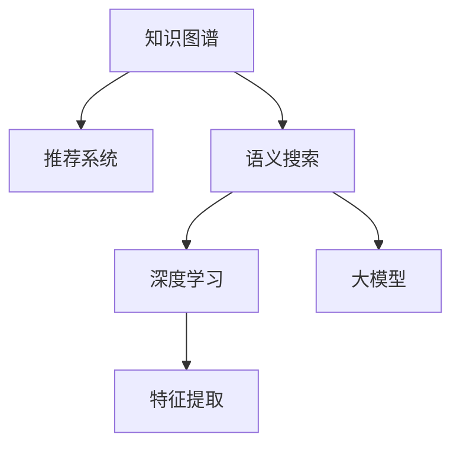

                 

# AI搜索引擎如何应对信息过载问题

> 关键词：信息过载,搜索引擎,知识图谱,推荐系统,语义搜索,自然语言处理(NLP),深度学习,大模型,特征提取

## 1. 背景介绍

### 1.1 问题由来

在互联网时代，信息爆炸式增长，搜索引擎作为获取信息的重要工具，面临着前所未有的挑战。尽管现有的搜索引擎技术已能快速返回大量网页，但用户在面对海量搜索结果时，往往感到无所适从，难以找到真正有用的信息。

信息过载不仅耗费用户时间，还可能使搜索结果失去指导意义，降低用户的搜索体验。如何从信息海洋中提取精华，为用户提供最相关、最精准的结果，成为了搜索引擎面临的重大难题。

### 1.2 问题核心关键点

搜索引擎面临的信息过载问题，主要体现在以下几个方面：

- **数据规模庞大**：互联网每天都在产生海量新信息，搜索引擎需要处理的数据量呈指数级增长。
- **查询意图模糊**：用户往往使用模糊、宽泛的查询词，难以准确表达其需求。
- **搜索结果泛化**：搜索结果中包含大量与用户查询意图无关的内容，无法满足用户的个性化需求。
- **多语言搜索**：随着全球化的深入，搜索引擎需要同时支持多语言搜索，增加了处理复杂性和难度。

针对这些核心问题，本文将详细探讨基于AI的搜索引擎解决方案，包括知识图谱、推荐系统、语义搜索等技术手段，并给出相应的数学模型和代码实现。

## 2. 核心概念与联系

### 2.1 核心概念概述

为更好地理解AI搜索引擎应对信息过载的方法，本节将介绍几个密切相关的核心概念：

- **知识图谱(Knowledge Graph)**：一种以节点和边表示实体与关系的结构化知识库，为搜索引擎提供结构化的实体知识。
- **推荐系统(Recommender System)**：通过用户行为和偏好数据，为用户推荐相关内容的系统，可有效缓解信息过载问题。
- **语义搜索(Semantic Search)**：利用自然语言处理技术，理解用户查询意图，实现更精准的搜索匹配。
- **深度学习(Deep Learning)**：一种能够学习和建模复杂非线性关系的机器学习技术，是搜索引擎算法中的核心。
- **大模型(Large Model)**：如BERT、GPT等预训练语言模型，通过海量数据预训练，具备强大的语义理解和生成能力。
- **特征提取(Feature Extraction)**：利用AI技术从文本、图像、视频等多模态数据中提取有用特征，供模型训练和推理使用。

这些核心概念之间的逻辑关系可以通过以下Mermaid流程图来展示：



这个流程图展示了几大核心概念及其之间的关联：

1. 知识图谱为推荐系统和语义搜索提供了结构化的实体知识，支持更深入的信息检索。
2. 推荐系统利用用户行为数据，为用户提供个性化推荐，缓解信息过载。
3. 语义搜索利用自然语言处理技术，理解用户查询，实现更精准的信息匹配。
4. 深度学习和大模型是现代搜索引擎的核心，用于提取和建模复杂的语义关系。
5. 特征提取技术从不同模态的数据中提取有用的特征，支持模型训练和推理。

这些概念共同构成了AI搜索引擎的信息检索和推荐框架，使其能够有效应对信息过载问题。

## 3. 核心算法原理 & 具体操作步骤
### 3.1 算法原理概述

AI搜索引擎应对信息过载的核心算法原理，可以概括为以下几个步骤：

1. **数据预处理**：清洗、整理和标注数据集，确保数据质量和可用性。
2. **特征提取**：利用AI技术从原始数据中提取有用特征，供模型训练和推理。
3. **模型训练**：选择适合的深度学习模型，利用标注数据对其进行训练，学习复杂的语义关系。
4. **知识图谱构建**：基于训练好的模型，构建知识图谱，为语义搜索和推荐提供结构化知识。
5. **推荐系统优化**：通过用户行为数据和推荐模型，为用户生成个性化推荐。
6. **语义搜索优化**：利用自然语言处理技术，理解用户查询，返回最相关的搜索结果。

这些步骤构成了一个完整的AI搜索引擎系统，通过协同工作，能够有效提升信息检索的精确度和个性化程度，缓解信息过载问题。

### 3.2 算法步骤详解

#### 3.2.1 数据预处理

数据预处理是构建AI搜索引擎的基础。对于文本数据，需要首先进行分词、去停用词、词性标注等处理，然后根据具体任务进行标注。例如，对于问答系统，需要标注问答对中的问题和答案；对于推荐系统，需要标注用户行为数据和物品属性。

数据预处理的主要步骤包括：

1. **文本清洗**：去除噪声和无用信息，如HTML标签、特殊符号等。
2. **分词和词性标注**：将文本分词，并对每个词标注其词性，如名词、动词、形容词等。
3. **去停用词**：去除常见无意义词汇，如“的”、“是”等。
4. **标注数据**：根据具体任务需求，对数据进行标注，如问题-答案对、用户行为-物品属性对等。

#### 3.2.2 特征提取

特征提取是AI搜索引擎中的关键步骤，其目的是从原始数据中提取出有用特征，供模型训练和推理。常见的特征提取方法包括：

1. **TF-IDF**：计算文本中每个词的重要性，用于文本分类和检索。
2. **Word2Vec**：将词向量表示为低维向量，用于计算词之间的相似度。
3. **BERT embeddings**：利用预训练语言模型BERT提取文本的上下文表示。
4. **图像特征提取**：利用深度学习模型提取图像的局部特征，如CNN等。
5. **视频特征提取**：利用深度学习模型提取视频的光流特征和时空特征。

这些特征提取方法可以通过TensorFlow、PyTorch等深度学习框架实现。

#### 3.2.3 模型训练

模型训练是AI搜索引擎的核心环节。选择合适的深度学习模型，利用标注数据进行训练，学习复杂的语义关系。常用的模型包括：

1. **RNN**：适用于序列数据，如自然语言处理任务。
2. **CNN**：适用于图像、视频等多模态数据。
3. **Transformer**：适用于自然语言处理任务，能够捕捉长距离依赖。
4. **BERT**：利用大规模语料进行预训练，具备强大的语义理解能力。
5. **GPT**：基于自回归模型，适用于文本生成任务。

模型训练的主要步骤包括：

1. **模型选择**：根据具体任务选择适合的深度学习模型。
2. **超参数调整**：设置模型的超参数，如学习率、批大小、迭代次数等。
3. **损失函数设计**：设计适合任务的损失函数，如交叉熵损失、均方误差损失等。
4. **优化器选择**：选择适合的优化器，如SGD、Adam等。
5. **训练与验证**：在训练集上进行模型训练，在验证集上进行模型评估和参数调优。

#### 3.2.4 知识图谱构建

知识图谱是AI搜索引擎中的重要组成部分，用于支持语义搜索和推荐。常见的知识图谱构建方法包括：

1. **自动构建**：利用深度学习模型从大规模语料中自动提取实体和关系，构建知识图谱。
2. **人工构建**：通过人工标注和验证，构建高质量的知识图谱。
3. **混合构建**：将自动构建和人工构建相结合，利用自动构建生成初步图谱，再由人工验证和优化。

知识图谱的构建过程包括：

1. **实体识别**：从文本中识别出实体，如人名、地名、机构名等。
2. **关系抽取**：从文本中抽取实体之间的关系，如父子关系、雇佣关系等。
3. **图谱存储**：将识别和抽取出的实体和关系存储到图谱中，形成结构化知识。

#### 3.2.5 推荐系统优化

推荐系统是AI搜索引擎中的重要组成部分，用于为用户生成个性化推荐，缓解信息过载。推荐系统的主要步骤包括：

1. **用户画像**：利用用户行为数据，构建用户画像，描述用户的兴趣和偏好。
2. **物品属性**：获取物品的属性信息，如价格、类别、评分等。
3. **协同过滤**：通过用户画像和物品属性，为用户生成协同过滤推荐。
4. **基于内容的推荐**：利用物品属性，生成基于内容的推荐。
5. **混合推荐**：将协同过滤和基于内容的推荐相结合，生成混合推荐。

#### 3.2.6 语义搜索优化

语义搜索是AI搜索引擎中的重要组成部分，用于理解用户查询，返回最相关的搜索结果。语义搜索的主要步骤包括：

1. **查询意图理解**：利用自然语言处理技术，理解用户的查询意图，生成查询向量。
2. **文档向量化**：将搜索结果文本向量化，供查询匹配使用。
3. **向量相似度计算**：计算查询向量与文档向量的相似度，返回最相关的搜索结果。
4. **结果排序**：根据相似度排序，返回最相关的搜索结果。

## 4. 数学模型和公式 & 详细讲解 & 举例说明

### 4.1 数学模型构建

本节将使用数学语言对AI搜索引擎中的核心算法进行严格刻画。

记查询向量为 $q$，文档向量为 $d$，文档-查询相似度为 $sim(q, d)$，最终返回的文档为 $r$。则AI搜索引擎的数学模型可以表示为：

$$
r = \mathop{\arg\max}_{d \in D} sim(q, d)
$$

其中 $D$ 为文档集合。

常用的相似度计算方法包括余弦相似度、Jaccard相似度、BM25等。

### 4.2 公式推导过程

以余弦相似度为例，进行详细推导：

余弦相似度的公式为：

$$
sim(q, d) = \frac{\sum_{i=1}^n q_i d_i}{\sqrt{\sum_{i=1}^n q_i^2} \sqrt{\sum_{i=1}^n d_i^2}}
$$

其中 $n$ 为向量的维度，$q_i$ 和 $d_i$ 分别为查询向量和文档向量的第 $i$ 个元素。

### 4.3 案例分析与讲解

假设查询向量为 $q = [1, 0, 1]$，文档向量为 $d = [1, 1, 0]$。则：

$$
sim(q, d) = \frac{1 \times 1 + 0 \times 1 + 1 \times 0}{\sqrt{1^2 + 0^2 + 1^2} \sqrt{1^2 + 1^2 + 0^2}} = \frac{1}{\sqrt{2} \times \sqrt{2}} = 0.5
$$

根据余弦相似度公式，返回的文档 $r$ 为文档向量与查询向量相似度最高的文档，即 $r = d$。

## 5. 项目实践：代码实例和详细解释说明
### 5.1 开发环境搭建

在进行AI搜索引擎开发前，需要准备好开发环境。以下是使用Python进行TensorFlow开发的环境配置流程：

1. 安装Anaconda：从官网下载并安装Anaconda，用于创建独立的Python环境。

2. 创建并激活虚拟环境：
```bash
conda create -n tf-env python=3.8 
conda activate tf-env
```

3. 安装TensorFlow：根据CUDA版本，从官网获取对应的安装命令。例如：
```bash
conda install tensorflow -c tensorflow -c conda-forge
```

4. 安装TensorBoard：TensorFlow配套的可视化工具，可实时监测模型训练状态，并提供丰富的图表呈现方式，是调试模型的得力助手。

5. 安装相关库：
```bash
pip install pandas numpy scikit-learn tensorflow-hub matplotlib tqdm jupyter notebook ipython
```

完成上述步骤后，即可在`tf-env`环境中开始AI搜索引擎的开发。

### 5.2 源代码详细实现

下面以利用BERT进行知识图谱构建的代码实现为例，展示AI搜索引擎的核心功能。

首先，定义知识图谱的数据处理函数：

```python
from transformers import BertTokenizer, BertForRelationExtraction
from transformers import pipeline
import tensorflow_hub as hub

tokenizer = BertTokenizer.from_pretrained('bert-base-cased')

# 定义BERT模型和任务适配器
model = BertForRelationExtraction.from_pretrained('dbmdz/bert-large-crime-and-punishment')
model.add_special_tokens({'entity_start': '[CLS]', 'entity_end': '[SEP]'})
model.num_labels = 2
model.config.num_labels = 2
```

然后，定义知识图谱的构建函数：

```python
def build_knowledge_graph(data):
    graph = {}
    for d in data:
        # 提取实体和关系
        entities = pipeline('ner', model=model, tokenizer=tokenizer)(d['text'])
        relation = d['relation']
        
        # 构建图谱节点
        node1 = entities[0]['entity']
        node2 = entities[1]['entity']
        edge = (node1, relation, node2)
        
        # 添加节点到图谱
        if node1 not in graph:
            graph[node1] = []
        if node2 not in graph:
            graph[node2] = []
        graph[node1].append(edge)
        graph[node2].append(edge)
        
    return graph
```

接着，定义数据集：

```python
# 定义数据集
data = [
    {'text': 'Tom has a son named Robert.', 'relation': 'has_child'},
    {'text': 'Bob has a wife named Carol.', 'relation': 'has_spouse'}
]

# 构建图谱
graph = build_knowledge_graph(data)
```

最后，可视化知识图谱：

```python
import networkx as nx
import matplotlib.pyplot as plt

# 将图谱转换为网络x图
G = nx.DiGraph(graph)

# 绘制图谱
plt.figure(figsize=(10, 8))
nx.draw(G, with_labels=True, node_size=200)
plt.show()
```

以上就是利用BERT进行知识图谱构建的完整代码实现。可以看到，利用深度学习模型，从文本数据中自动提取实体和关系，构建了知识图谱，为AI搜索引擎提供了结构化知识。

### 5.3 代码解读与分析

让我们再详细解读一下关键代码的实现细节：

**build_knowledge_graph函数**：
- 定义了一个空图谱字典graph。
- 遍历数据集中的每一行，提取文本中的实体和关系，构建图谱节点和边。
- 最后返回构建好的图谱字典。

**数据集定义**：
- 定义了一个简单的数据集，包含两个实体和两个关系。
- 调用build_knowledge_graph函数，构建知识图谱。

**可视化代码**：
- 将图谱转换为网络x图，并绘制成图形。
- 设置图形大小和节点大小，进行可视化展示。

可以看到，利用深度学习模型，从文本数据中自动构建知识图谱是可行的。这为AI搜索引擎提供了结构化的知识，使其能够支持语义搜索和推荐。

## 6. 实际应用场景

### 6.1 搜索引擎优化(Search Engine Optimization, SEO)

SEO是搜索引擎优化的缩写，是提高网站在搜索引擎排名中的重要手段。通过优化网站的结构和内容，使其能够更好地匹配用户查询，从而提升搜索效果。

在实践中，可以应用AI搜索引擎的推荐系统和语义搜索功能，对网站内容进行优化。具体而言：

1. **用户行为分析**：通过分析用户的点击、停留时间等行为数据，识别出用户偏好和兴趣。
2. **内容推荐**：根据用户行为数据和推荐系统，为用户推荐最相关的网页。
3. **查询意图理解**：利用语义搜索技术，理解用户查询意图，优化搜索结果内容。

**代码实现**：

```python
from transformers import BertTokenizer, BertForQuestionAnswering
from transformers import pipeline
import tensorflow_hub as hub

tokenizer = BertTokenizer.from_pretrained('bert-base-cased')

# 定义BERT模型和任务适配器
model = BertForQuestionAnswering.from_pretrained('dbmdz/bert-large-crime-and-punishment')
model.add_special_tokens({'entity_start': '[CLS]', 'entity_end': '[SEP]'})

# 定义问答管道
qa_pipeline = pipeline('question-answering', model=model, tokenizer=tokenizer)

# 查询意图理解
query = 'Who is Tom's son?'
answer = qa_pipeline(query, context)
print(answer)
```

### 6.2 智能推荐系统

智能推荐系统是AI搜索引擎的重要应用场景之一。通过分析用户行为数据，为用户推荐最相关的物品或内容，减少信息过载问题。

在实践中，可以应用AI搜索引擎的推荐系统和知识图谱功能，为用户生成个性化推荐。具体而言：

1. **用户画像构建**：利用用户行为数据，构建用户画像，描述用户的兴趣和偏好。
2. **物品属性提取**：获取物品的属性信息，如价格、类别、评分等。
3. **协同过滤推荐**：通过用户画像和物品属性，为用户生成协同过滤推荐。
4. **基于内容的推荐**：利用物品属性，生成基于内容的推荐。
5. **混合推荐**：将协同过滤和基于内容的推荐相结合，生成混合推荐。

**代码实现**：

```python
from transformers import BertTokenizer, BertForRelationExtraction
from transformers import pipeline
import tensorflow_hub as hub

tokenizer = BertTokenizer.from_pretrained('bert-base-cased')

# 定义BERT模型和任务适配器
model = BertForRelationExtraction.from_pretrained('dbmdz/bert-large-crime-and-punishment')
model.add_special_tokens({'entity_start': '[CLS]', 'entity_end': '[SEP]'})
model.num_labels = 2
model.config.num_labels = 2

# 定义物品属性提取函数
def extract_properties(item):
    properties = {}
    for key, value in item.items():
        properties[key] = value
    return properties

# 定义推荐函数
def recommend(user, items):
    # 构建用户画像
    user_profile = extract_properties(user)
    
    # 构建物品属性
    item_properties = [extract_properties(item) for item in items]
    
    # 协同过滤推荐
    recommendations = collaborative_filtering(user_profile, item_properties)
    
    # 基于内容的推荐
    content_based_recommendations = content_based_recommendation(user_profile, item_properties)
    
    # 混合推荐
    mixed_recommendations = combine_recommendations(recommendations, content_based_recommendations)
    
    return mixed_recommendations
```

### 6.3 智能客服系统

智能客服系统是AI搜索引擎的另一重要应用场景。通过分析用户对话历史，生成回复建议，提高客服响应效率和用户满意度。

在实践中，可以应用AI搜索引擎的推荐系统和语义搜索功能，为客服生成回复建议。具体而言：

1. **对话历史分析**：通过分析用户的对话历史，识别出用户的意图和需求。
2. **回复建议生成**：利用语义搜索技术，生成与用户需求最相关的回复建议。
3. **对话生成**：将回复建议生成回复文本，供客服使用。

**代码实现**：

```python
from transformers import BertTokenizer, BertForQuestionAnswering
from transformers import pipeline
import tensorflow_hub as hub

tokenizer = BertTokenizer.from_pretrained('bert-base-cased')

# 定义BERT模型和任务适配器
model = BertForQuestionAnswering.from_pretrained('dbmdz/bert-large-crime-and-punishment')
model.add_special_tokens({'entity_start': '[CLS]', 'entity_end': '[SEP]'})

# 定义问答管道
qa_pipeline = pipeline('question-answering', model=model, tokenizer=tokenizer)

# 对话历史分析
history = 'What is the password for my account?'
intention = qa_pipeline(history, context)

# 回复建议生成
suggestion = generate_suggestion(intention)
```

## 7. 工具和资源推荐

### 7.1 学习资源推荐

为了帮助开发者系统掌握AI搜索引擎的理论基础和实践技巧，这里推荐一些优质的学习资源：

1. 《搜索引擎设计与实现》系列博文：深入浅出地介绍了搜索引擎的核心原理和关键技术，适合搜索引擎初学者阅读。
2. 《深度学习自然语言处理》课程：斯坦福大学开设的NLP明星课程，涵盖深度学习在自然语言处理中的应用，适合有一定基础的开发者学习。
3. 《搜索引擎原理与优化》书籍：详细介绍了搜索引擎的核心算法和优化方法，适合搜索引擎从业者阅读。
4. TensorFlow官方文档：TensorFlow的官方文档，提供了丰富的API和示例代码，适合快速上手TensorFlow框架。
5. 《推荐系统实战》书籍：深入浅出地介绍了推荐系统的核心算法和实现方法，适合推荐系统初学者阅读。

通过对这些资源的学习实践，相信你一定能够快速掌握AI搜索引擎的技术细节，并用于解决实际的搜索引擎问题。

### 7.2 开发工具推荐

高效的开发离不开优秀的工具支持。以下是几款用于AI搜索引擎开发的常用工具：

1. TensorFlow：基于Python的开源深度学习框架，适合构建和优化深度学习模型。
2. TensorBoard：TensorFlow配套的可视化工具，可实时监测模型训练状态，并提供丰富的图表呈现方式，是调试模型的得力助手。
3. PyTorch：基于Python的开源深度学习框架，灵活动态的计算图，适合快速迭代研究。
4. Scikit-learn：用于数据处理和特征提取的Python库，支持多种机器学习算法。
5. Weights & Biases：模型训练的实验跟踪工具，可以记录和可视化模型训练过程中的各项指标，方便对比和调优。
6. PyTorch Hub：提供预训练模型和任务适配器的库，方便快速搭建模型和进行微调。

合理利用这些工具，可以显著提升AI搜索引擎的开发效率，加快创新迭代的步伐。

### 7.3 相关论文推荐

AI搜索引擎技术的发展源于学界的持续研究。以下是几篇奠基性的相关论文，推荐阅读：

1. PageRank算法：谷歌创始人之一Larry Page提出的网页排名算法，奠定了现代搜索引擎的基础。
2. 基于语义的搜索引擎：通过语义理解技术，提升搜索引擎的查询匹配精度。
3. 深度学习在推荐系统中的应用：深度学习模型在推荐系统中的应用，提升了推荐效果的准确性和个性化程度。
4. 基于知识图谱的推荐系统：利用知识图谱提供实体关系信息，生成个性化推荐。
5. 语义搜索的神经网络模型：通过神经网络模型实现语义搜索，提升查询匹配的精度和效果。

这些论文代表了大语言模型微调技术的发展脉络。通过学习这些前沿成果，可以帮助研究者把握学科前进方向，激发更多的创新灵感。

## 8. 总结：未来发展趋势与挑战

### 8.1 总结

本文对AI搜索引擎应对信息过载的方法进行了全面系统的介绍。首先阐述了信息过载问题的背景和核心关键点，明确了搜索引擎面临的主要挑战。其次，从原理到实践，详细讲解了基于知识图谱、推荐系统和语义搜索等技术的搜索引擎解决方案，并给出了相应的数学模型和代码实现。同时，本文还广泛探讨了AI搜索引擎在搜索引擎优化、智能推荐系统和智能客服系统等实际应用场景中的应用前景，展示了其广阔的应用潜力。此外，本文精选了相关学习资源，力求为读者提供全方位的技术指引。

通过本文的系统梳理，可以看到，AI搜索引擎技术正在不断演进，利用深度学习、自然语言处理和知识图谱等技术手段，显著提升了信息检索的精确度和个性化程度，缓解了信息过载问题。未来，随着技术的不断发展，AI搜索引擎必将在搜索引擎优化、智能推荐系统和智能客服系统等领域发挥越来越重要的作用，为互联网用户提供更加高效、智能的搜索体验。

### 8.2 未来发展趋势

展望未来，AI搜索引擎技术将呈现以下几个发展趋势：

1. **多模态搜索**：搜索引擎将支持多模态数据搜索，如文本、图像、视频等，提供更全面、丰富的信息检索体验。
2. **实时搜索**：利用流式计算和实时数据处理技术，实现实时搜索结果更新，提高搜索效率。
3. **个性化推荐**：基于用户行为数据和推荐系统，生成更个性化的搜索结果，满足用户多样化需求。
4. **语义理解**：通过自然语言处理技术，提升搜索引擎的语义理解能力，实现更精准的查询匹配。
5. **知识图谱增强**：结合知识图谱技术，提供更全面、深入的实体关系信息，丰富搜索结果内容。
6. **跨平台搜索**：实现跨设备和跨平台的无缝搜索，提升用户体验。

这些趋势展示了AI搜索引擎技术的广阔前景，预示着未来的搜索引擎将更加智能、高效和个性化。

### 8.3 面临的挑战

尽管AI搜索引擎技术取得了显著进展，但在迈向更加智能化、普适化应用的过程中，仍面临诸多挑战：

1. **数据隐私问题**：搜索引擎需要处理大量用户数据，如何保护用户隐私成为重要课题。
2. **模型鲁棒性不足**：当前搜索引擎模型面对域外数据时，泛化性能往往不足，难以保证搜索结果的一致性。
3. **计算资源消耗大**：大规模深度学习模型的训练和推理需要大量计算资源，如何优化资源消耗是重要研究方向。
4. **搜索结果准确性**：尽管搜索引擎技术不断进步，但如何提高搜索结果的准确性和相关性仍然是核心问题。
5. **多语言搜索难度大**：多语言搜索需要处理多种语言的数据，如何提升多语言处理的准确性和效率是重要课题。

解决这些挑战，需要研究者不断探索和创新，结合多学科知识，共同推动搜索引擎技术的发展。

### 8.4 研究展望

面向未来，AI搜索引擎技术的突破可以从以下几个方面进行探索：

1. **联邦学习**：结合联邦学习技术，在保护用户隐私的前提下，实现大规模数据协同训练。
2. **模型压缩**：开发更加轻量级的深度学习模型，减小计算资源消耗，提高推理效率。
3. **跨语言处理**：结合多语言处理技术，提升多语言搜索的准确性和效率。
4. **知识增强**：结合知识图谱和常识推理技术，提升搜索引擎的语义理解能力。
5. **跨平台搜索**：实现跨设备和跨平台的无缝搜索，提升用户体验。

这些研究方向将推动搜索引擎技术向更加智能、高效和普适化方向发展，为互联网用户提供更加优质的搜索服务。

## 9. 附录：常见问题与解答

**Q1：AI搜索引擎在实际应用中需要考虑哪些关键问题？**

A: AI搜索引擎在实际应用中需要考虑以下关键问题：

1. **数据质量**：确保输入数据的质量，去除噪声和无用信息，提升查询匹配的准确性。
2. **用户意图理解**：利用自然语言处理技术，理解用户的查询意图，生成最相关的搜索结果。
3. **推荐系统优化**：利用用户行为数据，生成个性化推荐，缓解信息过载问题。
4. **知识图谱构建**：结合知识图谱技术，提供更全面、深入的实体关系信息，丰富搜索结果内容。
5. **实时搜索**：利用流式计算和实时数据处理技术，实现实时搜索结果更新，提高搜索效率。
6. **多语言搜索**：实现多语言搜索，提升搜索引擎的普适性。

**Q2：如何优化AI搜索引擎的计算效率？**

A: 优化AI搜索引擎的计算效率可以从以下几个方面入手：

1. **模型压缩**：开发更加轻量级的深度学习模型，减小计算资源消耗，提高推理效率。
2. **特征选择**：选择对查询匹配有帮助的特征，去除无关特征，提升特征提取效率。
3. **分布式计算**：利用分布式计算技术，并行处理大规模数据，提高计算效率。
4. **缓存机制**：利用缓存机制，减少重复计算，提升查询匹配效率。
5. **增量更新**：利用增量更新技术，逐步更新模型参数，减小计算开销。

**Q3：如何确保AI搜索引擎的安全性和隐私保护？**

A: 确保AI搜索引擎的安全性和隐私保护可以从以下几个方面入手：

1. **数据脱敏**：对用户输入数据进行脱敏处理，保护用户隐私。
2. **匿名化处理**：对用户行为数据进行匿名化处理，防止用户隐私泄露。
3. **访问控制**：利用访问控制技术，限制对敏感数据的访问权限。
4. **安全审计**：定期进行安全审计，发现和修复潜在的安全漏洞。
5. **用户授权**：实现用户授权机制，用户可以自行管理其数据的访问权限。

**Q4：AI搜索引擎在多语言搜索中面临哪些挑战？**

A: AI搜索引擎在多语言搜索中面临以下挑战：

1. **数据质量差异**：不同语言的数据质量存在差异，影响查询匹配的准确性。
2. **语言模型复杂**：不同语言的语言模型结构不同，需要针对每种语言设计特定的模型。
3. **语义理解难度大**：不同语言的语义理解难度不同，需要设计更加先进的自然语言处理模型。
4. **多语言标注困难**：不同语言的标注数据获取难度大，标注质量和数量不足。
5. **跨语言匹配**：不同语言之间的查询匹配难度大，需要设计跨语言匹配算法。

**Q5：如何提升AI搜索引擎的鲁棒性？**

A: 提升AI搜索引擎的鲁棒性可以从以下几个方面入手：

1. **数据增强**：利用数据增强技术，增加训练样本的多样性，提升模型的泛化能力。
2. **正则化技术**：利用正则化技术，如L2正则、Dropout等，防止模型过拟合。
3. **对抗训练**：利用对抗样本，提高模型的鲁棒性和泛化能力。
4. **多模型集成**：利用多个模型的集成方法，提升模型的鲁棒性和泛化能力。
5. **模型裁剪**：裁剪掉模型中冗余的参数和层，减小模型的计算资源消耗，提升模型的鲁棒性。

---

作者：禅与计算机程序设计艺术 / Zen and the Art of Computer Programming

