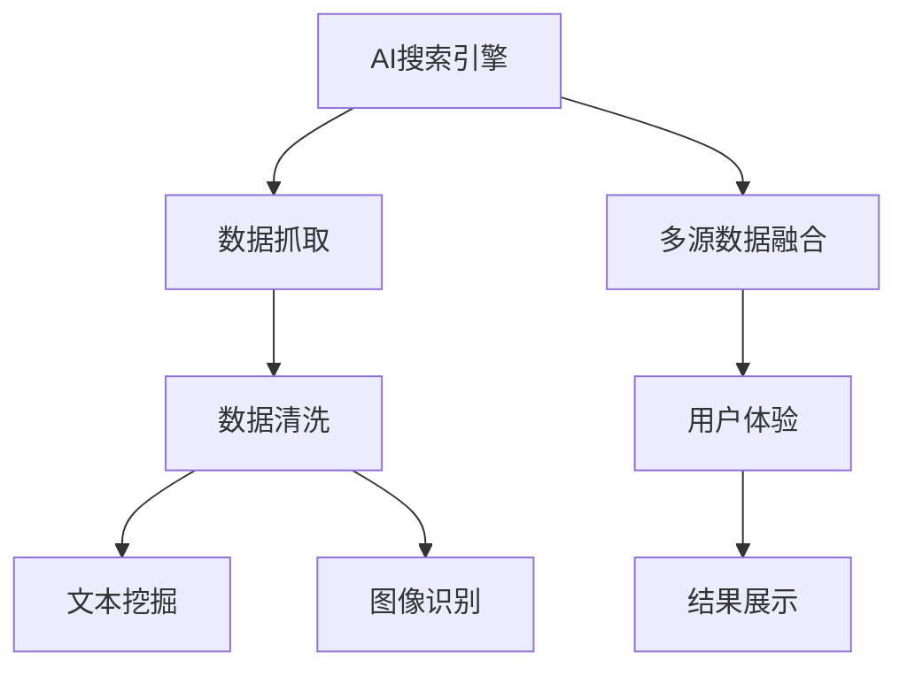

                 

# AI搜索引擎如何改变市场调研

## 1. 背景介绍

### 1.1 问题由来
市场调研是企业制定战略、优化运营的重要依据。传统市场调研方法依赖于问卷调查、访谈、焦点小组等，耗费大量时间和人力。而随着互联网的普及和数据技术的快速发展，基于AI技术的搜索引擎在市场调研中扮演了越来越重要的角色。AI搜索引擎能够快速、精准地抓取和分析海量数据，辅助企业更高效地进行市场研究，推动业务决策的科学化。

### 1.2 问题核心关键点
AI搜索引擎在市场调研中的应用，主要有以下几个关键点：
- 高效数据抓取：利用先进的技术手段，从网络上自动收集和整理数据，无需人工干预，大大提高数据收集效率。
- 实时数据更新：通过爬虫程序和分布式存储技术，保持数据的实时性，快速响应市场变化。
- 深度数据分析：结合机器学习和自然语言处理技术，深度挖掘数据背后的趋势和模式，提供更为精准的市场洞察。
- 多维度融合：综合考虑文本、图像、视频等多种数据源，多角度分析和展现市场信息，提供更加全面的调研结果。

这些关键点使得AI搜索引擎在市场调研中具有无可比拟的优势，能够在节省时间和成本的同时，提供更高质量的调研结果。

## 2. 核心概念与联系

### 2.1 核心概念概述

为更好地理解AI搜索引擎在市场调研中的应用，本节将介绍几个密切相关的核心概念：

- AI搜索引擎：基于人工智能技术的搜索引擎，能够自动识别和理解用户查询，提供相关的搜索结果。主要涉及自然语言处理、机器学习、信息检索等技术。

- 数据抓取：自动从网络中收集相关网页和数据，是搜索引擎的基础功能之一。

- 数据清洗：对抓取到的数据进行去重、清洗、格式转换等预处理，保证数据质量和一致性。

- 文本挖掘：从文本数据中提取有价值的信息，包括主题分析、情感分析、实体识别等。

- 图像识别：通过计算机视觉技术，对图片数据进行分析和理解。

- 多源数据融合：将来自不同来源的数据进行整合和统一，综合分析和展示市场信息。

- 用户体验：搜索引擎的用户体验优化，包括搜索结果的相关性、多样性、加载速度等，直接影响用户的使用感受。

这些核心概念之间的逻辑关系可以通过以下Mermaid流程图来展示：



这个流程图展示了大语言模型的核心概念及其之间的关系：

1. AI搜索引擎通过数据抓取获取原始数据。
2. 数据清洗处理保证数据质量。
3. 文本挖掘和图像识别分别从文本和图片数据中提取信息。
4. 多源数据融合对不同来源的数据进行整合。
5. 用户体验优化提高搜索结果的质量和可读性。
6. 结果展示提供最终的调研结果。

## 3. 核心算法原理 & 具体操作步骤
### 3.1 算法原理概述

AI搜索引擎的核心原理包括以下几个方面：

- 自然语言处理(NLP)：用于理解和处理自然语言，实现与用户的交互，包括文本解析、语义分析、情感识别等。
- 机器学习与深度学习：用于构建搜索引擎的检索算法，提升查询匹配的准确性和相关性。
- 信息检索：用于从大规模数据集中检索相关信息，是搜索引擎的核心功能。
- 分布式计算：通过分布式存储和计算，支持大规模数据的高效处理和实时更新。
- 推荐算法：用于优化搜索结果的展示，提高用户的点击率和满意度。

这些核心原理共同构成了AI搜索引擎的框架，使其能够在海量数据中高效、精准地检索和分析信息。

### 3.2 算法步骤详解

AI搜索引擎在市场调研中的应用，主要包括以下几个步骤：

**Step 1: 数据收集与预处理**
- 设计爬虫程序，从指定的网络源抓取相关数据。
- 使用自然语言处理技术，对抓取到的文本数据进行分词、去除停用词、提取关键词等预处理。
- 对图像数据进行识别和标注，提取有用的元数据信息。

**Step 2: 数据清洗与整合**
- 对数据进行去重、清洗、格式转换等操作，确保数据的准确性和一致性。
- 使用多源数据融合技术，将来自不同来源的数据进行整合和统一，消除冗余和冲突。

**Step 3: 深度分析与挖掘**
- 使用文本挖掘技术，从文本数据中提取主题、情感、实体等信息。
- 结合图像识别技术，从图片数据中提取有用的信息，如品牌、产品等。
- 使用机器学习算法，挖掘数据中的模式和趋势，提供有意义的市场洞察。

**Step 4: 结果展示与优化**
- 将分析结果以图表、报告等形式展示，提供给决策者参考。
- 结合推荐算法，优化搜索结果的展示，提高用户的使用体验。
- 实时监测用户反馈，不断优化搜索引擎的功能和性能。

以上是AI搜索引擎在市场调研中的一般流程。在实际应用中，还需要针对具体任务的特点，对各个环节进行优化设计，如改进爬虫程序、调整分析算法、优化展示界面等，以进一步提升调研的效率和质量。

### 3.3 算法优缺点

AI搜索引擎在市场调研中的应用具有以下优点：
1. 高效数据抓取：自动从网络上快速收集数据，无需人工干预。
2. 实时数据更新：通过分布式存储和计算技术，保持数据的实时性。
3. 深度数据分析：结合机器学习和自然语言处理技术，提供精准的市场洞察。
4. 多维度融合：综合考虑文本、图像、视频等多种数据源，提供全面的调研结果。
5. 用户体验优化：通过优化搜索结果展示，提升用户的使用体验。

同时，该方法也存在一定的局限性：
1. 数据质量依赖网络源：如果抓取到的数据质量不高，会影响后续分析的准确性。
2. 对技术要求高：需要掌握复杂的技术栈，包括爬虫、数据清洗、深度学习等。
3. 隐私和伦理问题：需要谨慎处理用户数据，避免侵犯隐私和伦理问题。
4. 难以处理深度信息：对于复杂的信息表达和抽象概念，目前的搜索引擎难以完全理解和处理。

尽管存在这些局限性，但AI搜索引擎在市场调研中的应用已经取得了显著的效果，成为企业市场决策的重要工具。

### 3.4 算法应用领域

AI搜索引擎在市场调研中的应用主要包括以下几个领域：

- 市场趋势分析：通过抓取和分析海量的网络数据，识别市场趋势和变化，辅助企业制定战略决策。
- 消费者行为研究：从用户搜索历史、评论、反馈等数据中，分析消费者的行为和偏好，指导产品开发和市场推广。
- 竞争对手分析：抓取竞争对手的在线信息，分析其市场策略、产品特点、品牌声誉等，制定有效的竞争策略。
- 市场舆情监测：实时监测网络舆情，评估品牌声誉和市场反应，及时调整市场策略。
- 个性化推荐：结合用户的历史行为数据，推荐个性化的产品和服务，提升用户体验和满意度。

除了上述这些经典应用外，AI搜索引擎在更多场景中也有创新应用，如社交媒体分析、新闻事件监测、在线广告效果评估等，为市场调研提供了全新的手段和方法。

## 4. 数学模型和公式 & 详细讲解  
### 4.1 数学模型构建

本节将使用数学语言对AI搜索引擎在市场调研中的应用进行更加严格的刻画。

记AI搜索引擎为 $S_{\theta}$，其中 $\theta$ 为模型参数。假设市场调研数据集为 $D=\{(x_i,y_i)\}_{i=1}^N, x_i \in \mathcal{X}, y_i \in \mathcal{Y}$。

定义搜索引擎 $S_{\theta}$ 在数据样本 $(x,y)$ 上的损失函数为 $\ell(S_{\theta}(x),y)$，则在数据集 $D$ 上的经验风险为：

$$
\mathcal{L}(\theta) = \frac{1}{N} \sum_{i=1}^N \ell(S_{\theta}(x_i),y_i)
$$

其中 $\ell$ 为搜索引擎在特定任务下的损失函数，用于衡量模型输出与真实标签之间的差异。常见的损失函数包括交叉熵损失、均方误差损失等。

### 4.2 公式推导过程

以下我们以市场趋势分析任务为例，推导交叉熵损失函数及其梯度的计算公式。

假设搜索引擎 $S_{\theta}$ 在输入 $x$ 上的输出为 $\hat{y} = S_{\theta}(x) \in [0,1]$，表示预测某个事件发生的概率。真实标签 $y \in \{0,1\}$。则二分类交叉熵损失函数定义为：

$$
\ell(S_{\theta}(x),y) = -[y\log \hat{y} + (1-y)\log (1-\hat{y})]
$$

将其代入经验风险公式，得：

$$
\mathcal{L}(\theta) = -\frac{1}{N}\sum_{i=1}^N [y_i\log S_{\theta}(x_i)+(1-y_i)\log(1-S_{\theta}(x_i))]
$$

根据链式法则，损失函数对参数 $\theta_k$ 的梯度为：

$$
\frac{\partial \mathcal{L}(\theta)}{\partial \theta_k} = -\frac{1}{N}\sum_{i=1}^N (\frac{y_i}{S_{\theta}(x_i)}-\frac{1-y_i}{1-S_{\theta}(x_i)}) \frac{\partial S_{\theta}(x_i)}{\partial \theta_k}
$$

其中 $\frac{\partial S_{\theta}(x_i)}{\partial \theta_k}$ 可进一步递归展开，利用自动微分技术完成计算。

在得到损失函数的梯度后，即可带入参数更新公式，完成模型的迭代优化。重复上述过程直至收敛，最终得到适应市场调研任务的最优模型参数 $\theta^*$。

## 5. 项目实践：代码实例和详细解释说明
### 5.1 开发环境搭建

在进行市场调研应用开发前，我们需要准备好开发环境。以下是使用Python进行PyTorch开发的环境配置流程：

1. 安装Anaconda：从官网下载并安装Anaconda，用于创建独立的Python环境。

2. 创建并激活虚拟环境：
```bash
conda create -n pytorch-env python=3.8 
conda activate pytorch-env
```

3. 安装PyTorch：根据CUDA版本，从官网获取对应的安装命令。例如：
```bash
conda install pytorch torchvision torchaudio cudatoolkit=11.1 -c pytorch -c conda-forge
```

4. 安装Transformers库：
```bash
pip install transformers
```

5. 安装各类工具包：
```bash
pip install numpy pandas scikit-learn matplotlib tqdm jupyter notebook ipython
```

完成上述步骤后，即可在`pytorch-env`环境中开始市场调研应用开发。

### 5.2 源代码详细实现

下面我们以市场趋势分析任务为例，给出使用Transformers库对BERT模型进行市场趋势分析的PyTorch代码实现。

首先，定义市场趋势分析任务的数据处理函数：

```python
from transformers import BertTokenizer
from torch.utils.data import Dataset
import torch

class TrendDataset(Dataset):
    def __init__(self, texts, tags, tokenizer, max_len=128):
        self.texts = texts
        self.tags = tags
        self.tokenizer = tokenizer
        self.max_len = max_len
        
    def __len__(self):
        return len(self.texts)
    
    def __getitem__(self, item):
        text = self.texts[item]
        tags = self.tags[item]
        
        encoding = self.tokenizer(text, return_tensors='pt', max_length=self.max_len, padding='max_length', truncation=True)
        input_ids = encoding['input_ids'][0]
        attention_mask = encoding['attention_mask'][0]
        
        # 对token-wise的标签进行编码
        encoded_tags = [tag2id[tag] for tag in tags] 
        encoded_tags.extend([tag2id['O']] * (self.max_len - len(encoded_tags)))
        labels = torch.tensor(encoded_tags, dtype=torch.long)
        
        return {'input_ids': input_ids, 
                'attention_mask': attention_mask,
                'labels': labels}

# 标签与id的映射
tag2id = {'O': 0, 'Increase': 1, 'Decrease': 2}
id2tag = {v: k for k, v in tag2id.items()}

# 创建dataset
tokenizer = BertTokenizer.from_pretrained('bert-base-cased')

train_dataset = TrendDataset(train_texts, train_tags, tokenizer)
dev_dataset = TrendDataset(dev_texts, dev_tags, tokenizer)
test_dataset = TrendDataset(test_texts, test_tags, tokenizer)
```

然后，定义模型和优化器：

```python
from transformers import BertForTokenClassification, AdamW

model = BertForTokenClassification.from_pretrained('bert-base-cased', num_labels=len(tag2id))

optimizer = AdamW(model.parameters(), lr=2e-5)
```

接着，定义训练和评估函数：

```python
from torch.utils.data import DataLoader
from tqdm import tqdm
from sklearn.metrics import classification_report

device = torch.device('cuda') if torch.cuda.is_available() else torch.device('cpu')
model.to(device)

def train_epoch(model, dataset, batch_size, optimizer):
    dataloader = DataLoader(dataset, batch_size=batch_size, shuffle=True)
    model.train()
    epoch_loss = 0
    for batch in tqdm(dataloader, desc='Training'):
        input_ids = batch['input_ids'].to(device)
        attention_mask = batch['attention_mask'].to(device)
        labels = batch['labels'].to(device)
        model.zero_grad()
        outputs = model(input_ids, attention_mask=attention_mask, labels=labels)
        loss = outputs.loss
        epoch_loss += loss.item()
        loss.backward()
        optimizer.step()
    return epoch_loss / len(dataloader)

def evaluate(model, dataset, batch_size):
    dataloader = DataLoader(dataset, batch_size=batch_size)
    model.eval()
    preds, labels = [], []
    with torch.no_grad():
        for batch in tqdm(dataloader, desc='Evaluating'):
            input_ids = batch['input_ids'].to(device)
            attention_mask = batch['attention_mask'].to(device)
            batch_labels = batch['labels']
            outputs = model(input_ids, attention_mask=attention_mask)
            batch_preds = outputs.logits.argmax(dim=2).to('cpu').tolist()
            batch_labels = batch_labels.to('cpu').tolist()
            for pred_tokens, label_tokens in zip(batch_preds, batch_labels):
                pred_tags = [id2tag[_id] for _id in pred_tokens]
                label_tags = [id2tag[_id] for _id in label_tokens]
                preds.append(pred_tags[:len(label_tags)])
                labels.append(label_tags)
                
    print(classification_report(labels, preds))
```

最后，启动训练流程并在测试集上评估：

```python
epochs = 5
batch_size = 16

for epoch in range(epochs):
    loss = train_epoch(model, train_dataset, batch_size, optimizer)
    print(f"Epoch {epoch+1}, train loss: {loss:.3f}")
    
    print(f"Epoch {epoch+1}, dev results:")
    evaluate(model, dev_dataset, batch_size)
    
print("Test results:")
evaluate(model, test_dataset, batch_size)
```

以上就是使用PyTorch对BERT进行市场趋势分析任务的完整代码实现。可以看到，得益于Transformers库的强大封装，我们可以用相对简洁的代码完成BERT模型的加载和微调。

### 5.3 代码解读与分析

让我们再详细解读一下关键代码的实现细节：

**TrendDataset类**：
- `__init__`方法：初始化文本、标签、分词器等关键组件。
- `__len__`方法：返回数据集的样本数量。
- `__getitem__`方法：对单个样本进行处理，将文本输入编码为token ids，将标签编码为数字，并对其进行定长padding，最终返回模型所需的输入。

**tag2id和id2tag字典**：
- 定义了标签与数字id之间的映射关系，用于将token-wise的预测结果解码回真实的标签。

**训练和评估函数**：
- 使用PyTorch的DataLoader对数据集进行批次化加载，供模型训练和推理使用。
- 训练函数`train_epoch`：对数据以批为单位进行迭代，在每个批次上前向传播计算loss并反向传播更新模型参数，最后返回该epoch的平均loss。
- 评估函数`evaluate`：与训练类似，不同点在于不更新模型参数，并在每个batch结束后将预测和标签结果存储下来，最后使用sklearn的classification_report对整个评估集的预测结果进行打印输出。

**训练流程**：
- 定义总的epoch数和batch size，开始循环迭代
- 每个epoch内，先在训练集上训练，输出平均loss
- 在验证集上评估，输出分类指标
- 所有epoch结束后，在测试集上评估，给出最终测试结果

可以看到，PyTorch配合Transformers库使得BERT微调的代码实现变得简洁高效。开发者可以将更多精力放在数据处理、模型改进等高层逻辑上，而不必过多关注底层的实现细节。

当然，工业级的系统实现还需考虑更多因素，如模型的保存和部署、超参数的自动搜索、更灵活的任务适配层等。但核心的微调范式基本与此类似。

## 6. 实际应用场景
### 6.1 智能客服系统

AI搜索引擎在智能客服系统中的应用，能够实现对用户查询的实时理解与响应，提升客服系统的智能化水平。智能客服系统通常集成了语音识别、自然语言处理、机器学习等技术，能够实现自动化的对话交互和问题解答。

在技术实现上，可以通过AI搜索引擎抓取和分析用户的历史聊天记录、常见问题、业务知识库等，训练模型识别和理解用户意图。在实际应用中，用户输入自然语言问题，AI搜索引擎能够自动提取关键信息，匹配相应的知识库，并生成合理的回复。对于复杂的查询，还可以引入知识图谱和多轮对话技术，提高系统的智能度和用户满意度。

### 6.2 金融舆情监测

AI搜索引擎在金融舆情监测中的应用，能够实现对网络信息的实时监测和分析，辅助金融机构进行风险管理和决策支持。金融市场动荡不定，舆情变化迅速，金融机构需要及时了解市场动态和舆情变化，以便做出及时的应对措施。

在技术实现上，可以通过AI搜索引擎抓取金融新闻、评论、论坛帖子等网络信息，训练模型识别和分析舆情变化趋势。模型可以自动监测股票市场、商品市场、外汇市场等各类金融市场数据，实时分析舆情变化，及时预警市场风险，并提供风险评估和投资建议。金融机构可以根据AI搜索引擎提供的市场洞察和预测，制定科学的投资策略，优化投资组合，降低投资风险。

### 6.3 个性化推荐系统

AI搜索引擎在个性化推荐系统中的应用，能够实现对用户兴趣的深度分析和个性化推荐，提升推荐系统的质量和用户体验。个性化推荐系统需要实时分析用户的历史行为数据，推荐个性化的产品和服务，提高用户满意度。

在技术实现上，可以通过AI搜索引擎抓取用户的历史浏览记录、购物记录、评论记录等，训练模型识别和理解用户兴趣。在实际应用中，用户输入查询，AI搜索引擎能够自动匹配用户的兴趣点，推荐相关的产品和服务。AI搜索引擎还可以引入上下文分析和协同过滤技术，提供更加精准和多样化的推荐内容，提升用户的购物体验。

### 6.4 未来应用展望

随着AI搜索引擎技术的不断进步，其在市场调研中的应用将进一步拓展，带来更多的创新场景：

- 社交媒体分析：通过抓取和分析社交媒体上的热点话题和用户情感，帮助企业了解用户舆情，优化品牌形象。
- 新闻事件监测：抓取和分析新闻事件，提取关键信息，提供及时的市场动态和趋势预测。
- 在线广告效果评估：抓取和分析广告点击数据，评估广告效果和用户反馈，优化广告投放策略。
- 客户关系管理：通过抓取和分析客户互动数据，识别高价值客户，提供个性化的服务和推荐，提高客户满意度和忠诚度。
- 产品设计和优化：通过抓取和分析用户评论和反馈，提取产品改进点，优化产品设计和用户体验。

AI搜索引擎在市场调研中的应用前景广阔，将为各个行业带来更多的数字化和智能化变革，推动企业转型升级。

## 7. 工具和资源推荐
### 7.1 学习资源推荐

为了帮助开发者系统掌握AI搜索引擎的市场调研应用，这里推荐一些优质的学习资源：

1. 《Deep Learning for NLP》系列书籍：由NLP专家撰写，全面介绍了深度学习在NLP中的应用，包括市场调研等任务。

2. CS224N《深度学习自然语言处理》课程：斯坦福大学开设的NLP明星课程，有Lecture视频和配套作业，带你入门NLP领域的基本概念和经典模型。

3. 《Natural Language Processing with Python》书籍：介绍了使用Python进行NLP开发的实践方法，包括文本挖掘、情感分析、信息检索等任务。

4. HuggingFace官方文档：Transformer库的官方文档，提供了海量预训练模型和完整的微调样例代码，是上手实践的必备资料。

5. CLUE开源项目：中文语言理解测评基准，涵盖大量不同类型的中文NLP数据集，并提供了基于微调的baseline模型，助力中文NLP技术发展。

通过对这些资源的学习实践，相信你一定能够快速掌握AI搜索引擎的市场调研技术，并用于解决实际的NLP问题。
### 7.2 开发工具推荐

高效的开发离不开优秀的工具支持。以下是几款用于AI搜索引擎开发常用的工具：

1. PyTorch：基于Python的开源深度学习框架，灵活动态的计算图，适合快速迭代研究。大部分预训练语言模型都有PyTorch版本的实现。

2. TensorFlow：由Google主导开发的开源深度学习框架，生产部署方便，适合大规模工程应用。同样有丰富的预训练语言模型资源。

3. Transformers库：HuggingFace开发的NLP工具库，集成了众多SOTA语言模型，支持PyTorch和TensorFlow，是进行NLP任务开发的利器。

4. Weights & Biases：模型训练的实验跟踪工具，可以记录和可视化模型训练过程中的各项指标，方便对比和调优。与主流深度学习框架无缝集成。

5. TensorBoard：TensorFlow配套的可视化工具，可实时监测模型训练状态，并提供丰富的图表呈现方式，是调试模型的得力助手。

6. Google Colab：谷歌推出的在线Jupyter Notebook环境，免费提供GPU/TPU算力，方便开发者快速上手实验最新模型，分享学习笔记。

合理利用这些工具，可以显著提升AI搜索引擎的市场调研开发效率，加快创新迭代的步伐。

### 7.3 相关论文推荐

AI搜索引擎的市场调研技术源于学界的持续研究。以下是几篇奠基性的相关论文，推荐阅读：

1. Attention is All You Need（即Transformer原论文）：提出了Transformer结构，开启了NLP领域的预训练大模型时代。

2. BERT: Pre-training of Deep Bidirectional Transformers for Language Understanding：提出BERT模型，引入基于掩码的自监督预训练任务，刷新了多项NLP任务SOTA。

3. Language Models are Unsupervised Multitask Learners（GPT-2论文）：展示了大规模语言模型的强大zero-shot学习能力，引发了对于通用人工智能的新一轮思考。

4. Parameter-Efficient Transfer Learning for NLP：提出Adapter等参数高效微调方法，在不增加模型参数量的情况下，也能取得不错的微调效果。

5. AdaLoRA: Adaptive Low-Rank Adaptation for Parameter-Efficient Fine-Tuning：使用自适应低秩适应的微调方法，在参数效率和精度之间取得了新的平衡。

这些论文代表了大语言模型微调技术的发展脉络。通过学习这些前沿成果，可以帮助研究者把握学科前进方向，激发更多的创新灵感。

## 8. 总结：未来发展趋势与挑战

### 8.1 总结

本文对AI搜索引擎在市场调研中的应用进行了全面系统的介绍。首先阐述了市场调研的现状和AI搜索引擎的引入背景，明确了AI搜索引擎在市场调研中的重要作用。其次，从原理到实践，详细讲解了AI搜索引擎的市场调研应用流程，给出了市场趋势分析任务的代码实现。同时，本文还广泛探讨了AI搜索引擎在智能客服、金融舆情、个性化推荐等多个行业领域的应用前景，展示了其广阔的发展空间。此外，本文精选了AI搜索引擎的各类学习资源，力求为读者提供全方位的技术指引。

通过本文的系统梳理，可以看到，AI搜索引擎在市场调研中的应用已经初步实现，并取得了显著的效果。AI搜索引擎能够在海量数据中高效、精准地检索和分析信息，辅助企业更高效地进行市场研究，推动业务决策的科学化。未来，伴随AI搜索引擎技术的不断进步，其在市场调研中的应用将进一步拓展，为各行业带来更多的数字化和智能化变革。

### 8.2 未来发展趋势

展望未来，AI搜索引擎在市场调研中的应用将呈现以下几个发展趋势：

1. 数据质量持续提升：随着数据采集技术的进步，抓取到的数据质量将持续提升，帮助模型更好地理解和分析市场信息。

2. 实时性不断增强：通过分布式计算和边缘计算技术，AI搜索引擎的实时性将进一步增强，能够实时监测市场动态和舆情变化。

3. 多模态数据融合：结合文本、图像、视频等多种数据源，AI搜索引擎能够提供更加全面和准确的调研结果。

4. 个性化和智能化提升：引入机器学习和大数据分析技术，AI搜索引擎能够提供更加个性化的市场洞察和预测，提升用户满意度。

5. 跨领域应用拓展：AI搜索引擎将在更多领域实现落地，如医疗、教育、旅游等，提供全方位市场调研服务。

6. 算法和模型优化：引入先进算法和模型结构，如Transformer、BERT、AdaLoRA等，提升AI搜索引擎的性能和效果。

这些趋势将进一步推动AI搜索引擎在市场调研中的应用，提升企业的市场洞察力和决策能力。

### 8.3 面临的挑战

尽管AI搜索引擎在市场调研中的应用已经取得了显著的效果，但在迈向更加智能化、普适化应用的过程中，它仍面临着诸多挑战：

1. 数据隐私和安全：在抓取和分析数据时，需要谨慎处理用户隐私信息，防止数据泄露和滥用。

2. 计算资源消耗：大规模数据处理和实时分析需要大量的计算资源，如何优化算法和模型，降低计算成本，是未来的一大挑战。

3. 跨领域适配性：AI搜索引擎在不同领域的应用可能需要针对性地进行微调和优化，如何实现跨领域的泛化，是未来的研究方向。

4. 数据噪音和偏差：抓取到的数据可能存在噪音和偏见，如何过滤和校正，保证数据的质量和公平性，是未来的一大挑战。

5. 用户反馈和优化：AI搜索引擎需要实时监测用户反馈，根据用户需求不断优化模型和算法，提升用户体验。

6. 伦理和社会影响：AI搜索引擎的应用需要考虑伦理和社会影响，如何避免负面影响，确保技术的可持续发展，是未来的研究方向。

这些挑战需要学界和产业界共同努力，不断突破技术瓶颈，才能推动AI搜索引擎在市场调研中的全面应用。

### 8.4 研究展望

面对AI搜索引擎在市场调研中面临的挑战，未来的研究需要在以下几个方面寻求新的突破：

1. 引入更多先进算法：如深度强化学习、生成对抗网络等，提升AI搜索引擎的性能和效果。

2. 优化模型结构和参数：引入先进模型结构和参数高效微调方法，如Transformer、BERT、AdaLoRA等，提升AI搜索引擎的计算效率和效果。

3. 引入更多先验知识：将符号化的先验知识，如知识图谱、逻辑规则等，与神经网络模型进行巧妙融合，增强模型的智能度和泛化能力。

4. 加强跨领域适配性：针对不同领域的应用需求，设计灵活的微调策略，实现跨领域的泛化。

5. 优化数据处理和存储：引入分布式存储和计算技术，优化数据处理流程，提升实时性和可靠性。

6. 引入用户反馈和优化：设计可解释的AI搜索引擎模型，引入用户反馈机制，持续优化模型性能，提升用户体验。

这些研究方向将推动AI搜索引擎在市场调研中的应用走向成熟，为各个行业带来更多的数字化和智能化变革。

## 9. 附录：常见问题与解答

**Q1：AI搜索引擎在市场调研中是否适用于所有行业？**

A: AI搜索引擎在市场调研中的应用虽然广泛，但在不同行业中应用的效果和适用性存在差异。对于数据量较大、网络化程度较高的行业，如电商、金融、社交媒体等，AI搜索引擎的优势更加明显。而对于数据较少、数据质量较低的行业，如传统制造业、小微企业等，AI搜索引擎的适用性可能受限。

**Q2：AI搜索引擎在市场调研中的数据来源有哪些？**

A: AI搜索引擎在市场调研中的数据来源多样，包括但不限于：
1. 网络数据：通过爬虫程序从网页、论坛、社交媒体等网络源抓取文本、图片、视频等数据。
2. 业务数据：从企业的CRM、ERP、OA等业务系统中提取用户交互数据。
3. 第三方数据：通过API接口从第三方数据提供商获取数据，如百度指数、微信指数等。
4. 开放数据：从政府、科研机构等公开数据源获取数据，如人口数据、宏观经济数据等。

**Q3：AI搜索引擎在市场调研中如何进行数据预处理？**

A: AI搜索引擎在市场调研中的数据预处理主要包括以下步骤：
1. 数据清洗：去除噪声、缺失值、异常值等，保证数据质量。
2. 数据标注：对抓取到的数据进行标注，提取有用的元数据信息，如时间、地点、用户ID等。
3. 数据转换：将不同格式的数据转换为统一的格式，便于后续分析和处理。
4. 数据归一化：对数据进行归一化处理，消除数据量级差异，保证模型处理的公平性。

**Q4：AI搜索引擎在市场调研中如何进行深度分析？**

A: AI搜索引擎在市场调研中的深度分析主要包括以下步骤：
1. 文本挖掘：从文本数据中提取主题、情感、实体等信息，构建知识图谱。
2. 图像识别：通过计算机视觉技术，对图片数据进行分析和理解，提取有用的信息，如品牌、产品等。
3. 自然语言处理：使用自然语言处理技术，分析用户搜索历史、评论、反馈等数据，识别用户兴趣和行为模式。
4. 机器学习：引入机器学习算法，挖掘数据中的模式和趋势，提供有意义的市场洞察。

**Q5：AI搜索引擎在市场调研中如何进行结果展示？**

A: AI搜索引擎在市场调研中的结果展示主要包括以下步骤：
1. 数据可视化：使用图表、报告等形式，展示市场趋势、用户行为、舆情变化等分析结果。
2. 交互展示：通过网站、应用等交互界面，展示数据分析结果，提供用户自助查询和交互功能。
3. 智能推荐：根据用户历史行为和兴趣，推荐个性化的市场洞察和预测，提升用户体验。

**Q6：AI搜索引擎在市场调研中如何进行优化？**

A: AI搜索引擎在市场调研中的优化主要包括以下几个方面：
1. 模型优化：引入先进算法和模型结构，如Transformer、BERT、AdaLoRA等，提升AI搜索引擎的性能和效果。
2. 数据优化：优化数据采集和处理流程，提升数据质量和时效性。
3. 系统优化：优化算法和模型，提升计算效率和实时性。
4. 用户优化：引入用户反馈和优化机制，不断优化AI搜索引擎的性能和效果，提升用户体验。

通过不断优化和改进，AI搜索引擎将在市场调研中发挥更大的作用，为企业提供更精准、更全面的市场洞察和预测。

