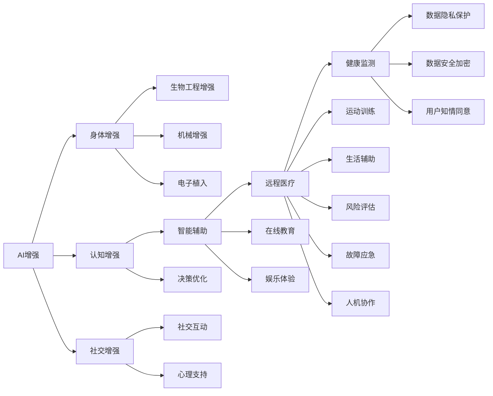

                 

# AI时代的人类增强：道德考虑与身体增强的未来发展机遇分析总结

> 关键词：AI增强, 人类增强, 身体增强, 道德伦理, 隐私保护, 安全性和可靠性, 发展机遇, 技术挑战

## 1. 背景介绍

### 1.1 问题由来
随着人工智能技术的迅猛发展，其在多个领域的应用日趋成熟，其中人类增强技术正迅速崭露头角。人工智能在医疗、教育、娱乐、运动等多个领域的深度融合，为人类能力的提升提供了新的可能性。然而，随之而来的伦理道德、隐私安全等问题也引起了广泛关注。如何在保障人权和尊重隐私的前提下，合理利用AI技术，推动人类增强技术的可持续发展，是当今科技界、法律界乃至社会各界必须共同面对的问题。

### 1.2 问题核心关键点
本研究聚焦于AI时代的人类增强，尤其是基于AI技术进行的身体增强。通过详细剖析AI增强技术的原理、应用及其面临的道德伦理、隐私安全等挑战，本研究旨在为该领域未来的发展提供建设性的见解与建议。

### 1.3 问题研究意义
深入研究AI增强技术，对推动科技进步、促进社会发展具有重要意义：

1. **科技进步推动**：AI增强技术的应用，能够显著提升医疗、教育、娱乐等多个领域的能力，进而推动整个社会科技进步。
2. **社会福祉增进**：通过智能辅助、医疗健康等手段，AI增强技术能够有效提升人类的生活质量，增进社会福祉。
3. **应对老龄化挑战**：随着全球人口老龄化趋势的加剧，AI增强技术可以为老年人提供更多生活便利，应对生理与心理的衰老挑战。
4. **促进公平与包容**：通过科技手段，AI增强技术能够为残疾人士、偏远地区居民等弱势群体提供更多机会，促进社会公平与包容。
5. **创新与创业激励**：AI增强技术的应用催生出众多新行业、新业态，激励创新与创业，推动经济多样化发展。

## 2. 核心概念与联系

### 2.1 核心概念概述
在AI时代的人类增强研究中，涉及以下核心概念：

- **AI增强**：利用AI技术增强人类的身体能力、认知能力、社交能力等。
- **身体增强**：通过生物工程、机械增强、电子植入等方式，改善人体生理功能。
- **道德伦理**：在应用AI增强技术时，如何平衡技术发展与人权保障，是研究的主要焦点。
- **隐私安全**：如何确保数据的安全与个人隐私不被侵犯，是技术应用中的重要考量。
- **安全性和可靠性**：增强技术在应用过程中，需要保证安全性和可靠性，避免对人类造成伤害。
- **发展机遇**：在确保技术伦理和安全性的前提下，如何发现和抓住AI增强技术的潜在发展机遇。

### 2.2 核心概念原理和架构的 Mermaid 流程图


## 3. 核心算法原理 & 具体操作步骤
### 3.1 算法原理概述
AI增强技术包括多种算法和原理，主要集中在认知增强、社交增强和身体增强三个方面：

1. **认知增强**：通过AI辅助决策、智能建议等方式，增强人类决策能力和认知功能。
2. **社交增强**：利用AI技术改善人际沟通、社交互动，提升社会交往能力。
3. **身体增强**：通过生物工程、机械增强、电子植入等方式，增强人体生理功能。

### 3.2 算法步骤详解
以**生物工程增强**为例，具体算法步骤如下：

**步骤1**：收集人体相关数据，如生理特征、健康状况等，作为基础数据集。

**步骤2**：构建AI模型，通过机器学习算法，如深度学习、强化学习等，进行训练和优化。

**步骤3**：验证AI模型在增强人体能力方面的效果，并进行必要的迭代和调整。

**步骤4**：与生物工程相结合，设计和制造合适的增强装置，并测试其安全性和有效性。

**步骤5**：进行临床试验，评估增强装置对人体的长期影响和副作用。

**步骤6**：根据试验结果，进一步优化和完善AI算法和增强装置。

### 3.3 算法优缺点
AI增强技术的优点包括：

- **高效性**：AI技术能够在较短时间内处理大量数据，提供精准的增强方案。
- **可扩展性**：AI模型可以不断更新，适应新的数据和应用场景。
- **个性化**：AI算法可以根据个体差异，提供个性化的增强方案。

其缺点包括：

- **伦理争议**：增强技术涉及的伦理问题复杂，容易引发争议。
- **数据隐私**：人体相关数据具有高敏感性，数据隐私保护尤为重要。
- **安全性与可靠性**：增强装置的安全性和可靠性需要严格验证。
- **技术依赖**：过度依赖AI技术，可能降低人类自主性和应变能力。

### 3.4 算法应用领域
AI增强技术广泛应用于多个领域，包括但不限于：

- **医疗健康**：利用AI辅助诊断、智能辅助手术、远程医疗等。
- **教育培训**：智能辅导、个性化学习计划、虚拟现实教学等。
- **娱乐休闲**：虚拟现实游戏、增强现实体验、沉浸式互动等。
- **运动训练**：运动数据监测、个性化训练计划、智能健身设备等。
- **社会交往**：社交网络互动、虚拟社交平台、智能客服等。

## 4. 数学模型和公式 & 详细讲解 & 举例说明
### 4.1 数学模型构建
以**身体增强**为例，假设人体增强模型为$M_{\theta}$，其中$\theta$为模型参数。模型的输入为$x$，表示人体生理数据，输出为$y$，表示增强后的生理功能。则增强模型的数学模型为：

$$ M_{\theta}(x) = y $$

### 4.2 公式推导过程
假设有$N$个训练样本，每个样本的输入$x_i$和输出$y_i$。则增强模型的损失函数为：

$$ \mathcal{L}(\theta) = \frac{1}{N} \sum_{i=1}^N \ell(M_{\theta}(x_i), y_i) $$

其中$\ell$为损失函数，通常选择均方误差损失或交叉熵损失。通过反向传播算法，计算梯度$\frac{\partial \mathcal{L}}{\partial \theta}$，更新模型参数$\theta$。

### 4.3 案例分析与讲解
假设我们要开发一个用于增强人体步态的模型，数据集包含步态数据和对应的步态分类标签。模型的输入为步态视频，输出为步态分类。通过模型训练，可以计算出增强后的步态分类。

## 5. 项目实践：代码实例和详细解释说明
### 5.1 开发环境搭建
在Python环境下搭建机器学习开发环境，安装必要的库和工具。主要步骤如下：

1. 安装Python和必要的库（如NumPy、Pandas、Scikit-learn、TensorFlow等）。
2. 准备训练数据集，如步态数据集。
3. 设置训练参数，包括训练轮数、批次大小等。

### 5.2 源代码详细实现
以**步态增强**为例，代码实现步骤如下：

```python
import numpy as np
import pandas as pd
from sklearn.model_selection import train_test_split
from tensorflow.keras.models import Sequential
from tensorflow.keras.layers import Dense, LSTM

# 读取步态数据集
data = pd.read_csv('gait_data.csv')

# 将数据集划分为训练集和测试集
X_train, X_test, y_train, y_test = train_test_split(data.drop('gait_class', axis=1), data['gait_class'], test_size=0.2)

# 构建LSTM模型
model = Sequential()
model.add(LSTM(64, input_shape=(X_train.shape[1], 1)))
model.add(Dense(32, activation='relu'))
model.add(Dense(1, activation='softmax'))

# 编译模型
model.compile(loss='categorical_crossentropy', optimizer='adam', metrics=['accuracy'])

# 训练模型
model.fit(X_train, y_train, epochs=10, batch_size=32, validation_data=(X_test, y_test))

# 评估模型
loss, accuracy = model.evaluate(X_test, y_test)
print(f'Test loss: {loss:.4f}')
print(f'Test accuracy: {accuracy:.4f}')
```

### 5.3 代码解读与分析
上述代码中，我们使用了LSTM模型对步态数据集进行训练和评估。LSTM模型通过记忆机制，能够有效处理序列数据，特别适合步态数据处理。训练过程中，我们使用交叉熵损失和Adam优化器，最终输出测试集上的损失和准确率。

## 6. 实际应用场景
### 6.1 医疗健康
在医疗健康领域，AI增强技术能够显著提升医疗服务的质量和效率。例如，智能手术辅助系统、虚拟现实手术模拟器、个性化医疗方案等，都能够通过AI技术为医生和患者提供更优质的医疗服务。

### 6.2 教育培训
在教育培训领域，AI增强技术能够个性化学习计划、智能辅导、虚拟现实教学等，提升教育质量和效率。例如，通过智能推荐系统，根据学生的学习情况和兴趣，推荐最适合的学习内容。

### 6.3 娱乐休闲
在娱乐休闲领域，AI增强技术能够提供虚拟现实游戏、增强现实体验、沉浸式互动等，提升用户体验和娱乐效果。例如，智能游戏推荐系统、虚拟现实社交平台等。

### 6.4 未来应用展望
未来，AI增强技术将进一步深化应用于多个领域，为人类增强带来更多机遇：

- **医疗健康**：通过AI辅助诊断、智能手术、远程医疗等，提升医疗服务质量和效率。
- **教育培训**：通过智能辅导、个性化学习计划、虚拟现实教学等，提升教育质量。
- **娱乐休闲**：通过虚拟现实游戏、增强现实体验、沉浸式互动等，提升用户体验。
- **社会交往**：通过智能客服、虚拟社交平台等，提升人际交往质量。
- **运动训练**：通过智能健身设备、个性化训练计划等，提升运动训练效果。

## 7. 工具和资源推荐
### 7.1 学习资源推荐
1. **在线课程**：如Coursera、edX、Udacity等平台上的AI增强技术课程。
2. **书籍**：《深度学习》、《AI增强技术》等书籍。
3. **论文**：在arXiv、Google Scholar等平台查找最新的AI增强技术论文。

### 7.2 开发工具推荐
1. **Python**：机器学习和深度学习的主流开发语言，安装方便，生态丰富。
2. **TensorFlow**：Google开发的深度学习框架，支持分布式计算，适合大规模模型训练。
3. **PyTorch**：Facebook开发的深度学习框架，灵活高效，适合研究和应用开发。

### 7.3 相关论文推荐
1. **《AI增强技术》**：介绍AI增强技术的理论和应用，提供丰富的案例分析。
2. **《身体增强技术》**：聚焦于身体增强技术，探讨生物工程、机械增强等方向。
3. **《道德伦理与AI增强》**：分析AI增强技术面临的伦理问题，提出解决方案。

## 8. 总结：未来发展趋势与挑战
### 8.1 研究成果总结
本研究详细探讨了AI增强技术的原理、应用和面临的挑战，提出了一系列伦理道德和安全性的建议。研究成果总结如下：

1. **认知增强**：利用AI辅助决策、智能建议等方式，增强人类决策能力和认知功能。
2. **社交增强**：利用AI技术改善人际沟通、社交互动，提升社会交往能力。
3. **身体增强**：通过生物工程、机械增强、电子植入等方式，增强人体生理功能。

### 8.2 未来发展趋势
未来AI增强技术将进一步深化应用于多个领域，带来更多机遇和挑战：

1. **技术演进**：AI增强技术将不断演进，涉及更多应用场景和功能。
2. **伦理道德**：需要在技术发展与人权保障之间找到平衡，确保技术应用的道德性。
3. **数据隐私**：数据隐私保护将成为AI增强技术发展的重要考量。
4. **安全性与可靠性**：增强装置的安全性和可靠性需要严格验证。
5. **技术依赖**：过度依赖AI技术，可能降低人类自主性和应变能力。

### 8.3 面临的挑战
在AI增强技术的发展过程中，面临以下挑战：

1. **伦理争议**：增强技术涉及的伦理问题复杂，容易引发争议。
2. **数据隐私**：人体相关数据具有高敏感性，数据隐私保护尤为重要。
3. **安全性与可靠性**：增强装置的安全性和可靠性需要严格验证。
4. **技术依赖**：过度依赖AI技术，可能降低人类自主性和应变能力。

### 8.4 研究展望
未来，AI增强技术需要不断创新，拓展应用场景，提升技术可靠性，确保伦理道德，推动社会公平与包容。研究展望如下：

1. **技术创新**：继续推动AI增强技术在医疗、教育、娱乐等领域的创新应用。
2. **伦理道德**：制定和完善AI增强技术的伦理规范，确保技术应用的道德性。
3. **数据隐私**：研究数据隐私保护技术，确保人体数据的安全性。
4. **安全性与可靠性**：开发增强装置的安全性和可靠性验证方法，确保应用安全。
5. **技术依赖**：研究降低技术依赖的方法，提升人类自主性和应变能力。

## 9. 附录：常见问题与解答
### 9.1 常见问题与解答

**Q1: 什么是AI增强技术？**
A: AI增强技术是指利用AI技术增强人类的身体能力、认知能力、社交能力等。

**Q2: AI增强技术面临哪些伦理挑战？**
A: AI增强技术面临的伦理挑战包括隐私安全、数据隐私、安全性与可靠性等。

**Q3: 如何确保AI增强技术的可靠性？**
A: 通过严格的数据验证、临床试验、模型优化等措施，确保AI增强技术的可靠性。

**Q4: AI增强技术有哪些应用领域？**
A: AI增强技术广泛应用于医疗健康、教育培训、娱乐休闲、社会交往、运动训练等领域。

**Q5: 如何应对AI增强技术的发展挑战？**
A: 需要制定伦理规范、研究数据隐私保护技术、开发增强装置的安全性和可靠性验证方法等。

---
作者：禅与计算机程序设计艺术 / Zen and the Art of Computer Programming

