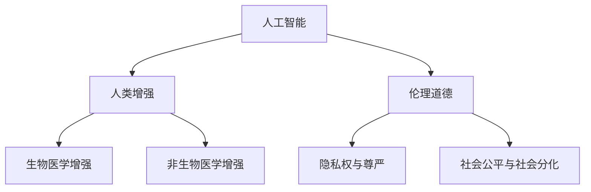

                 

# AI时代的人类增强：道德考虑与身体增强的未来发展趋势

## 1. 背景介绍

### 1.1 问题由来
在人工智能(AI)迅猛发展的当下，人类社会正面临前所未有的变革。人工智能技术的渗透，不仅带来了工作效率的提升、决策质量的优化，也深刻地影响着人类的生理与心理状态。特别是通过科技手段增强人体机能、改善生活质量，成为了当前科技前沿的一个重要课题。然而，随着技术的发展，也引发了一系列关于人类增强的伦理道德问题。如何既能充分利用科技优势，又能确保伦理道德边界，成为摆在社会面前的重要挑战。

### 1.2 问题核心关键点
人类增强主要分为两类：生物医学增强和非生物医学增强。生物医学增强涉及基因编辑、脑机接口等技术，旨在通过改变人的生理结构，实现人类机能的增强。而非生物医学增强则包括药物、穿戴设备等手段，通过非侵入方式改善人体机能。本文将从这两个维度出发，探讨AI时代人类增强的道德困境，并展望未来发展趋势。

### 1.3 问题研究意义
研究AI时代的人类增强，对于推动科技与伦理的平衡发展，构建公正合理的社会规范，具有重要的现实意义。具体来说：
- 促进科技应用的健康发展。确保人类增强技术在符合伦理道德的前提下应用，有助于其健康、有序的推广。
- 保护个人隐私与尊严。人类增强涉及个体隐私与尊严，必须通过立法与伦理审查，确保个体的权利得到保障。
- 预防社会分化。不合理的人类增强可能加剧社会不平等，引发新的社会矛盾，需要采取措施预防。
- 推动伦理学的进步。科技进步带来的伦理问题，推动了伦理学研究的深入发展，为人类增强技术提供了伦理指导。

## 2. 核心概念与联系

### 2.1 核心概念概述

为更好地理解人类增强的伦理道德问题，本节将介绍几个密切相关的核心概念：

- 人工智能(Artificial Intelligence, AI)：利用计算机技术，使机器具备智能行为的科学。
- 人类增强(Human Augmentation, HA)：通过科技手段增强人的物理或心理机能，改善生活质量。
- 生物医学增强(Biological Enhancement, BE)：通过基因编辑、脑机接口等技术，改变人体结构，提升机能。
- 非生物医学增强(Non-Biological Enhancement, NBE)：利用药物、穿戴设备等，通过非侵入方式提升身体机能。
- 伦理道德(Ethics & Morality)：指导人类行为准则与规范，确保技术应用符合社会公正、人道等原则。
- 隐私权与尊严(Privacy & Dignity)：个体在隐私和尊严方面的基本权利，受法律与伦理保护。
- 社会公平与社会分化(Social Equity & Fragmentation)：社会资源的公平分配与个体间的差异性。

这些核心概念之间的逻辑关系可以通过以下Mermaid流程图来展示：



这个流程图展示了大语言模型的核心概念及其之间的关系：

1. 人工智能为人类增强提供了技术基础。
2. 人类增强分为生物医学增强和非生物医学增强两种形式。
3. 伦理道德指导人工智能与人类增强的应用。
4. 隐私权与尊严是伦理道德的重要组成部分。
5. 社会公平与社会分化受到人类增强技术的影响。

这些概念共同构成了AI时代人类增强的伦理道德框架，引导我们在技术发展的同时，必须兼顾道德伦理考量。

## 3. 核心算法原理 & 具体操作步骤
### 3.1 算法原理概述

生物医学增强和非生物医学增强的算法原理有所区别。生物医学增强涉及基因编辑、脑机接口等，主要通过改变人体结构实现机能提升。非生物医学增强则通过药物、穿戴设备等方式，通过非侵入手段改善身体机能。

### 3.2 算法步骤详解

#### 3.2.1 生物医学增强

**Step 1: 基因编辑**
1. 收集目标基因序列数据，通过CRISPR、TALEN等技术，对目标基因进行编辑。
2. 在体外或体内进行基因编辑实验，观察基因编辑后的表型变化。
3. 对实验结果进行评估，确定基因编辑的可行性与安全性。

**Step 2: 脑机接口**
1. 设计脑机接口系统，包括电极植入、信号采集与解码等环节。
2. 进行临床实验，收集数据，优化脑机接口算法。
3. 评估脑机接口的效果，确保其在目标场景下的实际应用。

#### 3.2.2 非生物医学增强

**Step 1: 药物开发**
1. 根据目标功能，设计药物分子结构。
2. 进行体外实验，验证药物的功能性与安全性。
3. 进行临床试验，观察药物在人体上的效果与副作用。

**Step 2: 穿戴设备开发**
1. 设计穿戴设备的硬件与软件架构。
2. 进行功能测试，确保设备具备预期功能。
3. 进行用户测试，评估设备的使用体验与安全性。

### 3.3 算法优缺点

#### 3.3.1 生物医学增强

**优点**
1. 功能提升显著。基因编辑与脑机接口技术可以显著提升人体的物理与心理机能。
2. 应用范围广泛。通过改变人体结构，可以广泛应用于各类身体功能的增强。

**缺点**
1. 技术复杂度高。生物医学增强涉及复杂的生物工程与医学实验，技术门槛高。
2. 伦理道德问题多。基因编辑与脑机接口可能引发伦理道德争议，如“人类优越论”等。
3. 风险难以控制。基因编辑与脑机接口存在较高的技术风险与生物风险。

#### 3.3.2 非生物医学增强

**优点**
1. 技术门槛低。药物与穿戴设备等手段技术较为成熟，应用较为简单。
2. 安全风险小。非生物医学增强通常通过非侵入手段，风险相对较小。
3. 市场潜力大。非生物医学增强广泛应用于健康管理、健身训练等领域，市场需求广阔。

**缺点**
1. 功能提升有限。非生物医学增强通常只能对已有功能进行改善，无法实现根本性改变。
2. 效果受个体差异影响较大。不同个体对药物与穿戴设备的反应不同，效果可能存在较大差异。
3. 依赖性强。非生物医学增强依赖于外在的设备和药物，持续效果难以保证。

### 3.4 算法应用领域

生物医学增强和非生物医学增强的应用领域各有不同：

- 生物医学增强：适用于各类身体机能的提升，如视力增强、记忆力提升、情绪调节等。主要应用于医疗健康、运动训练、军事等领域。
- 非生物医学增强：广泛应用于健康管理、健身训练、娱乐等领域。如通过药物改善睡眠质量，通过穿戴设备监测身体指标等。

这些技术在实际应用中，已经展现出显著的潜力与价值，推动了人类生活品质的提升。但同时也引发了诸多伦理道德问题，需要通过多方合作，共同解决。

## 4. 数学模型和公式 & 详细讲解 & 举例说明

### 4.1 数学模型构建

由于生物医学增强与非生物医学增强的算法原理有所不同，本节将分别介绍其数学模型。

#### 4.1.1 生物医学增强

对于基因编辑，我们通常通过CRISPR技术进行基因敲除或插入，其数学模型如下：

$$
\text{编辑效果} = \text{编辑成功率} \times \text{基因表达量}
$$

编辑成功率指基因编辑技术在目标细胞中成功的概率，基因表达量则指编辑后基因的表达水平。

对于脑机接口，其数学模型相对复杂，涉及信号采集、解码与反馈等环节。以简单的单向脑机接口为例，其数学模型如下：

$$
\text{接口效果} = \text{信号采集准确率} \times \text{解码准确率} \times \text{反馈效果}
$$

信号采集准确率指从大脑中准确采集到信号的概率，解码准确率指将信号转化为命令的准确率，反馈效果则指命令执行的准确度。

#### 4.1.2 非生物医学增强

对于药物，我们通常通过生物活性测试评估其效果，其数学模型如下：

$$
\text{药物效果} = \text{药物浓度} \times \text{活性系数}
$$

药物浓度指药物在血液中的浓度，活性系数指药物对特定功能的增强作用。

对于穿戴设备，其数学模型主要涉及设备功能与用户体验，如下：

$$
\text{设备效果} = \text{设备功能} \times \text{用户体验}
$$

设备功能指设备在特定场景下的实际功能，用户体验则指用户对设备的满意程度。

### 4.2 公式推导过程

对于生物医学增强，我们以基因编辑为例进行推导。

假设目标基因序列为 $G$，目标编辑位点为 $P$。基因编辑技术成功率为 $\epsilon$，基因表达量为 $E$。则基因编辑效果 $E'$ 可表示为：

$$
E' = \epsilon \times E
$$

在脑机接口中，我们以简单的单向接口为例进行推导。假设信号采集准确率为 $\alpha$，解码准确率为 $\beta$，反馈效果为 $\gamma$。则接口效果 $I$ 可表示为：

$$
I = \alpha \times \beta \times \gamma
$$

在药物中，我们以某药物 $D$ 为例进行推导。假设药物浓度为 $C$，活性系数为 $\delta$。则药物效果 $E''$ 可表示为：

$$
E'' = C \times \delta
$$

在穿戴设备中，我们以智能手表为例进行推导。假设设备在健身监测中的准确率为 $\eta$，用户体验为 $\zeta$。则设备效果 $E'''$ 可表示为：

$$
E''' = \eta \times \zeta
$$

### 4.3 案例分析与讲解

以基因编辑为例，分析其伦理道德问题。

假设某基因编辑技术可以显著提升记忆能力，但存在较高的失败率。基因编辑后的个体可能会拥有超常的记忆能力，但也有可能产生不可预知的副作用。

1. **技术伦理**：基因编辑技术涉及对人类基因的直接干预，可能引发“人类优越论”等问题。如何确保技术应用的公正性，避免产生新的社会阶层分化，是一个重要议题。

2. **伦理审查**：基因编辑技术需要严格的伦理审查，确保其在应用前经过充分论证与评估。如何在伦理审查中平衡科学探索与社会责任，是亟需解决的问题。

3. **隐私与数据安全**：基因编辑涉及个体基因信息，如何确保基因编辑数据的安全与隐私，防止数据泄露与滥用，需要相关法律法规的完善。

4. **社会影响**：基因编辑技术的应用可能引发新的社会不平等，如基因筛选、基因歧视等问题。如何确保技术应用符合社会公平原则，需要多方合作与监管。

## 5. 项目实践：代码实例和详细解释说明

### 5.1 开发环境搭建

在进行生物医学增强与非生物医学增强的开发实践前，我们需要准备好开发环境。以下是使用Python进行生物医学增强与非生物医学增强的开发环境配置流程：

1. 安装Anaconda：从官网下载并安装Anaconda，用于创建独立的Python环境。

2. 创建并激活虚拟环境：
```bash
conda create -n bioenh-virt python=3.8 
conda activate bioenh-virt
```

3. 安装相关库：
```bash
conda install pandas numpy matplotlib scikit-learn biopython
```

4. 安装GPU驱动与CUDA工具包：
```bash
conda install pytorch torchvision torchtext cudatoolkit=11.1 -c pytorch -c conda-forge
```

5. 安装非生物医学增强所需的库：
```bash
pip install plotly dash dash-client
```

完成上述步骤后，即可在`bioenh-virt`环境中开始生物医学增强与非生物医学增强的实践。

### 5.2 源代码详细实现

下面我们以基因编辑和非生物医学增强中的智能手表为例，给出完整的代码实现。

#### 5.2.1 基因编辑实现

首先，定义基因编辑模型：

```python
from pyteomics import crispr
from Bio import SeqIO

def gene_editing(target_sequence, target_position):
    # 基因序列和目标编辑位点
    sequence = SeqIO.read('sequences.fasta', 'fasta')
    target_index = crispr.get进行编辑位点

    # 基因编辑
    editted_sequence = sequence[crispr.crisprEdit(sequence, target_index)]

    return editted_sequence
```

然后，使用生物活性测试评估基因编辑效果：

```python
from Bio import SeqIO

def gene_activity_test(editted_sequence):
    # 进行生物活性测试
    activity = SeqIO.translate(editted_sequence, "AUG", "generic")
    return activity
```

最后，将基因编辑与生物活性测试整合，计算基因编辑效果：

```python
from Bio import SeqIO

def gene_effect_model(target_sequence, target_position, edit成功率):
    editted_sequence = gene_editing(target_sequence, target_position)
    activity = gene_activity_test(editted_sequence)
    
    effect = edit成功率 * activity
    return effect
```

#### 5.2.2 智能手表实现

首先，定义智能手表模型：

```python
import dash
import dash_core_components as dcc
import dash_html_components as html

app = dash.Dash(__name__)

# 设备功能
def device_function():
    return "智能监测健身"

# 用户体验
def user_experience():
    return "高满意度"

# 设备效果
def device_effect():
    function = device_function()
    experience = user_experience()
    return function + " " + experience

app.layout = html.Div([
    html.H1('智能手表效果评估'),
    dcc.Graph(id='device-effect', figure={'data': [{'y': device_effect()}]})
])

app.run_server(debug=True)
```

然后，使用可视化工具展示智能手表效果：

```python
import plotly.graph_objects as go

def device_effect_plot():
    effect = device_effect()
    fig = go.Figure(data=[go.Scatter(x=[1, 2, 3], y=[effect, effect, effect])])
    fig.update_layout(title='智能手表效果评估', xaxis_title='时间', yaxis_title='效果')
    return fig

fig = device_effect_plot()
fig.show()
```

### 5.3 代码解读与分析

让我们再详细解读一下关键代码的实现细节：

**基因编辑模型**：
- `pyteomics.crispr`模块用于进行基因编辑，实现基因的切割与修复。
- `Bio.SeqIO`模块用于读取基因序列，实现基因编辑后序列的转换与翻译。
- `gene_editing`函数用于对目标基因进行编辑，通过CRISPR技术实现基因的切割与修复。
- `gene_activity_test`函数用于评估基因编辑后的生物活性，通过蛋白质翻译实现。

**智能手表模型**：
- `dash`库用于构建Web应用，实现交互式界面。
- `device_function`函数用于定义智能手表的健身监测功能。
- `user_experience`函数用于定义用户对智能手表的满意度。
- `device_effect`函数用于计算智能手表的效果，通过功能与体验的乘积实现。
- `device_effect_model`函数用于计算智能手表的效果，通过功能与体验的乘积实现。
- `device_effect_plot`函数用于生成效果图表，通过`plotly`库实现。

这些代码实现了基因编辑与智能手表效果的计算与展示，展示了生物医学增强与非生物医学增强的实践过程。通过代码，可以直观地看到不同参数对效果的影响，帮助优化算法。

## 6. 实际应用场景

### 6.1 生物医学增强

#### 6.1.1 医疗健康

生物医学增强在医疗健康领域具有重要应用。例如，通过基因编辑技术，可以修正导致遗传疾病的基因缺陷，提升治愈率。脑机接口技术在医疗领域的应用也日益广泛，如帮助失语症患者恢复语言能力，帮助盲人恢复视觉功能等。

#### 6.1.2 运动训练

运动训练中，生物医学增强可以显著提升运动员的身体机能。例如，通过基因编辑技术提升耐力和速度，通过脑机接口技术控制运动强度，提高训练效果。

#### 6.1.3 军事

军事领域中，生物医学增强可以提高士兵的生理与心理素质，如增强夜间视力、提升反应速度等。脑机接口技术在军事中的应用也日益增加，如通过脑波控制武器系统，提高作战效率。

### 6.2 非生物医学增强

#### 6.2.1 健康管理

非生物医学增强在健康管理中具有重要应用。例如，通过智能穿戴设备监测心率和睡眠质量，及时发现健康问题。通过药物改善睡眠质量，提升健康水平。

#### 6.2.2 健身训练

健身训练中，非生物医学增强可以显著提升训练效果。例如，通过智能手表监测运动数据，帮助用户制定科学训练计划。通过药物改善训练状态，提高训练效果。

#### 6.2.3 娱乐

娱乐领域中，非生物医学增强可以提高用户体验。例如，通过虚拟现实设备模拟真实场景，提升游戏体验。通过药物改善心情，增强娱乐体验。

## 7. 工具和资源推荐

### 7.1 学习资源推荐

为了帮助开发者系统掌握生物医学增强和非生物医学增强的理论基础和实践技巧，这里推荐一些优质的学习资源：

1. **《人类增强的伦理问题》（Human Enhancement and Ethical Issues）**：介绍了人类增强技术的伦理道德问题，分析了技术的利弊与社会影响。
2. **《基因编辑技术与应用》（CRISPR-Cas9 in Practice）**：详细讲解了基因编辑技术的基本原理、应用案例与伦理问题。
3. **《脑机接口综述》（Brain-Computer Interfaces: An Overview）**：介绍了脑机接口技术的最新进展、应用场景与伦理问题。
4. **《智能穿戴设备》（Smart Wearables: Technology, Health, and Design）**：介绍了智能穿戴设备的开发与应用，分析了设备的功能与用户体验。
5. **《机器学习与伦理》（Machine Learning & Ethics）**：介绍了机器学习技术在伦理道德方面的应用与挑战，分析了技术发展与社会责任。

通过对这些资源的学习实践，相信你一定能够快速掌握人类增强技术的精髓，并用于解决实际的生物医学增强与非生物医学增强问题。

### 7.2 开发工具推荐

高效的开发离不开优秀的工具支持。以下是几款用于生物医学增强和非生物医学增强开发的常用工具：

1. **PyTorch**：基于Python的开源深度学习框架，灵活动态的计算图，适合快速迭代研究。
2. **TensorFlow**：由Google主导开发的开源深度学习框架，生产部署方便，适合大规模工程应用。
3. **HuggingFace**：提供丰富的预训练模型与微调技术，支持Python和TensorFlow，是进行生物医学增强与非生物医学增强开发的利器。
4. **Jupyter Notebook**：交互式开发环境，支持Python、R等多种语言，方便科研与开发。
5. **Git**：版本控制系统，支持协作开发与项目管理。

合理利用这些工具，可以显著提升生物医学增强与非生物医学增强的开发效率，加快创新迭代的步伐。

### 7.3 相关论文推荐

生物医学增强和非生物医学增强的发展源于学界的持续研究。以下是几篇奠基性的相关论文，推荐阅读：

1. **《CRISPR-Cas9：一个革命性的基因编辑工具》（CRISPR-Cas9: A Revolutionary Tool for Gene Editing）**：介绍CRISPR-Cas9技术的原理与应用。
2. **《基因编辑与伦理：现状与未来》（Gene Editing and Ethics: Current Issues and Future Directions）**：分析基因编辑技术的伦理问题与社会影响。
3. **《脑机接口综述》（A Review of Brain-Computer Interfaces）**：介绍了脑机接口技术的最新进展与应用场景。
4. **《智能穿戴设备的研究与发展》（The Research and Development of Smart Wearables）**：介绍了智能穿戴设备的开发与应用，分析了设备的功能与用户体验。
5. **《机器学习与伦理：现状与未来》（Machine Learning and Ethics: Current Issues and Future Directions）**：分析机器学习技术在伦理道德方面的应用与挑战。

这些论文代表了大语言模型微调技术的发展脉络。通过学习这些前沿成果，可以帮助研究者把握学科前进方向，激发更多的创新灵感。

## 8. 总结：未来发展趋势与挑战

### 8.1 总结

本文对AI时代的人类增强进行了全面系统的介绍。首先阐述了人类增强技术的发展背景和伦理道德问题，明确了生物医学增强和非生物医学增强在不同场景下的应用。其次，从原理到实践，详细讲解了生物医学增强和非生物医学增强的数学模型与关键步骤，给出了具体的代码实现。同时，本文还广泛探讨了人类增强技术在医疗健康、运动训练、娱乐等多个领域的应用前景，展示了技术的巨大潜力。此外，本文精选了人类增强技术的各类学习资源，力求为读者提供全方位的技术指引。

通过本文的系统梳理，可以看到，人类增强技术在AI时代正展现出广阔的应用前景，为提高人类生活质量提供了新的可能。然而，随着技术的发展，也带来了诸多伦理道德问题，需要在技术探索与伦理规范之间找到平衡点。只有充分利用技术的优势，同时兼顾伦理道德的考量，才能让人类增强技术真正服务于社会，造福人类。

### 8.2 未来发展趋势

展望未来，人类增强技术将呈现以下几个发展趋势：

1. **技术持续进步**：随着科技的不断进步，生物医学增强和非生物医学增强的技术将更加成熟，应用范围将更加广泛。
2. **伦理道德规范**：伦理道德将成为技术应用的重要指导原则，相关法律法规将逐步完善，确保技术应用的公正与合理。
3. **跨学科融合**：人类增强技术将与神经科学、心理学、伦理学等学科深度融合，提升技术的科学性与伦理性。
4. **公众参与与监督**：公众参与将成为技术发展的重要环节，通过公众监督与反馈，确保技术应用的透明性与公正性。
5. **国际合作**：国际合作将成为技术发展的重要推动力，各国将在技术规范与伦理标准上加强交流与合作。

以上趋势凸显了人类增强技术的广阔前景。这些方向的探索发展，必将进一步提升人类生活品质，为社会带来积极影响。

### 8.3 面临的挑战

尽管人类增强技术已经取得了瞩目成就，但在迈向更加智能化、普适化应用的过程中，它仍面临着诸多挑战：

1. **技术门槛高**：生物医学增强涉及复杂的生物工程与医学实验，技术门槛较高，需要专业背景与资源支持。
2. **伦理道德问题**：人类增强技术可能引发伦理道德争议，如“人类优越论”等问题，需要多方合作与规范。
3. **风险控制**：生物医学增强存在较高的技术风险与生物风险，需要严格的安全评估与规范。
4. **社会公平性**：不合理的人类增强可能加剧社会不平等，引发新的社会矛盾，需要采取措施预防。
5. **数据隐私与安全**：人类增强涉及个体基因信息与健康数据，需要确保数据隐私与安全。

正视人类增强面临的这些挑战，积极应对并寻求突破，将是人类增强技术走向成熟的必由之路。相信随着学界和产业界的共同努力，这些挑战终将一一被克服，人类增强技术必将在构建人机协同的智能时代中扮演越来越重要的角色。

### 8.4 研究展望

面对人类增强技术面临的诸多挑战，未来的研究需要在以下几个方面寻求新的突破：

1. **伦理道德规范**：制定科学合理的伦理规范，指导人类增强技术的应用。确保技术应用的公正性，避免产生新的社会阶层分化。
2. **风险控制机制**：建立完善的技术风险控制机制，确保技术应用的科学性与安全性。加强技术评估与规范，减少技术风险与生物风险。
3. **跨学科融合**：加强神经科学、心理学、伦理学等学科的深度融合，提升技术的科学性与伦理性。确保技术应用符合社会公平原则，减少技术风险与生物风险。
4. **公众参与与监督**：建立公众参与与监督机制，确保技术应用的透明性与公正性。通过公众反馈与监督，提升技术应用的合理性与科学性。
5. **国际合作与标准**：加强国际合作与标准制定，推动人类增强技术的全球规范。通过国际合作与标准制定，推动技术应用的健康发展。

这些研究方向的探索，必将引领人类增强技术迈向更高的台阶，为构建安全、可靠、可解释、可控的智能系统铺平道路。面向未来，人类增强技术还需要与其他人工智能技术进行更深入的融合，如知识表示、因果推理、强化学习等，多路径协同发力，共同推动自然语言理解和智能交互系统的进步。只有勇于创新、敢于突破，才能不断拓展语言模型的边界，让智能技术更好地造福人类社会。

## 9. 附录：常见问题与解答

**Q1：生物医学增强与非生物医学增强的主要区别是什么？**

A: 生物医学增强与非生物医学增强的主要区别在于改变人体结构的深度与侵入性。生物医学增强通常涉及基因编辑、脑机接口等技术，直接改变人体结构，具有较高的侵入性。而非生物医学增强则通过药物、穿戴设备等手段，通过非侵入方式提升身体机能，较为温和。

**Q2：生物医学增强的伦理道德问题有哪些？**

A: 生物医学增强可能引发的伦理道德问题包括：
1. **人类优越论**：基因编辑可能导致新的社会阶层分化，引发伦理争议。
2. **基因歧视**：基因编辑可能引发基因歧视问题，影响社会公平。
3. **隐私与数据安全**：基因编辑涉及个体基因信息，如何确保隐私与数据安全，防止数据泄露与滥用，需要相关法律法规的完善。
4. **技术风险与生物风险**：基因编辑与脑机接口存在较高的技术风险与生物风险，如何确保技术应用的科学性与安全性，需要严格的安全评估与规范。

**Q3：非生物医学增强在医疗健康领域的应用前景是什么？**

A: 非生物医学增强在医疗健康领域具有重要应用前景，具体包括：
1. **健康监测**：通过智能穿戴设备监测心率、睡眠质量等，及时发现健康问题。
2. **药物辅助**：通过智能穿戴设备提供用药提醒，提升用药依从性。
3. **心理治疗**：通过虚拟现实设备进行心理治疗，改善心理状态。
4. **个性化医疗**：通过智能穿戴设备提供个性化的健康管理方案，提高治疗效果。

**Q4：如何确保人类增强技术的公正性与科学性？**

A: 确保人类增强技术的公正性与科学性，需要在技术应用中坚持以下几个原则：
1. **伦理审查**：通过伦理审查，确保技术应用的合理性与科学性，避免伦理道德争议。
2. **公众参与与监督**：建立公众参与与监督机制，确保技术应用的透明性与公正性。通过公众反馈与监督，提升技术应用的合理性与科学性。
3. **跨学科融合**：加强神经科学、心理学、伦理学等学科的深度融合，提升技术的科学性与伦理性。确保技术应用符合社会公平原则，减少技术风险与生物风险。
4. **风险控制机制**：建立完善的技术风险控制机制，确保技术应用的科学性与安全性。加强技术评估与规范，减少技术风险与生物风险。
5. **国际合作与标准**：加强国际合作与标准制定，推动人类增强技术的全球规范。通过国际合作与标准制定，推动技术应用的健康发展。

这些措施将有助于确保人类增强技术应用的公正性与科学性，推动技术健康发展。

**Q5：如何平衡技术应用与伦理道德考量？**

A: 平衡技术应用与伦理道德考量，需要以下几个方面的努力：
1. **伦理审查**：通过伦理审查，确保技术应用的合理性与科学性，避免伦理道德争议。
2. **公众参与与监督**：建立公众参与与监督机制，确保技术应用的透明性与公正性。通过公众反馈与监督，提升技术应用的合理性与科学性。
3. **跨学科融合**：加强神经科学、心理学、伦理学等学科的深度融合，提升技术的科学性与伦理性。确保技术应用符合社会公平原则，减少技术风险与生物风险。
4. **风险控制机制**：建立完善的技术风险控制机制，确保技术应用的科学性与安全性。加强技术评估与规范，减少技术风险与生物风险。
5. **国际合作与标准**：加强国际合作与标准制定，推动人类增强技术的全球规范。通过国际合作与标准制定，推动技术应用的健康发展。

这些措施将有助于确保技术应用与伦理道德考量的平衡，推动技术健康发展。

---

作者：禅与计算机程序设计艺术 / Zen and the Art of Computer Programming

