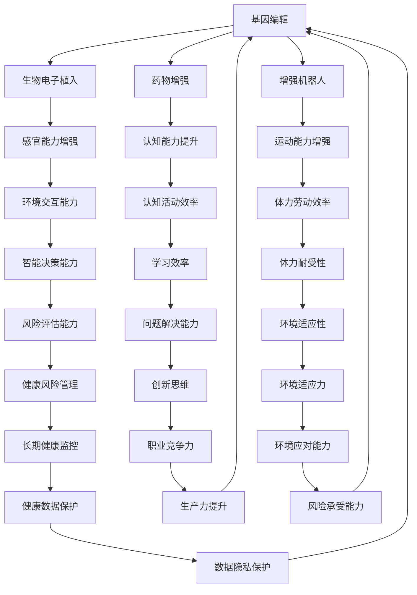

                 

# AI时代的人类增强：道德考虑和身体增强的挑战

## 1. 背景介绍

### 1.1 问题由来

随着人工智能(AI)技术的快速发展，人类在增强自身能力方面的可能性已经初现端倪。这不仅包括智力增强、认知提升，更延伸到身体能力的直接增强。这些技术的快速演进给人类社会带来了前所未有的机遇，同时也提出了严峻的道德挑战。

### 1.2 问题核心关键点

AI时代的身体增强技术主要包括以下几种：
- **基因编辑**：通过CRISPR等技术直接修改人类基因，提升身体机能。
- **生物电子植入**：如神经芯片、视觉增强器等，直接提升感官能力。
- **药物增强**：通过定制化药物提升认知、体能等。
- **增强机器人**：如外骨骼、仿生肢体，增强人类运动和生存能力。

这些技术的应用不仅关乎个人健康和福祉，还牵涉到隐私保护、公平正义等伦理问题，因此必须深入探讨。

### 1.3 问题研究意义

探讨AI时代的人类增强技术，对个人和社会具有深远影响：

- **个人层面**：提升认知、运动、感官等能力，改善生活质量，实现潜能最大化。
- **社会层面**：推动教育、医疗、工作等领域的全面革新，带来新的社会结构和价值观。
- **道德伦理**：面对增强技术的广泛应用，如何保障公平正义、保护隐私和尊严，是亟待解决的问题。

## 2. 核心概念与联系

### 2.1 核心概念概述

为更好地理解AI时代的人类增强技术，本节将介绍几个密切相关的核心概念：

- **基因编辑**：通过基因工程手段，如CRISPR，直接修改人类基因，修复遗传性疾病，提升身体机能。
- **生物电子植入**：在人体内植入生物电子设备，如神经芯片、视觉增强器等，提升感官能力。
- **药物增强**：通过定制化药物，如认知增强剂、能量补充剂等，提升认知和体能。
- **增强机器人**：如外骨骼、仿生肢体，通过物理辅助设备增强人类运动和生存能力。

这些技术通过改善人类自身的物理和认知能力，增强了人类与环境的交互能力。但它们的应用也引发了一系列伦理和道德问题，如隐私保护、公平正义、生物安全等。

- **隐私保护**：增强技术的实施可能涉及大量的个人数据，如何保护这些数据不被滥用是一个重要问题。
- **公平正义**：增强技术可能会加剧社会不平等，只有确保每个人都享有公平使用技术的机会，才能实现社会的整体福祉。
- **生物安全**：增强技术的滥用可能带来新的生物安全风险，需要建立严格的监管和伦理审查机制。

这些核心概念之间的逻辑关系可以通过以下Mermaid流程图来展示：



这个流程图展示了大语言模型的核心概念及其之间的关系：

1. 人类增强技术通过提升基因、感官、认知、运动等能力，增强了与环境的交互能力。
2. 这些技术的应用涉及隐私保护、公平正义、生物安全等伦理问题。
3. 隐私保护、公平正义、生物安全三者互为因果，必须共同考虑。

## 3. 核心算法原理 & 具体操作步骤
### 3.1 算法原理概述

AI时代的人类增强技术，虽然在原理上与传统AI不同，但也可以通过模型训练和优化来实现。具体而言，这些技术的应用通常涉及以下步骤：

- **数据收集与预处理**：收集与增强技术相关的数据，并进行清洗、标注等预处理。
- **模型训练与优化**：构建增强技术的模型，并在数据集上进行训练和优化，以提升性能。
- **技术实施与监控**：将优化后的模型应用于实际场景，并对其实施效果进行监控和评估。

### 3.2 算法步骤详解

以下以基因编辑技术为例，介绍其具体的算法步骤：

**Step 1: 数据收集与预处理**
- 收集基因数据：从基因库、生物样本库等获取基因数据。
- 数据清洗与标注：去除噪声数据，标注基因变异对功能的影响。

**Step 2: 构建模型**
- 选择适合的算法模型：如决策树、神经网络等。
- 设计特征提取方法：从基因序列中提取关键特征。
- 确定模型参数：如学习率、迭代次数等。

**Step 3: 模型训练与优化**
- 训练模型：使用基因数据对模型进行训练。
- 模型评估：使用验证集评估模型性能，调整参数。
- 模型优化：使用交叉验证、网格搜索等技术优化模型。

**Step 4: 技术实施与监控**
- 应用模型：将优化后的模型应用于基因编辑技术中。
- 监控效果：实时监控基因编辑的实施效果，调整参数。
- 数据保护：确保基因数据的安全存储和处理。

### 3.3 算法优缺点

AI时代的人类增强技术在提升个人和社会的福祉方面具有显著优势：

**优点**：
- **提升能力**：通过基因编辑、生物电子植入等技术，显著提升人类的感官、认知、运动等能力。
- **创新驱动**：推动科研、医疗、教育等领域的全面革新，带来新的技术应用和商业模式。
- **社会进步**：提高劳动生产率，促进经济和社会发展，改善人类生活质量。

**缺点**：
- **伦理风险**：存在隐私泄露、数据滥用等风险，可能侵犯个人隐私权。
- **社会不平等**：技术应用可能加剧社会不平等，导致新的社会分化。
- **生物安全**：技术滥用可能带来新的生物安全风险，如基因编辑引起的遗传问题。

### 3.4 算法应用领域

AI时代的人类增强技术在多个领域都有广泛应用：

- **医疗**：通过基因编辑技术，治疗遗传疾病，提升治疗效果。
- **教育**：通过智能教育设备，提升学生学习能力，实现个性化教育。
- **军事**：通过增强机器人，提升士兵的生存和作战能力，实现智能化作战。
- **体育**：通过药物增强技术，提升运动员的身体和心理素质，提高运动成绩。

## 4. 数学模型和公式 & 详细讲解 & 举例说明

### 4.1 数学模型构建

在基因编辑技术的数学建模中，通常使用回归模型来预测基因变异与功能之间的关系。假设基因数据为 $(x_1,x_2,\ldots,x_n)$，功能特征为 $y$，则回归模型可以表示为：

$$
y = \beta_0 + \beta_1x_1 + \beta_2x_2 + \ldots + \beta_nx_n + \epsilon
$$

其中 $\beta$ 为模型参数，$\epsilon$ 为误差项。

### 4.2 公式推导过程

通过最小二乘法，可以求解回归模型参数 $\beta$，具体公式如下：

$$
\hat{\beta} = (X^TX)^{-1}X^Ty
$$

其中 $X$ 为数据矩阵，$y$ 为功能特征向量。

### 4.3 案例分析与讲解

以CRISPR基因编辑技术为例，假设已知某基因变异 $x$ 与某功能 $y$ 的关系为：

$$
y = 0.5x + 1.2
$$

通过回归模型训练，可以求解出 $\beta_1 = 0.5$，$\beta_2 = 1.2$，即基因变异 $x$ 每增加1，功能 $y$ 增加0.5个单位。

## 5. 项目实践：代码实例和详细解释说明
### 5.1 开发环境搭建

在进行基因编辑技术的应用实践前，我们需要准备好开发环境。以下是使用Python进行Scikit-Learn和TensorFlow开发的基因编辑预测模型的环境配置流程：

1. 安装Anaconda：从官网下载并安装Anaconda，用于创建独立的Python环境。

2. 创建并激活虚拟环境：
```bash
conda create -n genEdit-env python=3.8 
conda activate genEdit-env
```

3. 安装必要的工具包：
```bash
pip install numpy pandas scikit-learn tensorflow
```

完成上述步骤后，即可在`genEdit-env`环境中开始基因编辑预测模型的开发。

### 5.2 源代码详细实现

这里以基因编辑技术中的CRISPR预测模型为例，给出使用Scikit-Learn和TensorFlow进行基因编辑预测的Python代码实现。

```python
import numpy as np
import pandas as pd
from sklearn.linear_model import LinearRegression
import tensorflow as tf

# 加载基因数据
data = pd.read_csv('gene_data.csv')

# 数据预处理
X = data.drop(['y'], axis=1)
y = data['y']

# 模型训练与优化
model = LinearRegression()
model.fit(X, y)

# 预测基因编辑效果
X_test = np.array([[0.2], [0.5], [0.8]])
y_pred = model.predict(X_test)

# 输出预测结果
print(y_pred)
```

### 5.3 代码解读与分析

让我们再详细解读一下关键代码的实现细节：

**数据加载**：
- 使用Pandas库加载基因数据。

**数据预处理**：
- 将基因数据分为特征 $X$ 和功能 $y$。
- 去除噪声数据，确保数据质量。

**模型训练与优化**：
- 使用Scikit-Learn的线性回归模型。
- 使用基因数据对模型进行训练和优化。

**预测基因编辑效果**：
- 使用训练好的模型对新的基因数据进行预测。
- 输出预测结果。

可以看到，Scikit-Learn和TensorFlow的结合使得基因编辑预测的代码实现变得简洁高效。开发者可以将更多精力放在数据处理、模型改进等高层逻辑上，而不必过多关注底层的实现细节。

当然，工业级的系统实现还需考虑更多因素，如模型的保存和部署、超参数的自动搜索、更灵活的任务适配层等。但核心的预测范式基本与此类似。

## 6. 实际应用场景
### 6.1 医疗健康

基因编辑技术在医疗健康领域有着广泛应用，尤其在遗传病治疗、癌症研究等方面。通过基因编辑，科学家可以修复或替换有缺陷的基因，治愈许多难以治疗的遗传疾病。

**案例**：
- **血友病**：通过基因编辑，修复血友病患者的有缺陷基因，使其能够正常产生凝血因子。
- **癌症**：利用CRISPR等技术，修改癌细胞基因，使其失去增殖能力，从而抑制癌细胞生长。

### 6.2 教育

基因编辑技术在教育领域的应用前景广阔，通过提升学生的认知能力，实现个性化教育和智能辅导。

**案例**：
- **智力提升**：通过基因编辑，增强学生的记忆力、学习能力，提升教育效果。
- **自闭症治疗**：通过基因编辑，修复与自闭症相关的基因，改善患者的认知和社交能力。

### 6.3 军事

增强机器人技术在军事领域具有重要应用，能够显著提升士兵的生存和作战能力，实现智能化作战。

**案例**：
- **外骨骼**：为士兵提供增强体力和耐力的外骨骼设备，提高作战效率。
- **智能装备**：利用生物电子植入技术，提升士兵的感官能力和决策速度。

### 6.4 体育

药物增强技术在体育领域广泛应用，能够提升运动员的身体和心理素质，提高运动成绩。

**案例**：
- **体能训练**：通过药物增强技术，提升运动员的体力和耐力，提高运动成绩。
- **心理增强**：通过定制化药物，提升运动员的注意力和抗压能力，提高比赛表现。

## 7. 工具和资源推荐
### 7.1 学习资源推荐

为了帮助开发者系统掌握基因编辑技术的理论基础和实践技巧，这里推荐一些优质的学习资源：

1. **基因编辑技术基础**：由MIT公开课提供的基因编辑技术入门教程，全面介绍基因编辑原理、技术应用和伦理问题。

2. **基因编辑案例分析**：基因编辑技术的经典案例分析，包括血友病、癌症等基因编辑在医疗领域的应用。

3. **基因编辑伦理讨论**：讨论基因编辑技术应用的伦理问题，包括隐私保护、公平正义、生物安全等。

4. **基因编辑工具包**：开源基因编辑工具和软件，如CRISPR-Cas9、TALEN等，助力基因编辑技术的应用开发。

5. **基因编辑伦理指南**：全球知名学者编写的基因编辑伦理指南，探讨基因编辑技术的伦理问题，提供实践指导。

通过对这些资源的学习实践，相信你一定能够快速掌握基因编辑技术的精髓，并用于解决实际的基因编辑问题。

### 7.2 开发工具推荐

高效的开发离不开优秀的工具支持。以下是几款用于基因编辑技术开发的常用工具：

1. **Anaconda**：用于创建和管理Python环境，提供高效的虚拟环境管理功能。

2. **Scikit-Learn**：Python机器学习库，提供多种回归、分类、聚类等算法，便于模型构建和优化。

3. **TensorFlow**：Google开发的深度学习框架，支持分布式计算和高效训练。

4. **CRISPR工具**：开源基因编辑工具，如CRISPR-Cas9，提供一站式的基因编辑解决方案。

5. **基因编辑模拟工具**：如CRISPRed，提供基因编辑过程的模拟和分析工具。

6. **基因编辑伦理审查工具**：如CRISPRegistry，提供基因编辑项目伦理审查和监管功能。

合理利用这些工具，可以显著提升基因编辑技术的开发效率，加快创新迭代的步伐。

### 7.3 相关论文推荐

基因编辑技术的发展源于学界的持续研究。以下是几篇奠基性的相关论文，推荐阅读：

1. **CRISPR-Cas9的发现与应用**：CRISPR-Cas9技术的发现，标志着基因编辑进入新纪元，开启了精准医学的大门。

2. **基因编辑伦理问题**：探讨基因编辑技术应用的伦理问题，提出应对措施和解决方案。

3. **基因编辑在癌症治疗中的应用**：介绍基因编辑技术在癌症治疗中的潜在应用，展示其在基因靶向治疗中的前景。

4. **基因编辑在遗传病治疗中的应用**：讨论基因编辑技术在遗传病治疗中的实践，提供成功案例和失败教训。

这些论文代表了大语言模型微调技术的发展脉络。通过学习这些前沿成果，可以帮助研究者把握学科前进方向，激发更多的创新灵感。

## 8. 总结：未来发展趋势与挑战

### 8.1 总结

本文对AI时代的人类增强技术进行了全面系统的介绍。首先阐述了基因编辑、生物电子植入、药物增强、增强机器人等核心概念，明确了它们在提升人类能力方面的潜力。其次，从原理到实践，详细讲解了基因编辑技术的数学模型和操作步骤，给出了基因编辑预测模型的完整代码实现。同时，本文还广泛探讨了基因编辑技术在医疗、教育、军事、体育等多个行业领域的应用前景，展示了基因编辑技术的广阔应用空间。此外，本文还精选了基因编辑技术的各类学习资源，力求为读者提供全方位的技术指引。

通过本文的系统梳理，可以看到，基因编辑技术正在成为医疗、教育、军事等领域的变革性工具，其应用前景广阔。但基因编辑技术的应用也面临着隐私保护、公平正义、生物安全等诸多挑战，需要进一步的深入研究。

### 8.2 未来发展趋势

展望未来，基因编辑技术将呈现以下几个发展趋势：

1. **精度提升**：随着基因编辑技术的不断发展，未来有望实现更高的基因编辑精度，减少脱靶效应和副作用。
2. **基因组合技术**：通过基因组合技术，实现多个基因同时编辑，提高基因编辑的效率和效果。
3. **智能化控制**：利用AI技术优化基因编辑过程，实现智能化、个性化编辑，提高基因编辑的准确性和安全性。
4. **伦理和法律规范**：随着基因编辑技术的普及，如何制定伦理和法律规范，确保技术应用的公正和合法，将成为重要课题。
5. **跨学科融合**：基因编辑技术与生物信息学、人工智能等学科的融合，将推动基因编辑技术在更多领域的应用。

以上趋势凸显了基因编辑技术的广阔前景。这些方向的探索发展，必将进一步提升基因编辑技术的精度和安全性，为人类健康和社会进步带来更多福祉。

### 8.3 面临的挑战

尽管基因编辑技术已经取得了瞩目成就，但在迈向更加智能化、普适化应用的过程中，它仍面临着诸多挑战：

1. **技术精度**：基因编辑技术仍面临精度和安全性问题，需要进行更深入的实验验证和优化。
2. **伦理争议**：基因编辑技术的应用涉及伦理和道德问题，需要广泛的社会讨论和规范制定。
3. **监管难度**：基因编辑技术的普及需要严格的监管和审查机制，涉及多部门协调和法律规范。
4. **数据安全**：基因编辑技术涉及大量个人数据，需要确保数据的安全存储和处理。
5. **公平性问题**：基因编辑技术的应用可能加剧社会不平等，需要确保技术应用的公平性和普适性。

这些挑战凸显了基因编辑技术应用中的复杂性和多维度考量。唯有在技术、伦理、法律、社会等多方面协同推进，才能实现基因编辑技术的全面应用，带来真正的社会福祉。

### 8.4 研究展望

面对基因编辑技术所面临的种种挑战，未来的研究需要在以下几个方面寻求新的突破：

1. **精度优化**：开发更高效的基因编辑工具，减少脱靶效应和副作用，提高编辑精度。
2. **伦理规范**：建立完善的伦理规范和法律法规，确保技术应用的公正和合法。
3. **监管体系**：建立严格的基因编辑技术监管体系，确保技术应用的安全和有效。
4. **跨学科融合**：推动基因编辑技术与生物信息学、人工智能等学科的深度融合，拓展基因编辑技术的应用范围。
5. **社会公平**：推动基因编辑技术的普适性应用，确保技术应用的公平性和普惠性。

这些研究方向的探索，必将引领基因编辑技术迈向更高的台阶，为构建安全、可靠、公平的基因编辑技术应用体系铺平道路。面向未来，基因编辑技术还需要与其他AI技术进行更深入的融合，共同推动基因编辑技术的应用和发展。

## 9. 附录：常见问题与解答

**Q1: 基因编辑技术是否安全？**

A: 基因编辑技术在医学领域的应用仍处于早期阶段，需要通过大量实验验证其安全性和有效性。尽管CRISPR等技术已被广泛认可，但基因编辑仍存在脱靶效应、突变风险等问题，需要进一步的实验验证和优化。

**Q2: 基因编辑技术的伦理问题有哪些？**

A: 基因编辑技术面临的伦理问题主要包括：
1. 隐私保护：基因编辑涉及大量个人数据，需要确保数据的安全存储和处理。
2. 公平正义：基因编辑技术的应用可能加剧社会不平等，需要确保技术应用的公平性和普适性。
3. 生物安全：基因编辑技术可能带来新的生物安全风险，需要建立严格的监管和伦理审查机制。

**Q3: 基因编辑技术的未来发展方向是什么？**

A: 基因编辑技术的未来发展方向主要包括：
1. 精度提升：通过基因编辑技术的优化，实现更高的基因编辑精度。
2. 基因组合：实现多个基因同时编辑，提高基因编辑的效率和效果。
3. 智能化控制：利用AI技术优化基因编辑过程，实现智能化、个性化编辑。
4. 伦理规范：制定完善的伦理规范和法律法规，确保技术应用的公正和合法。
5. 跨学科融合：推动基因编辑技术与生物信息学、人工智能等学科的深度融合。

**Q4: 如何确保基因编辑技术的安全和公平？**

A: 确保基因编辑技术的安全和公平需要从以下几个方面着手：
1. 严格监管：建立完善的监管机制，确保技术应用的合法性和安全性。
2. 伦理审查：进行伦理审查，确保技术应用的公正和合法。
3. 公平分配：确保技术应用的公平性和普适性，避免技术滥用带来的社会不平等。
4. 数据保护：确保基因数据的安全存储和处理，防止数据滥用和泄露。

**Q5: 基因编辑技术在教育领域的应用前景是什么？**

A: 基因编辑技术在教育领域的应用前景广阔，通过提升学生的认知能力，实现个性化教育和智能辅导。具体应用包括：
1. 智力提升：通过基因编辑，增强学生的记忆力、学习能力，提升教育效果。
2. 自闭症治疗：通过基因编辑，修复与自闭症相关的基因，改善患者的认知和社交能力。

---

作者：禅与计算机程序设计艺术 / Zen and the Art of Computer Programming

