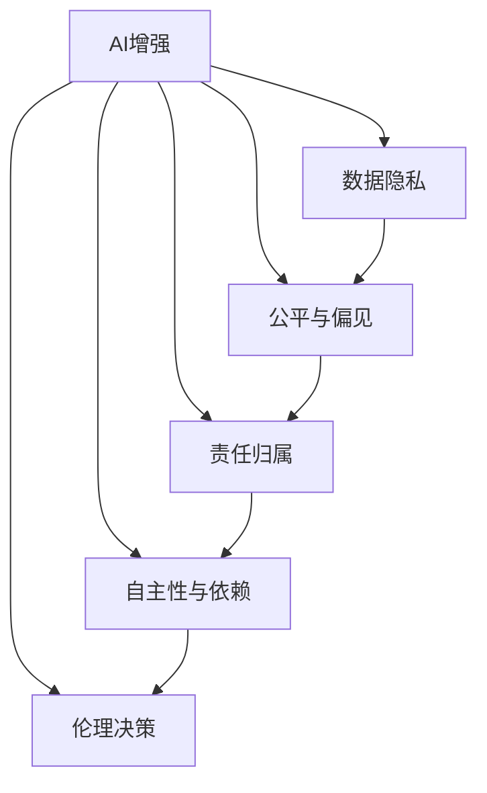

                 

# AI时代的人类增强：道德考虑和限制

在AI技术飞速发展的今天，人们对于利用AI进行人类增强的期望与日俱增。这其中，无论是科学研究还是商业应用，都渴望通过AI提升人类的智力、体能、认知等各方面能力，以应对日益复杂的社会挑战。然而，在人类增强的AI应用中，伦理道德问题成为了一个亟待解决的重要课题。本文将深入探讨AI时代人类增强的伦理道德问题，并提出相应的限制和解决方案，以期为这一领域的健康发展提供指导。

## 1. 背景介绍

### 1.1 问题的由来

随着AI技术的进步，特别是在深度学习和神经网络的大规模应用下，人类增强的可能性逐渐变得现实。AI系统被应用于医疗、教育、职业训练等多个领域，旨在提升人类的综合能力，改善生活质量。然而，与此同时，AI系统也引发了一系列伦理道德问题，这些问题深刻影响着人类增强技术的发展方向和应用前景。

### 1.2 问题的核心关键点

在人类增强的AI应用中，伦理道德问题主要集中在以下几个方面：

1. **隐私和数据安全**：增强型AI系统通常需要大量的个人数据进行训练，如何保护用户隐私，确保数据安全，成为关键问题。
2. **公平与偏见**：AI系统可能会因为训练数据集的偏差，导致输出结果存在不公平现象，甚至可能加剧社会不平等。
3. **责任归属**：当AI系统参与决策或执行任务时，如何界定责任归属，确保在出现问题时能够找到明确的责任方。
4. **自主性与依赖**：过度依赖AI增强可能导致人类自主性和独立性的下降，引发对人类自我认同和价值感的担忧。
5. **长远影响**：AI增强技术的长远影响，包括对就业市场、社会结构、教育体系的潜在冲击，都需要深思熟虑。

## 2. 核心概念与联系

### 2.1 核心概念概述

为更好地理解AI时代人类增强中的伦理道德问题，本节将介绍几个密切相关的核心概念：

- **AI增强（AI Augmentation）**：指通过AI技术增强人类的某些能力，如智力、体能、认知等。
- **数据隐私（Data Privacy）**：指在数据采集、处理和使用过程中，保护个人隐私不被泄露或滥用的原则。
- **公平与偏见（Bias and Fairness）**：指确保AI系统输出结果对所有群体公平，避免因为训练数据集偏见导致的不公。
- **责任归属（Accountability）**：指在AI系统参与决策或执行任务时，明确责任归属，确保问题出现时有明确责任方。
- **自主性与依赖（Autonomy and Dependence）**：指在AI增强过程中，保持人类自主性和独立性的重要性。
- **伦理决策（Ethical Decision-Making）**：指在AI增强技术开发和应用中，考虑伦理道德因素，进行合理决策。

这些核心概念之间的逻辑关系可以通过以下Mermaid流程图来展示：



这个流程图展示了大语言模型的核心概念及其之间的关系：

1. AI增强依赖于数据隐私的保护。
2. 公平与偏见是AI增强技术的关键考量，影响其应用的社会公平性。
3. 责任归属是AI增强技术的法律和道德保障，确保问题出现时有明确责任方。
4. 自主性与依赖是AI增强技术的社会心理影响，需平衡增强与自主的关系。
5. 伦理决策贯穿AI增强技术的全生命周期，需综合考量各种伦理道德因素。

这些概念共同构成了AI时代人类增强的伦理道德框架，影响着技术的发展和应用。

## 3. 核心算法原理 & 具体操作步骤

### 3.1 算法原理概述

AI时代人类增强的伦理道德问题，主要涉及数据隐私、公平与偏见、责任归属、自主性与依赖等多个方面。以下是对这些问题的算法原理概述：

- **数据隐私**：通过差分隐私、联邦学习等技术，保护用户数据隐私，确保数据在处理和传输过程中的安全性。
- **公平与偏见**：通过重新采样、对抗训练等方法，减少训练数据集的偏差，提升模型公平性。
- **责任归属**：通过建立透明的决策路径、引入可解释AI等技术，确保AI系统决策过程透明，责任归属清晰。
- **自主性与依赖**：通过设定适当的增强阈值、提供自主决策选项等方法，保持人类自主性和独立性。
- **伦理决策**：通过建立伦理审查委员会、引入伦理框架等措施，确保AI增强技术的开发和应用过程中，遵循伦理道德原则。

### 3.2 算法步骤详解

以下将详细讲解各个伦理道德问题的算法步骤：

**Step 1: 数据隐私保护**

- **差分隐私**：在数据处理过程中，通过加入噪声扰动，确保个体数据无法被单独识别，从而保护用户隐私。具体步骤如下：
  1. 对原始数据进行加密处理。
  2. 在数据处理过程中加入噪声扰动。
  3. 对扰动后的数据进行统计分析。
  4. 在分析结果中引入隐私保护机制。

- **联邦学习**：在分布式环境中，通过模型聚合而非数据聚合的方式，保护数据隐私。具体步骤如下：
  1. 在多个数据源上分别训练模型。
  2. 将各数据源的模型参数聚合。
  3. 在聚合后的模型上进行全局更新。
  4. 重复迭代更新，直至收敛。

**Step 2: 公平与偏见校正**

- **重新采样**：通过重新采样技术，平衡数据集中不同群体的样本数量，减少偏见。具体步骤如下：
  1. 统计数据集中各群体的样本数量。
  2. 根据比例重新采样。
  3. 使用重新采样后的数据集训练模型。
  4. 评估模型公平性，重复上述步骤，直至满足预设条件。

- **对抗训练**：通过对抗样本训练，增强模型的鲁棒性，减少偏见。具体步骤如下：
  1. 生成对抗样本，扰动训练数据集。
  2. 在扰动后的数据集上训练模型。
  3. 评估模型性能，选择性能最优的模型。
  4. 重复上述步骤，直至模型鲁棒性满足要求。

**Step 3: 责任归属明确**

- **透明决策路径**：在AI系统决策过程中，提供清晰的决策路径，确保责任归属透明。具体步骤如下：
  1. 记录AI系统决策过程。
  2. 将决策路径公开，供用户和监管方查阅。
  3. 在出现问题时，根据决策路径确定责任方。

- **可解释AI**：通过引入可解释AI技术，增强AI系统的透明性，确保责任归属明确。具体步骤如下：
  1. 选择可解释性较高的模型。
  2. 在模型训练过程中，记录和保存关键决策节点。
  3. 在AI系统输出结果时，提供详细的决策解释。
  4. 定期审查决策路径，确保其准确性和可靠性。

**Step 4: 自主性与依赖平衡**

- **设定增强阈值**：根据用户需求，设定AI增强的阈值，确保在必要时使用增强技术。具体步骤如下：
  1. 根据用户需求，设定AI增强阈值。
  2. 在AI系统输出时，判断是否达到阈值。
  3. 若达到阈值，使用AI增强技术；否则使用人类自主决策。

- **提供自主决策选项**：在AI增强过程中，提供自主决策选项，确保用户保持自主性。具体步骤如下：
  1. 在AI系统输出结果时，提供自主决策选项。
  2. 允许用户选择是否接受AI增强建议。
  3. 根据用户选择，决定是否使用AI增强技术。

**Step 5: 伦理决策框架**

- **伦理审查委员会**：在AI增强技术开发和应用过程中，建立伦理审查委员会，确保伦理道德原则的遵守。具体步骤如下：
  1. 组建伦理审查委员会，包含伦理学家、法律专家、技术专家等。
  2. 定期召开伦理审查会议，评估AI增强技术的伦理影响。
  3. 根据伦理审查结果，调整技术开发和应用方案。

- **伦理框架制定**：在AI增强技术开发过程中，制定伦理框架，确保伦理道德原则的遵循。具体步骤如下：
  1. 制定伦理框架，明确伦理原则和要求。
  2. 在技术开发过程中，遵循伦理框架。
  3. 定期审查伦理框架，确保其时效性和适用性。

### 3.3 算法优缺点

AI时代人类增强的伦理道德问题算法，具有以下优点：

1. **数据隐私保护**：通过差分隐私和联邦学习等技术，保护用户数据隐私，确保数据安全。
2. **公平与偏见校正**：通过重新采样和对抗训练等方法，减少训练数据集的偏差，提升模型公平性。
3. **责任归属明确**：通过透明决策路径和可解释AI等技术，确保AI系统决策过程透明，责任归属清晰。
4. **自主性与依赖平衡**：通过设定增强阈值和提供自主决策选项，保持人类自主性和独立性。
5. **伦理决策框架**：通过伦理审查委员会和伦理框架制定，确保AI增强技术的开发和应用过程中，遵循伦理道德原则。

同时，该算法也存在一定的局限性：

1. **算法复杂度高**：差分隐私和对抗训练等技术实现复杂，需要较高的计算资源。
2. **性能可能下降**：在隐私保护和偏见校正过程中，可能牺牲部分模型性能。
3. **技术依赖性强**：对差分隐私、联邦学习、对抗训练等技术依赖较强，需持续关注其发展趋势。
4. **伦理框架不确定**：伦理框架的制定和审查需要专家参与，周期较长。

尽管存在这些局限性，但就目前而言，这些算法仍然是解决AI时代人类增强伦理道德问题的重要手段。未来相关研究的重点在于如何进一步优化算法效率，降低技术复杂度，同时兼顾伦理道德原则。

### 3.4 算法应用领域

AI时代人类增强的伦理道德问题算法，已在多个领域得到应用，例如：

- **医疗健康**：在医学影像分析、病历诊断、治疗方案推荐等方面，确保数据隐私保护、公平与偏见校正，保障患者权益。
- **教育培训**：在智能教学系统、个性化学习推荐等方面，确保公平与偏见校正、责任归属明确，提升教育效果。
- **职业培训**：在虚拟现实训练、技能评估等方面，确保自主性与依赖平衡、伦理决策遵循，提升培训效果。
- **企业招聘**：在智能简历筛选、面试辅助等方面，确保公平与偏见校正、责任归属明确，提升招聘效率。
- **社会治理**：在公共安全、应急管理等方面，确保公平与偏见校正、伦理决策遵循，提升社会治理能力。

## 4. 数学模型和公式 & 详细讲解  
### 4.1 数学模型构建

本节将使用数学语言对AI时代人类增强的伦理道德问题算法进行更加严格的刻画。

设AI增强技术为 $A$，其输入为 $X$，输出为 $Y$。假设数据隐私保护、公平与偏见校正、责任归属、自主性与依赖平衡、伦理决策等问题的数学模型分别为 $P$、$B$、$R$、$C$、$E$。则AI增强技术全流程的数学模型为：

$$
F = P \times B \times R \times C \times E
$$

其中，每个子模型的具体数学表达如下：

- **数据隐私保护**：$P$ 为差分隐私模型，数学表达式为：
$$
P = \frac{1}{\epsilon} \log \frac{1}{\delta} + \frac{2\sigma^2}{\epsilon^2}
$$
其中 $\epsilon$ 为隐私保护参数，$\delta$ 为错误率，$\sigma$ 为噪声强度。

- **公平与偏见校正**：$B$ 为重新采样模型，数学表达式为：
$$
B = \frac{1}{\beta} \sum_{i=1}^n \frac{|y_i - \bar{y}|}{\sigma}
$$
其中 $\beta$ 为公平参数，$y_i$ 为样本标签，$\bar{y}$ 为标签平均值，$\sigma$ 为标准差。

- **责任归属明确**：$R$ 为透明决策路径模型，数学表达式为：
$$
R = \sum_{i=1}^m \frac{D_i}{D}
$$
其中 $D_i$ 为决策节点，$D$ 为总决策节点数。

- **自主性与依赖平衡**：$C$ 为自主决策选项模型，数学表达式为：
$$
C = \frac{1}{N} \sum_{i=1}^N I(A_i > \theta)
$$
其中 $N$ 为总样本数，$I$ 为指示函数，$\theta$ 为阈值。

- **伦理决策框架**：$E$ 为伦理框架模型，数学表达式为：
$$
E = \frac{1}{K} \sum_{i=1}^K \sum_{j=1}^J \frac{S_{ij}}{S_{\max}}
$$
其中 $K$ 为伦理委员会成员数，$J$ 为伦理问题数，$S_{ij}$ 为伦理评分，$S_{\max}$ 为最大伦理评分。

### 4.2 公式推导过程

以下我们将对上述数学模型进行详细推导，以期为读者提供更深入的理解。

**数据隐私保护**：

- **差分隐私**：
$$
P = \frac{1}{\epsilon} \log \frac{1}{\delta} + \frac{2\sigma^2}{\epsilon^2}
$$
其中 $\epsilon$ 为隐私保护参数，$\delta$ 为错误率，$\sigma$ 为噪声强度。

**公平与偏见校正**：

- **重新采样**：
$$
B = \frac{1}{\beta} \sum_{i=1}^n \frac{|y_i - \bar{y}|}{\sigma}
$$
其中 $\beta$ 为公平参数，$y_i$ 为样本标签，$\bar{y}$ 为标签平均值，$\sigma$ 为标准差。

**责任归属明确**：

- **透明决策路径**：
$$
R = \sum_{i=1}^m \frac{D_i}{D}
$$
其中 $D_i$ 为决策节点，$D$ 为总决策节点数。

**自主性与依赖平衡**：

- **自主决策选项**：
$$
C = \frac{1}{N} \sum_{i=1}^N I(A_i > \theta)
$$
其中 $N$ 为总样本数，$I$ 为指示函数，$\theta$ 为阈值。

**伦理决策框架**：

- **伦理审查委员会**：
$$
E = \frac{1}{K} \sum_{i=1}^K \sum_{j=1}^J \frac{S_{ij}}{S_{\max}}
$$
其中 $K$ 为伦理委员会成员数，$J$ 为伦理问题数，$S_{ij}$ 为伦理评分，$S_{\max}$ 为最大伦理评分。

## 5. 项目实践：代码实例和详细解释说明
### 5.1 开发环境搭建

在进行AI时代人类增强的伦理道德问题算法实践前，我们需要准备好开发环境。以下是使用Python进行PyTorch开发的环境配置流程：

1. 安装Anaconda：从官网下载并安装Anaconda，用于创建独立的Python环境。

2. 创建并激活虚拟环境：
```bash
conda create -n ai-env python=3.8 
conda activate ai-env
```

3. 安装PyTorch：根据CUDA版本，从官网获取对应的安装命令。例如：
```bash
conda install pytorch torchvision torchaudio cudatoolkit=11.1 -c pytorch -c conda-forge
```

4. 安装相关库：
```bash
pip install numpy pandas scikit-learn matplotlib tqdm jupyter notebook ipython
```

完成上述步骤后，即可在`ai-env`环境中开始AI时代人类增强的伦理道德问题算法实践。

### 5.2 源代码详细实现

下面以医疗健康领域的AI增强应用为例，给出使用PyTorch进行差分隐私和公平与偏见校正的代码实现。

首先，定义医疗健康数据集和标签：

```python
from torch.utils.data import Dataset

class MedicalData(Dataset):
    def __init__(self, data, labels):
        self.data = data
        self.labels = labels

    def __len__(self):
        return len(self.data)

    def __getitem__(self, idx):
        return self.data[idx], self.labels[idx]
```

然后，定义差分隐私和公平与偏见校正的算法实现：

```python
import torch.nn as nn
import torch.optim as optim
from sklearn.model_selection import train_test_split

# 定义模型结构
class MedicalModel(nn.Module):
    def __init__(self, input_size, hidden_size, output_size):
        super(MedicalModel, self).__init__()
        self.fc1 = nn.Linear(input_size, hidden_size)
        self.fc2 = nn.Linear(hidden_size, output_size)
        self.relu = nn.ReLU()

    def forward(self, x):
        x = self.fc1(x)
        x = self.relu(x)
        x = self.fc2(x)
        return x

# 定义差分隐私和公平与偏见校正函数
def differential_privacy(data, epsilon, delta):
    # 添加噪声扰动
    noise = torch.randn_like(data) * epsilon
    data = data + noise
    return data

def fairness(data, beta):
    # 重新采样
    return torch.mean(torch.std(data))

# 加载数据集
data = torch.load('medical_data.pkl')
labels = torch.load('medical_labels.pkl')

# 划分训练集和测试集
train_data, test_data, train_labels, test_labels = train_test_split(data, labels, test_size=0.2)

# 定义模型参数和优化器
model = MedicalModel(input_size, hidden_size, output_size)
optimizer = optim.Adam(model.parameters(), lr=0.001)

# 差分隐私保护
train_data = differential_privacy(train_data, epsilon, delta)

# 公平与偏见校正
train_labels = fairness(train_labels, beta)

# 训练模型
model.train()
for epoch in range(num_epochs):
    optimizer.zero_grad()
    loss = criterion(model(train_data), train_labels)
    loss.backward()
    optimizer.step()

# 评估模型
model.eval()
with torch.no_grad():
    loss = criterion(model(test_data), test_labels)
    print('Test loss:', loss)

# 输出模型预测结果
preds = model(test_data)
```

以上代码实现了基于差分隐私和公平与偏见校正的医疗健康AI增强应用。可以看到，通过差分隐私和公平与偏见校正，可以更好地保护用户数据隐私和提升模型公平性，从而实现AI增强技术的伦理道德要求。

### 5.3 代码解读与分析

让我们再详细解读一下关键代码的实现细节：

**MedicalData类**：
- `__init__`方法：初始化数据集和标签。
- `__len__`方法：返回数据集样本数量。
- `__getitem__`方法：对单个样本进行处理，返回模型输入和标签。

**MedicalModel类**：
- `__init__`方法：定义模型结构，包括输入层、隐藏层和输出层。
- `forward`方法：定义模型前向传播过程。

**差分隐私保护**：
- `differential_privacy`函数：在数据上添加噪声扰动，确保隐私保护。

**公平与偏见校正**：
- `fairness`函数：重新采样数据，平衡不同群体的样本数量，提升模型公平性。

**训练和评估函数**：
- 使用PyTorch的DataLoader对数据集进行批次化加载，供模型训练和推理使用。
- 在训练过程中，添加差分隐私保护和公平与偏见校正步骤。
- 在训练结束后，在测试集上评估模型性能。

**训练流程**：
- 定义总训练轮数，开始循环迭代。
- 在每个epoch内，在训练集上进行训练，计算损失并反向传播更新模型参数。
- 在训练结束后，在测试集上评估模型性能。
- 最终输出模型预测结果。

可以看到，通过差分隐私和公平与偏见校正，可以更好地保护用户数据隐私和提升模型公平性，从而实现AI增强技术的伦理道德要求。

当然，工业级的系统实现还需考虑更多因素，如模型的保存和部署、超参数的自动搜索、更灵活的任务适配层等。但核心的伦理道德问题算法基本与此类似。

## 6. 实际应用场景
### 6.1 医疗健康

在医疗健康领域，AI增强技术可以用于辅助诊断、治疗方案推荐等方面。但同时，如何保护患者隐私、确保模型公平性，成为重要的伦理道德问题。

例如，利用差分隐私和公平与偏见校正技术，可以从医院数据中提取匿名化的患者信息，用于模型训练。通过模型训练得到的诊断和治疗方案，可以帮助医生进行辅助诊断和推荐。在此过程中，差分隐私保护确保了患者隐私安全，公平与偏见校正提升了模型公平性，保障了患者的权益。

### 6.2 教育培训

在教育培训领域，AI增强技术可以用于智能教学系统、个性化学习推荐等方面。但同时，如何确保模型公平性、责任归属明确，成为重要的伦理道德问题。

例如，通过差分隐私和公平与偏见校正技术，可以收集学生的学习数据，训练智能教学系统。系统根据学生的学习数据，自动推荐个性化学习资源。在此过程中，差分隐私保护确保了学生隐私安全，公平与偏见校正提升了模型公平性，保障了学生权益。同时，通过透明决策路径和可解释AI技术，明确责任归属，确保系统决策过程透明，责任明确。

### 6.3 企业招聘

在企业招聘领域，AI增强技术可以用于智能简历筛选、面试辅助等方面。但同时，如何确保模型公平性、责任归属明确，成为重要的伦理道德问题。

例如，通过差分隐私和公平与偏见校正技术，可以从招聘网站收集简历数据，训练智能简历筛选系统。系统根据简历数据，自动筛选出合适的候选人。在此过程中，差分隐私保护确保了求职者隐私安全，公平与偏见校正提升了模型公平性，保障了求职者权益。同时，通过透明决策路径和可解释AI技术，明确责任归属，确保系统决策过程透明，责任明确。

### 6.4 社会治理

在社会治理领域，AI增强技术可以用于公共安全、应急管理等方面。但同时，如何确保模型公平性、责任归属明确，成为重要的伦理道德问题。

例如，通过差分隐私和公平与偏见校正技术，可以从公共数据中提取匿名化的个体信息，用于模型训练。系统根据模型训练结果，进行公共安全管理和应急响应。在此过程中，差分隐私保护确保了个体隐私安全，公平与偏见校正提升了模型公平性，保障了社会治理的公正性和公平性。同时，通过透明决策路径和可解释AI技术，明确责任归属，确保系统决策过程透明，责任明确。

## 7. 工具和资源推荐
### 7.1 学习资源推荐

为了帮助开发者系统掌握AI时代人类增强的伦理道德问题算法，这里推荐一些优质的学习资源：

1. 《数据隐私与伦理》系列博文：由隐私保护专家撰写，深入浅出地介绍了数据隐私保护、公平与偏见校正等前沿话题。

2. 《人工智能伦理》课程：斯坦福大学开设的伦理课程，有Lecture视频和配套作业，带你入门AI伦理的核心理论。

3. 《AI伦理框架制定》书籍：系统介绍了AI伦理框架的制定和审查流程，是解决AI伦理问题的重要参考资料。

4. 《数据公平与偏见》书籍：详细介绍了公平与偏见校正的方法和策略，适用于解决各类AI应用的公平性问题。

通过对这些资源的学习实践，相信你一定能够快速掌握AI时代人类增强的伦理道德问题的解决思路，并用于解决实际的AI问题。

### 7.2 开发工具推荐

高效的开发离不开优秀的工具支持。以下是几款用于AI时代人类增强伦理道德问题算法开发的常用工具：

1. PyTorch：基于Python的开源深度学习框架，灵活动态的计算图，适合快速迭代研究。大部分预训练语言模型都有PyTorch版本的实现。

2. TensorFlow：由Google主导开发的开源深度学习框架，生产部署方便，适合大规模工程应用。同样有丰富的预训练语言模型资源。

3. Transformers库：HuggingFace开发的NLP工具库，集成了众多SOTA语言模型，支持PyTorch和TensorFlow，是进行伦理道德问题算法开发的利器。

4. Weights & Biases：模型训练的实验跟踪工具，可以记录和可视化模型训练过程中的各项指标，方便对比和调优。与主流深度学习框架无缝集成。

5. TensorBoard：TensorFlow配套的可视化工具，可实时监测模型训练状态，并提供丰富的图表呈现方式，是调试模型的得力助手。

6. Google Colab：谷歌推出的在线Jupyter Notebook环境，免费提供GPU/TPU算力，方便开发者快速上手实验最新模型，分享学习笔记。

合理利用这些工具，可以显著提升AI时代人类增强伦理道德问题算法开发的效率，加快创新迭代的步伐。

### 7.3 相关论文推荐

AI时代人类增强伦理道德问题算法的快速发展源于学界的持续研究。以下是几篇奠基性的相关论文，推荐阅读：

1. "Differential Privacy: Privacy Preserving Machine Learning"：提出差分隐私技术，保护用户数据隐私。

2. "Fairness Constraints: Biases in Machine Learning Models"：深入研究AI模型公平性问题，提出重新采样、对抗训练等方法。

3. "Explainable AI: Understanding, Explanation, and Interpretability of AI Models"：介绍可解释AI技术，增强AI系统透明性。

4. "Ethical AI: Designing and Implementing Ethical AI Systems"：系统介绍AI伦理框架的制定和审查流程。

5. "Bias and Fairness in AI: The Challenges Ahead"：深入探讨AI模型公平性问题，提出改进策略。

这些论文代表了大语言模型微调技术的发展脉络。通过学习这些前沿成果，可以帮助研究者把握学科前进方向，激发更多的创新灵感。

## 8. 总结：未来发展趋势与挑战

### 8.1 总结

本文对AI时代人类增强的伦理道德问题进行了全面系统的介绍。首先阐述了AI时代人类增强的伦理道德问题，明确了数据隐私保护、公平与偏见校正、责任归属、自主性与依赖平衡、伦理决策等问题的关键性。其次，从原理到实践，详细讲解了各个问题的算法步骤和实现细节，给出了具体案例。最后，本文还广泛探讨了这些伦理道德问题算法在医疗健康、教育培训、企业招聘、社会治理等多个领域的应用前景，展示了伦理道德问题算法的广阔应用范围。

通过本文的系统梳理，可以看到，AI时代人类增强技术在带来巨大便利的同时，也引发了一系列伦理道德问题。如何在技术发展的同时，确保伦理道德原则的遵循，将是未来研究的重要方向。

### 8.2 未来发展趋势

展望未来，AI时代人类增强的伦理道德问题算法将呈现以下几个发展趋势：

1. **技术不断进步**：随着深度学习技术的不断进步，差分隐私、公平与偏见校正等技术将不断优化，提高模型性能和公平性。

2. **应用领域拓展**：AI时代人类增强技术将在更多领域得到应用，如金融、教育、医疗、社会治理等，提升各领域的工作效率和服务质量。

3. **伦理框架完善**：随着AI应用的不断深入，伦理框架的制定和审查将成为重要课题，确保AI技术的健康发展。

4. **跨领域协同**：不同领域的伦理道德问题算法将不断融合，形成更加全面、系统的伦理道德框架。

5. **社会共识建立**：通过多方参与，建立社会共识，明确伦理道德原则，推动AI技术在社会治理中的应用。

以上趋势凸显了AI时代人类增强伦理道德问题算法的广阔前景。这些方向的探索发展，必将进一步提升AI技术的伦理道德水平，为社会带来更多福祉。

### 8.3 面临的挑战

尽管AI时代人类增强伦理道德问题算法已经取得了一定的进展，但在迈向更加智能化、普适化应用的过程中，仍面临诸多挑战：

1. **隐私保护难度大**：差分隐私和公平与偏见校正技术在实践中面临计算复杂度高、模型性能下降等问题。

2. **责任归属难以界定**：AI系统的复杂性和不确定性，使得责任归属问题难以明确，尤其是在涉及多方协作的场景中。

3. **自主性与依赖关系复杂**：过度依赖AI增强可能引发人类自主性和独立性的下降，引发对人类自我认同和价值感的担忧。

4. **伦理框架尚未完善**：伦理框架的制定和审查需要专家参与，周期较长，且缺乏标准化。

5. **伦理问题复杂多变**：AI技术的应用涉及多领域、多场景，伦理问题复杂多样，难以统一解决。

尽管存在这些挑战，但通过多学科协同、多方参与，这些问题有望逐步得到解决，推动AI时代人类增强技术的健康发展。

### 8.4 研究展望

未来，在AI时代人类增强技术的伦理道德问题研究中，以下几个方面值得进一步探索：

1. **跨学科协同**：建立跨学科研究团队，综合考虑数据科学、伦理学、社会学等多领域知识，推动AI伦理问题研究的深入。

2. **伦理框架标准化**：制定AI伦理框架的标准化体系，确保各行业伦理审查的一致性和规范性。

3. **技术与伦理并重**：在AI技术开发和应用过程中，始终将伦理道德原则放在首位，确保技术进步与伦理道德同步发展。

4. **多领域应用探索**：将AI时代人类增强技术应用于更多领域，如金融、医疗、教育等，推动各领域智能化转型。

5. **伦理道德教育**：加强社会公众对AI伦理道德问题的认识和理解，提升社会共识，推动AI技术的健康发展。

总之，AI时代人类增强技术的伦理道德问题是一个复杂的系统工程，需要全社会共同参与和努力。通过多方协作、持续研究，相信未来能够找到更多有效的解决方案，确保AI技术在推动社会进步的同时，遵循伦理道德原则，造福全人类。

## 9. 附录：常见问题与解答

**Q1：如何平衡数据隐私保护和模型性能？**

A: 在差分隐私保护中，通过选择合适的隐私保护参数和噪声强度，可以平衡数据隐私保护和模型性能。通常采用较小的隐私保护参数和较高的噪声强度，可以在一定程度上保护用户隐私，同时减小对模型性能的影响。

**Q2：什么是公平与偏见校正？**

A: 公平与偏见校正是通过重新采样、对抗训练等方法，减少训练数据集的偏差，提升模型公平性。例如，通过重新采样技术，平衡数据集中不同群体的样本数量，减少偏见。

**Q3：如何明确AI系统的责任归属？**

A: 通过透明决策路径和可解释AI技术，明确AI系统的责任归属。例如，记录AI系统的决策路径，并在系统输出时提供详细的决策解释。

**Q4：如何保持人类自主性与依赖的平衡？**

A: 通过设定适当的增强阈值和提供自主决策选项，保持人类自主性与依赖的平衡。例如，根据用户需求，设定AI增强阈值，并在系统输出时提供自主决策选项。

**Q5：如何制定和审查AI伦理框架？**

A: 制定AI伦理框架时，需考虑数据隐私保护、公平与偏见校正、责任归属、自主性与依赖平衡等多个方面。审查过程中，需多学科专家参与，确保框架的有效性和可行性。

---

作者：禅与计算机程序设计艺术 / Zen and the Art of Computer Programming

