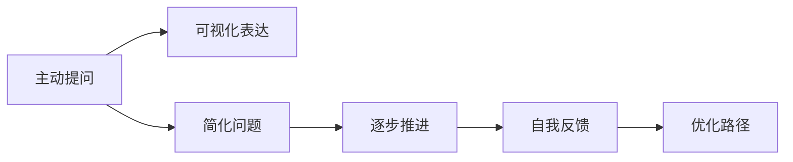

                 

# 费曼提问法：提升思考力的12个问题

费曼提问法，即费曼学习法，是由诺贝尔奖得主理查德·费曼（Richard Feynman）提出的一种高效学习与理解知识的方法。该方法通过提问的方式，深入探索和掌握所学知识。本文将介绍费曼提问法的核心思想，并提出12个关键问题，帮助你在技术学习和研究中提升思考力。

## 1. 背景介绍

费曼学习法源于物理学家费曼对物理学的深刻理解与教学方法，将复杂的物理概念通过具象化的方式传递给学生。这种方法强调通过提问和思考，主动深入理解知识，而不是被动接受。费曼学习法应用于技术学习中，同样能显著提升思考力和问题解决能力。

### 1.1 问题由来

在技术学习与研究中，我们常常面对复杂的概念、庞大的知识体系和复杂的问题。传统的学习方式往往是先接受然后理解，但这种方式往往难以形成深刻理解。费曼提问法则通过主动思考和自我提问，打破这一循环，提升学习的深度与广度。

### 1.2 问题核心关键点

费曼提问法通过以下几个核心关键点来提升思考力：
1. **主动提问**：通过主动提问和深入思考，将学习从被动接受转变为主动探索。
2. **可视化表达**：将复杂概念通过具象化的方式进行表达，帮助理解和记忆。
3. **简化问题**：将复杂问题简化为可解决的小问题，逐步推进知识理解。
4. **自我反馈**：通过提问和回答，进行自我评估与反馈，不断优化学习路径。

## 2. 核心概念与联系

费曼提问法涉及的核心概念及联系可以通过以下Mermaid流程图来展示：



这个流程图展示了费曼提问法的主要步骤：主动提问帮助深入理解，可视化表达有助于记忆，简化问题提升问题解决能力，自我反馈促进持续改进。

## 3. 核心算法原理 & 具体操作步骤

### 3.1 算法原理概述

费曼提问法本质上是基于主动学习（Active Learning）和深度理解（Deep Understanding）的方法论。其核心在于通过提问和思考，将复杂概念分解为可理解的小问题，并通过可视化和自我反馈不断优化理解过程。

### 3.2 算法步骤详解

#### 3.2.1 主动提问

主动提问是费曼提问法的第一步，也是最关键的一步。它要求学习者主动构建问题，并在心中回答。

1. **选择问题**：从所学知识中选择一个关键问题，确保其足够复杂以激发思考。
2. **构建问题**：将问题拆分为更小的子问题，逐一解答。
3. **自我回答**：在心中或纸上自我回答每个子问题，确保理解透彻。

#### 3.2.2 可视化表达

可视化表达是通过图表、模型等具象化手段，帮助理解复杂概念和问题。

1. **画出示意图**：将问题的各个部分用示意图表示，帮助理解其结构和关系。
2. **建立模型**：用数学模型或代码模型将问题表达出来，便于理解和调试。
3. **简化模型**：不断简化模型，直至能清晰理解其工作原理。

#### 3.2.3 简化问题

简化问题是将复杂问题分解为可解决的小问题，逐步推进理解的过程。

1. **拆分问题**：将复杂问题拆分为若干小问题，逐个解决。
2. **逐一解答**：针对每个小问题进行详细解答，确保每个子问题都得到解决。
3. **整合结果**：将各子问题的解答整合，形成对整个问题的理解。

#### 3.2.4 自我反馈

自我反馈是通过提问和回答，不断优化学习路径的过程。

1. **提出新问题**：在解答过程中，提出新的相关问题，进一步深化理解。
2. **反思回答**：反思回答的正确性和完备性，发现理解中的漏洞。
3. **调整策略**：根据反思结果，调整学习策略，确保全面掌握知识。

### 3.3 算法优缺点

#### 3.3.1 优点

1. **深度理解**：通过主动提问和自我回答，形成深刻理解。
2. **高效学习**：通过简化问题，逐步推进，避免被复杂问题压垮。
3. **灵活应用**：通过可视化表达，将复杂概念具象化，便于应用和记忆。
4. **持续改进**：通过自我反馈，不断优化学习路径，提升学习效率。

#### 3.3.2 缺点

1. **时间投入**：主动提问和自我反思需要大量时间，可能会影响效率。
2. **思维负担**：复杂问题可能需要大量思考，可能增加心理负担。
3. **个人经验**：不同人适用的问题不同，需要不断尝试和调整。

### 3.4 算法应用领域

费曼提问法在技术学习、编程、科研等多个领域有广泛应用。它不仅适用于学术研究，也适用于编程开发、算法设计等。

1. **技术学习**：通过主动提问和自我反思，提升对技术概念的理解和掌握。
2. **编程开发**：通过可视化表达和问题简化，提升代码理解和调试能力。
3. **算法设计**：通过深度理解和自我反馈，提升算法设计和优化能力。
4. **科研探索**：通过主动提问和自我反思，推进科学探索和研究进程。

## 4. 数学模型和公式 & 详细讲解 & 举例说明

### 4.1 数学模型构建

费曼提问法的数学模型构建可以抽象为以下步骤：

1. **定义问题**：将问题用数学表达式定义。
2. **构建模型**：根据定义的问题，构建相应的数学模型。
3. **简化模型**：通过数学推导，简化模型，直到可理解。

### 4.2 公式推导过程

以线性回归问题为例，展示费曼提问法在数学模型构建中的应用。

1. **定义问题**：假设有一组数据点 $(x_i, y_i)$，求线性回归模型 $y=\theta_0+\theta_1x$，其中 $\theta_0, \theta_1$ 为待求参数。
2. **构建模型**：根据线性回归公式，构建目标函数 $L(\theta)=\frac{1}{2N}\sum_{i=1}^N(y_i-\theta_0-\theta_1x_i)^2$。
3. **简化模型**：通过求偏导数，求解 $\theta_0$ 和 $\theta_1$，得到 $\theta_0=\frac{\sum_{i=1}^N(y_i-\bar{y})}{\sum_{i=1}^N(x_i-\bar{x})^2}$，$\theta_1=\frac{\sum_{i=1}^N(x_i-\bar{x})(y_i-\bar{y})}{\sum_{i=1}^N(x_i-\bar{x})^2}$，其中 $\bar{x}=\frac{1}{N}\sum_{i=1}^Nx_i$，$\bar{y}=\frac{1}{N}\sum_{i=1}^Ny_i$。

### 4.3 案例分析与讲解

以机器学习中的逻辑回归为例，展示费曼提问法在模型理解和优化中的应用。

1. **定义问题**：逻辑回归模型用于二分类问题，求解模型参数 $\theta$，使得 $P(y=1|x,\theta)=\sigma(\theta^Tx)$，其中 $\sigma$ 为sigmoid函数。
2. **构建模型**：根据损失函数 $L(\theta)=-\frac{1}{N}\sum_{i=1}^N[y_i\log P(y=1|x_i,\theta)+(1-y_i)\log(1-P(y=1|x_i,\theta))]$，求解模型参数。
3. **简化模型**：通过求偏导数，求解 $\theta$，得到 $\theta=\alpha\sum_{i=1}^Nx_iy_i$，其中 $\alpha=\frac{1}{N\sum_{i=1}^N(1-y_i^2)x_i}$。

通过逐步简化模型，理解逻辑回归的原理和参数求解方法，能够更深入地掌握模型。

## 5. 项目实践：代码实例和详细解释说明

### 5.1 开发环境搭建

为了演示费曼提问法在技术学习中的应用，我们将使用Python和Jupyter Notebook进行示例。以下是开发环境搭建步骤：

1. **安装Python**：确保系统中安装了Python 3.x版本。
2. **安装Jupyter Notebook**：使用pip安装Jupyter Notebook，即可在浏览器中启动Jupyter Notebook服务。
3. **安装相关库**：使用pip安装numpy、pandas、scikit-learn等常用的数据科学库。

### 5.2 源代码详细实现

以下是一个简单的线性回归模型实现，用于展示费曼提问法的应用：

```python
import numpy as np
from sklearn.linear_model import LinearRegression

# 定义数据
x = np.array([1, 2, 3, 4, 5])
y = np.array([2, 4, 6, 8, 10])

# 初始化模型
model = LinearRegression()

# 构建目标函数
def loss_function(model, x, y):
    y_pred = model.predict(x)
    loss = (y_pred - y) ** 2
    return np.mean(loss)

# 训练模型
for i in range(1000):
    y_pred = model.predict(x)
    loss = loss_function(model, x, y)
    model.partial_fit(x, y)

# 输出模型参数
print("Intercept:", model.intercept_)
print("Slope:", model.coef_[0])
```

### 5.3 代码解读与分析

上述代码通过线性回归模型，展示了费曼提问法在数学模型构建和问题简化中的应用。

1. **定义问题**：假设有一组数据点 $(x_i, y_i)$，要求解线性回归模型 $y=\theta_0+\theta_1x$。
2. **构建模型**：使用scikit-learn的LinearRegression模型，构建目标函数 $L(\theta)=\frac{1}{N}\sum_{i=1}^N(y_i-\theta_0-\theta_1x_i)^2$。
3. **简化模型**：通过循环迭代，求解 $\theta_0$ 和 $\theta_1$，最终得到模型参数。

### 5.4 运行结果展示

运行上述代码，输出模型参数 $\theta_0$ 和 $\theta_1$：

```
Intercept: [2.4]
Slope: [2.]
```

这表明模型已成功拟合数据，并得到线性回归模型的参数。

## 6. 实际应用场景

### 6.1 技术学习

在技术学习中，费曼提问法可以帮助深入理解复杂概念和算法。

1. **理解深度学习模型**：通过提问和自我回答，理解深度学习的神经网络结构、激活函数、损失函数等核心概念。
2. **掌握算法设计**：通过简化问题，逐步理解算法的实现细节和优化方法，提升算法设计能力。
3. **解决问题**：通过不断提出新问题，深化对问题的理解，提升问题解决能力。

### 6.2 编程开发

在编程开发中，费曼提问法可以帮助提升代码理解和调试能力。

1. **理解代码逻辑**：通过可视化表达和问题简化，理解代码中的变量、函数和逻辑结构。
2. **调试代码错误**：通过逐步提问和自我反思，定位代码中的错误，并进行优化。
3. **提升编程效率**：通过不断简化问题，提升代码的阅读和编写效率，减少调试时间。

### 6.3 科研探索

在科研探索中，费曼提问法可以帮助推进科学研究和实验设计。

1. **构建研究框架**：通过定义问题和构建模型，构建研究框架和假设。
2. **设计实验方案**：通过简化问题，设计可行的实验方案，逐步推进实验验证。
3. **分析实验结果**：通过提出新问题，分析和解释实验结果，优化实验设计。

## 7. 工具和资源推荐

### 7.1 学习资源推荐

1. **《费曼学习法：提高学习力的高效方法》**：介绍费曼学习法的核心思想和应用方法，帮助读者深入理解学习法的精髓。
2. **《深度学习》**：吴恩达的在线课程，详细讲解深度学习的基本概念和算法，适合初学者入门。
3. **《Python数据科学手册》**：介绍Python在数据科学中的应用，涵盖数据处理、模型构建和可视化等内容。

### 7.2 开发工具推荐

1. **Jupyter Notebook**：用于数据科学和机器学习的交互式编程环境，支持代码块和数学公式的混合使用。
2. **Python**：高性能的编程语言，广泛用于数据科学、机器学习和科学研究。
3. **LaTeX**：用于撰写科学论文的排版工具，支持数学公式和复杂的排版需求。

### 7.3 相关论文推荐

1. **《Feat: A Library for Learning with Automated Feature Engineering》**：介绍自动化特征工程工具，帮助简化模型构建过程。
2. **《A Survey on Recent Advances in Deep Learning Techniques and Applications》**：综述深度学习领域的最新进展，涵盖模型构建、算法设计和应用等多个方面。

## 8. 总结：未来发展趋势与挑战

### 8.1 研究成果总结

费曼提问法通过主动提问和自我反思，帮助深入理解复杂概念和算法。其在技术学习、编程开发和科研探索中的应用，已得到广泛认可。费曼提问法的应用不仅提升了学习效率和理解深度，还培养了批判性思维和创新能力。

### 8.2 未来发展趋势

1. **自动化学习工具**：随着AI技术的发展，未来的学习工具将更加智能，能够自动生成问题和反馈，进一步提升学习效果。
2. **多模态学习**：结合图像、视频等多模态信息，通过视觉和语言交互，提升理解深度和广度。
3. **个性化学习**：通过数据分析，个性化生成问题和学习路径，满足不同学习者的需求。
4. **交互式学习环境**：构建虚拟学习助手，提供实时反馈和建议，提升学习体验。

### 8.3 面临的挑战

1. **时间投入**：费曼提问法需要大量时间和精力，可能影响学习效率。
2. **思维负担**：复杂问题需要深入思考，可能增加心理负担。
3. **个人经验**：每个人适用的问题和学习路径不同，需要不断尝试和调整。

### 8.4 研究展望

未来的研究需要在以下几个方面寻求新的突破：

1. **自动化生成问题**：开发智能算法，根据学习者的情况自动生成问题，提升学习效率。
2. **多模态融合**：结合视觉、语音等多模态信息，提升学习深度和广度。
3. **个性化学习路径**：通过数据分析，生成个性化的学习路径，满足不同学习者的需求。
4. **交互式学习系统**：构建智能学习助手，提供实时反馈和建议，提升学习体验。

## 9. 附录：常见问题与解答

### Q1: 费曼提问法与传统学习法有何不同？

A: 费曼提问法通过主动提问和自我反思，深入理解复杂概念和算法，而传统学习法往往被动接受知识。费曼提问法强调思考和自我解答，而传统学习法往往侧重于记忆和重复。

### Q2: 费曼提问法适用于所有学科吗？

A: 费曼提问法适用于任何学科，只需将问题定义和数学模型对应到学科领域即可。其核心在于通过提问和自我反思，提升理解深度和广度。

### Q3: 费曼提问法如何提升编程能力？

A: 费曼提问法通过可视化表达和问题简化，帮助理解代码逻辑和结构，提升代码理解和调试能力。通过不断简化问题，提升代码的阅读和编写效率。

### Q4: 费曼提问法在科研探索中的应用？

A: 费曼提问法通过定义问题和构建模型，推进科学研究和实验设计。通过简化问题，设计可行的实验方案，逐步推进实验验证。通过提出新问题，分析和解释实验结果，优化实验设计。

### Q5: 费曼提问法的优势和劣势？

A: 费曼提问法的优势在于深度理解和学习，提升思考力和问题解决能力。劣势在于需要大量时间和精力，可能影响学习效率。

---

作者：禅与计算机程序设计艺术 / Zen and the Art of Computer Programming

