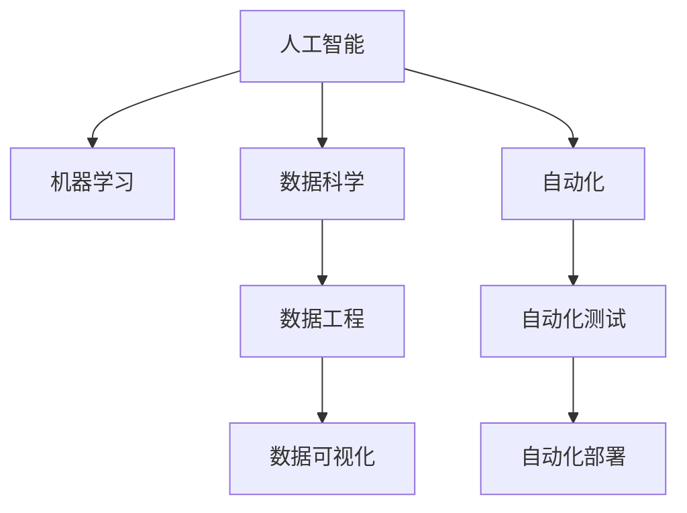

                 

# 贾扬清的建议：培养团队理解AI的能力，并将AI应用于业务场景

在当前数字化转型的浪潮下，AI技术正逐步渗透到各行各业。然而，如何将AI技术转化为业务价值，仍是一大挑战。本文将从贾扬清的观点出发，探讨如何培养团队理解AI的能力，并将AI应用于业务场景。

## 1. 背景介绍

### 1.1 问题由来
随着AI技术的快速发展和应用，越来越多的企业开始关注AI的落地能力。然而，AI技术的复杂性和跨领域特性，使得团队理解和应用AI变得困难。因此，如何培养团队理解AI的能力，并将AI技术应用于实际业务场景，成为当前业界的一大热门话题。

### 1.2 问题核心关键点
核心问题在于：
1. 如何培养团队AI基础知识，使之能够理解和应用AI技术？
2. 如何通过合适的AI方法，提高业务效率和价值？
3. 如何应对AI技术带来的伦理、隐私等问题？

## 2. 核心概念与联系

### 2.1 核心概念概述

为更好地理解如何将AI应用于业务场景，本节将介绍几个密切相关的核心概念：

- AI：人工智能，指通过算法和模型处理复杂问题，实现自动化决策和智能化的技术。
- ML：机器学习，指利用数据和算法训练模型，从而提高模型预测准确度的技术。
- 数据科学：数据科学是一个交叉领域，涵盖了数据收集、处理、分析和建模等过程，旨在从数据中提取有价值的信息。
- 自动化：自动化是指通过软件和算法自动化执行任务，以减少人工干预和提高效率。
- 数据工程：数据工程是构建和管理数据基础设施的过程，包括数据收集、清洗、存储和处理等。
- 数据可视化：数据可视化是利用图表和图形等形式展示数据，帮助人们理解和分析数据的技术。

这些核心概念之间的逻辑关系可以通过以下Mermaid流程图来展示：



这个流程图展示了AI技术涉及的主要领域和概念，以及它们之间的关系：

1. 人工智能包括机器学习、数据科学、自动化、数据工程等多个分支。
2. 数据科学利用机器学习和数据工程等技术，处理和分析数据。
3. 自动化和数据可视化通过自动化测试和部署等手段，实现数据和模型的应用。

## 3. 核心算法原理 & 具体操作步骤
### 3.1 算法原理概述

将AI应用于业务场景，其核心在于利用数据和模型解决实际问题。这一过程可以分为两个主要阶段：数据准备和模型应用。

- 数据准备：收集、清洗和处理数据，使之符合模型训练和应用的要求。
- 模型应用：选择合适的算法和模型，训练模型并应用于实际场景中。

### 3.2 算法步骤详解

将AI应用于业务场景，通常包括以下几个关键步骤：

**Step 1: 数据准备**
- 确定数据收集和处理的来源和方式。
- 清洗数据，去除噪声和异常值。
- 预处理数据，如归一化、编码、特征选择等。

**Step 2: 模型选择与训练**
- 选择合适的算法和模型，如决策树、随机森林、神经网络等。
- 使用训练数据训练模型，调整超参数，选择最优模型。
- 使用验证数据评估模型性能，进行模型优化。

**Step 3: 模型部署与优化**
- 将训练好的模型部署到实际业务场景中。
- 监控模型性能，调整模型参数，持续优化。
- 集成到业务系统中，提高业务效率和价值。

**Step 4: 模型评估与迭代**
- 使用测试数据评估模型性能，记录评估指标。
- 分析模型不足，进行迭代优化。
- 不断反馈数据和反馈结果，提高模型精度和泛化能力。

### 3.3 算法优缺点

将AI应用于业务场景的方法，具有以下优点：
1. 自动化程度高。通过机器学习算法，自动处理大量数据和任务，减少人工干预。
2. 精度高。通过模型训练，能够提高预测和决策的准确度，减少人为错误。
3. 可扩展性强。通过模型优化和参数调整，可以适应不同的业务需求和场景。
4. 数据驱动决策。通过数据分析，提供决策支持，提高决策科学性和效率。

同时，该方法也存在一定的局限性：
1. 数据依赖性强。模型的效果很大程度上依赖于数据的质量和数量，数据采集和处理需要大量的资源和经验。
2. 模型复杂度高。复杂模型需要较高的计算资源和训练时间，实际应用中可能面临资源瓶颈。
3. 模型解释性差。复杂模型难以解释其内部决策机制，缺乏透明性和可解释性。
4. 数据隐私问题。AI技术处理大量数据，可能涉及隐私和安全问题。

尽管存在这些局限性，但就目前而言，将AI应用于业务场景仍是大势所趋。未来相关研究的重点在于如何进一步降低数据依赖，提高模型的可解释性和隐私保护能力，同时兼顾模型精度和效率。

### 3.4 算法应用领域

将AI应用于业务场景的方法，已经在诸多领域取得了成功应用，例如：

- 金融风控：利用机器学习模型进行信用评估、风险识别和欺诈检测。
- 医疗诊断：通过深度学习模型进行医学影像分析和疾病预测。
- 零售推荐：使用推荐系统对用户行为进行分析和预测，提升销售转化率。
- 制造流程优化：通过数据分析和机器学习，优化生产流程，提高生产效率和质量。
- 智能客服：利用自然语言处理技术，实现智能客服系统，提升客户满意度。
- 自动驾驶：通过计算机视觉和深度学习技术，实现自动驾驶系统，提高行车安全。

除了上述这些经典应用外，AI技术还正在被创新性地应用到更多场景中，如智慧城市、教育、娱乐等，为各行各业带来新的变革和机遇。

## 4. 数学模型和公式 & 详细讲解 & 举例说明

### 4.1 数学模型构建

将AI应用于业务场景，通常涉及以下几个数学模型：

- 线性回归模型：用于预测连续数值，公式为：$$y = \beta_0 + \beta_1x_1 + \cdots + \beta_nx_n + \epsilon$$
- 决策树模型：用于分类和回归，通过树形结构表示模型决策路径，公式为：$$\text{决策树} = \text{特征} \rightarrow \text{左子树} \text{或} \text{右子树}$$
- 随机森林模型：通过组合多棵决策树，提高模型的鲁棒性和泛化能力。公式为：$$\text{随机森林} = \text{多棵决策树}$$
- 神经网络模型：用于处理复杂的非线性关系，通过多层神经元构建模型，公式为：$$y = \sigma(Wx + b)$$

### 4.2 公式推导过程

以线性回归模型为例，进行公式推导：

设样本数据集为 $(\boldsymbol{x}_i, y_i)$，其中 $\boldsymbol{x}_i = (x_{i1}, x_{i2}, \cdots, x_{in})$，$y_i$ 为样本标签。线性回归模型为：

$$y_i = \beta_0 + \beta_1x_{i1} + \beta_2x_{i2} + \cdots + \beta_nx_{in} + \epsilon_i$$

其中，$\beta_j$ 为模型参数，$\epsilon_i$ 为随机误差项。

目标函数为：

$$\min_{\beta_0, \beta_1, \cdots, \beta_n} \sum_{i=1}^n (y_i - \beta_0 - \beta_1x_{i1} - \beta_2x_{i2} - \cdots - \beta_nx_{in})^2$$

通过最小二乘法求解，得到模型参数：

$$\beta_j = \frac{\sum_{i=1}^n x_{ij}(y_i - \bar{y})}{\sum_{i=1}^n x_{ij}^2}$$

其中，$\bar{y} = \frac{1}{n} \sum_{i=1}^n y_i$。

### 4.3 案例分析与讲解

以线性回归模型为例，进行案例分析：

**案例：房价预测**

假设某城市有以下数据集，用于预测房价：

| 房屋面积 | 房间数量 | 价格(万) |
| --- | --- | --- |
| 100 | 3 | 1000 |
| 120 | 2 | 1200 |
| 150 | 4 | 1500 |
| 80 | 1 | 800 |

使用线性回归模型预测房价：

- 构建数据矩阵 $X = \begin{bmatrix} 100 & 3 \\ 120 & 2 \\ 150 & 4 \\ 80 & 1 \end{bmatrix}$。
- 构建标签向量 $y = \begin{bmatrix} 1000 \\ 1200 \\ 1500 \\ 800 \end{bmatrix}$。
- 求解线性回归模型参数 $\beta_0, \beta_1, \beta_2$。
- 使用模型预测房价，公式为：$$y = \beta_0 + \beta_1x_1 + \beta_2x_2 + \epsilon$$

通过训练和测试，可以发现模型预测精度较高，能够较好地拟合数据。

## 5. 项目实践：代码实例和详细解释说明
### 5.1 开发环境搭建

在进行AI项目实践前，我们需要准备好开发环境。以下是使用Python进行机器学习开发的环境配置流程：

1. 安装Anaconda：从官网下载并安装Anaconda，用于创建独立的Python环境。

2. 创建并激活虚拟环境：
```bash
conda create -n pyenv python=3.8 
conda activate pyenv
```

3. 安装必要的库：
```bash
pip install numpy pandas matplotlib scikit-learn
```

完成上述步骤后，即可在`pyenv`环境中开始AI项目开发。

### 5.2 源代码详细实现

下面我们以线性回归模型为例，给出使用Python进行机器学习模型训练和测试的代码实现。

```python
import numpy as np
from sklearn.linear_model import LinearRegression
from sklearn.metrics import mean_squared_error

# 构建数据集
X = np.array([[100, 3], [120, 2], [150, 4], [80, 1]])
y = np.array([1000, 1200, 1500, 800])

# 训练模型
model = LinearRegression()
model.fit(X, y)

# 预测房价
pred_y = model.predict(X)

# 计算MSE
mse = mean_squared_error(y, pred_y)
print(f"Mean Squared Error: {mse:.2f}")
```

可以看到，使用Python和Scikit-learn库，我们可以方便地实现线性回归模型的训练和预测。代码简洁高效，易于理解。

### 5.3 代码解读与分析

让我们再详细解读一下关键代码的实现细节：

**数据构建**：
- 使用NumPy库构建数据矩阵 $X$ 和标签向量 $y$。

**模型训练**：
- 使用Scikit-learn库中的LinearRegression模型，通过fit方法训练模型。

**模型预测**：
- 使用predict方法进行房价预测，得到预测结果。

**性能评估**：
- 使用mean_squared_error函数计算模型预测的均方误差，评估模型性能。

**代码输出**：
- 输出模型的MSE值，用于评估模型预测的精度。

通过上述代码，我们可以看到，使用Python和Scikit-learn库进行机器学习模型的训练和预测，是非常便捷和高效的。开发者可以快速迭代实验，发现模型效果并进行优化。

## 6. 实际应用场景
### 6.1 智能推荐系统

智能推荐系统是AI在零售和电商领域的重要应用。通过分析用户历史行为数据，推荐系统能够为用户推荐感兴趣的物品，提高销售转化率和用户满意度。

在技术实现上，可以收集用户浏览、点击、购买等行为数据，构建用户-物品关联矩阵。使用协同过滤或深度学习模型，对用户行为进行分析和预测，生成推荐列表。通过定期更新模型和数据，推荐系统能够实现动态更新，不断提升推荐效果。

### 6.2 自动化流程优化

自动化流程优化是AI在制造业和物流领域的重要应用。通过数据分析和机器学习，自动化流程优化能够提高生产效率和质量，降低运营成本。

在技术实现上，可以收集生产线上的各项数据，如温度、湿度、速度等。使用时间序列分析或异常检测模型，分析数据中的异常和趋势，及时调整生产参数。通过优化模型和调整流程，生产线的效率和质量不断提升。

### 6.3 金融风险控制

金融风险控制是AI在金融领域的重要应用。通过分析历史交易数据和市场数据，风险控制模型能够预测交易风险，及时预警和控制风险。

在技术实现上，可以收集交易数据和市场数据，构建特征向量。使用分类或回归模型，对交易进行分类或预测，识别出高风险交易。通过设置风险阈值和预警规则，风险控制系统能够及时预警和控制风险。

### 6.4 未来应用展望

随着AI技术的不断发展，未来将在更多领域得到应用，为各行各业带来新的变革和机遇。

在智慧医疗领域，AI技术可以帮助医生进行诊断和治疗，提高医疗服务的智能化水平。在智能交通领域，AI技术可以实现自动驾驶和智能交通管理，提高交通效率和安全。在教育领域，AI技术可以提供个性化教育，提高教育质量和效率。

此外，AI技术还将在农业、能源、环保等众多领域得到应用，为人类社会带来新的进步和福祉。相信随着技术的日益成熟，AI技术必将在各个行业大放异彩，为人类社会带来更加智能、高效、便捷的生活和工作方式。

## 7. 工具和资源推荐
### 7.1 学习资源推荐

为了帮助开发者系统掌握AI的基础知识和应用方法，这里推荐一些优质的学习资源：

1. Coursera《机器学习》课程：斯坦福大学开设的经典机器学习课程，涵盖机器学习的基本概念和经典模型。

2. Kaggle机器学习竞赛：通过参与Kaggle竞赛，实战练习机器学习模型的训练和优化。

3. 《机器学习实战》书籍：一本实用的机器学习入门书籍，涵盖机器学习的基本概念和实践技巧。

4. GitHub机器学习项目：通过浏览和参与GitHub上的机器学习项目，了解最新的机器学习技术和实践经验。

5. 机器学习社区：加入机器学习社区，如Kaggle、Stack Overflow等，与同行交流和分享经验。

通过对这些资源的学习实践，相信你一定能够快速掌握AI技术的基础知识和应用方法，从而将AI技术应用于实际业务场景。

### 7.2 开发工具推荐

高效的开发离不开优秀的工具支持。以下是几款用于AI开发常用的工具：

1. Jupyter Notebook：支持Python等编程语言，便于进行数据处理和模型训练。

2. TensorFlow和PyTorch：主流的深度学习框架，支持高效的模型训练和推理。

3. Anaconda：基于Python的开源数据分析平台，提供了丰富的科学计算和机器学习库。

4. Scikit-learn：经典的机器学习库，提供了丰富的模型算法和工具。

5. Apache Spark：支持分布式计算和大数据处理，适用于大规模数据处理任务。

合理利用这些工具，可以显著提升AI模型的开发效率，加快创新迭代的步伐。

### 7.3 相关论文推荐

AI技术的发展源于学界的持续研究。以下是几篇奠基性的相关论文，推荐阅读：

1. Andrew Ng的《机器学习》：经典机器学习教材，涵盖机器学习的基本概念和算法。

2. Ian Goodfellow的《深度学习》：深度学习领域的经典教材，涵盖深度学习的基本概念和算法。

3. Yann LeCun的《深度学习实践》：深度学习领域的实践指南，涵盖深度学习的应用和优化技巧。

4. Geoffrey Hinton的《自然语言处理》：自然语言处理领域的经典教材，涵盖NLP的基本概念和算法。

5. Yoshua Bengio的《深度学习》：深度学习领域的经典教材，涵盖深度学习的基本概念和算法。

这些论文代表了大数据和AI技术的发展脉络。通过学习这些前沿成果，可以帮助研究者把握学科前进方向，激发更多的创新灵感。

## 8. 总结：未来发展趋势与挑战

### 8.1 总结

本文对AI技术应用于业务场景的方法进行了全面系统的介绍。首先阐述了AI技术在各行业中的应用场景和前景，明确了AI技术对业务价值提升的潜力。其次，从原理到实践，详细讲解了AI技术的核心算法和操作步骤，给出了具体的代码实现和分析。同时，本文还广泛探讨了AI技术在实际应用中的挑战和未来发展方向，展示了AI技术的广泛应用前景。

通过本文的系统梳理，可以看到，AI技术在各行各业中已开始大规模落地应用，将AI技术转化为业务价值，成为企业数字化转型的重要手段。未来，伴随AI技术的不断发展，AI技术将在更多领域得到应用，为人类社会带来新的进步和福祉。

### 8.2 未来发展趋势

展望未来，AI技术将呈现以下几个发展趋势：

1. AI技术将更加普及和深入。随着技术的发展和应用的拓展，AI技术将在更多领域得到广泛应用，推动各行各业实现智能化升级。

2. AI技术将更加高效和灵活。随着算法和模型的不断优化，AI技术将能够处理更复杂和多样化的数据，提供更加灵活和高效的解决方案。

3. AI技术将更加注重可解释性和透明性。随着应用的不断扩展，AI技术需要具备更高的可解释性和透明性，以减少人为误解和偏见。

4. AI技术将更加注重隐私和安全。随着数据量的不断增加，AI技术需要更好地保护用户隐私和数据安全，建立可信的AI应用环境。

5. AI技术将更加注重可持续发展。随着环境问题的日益严重，AI技术需要更多地考虑绿色发展和可持续发展，减少能源消耗和环境污染。

以上趋势凸显了AI技术在各领域的应用前景，相信随着技术的不断进步，AI技术必将在各行业大放异彩，为人类社会带来更加智能、高效、便捷的生活和工作方式。

### 8.3 面临的挑战

尽管AI技术已经取得了显著进展，但在迈向更加智能化、普适化应用的过程中，仍面临诸多挑战：

1. 数据质量和多样性。AI技术的效果很大程度上依赖于数据的质量和多样性，如何获取和处理高质量数据，是AI应用的重要挑战。

2. 模型复杂度和资源消耗。复杂模型需要较高的计算资源和训练时间，实际应用中可能面临资源瓶颈。如何优化模型和降低计算消耗，是AI应用的重要课题。

3. 模型泛化能力和鲁棒性。复杂模型可能在特定数据上表现出色，但泛化能力有限，难以适应多样化的应用场景。如何提高模型的泛化能力和鲁棒性，是AI应用的重要方向。

4. 模型可解释性和透明性。复杂模型难以解释其内部决策机制，缺乏透明性和可解释性。如何提高模型的可解释性和透明性，是AI应用的重要任务。

5. 隐私和安全问题。AI技术处理大量数据，可能涉及隐私和安全问题。如何保护用户隐私和数据安全，是AI应用的重要考虑。

6. 伦理和公平性问题。AI技术可能存在偏见和歧视，如何避免和消除偏见，建立公平的AI应用环境，是AI应用的重要挑战。

这些挑战凸显了AI技术在实际应用中的复杂性和多样性，需要各领域的共同努力，才能推动AI技术更好地落地应用。

### 8.4 研究展望

面对AI技术在实际应用中面临的挑战，未来的研究需要在以下几个方面寻求新的突破：

1. 探索无监督和半监督学习范式。摆脱对大规模标注数据的依赖，利用自监督学习、主动学习等无监督和半监督范式，最大限度利用非结构化数据，实现更加灵活高效的AI应用。

2. 研究参数高效和计算高效的AI模型。开发更加参数高效的AI模型，在固定大部分模型参数的同时，只更新极少量的任务相关参数。同时优化AI模型的计算图，减少前向传播和反向传播的资源消耗，实现更加轻量级、实时性的部署。

3. 融合因果和对比学习范式。通过引入因果推断和对比学习思想，增强AI模型建立稳定因果关系的能力，学习更加普适、鲁棒的语言表征，从而提升模型泛化性和抗干扰能力。

4. 引入更多先验知识。将符号化的先验知识，如知识图谱、逻辑规则等，与神经网络模型进行巧妙融合，引导AI模型学习更准确、合理的语言模型。同时加强不同模态数据的整合，实现视觉、语音等多模态信息与文本信息的协同建模。

5. 结合因果分析和博弈论工具。将因果分析方法引入AI模型，识别出模型决策的关键特征，增强输出解释的因果性和逻辑性。借助博弈论工具刻画人机交互过程，主动探索并规避模型的脆弱点，提高系统稳定性。

6. 纳入伦理道德约束。在AI模型训练目标中引入伦理导向的评估指标，过滤和惩罚有偏见、有害的输出倾向。同时加强人工干预和审核，建立模型行为的监管机制，确保输出符合人类价值观和伦理道德。

这些研究方向的探索，必将引领AI技术迈向更高的台阶，为构建安全、可靠、可解释、可控的智能系统铺平道路。面向未来，AI技术还需要与其他人工智能技术进行更深入的融合，如知识表示、因果推理、强化学习等，多路径协同发力，共同推动人工智能技术的发展。只有勇于创新、敢于突破，才能不断拓展AI技术的边界，让AI技术更好地造福人类社会。

## 9. 附录：常见问题与解答

**Q1：AI技术是否适合所有业务场景？**

A: AI技术在处理大规模数据、复杂任务和高价值决策等方面表现出色，但并不适合所有业务场景。对于一些需要高度人工干预和判断的任务，如艺术创作、伦理决策等，AI技术还需要不断完善和改进。

**Q2：如何选择适合业务的AI模型？**

A: 选择合适的AI模型需要考虑多个因素，包括数据类型、任务需求、计算资源等。通常需要以下步骤：
1. 定义任务需求和数据类型。
2. 选择合适的AI模型和算法。
3. 训练和优化模型，调整超参数。
4. 评估模型性能，选择最优模型。

**Q3：AI技术在落地应用时需要注意哪些问题？**

A: AI技术在落地应用时需要注意以下问题：
1. 数据质量和多样性。确保数据质量高、覆盖面广，避免模型过拟合和泛化能力不足。
2. 模型复杂度和资源消耗。优化模型结构和参数，减少计算资源消耗，提高模型部署效率。
3. 模型可解释性和透明性。提高模型可解释性，确保决策透明和可信。
4. 隐私和安全问题。保护用户隐私和数据安全，避免数据泄露和滥用。

**Q4：如何应对AI技术带来的伦理和隐私问题？**

A: 应对AI技术带来的伦理和隐私问题，需要从多个方面入手：
1. 数据隐私保护。采取数据脱敏、匿名化等手段，保护用户隐私。
2. 伦理导向的AI模型。在AI模型训练目标中引入伦理导向的评估指标，避免偏见和歧视。
3. 透明和可解释性。提高AI模型的可解释性，确保决策透明和可信。
4. 伦理和法律监管。建立AI应用的伦理和法律监管机制，确保AI应用的合法性和公正性。

这些措施能够有效应对AI技术带来的伦理和隐私问题，确保AI技术的健康发展和应用。

---

作者：禅与计算机程序设计艺术 / Zen and the Art of Computer Programming

