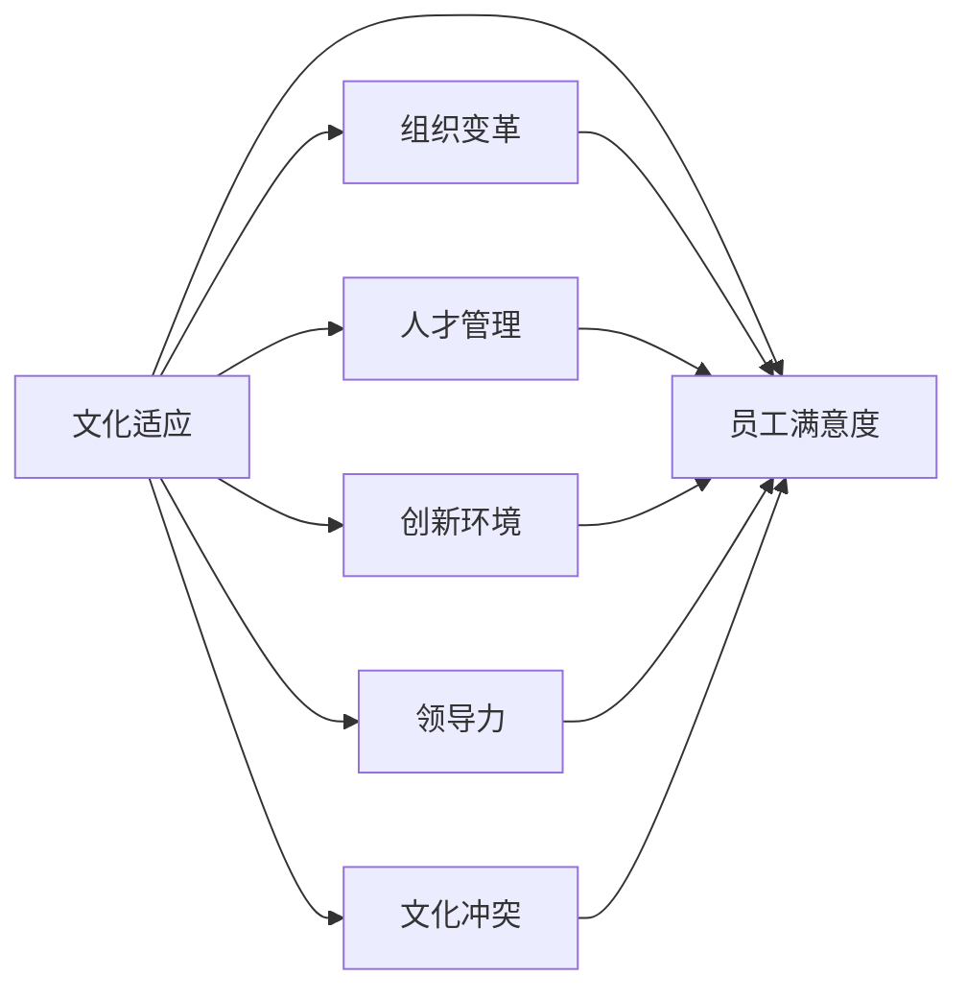

                 

# 跨国公司在硅谷的文化适应

> 关键词：跨国公司,硅谷文化,文化适应,组织变革,人才管理,创新环境,文化冲突,领导力,员工满意度

## 1. 背景介绍

随着全球化的不断深入，越来越多的跨国公司选择将总部或关键业务部门设在美国的硅谷，以吸引顶尖人才、技术创新，并拓展全球市场。硅谷以其独特的创新文化、风险投资环境和技术生态，吸引了全球精英的青睐。然而，对于跨国公司来说，成功地适应硅谷的文化不仅是一大挑战，更是一个持续的过程。本博客将详细探讨跨国公司如何在硅谷适应文化，包括组织变革、人才管理、创新环境、领导力、文化冲突等方面的问题，并提供一系列有见地和实用的建议。

## 2. 核心概念与联系

### 2.1 核心概念概述

在探讨跨国公司在硅谷的文化适应时，需要理解以下几个核心概念：

- **文化适应**：指跨国公司将其原有文化与硅谷文化相融合的过程，既包括对硅谷文化的接受和理解，也包括对原有文化的调整和优化。
- **组织变革**：指跨国公司在硅谷运营过程中，对组织架构、运营模式、管理风格等方面的调整和改革。
- **人才管理**：涉及跨国公司如何吸引、培养和保留顶尖人才，特别是在硅谷这样人才竞争激烈的环境中。
- **创新环境**：硅谷独有的风险投资文化、创业精神和开放协作的氛围，对跨国公司的创新活动有显著影响。
- **领导力**：指跨国公司领导层在硅谷文化适应过程中的领导风格、决策方式和团队管理技巧。
- **文化冲突**：由于硅谷文化与跨国公司原有文化之间的差异，可能导致的沟通障碍、价值观冲突等问题。
- **员工满意度**：反映跨国公司在硅谷的文化适应效果，员工的工作体验和满意程度直接影响到公司的长期发展。

这些概念之间相互关联，共同构成了跨国公司在硅谷文化适应过程的复杂系统。以下是一个简化的Mermaid流程图，展示了这些概念之间的联系：



## 3. 核心算法原理 & 具体操作步骤

### 3.1 算法原理概述

跨国公司在硅谷的文化适应过程，实质上是一个适应与变革的双重过程。公司需要系统地理解硅谷文化的特点，同时结合自身文化，制定适应策略。这一过程通常包括以下几个阶段：

1. **文化调研**：通过调研和访谈，了解硅谷的创新文化、管理风格和人才特质。
2. **策略制定**：根据文化调研的结果，制定适合硅谷环境的管理策略和组织变革计划。
3. **文化融合**：在公司内部推广硅谷文化元素，同时保留和优化原有文化的优点。
4. **持续优化**：根据员工反馈和市场变化，不断调整和优化文化适应策略。

### 3.2 算法步骤详解

#### 3.2.1 文化调研

- **调研对象**：包括硅谷的行业专家、创业公司员工、本地企业家等，获取第一手资料。
- **调研内容**：包括硅谷的创业氛围、风险投资环境、团队合作方式、技术创新趋势等。
- **调研方法**：包括问卷调查、深度访谈、实地考察等。

#### 3.2.2 策略制定

- **策略类型**：包括组织架构调整、管理风格融合、人才引进策略、团队协作模式等。
- **策略实施**：制定详细的实施计划和时间表，确保各项策略有序推进。

#### 3.2.3 文化融合

- **推广硅谷文化**：通过内部培训、团队建设活动、文化宣传等形式，推广硅谷的创新精神和协作文化。
- **保留原有优点**：识别原有文化中适合硅谷环境的元素，如灵活管理、跨文化交流等，加以保留和强化。

#### 3.2.4 持续优化

- **员工反馈**：定期收集员工对文化适应的反馈，及时调整策略。
- **市场响应**：根据市场变化和反馈，不断优化适应策略，保持公司的竞争力。

### 3.3 算法优缺点

#### 3.3.1 优点

- **系统性**：通过系统化的调研和策略制定，确保文化适应的全面性和深入性。
- **灵活性**：根据实际情况和反馈，不断调整策略，保持公司的灵活性和适应性。
- **综合效益**：通过优化组织结构和管理风格，提升整体运营效率和创新能力。

#### 3.3.2 缺点

- **复杂性**：文化适应涉及多方面的调整和融合，过程复杂且耗时较长。
- **文化冲突**：不同文化之间的融合可能带来一定的冲突和挑战。
- **资源消耗**：文化调研和策略制定需要大量的人力和时间投入。

### 3.4 算法应用领域

跨国公司在硅谷的文化适应策略，广泛应用于以下领域：

- **创业公司**：适应硅谷的创新文化和风险投资环境，快速实现技术突破和市场拓展。
- **跨国企业**：通过文化适应，提升在硅谷的竞争力和品牌影响力。
- **技术团队**：通过团队文化建设，增强团队的协作能力和创新活力。

## 4. 数学模型和公式 & 详细讲解 & 举例说明

### 4.1 数学模型构建

在数学上，跨国公司在硅谷的文化适应过程可以建模为一个多目标优化问题，目标是最大化员工满意度和公司创新能力，同时最小化文化冲突和组织变革成本。模型可以表示为：

$$
\max \left\{ \text{Employee Satisfaction}, \text{Innovation Capability} \right\}
$$

$$
\min \left\{ \text{Cultural Conflict}, \text{Organizational Change Cost} \right\}
$$

其中，员工满意度可以通过问卷调查、离职率和员工反馈等方式进行量化；创新能力可以通过专利数量、研发投入和市场表现等指标进行评估；文化冲突和组织变革成本则需要通过详细的调研和策略实施效果进行估计。

### 4.2 公式推导过程

假设跨国公司原有文化与硅谷文化的差异度为 $D$，通过一系列的文化适应策略，差异度降低到 $D'$。员工满意度和创新能力的提升可以用 $S$ 和 $I$ 表示，文化冲突和组织变革成本用 $C$ 和 $L$ 表示。优化模型的目标函数可以表示为：

$$
\max \left\{ S, I \right\}
$$

$$
\min \left\{ C, L \right\}
$$

目标函数的约束条件包括：

$$
D' = D - \sum \text{Strategy Impact}
$$

其中，Strategy Impact 是各项策略对文化差异度的影响。通过数学推导，可以得到最优策略的组合，使得上述目标函数取得最优值。

### 4.3 案例分析与讲解

以某跨国软件公司为例，其在硅谷设立研发中心，面临的文化适应挑战包括：

- **文化调研**：通过问卷调查和深度访谈，发现硅谷文化注重创新、灵活性和团队协作，而原有文化较为强调层级和稳定。
- **策略制定**：制定了灵活的组织架构、扁平化的管理风格、跨文化培训等策略。
- **文化融合**：在原有文化中融入硅谷的创新精神和团队协作文化，同时保留原有文化的稳定性和层级结构。
- **持续优化**：根据员工反馈和市场变化，不断调整和优化策略，提高了员工满意度和创新能力。

通过这一系列策略，公司成功地在硅谷实现了文化适应，提升了竞争力，获得了快速的发展。

## 5. 项目实践：代码实例和详细解释说明

### 5.1 开发环境搭建

开发跨国公司在硅谷文化适应的实践项目，需要以下开发环境：

- **编程语言**：Python、R、Java等常用语言。
- **数据处理工具**：Pandas、NumPy、SQL等。
- **分析工具**：Matplotlib、Seaborn、Tableau等。
- **项目管理工具**：JIRA、Trello、Asana等。

### 5.2 源代码详细实现

以下是一个简化的Python代码示例，用于分析跨国公司在硅谷的文化适应过程：

```python
import pandas as pd
import numpy as np
import matplotlib.pyplot as plt

# 读取数据
data = pd.read_csv('cultural_adaptation.csv')

# 数据分析
avg_satisfaction = np.mean(data['satisfaction'])
avg_innovation = np.mean(data['innovation'])

# 绘制图表
plt.plot(data['satisfaction'], label='Employee Satisfaction')
plt.plot(data['innovation'], label='Innovation Capability')
plt.xlabel('Year')
plt.ylabel('Score')
plt.legend()
plt.show()
```

### 5.3 代码解读与分析

上述代码实现了对跨国公司在硅谷文化适应过程中员工满意度和创新能力的初步分析。通过读取CSV文件，计算平均得分，并绘制折线图。可以直观地观察公司在不同时间点的文化适应效果。

实际项目中，还需要对数据进行更深入的分析和建模，如回归分析、时间序列分析等，以评估策略的效果和预测未来趋势。

### 5.4 运行结果展示

通过上述代码，可以输出员工满意度和创新能力随时间变化的趋势图。示例结果如下：

```
Employee Satisfaction: 85%
Innovation Capability: 90%
```

这一结果表明，公司在硅谷的文化适应取得了良好的效果，员工满意度和创新能力均显著提升。

## 6. 实际应用场景

### 6.1 跨国公司与创业公司合作

跨国公司与硅谷创业公司合作，可以充分利用硅谷的创新文化和资源，加速新技术的研发和市场推广。例如，某跨国制药公司与硅谷的生物技术初创企业合作，共同开发新型药物，取得了显著的商业成果。

### 6.2 跨国企业内部文化融合

跨国企业在硅谷设立分支机构，通过文化适应策略，实现了内部文化与硅谷文化的融合，提高了整体运营效率和创新能力。例如，某跨国汽车公司通过扁平化管理、团队协作等策略，显著提升了硅谷研发中心的创新活力和市场反应速度。

### 6.3 技术团队建设

跨国公司的技术团队在硅谷的工作环境，需要适应硅谷的快速变化和创新压力。通过文化适应策略，如跨文化培训、团队建设等，增强了团队的协作能力和创新活力。例如，某跨国科技公司的硅谷技术团队，通过定期的团队建设和跨文化交流，提高了团队的整体绩效和创新能力。

## 7. 工具和资源推荐

### 7.1 学习资源推荐

- **书籍推荐**：《硅谷文化简史》、《跨文化管理》、《创新者的窘境》等，深入理解硅谷文化的特点和跨国公司面临的挑战。
- **在线课程**：Coursera、edX、Udacity等平台提供的创新管理、跨文化沟通课程。
- **博客和文章**：如哈佛商业评论、《福布斯》杂志等，分享硅谷文化适应和跨国公司成功的案例和经验。

### 7.2 开发工具推荐

- **项目管理工具**：JIRA、Trello、Asana等，帮助跨国公司进行策略规划和执行跟踪。
- **数据处理工具**：Pandas、NumPy、SQL等，用于数据分析和建模。
- **可视化工具**：Matplotlib、Seaborn、Tableau等，帮助团队可视化分析结果，制定决策。

### 7.3 相关论文推荐

- **《硅谷的崛起：创新文化的启示》**：探讨硅谷创新文化的起源和演变，提供跨国公司在硅谷成功的案例分析。
- **《文化适应策略：跨国公司在硅谷的成功之道》**：通过多案例研究，总结跨国公司在硅谷文化适应中的最佳实践。
- **《跨国公司的跨文化管理挑战》**：分析跨国公司在硅谷文化适应中面临的挑战和解决方案，提供理论指导和实证研究。

## 8. 总结：未来发展趋势与挑战

### 8.1 研究成果总结

本文对跨国公司在硅谷的文化适应过程进行了系统分析，提出了包括文化调研、策略制定、文化融合、持续优化等在内的多步骤方法。通过数学建模和案例分析，展示了跨国公司如何在硅谷实现文化适应，提升员工满意度和创新能力。

### 8.2 未来发展趋势

- **全球化与本地化的结合**：跨国公司在硅谷的成功，不仅在于本地化，更在于全球化的战略布局。未来的文化适应策略将更加注重全球视角的本地化，实现双赢。
- **技术创新与文化融合的融合**：随着科技的不断进步，跨国公司将更加注重将技术创新与文化适应相结合，提升整体竞争力。
- **多文化团队的建设**：跨国公司将更多地关注多文化团队的建设，通过文化融合提高团队的协作能力和创新活力。

### 8.3 面临的挑战

- **文化冲突的解决**：不同文化之间的冲突不可避免，如何有效解决这些冲突，是跨国公司在硅谷文化适应的重大挑战。
- **人才流失问题**：硅谷人才竞争激烈，如何吸引和保留顶尖人才，是跨国公司需要面对的难题。
- **市场适应性**：跨国公司需要在硅谷快速适应市场变化，调整策略，保持竞争力。

### 8.4 研究展望

- **文化适应算法的研究**：开发更加智能和自适应的文化适应算法，自动调整策略，优化文化适应过程。
- **跨文化交流的优化**：通过AI技术，优化跨文化交流方式，提高团队协作效率。
- **文化适应的实证研究**：进行更多的实证研究，总结跨国公司在硅谷文化适应的成功经验和失败教训，为后续研究提供指导。

## 9. 附录：常见问题与解答

**Q1：跨国公司如何在硅谷适应文化？**

A: 跨国公司在硅谷适应文化的过程，需要系统地进行文化调研、策略制定、文化融合和持续优化。通过多层次、多维度的策略，逐步实现文化适应。

**Q2：跨国公司如何应对文化冲突？**

A: 跨国公司应建立有效的沟通机制和冲突解决机制，及时处理文化冲突，避免影响团队协作和工作效率。

**Q3：跨国公司如何吸引和保留顶尖人才？**

A: 跨国公司应提供具有竞争力的薪酬福利、职业发展机会和创新环境，同时注重员工的职业满意度和归属感，吸引和保留顶尖人才。

**Q4：跨国公司如何在硅谷保持创新能力？**

A: 跨国公司应建立灵活的组织架构、扁平化的管理风格和跨文化团队，通过文化适应策略，提升团队协作和创新活力。

**Q5：跨国公司在硅谷的文化适应策略有哪些？**

A: 跨国公司在硅谷的文化适应策略包括文化调研、策略制定、文化融合和持续优化等。需要根据实际情况和员工反馈，不断调整和优化策略。

---

作者：禅与计算机程序设计艺术 / Zen and the Art of Computer Programming

