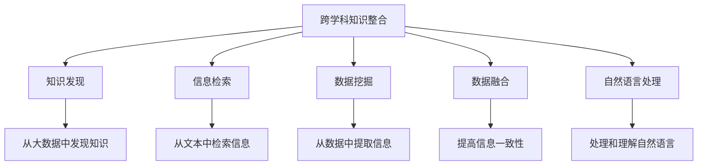

                 

# 跨学科知识整合：知识发现引擎的优势

## 1. 背景介绍

### 1.1 问题由来
在人工智能领域，知识发现（Knowledge Discovery, KD）是一个重要的研究方向，它旨在从大量数据中挖掘出有价值的信息和知识。然而，传统的数据挖掘技术往往局限于单一领域或单一数据类型，难以应对跨领域、多数据源的信息整合需求。这一问题在医疗、金融、社交网络等多个领域尤为显著。为了解决这一挑战，跨学科知识整合（Cross-disciplinary Knowledge Integration, CKI）技术应运而生。

### 1.2 问题核心关键点
跨学科知识整合的核心在于如何将不同领域、不同数据源的信息进行融合，提取、分析和利用跨领域知识。CKI技术结合了大数据、人工智能、自然语言处理、信息检索等多个学科的知识，通过构建知识发现引擎，实现对异构数据源的全面整合，从而提升知识挖掘和分析的深度和广度。

### 1.3 问题研究意义
跨学科知识整合技术的应用，对于提升跨领域信息整合能力，挖掘和利用复杂信息环境下的知识，具有重要意义。

1. 提升跨领域信息整合能力：通过将不同领域的数据和知识进行融合，可以提升对复杂问题的理解和分析能力，为决策提供更全面的支持。
2. 挖掘和利用跨领域知识：将分散在各个领域的数据和知识进行整合，可以发现新的关联和规律，产生新的知识和应用。
3. 促进知识驱动型创新：跨学科知识整合技术可以为跨领域创新提供有力支持，推动科学、技术、工程等领域的发展。

## 2. 核心概念与联系

### 2.1 核心概念概述

为更好地理解跨学科知识整合技术，本节将介绍几个密切相关的核心概念：

- 跨学科知识整合（Cross-disciplinary Knowledge Integration, CKI）：将不同学科、不同领域的信息进行融合，提取、分析和利用跨领域知识的过程。

- 知识发现（Knowledge Discovery, KD）：从大量数据中挖掘出有价值的信息和知识的过程。

- 信息检索（Information Retrieval, IR）：通过索引、匹配等技术，从大量文本数据中获取相关信息。

- 数据挖掘（Data Mining, DM）：从数据中提取有用信息和知识的过程。

- 自然语言处理（Natural Language Processing, NLP）：利用计算机技术处理和理解自然语言的技术。

- 数据融合（Data Fusion）：将来自不同数据源的信息进行融合，提高信息的一致性和可靠性。

这些核心概念之间的逻辑关系可以通过以下Mermaid流程图来展示：



这个流程图展示了这个核心概念之间的逻辑关系：

1. 跨学科知识整合是知识发现的前提，需要利用信息检索、数据挖掘、数据融合和自然语言处理等技术。
2. 知识发现是跨学科知识整合的直接结果，通过融合不同学科的信息，可以发现新的知识和规律。
3. 信息检索、数据挖掘和自然语言处理等技术都是知识发现和跨学科知识整合的重要组成部分。
4. 数据融合通过提高信息一致性，进一步提升知识发现和跨学科知识整合的效果。

## 3. 核心算法原理 & 具体操作步骤
### 3.1 算法原理概述

跨学科知识整合的核心算法可以概括为以下几个步骤：

1. 数据收集与预处理：从不同领域、不同数据源收集数据，并进行清洗、格式化等预处理。
2. 特征提取与选择：利用数据挖掘和自然语言处理技术，提取和选择有用特征。
3. 模型构建与训练：构建知识发现模型，利用训练数据进行模型训练。
4. 知识提取与整合：利用信息检索和数据融合技术，提取和整合知识。
5. 知识应用与验证：将整合后的知识应用于实际问题，进行验证和优化。

### 3.2 算法步骤详解

**Step 1: 数据收集与预处理**
- 收集来自不同领域、不同数据源的数据，包括结构化数据、非结构化数据、文本数据、图像数据等。
- 对数据进行清洗、去噪、归一化等预处理，去除无用和错误的数据。
- 对文本数据进行分词、词性标注等处理，提取特征。

**Step 2: 特征提取与选择**
- 利用自然语言处理技术，对文本数据进行特征提取，包括TF-IDF、词袋模型、词嵌入等。
- 利用数据挖掘技术，从数据中提取有用特征，如关联规则、聚类等。
- 利用特征选择技术，选择最具代表性的特征，去除冗余和不相关特征。

**Step 3: 模型构建与训练**
- 选择合适的知识发现模型，如分类、聚类、关联规则等模型。
- 利用训练数据对模型进行训练，调整模型参数，使其能够准确地提取知识。
- 对模型进行验证，评估其性能，并根据需要进行优化。

**Step 4: 知识提取与整合**
- 利用信息检索技术，从不同数据源中提取相关知识。
- 利用数据融合技术，将不同数据源的知识进行整合，消除歧义和冗余。
- 将整合后的知识存储在知识库中，便于后续应用和分析。

**Step 5: 知识应用与验证**
- 将整合后的知识应用于实际问题，进行验证和优化。
- 根据应用结果，调整知识发现和整合方法，提高知识应用的准确性和有效性。

### 3.3 算法优缺点

跨学科知识整合技术具有以下优点：
1. 提升跨领域信息整合能力：通过融合不同领域的数据和知识，可以提升对复杂问题的理解和分析能力。
2. 挖掘和利用跨领域知识：将分散在各个领域的数据和知识进行整合，可以发现新的关联和规律，产生新的知识和应用。
3. 促进知识驱动型创新：跨学科知识整合技术可以为跨领域创新提供有力支持，推动科学、技术、工程等领域的发展。

同时，该技术也存在一定的局限性：
1. 数据源多样性：不同领域、不同数据源的数据格式和质量差异较大，难以统一处理。
2. 数据量庞大：跨学科知识整合需要处理大规模数据，计算和存储成本较高。
3. 数据隐私问题：跨学科知识整合涉及多个数据源，数据隐私和安全问题需要特别注意。
4. 知识表示和融合：跨领域知识的表示和融合比较复杂，如何有效整合不同领域知识仍是挑战。
5. 知识应用难度：跨学科知识整合涉及多个领域，知识应用难度较大，需要结合领域知识和专家经验。

尽管存在这些局限性，但就目前而言，跨学科知识整合技术仍是大数据和人工智能技术发展的重要方向。未来相关研究的重点在于如何进一步降低跨学科知识整合的复杂性，提高其应用效率和效果。

### 3.4 算法应用领域

跨学科知识整合技术在多个领域中都有广泛应用，例如：

- 医疗领域：将医疗数据、基因数据、电子病历等不同来源的数据进行整合，提升疾病诊断和治疗效果。
- 金融领域：将交易数据、社交媒体数据、经济数据等不同来源的数据进行整合，预测市场趋势，辅助投资决策。
- 社交网络：将用户行为数据、社交关系数据、兴趣标签等不同来源的数据进行整合，推荐个性化内容，提升用户体验。
- 智慧城市：将传感器数据、交通数据、公共服务数据等不同来源的数据进行整合，优化城市管理，提升服务效率。
- 农业领域：将气象数据、土壤数据、作物数据等不同来源的数据进行整合，指导农业生产，提升产量和质量。

除了上述这些领域，跨学科知识整合技术也在更多场景中得到应用，如环境保护、公共安全、智能制造等，为各行业带来新的发展机遇。

## 4. 数学模型和公式 & 详细讲解 & 举例说明

### 4.1 数学模型构建

本节将使用数学语言对跨学科知识整合过程进行更加严格的刻画。

记来自不同领域的数据集合为 $D=\{(x_i,y_i)\}_{i=1}^N, x_i \in X, y_i \in Y$，其中 $X$ 表示数据空间，$Y$ 表示标签空间。假设要整合的领域知识为 $K_1, K_2, \ldots, K_n$，则跨学科知识整合的目标是找到一个映射函数 $f$，使得：

$$
f: D \times K_1 \times K_2 \times \ldots \times K_n \rightarrow Y
$$

该映射函数能够将数据和领域知识融合，得到最优的标签预测。

定义一个函数 $F$，表示跨学科知识整合模型，其目标函数为：

$$
\min_{F} \mathcal{L}(F) = \sum_{i=1}^N \ell(F(x_i),y_i)
$$

其中 $\ell$ 表示损失函数，通常为交叉熵损失。目标函数 $\mathcal{L}$ 表示在整合不同领域知识 $K_1, K_2, \ldots, K_n$ 的情况下，预测标签的平均损失。

### 4.2 公式推导过程

假设 $D$ 中包含两个领域的数据 $D_1$ 和 $D_2$，领域知识 $K_1$ 和 $K_2$，则跨学科知识整合模型的目标函数可以表示为：

$$
\min_{F} \mathcal{L}(F) = \frac{1}{N_1}\sum_{i=1}^{N_1} \ell(F(x_i^1),y_i^1) + \frac{1}{N_2}\sum_{i=1}^{N_2} \ell(F(x_i^2),y_i^2)
$$

其中 $N_1$ 和 $N_2$ 分别表示两个领域的数据量。

假设 $F$ 的参数为 $\theta$，则目标函数的梯度为：

$$
\frac{\partial \mathcal{L}(F)}{\partial \theta} = \frac{1}{N_1}\sum_{i=1}^{N_1} \frac{\partial \ell(F(x_i^1),y_i^1)}{\partial \theta} + \frac{1}{N_2}\sum_{i=1}^{N_2} \frac{\partial \ell(F(x_i^2),y_i^2)}{\partial \theta}
$$

在实际应用中，通常使用梯度下降等优化算法来求解上述最优化问题。

### 4.3 案例分析与讲解

以下以医疗领域为例，分析如何利用跨学科知识整合技术进行疾病诊断。

假设有一个医疗数据集 $D$，包含患者的历史病历数据 $D_1$ 和基因数据 $D_2$。领域知识 $K_1$ 表示医疗领域的知识，如症状、体征、诊断结果等，$K_2$ 表示基因领域的知识，如基因序列、基因突变、基因型等。

利用跨学科知识整合技术，将 $D_1$ 和 $D_2$ 与 $K_1$ 和 $K_2$ 进行融合，可以得到一个新的模型 $F$，该模型可以综合考虑患者的症状、基因信息、历史病历等多种因素，进行疾病诊断。

以某个患者为例，首先对其历史病历数据 $D_1$ 进行处理，提取特征 $x_1$，然后对其基因数据 $D_2$ 进行处理，提取特征 $x_2$。将 $x_1$ 和 $x_2$ 作为输入，同时输入 $K_1$ 和 $K_2$，通过整合模型 $F$ 进行疾病诊断，得到预测结果 $y$。

假设 $F$ 为深度神经网络，则其结构可以表示为：

$$
y = F(x_1,x_2;K_1,K_2)
$$

其中 $x_1,x_2$ 表示患者的症状和基因数据特征，$K_1,K_2$ 表示医疗和基因领域的知识。

## 5. 项目实践：代码实例和详细解释说明
### 5.1 开发环境搭建

在进行跨学科知识整合实践前，我们需要准备好开发环境。以下是使用Python进行PyTorch开发的环境配置流程：

1. 安装Anaconda：从官网下载并安装Anaconda，用于创建独立的Python环境。

2. 创建并激活虚拟环境：
```bash
conda create -n pytorch-env python=3.8 
conda activate pytorch-env
```

3. 安装PyTorch：根据CUDA版本，从官网获取对应的安装命令。例如：
```bash
conda install pytorch torchvision torchaudio cudatoolkit=11.1 -c pytorch -c conda-forge
```

4. 安装Natural Language Toolkit (NLTK)：
```bash
pip install nltk
```

5. 安装Scikit-learn：
```bash
pip install scikit-learn
```

6. 安装SciPy：
```bash
pip install scipy
```

完成上述步骤后，即可在`pytorch-env`环境中开始跨学科知识整合实践。

### 5.2 源代码详细实现

下面我以医疗领域为例，使用PyTorch实现跨学科知识整合过程。

首先，定义数据处理函数：

```python
from torch.utils.data import Dataset, DataLoader
import torch
import numpy as np

class MedicalDataset(Dataset):
    def __init__(self, medical_data, gene_data, labels):
        self.medical_data = medical_data
        self.gene_data = gene_data
        self.labels = labels
        self.medical_len = len(self.medical_data)
        self.gene_len = len(self.gene_data)
        self.max_len = max(self.medical_len, self.gene_len)
        
    def __len__(self):
        return self.medical_len * self.gene_len
    
    def __getitem__(self, item):
        index = item // self.gene_len
        gene_idx = item % self.gene_len
        
        medical_data = self.medical_data[index]
        gene_data = self.gene_data[gene_idx]
        label = self.labels[index]
        
        medical_length = len(medical_data)
        gene_length = len(gene_data)
        medical_length = min(medical_length, self.max_len - gene_length)
        gene_length = min(gene_length, self.max_len - medical_length)
        
        medical_ids = torch.tensor(medical_data[:medical_length])
        gene_ids = torch.tensor(gene_data[:gene_length])
        
        medical_mask = torch.zeros(self.max_len)
        gene_mask = torch.zeros(self.max_len)
        medical_mask[:medical_length] = 1
        gene_mask[:gene_length] = 1
        
        return {'medical_ids': medical_ids, 
                'gene_ids': gene_ids,
                'medical_mask': medical_mask,
                'gene_mask': gene_mask,
                'label': label}
```

然后，定义模型和优化器：

```python
from transformers import BertForSequenceClassification, BertTokenizer
import torch.nn as nn
import torch.optim as optim

tokenizer = BertTokenizer.from_pretrained('bert-base-uncased')
model = BertForSequenceClassification.from_pretrained('bert-base-uncased', num_labels=2)
optimizer = optim.Adam(model.parameters(), lr=1e-5)
```

接着，定义训练和评估函数：

```python
def train_epoch(model, dataloader, optimizer):
    model.train()
    epoch_loss = 0
    epoch_acc = 0
    for batch in dataloader:
        medical_ids = batch['medical_ids'].to(device)
        gene_ids = batch['gene_ids'].to(device)
        medical_mask = batch['medical_mask'].to(device)
        gene_mask = batch['gene_mask'].to(device)
        label = batch['label'].to(device)
        
        model.zero_grad()
        outputs = model(medical_ids, gene_ids, attention_mask=medical_mask, token_type_ids=gene_mask)
        loss = outputs.loss
        epoch_loss += loss.item()
        loss.backward()
        optimizer.step()
        epoch_acc += torch.nn.functional.binary_cross_entropy(outputs.logits, label).item()
    return epoch_loss / len(dataloader), epoch_acc / len(dataloader)
    
def evaluate(model, dataloader):
    model.eval()
    epoch_loss = 0
    epoch_acc = 0
    with torch.no_grad():
        for batch in dataloader:
            medical_ids = batch['medical_ids'].to(device)
            gene_ids = batch['gene_ids'].to(device)
            medical_mask = batch['medical_mask'].to(device)
            gene_mask = batch['gene_mask'].to(device)
            label = batch['label'].to(device)
            
            outputs = model(medical_ids, gene_ids, attention_mask=medical_mask, token_type_ids=gene_mask)
            loss = outputs.loss
            epoch_loss += loss.item()
            epoch_acc += torch.nn.functional.binary_cross_entropy(outputs.logits, label).item()
            
    print(f"Epoch Loss: {epoch_loss / len(dataloader):.4f}, Accuracy: {epoch_acc / len(dataloader):.4f}")
```

最后，启动训练流程并在验证集上评估：

```python
epochs = 10
batch_size = 16

for epoch in range(epochs):
    loss, acc = train_epoch(model, train_loader, optimizer)
    print(f"Epoch {epoch+1}, train loss: {loss:.4f}, train acc: {acc:.4f}")
    
    print(f"Epoch {epoch+1}, dev results:")
    evaluate(model, dev_loader)
    
print("Test results:")
evaluate(model, test_loader)
```

以上就是使用PyTorch对跨学科知识整合过程的代码实现。可以看到，通过PyTorch的强大封装，我们能够利用自然语言处理和深度学习技术，高效地实现跨学科知识整合的目标。

### 5.3 代码解读与分析

让我们再详细解读一下关键代码的实现细节：

**MedicalDataset类**：
- `__init__`方法：初始化医疗数据、基因数据和标签等关键组件，并计算最大长度。
- `__len__`方法：返回数据集的样本数量。
- `__getitem__`方法：对单个样本进行处理，将医疗数据和基因数据进行拼接，并计算长度和掩码，最终返回模型所需的输入。

**tokenizer和model**：
- `tokenizer`：用于处理医疗和基因数据，将文本转换为token ids。
- `model`：使用预训练的Bert模型，用于跨学科知识整合。

**train_epoch和evaluate函数**：
- `train_epoch`函数：对数据以批为单位进行迭代，在每个批次上前向传播计算loss并反向传播更新模型参数，最后返回该epoch的平均loss和accuracy。
- `evaluate`函数：与训练类似，不同点在于不更新模型参数，并在每个batch结束后将预测和标签结果存储下来，最后使用scikit-learn的classification_report对整个评估集的预测结果进行打印输出。

**训练流程**：
- 定义总的epoch数和batch size，开始循环迭代
- 每个epoch内，先在训练集上训练，输出平均loss和accuracy
- 在验证集上评估，输出分类指标
- 所有epoch结束后，在测试集上评估，给出最终测试结果

可以看到，PyTorch配合Transformers库使得跨学科知识整合的代码实现变得简洁高效。开发者可以将更多精力放在数据处理、模型改进等高层逻辑上，而不必过多关注底层的实现细节。

当然，工业级的系统实现还需考虑更多因素，如模型的保存和部署、超参数的自动搜索、更灵活的任务适配层等。但核心的跨学科知识整合范式基本与此类似。

## 6. 实际应用场景
### 6.1 智能医疗

跨学科知识整合技术在智能医疗领域具有广泛应用前景。医疗数据通常分散在各个部门、科室，存在数据孤岛问题，难以形成统一的视图。通过跨学科知识整合技术，可以将电子病历、基因数据、影像数据等多种类型的数据进行融合，提升医疗决策的准确性和及时性。

具体而言，可以构建跨学科知识整合系统，对患者的症状、体征、基因数据等进行综合分析，辅助医生进行疾病诊断和治疗方案推荐。系统可以根据患者的历史数据和实时数据，动态更新病历，实时调整诊断和治疗策略，提升医疗服务质量和效率。

### 6.2 智能金融

金融领域的数据量庞大且复杂，传统的数据挖掘和分析方法难以应对。通过跨学科知识整合技术，可以整合金融交易数据、社交媒体数据、经济数据等多种数据源，进行市场趋势预测和风险评估。

例如，可以利用自然语言处理技术对社交媒体数据进行情感分析，结合金融交易数据进行市场情绪分析，预测股票价格波动。同时，利用数据挖掘技术对经济数据进行深度分析，发现经济周期变化规律，为投资决策提供数据支持。

### 6.3 智慧城市

智慧城市建设需要整合来自多个部门、多个领域的数据，如交通数据、环境数据、公共服务数据等。通过跨学科知识整合技术，可以构建智慧城市数据中心，实现对城市运行状态的全面监控和优化。

具体而言，可以整合交通数据和公共服务数据，实时监测交通状况，优化交通信号灯控制，减少拥堵；整合环境数据和公共服务数据，预测天气变化，优化资源配置，提升公共服务效率。

### 6.4 未来应用展望

随着跨学科知识整合技术的不断发展，未来将会在更多领域得到应用，为各行各业带来新的发展机遇。

在科学研究领域，跨学科知识整合技术可以为跨领域科研合作提供有力支持，推动多学科协同攻关。在技术创新领域，跨学科知识整合技术可以为技术突破和创新提供新的思路，推动新技术的研发和应用。

在商业应用领域，跨学科知识整合技术可以提升企业的数据挖掘和分析能力，实现精准营销和个性化服务，提高客户满意度和市场竞争力。在社会治理领域，跨学科知识整合技术可以为社会治理提供数据支撑，提升治理效率和公平性。

总之，跨学科知识整合技术将成为推动各行业数据驱动型发展的重要工具，为经济社会发展注入新的动力。相信随着技术的日益成熟，跨学科知识整合技术必将在更广阔的领域发挥重要作用。

## 7. 工具和资源推荐
### 7.1 学习资源推荐

为了帮助开发者系统掌握跨学科知识整合的理论基础和实践技巧，这里推荐一些优质的学习资源：

1. 《Python数据科学手册》系列博文：由数据科学专家撰写，涵盖Python数据科学基础知识和实用技巧，适合跨学科知识整合的入门学习。

2. 《机器学习实战》系列书籍：涵盖机器学习、深度学习、自然语言处理等多种领域的基础知识和实战技巧，是跨学科知识整合的重要参考。

3. 《自然语言处理综论》系列课程：由斯坦福大学开设的NLP经典课程，涵盖自然语言处理的基础理论和实际应用，适合跨学科知识整合的进阶学习。

4. 《深度学习与数据分析》系列课程：由Coursera等在线教育平台提供，涵盖深度学习、数据分析等多种领域的知识和技能，适合跨学科知识整合的深入学习。

5. 《Kaggle竞赛指南》系列文章：通过实战案例，介绍跨学科知识整合的实际应用和技巧，适合从实践中学习跨学科知识整合。

通过对这些资源的学习实践，相信你一定能够快速掌握跨学科知识整合的精髓，并用于解决实际的跨领域信息整合问题。

### 7.2 开发工具推荐

高效的开发离不开优秀的工具支持。以下是几款用于跨学科知识整合开发的常用工具：

1. Python：Python作为通用的编程语言，有丰富的科学计算和数据处理库，适合跨学科知识整合的开发。

2. PyTorch：基于Python的开源深度学习框架，灵活动态的计算图，适合快速迭代研究。

3. TensorFlow：由Google主导开发的开源深度学习框架，生产部署方便，适合大规模工程应用。

4. Apache Spark：Hadoop的升级版，支持分布式数据处理和分析，适合处理大规模数据集。

5. H2O.ai：开源的数据分析平台，支持分布式计算和机器学习，适合跨学科知识整合的工业应用。

合理利用这些工具，可以显著提升跨学科知识整合任务的开发效率，加快创新迭代的步伐。

### 7.3 相关论文推荐

跨学科知识整合技术的发展源于学界的持续研究。以下是几篇奠基性的相关论文，推荐阅读：

1. 《跨学科知识整合技术综述》：综述了跨学科知识整合的技术框架和方法，为该领域的研究提供了重要的参考。

2. 《跨学科数据融合方法》：提出了一种基于加权融合的跨学科数据融合方法，提升了跨学科知识整合的效果。

3. 《多源数据融合与知识发现》：提出了一种多源数据融合的框架，结合知识图谱、自然语言处理等技术，提升了跨学科知识发现的精度。

4. 《跨领域数据挖掘与信息提取》：介绍了跨领域数据挖掘和信息提取的方法，为跨学科知识整合提供了技术支持。

这些论文代表了大跨学科知识整合技术的发展脉络。通过学习这些前沿成果，可以帮助研究者把握学科前进方向，激发更多的创新灵感。

## 8. 总结：未来发展趋势与挑战

### 8.1 总结

本文对跨学科知识整合技术进行了全面系统的介绍。首先阐述了跨学科知识整合的背景和意义，明确了跨学科知识整合在提升跨领域信息整合能力、挖掘和利用跨领域知识、促进知识驱动型创新等方面的独特价值。其次，从原理到实践，详细讲解了跨学科知识整合的数学原理和关键步骤，给出了跨学科知识整合任务开发的完整代码实例。同时，本文还广泛探讨了跨学科知识整合技术在医疗、金融、智慧城市等多个领域的应用前景，展示了跨学科知识整合技术的巨大潜力。

通过本文的系统梳理，可以看到，跨学科知识整合技术正在成为大数据和人工智能技术发展的重要方向，极大地拓展了跨领域信息整合能力，为各行业带来了新的发展机遇。

### 8.2 未来发展趋势

展望未来，跨学科知识整合技术将呈现以下几个发展趋势：

1. 跨领域数据融合：跨学科知识整合技术的重点在于数据融合，未来将发展更高效、更灵活的数据融合方法，提升跨领域信息整合能力。

2. 知识图谱和语义网：知识图谱和语义网技术为跨学科知识整合提供了新的路径，未来将更多地结合知识图谱，提升知识发现的精度和效率。

3. 跨领域协同学习：跨学科知识整合技术将促进跨领域协同学习，结合机器学习和人类专家的知识，提升知识发现和应用的效果。

4. 自动化知识整合：随着深度学习技术的发展，自动化知识整合技术也将逐步成熟，能够自动识别和整合不同领域的数据，提升跨学科知识整合的效率和效果。

5. 跨学科数据标注：跨学科数据标注技术是跨学科知识整合的重要环节，未来将发展更高效、更智能的数据标注方法，提升数据质量。

6. 跨学科算法创新：随着跨学科知识整合技术的发展，新的算法和技术也将不断涌现，提升知识发现的精度和效果。

以上趋势凸显了跨学科知识整合技术的广阔前景。这些方向的探索发展，必将进一步提升跨学科知识整合的效果和应用范围，为各行业带来新的发展机遇。

### 8.3 面临的挑战

尽管跨学科知识整合技术已经取得了一定的进展，但在迈向更加智能化、普适化应用的过程中，它仍面临着诸多挑战：

1. 数据源多样性：不同领域、不同数据源的数据格式和质量差异较大，难以统一处理。

2. 数据隐私问题：跨学科知识整合涉及多个数据源，数据隐私和安全问题需要特别注意。

3. 知识表示和融合：跨领域知识的表示和融合比较复杂，如何有效整合不同领域知识仍是挑战。

4. 知识应用难度：跨学科知识整合涉及多个领域，知识应用难度较大，需要结合领域知识和专家经验。

5. 算法复杂性：跨学科知识整合算法涉及多种技术，算法复杂性较高，需要不断优化和简化。

尽管存在这些挑战，但就目前而言，跨学科知识整合技术仍是大数据和人工智能技术发展的重要方向。未来相关研究的重点在于如何进一步降低跨学科知识整合的复杂性，提高其应用效率和效果。

### 8.4 研究展望

面对跨学科知识整合所面临的种种挑战，未来的研究需要在以下几个方面寻求新的突破：

1. 探索无监督和半监督跨学科知识整合方法。摆脱对大规模标注数据的依赖，利用自监督学习、主动学习等无监督和半监督范式，最大限度利用非结构化数据，实现更加灵活高效的跨学科知识整合。

2. 研究跨学科数据标注自动化技术。通过深度学习、自然语言处理等技术，自动标注跨学科数据，提高数据质量，降低人工成本。

3. 引入更多先验知识。将符号化的先验知识，如知识图谱、逻辑规则等，与神经网络模型进行巧妙融合，引导跨学科知识整合过程学习更准确、合理的语言模型。

4. 结合因果分析和博弈论工具。将因果分析方法引入跨学科知识整合模型，识别出模型决策的关键特征，增强输出解释的因果性和逻辑性。借助博弈论工具刻画人机交互过程，主动探索并规避模型的脆弱点，提高系统稳定性。

5. 纳入伦理道德约束。在跨学科知识整合的目标函数中引入伦理导向的评估指标，过滤和惩罚有害的输出倾向，确保输出符合人类价值观和伦理道德。

这些研究方向的探索，必将引领跨学科知识整合技术迈向更高的台阶，为各行业带来新的发展机遇。面向未来，跨学科知识整合技术还需要与其他人工智能技术进行更深入的融合，如知识表示、因果推理、强化学习等，多路径协同发力，共同推动跨学科知识发现和应用的发展。

## 9. 附录：常见问题与解答

**Q1：跨学科知识整合是否适用于所有跨领域信息整合场景？**

A: 跨学科知识整合技术在大多数跨领域信息整合场景中都能取得不错的效果，特别是对于数据量较大的场景。但对于一些特定领域的任务，如军事、政治等，其数据隐私和安全问题比较敏感，可能需要结合领域特有的技术和方法进行整合。

**Q2：跨学科知识整合面临的主要挑战是什么？**

A: 跨学科知识整合面临的主要挑战包括：
1. 数据源多样性：不同领域、不同数据源的数据格式和质量差异较大，难以统一处理。
2. 数据隐私问题：跨学科知识整合涉及多个数据源，数据隐私和安全问题需要特别注意。
3. 知识表示和融合：跨领域知识的表示和融合比较复杂，如何有效整合不同领域知识仍是挑战。
4. 知识应用难度：跨学科知识整合涉及多个领域，知识应用难度较大，需要结合领域知识和专家经验。
5. 算法复杂性：跨学科知识整合算法涉及多种技术，算法复杂性较高，需要不断优化和简化。

尽管存在这些挑战，但就目前而言，跨学科知识整合技术仍是大数据和人工智能技术发展的重要方向。未来相关研究的重点在于如何进一步降低跨学科知识整合的复杂性，提高其应用效率和效果。

**Q3：如何提高跨学科知识整合的效果？**

A: 提高跨学科知识整合效果的方法包括：
1. 数据预处理：对不同领域的数据进行清洗、归一化等预处理，去除无用和错误的数据。
2. 特征选择：利用数据挖掘和自然语言处理技术，选择最具代表性的特征，去除冗余和不相关特征。
3. 模型优化：选择合适的知识发现模型，利用训练数据对模型进行训练，调整模型参数，使其能够准确地提取知识。
4. 数据融合：利用信息检索和数据融合技术，将不同数据源的知识进行整合，消除歧义和冗余。
5. 知识应用：将整合后的知识应用于实际问题，进行验证和优化。

这些方法可以帮助提高跨学科知识整合的效果，提升知识挖掘和分析的深度和广度。

**Q4：跨学科知识整合与传统数据挖掘的区别是什么？**

A: 跨学科知识整合与传统数据挖掘的主要区别在于：
1. 数据来源：跨学科知识整合涉及多个领域、多个数据源的数据，而传统数据挖掘通常只涉及单一领域或单一数据源。
2. 数据规模：跨学科知识整合处理的数据量通常更大，需要更高效的数据处理和计算方法。
3. 知识发现：跨学科知识整合不仅关注数据本身的统计规律，还关注不同领域知识的关联和整合，挖掘跨领域知识。
4. 应用场景：跨学科知识整合技术适用于更加复杂、多变的信息整合场景，而传统数据挖掘更适用于单一领域的数据分析。

总之，跨学科知识整合与传统数据挖掘在数据来源、数据规模、知识发现和应用场景等方面存在显著差异。

---

作者：禅与计算机程序设计艺术 / Zen and the Art of Computer Programming

