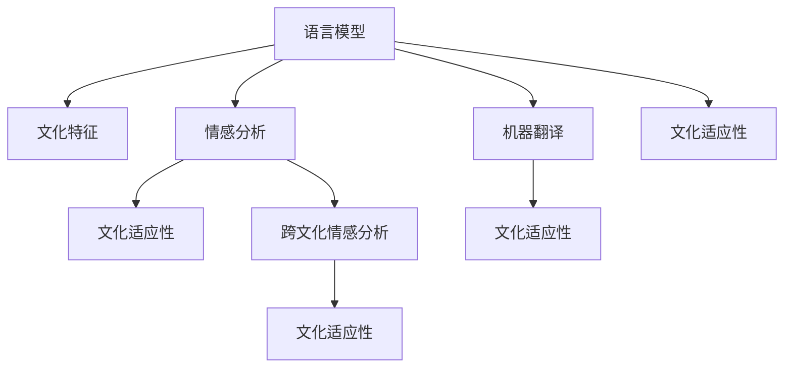

                 

## 1. 背景介绍

在全球化的今天，文化和语言的差异已经成为阻碍跨文化交流的主要障碍之一。尤其是在自然语言处理（NLP）领域，不同文化背景下的语言差异、语义歧义、文化特有的表达方式等因素，都对机器理解和处理跨文化文本带来了巨大挑战。为了应对这些挑战，跨文化NLP技术应运而生。本文将详细介绍跨文化NLP的核心概念与联系，核心算法原理与具体操作步骤，以及其未来的应用前景与发展趋势。

## 2. 核心概念与联系

### 2.1 核心概念概述

#### 2.1.1 跨文化NLP
跨文化NLP（Cross-Cultural Natural Language Processing）是一种旨在理解、处理和生成不同文化背景下的自然语言的技术。它涵盖了多语言翻译、情感分析、跨文化情感识别、文化适应性文本生成等多个领域，旨在解决由于语言和文化差异导致的NLP问题。

#### 2.1.2 语言模型与文化
语言模型（Language Model）是自然语言处理的基础，通过学习语言数据中的概率分布，生成新的自然语言文本。文化在语言模型中起到关键作用，不同文化背景下的语言使用习惯、成语典故、表达方式等都直接影响着语言模型的训练和应用。

#### 2.1.3 文化适应性
文化适应性（Cultural Adaptability）指机器学习模型在不同文化背景下的表现能力。在跨文化NLP中，文化适应性是衡量模型是否能够准确理解和生成跨文化文本的重要指标。

#### 2.1.4 情感分析与跨文化
情感分析（Sentiment Analysis）是NLP中的一个重要任务，旨在识别文本中的情感倾向。跨文化情感分析（Cross-Cultural Sentiment Analysis）需要考虑不同文化背景下的情感表达方式和语境，以便更准确地识别和理解情感。

#### 2.1.5 机器翻译与跨文化
机器翻译（Machine Translation）是NLP中的一个经典任务，旨在实现不同语言之间的自动翻译。跨文化机器翻译（Cross-Cultural Machine Translation）则需要考虑到不同文化背景下的语言差异和语义转换，以提升翻译的准确性和自然度。

### 2.2 核心概念原理和架构的 Mermaid 流程图



这个流程图展示了跨文化NLP的核心概念和其相互之间的关系：语言模型通过学习不同文化的语言特征，结合文化适应性模型，实现了情感分析和机器翻译的跨文化处理。

## 3. 核心算法原理 & 具体操作步骤

### 3.1 算法原理概述

跨文化NLP的算法原理主要基于监督学习，通过收集大量跨文化文本数据，训练模型以学习不同文化背景下语言特征和情感表达方式的规律。以下是跨文化NLP的核心算法原理：

1. **数据收集与预处理**：收集不同语言和文化背景下的文本数据，进行清洗和预处理，以便模型能够学习到有效的语言和文化特征。

2. **模型训练与调参**：使用监督学习算法（如卷积神经网络、循环神经网络、Transformer等）对数据进行模型训练，并进行超参数调优，以提升模型的文化适应性。

3. **跨文化特征学习**：通过跨文化对比学习（Cross-Cultural Contrastive Learning）等技术，学习不同文化背景下语言特征的差异，以便更好地理解和生成跨文化文本。

4. **文化适应性评估**：通过评估模型在不同文化背景下的性能，识别和消除文化偏见，提升模型的文化适应性。

### 3.2 算法步骤详解

#### 3.2.1 数据收集与预处理

1. **数据来源**：从互联网、社交媒体、新闻、文学作品等来源收集不同语言和文化背景下的文本数据。

2. **数据清洗**：去除文本中的噪音，如HTML标签、特殊符号、低频词等，以便于模型训练。

3. **语言标注**：对文本进行语言标注，以便区分不同语言的文本。

4. **文化特征标注**：对文本进行文化特征标注，如性别、年龄、职业、地域等，以便于模型学习不同文化背景下的语言特征。

#### 3.2.2 模型训练与调参

1. **模型选择**：根据任务选择适合的神经网络模型，如卷积神经网络（CNN）、循环神经网络（RNN）、Transformer等。

2. **模型训练**：使用收集到的数据对模型进行训练，并在验证集上评估性能，进行调整和优化。

3. **超参数调优**：调整模型的超参数，如学习率、批大小、优化器等，以提升模型的性能。

4. **模型评估**：在测试集上对模型进行评估，确保模型的泛化能力。

#### 3.2.3 跨文化特征学习

1. **跨文化对比学习**：通过对比不同文化背景下的语言特征，学习文化差异。

2. **文化特征提取**：使用文化特征提取算法（如PCA、LDA等）提取不同文化背景下的语言特征。

3. **文化适应性嵌入**：将文化特征嵌入到模型中，以便模型能够更好地理解不同文化背景下的语言特征。

#### 3.2.4 文化适应性评估

1. **评估指标**：使用BLEU、ROUGE、F1-score等评估指标，评估模型在不同文化背景下的性能。

2. **文化偏见识别**：通过对比不同文化背景下的语言特征，识别和消除文化偏见。

3. **模型优化**：根据评估结果和偏见识别结果，优化模型，提升文化适应性。

### 3.3 算法优缺点

#### 3.3.1 优点

1. **提升跨文化理解能力**：通过学习不同文化背景下的语言特征，跨文化NLP模型能够更准确地理解和生成跨文化文本。

2. **减少文化偏见**：通过文化适应性评估，可以识别和消除模型中的文化偏见，提升模型的公平性和可信度。

3. **高效处理跨文化文本**：跨文化NLP模型能够在处理跨文化文本时，减少语言和文化差异带来的干扰，提升文本处理效率。

#### 3.3.2 缺点

1. **数据获取难度大**：收集不同语言和文化背景下的文本数据，需要大量人力和资源，且数据质量难以保证。

2. **模型复杂度高**：跨文化NLP模型需要处理更多的语言和文化特征，模型复杂度较高，训练和部署成本较高。

3. **文化适应性有限**：由于不同文化背景下的语言使用习惯和表达方式差异较大，跨文化NLP模型的文化适应性仍有限，无法完全覆盖所有文化。

### 3.4 算法应用领域

#### 3.4.1 机器翻译

跨文化机器翻译是跨文化NLP的重要应用领域之一，旨在实现不同语言之间的自动翻译。通过跨文化对比学习和文化适应性嵌入，跨文化机器翻译模型能够在不同语言之间进行更准确的翻译。

#### 3.4.2 情感分析

跨文化情感分析是NLP中的重要任务，旨在识别和理解不同文化背景下的情感表达。通过学习不同文化背景下的情感特征，跨文化情感分析模型能够更准确地识别和理解不同文化背景下的情感。

#### 3.4.3 文本生成

跨文化文本生成是跨文化NLP的另一个重要应用领域，旨在生成符合不同文化背景下的文本。通过学习不同文化背景下的语言特征和文化适应性嵌入，跨文化文本生成模型能够生成符合不同文化背景下的文本。

## 4. 数学模型和公式 & 详细讲解 & 举例说明

### 4.1 数学模型构建

#### 4.1.1 语言模型

语言模型是自然语言处理的基础，通过学习语言数据中的概率分布，生成新的自然语言文本。跨文化NLP中的语言模型需要考虑不同文化背景下的语言特征，因此其构建过程需要引入文化特征和语言特征的标注数据。

#### 4.1.2 文化适应性模型

文化适应性模型是跨文化NLP中的关键部分，旨在提升模型在不同文化背景下的表现。文化适应性模型需要考虑不同文化背景下的语言特征和情感表达方式，因此其构建过程需要引入文化特征和情感特征的标注数据。

### 4.2 公式推导过程

#### 4.2.1 语言模型推导

假设有一个NLP任务，输入为 $x$，输出为 $y$，语言模型为 $P(y|x)$，则可以通过最大似然估计的方法，使用标注数据训练语言模型：

$$
\hat{P}(y|x) = \frac{1}{N} \sum_{i=1}^{N} I(y_i = y|x_i)
$$

其中，$N$ 为训练数据集的大小，$I$ 为指示函数。

#### 4.2.2 文化适应性模型推导

假设有一个跨文化NLP任务，输入为 $x$，输出为 $y$，文化适应性模型为 $P(y|x)$，则可以通过文化适应性嵌入的方法，学习不同文化背景下的语言特征：

$$
\hat{P}(y|x) = \hat{P}_{\text{source}}(y|x) \cdot \hat{P}_{\text{target}}(y|x)
$$

其中，$\hat{P}_{\text{source}}(y|x)$ 为源语言模型的输出概率，$\hat{P}_{\text{target}}(y|x)$ 为目标语言模型的输出概率。

### 4.3 案例分析与讲解

#### 4.3.1 机器翻译案例

假设有一个中英文翻译任务，输入为中文文本 $x$，输出为英文文本 $y$。通过跨文化对比学习和文化适应性嵌入，训练一个跨文化机器翻译模型：

1. **数据收集**：收集中英文翻译数据集，标注其语言和文化特征。

2. **模型训练**：使用Transformer模型对数据进行训练，并在验证集上评估性能。

3. **文化适应性评估**：在测试集上评估模型在不同文化背景下的性能，识别和消除文化偏见。

4. **模型优化**：根据评估结果和偏见识别结果，优化模型，提升文化适应性。

## 5. 项目实践：代码实例和详细解释说明

### 5.1 开发环境搭建

在进行跨文化NLP项目实践前，需要准备好开发环境。以下是使用Python进行PyTorch开发的环境配置流程：

1. 安装Anaconda：从官网下载并安装Anaconda，用于创建独立的Python环境。

2. 创建并激活虚拟环境：
```bash
conda create -n pytorch-env python=3.8 
conda activate pytorch-env
```

3. 安装PyTorch：根据CUDA版本，从官网获取对应的安装命令。例如：
```bash
conda install pytorch torchvision torchaudio cudatoolkit=11.1 -c pytorch -c conda-forge
```

4. 安装Transformers库：
```bash
pip install transformers
```

5. 安装各类工具包：
```bash
pip install numpy pandas scikit-learn matplotlib tqdm jupyter notebook ipython
```

完成上述步骤后，即可在`pytorch-env`环境中开始跨文化NLP实践。

### 5.2 源代码详细实现

这里我们以跨文化情感分析为例，给出使用Transformers库对BERT模型进行跨文化情感分析的PyTorch代码实现。

首先，定义情感分析任务的数据处理函数：

```python
from transformers import BertTokenizer
from torch.utils.data import Dataset
import torch

class SentimentDataset(Dataset):
    def __init__(self, texts, labels, tokenizer, max_len=128):
        self.texts = texts
        self.labels = labels
        self.tokenizer = tokenizer
        self.max_len = max_len
        
    def __len__(self):
        return len(self.texts)
    
    def __getitem__(self, item):
        text = self.texts[item]
        label = self.labels[item]
        
        encoding = self.tokenizer(text, return_tensors='pt', max_length=self.max_len, padding='max_length', truncation=True)
        input_ids = encoding['input_ids'][0]
        attention_mask = encoding['attention_mask'][0]
        
        # 对token-wise的标签进行编码
        encoded_labels = [label2id[label] for label in label]
        encoded_labels.extend([label2id['O']] * (self.max_len - len(encoded_labels)))
        labels = torch.tensor(encoded_labels, dtype=torch.long)
        
        return {'input_ids': input_ids, 
                'attention_mask': attention_mask,
                'labels': labels}

# 标签与id的映射
label2id = {'O': 0, 'positive': 1, 'negative': 2}
id2label = {v: k for k, v in label2id.items()}

# 创建dataset
tokenizer = BertTokenizer.from_pretrained('bert-base-cased')

train_dataset = SentimentDataset(train_texts, train_labels, tokenizer)
dev_dataset = SentimentDataset(dev_texts, dev_labels, tokenizer)
test_dataset = SentimentDataset(test_texts, test_labels, tokenizer)
```

然后，定义模型和优化器：

```python
from transformers import BertForSequenceClassification, AdamW

model = BertForSequenceClassification.from_pretrained('bert-base-cased', num_labels=len(label2id))

optimizer = AdamW(model.parameters(), lr=2e-5)
```

接着，定义训练和评估函数：

```python
from torch.utils.data import DataLoader
from tqdm import tqdm
from sklearn.metrics import classification_report

device = torch.device('cuda') if torch.cuda.is_available() else torch.device('cpu')
model.to(device)

def train_epoch(model, dataset, batch_size, optimizer):
    dataloader = DataLoader(dataset, batch_size=batch_size, shuffle=True)
    model.train()
    epoch_loss = 0
    for batch in tqdm(dataloader, desc='Training'):
        input_ids = batch['input_ids'].to(device)
        attention_mask = batch['attention_mask'].to(device)
        labels = batch['labels'].to(device)
        model.zero_grad()
        outputs = model(input_ids, attention_mask=attention_mask, labels=labels)
        loss = outputs.loss
        epoch_loss += loss.item()
        loss.backward()
        optimizer.step()
    return epoch_loss / len(dataloader)

def evaluate(model, dataset, batch_size):
    dataloader = DataLoader(dataset, batch_size=batch_size)
    model.eval()
    preds, labels = [], []
    with torch.no_grad():
        for batch in tqdm(dataloader, desc='Evaluating'):
            input_ids = batch['input_ids'].to(device)
            attention_mask = batch['attention_mask'].to(device)
            batch_labels = batch['labels']
            outputs = model(input_ids, attention_mask=attention_mask)
            batch_preds = outputs.logits.argmax(dim=2).to('cpu').tolist()
            batch_labels = batch_labels.to('cpu').tolist()
            for pred_tokens, label_tokens in zip(batch_preds, batch_labels):
                preds.append(pred_tokens[:len(label_tokens)])
                labels.append(label_tokens)
                
    print(classification_report(labels, preds))
```

最后，启动训练流程并在测试集上评估：

```python
epochs = 5
batch_size = 16

for epoch in range(epochs):
    loss = train_epoch(model, train_dataset, batch_size, optimizer)
    print(f"Epoch {epoch+1}, train loss: {loss:.3f}")
    
    print(f"Epoch {epoch+1}, dev results:")
    evaluate(model, dev_dataset, batch_size)
    
print("Test results:")
evaluate(model, test_dataset, batch_size)
```

以上就是使用PyTorch对BERT进行跨文化情感分析任务微调的完整代码实现。可以看到，得益于Transformers库的强大封装，我们可以用相对简洁的代码完成BERT模型的加载和微调。

### 5.3 代码解读与分析

让我们再详细解读一下关键代码的实现细节：

**SentimentDataset类**：
- `__init__`方法：初始化文本、标签、分词器等关键组件。
- `__len__`方法：返回数据集的样本数量。
- `__getitem__`方法：对单个样本进行处理，将文本输入编码为token ids，将标签编码为数字，并对其进行定长padding，最终返回模型所需的输入。

**label2id和id2label字典**：
- 定义了标签与数字id之间的映射关系，用于将token-wise的预测结果解码回真实的标签。

**训练和评估函数**：
- 使用PyTorch的DataLoader对数据集进行批次化加载，供模型训练和推理使用。
- 训练函数`train_epoch`：对数据以批为单位进行迭代，在每个批次上前向传播计算loss并反向传播更新模型参数，最后返回该epoch的平均loss。
- 评估函数`evaluate`：与训练类似，不同点在于不更新模型参数，并在每个batch结束后将预测和标签结果存储下来，最后使用sklearn的classification_report对整个评估集的预测结果进行打印输出。

**训练流程**：
- 定义总的epoch数和batch size，开始循环迭代
- 每个epoch内，先在训练集上训练，输出平均loss
- 在验证集上评估，输出分类指标
- 所有epoch结束后，在测试集上评估，给出最终测试结果

可以看到，PyTorch配合Transformers库使得BERT微调的代码实现变得简洁高效。开发者可以将更多精力放在数据处理、模型改进等高层逻辑上，而不必过多关注底层的实现细节。

当然，工业级的系统实现还需考虑更多因素，如模型的保存和部署、超参数的自动搜索、更灵活的任务适配层等。但核心的微调范式基本与此类似。

## 6. 实际应用场景

### 6.1 智能客服系统

跨文化NLP技术在智能客服系统中的应用，可以提升客户咨询体验和问题解决效率。智能客服系统通过跨文化情感分析，能够理解不同文化背景下的客户情感，进行更精准的对话互动。同时，通过跨文化机器翻译，智能客服系统能够与不同语言背景的客户进行流畅沟通，解决语言障碍问题。

### 6.2 金融舆情监测

金融机构需要实时监测全球市场舆情，以便及时应对负面信息传播，规避金融风险。跨文化情感分析能够帮助金融机构识别不同文化背景下的舆情情绪，及时预警和应对风险。同时，跨文化机器翻译能够帮助金融机构处理全球范围内的市场数据，提升市场分析能力。

### 6.3 个性化推荐系统

跨文化NLP技术在个性化推荐系统中的应用，可以提升推荐系统的国际化和多样化程度。通过跨文化情感分析和跨文化文本生成，推荐系统能够更好地理解不同文化背景下的用户偏好，生成更符合用户期望的推荐内容。

### 6.4 未来应用展望

随着跨文化NLP技术的不断发展，未来其在多个领域的应用前景广阔。以下是几个未来应用展望：

1. **跨文化对话系统**：基于跨文化NLP的对话系统能够与不同语言背景的用户进行自然交流，提升智能客服系统的国际化和用户体验。

2. **跨文化信息检索**：跨文化NLP技术能够提升信息检索系统的跨文化能力，帮助用户在不同文化背景下获取相关信息。

3. **跨文化文本生成**：跨文化NLP技术能够生成符合不同文化背景下的文本，提升跨文化内容创作和传播能力。

4. **跨文化社交网络**：基于跨文化NLP技术的社交网络能够帮助用户跨越文化障碍，建立跨文化交流平台。

5. **跨文化医疗系统**：跨文化NLP技术能够提升医疗系统的跨文化能力，帮助医生在不同文化背景下进行有效沟通和诊断。

## 7. 工具和资源推荐

### 7.1 学习资源推荐

为了帮助开发者系统掌握跨文化NLP的理论基础和实践技巧，这里推荐一些优质的学习资源：

1. **《深度学习理论与实践》系列博文**：由大模型技术专家撰写，深入浅出地介绍了深度学习理论和跨文化NLP实践。

2. **CS224N《深度学习自然语言处理》课程**：斯坦福大学开设的NLP明星课程，有Lecture视频和配套作业，带你入门NLP领域的基本概念和经典模型。

3. **《跨文化NLP理论与实践》书籍**：全面介绍了跨文化NLP的理论基础和实践技巧，适合深入学习。

4. **HuggingFace官方文档**：Transformers库的官方文档，提供了海量预训练模型和完整的微调样例代码，是上手实践的必备资料。

5. **CLUE开源项目**：中文语言理解测评基准，涵盖大量不同类型的中文NLP数据集，并提供了基于跨文化NLP的baseline模型，助力中文NLP技术发展。

通过对这些资源的学习实践，相信你一定能够快速掌握跨文化NLP的精髓，并用于解决实际的NLP问题。

### 7.2 开发工具推荐

高效的开发离不开优秀的工具支持。以下是几款用于跨文化NLP开发的常用工具：

1. **PyTorch**：基于Python的开源深度学习框架，灵活动态的计算图，适合快速迭代研究。大部分预训练语言模型都有PyTorch版本的实现。

2. **TensorFlow**：由Google主导开发的开源深度学习框架，生产部署方便，适合大规模工程应用。同样有丰富的预训练语言模型资源。

3. **Transformers库**：HuggingFace开发的NLP工具库，集成了众多SOTA语言模型，支持PyTorch和TensorFlow，是进行跨文化NLP任务开发的利器。

4. **Weights & Biases**：模型训练的实验跟踪工具，可以记录和可视化模型训练过程中的各项指标，方便对比和调优。与主流深度学习框架无缝集成。

5. **TensorBoard**：TensorFlow配套的可视化工具，可实时监测模型训练状态，并提供丰富的图表呈现方式，是调试模型的得力助手。

6. **Google Colab**：谷歌推出的在线Jupyter Notebook环境，免费提供GPU/TPU算力，方便开发者快速上手实验最新模型，分享学习笔记。

合理利用这些工具，可以显著提升跨文化NLP任务的开发效率，加快创新迭代的步伐。

### 7.3 相关论文推荐

跨文化NLP技术的发展源于学界的持续研究。以下是几篇奠基性的相关论文，推荐阅读：

1. **《跨文化情感分析：理论与应用》**：全面介绍了跨文化情感分析的理论基础和应用实践。

2. **《跨文化机器翻译：方法与挑战》**：综述了跨文化机器翻译的研究现状和未来方向。

3. **《跨文化对话系统：研究现状与未来展望》**：介绍了跨文化对话系统的主要研究方法和未来发展方向。

4. **《跨文化信息检索：方法与系统》**：综述了跨文化信息检索的研究现状和未来方向。

5. **《跨文化文本生成：方法与挑战》**：介绍了跨文化文本生成的研究现状和未来方向。

这些论文代表了大语言模型微调技术的发展脉络。通过学习这些前沿成果，可以帮助研究者把握学科前进方向，激发更多的创新灵感。

## 8. 总结：未来发展趋势与挑战

### 8.1 总结

本文对跨文化NLP的核心概念与联系、核心算法原理与具体操作步骤、以及其未来的应用前景与发展趋势进行了全面系统的介绍。首先阐述了跨文化NLP的研究背景和意义，明确了跨文化NLP在理解、处理和生成跨文化文本中的重要作用。其次，从原理到实践，详细讲解了跨文化NLP的数学模型和公式推导过程，给出了跨文化情感分析任务的完整代码实现。同时，本文还探讨了跨文化NLP在智能客服、金融舆情、个性化推荐等多个领域的应用前景，展示了跨文化NLP技术的广阔前景。

通过本文的系统梳理，可以看到，跨文化NLP技术在理解和处理不同文化背景下的自然语言方面，具有独特的优势。跨文化NLP能够提升机器学习模型的文化适应性，减少语言和文化差异带来的干扰，使得NLP技术在全球范围内具有更广泛的应用价值。

### 8.2 未来发展趋势

展望未来，跨文化NLP技术将呈现以下几个发展趋势：

1. **跨文化对比学习**：通过对比不同文化背景下的语言特征，提升模型的跨文化适应性。

2. **文化特征提取**：使用PCA、LDA等方法提取不同文化背景下的语言特征，提升模型的文化适应性。

3. **多文化数据融合**：通过融合不同文化背景下的数据，提升模型的泛化能力和跨文化适应性。

4. **跨文化情感识别**：通过学习不同文化背景下的情感特征，提升模型的情感识别能力。

5. **跨文化机器翻译**：通过学习不同文化背景下的语言特征和语义转换，提升跨文化机器翻译的效果。

6. **跨文化文本生成**：通过学习不同文化背景下的语言特征和文化适应性，提升跨文化文本生成的自然度和质量。

### 8.3 面临的挑战

尽管跨文化NLP技术已经取得了显著进展，但在迈向更加智能化、普适化应用的过程中，仍面临诸多挑战：

1. **数据获取难度大**：跨文化NLP需要大量不同语言和文化背景下的数据，数据获取难度大，且数据质量难以保证。

2. **模型复杂度高**：跨文化NLP模型需要处理更多的语言和文化特征，模型复杂度较高，训练和部署成本较高。

3. **文化适应性有限**：由于不同文化背景下的语言使用习惯和表达方式差异较大，跨文化NLP模型的文化适应性仍有限，无法完全覆盖所有文化。

4. **模型偏见问题**：跨文化NLP模型可能学习到不同文化背景下的偏见，导致模型输出不符合用户期望或产生歧视性结果。

### 8.4 研究展望

面对跨文化NLP面临的挑战，未来的研究需要在以下几个方面寻求新的突破：

1. **无监督和半监督学习**：探索无监督和半监督学习范式，降低对大量标注数据的依赖，提升模型的泛化能力和跨文化适应性。

2. **参数高效微调**：开发更加参数高效的微调方法，在固定大部分预训练参数的同时，只更新极少量的任务相关参数，减少资源消耗。

3. **多文化数据融合**：探索多文化数据融合方法，提升模型的泛化能力和跨文化适应性。

4. **模型偏见消除**：通过对比不同文化背景下的语言特征，识别和消除模型中的文化偏见，提升模型的公平性和可信度。

5. **跨文化情感识别**：通过学习不同文化背景下的情感特征，提升模型的情感识别能力。

6. **跨文化机器翻译**：通过学习不同文化背景下的语言特征和语义转换，提升跨文化机器翻译的效果。

7. **跨文化文本生成**：通过学习不同文化背景下的语言特征和文化适应性，提升跨文化文本生成的自然度和质量。

这些研究方向的探索，必将引领跨文化NLP技术迈向更高的台阶，为构建安全、可靠、可解释、可控的跨文化智能系统铺平道路。面向未来，跨文化NLP技术还需要与其他人工智能技术进行更深入的融合，如知识表示、因果推理、强化学习等，多路径协同发力，共同推动跨文化NLP技术的发展。

## 9. 附录：常见问题与解答

**Q1：跨文化NLP技术是否适用于所有跨文化场景？**

A: 跨文化NLP技术在大多数跨文化场景中都能取得不错的效果，特别是对于数据量较大的场景。但对于一些特殊场景，如特定领域、小语种等，由于数据量和标注成本较高，跨文化NLP技术的适用性仍有限。

**Q2：跨文化NLP技术如何处理文化偏见问题？**

A: 跨文化NLP技术可以通过以下几个方法处理文化偏见问题：
1. **数据收集**：收集不同文化背景下的数据，特别是少数族裔和边缘群体的数据，以平衡数据分布。
2. **模型训练**：在训练过程中加入文化适应性约束，限制模型输出中特定文化特征的偏见。
3. **文化适应性评估**：使用文化适应性评估方法，识别和消除模型中的文化偏见。
4. **模型优化**：根据评估结果和偏见识别结果，优化模型，提升文化适应性。

**Q3：跨文化NLP技术如何处理多文化数据融合问题？**

A: 跨文化NLP技术可以通过以下几个方法处理多文化数据融合问题：
1. **多语言预训练**：在大规模多语言数据上进行预训练，学习多语言特征。
2. **跨语言对比学习**：通过对比不同语言之间的特征，学习语言之间的共性和差异。
3. **文化特征提取**：使用PCA、LDA等方法提取不同文化背景下的语言特征，提升模型的文化适应性。
4. **多文化数据融合**：将不同文化背景下的数据进行融合，提升模型的泛化能力和跨文化适应性。

**Q4：跨文化NLP技术在智能客服系统中如何应用？**

A: 跨文化NLP技术在智能客服系统中可以通过以下几个方法应用：
1. **跨文化情感分析**：通过跨文化情感分析，理解不同文化背景下的客户情感，进行更精准的对话互动。
2. **跨文化机器翻译**：通过跨文化机器翻译，与不同语言背景的客户进行流畅沟通。
3. **跨文化文本生成**：通过跨文化文本生成，生成符合不同文化背景下的回答。

**Q5：跨文化NLP技术在个性化推荐系统中如何应用？**

A: 跨文化NLP技术在个性化推荐系统中可以通过以下几个方法应用：
1. **跨文化情感分析**：通过跨文化情感分析，理解不同文化背景下的用户情感，生成更符合用户期望的推荐内容。
2. **跨文化文本生成**：通过跨文化文本生成，生成符合不同文化背景下的推荐内容。

总之，跨文化NLP技术在跨文化交流、智能客服、个性化推荐等多个领域具有广泛的应用前景。未来，随着技术的不断进步和数据的积累，跨文化NLP技术将进一步拓展其应用范围，提升跨文化智能系统的性能和可靠性。

---

作者：禅与计算机程序设计艺术 / Zen and the Art of Computer Programming

