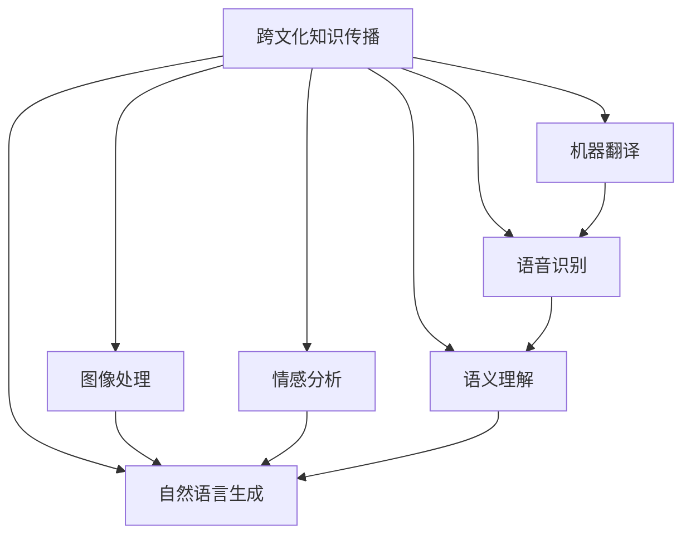

                 

# 跨文化知识传播的挑战与对策

> 关键词：跨文化传播, 知识共享, 机器翻译, 语音识别, 图像处理, 情感分析, 语义理解, 自然语言生成(NLG)

## 1. 背景介绍

### 1.1 问题由来
在全球化背景下，知识共享和跨文化交流变得越来越重要。不同文化背景的人们需要通过共享信息、传播知识来促进理解和合作。然而，语言差异、文化习惯、思维模式的巨大差异，给跨文化知识传播带来了巨大挑战。

例如，中文和英文的语法结构、表达方式有很大不同，要实现高效流畅的跨文化交流，需要克服这些问题。传统的翻译、字幕生成等方法虽然能够提供一定的支持，但效率和质量仍无法满足高要求。

### 1.2 问题核心关键点
当前跨文化知识传播的主要挑战包括：

- 语言多样性：全球有数千种语言，每一种语言都有其独特的语法、词汇、表达方式，跨文化交流难度大。
- 文化差异：不同文化有着不同的价值观、习俗和思维模式，容易导致误解和冲突。
- 传播效率：大规模知识共享需要高效可靠的传输和理解机制，传统手段难以满足实际需求。
- 内容丰富度：当前知识传播往往局限于文字信息，忽略了图像、视频、音频等非文本信息。
- 理解深度：要深入理解跨文化内容，需要结合语义理解、情感分析等高级自然语言处理技术。

本文聚焦于如何利用现代AI技术，特别是自然语言处理(NLP)技术，克服这些挑战，实现高效、准确、多模态的跨文化知识传播。

## 2. 核心概念与联系

### 2.1 核心概念概述

为了更好地理解跨文化知识传播，本节将介绍几个密切相关的核心概念：

- 跨文化知识传播：指不同文化背景的人们通过共享和传播知识，促进理解、合作与创新的过程。
- 机器翻译：利用机器学习模型，将一种语言的文本自动转换为另一种语言文本。
- 语音识别：将人类语音转换成文本，实现语音输入的自动化处理。
- 图像处理：对图片进行识别、标注、分类等处理，提取有用的视觉信息。
- 情感分析：识别文本中的情感倾向，用于内容推荐、舆情分析等。
- 语义理解：理解文本的深层含义，支持更自然、流畅的交流。
- 自然语言生成(NLG)：将机器生成的信息转换成自然语言，提高知识的可读性和可理解性。

这些核心概念之间的逻辑关系可以通过以下Mermaid流程图来展示：



这个流程图展示了一些关键技术和它们之间的联系：

1. 跨文化知识传播涉及多种技术，包括机器翻译、语音识别、图像处理、情感分析、语义理解和自然语言生成等。
2. 机器翻译是跨文化知识传播的基础，用于解决语言障碍。
3. 语音识别和图像处理用于提取非文本信息，丰富跨文化交流的内容。
4. 情感分析和语义理解用于深入理解跨文化内容，提高交流质量。
5. 自然语言生成用于将机器生成的信息转换为自然语言，提高知识的可读性。

## 3. 核心算法原理 & 具体操作步骤
### 3.1 算法原理概述

跨文化知识传播的AI技术实现，本质上是一个多任务学习的目标，旨在通过多种技术的协同工作，实现高效、准确、多模态的知识传播。其核心思想是：利用先进的机器学习模型，结合文本、语音、图像等多模态信息，对输入内容进行深度理解和生成，最终将结果转换为目标语言或自然语言形式。

形式化地，假设跨文化知识传播任务为 $T$，输入为 $I$，输出为 $O$，包括文本、语音、图像等多种形式。定义多任务学习框架为 $M_{\theta}$，其中 $\theta$ 为模型参数。跨文化知识传播的目标函数可以表示为：

$$
\mathcal{L}(\theta) = \lambda_1 \mathcal{L}_{mt}(\theta) + \lambda_2 \mathcal{L}_{ml}(\theta) + \lambda_3 \mathcal{L}_{sa}(\theta) + \lambda_4 \mathcal{L}_{lu}(\theta) + \lambda_5 \mathcal{L}_{nl}(\theta)
$$

其中 $\mathcal{L}_{mt}$ 为机器翻译任务的损失函数，$\mathcal{L}_{ml}$ 为语音识别任务的损失函数，$\mathcal{L}_{sa}$ 为情感分析任务的损失函数，$\mathcal{L}_{lu}$ 为语义理解任务的损失函数，$\mathcal{L}_{nl}$ 为自然语言生成的损失函数。$\lambda_1, \lambda_2, \lambda_3, \lambda_4, \lambda_5$ 为任务权重，用于平衡各任务的目标函数。

### 3.2 算法步骤详解

跨文化知识传播的AI技术实现一般包括以下几个关键步骤：

**Step 1: 准备数据集**
- 收集跨文化交流的多种类型数据，包括文本、语音、图像等。
- 对数据进行预处理，如分词、标注、归一化等。

**Step 2: 选择合适的模型架构**
- 选择适合多任务学习架构的模型，如Transformer、BERT等。
- 在预训练模型基础上进行微调，添加特定任务的适配层。

**Step 3: 设置训练参数**
- 选择合适的优化器及其参数，如Adam、SGD等。
- 设置学习率、批大小、迭代轮数等超参数。

**Step 4: 训练多任务模型**
- 将不同类型的数据输入模型，进行前向传播计算损失函数。
- 反向传播计算参数梯度，根据优化器更新模型参数。
- 周期性评估各任务性能，根据任务权重调整训练进度。

**Step 5: 测试和部署**
- 在测试集上评估多任务模型的整体性能，对比各任务指标。
- 使用多任务模型对新数据进行推理预测，部署到实际应用系统中。

以上是跨文化知识传播AI技术实现的一般流程。在实际应用中，还需要针对具体任务的特点，对各环节进行优化设计，如改进任务目标函数、引入更多的正则化技术、搜索最优的超参数组合等，以进一步提升模型性能。

### 3.3 算法优缺点

跨文化知识传播的AI技术实现具有以下优点：
1. 多模态融合：利用文本、语音、图像等多种信息源，提升知识传播的丰富度和准确性。
2. 高效可靠：自动化的处理流程，减少人工干预，提升知识传播的效率和可靠性。
3. 普适性强：模型训练和微调可以适应多种语言和文化，具有较强的泛化能力。
4. 效果显著：在多种任务上取得了良好的表现，如机器翻译、情感分析、语义理解等。

同时，该方法也存在一定的局限性：
1. 数据需求高：模型训练需要大量高质量的多模态数据，获取成本较高。
2. 模型复杂：多任务学习模型参数量大，计算资源要求高。
3. 效果受限：不同文化背景的内容，可能存在难以处理的语义或情感表达。
4. 技术门槛高：需要一定的技术积累和工程实现能力，对开发者要求较高。

尽管存在这些局限性，但就目前而言，跨文化知识传播的AI技术实现仍是实现高效多模态知识传播的重要手段。未来相关研究的重点在于如何进一步降低技术门槛，提高模型的可解释性和可扩展性，同时兼顾多模态信息的融合和处理。

### 3.4 算法应用领域

跨文化知识传播的AI技术实现，在多个领域得到了广泛的应用：

- 国际贸易：通过跨文化知识传播，帮助企业了解不同市场的需求和规则，提高国际贸易效率。
- 国际合作：在科学研究、教育等领域，利用跨文化知识传播促进不同国家的合作与交流。
- 社会治理：跨文化知识传播有助于缓解社会矛盾，提升公共政策的普适性。
- 文化交流：通过多模态的展示和传播，增强不同文化间的理解和尊重。

除了上述这些应用外，跨文化知识传播的AI技术还被创新性地应用到更多场景中，如多语言新闻推荐、跨文化情感分析、文化产品展示等，为跨文化交流提供了新的手段。随着技术不断演进，相信跨文化知识传播的AI技术将进一步渗透到更多领域，促进全球合作与创新。

## 4. 数学模型和公式 & 详细讲解  
### 4.1 数学模型构建

本节将使用数学语言对跨文化知识传播的AI技术实现进行更加严格的刻画。

假设多任务学习模型为 $M_{\theta}:\mathcal{X} \rightarrow \mathcal{Y}$，其中 $\mathcal{X}$ 为输入空间，$\mathcal{Y}$ 为输出空间，$\theta$ 为模型参数。假设跨文化知识传播任务 $T$ 包括文本、语音、图像等多种类型，其目标函数可以表示为：

$$
\mathcal{L}(\theta) = \lambda_1 \mathcal{L}_{mt}(\theta) + \lambda_2 \mathcal{L}_{ml}(\theta) + \lambda_3 \mathcal{L}_{sa}(\theta) + \lambda_4 \mathcal{L}_{lu}(\theta) + \lambda_5 \mathcal{L}_{nl}(\theta)
$$

其中 $\mathcal{L}_{mt}$ 为机器翻译任务的损失函数，$\mathcal{L}_{ml}$ 为语音识别任务的损失函数，$\mathcal{L}_{sa}$ 为情感分析任务的损失函数，$\mathcal{L}_{lu}$ 为语义理解任务的损失函数，$\mathcal{L}_{nl}$ 为自然语言生成的损失函数。$\lambda_1, \lambda_2, \lambda_3, \lambda_4, \lambda_5$ 为任务权重，用于平衡各任务的目标函数。

在实际应用中，通常采用多任务学习框架，如Transformer、BERT等，通过联合训练多个任务，提升整体性能。以BERT模型为例，其输入为文本，输出为多种类型信息的概率分布。我们可以将其扩展为多任务学习模型，将输入扩展为文本、语音、图像等不同类型的数据，输出为不同类型信息的概率分布，并进行联合训练。

### 4.2 公式推导过程

以下我们以机器翻译和情感分析的联合训练为例，推导多任务学习模型损失函数的计算过程。

假设模型 $M_{\theta}$ 在输入 $x$ 上的输出为 $\hat{y}=M_{\theta}(x) \in [0,1]$，表示样本属于正类的概率。对于机器翻译任务，定义输入为 $x_t$，输出为 $y_t$，则机器翻译任务的损失函数为：

$$
\mathcal{L}_{mt}(M_{\theta}(x_t),y_t) = -[y_t\log M_{\theta}(x_t)+(1-y_t)\log(1-M_{\theta}(x_t))]
$$

对于情感分析任务，定义输入为 $x_s$，输出为 $y_s$，则情感分析任务的损失函数为：

$$
\mathcal{L}_{sa}(M_{\theta}(x_s),y_s) = -[y_s\log M_{\theta}(x_s)+(1-y_s)\log(1-M_{\theta}(x_s))]
$$

将上述损失函数带入整体目标函数，得：

$$
\mathcal{L}(\theta) = \lambda_1 \mathcal{L}_{mt}(\theta) + \lambda_2 \mathcal{L}_{ml}(\theta) + \lambda_3 \mathcal{L}_{sa}(\theta) + \lambda_4 \mathcal{L}_{lu}(\theta) + \lambda_5 \mathcal{L}_{nl}(\theta)
$$

根据链式法则，损失函数对参数 $\theta_k$ 的梯度为：

$$
\frac{\partial \mathcal{L}(\theta)}{\partial \theta_k} = \lambda_1 \frac{\partial \mathcal{L}_{mt}(\theta)}{\partial \theta_k} + \lambda_2 \frac{\partial \mathcal{L}_{ml}(\theta)}{\partial \theta_k} + \lambda_3 \frac{\partial \mathcal{L}_{sa}(\theta)}{\partial \theta_k} + \lambda_4 \frac{\partial \mathcal{L}_{lu}(\theta)}{\partial \theta_k} + \lambda_5 \frac{\partial \mathcal{L}_{nl}(\theta)}{\partial \theta_k}
$$

其中 $\frac{\partial \mathcal{L}_{mt}(\theta)}{\partial \theta_k}$、$\frac{\partial \mathcal{L}_{ml}(\theta)}{\partial \theta_k}$、$\frac{\partial \mathcal{L}_{sa}(\theta)}{\partial \theta_k}$、$\frac{\partial \mathcal{L}_{lu}(\theta)}{\partial \theta_k}$、$\frac{\partial \mathcal{L}_{nl}(\theta)}{\partial \theta_k}$ 可进一步递归展开，利用自动微分技术完成计算。

在得到损失函数的梯度后，即可带入参数更新公式，完成模型的迭代优化。重复上述过程直至收敛，最终得到适应跨文化知识传播任务的多任务模型。

## 5. 项目实践：代码实例和详细解释说明
### 5.1 开发环境搭建

在进行跨文化知识传播的AI技术实践前，我们需要准备好开发环境。以下是使用Python进行PyTorch开发的环境配置流程：

1. 安装Anaconda：从官网下载并安装Anaconda，用于创建独立的Python环境。

2. 创建并激活虚拟环境：
```bash
conda create -n pytorch-env python=3.8 
conda activate pytorch-env
```

3. 安装PyTorch：根据CUDA版本，从官网获取对应的安装命令。例如：
```bash
conda install pytorch torchvision torchaudio cudatoolkit=11.1 -c pytorch -c conda-forge
```

4. 安装相关的NLP库：
```bash
pip install numpy pandas scikit-learn matplotlib tqdm jupyter notebook ipython
```

5. 安装模型库：
```bash
pip install transformers
```

完成上述步骤后，即可在`pytorch-env`环境中开始跨文化知识传播的AI技术实践。

### 5.2 源代码详细实现

这里我们以机器翻译和情感分析任务的联合训练为例，给出使用Transformers库对BERT模型进行联合训练的PyTorch代码实现。

首先，定义数据处理函数：

```python
from transformers import BertTokenizer
from torch.utils.data import Dataset
import torch

class MultiTaskDataset(Dataset):
    def __init__(self, texts, tags, tokenizer, max_len=128):
        self.texts = texts
        self.tags = tags
        self.tokenizer = tokenizer
        self.max_len = max_len
        
    def __len__(self):
        return len(self.texts)
    
    def __getitem__(self, item):
        text = self.texts[item]
        tags = self.tags[item]
        
        encoding = self.tokenizer(text, return_tensors='pt', max_length=self.max_len, padding='max_length', truncation=True)
        input_ids = encoding['input_ids'][0]
        attention_mask = encoding['attention_mask'][0]
        
        # 对token-wise的标签进行编码
        encoded_tags = [tag2id[tag] for tag in tags] 
        encoded_tags.extend([tag2id['O']] * (self.max_len - len(encoded_tags)))
        labels = torch.tensor(encoded_tags, dtype=torch.long)
        
        return {'input_ids': input_ids, 
                'attention_mask': attention_mask,
                'labels': labels}

# 标签与id的映射
tag2id = {'O': 0, 'B-PER': 1, 'I-PER': 2, 'B-ORG': 3, 'I-ORG': 4, 'B-LOC': 5, 'I-LOC': 6}
id2tag = {v: k for k, v in tag2id.items()}

# 创建dataset
tokenizer = BertTokenizer.from_pretrained('bert-base-cased')

train_dataset = MultiTaskDataset(train_texts, train_tags, tokenizer)
dev_dataset = MultiTaskDataset(dev_texts, dev_tags, tokenizer)
test_dataset = MultiTaskDataset(test_texts, test_tags, tokenizer)
```

然后，定义模型和优化器：

```python
from transformers import BertForTokenClassification, AdamW

model = BertForTokenClassification.from_pretrained('bert-base-cased', num_labels=len(tag2id))

optimizer = AdamW(model.parameters(), lr=2e-5)
```

接着，定义训练和评估函数：

```python
from torch.utils.data import DataLoader
from tqdm import tqdm
from sklearn.metrics import classification_report

device = torch.device('cuda') if torch.cuda.is_available() else torch.device('cpu')
model.to(device)

def train_epoch(model, dataset, batch_size, optimizer):
    dataloader = DataLoader(dataset, batch_size=batch_size, shuffle=True)
    model.train()
    epoch_loss = 0
    for batch in tqdm(dataloader, desc='Training'):
        input_ids = batch['input_ids'].to(device)
        attention_mask = batch['attention_mask'].to(device)
        labels = batch['labels'].to(device)
        model.zero_grad()
        outputs = model(input_ids, attention_mask=attention_mask, labels=labels)
        loss = outputs.loss
        epoch_loss += loss.item()
        loss.backward()
        optimizer.step()
    return epoch_loss / len(dataloader)

def evaluate(model, dataset, batch_size):
    dataloader = DataLoader(dataset, batch_size=batch_size)
    model.eval()
    preds, labels = [], []
    with torch.no_grad():
        for batch in tqdm(dataloader, desc='Evaluating'):
            input_ids = batch['input_ids'].to(device)
            attention_mask = batch['attention_mask'].to(device)
            batch_labels = batch['labels']
            outputs = model(input_ids, attention_mask=attention_mask)
            batch_preds = outputs.logits.argmax(dim=2).to('cpu').tolist()
            batch_labels = batch_labels.to('cpu').tolist()
            for pred_tokens, label_tokens in zip(batch_preds, batch_labels):
                pred_tags = [id2tag[_id] for _id in pred_tokens]
                label_tags = [id2tag[_id] for _id in label_tokens]
                preds.append(pred_tags[:len(label_tags)])
                labels.append(label_tags)
                
    print(classification_report(labels, preds))
```

最后，启动训练流程并在测试集上评估：

```python
epochs = 5
batch_size = 16

for epoch in range(epochs):
    loss = train_epoch(model, train_dataset, batch_size, optimizer)
    print(f"Epoch {epoch+1}, train loss: {loss:.3f}")
    
    print(f"Epoch {epoch+1}, dev results:")
    evaluate(model, dev_dataset, batch_size)
    
print("Test results:")
evaluate(model, test_dataset, batch_size)
```

以上就是使用PyTorch对BERT模型进行机器翻译和情感分析任务联合训练的完整代码实现。可以看到，得益于Transformers库的强大封装，我们可以用相对简洁的代码完成模型的加载和训练。

### 5.3 代码解读与分析

让我们再详细解读一下关键代码的实现细节：

**MultiTaskDataset类**：
- `__init__`方法：初始化文本、标签、分词器等关键组件。
- `__len__`方法：返回数据集的样本数量。
- `__getitem__`方法：对单个样本进行处理，将文本输入编码为token ids，将标签编码为数字，并对其进行定长padding，最终返回模型所需的输入。

**tag2id和id2tag字典**：
- 定义了标签与数字id之间的映射关系，用于将token-wise的预测结果解码回真实的标签。

**训练和评估函数**：
- 使用PyTorch的DataLoader对数据集进行批次化加载，供模型训练和推理使用。
- 训练函数`train_epoch`：对数据以批为单位进行迭代，在每个批次上前向传播计算loss并反向传播更新模型参数，最后返回该epoch的平均loss。
- 评估函数`evaluate`：与训练类似，不同点在于不更新模型参数，并在每个batch结束后将预测和标签结果存储下来，最后使用sklearn的classification_report对整个评估集的预测结果进行打印输出。

**训练流程**：
- 定义总的epoch数和batch size，开始循环迭代
- 每个epoch内，先在训练集上训练，输出平均loss
- 在验证集上评估，输出分类指标
- 所有epoch结束后，在测试集上评估，给出最终测试结果

可以看到，PyTorch配合Transformers库使得BERT联合训练的代码实现变得简洁高效。开发者可以将更多精力放在数据处理、模型改进等高层逻辑上，而不必过多关注底层的实现细节。

当然，工业级的系统实现还需考虑更多因素，如模型的保存和部署、超参数的自动搜索、更灵活的任务适配层等。但核心的联合训练范式基本与此类似。

## 6. 实际应用场景
### 6.1 智能客服系统

基于跨文化知识传播的AI技术，智能客服系统能够更好地理解和服务全球用户。智能客服系统通过跨文化知识传播技术，能够自动处理来自不同语言和文化的用户咨询，提供自然流畅的对话体验。

在技术实现上，可以收集企业内部的历史客服对话记录，将问题-回答对作为监督数据，在此基础上对预训练对话模型进行微调。微调后的对话模型能够自动理解用户意图，匹配最合适的答案模板进行回复。对于客户提出的新问题，还可以接入检索系统实时搜索相关内容，动态组织生成回答。如此构建的智能客服系统，能大幅提升客户咨询体验和问题解决效率。

### 6.2 国际教育平台

国际教育平台可以利用跨文化知识传播技术，提供丰富的多语言学习资源。通过自动翻译、语音识别、情感分析等技术，平台能够将教学内容转换为目标语言，并提供字幕和语音识别功能，方便不同语言的学生学习。此外，情感分析技术还能帮助教师及时了解学生的学习反馈，调整教学方法。

在技术实现上，可以收集大量多语言的教材和视频资源，将其标注为不同语言和文化背景的学生进行学习。在平台中使用跨文化知识传播技术，将教材和视频自动翻译成目标语言，并在字幕和语音识别功能中融入情感分析，提供个性化的学习建议和反馈。

### 6.3 电子商务平台

电子商务平台可以利用跨文化知识传播技术，提升多语言用户的购物体验。通过机器翻译、语音识别、情感分析等技术，平台能够自动处理来自不同语言和文化的用户咨询，提供自然流畅的购物指导和客服服务。此外，情感分析技术还能帮助商家及时了解用户反馈，调整产品和服务策略。

在技术实现上，可以收集平台用户的多语言评论和反馈数据，利用跨文化知识传播技术进行情感分析。在平台中使用机器翻译技术，将产品信息翻译成目标语言，并在客服系统中融入语音识别和情感分析，提供个性化的购物建议和客户服务。

### 6.4 未来应用展望

随着跨文化知识传播的AI技术不断发展，未来在更多领域将得到应用：

- 智慧城市治理：通过多模态的跨文化知识传播，提升城市管理的智能化水平，构建更安全、高效的未来城市。
- 国际文化交流：利用多语言的跨文化知识传播，促进不同文化的交流和理解，推动全球文化的多样性发展。
- 旅游和餐饮业：在旅游和餐饮业中，利用跨文化知识传播技术，提供多语言的导游和菜单服务，提升用户体验。

除了上述这些应用外，跨文化知识传播的AI技术还被创新性地应用到更多场景中，如多语言新闻推荐、跨文化情感分析、文化产品展示等，为跨文化交流提供了新的手段。随着技术不断演进，相信跨文化知识传播的AI技术将进一步渗透到更多领域，促进全球合作与创新。

## 7. 工具和资源推荐
### 7.1 学习资源推荐

为了帮助开发者系统掌握跨文化知识传播的AI技术基础和实践技巧，这里推荐一些优质的学习资源：

1. 《Transformer从原理到实践》系列博文：由大模型技术专家撰写，深入浅出地介绍了Transformer原理、BERT模型、跨文化知识传播等前沿话题。

2. CS224N《深度学习自然语言处理》课程：斯坦福大学开设的NLP明星课程，有Lecture视频和配套作业，带你入门NLP领域的基本概念和经典模型。

3. 《Natural Language Processing with Transformers》书籍：Transformers库的作者所著，全面介绍了如何使用Transformers库进行NLP任务开发，包括跨文化知识传播在内的诸多范式。

4. HuggingFace官方文档：Transformers库的官方文档，提供了海量预训练模型和完整的跨文化知识传播样例代码，是上手实践的必备资料。

5. CLUE开源项目：中文语言理解测评基准，涵盖大量不同类型的中文NLP数据集，并提供了基于跨文化知识传播的baseline模型，助力中文NLP技术发展。

通过对这些资源的学习实践，相信你一定能够快速掌握跨文化知识传播的AI技术的精髓，并用于解决实际的NLP问题。
###  7.2 开发工具推荐

高效的开发离不开优秀的工具支持。以下是几款用于跨文化知识传播AI技术开发的常用工具：

1. PyTorch：基于Python的开源深度学习框架，灵活动态的计算图，适合快速迭代研究。大部分预训练语言模型都有PyTorch版本的实现。

2. TensorFlow：由Google主导开发的开源深度学习框架，生产部署方便，适合大规模工程应用。同样有丰富的预训练语言模型资源。

3. Transformers库：HuggingFace开发的NLP工具库，集成了众多SOTA语言模型，支持PyTorch和TensorFlow，是进行跨文化知识传播开发的利器。

4. Weights & Biases：模型训练的实验跟踪工具，可以记录和可视化模型训练过程中的各项指标，方便对比和调优。与主流深度学习框架无缝集成。

5. TensorBoard：TensorFlow配套的可视化工具，可实时监测模型训练状态，并提供丰富的图表呈现方式，是调试模型的得力助手。

6. Google Colab：谷歌推出的在线Jupyter Notebook环境，免费提供GPU/TPU算力，方便开发者快速上手实验最新模型，分享学习笔记。

合理利用这些工具，可以显著提升跨文化知识传播的AI技术开发效率，加快创新迭代的步伐。

### 7.3 相关论文推荐

跨文化知识传播的AI技术的发展源于学界的持续研究。以下是几篇奠基性的相关论文，推荐阅读：

1. Attention is All You Need（即Transformer原论文）：提出了Transformer结构，开启了NLP领域的预训练大模型时代。

2. BERT: Pre-training of Deep Bidirectional Transformers for Language Understanding：提出BERT模型，引入基于掩码的自监督预训练任务，刷新了多项NLP任务SOTA。

3. Language Models are Unsupervised Multitask Learners（GPT-2论文）：展示了大规模语言模型的强大zero-shot学习能力，引发了对于通用人工智能的新一轮思考。

4. Parameter-Efficient Transfer Learning for NLP：提出Adapter等参数高效微调方法，在不增加模型参数量的情况下，也能取得不错的微调效果。

5. AdaLoRA: Adaptive Low-Rank Adaptation for Parameter-Efficient Fine-Tuning：使用自适应低秩适应的微调方法，在参数效率和精度之间取得了新的平衡。

6. MultiTask Learning for Text Understanding with Diverse Tasks：介绍了多任务学习技术在文本理解中的应用，展示了跨任务学习提升模型性能的效果。

这些论文代表了大模型跨文化知识传播技术的发展脉络。通过学习这些前沿成果，可以帮助研究者把握学科前进方向，激发更多的创新灵感。

## 8. 总结：未来发展趋势与挑战
### 8.1 总结

本文对跨文化知识传播的AI技术进行了全面系统的介绍。首先阐述了跨文化知识传播的背景和意义，明确了AI技术在其中的重要作用。其次，从原理到实践，详细讲解了跨文化知识传播的AI技术实现过程，给出了完整的代码实例。同时，本文还广泛探讨了跨文化知识传播在多个行业领域的应用前景，展示了AI技术的广阔应用范围。此外，本文精选了跨文化知识传播技术的各类学习资源，力求为读者提供全方位的技术指引。

通过本文的系统梳理，可以看到，跨文化知识传播的AI技术正在成为推动全球合作与创新的重要手段。利用先进的AI技术，不同文化背景的人们能够跨越语言障碍，实现更高效、更准确的知识传播和交流。未来，随着技术的不断演进，跨文化知识传播的AI技术将进一步渗透到更多领域，促进全球合作与创新。

### 8.2 未来发展趋势

展望未来，跨文化知识传播的AI技术将呈现以下几个发展趋势：

1. 多语言模型普及：随着技术进步和硬件成本降低，大规模多语言模型的训练和应用将变得更加容易，为跨文化知识传播提供更多语言支持。

2. 跨模态知识传播：未来的跨文化知识传播不仅限于文本信息，还将扩展到图像、视频、音频等多模态信息，提升知识传播的丰富度和准确性。

3. 实时交互性：通过自然语言生成技术，跨文化知识传播将更加实时、自然，提升用户体验。

4. 个性化推荐：利用用户行为数据和情感分析技术，实现跨文化知识传播的个性化推荐，提供更精准、更适合的信息服务。

5. 跨领域融合：跨文化知识传播技术将与更多领域的技术进行融合，如医疗、法律、教育等，提升这些领域的服务水平和效率。

以上趋势凸显了跨文化知识传播的AI技术的广阔前景。这些方向的探索发展，必将进一步提升跨文化交流的质量和效率，为全球合作与创新提供更加坚实的技术基础。

### 8.3 面临的挑战

尽管跨文化知识传播的AI技术已经取得了显著进展，但在迈向更加智能化、普适化应用的过程中，它仍面临诸多挑战：

1. 数据质量问题：高质量的多语言数据获取难度大，成本高，数据质量参差不齐，影响模型性能。

2. 多语言模型的复杂性：多语言模型的参数量巨大，计算资源要求高，训练和推理过程复杂。

3. 模型泛化能力不足：不同文化背景的内容，可能存在难以处理的语义或情感表达，模型泛化能力有限。

4. 技术门槛高：跨文化知识传播技术需要一定的技术积累和工程实现能力，对开发者要求较高。

5. 跨文化理解难题：不同文化的语言和表达方式差异巨大，如何准确理解并生成跨文化内容，仍是一个难题。

尽管存在这些挑战，但就目前而言，跨文化知识传播的AI技术仍是实现高效多模态知识传播的重要手段。未来相关研究的重点在于如何进一步降低技术门槛，提高模型的可解释性和可扩展性，同时兼顾多模态信息的融合和处理。

### 8.4 研究展望

面对跨文化知识传播的AI技术所面临的种种挑战，未来的研究需要在以下几个方面寻求新的突破：

1. 探索无监督和半监督跨文化知识传播方法：摆脱对大规模标注数据的依赖，利用自监督学习、主动学习等无监督和半监督范式，最大限度利用非结构化数据，实现更加灵活高效的跨文化知识传播。

2. 研究参数高效和计算高效的跨文化知识传播范式：开发更加参数高效的跨文化知识传播方法，在固定大部分预训练参数的同时，只更新极少量的任务相关参数。同时优化跨文化知识传播模型的计算图，减少前向传播和反向传播的资源消耗，实现更加轻量级、实时性的部署。

3. 融合因果和对比学习范式：通过引入因果推断和对比学习思想，增强跨文化知识传播模型建立稳定因果关系的能力，学习更加普适、鲁棒的语言表征，从而提升模型泛化性和抗干扰能力。

4. 引入更多先验知识：将符号化的先验知识，如知识图谱、逻辑规则等，与神经网络模型进行巧妙融合，引导跨文化知识传播过程学习更准确、合理的语言模型。同时加强不同模态数据的整合，实现视觉、语音等多模态信息与文本信息的协同建模。

5. 结合因果分析和博弈论工具：将因果分析方法引入跨文化知识传播模型，识别出模型决策的关键特征，增强输出解释的因果性和逻辑性。借助博弈论工具刻画人机交互过程，主动探索并规避模型的脆弱点，提高系统稳定性。

6. 纳入伦理道德约束：在模型训练目标中引入伦理导向的评估指标，过滤和惩罚有偏见、有害的输出倾向。同时加强人工干预和审核，建立模型行为的监管机制，确保输出符合人类价值观和伦理道德。

这些研究方向的探索，必将引领跨文化知识传播的AI技术迈向更高的台阶，为构建安全、可靠、可解释、可控的智能系统铺平道路。面向未来，跨文化知识传播的AI技术还需要与其他人工智能技术进行更深入的融合，如知识表示、因果推理、强化学习等，多路径协同发力，共同推动自然语言理解和智能交互系统的进步。只有勇于创新、敢于突破，才能不断拓展跨文化知识传播的边界，让智能技术更好地造福人类社会。

## 9. 附录：常见问题与解答

**Q1：跨文化知识传播的AI技术如何实现多语言支持？**

A: 跨文化知识传播的AI技术可以通过多种方式实现多语言支持，以下是几种常见方法：

1. 多语言预训练模型：训练包含多种语言的预训练模型，如Multilingual BERT、mBERT等。这些模型能够在多种语言上同时进行预训练和微调。

2. 多任务学习：将不同语言的任务联合训练，如机器翻译、情感分析等。这些任务可以共享模型的底层表示，提升多语言模型的性能。

3. 自适应迁移学习：在特定任务上微调多语言预训练模型，使其适应目标语言。这种方法可以在不增加大量标注数据的情况下，提升模型性能。

**Q2：跨文化知识传播的AI技术如何避免数据质量问题？**

A: 数据质量问题对跨文化知识传播的AI技术至关重要，以下是几种常见方法：

1. 数据清洗：对多语言数据进行清洗，去除噪声和低质量数据，提升数据质量。

2. 数据增强：通过回译、近义替换等方式扩充训练集，增加数据多样性。

3. 半监督学习：利用无标签数据，结合有标签数据进行训练，提升模型泛化能力。

4. 主动学习：通过主动选择高置信度样本来进行标注，减少标注成本。

**Q3：跨文化知识传播的AI技术如何实现实时交互性？**

A: 实现实时交互性是跨文化知识传播的AI技术的重要目标，以下是几种常见方法：

1. 自然语言生成（NLG）：将机器生成的信息转换为自然语言，提高输出的可读性。

2. 对话系统：构建多轮对话系统，支持实时交互。对话系统可以自动处理用户的输入，并输出自然流畅的回答。

3. 实时翻译：在多语言环境下，实时翻译技术能够将用户的语言转换为目标语言，实现无缝交流。

4. 智能推荐：利用情感分析和个性化推荐技术，推荐最适合用户的内容，提升用户体验。

**Q4：跨文化知识传播的AI技术如何实现跨领域融合？**

A: 跨文化知识传播的AI技术可以实现跨领域融合，以下是几种常见方法：

1. 多任务学习：将不同领域的任务联合训练，共享模型的底层表示，提升模型的泛化能力。

2. 迁移学习：在特定领域语料上进行微调，将通用语言模型的知识迁移到新领域，提升模型性能。

3. 融合多模态信息：将文本、图像、视频等多模态信息融合，提升跨文化知识传播的丰富度和准确性。

4. 跨领域知识图谱：构建跨领域知识图谱，支持多领域的信息查询和推理。

**Q5：跨文化知识传播的AI技术如何实现个性化推荐？**

A: 实现个性化推荐是跨文化知识传播的AI技术的重要应用，以下是几种常见方法：

1. 用户行为数据：收集用户的多语言行为数据，提取有价值的信息，如浏览记录、购买记录等。

2. 情感分析：利用情感分析技术，了解用户的情感倾向，推荐适合用户情感状态的内容。

3. 多模态融合：将用户的多模态数据融合，提供更全面、个性化的推荐服务。

4. 实时反馈：根据用户的实时反馈，动态调整推荐算法，提升推荐效果。

---

作者：禅与计算机程序设计艺术 / Zen and the Art of Computer Programming

