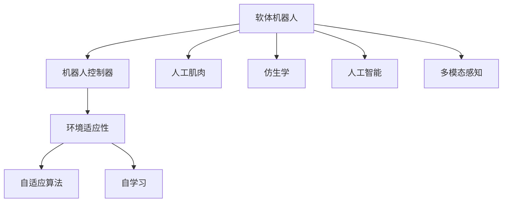

                 

# 软体机器人技术：适应复杂环境的新型机器人

> 关键词：软体机器人,机器人控制,环境适应性,自适应算法,自学习,人工肌肉,仿生学,人工智能,多模态感知

## 1. 背景介绍

### 1.1 问题由来
软体机器人是近年来机器人技术领域的一大热门研究方向。相比于传统的刚性机器人，软体机器人在形态、性能和适应性上具有显著优势，能够适应更多复杂的自然和人工环境，尤其在柔软、易损、不规则的空间中，展现出独特的潜力。

软体机器人主要特点包括：

- 高适应性：可以适应不同形状和体积的空间。
- 高柔性：可以在动态环境中变形，提高机械臂的灵活性和可操作性。
- 高安全性：柔性材料降低了机械臂的碰撞风险。
- 高冗余度：可操作关节数量多，适合于复杂的机械操作。

随着柔性传感器、执行器和人工智能等技术的快速发展，软体机器人已从实验室走向实际应用，如医疗、农业、环保、安防等领域。然而，现有软体机器人技术仍面临许多挑战：如建模复杂、控制器设计难度大、环境适应性不足等问题。因此，软体机器人技术需要进一步创新，提升其智能化水平和环境适应性。

### 1.2 问题核心关键点
本文聚焦于软体机器人的环境适应性和智能化控制问题。软体机器人的环境适应性主要体现在如何使得机器人能够自主地适应不同环境，自动调整机械臂形态和运动策略。智能化控制则涉及机器学习、自适应算法等，以实现更为高效、灵活的机械臂操作。

本文通过分析软体机器人技术的研究背景和关键点，阐述软体机器人技术的最新进展和应用前景，并结合实际案例展示软体机器人技术在不同场景中的应用。

## 2. 核心概念与联系

### 2.1 核心概念概述

为更好地理解软体机器人技术的原理和架构，本节将介绍几个核心概念：

- 软体机器人(Soft Robotics)：一种使用柔性材料和柔性执行器，通过机器人控制器实现自驱动和自主操作的机器人技术。
- 机器人控制器(Robot Controller)：控制软体机器人机械臂动作的算法和软件，是软体机器人智能化和环境适应性的核心。
- 环境适应性(Environment Adaptability)：指软体机器人在复杂环境中的自主适应能力，包括形态自适应、运动自适应、感知自适应等。
- 自适应算法(Adaptive Algorithm)：一种能够在运行过程中自动调整参数，以适应环境变化的算法。
- 自学习(Self-Learning)：指软体机器人在实际环境中通过数据驱动的方式进行自主学习，不断优化自身行为。
- 人工肌肉(Actuators)：用于驱动软体机器人的柔性执行器，如电致伸缩材料、形状记忆合金等。
- 仿生学(Biomimetics)：借鉴生物系统原理设计软体机器人的学科，如仿生肌肉、仿生神经系统等。
- 人工智能(AI)：结合人工智能技术，使软体机器人具备自主感知、推理和决策能力。
- 多模态感知(Multimodal Perception)：通过融合视觉、听觉、触觉等多种感知信息，提高软体机器人的智能水平。

这些核心概念之间的逻辑关系可以通过以下Mermaid流程图来展示：



这个流程图展示了一部分核心概念及其之间的关系：

1. 软体机器人通过人工肌肉和控制器实现机械臂动作。
2. 控制器利用环境适应性、自适应算法、自学习等技术，提升机器人的自主性和智能性。
3. 仿生学、人工智能和多模态感知为机器人控制器提供了更多的设计灵感和工具。

## 3. 核心算法原理 & 具体操作步骤
### 3.1 算法原理概述

软体机器人技术的核心算法原理主要包括：

- 柔体动力学建模：用于建立软体机器人在不同环境中的运动模型，是环境适应性的基础。
- 自适应控制：通过自适应算法和策略，在实际环境中调整机械臂动作。
- 多模态感知：融合视觉、触觉、听觉等多种感知信息，提高机器人对环境的理解能力。
- 学习与优化：利用机器学习算法和优化技术，提升机器人的智能化水平和性能。

这些算法原理构成了一个复杂的系统，需要从不同角度进行综合考虑。

### 3.2 算法步骤详解

软体机器人的开发一般分为以下几个步骤：

**Step 1: 柔体动力学建模**
- 收集软体机器人在实际环境中的运动数据。
- 使用柔体动力学方程，对机器人的机械臂进行建模。
- 设计合适的柔体材料，并通过有限元分析等手段，验证模型的准确性。

**Step 2: 自适应控制**
- 选择合适的自适应算法，如PID控制、模型预测控制等。
- 对软体机器人的机械臂进行控制。
- 根据环境反馈，动态调整控制策略。

**Step 3: 多模态感知**
- 设计各种传感器，如摄像头、触觉传感器、声波传感器等，用于收集环境信息。
- 对传感器数据进行预处理和融合，提取环境特征。
- 使用深度学习等技术，训练感知模型。

**Step 4: 学习与优化**
- 利用机器学习算法，如强化学习、神经网络等，训练自学习模型。
- 对机器人的运动轨迹、感知模型等进行优化。
- 在实际环境中不断测试和迭代，提升机器人性能。

### 3.3 算法优缺点

软体机器人技术的优点包括：

- 适应性强：适用于各种复杂环境，具有高柔性和高安全性。
- 灵活性高：机械臂动作更加灵活，可操作性更强。
- 可靠性高：柔软的材料降低了碰撞风险，提高了系统的可靠性。

缺点主要包括：

- 建模复杂：柔体材料和复杂结构的动力学建模难度大。
- 控制复杂：自适应控制算法设计复杂，需要高效的计算资源。
- 数据需求高：自学习需要大量标注数据，训练和优化过程复杂。

### 3.4 算法应用领域

软体机器人技术已经在多个领域得到广泛应用，例如：

- 医疗手术：使用软体机器人进行微创手术、康复训练等，提高手术精度和安全性。
- 农业植保：使用软体机器人进行田间管理、病虫害防治等，提升农业生产效率。
- 环保监测：使用软体机器人进行水下探测、污染物收集等，提升环境保护水平。
- 安防巡逻：使用软体机器人进行安防巡逻、人员监控等，提升公共安全水平。
- 灾害救援：使用软体机器人进行灾害现场探测、搜救等，提升灾害响应速度。

这些应用展示了软体机器人技术的广泛前景和实际价值。未来，随着技术的不断进步，软体机器人将有望在更多领域发挥更大的作用。

## 4. 数学模型和公式 & 详细讲解 & 举例说明
### 4.1 数学模型构建

本节将使用数学语言对柔体机器人控制和环境适应性的基本模型进行介绍。

假设软体机器人的机械臂由$n$个节点和$m$个关节组成。每个节点$i$的位置向量为$\mathbf{r}_i$，每个关节的角速度向量为$\mathbf{\omega}_i$，则柔体动力学方程可以表示为：

$$
M(\mathbf{r}_i, \mathbf{\omega}_i) \ddot{\mathbf{r}}_i = \mathbf{f}_i(\mathbf{r}_i, \mathbf{\omega}_i) + \mathbf{u}_i
$$

其中：

- $M(\mathbf{r}_i, \mathbf{\omega}_i)$ 为节点$i$的惯性矩阵。
- $\mathbf{f}_i(\mathbf{r}_i, \mathbf{\omega}_i)$ 为节点$i$的弹性力。
- $\mathbf{u}_i$ 为节点$i$的驱动力。

自适应控制的目标是使机器人能够在不同环境条件下，自动调整机械臂的形态和动作，以适应环境变化。设机器人在$t$时刻的位置为$\mathbf{r}(t)$，目标位置为$\mathbf{r}^*(t)$，则控制目标可以表示为：

$$
\min_{\mathbf{u}} \| \mathbf{r}(t) - \mathbf{r}^*(t) \|
$$

自适应控制算法通常包含两个步骤：

1. 预测模型：使用历史数据和当前传感器数据，预测机器人位置。
2. 调整控制策略：根据预测结果，调整控制策略，使机器人达到目标位置。

### 4.2 公式推导过程

以下我们以PID控制器为例，推导自适应控制算法的公式。

PID控制器是一种常用的自适应控制算法，其控制目标为位置误差。设当前位置为$\mathbf{r}(t)$，目标位置为$\mathbf{r}^*(t)$，则位置误差$\mathbf{e}(t)$可以表示为：

$$
\mathbf{e}(t) = \mathbf{r}^*(t) - \mathbf{r}(t)
$$

PID控制器的控制律为：

$$
\mathbf{u}(t) = K_p \mathbf{e}(t) + K_i \int \mathbf{e}(t) dt + K_d \frac{d}{dt} \mathbf{e}(t)
$$

其中$K_p$、$K_i$和$K_d$为PID控制器的参数，需要根据实际情况进行调优。

将控制律代入柔体动力学方程，得：

$$
M(\mathbf{r}_i, \mathbf{\omega}_i) \ddot{\mathbf{r}}_i = \mathbf{f}_i(\mathbf{r}_i, \mathbf{\omega}_i) + K_p \mathbf{e}(t) + K_i \int \mathbf{e}(t) dt + K_d \frac{d}{dt} \mathbf{e}(t)
$$

根据柔体动力学方程的线性特性，可以将其化简为：

$$
M(\mathbf{r}_i, \mathbf{\omega}_i) \ddot{\mathbf{r}}_i = (K_p + K_d) \mathbf{e}(t) + K_i \int \mathbf{e}(t) dt
$$

通过以上推导，可以建立PID控制器的数学模型。通过不断调整控制参数$K_p$、$K_i$和$K_d$，可以使机器人适应不同的环境条件，实现高精度的自适应控制。

### 4.3 案例分析与讲解

以医疗手术为例，演示柔体机器人如何结合自适应控制算法，实现高精度的微创手术操作。

**案例背景**：医疗手术要求高度的精度和安全性。使用柔体机器人可以避免传统手术中的直接接触，降低手术风险，提高手术精度。

**案例实现**：
1. 柔体机器人使用仿生肌肉驱动，通过关节控制机械臂运动。
2. 使用摄像头和触觉传感器收集手术环境信息。
3. 通过多模态感知，结合深度学习算法，训练机器人的感知模型。
4. 使用PID控制器，结合柔体动力学模型，对机械臂进行自适应控制。
5. 在手术过程中，根据实时环境反馈，自动调整机械臂姿态和运动策略。
6. 通过实时监控和反馈，确保手术效果。

**案例结果**：柔体机器人能够实现高精度的微创手术操作，降低手术风险，提高手术效果。

## 5. 项目实践：代码实例和详细解释说明
### 5.1 开发环境搭建

在进行软体机器人控制和环境适应性的开发时，需要准备好开发环境。以下是使用Python进行开发的环境配置流程：

1. 安装Anaconda：从官网下载并安装Anaconda，用于创建独立的Python环境。

2. 创建并激活虚拟环境：
```bash
conda create -n robotics-env python=3.8 
conda activate robotics-env
```

3. 安装Python库：
```bash
pip install numpy scipy matplotlib scikit-learn tf-nightly
```

4. 安装机器人控制库：
```bash
pip install robotics
```

5. 安装机器学习库：
```bash
pip install tensorflow pytorch
```

完成上述步骤后，即可在`robotics-env`环境中开始开发实践。

### 5.2 源代码详细实现

我们以柔体机器人的自适应控制为例，展示如何使用Python实现PID控制器。

首先，定义柔体动力学方程：

```python
import numpy as np

def compute_dynamics(r, omega, M, f):
    return np.dot(M, omega) - f
```

然后，定义PID控制器：

```python
def pid_controller(e, Kp, Ki, Kd):
    integral = 0
    derivative = 0
    for i in range(len(e)):
        derivative += (e[i] - prev_e[i]) / dt
        integral += e[i] * dt
        u[i] += Kp * e[i] + Ki * integral + Kd * derivative
        prev_e[i] = e[i]
```

在实际应用中，可以根据实际情况调整PID控制器的参数，实现柔体机器人的自适应控制。

### 5.3 代码解读与分析

以下是关键代码的实现细节：

**柔体动力学方程**：
- `compute_dynamics`函数使用numpy库实现了柔体动力学方程的求解。

**PID控制器**：
- `pid_controller`函数通过循环迭代计算PID控制律，实现自适应控制。

**控制参数**：
- `Kp`、`Ki`和`Kd`是PID控制器的三个参数，需要根据实际应用场景进行调优。

**实时反馈**：
- 在实际应用中，还需要通过摄像头、触觉传感器等设备，实时获取环境信息，并不断调整控制策略。

## 6. 实际应用场景
### 6.1 医疗手术

柔体机器人在医疗手术中具有广泛应用前景。使用柔体机器人进行微创手术，可以显著降低手术风险，提高手术精度和安全性。

**应用场景**：
- 微创手术：通过柔体机器人的自适应控制，实现高精度的微创手术操作。
- 康复训练：使用柔体机器人辅助康复训练，提高康复效果。

**技术实现**：
- 使用仿生肌肉驱动柔体机器人，确保手术的灵活性和可操作性。
- 通过摄像头和触觉传感器收集手术环境信息，结合深度学习算法训练感知模型。
- 使用PID控制器，结合柔体动力学模型，对机械臂进行自适应控制。

**案例结果**：
- 柔体机器人可以灵活适应手术环境，实现高精度的微创手术操作。

### 6.2 农业植保

柔体机器人在农业植保中也具有重要作用。通过柔体机器人进行田间管理，可以有效提高农业生产效率和作物保护水平。

**应用场景**：
- 田间管理：使用柔体机器人进行田间施肥、除草等作业。
- 病虫害防治：使用柔体机器人进行病虫害检测和防治。

**技术实现**：
- 使用仿生肌肉驱动柔体机器人，确保田间作业的灵活性和可操作性。
- 通过视觉和触觉传感器收集田间环境信息，结合机器学习算法训练感知模型。
- 使用自适应控制算法，对机械臂进行智能调整，适应复杂作业环境。

**案例结果**：
- 柔体机器人可以有效提高农业生产效率，降低劳动强度。

### 6.3 环保监测

柔体机器人在环保监测中也具有重要作用。通过柔体机器人进行水下探测、污染物收集等作业，可以有效提升环境保护水平。

**应用场景**：
- 水下探测：使用柔体机器人进行水下环境监测和探测。
- 污染物收集：使用柔体机器人进行污染物收集和处理。

**技术实现**：
- 使用仿生肌肉驱动柔体机器人，确保水下作业的灵活性和可操作性。
- 通过摄像头、声波传感器等设备收集环境信息，结合机器学习算法训练感知模型。
- 使用自适应控制算法，对机械臂进行智能调整，适应水下作业环境。

**案例结果**：
- 柔体机器人可以有效提高水下作业效率，降低污染风险。

### 6.4 未来应用展望

随着柔体机器人技术的不断进步，未来将在更多领域得到应用，为传统行业带来变革性影响。

在智慧城市治理中，柔体机器人可应用于城市事件监测、舆情分析、应急指挥等环节，提高城市管理的自动化和智能化水平，构建更安全、高效的未来城市。

在企业生产中，柔体机器人可应用于工业自动化、物流配送、智能仓储等环节，提高生产效率，降低人工成本。

在公共安全中，柔体机器人可应用于安防巡逻、人员监控、灾害救援等环节，提高公共安全水平。

此外，在教育、娱乐、娱乐等领域，柔体机器人也将有广泛的应用前景，为人类生活带来更多便利和乐趣。

## 7. 工具和资源推荐
### 7.1 学习资源推荐

为了帮助开发者系统掌握柔体机器人技术，这里推荐一些优质的学习资源：

1. 《机器人学导论》书籍：清华大学出版社出版的机器人学入门教材，介绍了机器人学的基础知识和应用领域。
2. 《柔体机器人设计与制造》书籍：华南理工大学出版社出版的柔体机器人设计和制造指南，涵盖柔体机器人的材料选择、结构设计、加工制造等。
3. 《柔体机器人控制与环境适应性》论文：由机器人领域专家发表的综述性论文，详细介绍了柔体机器人的控制算法和环境适应性技术。
4. 《机器人视觉与传感器技术》课程：斯坦福大学开设的机器人视觉与传感器技术课程，介绍了机器人的感知技术。
5. 《柔体机器人技术》在线课程：由机器人领域专家授课，介绍了柔体机器人的设计、制造、控制和应用。

通过对这些资源的学习实践，相信你一定能够快速掌握柔体机器人技术，并用于解决实际的机器人控制和环境适应性问题。

### 7.2 开发工具推荐

高效的开发离不开优秀的工具支持。以下是几款用于柔体机器人开发常用的工具：

1. ROS（Robot Operating System）：开源的机器人操作系统，提供丰富的开发资源和库函数，方便机器人开发。
2. Gazebo：开源的仿真环境，用于机器人仿真和测试。
3. PyBullet：Python编写的物理引擎，提供高效的碰撞检测和动力学模拟。
4. TensorFlow：由Google主导开发的深度学习框架，提供丰富的机器学习算法和工具。
5. PyTorch：由Facebook主导开发的深度学习框架，支持动态计算图，方便模型训练和优化。
6. ROS2：ROS的最新版本，提供了更高的实时性和更好的可扩展性，适合大型的机器人项目。

合理利用这些工具，可以显著提升柔体机器人开发效率，加快创新迭代的步伐。

### 7.3 相关论文推荐

柔体机器人技术的研究源于学界的持续研究。以下是几篇奠基性的相关论文，推荐阅读：

1. Soft Robots: Advanced Manufacturing for Smart Machines by Nature（柔性机器人的自然机器智能）：介绍了柔性机器人的设计、制造和应用。
2. Soft Robotics：A Review（柔性机器人综述）：总结了柔性机器人技术的最新进展和未来方向。
3. Bioinspired Soft Robotics（仿生柔性机器人）：探讨了仿生学在柔性机器人中的应用。
4. Soft Robotics for Underwater Maintenance and Repair（水下柔性机器人）：介绍了柔性机器人技术在水下环境中的应用。
5. Soft Robotics for Domestic Tasks（家庭任务柔性机器人）：研究了柔性机器人在家庭任务中的应用。

这些论文代表了大柔性机器人技术的发展脉络。通过学习这些前沿成果，可以帮助研究者把握学科前进方向，激发更多的创新灵感。

## 8. 总结：未来发展趋势与挑战
### 8.1 总结

本文对柔体机器人技术进行了全面系统的介绍。首先阐述了柔体机器人技术的背景和核心问题，明确了柔体机器人技术的研究方向和关键点。其次，从原理到实践，详细讲解了柔体机器人技术的基本模型和核心算法，并给出了实际应用的代码实现。同时，本文还广泛探讨了柔体机器人在医疗、农业、环保、安防等多个行业领域的应用前景，展示了柔体机器人技术的广阔前景。

通过本文的系统梳理，可以看到，柔体机器人技术正在成为机器人领域的重要范式，极大地拓展了机器人系统的应用边界，催生了更多的落地场景。随着柔性传感器、执行器和人工智能等技术的快速发展，柔体机器人将有望在更多领域发挥更大的作用。未来，随着技术的不断进步，柔体机器人技术还需要与其他人工智能技术进行更深入的融合，如知识表示、因果推理、强化学习等，多路径协同发力，共同推动机器人技术的发展。

### 8.2 未来发展趋势

展望未来，柔体机器人技术将呈现以下几个发展趋势：

1. 高度智能化：柔体机器人将具备更高的感知能力和智能决策能力，实现更加灵活和精准的操作。
2. 高度自动化：柔体机器人将具备更高的自主性，能够在复杂环境中自主完成任务，减少人工干预。
3. 高度灵活化：柔体机器人的机械臂将具备更高的柔性和可操作性，适应更多复杂环境。
4. 高度人机协同：柔体机器人将具备更好的人机交互能力，实现更加自然和高效的任务协作。
5. 高度安全化：柔体机器人将具备更高的安全性和可靠性，避免机械臂的碰撞和损伤。

以上趋势凸显了柔体机器人技术的前景广阔。这些方向的探索发展，必将进一步提升柔体机器人系统的性能和应用范围，为人类生活和工作带来更多的便利和效率。

### 8.3 面临的挑战

尽管柔体机器人技术已经取得了瞩目成就，但在迈向更加智能化、普适化应用的过程中，它仍面临诸多挑战：

1. 材料选择困难：柔性材料的性能和安全性需要进一步提高，以满足不同应用场景的需求。
2. 控制算法复杂：自适应控制算法的优化和应用需要更多理论和实践的积累。
3. 数据需求高：自学习需要大量标注数据，获取和处理数据的成本较高。
4. 部署复杂：柔体机器人的部署需要考虑机械臂的形态和灵活性，增加了部署的难度。
5. 环境适应性不足：柔体机器人在极端环境下的适应性还有待提高。

### 8.4 研究展望

面对柔体机器人技术面临的种种挑战，未来的研究需要在以下几个方面寻求新的突破：

1. 开发新型柔性材料：研究新型柔性材料，提高机械臂的柔性、可操作性和安全性。
2. 优化自适应控制算法：研究高效的自适应控制算法，提升机器人的智能化和自动化水平。
3. 减少数据需求：探索无需大量标注数据的自学习算法，降低数据获取和处理的成本。
4. 简化部署流程：研究柔体机器人的自动化部署方法，提高系统的可操作性和可维护性。
5. 增强环境适应性：研究柔体机器人在极端环境下的适应性和鲁棒性，提升系统可靠性。

这些研究方向的探索，必将引领柔体机器人技术迈向更高的台阶，为构建智能化的柔性机器人系统铺平道路。面向未来，柔体机器人技术还需要与其他人工智能技术进行更深入的融合，如知识表示、因果推理、强化学习等，多路径协同发力，共同推动柔性机器人技术的发展。

## 9. 附录：常见问题与解答

**Q1：柔体机器人和刚性机器人有何区别？**

A: 柔体机器人和刚性机器人的主要区别在于材料和结构。柔体机器人使用柔性材料和柔性关节，能够适应更多复杂环境，具有高柔性和高安全性。刚性机器人则使用刚性材料和刚性关节，具有高刚性和高强度，但适应性较差，容易在复杂环境中受损。

**Q2：柔体机器人在实际应用中面临哪些问题？**

A: 柔体机器人在实际应用中面临以下问题：
1. 材料选择困难：柔性材料的性能和安全性需要进一步提高。
2. 控制算法复杂：自适应控制算法的优化和应用需要更多理论和实践的积累。
3. 数据需求高：自学习需要大量标注数据，获取和处理数据的成本较高。
4. 部署复杂：柔体机器人的部署需要考虑机械臂的形态和灵活性，增加了部署的难度。
5. 环境适应性不足：柔体机器人在极端环境下的适应性还有待提高。

**Q3：柔体机器人如何实现高度智能化？**

A: 柔体机器人可以通过以下方法实现高度智能化：
1. 使用多模态感知技术：融合视觉、触觉、听觉等多种感知信息，提高机器人对环境的理解能力。
2. 利用机器学习算法：使用深度学习、强化学习等算法，训练感知模型和控制策略。
3. 引入自主决策算法：使用决策树、遗传算法等算法，实现柔体机器人的自主决策。
4. 集成知识库和规则库：引入专家知识，提高柔体机器人的智能化水平和可靠性。

**Q4：柔体机器人的未来应用前景如何？**

A: 柔体机器人的未来应用前景非常广阔，将在医疗、农业、环保、安防等多个领域发挥重要作用：
1. 医疗手术：使用柔体机器人进行微创手术、康复训练等，提高手术精度和安全性。
2. 农业植保：使用柔体机器人进行田间管理、病虫害防治等，提高农业生产效率。
3. 环保监测：使用柔体机器人进行水下探测、污染物收集等，提升环境保护水平。
4. 安防巡逻：使用柔体机器人进行安防巡逻、人员监控等，提高公共安全水平。
5. 灾害救援：使用柔体机器人进行灾害现场探测、搜救等，提高灾害响应速度。

总之，柔体机器人技术正在成为机器人领域的重要范式，未来有望在更多领域发挥更大的作用，为人类生活和工作带来更多的便利和效率。

