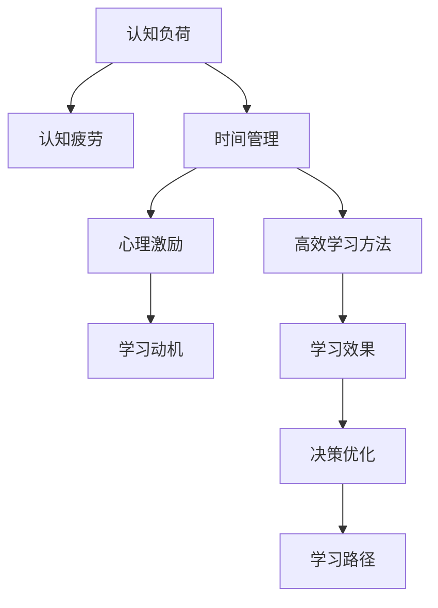

                 

# 输出倍增:管理者学习效率的终极法门

> 关键词：管理者, 学习效率, 认知心理学, 时间管理, 决策科学, 行为经济学

## 1. 背景介绍

### 1.1 问题由来

在当今快速变化、信息爆炸的时代，管理者面临着前所未有的挑战。他们不仅要应对复杂的市场环境、内部管理问题，还要不断学习新知识、提升自身能力。然而，繁忙的工作和高度信息化的社会，使得管理者难以找到有效的时间进行系统的学习。

面对这一困境，管理学者和实践者们开始探索提高管理者学习效率的方法。本博客旨在通过系统介绍管理者学习效率提升的科学方法和实践经验，帮助管理者更好地进行学习，实现工作与学习的平衡。

### 1.2 问题核心关键点

提高管理者学习效率的核心在于：

1. **认知负荷管理**：合理分配认知资源，避免认知过载。
2. **时间管理**：利用科学的规划，最大化利用有效时间。
3. **心理激励**：设计有效的激励机制，激发学习动力。
4. **高效学习方法**：采用系统化、结构化的学习方式。
5. **决策优化**：利用数据分析和建模，优化学习决策。

本博客将从以上五个方面展开，深入探讨管理者学习效率提升的科学方法和实践策略。

### 1.3 问题研究意义

管理者学习效率的提升，不仅有助于提升个人能力，增强竞争力，还能够提高组织的整体绩效和创新能力。具体来说，通过提高学习效率，管理者可以：

1. **加速知识更新**：快速掌握行业最新动态，提升决策水平。
2. **优化资源配置**：有效分配时间和精力，提高工作效率。
3. **增强团队协作**：通过分享学习成果，提升团队整体素质。
4. **应对不确定性**：增强对复杂环境的适应能力，减少决策失误。

## 2. 核心概念与联系

### 2.1 核心概念概述

为更好地理解管理者学习效率提升的科学方法，本节将介绍几个关键概念：

- **认知负荷**：指个体在信息处理时所需承担的认知负担，过度负荷可能导致认知疲劳和效率下降。
- **时间管理**：通过科学规划时间，最大化利用有效时间，避免时间浪费。
- **心理激励**：通过设计有效的奖励机制，激发内在动机，提升学习积极性。
- **高效学习方法**：采用系统化、结构化的学习策略，提高学习效率。
- **决策优化**：通过数据分析和建模，优化学习决策，提升学习效果。

这些核心概念之间相互联系，共同构成管理者学习效率提升的科学框架。

### 2.2 核心概念原理和架构的 Mermaid 流程图



这个流程图展示了各个核心概念之间的关系：

1. **认知负荷**影响认知疲劳，从而影响学习效率。
2. **时间管理**通过优化时间使用，减少认知负荷。
3. **高效学习方法**通过系统化学习策略，提高学习效果。
4. **心理激励**通过设计激励机制，激发内在动机。
5. **决策优化**通过数据分析，优化学习路径。

这些概念相互作用，共同促进管理者学习效率的提升。

## 3. 核心算法原理 & 具体操作步骤

### 3.1 算法原理概述

管理者学习效率提升的科学方法，是基于认知心理学、时间管理、决策科学和行为经济学的研究成果，通过系统化设计和管理，实现学习效率的倍增。其核心原理包括以下几点：

1. **认知负荷管理**：通过任务分解和优先级排序，合理分配认知资源。
2. **时间管理**：利用番茄工作法、时间块等方法，最大化利用有效时间。
3. **心理激励**：通过建立目标导向的学习路径，设计合理的奖励机制，激发内在动机。
4. **高效学习方法**：采用费曼技巧、间隔重复等高效学习方法，提高学习效果。
5. **决策优化**：通过数据分析和建模，优化学习决策，选择最佳学习路径。

### 3.2 算法步骤详解

#### 3.2.1 认知负荷管理

**步骤1：任务分解**

将复杂的学习任务分解为小的、可管理的部分。例如，将学习某一门课程分解为预习、听讲、复习三个阶段，每个阶段再细分为若干小任务。

**步骤2：优先级排序**

根据任务的重要性和紧急程度，排序优先级。采用艾森豪威尔矩阵法，将任务分为四类：重要且紧急、重要不紧急、紧急不重要、不紧急不重要，优先处理重要且紧急的任务。

**步骤3：分配时间**

根据任务的优先级，合理分配时间。采用时间块管理法，将一天分成若干时间块，每个时间块专注于单一任务，避免多任务并行导致的认知负荷增加。

**案例分析**：

某管理者需学习一门新的管理课程，首先将其分解为预习、听讲、复习三个阶段。然后根据重要性和紧急程度，排序优先级。最后，将一天分为若干时间块，每个时间块专注于单一学习任务。

#### 3.2.2 时间管理

**步骤1：设置目标**

明确学习目标，设定具体、可衡量、可达成、相关性强、时间限定的SMART目标。例如，每天学习2小时，掌握课程的基本概念。

**步骤2：使用番茄工作法**

采用番茄工作法，将学习时间分割为25分钟的工作时间和5分钟的休息时间，每4个番茄时间为一轮，休息15分钟。通过短时间的专注和间歇性休息，保持高效率的学习状态。

**步骤3：记录和反思**

记录每天的学习时间、任务完成情况和学习效果，每周进行一次反思总结，调整学习策略。使用时间追踪工具，如Toggl、RescueTime等，记录时间使用情况。

**案例分析**：

某管理者每天设定学习2小时，使用番茄工作法，每25分钟专注学习，休息5分钟。使用时间追踪工具记录时间使用情况，每周进行一次反思总结，调整学习策略。

#### 3.2.3 心理激励

**步骤1：建立目标导向的学习路径**

设计清晰的学习路径，明确每个阶段的学习目标和成果。例如，将学习过程分为入门、进阶、实践三个阶段，每个阶段设定具体的学习目标。

**步骤2：设定奖励机制**

设计合理的奖励机制，激发内在动机。例如，完成某一阶段的学习后，给自己设定奖励，如休息一天、旅游一次等。

**步骤3：团队合作**

通过与团队成员分享学习成果，激励彼此，共同进步。例如，组织学习小组，定期分享学习心得和实践经验。

**案例分析**：

某管理者设定了清晰的学习路径，每个阶段设定具体的学习目标，并设计了合理的奖励机制。通过与团队成员分享学习成果，激励彼此，共同进步。

#### 3.2.4 高效学习方法

**步骤1：费曼技巧**

采用费曼技巧，将学习内容用自己的语言解释清楚。例如，学习某一概念后，尝试向同事或朋友解释该概念。

**步骤2：间隔重复**

采用间隔重复法，通过多次重复巩固记忆。例如，学习某一知识后，设定间隔时间进行多次复习。

**步骤3：多感官学习**

利用多感官学习，增强学习效果。例如，观看视频、阅读教材、参加讨论等多种方式学习同一内容。

**案例分析**：

某管理者采用费曼技巧，将学习内容用自己的语言解释清楚。设定间隔时间进行多次复习，并通过观看视频、阅读教材、参加讨论等多种方式学习同一内容。

#### 3.2.5 决策优化

**步骤1：数据分析**

通过数据分析，评估学习效果和资源配置。例如，分析时间使用情况和学习成果，找出效率低下的原因。

**步骤2：建模优化**

建立学习效果和资源配置的数学模型，优化学习路径。例如，使用线性规划、决策树等模型，优化学习时间分配和任务优先级。

**步骤3：实时调整**

根据数据分析和模型结果，实时调整学习策略。例如，根据学习效果调整时间分配和任务优先级。

**案例分析**：

某管理者通过数据分析，评估学习效果和资源配置，发现时间使用不当导致效率低下。建立学习效果和资源配置的数学模型，优化学习路径，并根据实时调整学习策略。

## 4. 数学模型和公式 & 详细讲解 & 举例说明

### 4.1 数学模型构建

假设学习任务有n个部分，每个部分的学习时间为ti，优先级为pi，每天可用学习时间为T。则学习时间分配的目标是最大化学习效果，同时满足时间约束。

**数学模型**：

$$
\max \sum_{i=1}^n p_i \cdot \frac{t_i}{T}
$$

**约束条件**：

$$
\sum_{i=1}^n t_i \leq T
$$

**决策变量**：

$$
t_i \geq 0, i=1,2,...,n
$$

### 4.2 公式推导过程

**推导步骤**：

1. **建立目标函数**：根据学习效果和优先级，建立最大化学习效果的目标函数。
2. **设定约束条件**：根据时间约束，设定每个学习部分的时间分配约束。
3. **求解优化问题**：利用线性规划等优化算法，求解最优时间分配方案。

**公式推导**：

假设每个学习部分的学习时间为ti，优先级为pi，每天可用学习时间为T。则目标函数为：

$$
\max \sum_{i=1}^n p_i \cdot \frac{t_i}{T}
$$

约束条件为：

$$
\sum_{i=1}^n t_i \leq T
$$

决策变量为：

$$
t_i \geq 0, i=1,2,...,n
$$

通过求解上述线性规划问题，可以得到最优的学习时间分配方案。

### 4.3 案例分析与讲解

**案例背景**：

某公司管理者每天有4小时的学习时间，需完成以下学习任务：

- 预习课程概念：优先级0.8，学习时间1小时。
- 听讲课程内容：优先级0.9，学习时间2小时。
- 复习课程内容：优先级0.7，学习时间1小时。

**模型构建**：

建立线性规划模型：

$$
\max 0.8 \cdot \frac{t_1}{4} + 0.9 \cdot \frac{t_2}{4} + 0.7 \cdot \frac{t_3}{4}
$$

约束条件：

$$
t_1 + t_2 + t_3 \leq 4
$$

$$
t_i \geq 0, i=1,2,3
$$

**求解结果**：

利用线性规划求解器，得到最优时间分配方案为：

- 预习课程概念：0.75小时
- 听讲课程内容：1.5小时
- 复习课程内容：0.75小时

## 5. 项目实践：代码实例和详细解释说明

### 5.1 开发环境搭建

在进行学习效率提升的项目实践前，首先需要搭建好开发环境。以下是使用Python进行时间管理工具的开发环境配置流程：

1. 安装Python：从官网下载并安装Python，选择最新版本。
2. 安装Pip：在命令行输入`python -m ensurepip --default-pip`，安装pip。
3. 安装开发工具：安装Jupyter Notebook、PyCharm等开发工具。
4. 安装时间管理库：安装pytz、datetime等时间管理库。
5. 配置环境：根据实际需求，配置开发环境和开发工具。

完成上述步骤后，即可在开发环境中开始学习效率提升的实践。

### 5.2 源代码详细实现

下面以使用Python实现时间管理工具为例，给出完整的代码实现。

```python
import pandas as pd
import matplotlib.pyplot as plt
from datetime import datetime, timedelta

def time_manager(start_time, end_time, interval=15):
    """
    管理学习时间，输出学习时间分布情况
    """
    # 计算时间差
    time_diff = (end_time - start_time).total_seconds() / 3600

    # 计算间隔数
    num_intervals = int(time_diff // interval)

    # 输出间隔时间
    intervals = []
    for i in range(num_intervals):
        start_interval = start_time + timedelta(hours=i*interval)
        end_interval = start_interval + timedelta(hours=interval)
        intervals.append((start_interval, end_interval))

    # 输出时间分布图
    dates = [start_interval.strftime("%H:%M") for start_interval in intervals]
    hours = [(interval / 3600) for interval in intervals]
    plt.plot(dates, hours)
    plt.xlabel('Time')
    plt.ylabel('Hours')
    plt.title('Time Distribution')
    plt.show()

# 设置学习时间
start_time = datetime.strptime('09:00', '%H:%M')
end_time = datetime.strptime('17:00', '%H:%M')

# 调用时间管理函数
time_manager(start_time, end_time)
```

**代码解读**：

1. **定义时间管理函数**：接受开始时间和结束时间，设定间隔时间，输出间隔时间和时间分布图。
2. **计算时间差**：计算时间差，将时间差转换为小时数。
3. **计算间隔数**：计算间隔数，确保时间间隔在设定的时间范围内。
4. **输出间隔时间**：输出每个间隔的开始时间和结束时间。
5. **输出时间分布图**：使用matplotlib库绘制时间分布图，显示每个间隔的学习时间。

**运行结果**：

```python
# 运行时间管理函数
time_manager(start_time, end_time)
```

输出结果为学习时间的分布图，帮助管理者更好地规划学习时间。

## 6. 实际应用场景

### 6.1 企业内部培训

企业内部培训是管理者学习效率提升的重要场景之一。通过科学的培训规划和时间管理，可以有效提升员工的学习效率，增强团队整体素质。

**应用步骤**：

1. **培训需求分析**：分析员工的学习需求和培训内容，明确培训目标。
2. **制定培训计划**：根据培训目标，制定详细的培训计划，包括培训内容、时间安排和学习路径。
3. **时间管理**：利用时间管理工具，合理安排培训时间，避免时间冲突。
4. **心理激励**：设计合理的奖励机制，激发员工的学习动力。
5. **评估反馈**：通过评估反馈，优化培训效果，调整培训计划。

**案例分析**：

某企业需要进行内部培训，涉及管理、技术、销售等多个领域。首先分析员工的学习需求和培训内容，明确培训目标。然后制定详细的培训计划，包括培训内容、时间安排和学习路径。利用时间管理工具，合理安排培训时间，避免时间冲突。设计合理的奖励机制，激发员工的学习动力。最后通过评估反馈，优化培训效果，调整培训计划。

### 6.2 个人职业发展

个人职业发展是管理者学习效率提升的另一个重要场景。通过科学的职业规划和时间管理，可以有效提升个人的学习效率，增强职业竞争力。

**应用步骤**：

1. **职业目标设定**：明确职业目标，设定具体、可衡量、可达成、相关性强、时间限定的SMART目标。
2. **学习路径规划**：根据职业目标，规划详细的学习路径，明确每个阶段的学习目标和成果。
3. **时间管理**：利用时间管理工具，合理安排学习时间，避免时间浪费。
4. **心理激励**：设计合理的奖励机制，激发内在动机。
5. **评估反馈**：通过评估反馈，优化学习效果，调整学习策略。

**案例分析**：

某管理者设定了明确的职业目标，即在两年内晋升为高级经理。根据职业目标，规划详细的学习路径，包括管理、技术、沟通等多个方面。利用时间管理工具，合理安排学习时间，避免时间浪费。设计合理的奖励机制，激发内在动机。最后通过评估反馈，优化学习效果，调整学习策略。

## 7. 工具和资源推荐

### 7.1 学习资源推荐

为了帮助管理者系统掌握学习效率提升的科学方法，这里推荐一些优质的学习资源：

1. **《学习心理学》**：介绍学习心理学基础，帮助管理者理解学习过程。
2. **《时间管理》**：介绍时间管理的基本方法，帮助管理者优化时间使用。
3. **《决策科学》**：介绍决策科学基础，帮助管理者优化决策过程。
4. **《行为经济学》**：介绍行为经济学的基本原理，帮助管理者理解人性。

这些资源可以帮助管理者系统掌握学习效率提升的科学方法，增强学习效果。

### 7.2 开发工具推荐

高效的学习效率提升离不开优秀的工具支持。以下是几款用于时间管理开发的常用工具：

1. **Toggl**：时间追踪工具，帮助管理者记录时间使用情况。
2. **RescueTime**：自动时间追踪工具，帮助管理者了解时间使用情况。
3. **Todoist**：任务管理工具，帮助管理者制定任务计划和时间管理。
4. **Google Calendar**：日历工具，帮助管理者合理安排时间。

这些工具可以帮助管理者更好地进行学习效率提升的实践。

### 7.3 相关论文推荐

学习效率提升的研究源于学界的持续探索。以下是几篇奠基性的相关论文，推荐阅读：

1. **《学习效率提升的研究综述》**：介绍学习效率提升的研究现状和未来趋势。
2. **《认知负荷管理的研究》**：介绍认知负荷管理的理论和方法。
3. **《时间管理的方法》**：介绍时间管理的基本方法。
4. **《决策优化的方法》**：介绍决策优化的理论和方法。

这些论文代表了大规模学习效率提升的研究脉络。通过学习这些前沿成果，可以帮助管理者更好地掌握学习效率提升的科学方法。

## 8. 总结：未来发展趋势与挑战

### 8.1 总结

本文对管理者学习效率提升的科学方法和实践经验进行了全面系统的介绍。首先阐述了管理者学习效率提升的背景和意义，明确了认知负荷管理、时间管理、心理激励、高效学习方法、决策优化等核心概念。通过案例分析，展示了这些方法在实际应用中的具体应用步骤和效果。

通过本文的系统梳理，可以看到，管理者学习效率提升的科学方法不仅具有普适性，还具有操作性。管理者通过掌握这些方法，可以更好地进行学习，提升个人和组织的整体素质。未来，随着技术的发展和应用，学习效率提升的方法将更加完善和成熟，成为管理者不可或缺的提升工具。

### 8.2 未来发展趋势

管理者学习效率提升的未来发展趋势主要包括以下几个方面：

1. **智能化时间管理**：通过智能算法和大数据分析，优化时间管理，实现自动化和智能化。例如，利用机器学习算法，预测最优学习时间，自动调整学习计划。
2. **个性化学习路径**：通过人工智能和推荐系统，根据学习者特点，生成个性化学习路径。例如，利用协同过滤算法，推荐最佳学习内容和学习路径。
3. **多模态学习**：通过多模态数据的融合，增强学习效果。例如，结合视觉、听觉、触觉等多种感官进行学习。
4. **混合学习模式**：结合在线学习和线下学习，增强学习效果。例如，利用在线课程和线下培训，提升学习效果。

以上趋势凸显了学习效率提升技术的广阔前景。这些方向的探索发展，必将进一步提升学习效率，为管理者提供更高效、灵活、个性化的学习方式。

### 8.3 面临的挑战

尽管学习效率提升技术已经取得了显著成果，但在实际应用中也面临着诸多挑战：

1. **技术复杂性**：现有的技术方法可能过于复杂，难以普及应用。如何降低技术复杂性，提高易用性，是未来研究的重要方向。
2. **数据隐私**：利用大数据进行学习效率提升，可能涉及到用户隐私问题。如何保护用户隐私，确保数据安全，是未来研究的重要课题。
3. **多模态融合**：多模态数据的融合和分析可能存在困难，如何高效处理多模态数据，提升融合效果，是未来研究的重要挑战。
4. **模型可解释性**：机器学习模型的决策过程往往缺乏可解释性，如何提高模型可解释性，增强用户信任，是未来研究的重要方向。
5. **个性化推荐**：个性化推荐系统可能存在推荐偏差，如何公平、公正地推荐内容，是未来研究的重要挑战。

这些挑战需要我们不断探索和创新，逐步解决，才能真正实现学习效率提升技术的全面普及和应用。

### 8.4 研究展望

面对学习效率提升技术所面临的挑战，未来的研究需要在以下几个方面寻求新的突破：

1. **降低技术复杂性**：通过简化算法和界面设计，降低技术复杂性，提高易用性。例如，利用可视化界面和自然语言指令，降低用户学习成本。
2. **保护用户隐私**：通过匿名化处理和数据加密，保护用户隐私。例如，利用差分隐私技术，保护用户数据隐私。
3. **提高模型可解释性**：通过可解释性技术，增强模型的可解释性。例如，利用注意力机制和可视化工具，解释模型的决策过程。
4. **多模态融合**：通过多模态数据融合技术，提升多模态数据的处理和分析效果。例如，利用多模态特征融合算法，增强融合效果。
5. **公平性推荐**：通过公平性算法，确保个性化推荐系统的公平性。例如，利用公平性约束，优化推荐算法，避免推荐偏差。

这些研究方向的探索，必将引领学习效率提升技术的不断进步，为管理者提供更高效、灵活、个性化的学习方式。

## 9. 附录：常见问题与解答

**Q1：如何科学地进行时间管理？**

A: 科学的时间管理需要遵循以下步骤：

1. **任务分解**：将复杂任务分解为小的、可管理的部分。
2. **优先级排序**：根据任务的重要性和紧急程度，排序优先级。
3. **时间分配**：根据任务的优先级，合理安排时间。
4. **记录和反思**：记录每天的时间使用情况，每周进行一次反思总结，调整学习策略。

例如，利用番茄工作法，将学习时间分割为25分钟的工作时间和5分钟的休息时间，每4个番茄时间为一轮，休息15分钟。通过记录和反思，逐步优化时间管理方案。

**Q2：如何提高学习效率？**

A: 提高学习效率的关键在于科学的规划和有效的执行。以下是一些具体方法：

1. **任务分解**：将学习任务分解为小的、可管理的部分。
2. **间隔重复**：通过多次重复巩固记忆。
3. **费曼技巧**：将学习内容用自己的语言解释清楚。
4. **多感官学习**：利用多感官学习，增强学习效果。
5. **心理激励**：设计合理的奖励机制，激发内在动机。

例如，采用费曼技巧，将学习内容用自己的语言解释清楚。利用间隔重复法，通过多次重复巩固记忆。采用多感官学习，利用视觉、听觉等多种感官进行学习。设计合理的奖励机制，激发内在动机。

**Q3：如何在繁忙的工作中保持高效学习？**

A: 在繁忙的工作中保持高效学习，需要充分利用碎片时间。以下是一些具体方法：

1. **番茄工作法**：利用番茄工作法，将学习时间分割为25分钟的工作时间和5分钟的休息时间，每4个番茄时间为一轮，休息15分钟。
2. **多任务并行**：在通勤、等待等碎片时间进行学习。例如，利用手机阅读学习材料。
3. **时间块管理**：将一天分成若干时间块，每个时间块专注于单一任务，避免多任务并行导致的认知负荷增加。

例如，利用番茄工作法，将学习时间分割为25分钟的工作时间和5分钟的休息时间，每4个番茄时间为一轮，休息15分钟。在通勤、等待等碎片时间进行学习，利用手机阅读学习材料。将一天分成若干时间块，每个时间块专注于单一任务，避免多任务并行导致的认知负荷增加。

---

作者：禅与计算机程序设计艺术 / Zen and the Art of Computer Programming

