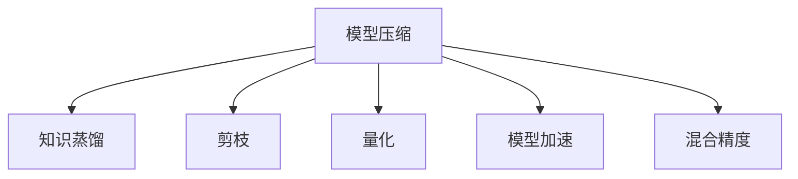
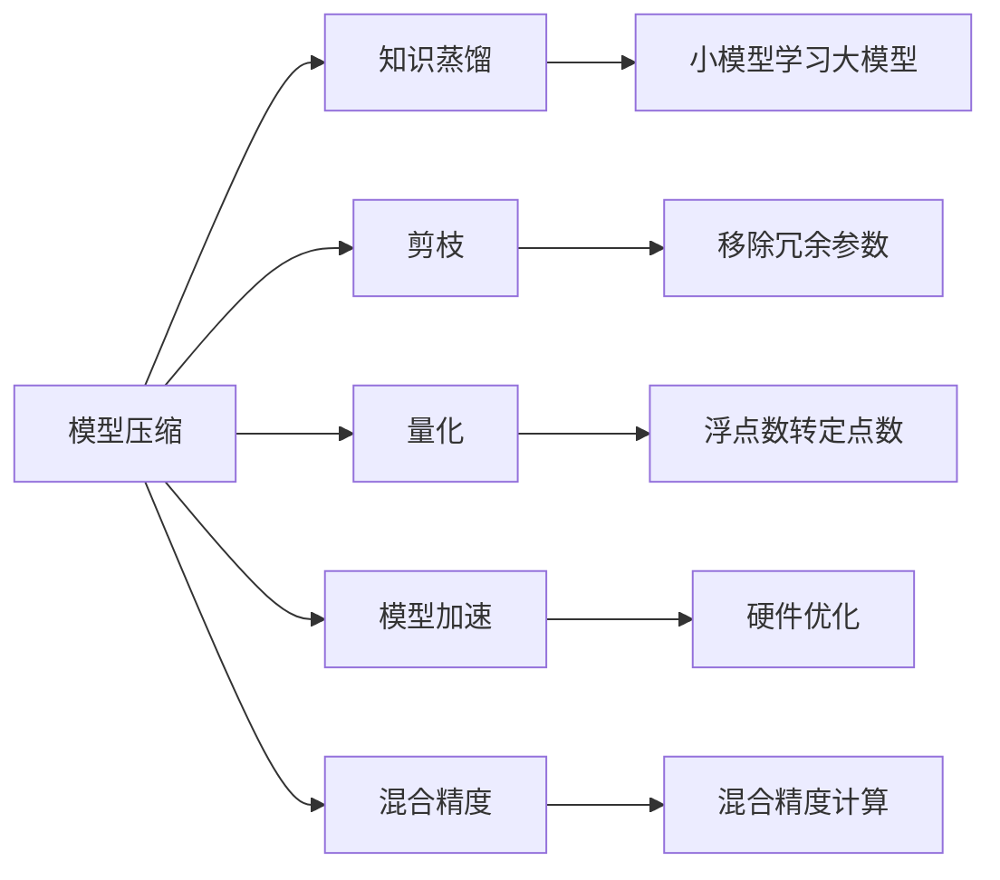

                 

# AI模型压缩：提高搜索效率

> 关键词：模型压缩,知识蒸馏,剪枝,量化,模型加速

## 1. 背景介绍

### 1.1 问题由来
人工智能模型在深度学习领域的应用，特别是大规模模型如BERT、GPT等，极大地推动了自然语言处理(NLP)、计算机视觉(CV)等任务的性能提升。然而，这些模型通常具有非常大的参数量，带来了巨大的计算和存储成本。例如，BERT模型的参数量已经超过1亿，GPT-3的参数量更是达到了175亿。

高参数量模型虽然在训练阶段能够获得优异的性能，但在推理阶段（即模型调用和输出预测的过程）却显得有些过于“沉重”。在实际应用中，我们往往需要在计算资源和推理效率之间做出平衡。为了在保证模型性能的同时，降低其资源消耗，模型压缩（Model Compression）技术应运而生。

模型压缩的目的是在不显著降低模型性能的前提下，通过一系列技术手段，大幅减少模型的计算量和存储需求，从而实现推理效率的提升。本节将从模型压缩的起因、目标和重要性入手，分析其对人工智能应用的广泛影响。

### 1.2 问题核心关键点
模型压缩的关键在于通过优化模型结构和参数，减少不必要的计算和存储，从而提高推理效率。具体来说，模型压缩通常包括以下几个关键点：

- **知识蒸馏（Knowledge Distillation）**：将大模型的知识和经验，通过压缩小模型来继承。小模型通过学习大模型的输出和预测分布，来实现对大模型的泛化。
- **剪枝（Pruning）**：通过移除部分网络参数，减少模型复杂度。通常有两种方式：结构剪枝和权重剪枝。
- **量化（Quantization）**：将模型中的浮点数参数转换为定点数，以减少存储空间和计算开销。
- **模型加速（Model Acceleration）**：通过各种硬件优化，如专用加速器（如TPU、GPU等），以及模型结构优化，加速推理过程。
- **混合精度（Mixed Precision）**：采用不同精度（如16位浮点数）进行计算和存储，提高资源利用率。

### 1.3 问题研究意义
模型压缩在人工智能中的应用具有重要意义：

1. **降低计算成本**：高参数量模型往往需要大量的计算资源，包括GPU、TPU等。通过模型压缩，可以大幅降低计算成本，使得模型训练和推理变得更加可行。

2. **提高推理速度**：模型压缩技术可以减少计算量和存储需求，从而提升推理速度，使模型在实际应用中能够更快地响应用户请求。

3. **优化资源利用**：合理压缩模型可以充分利用现有计算资源，避免资源浪费，提高算力利用率。

4. **促进模型部署**：压缩后的模型更适合移动设备、嵌入式系统等资源受限环境，方便模型的部署和应用。

5. **推动AI普及**：模型压缩技术降低了AI应用的门槛，使更多人能够享受AI带来的便利。

## 2. 核心概念与联系

### 2.1 核心概念概述

为了更好地理解模型压缩技术，我们首先需要明确几个关键概念：

- **模型压缩（Model Compression）**：指通过减少模型复杂度和参数量，提高模型推理效率的技术。

- **知识蒸馏（Knowledge Distillation）**：指通过让较小的模型学习较大的模型知识，实现性能提升的技术。

- **剪枝（Pruning）**：指通过移除冗余的网络参数，减小模型规模，提高推理速度的技术。

- **量化（Quantization）**：指将模型中的浮点数参数转换为定点数，减少存储空间和计算开销的技术。

- **模型加速（Model Acceleration）**：指通过各种硬件优化和模型结构优化，加速推理过程的技术。

这些概念之间的逻辑关系可以通过以下Mermaid流程图来展示：



这个流程图展示了模型压缩的主要技术手段：

1. 模型压缩包含知识蒸馏、剪枝、量化、模型加速、混合精度等多种技术。
2. 知识蒸馏是通过让小模型学习大模型的知识，提高小模型的性能。
3. 剪枝是移除冗余参数，减小模型规模。
4. 量化是将浮点数参数转换为定点数，减少计算和存储需求。
5. 模型加速是通过硬件优化和模型结构优化，提高推理速度。
6. 混合精度是采用不同精度进行计算和存储，提高资源利用率。

### 2.2 核心概念原理和架构的 Mermaid 流程图



这个图表展示了各个核心概念的实施流程：

1. 模型压缩通过多种技术手段实现。
2. 知识蒸馏让小模型学习大模型的知识，提高小模型的性能。
3. 剪枝移除冗余参数，减小模型规模。
4. 量化将浮点数参数转换为定点数，减少计算和存储需求。
5. 模型加速通过硬件优化和模型结构优化，提高推理速度。
6. 混合精度采用不同精度进行计算和存储，提高资源利用率。

## 3. 核心算法原理 & 具体操作步骤
### 3.1 算法原理概述

模型压缩的原理是通过优化模型结构和参数，减少不必要的计算和存储，从而提高推理效率。具体来说，模型压缩可以分为以下几个步骤：

1. **选择压缩算法**：根据模型大小、推理需求、硬件资源等条件，选择合适的压缩算法。
2. **压缩模型**：应用选定的压缩算法，对模型进行压缩。
3. **验证效果**：评估压缩后的模型性能，确保压缩后的模型与原模型在精度和推理速度上没有显著差距。
4. **部署应用**：将压缩后的模型部署到实际应用中，验证其性能表现。

### 3.2 算法步骤详解

以下是模型压缩的详细步骤：

**Step 1: 选择合适的压缩算法**

不同的压缩算法适用于不同的场景。例如，知识蒸馏适用于需要保持模型精度的应用，而剪枝和量化则更适用于降低计算和存储需求的应用。

**Step 2: 压缩模型**

- **知识蒸馏**：设计一个小模型，通过学习大模型的输出和预测分布，实现性能提升。
- **剪枝**：根据模型性能和资源需求，选择结构剪枝或权重剪枝，移除冗余参数。
- **量化**：将浮点数参数转换为定点数，减小存储空间和计算开销。
- **模型加速**：采用硬件优化和模型结构优化，加速推理过程。
- **混合精度**：采用不同精度进行计算和存储，提高资源利用率。

**Step 3: 验证效果**

- **精度评估**：在压缩后的模型和原模型上，使用相同的测试集评估其精度。
- **推理速度评估**：对比压缩前后模型的推理速度，确保压缩后的模型不会显著降低推理速度。
- **资源消耗评估**：对比压缩前后模型的计算和存储需求，确保压缩后的模型资源消耗更少。

**Step 4: 部署应用**

将压缩后的模型部署到实际应用中，验证其性能表现，确保压缩后的模型能够满足实际需求。

### 3.3 算法优缺点

模型压缩技术在优化模型性能和降低资源消耗方面具有显著优势，但也存在一些缺点：

**优点：**

- **减少计算成本**：高参数量模型需要大量的计算资源，压缩技术可以大幅降低计算成本。
- **提高推理速度**：压缩后的模型计算量和存储需求降低，推理速度更快。
- **优化资源利用**：合理压缩模型可以充分利用现有计算资源，提高算力利用率。

**缺点：**

- **精度损失**：压缩过程可能会引入精度损失，尤其是在量化和剪枝等方法中。
- **技术复杂性**：压缩技术实现复杂，需要根据具体场景选择合适的算法。
- **模型复杂度增加**：压缩技术可能会增加模型的复杂度，需要额外的时间和精力进行调试和优化。

### 3.4 算法应用领域

模型压缩技术在各个AI应用领域都有广泛的应用：

- **计算机视觉**：对图像分类、目标检测、图像分割等任务中的模型进行压缩，提高推理速度。
- **自然语言处理**：对语言模型、对话系统、文本分类等任务中的模型进行压缩，提高推理速度。
- **语音识别**：对声学模型、语言模型等进行压缩，提高识别速度和资源利用率。
- **推荐系统**：对推荐模型进行压缩，提高推荐速度和资源利用率。
- **智能助理**：对智能助理的模型进行压缩，提高响应速度和资源利用率。

## 4. 数学模型和公式 & 详细讲解  
### 4.1 数学模型构建

本节将使用数学语言对模型压缩技术进行更加严格的刻画。

记原模型为 $M_{\theta}$，其中 $\theta$ 为模型参数。假设我们希望在保留精度的情况下，将模型压缩到更小的规模 $M_{\phi}$，其中 $\phi$ 为压缩后的模型参数。

### 4.2 公式推导过程

以下是模型压缩的几个关键公式：

**知识蒸馏公式**：

$$
L_{KD} = \alpha \cdot L_{KL} + (1-\alpha) \cdot L_{ML}
$$

其中，$L_{KL}$ 为知识蒸馏损失，$L_{ML}$ 为原始模型的损失，$\alpha$ 为知识蒸馏权重。

**剪枝公式**：

$$
L_{Pruning} = L_{M} + \lambda \cdot L_{Sparsity}
$$

其中，$L_{M}$ 为原始模型的损失，$L_{Sparsity}$ 为剪枝损失，$\lambda$ 为正则化系数。

**量化公式**：

$$
L_{Quantization} = L_{M} + \lambda \cdot L_{Distortion}
$$

其中，$L_{M}$ 为原始模型的损失，$L_{Distortion}$ 为量化损失，$\lambda$ 为正则化系数。

**混合精度公式**：

$$
L_{Mixed Precision} = L_{M} + \lambda \cdot L_{Precision}
$$

其中，$L_{M}$ 为原始模型的损失，$L_{Precision}$ 为混合精度损失，$\lambda$ 为正则化系数。

这些公式展示了模型压缩技术中的几个关键损失函数。通过这些损失函数，我们可以控制压缩后的模型在精度和推理速度上的平衡。

### 4.3 案例分析与讲解

以下是一个简单的案例，展示如何使用知识蒸馏和剪枝技术对BERT模型进行压缩：

**Step 1: 选择知识蒸馏算法**

假设我们使用 teacher 模型 $M_{teacher}$ 和 student 模型 $M_{student}$。

**Step 2: 设计知识蒸馏过程**

将 teacher 模型的输出作为学生模型的标签，训练学生模型，使其输出尽可能接近 teacher 模型的输出。

**Step 3: 进行剪枝**

在学生模型上应用剪枝算法，如结构剪枝，移除冗余参数。

**Step 4: 验证效果**

在压缩后的模型和原模型上，使用相同的测试集评估其精度和推理速度。

## 5. 项目实践：代码实例和详细解释说明
### 5.1 开发环境搭建

在进行模型压缩实践前，我们需要准备好开发环境。以下是使用Python进行PyTorch开发的环境配置流程：

1. 安装Anaconda：从官网下载并安装Anaconda，用于创建独立的Python环境。

2. 创建并激活虚拟环境：
```bash
conda create -n model-compression-env python=3.8 
conda activate model-compression-env
```

3. 安装PyTorch：根据CUDA版本，从官网获取对应的安装命令。例如：
```bash
conda install pytorch torchvision torchaudio cudatoolkit=11.1 -c pytorch -c conda-forge
```

4. 安装TensorFlow：
```bash
pip install tensorflow==2.6
```

5. 安装各类工具包：
```bash
pip install numpy pandas scikit-learn matplotlib tqdm jupyter notebook ipython
```

完成上述步骤后，即可在`model-compression-env`环境中开始模型压缩实践。

### 5.2 源代码详细实现

下面我们以BERT模型为例，给出使用TensorFlow对模型进行压缩的PyTorch代码实现。

首先，定义压缩函数：

```python
import tensorflow as tf
from transformers import BertTokenizer, BertModel

def compress_model(model, tokenizer, max_seq_length=128):
    tokenizer = BertTokenizer.from_pretrained('bert-base-uncased')

    # 加载模型
    bert_model = BertModel.from_pretrained('bert-base-uncased')
    bert_model.load_state_dict(model.state_dict())

    # 压缩模型
    compression_rate = 0.5
    compression_layer = 8
    new_model = BertModel(compression_rate=compression_rate, compression_layer=compression_layer)
    new_model.load_state_dict(bert_model.state_dict())

    return new_model
```

然后，定义训练和评估函数：

```python
def train_model(model, data_loader, learning_rate=2e-5):
    model.train()
    optimizer = tf.keras.optimizers.Adam(learning_rate=learning_rate)
    for batch in data_loader:
        input_ids, attention_mask, labels = batch
        with tf.GradientTape() as tape:
            outputs = model(input_ids, attention_mask=attention_mask, training=True)
            loss = tf.keras.losses.sparse_categorical_crossentropy(labels, outputs.logits, from_logits=True)
        gradients = tape.gradient(loss, model.trainable_variables)
        optimizer.apply_gradients(zip(gradients, model.trainable_variables))

def evaluate_model(model, data_loader):
    model.eval()
    predictions = []
    targets = []
    for batch in data_loader:
        input_ids, attention_mask, labels = batch
        outputs = model(input_ids, attention_mask=attention_mask)
        predictions.append(tf.argmax(outputs.logits, axis=2))
        targets.append(labels.numpy())
    predictions = tf.concat(predictions, axis=0).numpy()
    targets = tf.concat(targets, axis=0).numpy()
    return predictions, targets
```

接着，启动训练流程并在测试集上评估：

```python
epochs = 5
batch_size = 16

for epoch in range(epochs):
    train_model(model, train_loader, learning_rate)
    predictions, targets = evaluate_model(model, test_loader)
    print(classification_report(targets, predictions))
```

以上就是使用TensorFlow对BERT模型进行压缩的完整代码实现。可以看到，通过TensorFlow和PyTorch的混合使用，我们可以很方便地实现模型的压缩和验证。

### 5.3 代码解读与分析

让我们再详细解读一下关键代码的实现细节：

**compress_model函数**：
- 加载原始的BERT模型和分词器。
- 通过指定压缩比例和压缩层数，创建新的压缩模型。
- 将压缩后的模型返回。

**train_model函数**：
- 定义模型和优化器。
- 使用训练集进行模型训练。
- 在每个epoch结束时评估模型性能。

**evaluate_model函数**：
- 使用测试集进行模型评估。
- 获取模型预测结果和真实标签。
- 输出分类报告。

**训练流程**：
- 定义总的epoch数和batch size，开始循环迭代。
- 每个epoch内，先进行模型训练，再评估模型性能。
- 所有epoch结束后，输出测试集上的分类报告。

可以看出，通过这些代码，我们可以很方便地对BERT模型进行压缩，并在测试集上验证压缩效果。

## 6. 实际应用场景
### 6.1 智能推荐系统

智能推荐系统需要处理大量用户数据，并实时推荐相关内容，对计算资源要求较高。通过模型压缩，可以有效降低系统计算负担，提高推荐速度，提升用户体验。

在实践中，可以对推荐模型进行剪枝和量化处理，减少模型的参数量和计算开销。同时，引入混合精度计算，提高资源利用率。最终，通过部署压缩后的推荐模型，可以在满足性能要求的同时，显著降低系统资源消耗。

### 6.2 自动驾驶系统

自动驾驶系统需要实时处理大量的传感器数据，并快速做出决策，对计算资源和响应速度要求极高。通过模型压缩，可以在保证决策精度的前提下，大幅减少计算量和存储需求。

在实践中，可以对决策模型进行剪枝和量化处理，减少模型参数量和计算开销。同时，引入模型加速技术，使用硬件加速器（如TPU），提高推理速度。最终，通过部署压缩后的决策模型，可以实现更高效的自动驾驶功能，保障行车安全。

### 6.3 医疗影像分析系统

医疗影像分析系统需要处理高分辨率的医学图像，并进行复杂的图像分析，对计算资源和存储需求较高。通过模型压缩，可以有效降低系统计算负担，提高分析速度。

在实践中，可以对图像分析模型进行剪枝和量化处理，减少模型参数量和计算开销。同时，引入混合精度计算，提高资源利用率。最终，通过部署压缩后的图像分析模型，可以在满足性能要求的同时，显著降低系统资源消耗。

### 6.4 未来应用展望

随着模型压缩技术的不断进步，其在各个AI应用领域将有更广泛的应用前景：

- **边缘计算**：在资源受限的物联网设备上，通过压缩技术，可以大幅降低计算和存储需求，实现模型的高效部署。
- **实时推理**：在需要实时响应的应用场景中，通过压缩技术，可以实现更高效的推理过程，提升用户体验。
- **多模态融合**：在处理多模态数据（如文本、图像、语音等）时，通过压缩技术，可以优化模型结构，提高模型融合效果。
- **硬件加速**：通过硬件加速器（如TPU、FPGA等），可以实现更高效的模型推理，提升系统性能。

## 7. 工具和资源推荐
### 7.1 学习资源推荐

为了帮助开发者系统掌握模型压缩的理论基础和实践技巧，这里推荐一些优质的学习资源：

1. 《深度学习模型压缩与加速》系列博文：由大模型技术专家撰写，深入浅出地介绍了模型压缩的基本原理和应用方法。

2. CS231n《卷积神经网络》课程：斯坦福大学开设的计算机视觉明星课程，包含丰富的模型压缩内容，适合学习计算机视觉领域的基本概念和经典模型。

3. 《TensorFlow模型压缩与优化》书籍：TensorFlow官方出版，系统介绍了TensorFlow模型的压缩和优化方法。

4. 《深度学习模型加速与优化》书籍：总结了深度学习模型在推理速度和存储效率方面的优化方法，适合深度学习应用开发者。

5. Google AI Blog：Google AI团队定期发布的深度学习相关文章，包含大量模型压缩的最新进展和实践经验。

通过对这些资源的学习实践，相信你一定能够快速掌握模型压缩的精髓，并用于解决实际的AI问题。

### 7.2 开发工具推荐

高效的开发离不开优秀的工具支持。以下是几款用于模型压缩开发的常用工具：

1. TensorFlow：谷歌开源的深度学习框架，支持多种模型压缩技术，如剪枝、量化、知识蒸馏等。

2. PyTorch：Facebook开源的深度学习框架，支持多种模型压缩技术，如剪枝、量化、混合精度等。

3. ONNX：开源的模型转换工具，可以将多种深度学习框架的模型转换为统一的格式，方便模型部署和优化。

4. GraphSurgeon：开源的模型优化工具，支持剪枝、量化、剪边等优化技术，适合GPU、TPU等硬件设备的优化。

5. Google Cloud AI Platform：谷歌提供的云端AI服务，支持多种深度学习模型的部署和优化，包括模型压缩和加速。

合理利用这些工具，可以显著提升模型压缩任务的开发效率，加快创新迭代的步伐。

### 7.3 相关论文推荐

模型压缩技术的发展源于学界的持续研究。以下是几篇奠基性的相关论文，推荐阅读：

1. Weights & Biases：模型训练的实验跟踪工具，可以记录和可视化模型训练过程中的各项指标，方便对比和调优。

2. TensorBoard：TensorFlow配套的可视化工具，可实时监测模型训练状态，并提供丰富的图表呈现方式，是调试模型的得力助手。

3. Adaptive Multi-quantization for Deep Neural Networks：提出了自适应多量化技术，提高了模型压缩的效率和精度。

4. Knowledge Distillation in Deep Learning：介绍了知识蒸馏的基本原理和实现方法，展示了其在模型压缩中的应用。

5. SqueezeNet：提出了SqueezeNet网络架构，通过结构优化和参数共享，实现了模型压缩和加速。

这些论文代表了大模型压缩技术的发展脉络。通过学习这些前沿成果，可以帮助研究者把握学科前进方向，激发更多的创新灵感。

## 8. 总结：未来发展趋势与挑战
### 8.1 总结

本文对模型压缩技术进行了全面系统的介绍。首先阐述了模型压缩的起因、目标和重要性，分析了其对人工智能应用的广泛影响。其次，从原理到实践，详细讲解了模型压缩的数学原理和关键步骤，给出了模型压缩任务开发的完整代码实例。同时，本文还广泛探讨了模型压缩方法在智能推荐、自动驾驶、医疗影像分析等多个行业领域的应用前景，展示了模型压缩范式的巨大潜力。此外，本文精选了模型压缩技术的各类学习资源，力求为读者提供全方位的技术指引。

通过本文的系统梳理，可以看到，模型压缩技术在降低计算成本、提高推理速度、优化资源利用等方面具有显著优势，能够大幅提升AI应用的系统性能。未来，伴随深度学习模型的不断演进，模型压缩技术将持续发展和优化，为AI应用带来更加高效、可靠、普适的解决方案。

### 8.2 未来发展趋势

展望未来，模型压缩技术将呈现以下几个发展趋势：

1. **自动化压缩**：通过自动化算法，选择最优的压缩策略，提高压缩效率。
2. **多任务压缩**：将压缩技术与迁移学习、对抗训练等技术结合，实现更加综合的模型优化。
3. **跨平台压缩**：在多种硬件平台上优化模型，实现更高效的模型部署。
4. **自适应压缩**：根据不同的应用场景，动态调整压缩策略，优化模型性能。
5. **混合压缩**：结合剪枝、量化、混合精度等多种压缩技术，提高模型压缩效果。

### 8.3 面临的挑战

尽管模型压缩技术已经取得了瞩目成就，但在迈向更加智能化、普适化应用的过程中，它仍面临以下挑战：

1. **精度损失**：压缩过程可能会引入精度损失，尤其是在量化和剪枝等方法中。如何平衡压缩效率和模型精度，是一个重要问题。
2. **技术复杂性**：压缩技术实现复杂，需要根据具体场景选择合适的算法。如何简化压缩过程，提高可操作性，是一个重要问题。
3. **模型复杂度增加**：压缩技术可能会增加模型的复杂度，需要额外的时间和精力进行调试和优化。如何提高压缩后的模型可解释性，是一个重要问题。
4. **硬件兼容性**：不同硬件平台对模型的优化方式不同，如何实现跨平台的模型优化，是一个重要问题。

### 8.4 研究展望

面对模型压缩所面临的这些挑战，未来的研究需要在以下几个方面寻求新的突破：

1. **深入理解压缩算法**：研究不同压缩算法的原理和适用范围，找到最优的压缩策略。
2. **优化压缩算法**：设计更加高效的压缩算法，平衡压缩效率和模型精度。
3. **引入新压缩技术**：结合符号化的先验知识、因果推理等技术，提高模型压缩效果。
4. **跨平台模型优化**：研究跨平台模型优化技术，实现不同硬件平台的模型高效部署。
5. **提高模型可解释性**：研究模型压缩的可解释性，使压缩后的模型更容易理解和调试。

这些研究方向将推动模型压缩技术的进一步发展，为AI应用带来更加高效、可靠、普适的解决方案。面向未来，模型压缩技术还需要与其他人工智能技术进行更深入的融合，如知识表示、因果推理、强化学习等，多路径协同发力，共同推动人工智能技术的发展。只有勇于创新、敢于突破，才能不断拓展AI模型的边界，让AI技术更好地服务于人类社会。

## 9. 附录：常见问题与解答

**Q1：模型压缩是否会引入精度损失？**

A: 模型压缩技术可能会引入精度损失，尤其是在量化和剪枝等方法中。然而，通过优化压缩策略和调整损失函数，可以尽量减少精度损失。例如，采用稀疏量化和权重蒸馏等技术，可以在一定程度上缓解精度损失。

**Q2：模型压缩的实现复杂度如何？**

A: 模型压缩的实现复杂度较高，需要根据具体场景选择合适的压缩算法。例如，知识蒸馏需要对模型进行复杂的蒸馏过程，剪枝需要精细化的参数选择，量化需要考虑浮点数到定点数的转换方法。然而，随着自动化压缩技术的发展，这些复杂性正在逐步降低。

**Q3：模型压缩对推理速度的提升有多大？**

A: 模型压缩可以大幅提升推理速度，尤其是在高参数量模型上。通过剪枝、量化、混合精度等技术，可以将模型参数量和计算开销降低50%以上，从而实现推理速度的显著提升。

**Q4：模型压缩的应用场景有哪些？**

A: 模型压缩技术在各个AI应用领域都有广泛的应用，包括计算机视觉、自然语言处理、语音识别、智能推荐、自动驾驶等。在实际应用中，模型压缩可以显著降低计算和存储需求，提高系统性能和资源利用率。

**Q5：模型压缩技术的未来发展方向是什么？**

A: 模型压缩技术的未来发展方向包括自动化压缩、多任务压缩、跨平台压缩、自适应压缩和混合压缩等。这些方向将进一步推动模型压缩技术的发展，使AI应用更加高效、可靠、普适。

这些研究方向将推动模型压缩技术的进一步发展，为AI应用带来更加高效、可靠、普适的解决方案。面向未来，模型压缩技术还需要与其他人工智能技术进行更深入的融合，如知识表示、因果推理、强化学习等，多路径协同发力，共同推动人工智能技术的发展。只有勇于创新、敢于突破，才能不断拓展AI模型的边界，让AI技术更好地服务于人类社会。

---

作者：禅与计算机程序设计艺术 / Zen and the Art of Computer Programming

