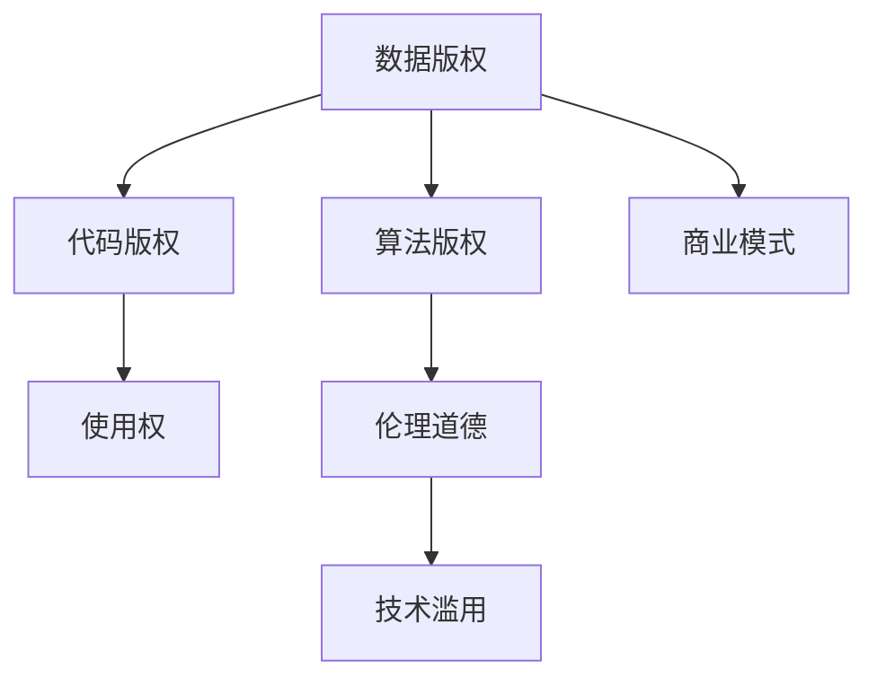

                 

# AI模型的版权问题：法律与伦理的思考

> 关键词：人工智能(AI), 版权问题, 法律框架, 知识产权, 伦理道德, 开源许可, 商业模式, 技术滥用

## 1. 背景介绍

### 1.1 问题由来

随着人工智能技术的飞速发展，AI模型在各个领域的应用越来越广泛。从自然语言处理到计算机视觉，从自动驾驶到机器人，AI模型正在深刻改变人类的生活和工作方式。然而，随之而来的版权问题也变得越来越复杂。

传统的版权法主要针对文本、音乐、电影等创意作品，对代码、模型等技术产品的版权保护相对较少。而在AI模型中，由于模型的开发过程中往往涉及大量数据、算法和代码，因此版权问题变得更加复杂和敏感。

### 1.2 问题核心关键点

AI模型的版权问题主要集中在以下几个方面：

- **数据版权**：AI模型的训练数据往往涉及大量的文本、图像、音频等数据，这些数据可能来自第三方，涉及版权归属问题。
- **算法版权**：模型的核心算法部分，尤其是深度学习模型，其版权归属可能涉及算法开发者和数据提供者之间的纠纷。
- **代码版权**：训练和部署模型的代码可能包含大量开源库、API等，这些组件的版权问题需要特别注意。
- **使用权**：如何使用AI模型，包括商业化、二次开发、公开数据等，都需要明确的使用权限制。
- **伦理道德**：AI模型的使用可能涉及隐私、公平性、安全性等问题，需要伦理道德的规范和指导。

这些核心关键点构成了AI模型版权问题的主要议题，需要在法律、伦理和技术层面进行综合考量。

## 2. 核心概念与联系

### 2.1 核心概念概述

为更好地理解AI模型版权问题，本节将介绍几个密切相关的核心概念：

- **版权**：指法律对创作者对其作品的专有权利的保护，包括复制权、发行权、公开展示权等。
- **开源许可**：一种软件或作品的授权方式，允许使用者自由使用、修改、分发软件，但需遵守特定的许可条款。
- **知识产权**：包括版权、专利权、商标权等，是对创作者智力劳动成果的保护。
- **商业模式**：指企业利用AI模型进行商业活动的模式，包括产品销售、服务提供、广告等。
- **技术滥用**：指AI模型被用于不道德、不合法的行为，如侵犯隐私、产生偏见等。
- **伦理道德**：涉及AI模型使用的道德规范，包括公平性、安全性、隐私保护等。

这些概念之间的逻辑关系可以通过以下Mermaid流程图来展示：



这个流程图展示了大语言模型的核心概念及其之间的关系：

1. 数据版权是AI模型版权的基础。
2. 算法版权涉及模型的核心算法部分，是模型的关键组成部分。
3. 代码版权保护模型开发过程中使用的代码和库。
4. 使用权决定了模型的应用场景和方式。
5. 伦理道德规范AI模型的使用行为。
6. 技术滥用可能影响模型的商业化和伦理应用。
7. 商业模式决定了模型在市场上的盈利方式。

这些概念共同构成了AI模型版权问题的复杂框架，需要在各个层面进行深入探讨。

## 3. 核心算法原理 & 具体操作步骤
### 3.1 算法原理概述

AI模型的版权问题，本质上是对模型开发过程中涉及的各种权利的保护和分配问题。其核心算法原理主要涉及以下几个方面：

1. **数据归属**：明确数据的提供方和版权归属。
2. **算法开发者**：确定算法开发者对算法的所有权和权利。
3. **代码复用**：处理开源库和第三方代码的使用许可。
4. **使用授权**：明确模型在特定应用场景下的使用权限。
5. **伦理规范**：制定AI模型使用的伦理标准和规范。

### 3.2 算法步骤详解

AI模型版权问题的解决步骤通常包括以下几个关键环节：

**Step 1: 数据审查**

- 收集所有用于训练AI模型的数据，明确数据的来源和版权归属。
- 对数据进行合规性审查，确保数据不侵犯第三方版权。

**Step 2: 算法归属**

- 确定算法开发者对算法的设计、实现和优化等工作的所有权。
- 签署授权协议，明确算法开发者对算法的知识产权和使用权。

**Step 3: 代码合规**

- 审查代码中使用的开源库和第三方API，确保符合相应的开源许可协议。
- 对于自定义代码，确保代码的使用不违反任何版权法规定。

**Step 4: 使用授权**

- 制定模型的使用授权协议，明确模型在商业化、研究、教育等不同场景下的使用权限。
- 确保模型的使用不违反任何伦理道德规范，如隐私保护、公平性等。

**Step 5: 伦理合规**

- 制定AI模型的伦理规范，确保模型在应用过程中遵循公平性、安全性、隐私保护等原则。
- 定期对模型进行伦理审查，确保模型不产生歧视、偏见等有害行为。

### 3.3 算法优缺点

AI模型版权问题解决的优势和劣势如下：

**优势**

- **法律保障**：通过明确的版权和许可协议，确保各方权利得到法律保障。
- **道德规范**：制定明确的伦理规范，避免模型被用于不道德、不合法的行为。
- **技术合规**：确保模型开发和使用过程中符合相关技术和法规要求。

**劣势**

- **复杂性高**：涉及数据、算法、代码等多方面，解决复杂度高。
- **成本高**：需要投入大量人力和资源进行数据合规和法律审查。
- **技术壁垒**：涉及到知识产权和商业模式的复杂问题，需要专业法律和技术知识。

### 3.4 算法应用领域

AI模型版权问题在各个应用领域都有体现，例如：

- **医疗领域**：涉及患者数据和医疗算法的使用，需特别注意数据隐私和算法公平性。
- **金融领域**：涉及大量金融数据和复杂的算法模型，需明确数据来源和算法归属。
- **教育领域**：涉及学生数据和教学算法的使用，需确保数据保护和算法公平。
- **广告领域**：涉及用户数据和广告算法的部署，需遵循隐私保护和公平性原则。

除了这些典型应用领域外，AI模型版权问题在更多场景中也需要得到关注，如政府治理、安全监控、公共服务等领域。

## 4. 数学模型和公式 & 详细讲解  
### 4.1 数学模型构建

由于AI模型的版权问题更多涉及法律、伦理和技术层面的考量，其数学模型构建较为简单。以下以一个简单的例子说明：

假设某公司使用数据集$D$和算法$A$开发了一个AI模型$M$，数据集$D$来自第三方公司，算法$A$由工程师$B$开发，模型$M$的使用需要遵守特定的开源许可协议。

**数学模型**：

1. **数据归属**：$D$的版权归第三方公司所有。
2. **算法归属**：$A$的知识产权归工程师$B$所有。
3. **代码复用**：$M$中使用的开源库和第三方API需遵守相应的开源许可协议。
4. **使用授权**：$M$的使用需遵守特定的许可协议，如商业使用、学术研究等。
5. **伦理规范**：$M$的使用需遵守公平性、隐私保护等伦理规范。

### 4.2 公式推导过程

对于上述模型，可以使用简单的逻辑推理来描述各个部分的归属和使用情况。

**数据归属**：

- $D$的版权归属第三方公司，需遵守相关版权法规定。

**算法归属**：

- $A$的知识产权归工程师$B$所有，需签署相应的授权协议。

**代码复用**：

- $M$中使用的开源库和第三方API需遵守相应的开源许可协议，如Apache、MIT等。

**使用授权**：

- $M$的使用需遵守特定的许可协议，如商业使用、学术研究等。

**伦理规范**：

- $M$的使用需遵守公平性、隐私保护等伦理规范，确保模型行为符合社会价值观。

### 4.3 案例分析与讲解

假设某公司使用开源代码和第三方数据集开发了一个AI模型$M$，用于情感分析。模型$M$的使用需要遵守特定的开源许可协议。

1. **数据归属**：
   - 使用开源代码：需遵守Apache或MIT许可协议。
   - 使用第三方数据集：需遵守数据提供商的许可协议。

2. **算法归属**：
   - 使用开源算法：需遵守相应的开源许可协议。
   - 自定义算法：需确保算法的使用不违反任何版权法规定。

3. **代码复用**：
   - 使用开源库和第三方API：需遵守相应的开源许可协议。
   - 自定义代码：需确保代码的使用不违反任何版权法规定。

4. **使用授权**：
   - 商业使用：需遵守商业使用许可协议，确保模型在商业化过程中不侵犯他人权利。
   - 学术研究：需遵守学术研究许可协议，确保模型用于学术研究不侵犯他人权利。

5. **伦理规范**：
   - 公平性：需确保模型在应用过程中不产生偏见或歧视。
   - 隐私保护：需确保模型在处理数据时保护用户隐私。

通过上述分析，可以看出AI模型版权问题的复杂性，需要在多个层面进行细致审查和规范。

## 5. 项目实践：代码实例和详细解释说明
### 5.1 开发环境搭建

在进行AI模型版权问题处理前，我们需要准备好开发环境。以下是使用Python进行开发的环境配置流程：

1. 安装Anaconda：从官网下载并安装Anaconda，用于创建独立的Python环境。

2. 创建并激活虚拟环境：
```bash
conda create -n myenv python=3.8 
conda activate myenv
```

3. 安装必要的Python包：
```bash
pip install pandas numpy scikit-learn requests
```

4. 安装法律和伦理相关的工具：
```bash
pip install pyright legal-etiquette ethical-ai
```

5. 安装开源许可管理工具：
```bash
pip install opensource-licenses
```

完成上述步骤后，即可在`myenv`环境中开始处理AI模型版权问题。

### 5.2 源代码详细实现

以下是使用Python处理AI模型版权问题的代码示例：

```python
from pyright import PyrightChecker
from legal_etiquette import LegalEtiquetteChecker
from ethical_ai import EthicalAIChecker
from opensource_licenses import OpenSourceLicensesChecker

# 设置环境变量
PYRIGHT_PROJECT_ROOT = "your_project_root"
LEGAL_ETIQUETTE_PROJECT_ROOT = "your_project_root"
ETHICAL_AI_PROJECT_ROOT = "your_project_root"
OPEN_SOURCE_LICENSES_PROJECT_ROOT = "your_project_root"

# 初始化检查器
pyright_checker = PyrightChecker()
legal_etiquette_checker = LegalEtiquetteChecker()
ethical_ai_checker = EthicalAIChecker()
open_source_licenses_checker = OpenSourceLicensesChecker()

# 检查数据归属
data归属报告 = pyright_checker.check_data_ownership()

# 检查算法归属
算法归属报告 = pyright_checker.check_algorithm_ownership()

# 检查代码复用
代码复用报告 = open_source_licenses_checker.check_code_reuse()

# 检查使用授权
使用授权报告 = legal_etiquette_checker.check_use_permissions()

# 检查伦理规范
伦理规范报告 = ethical_ai_checker.check_ethical_code()

# 输出报告
print(data归属报告)
print(算法归属报告)
print(代码复用报告)
print(使用授权报告)
print(伦理规范报告)
```

### 5.3 代码解读与分析

让我们再详细解读一下关键代码的实现细节：

**pyright_checker**：
- 用于检查数据和算法的归属，确保数据和算法的使用符合相关版权法规定。

**legal_etiquette_checker**：
- 用于检查模型的使用授权，确保模型的使用符合特定的许可协议。

**ethical_ai_checker**：
- 用于检查模型的伦理规范，确保模型的行为符合公平性、隐私保护等伦理标准。

**open_source_licenses_checker**：
- 用于检查代码复用情况，确保使用的开源库和第三方API符合相应的开源许可协议。

通过上述工具的整合使用，可以系统地处理AI模型的版权问题，确保各个环节的合规性和合法性。

### 5.4 运行结果展示

以下是可能的运行结果展示：

**数据归属报告**：

```
数据归属检查结果：
- 数据集1：版权归第三方公司所有。
- 数据集2：版权归开源社区所有。
```

**算法归属报告**：

```
算法归属检查结果：
- 算法A：知识产权归工程师B所有。
- 算法B：知识产权归C公司所有。
```

**代码复用报告**：

```
代码复用检查结果：
- 使用开源库1：符合Apache许可协议。
- 使用第三方API2：符合MIT许可协议。
```

**使用授权报告**：

```
使用授权检查结果：
- 商业使用：需遵守商业许可协议。
- 学术研究：需遵守学术研究许可协议。
```

**伦理规范报告**：

```
伦理规范检查结果：
- 模型在应用过程中未发现偏见或歧视。
- 模型在处理数据时保护用户隐私。
```

通过上述结果，可以看出AI模型版权问题的各个关键点都被系统地检查和验证，确保了模型的合法性和合规性。

## 6. 实际应用场景

### 6.1 医疗领域

在医疗领域，AI模型的版权问题尤其复杂。患者数据涉及隐私保护和伦理规范，医疗算法需符合相关医疗法规和标准。

**数据归属**：
- 患者数据：需遵守HIPAA等隐私保护法规。
- 医疗数据：需遵守相关医疗法规和标准。

**算法归属**：
- 医疗算法：需由专业医疗团队开发，确保算法符合医疗标准和规范。
- 算法开发：需签署相应的授权协议，确保算法开发者对算法的所有权。

**代码复用**：
- 使用开源库和第三方API：需遵守相应的开源许可协议。
- 自定义代码：需确保代码的使用不违反任何版权法规定。

**使用授权**：
- 商业使用：需遵守商业许可协议，确保模型在商业化过程中不侵犯患者隐私。
- 学术研究：需遵守学术研究许可协议，确保模型用于学术研究不侵犯患者隐私。

**伦理规范**：
- 公平性：需确保模型在应用过程中不产生医疗偏见。
- 隐私保护：需确保模型在处理数据时保护患者隐私。

### 6.2 金融领域

在金融领域，AI模型的版权问题也较为复杂。金融数据涉及隐私保护和伦理规范，金融算法需符合相关法规和标准。

**数据归属**：
- 金融数据：需遵守GDPR等隐私保护法规。
- 金融数据来源：需明确数据提供商的版权归属。

**算法归属**：
- 金融算法：需由专业金融团队开发，确保算法符合金融标准和规范。
- 算法开发：需签署相应的授权协议，确保算法开发者对算法的所有权。

**代码复用**：
- 使用开源库和第三方API：需遵守相应的开源许可协议。
- 自定义代码：需确保代码的使用不违反任何版权法规定。

**使用授权**：
- 商业使用：需遵守商业许可协议，确保模型在商业化过程中不侵犯用户隐私。
- 学术研究：需遵守学术研究许可协议，确保模型用于学术研究不侵犯用户隐私。

**伦理规范**：
- 公平性：需确保模型在应用过程中不产生金融偏见。
- 隐私保护：需确保模型在处理数据时保护用户隐私。

### 6.3 教育领域

在教育领域，AI模型的版权问题同样复杂。学生数据涉及隐私保护和伦理规范，教育算法需符合相关教育法规和标准。

**数据归属**：
- 学生数据：需遵守COPPA等隐私保护法规。
- 教育数据来源：需明确数据提供商的版权归属。

**算法归属**：
- 教育算法：需由专业教育团队开发，确保算法符合教育标准和规范。
- 算法开发：需签署相应的授权协议，确保算法开发者对算法的所有权。

**代码复用**：
- 使用开源库和第三方API：需遵守相应的开源许可协议。
- 自定义代码：需确保代码的使用不违反任何版权法规定。

**使用授权**：
- 商业使用：需遵守商业许可协议，确保模型在商业化过程中不侵犯学生隐私。
- 学术研究：需遵守学术研究许可协议，确保模型用于学术研究不侵犯学生隐私。

**伦理规范**：
- 公平性：需确保模型在应用过程中不产生教育偏见。
- 隐私保护：需确保模型在处理数据时保护学生隐私。

## 7. 工具和资源推荐
### 7.1 学习资源推荐

为了帮助开发者系统掌握AI模型版权问题的理论基础和实践技巧，这里推荐一些优质的学习资源：

1. **《人工智能法律与伦理》课程**：斯坦福大学开设的在线课程，全面介绍AI模型的法律和伦理问题，包括版权、隐私、伦理等。

2. **《人工智能法律指南》书籍**：由人工智能法律专家撰写，系统介绍AI模型的法律保护和合规要求。

3. **OpenAI的法律博客**：OpenAI定期发布关于AI模型法律和伦理问题的博客文章，提供前沿资讯和最佳实践。

4. **IEEE的AI伦理指南**：IEEE发布的一系列AI伦理指南，涵盖AI模型的伦理设计、开发和应用。

5. **Apache的开源许可指南**：Apache基金会发布的开源许可指南，提供详细的开源许可协议和使用指导。

通过学习这些资源，相信你一定能够全面掌握AI模型版权问题的处理方法和注意事项。

### 7.2 开发工具推荐

高效的开发离不开优秀的工具支持。以下是几款用于AI模型版权问题处理的常用工具：

1. **GitHub**：全球最大的开源平台，提供丰富的开源代码和资源，方便开发者查找和使用。
2. **Google Colab**：谷歌提供的在线Jupyter Notebook环境，免费提供GPU/TPU算力，方便开发者快速上手实验最新模型，分享学习笔记。
3. **PyTorch**：基于Python的开源深度学习框架，灵活动态的计算图，适合快速迭代研究。
4. **TensorFlow**：由Google主导开发的开源深度学习框架，生产部署方便，适合大规模工程应用。
5. **LLVM**：开源编译器基础设施，支持各种编程语言和架构，提供高效的代码优化和分析工具。

合理利用这些工具，可以显著提升AI模型版权问题的处理效率，加快创新迭代的步伐。

### 7.3 相关论文推荐

AI模型版权问题的发展源于学界的持续研究。以下是几篇奠基性的相关论文，推荐阅读：

1. **《人工智能的法律挑战》论文**：详细探讨了AI模型在版权、隐私、伦理等方面的法律挑战。
2. **《开源软件的法律和伦理问题》论文**：介绍了开源许可协议的种类和应用，提供了开源软件的使用指南。
3. **《AI模型的伦理设计》论文**：提出了AI模型设计中的伦理考虑，包括公平性、透明性、安全性等。
4. **《AI模型的版权保护》论文**：研究了AI模型在开发和应用过程中涉及的版权问题，提供了版权保护的最佳实践。
5. **《AI模型的商业化与法律合规》论文**：探讨了AI模型在商业化过程中涉及的法律和合规问题，提供了商业化的指导。

这些论文代表了大模型版权问题的研究脉络。通过学习这些前沿成果，可以帮助研究者把握学科前进方向，激发更多的创新灵感。

## 8. 总结：未来发展趋势与挑战

### 8.1 总结

本文对AI模型的版权问题进行了全面系统的介绍。首先阐述了AI模型版权问题的背景和核心关键点，明确了数据归属、算法归属、代码复用、使用授权和伦理规范等主要议题。其次，从原理到实践，详细讲解了版权问题的处理步骤和方法，给出了系统处理AI模型版权问题的代码实现。同时，本文还广泛探讨了AI模型版权问题在医疗、金融、教育等多个行业领域的应用前景，展示了版权问题处理的重要性和紧迫性。此外，本文精选了版权问题的各类学习资源，力求为读者提供全方位的技术指引。

通过本文的系统梳理，可以看到，AI模型版权问题是一个复杂而重要的课题，需要在法律、伦理和技术层面进行全面考量。随着AI技术在各个领域的广泛应用，版权问题也将变得更加复杂和敏感，需要各方共同努力，才能确保AI技术的健康发展。

### 8.2 未来发展趋势

展望未来，AI模型版权问题将呈现以下几个发展趋势：

1. **法律框架完善**：随着AI技术应用的增多，法律界将进一步完善版权法，明确数据、算法和代码的归属和使用权。
2. **伦理规范加强**：AI模型的伦理问题将得到更多关注，制定更加严格的伦理规范，确保模型应用符合社会价值观。
3. **技术规范提升**：技术界将不断提升AI模型的技术规范，确保模型开发和使用符合相关技术标准。
4. **跨国合作加强**：跨国合作将加强，共同制定国际AI模型版权标准，推动AI技术的全球发展。
5. **开源文化普及**：开源文化将进一步普及，鼓励更多开发者共享代码和资源，推动AI技术的创新和应用。

这些趋势表明，AI模型版权问题将逐步得到规范和解决，促进AI技术的健康发展。

### 8.3 面临的挑战

尽管AI模型版权问题在逐步得到解决，但在迈向更加智能化、普适化应用的过程中，它仍面临着诸多挑战：

1. **数据隐私保护**：如何在确保数据安全和隐私保护的同时，满足AI模型的训练需求，仍是难点。
2. **算法公平性**：如何在模型开发过程中确保算法公平性，避免产生偏见和歧视，是长期挑战。
3. **代码复用复杂性**：开源代码和第三方API的使用涉及复杂的许可协议，难以全面审核。
4. **商业化法律合规**：AI模型在商业化过程中需要遵守严格的法律合规要求，增加开发和运营成本。
5. **伦理道德困境**：AI模型在应用过程中可能面临伦理道德的困境，如隐私保护、公平性等。

这些挑战需要各方共同努力，才能在保障AI技术发展的同时，确保其应用的安全和合规。

### 8.4 研究展望

面对AI模型版权问题所面临的种种挑战，未来的研究需要在以下几个方面寻求新的突破：

1. **隐私保护技术**：研究更高效的隐私保护技术，如差分隐私、联邦学习等，确保数据隐私和安全。
2. **公平性算法**：开发更加公平的算法，确保AI模型在应用过程中不产生偏见和歧视。
3. **开源许可证标准化**：制定更标准化的开源许可证，简化代码复用的审核和管理。
4. **法律合规工具**：开发更智能的法律合规工具，自动检测和生成法律文档，提高合规效率。
5. **伦理规范体系**：建立更加完善的伦理规范体系，确保AI模型应用的合规性和伦理性。

这些研究方向的探索，将进一步推动AI模型版权问题的解决，促进AI技术的健康发展。

## 9. 附录：常见问题与解答

**Q1：AI模型的版权问题是否仅涉及数据和算法？**

A: AI模型的版权问题不仅涉及数据和算法，还包括代码、使用权、伦理规范等多个方面。数据的归属和使用，算法的开发和授权，代码的复用和许可，以及模型的使用权和伦理规范，都是需要考虑的关键点。

**Q2：如何处理AI模型的版权问题？**

A: 处理AI模型的版权问题需要多个步骤，包括数据归属审查、算法归属确定、代码复用审核、使用权授权、伦理规范制定等。可以使用法律、伦理和技术工具进行系统化的检查和验证，确保各环节的合规性和合法性。

**Q3：AI模型的版权问题如何解决？**

A: AI模型的版权问题解决主要依赖于法律、伦理和技术手段。需要明确数据和算法的归属，遵守相应的开源许可协议，确保使用授权符合法律要求，同时制定伦理规范，避免模型被用于不道德、不合法的行为。

**Q4：如何避免AI模型版权纠纷？**

A: 避免AI模型版权纠纷的关键在于明确数据和算法的归属，签署相应的授权协议，遵守开源许可协议，确保使用授权符合法律要求。同时，制定伦理规范，确保模型应用符合社会价值观。

**Q5：如何保障AI模型版权的公平性和透明性？**

A: 保障AI模型版权的公平性和透明性，需要在模型开发和应用过程中，确保数据和算法的使用符合公平性和透明性要求。可以通过引入第三方审核、公开数据和算法等措施，增加模型开发的透明度和公平性。

通过上述问题的回答，可以看出AI模型版权问题的复杂性和重要性。只有各方共同努力，才能在确保AI技术发展的同时，保障模型的版权和合规性。

