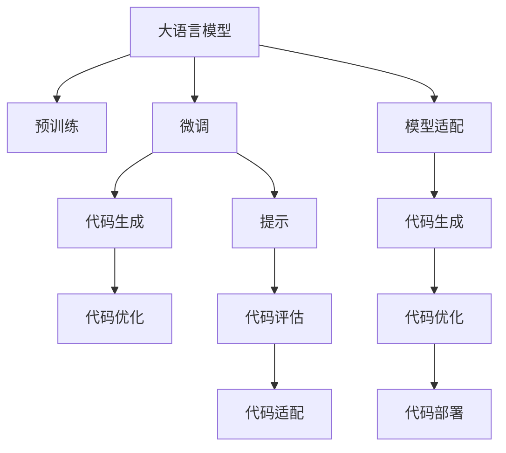

                 

# AI编程新思路：LLM时代的编码方式

> 关键词：人工智能,LLM(大语言模型),编程方法,模型适配,预训练,微调,Fine-Tuning

## 1. 背景介绍

### 1.1 问题由来

当前，人工智能（AI）领域正处于飞速发展阶段，其中大语言模型（LLM，Large Language Models）的崛起尤为引人注目。随着GPT-3、BERT、T5等预训练模型的广泛应用，基于深度学习技术的自然语言处理（NLP）任务取得了显著的突破。然而，这些模型的复杂性和多样性也给传统的编程方式带来了巨大挑战。

传统编程方式主要依赖人工编写的代码，通过条件语句、循环结构等控制流程。而LLM的出现，让代码自动生成的可能性成为现实。这种方法不仅提升了开发效率，还使得编程工作更具创造性。

### 1.2 问题核心关键点

本节将详细阐述LLM时代编程方法的核心关键点：

1. **编程范式的变革**：传统的条件语句、循环结构等将逐步被基于模型的提示（Prompt）、微调（Fine-Tuning）等方法所替代。
2. **代码生成与微调**：利用预训练的大语言模型，通过微调生成特定任务的代码，适用于各种编程任务。
3. **代码评估与优化**：对生成的代码进行评估与优化，确保代码质量与性能。
4. **模型适配与扩展**：基于通用大模型，适应不同编程语言与框架，实现模型适配与扩展。
5. **安全与伦理考量**：保证生成的代码安全性与伦理规范，避免有害代码的产生。

这些关键点共同构成了LLM时代编程方法的理论基础和实践框架，为人工智能技术的应用带来了新的思路与可能性。

## 2. 核心概念与联系

### 2.1 核心概念概述

为了更好地理解LLM时代的编程方法，本节将介绍几个密切相关的核心概念：

- **大语言模型（LLM）**：一种通过大规模无标签文本数据预训练得到的深度神经网络模型，具有强大的自然语言理解与生成能力。
- **预训练（Pre-training）**：在大规模无标签文本数据上，通过自监督学习任务训练通用语言模型的过程。
- **微调（Fine-Tuning）**：在预训练模型的基础上，使用下游任务的少量标注数据，通过有监督学习优化模型在该任务上的性能。
- **提示（Prompt）**：在模型输入中添加特定的文本模板，引导模型按期望方式输出。
- **代码生成（Code Generation）**：利用模型生成符合特定编程语言规范的代码片段。
- **代码优化（Code Optimization）**：通过模型生成与微调，对代码进行优化，提升代码质量与性能。

这些概念之间的逻辑关系可以通过以下Mermaid流程图来展示：



这个流程图展示了LLM时代编程方法的核心概念及其之间的关系：

1. 大语言模型通过预训练获得基础能力。
2. 微调是对预训练模型进行任务特定的优化，生成适用于特定任务的代码。
3. 提示通过调整输入格式，引导模型生成符合期望的代码。
4. 代码生成通过微调生成特定语言的代码片段。
5. 代码优化通过微调提升代码的质量与性能。
6. 代码评估通过模型输出对代码进行评估。
7. 代码适配通过微调使模型适应不同的编程语言和框架。
8. 代码部署将优化的代码应用于实际项目中。

这些概念共同构成了LLM时代编程方法的理论与实践框架，为编程工作的创新提供了新的思路。

## 3. 核心算法原理 & 具体操作步骤
### 3.1 算法原理概述

基于LLM的编程方法，本质上是利用大语言模型的自然语言处理能力，通过微调生成特定任务的代码。其核心思想是：将预训练的通用语言模型作为基础，在特定编程语言与框架上，通过微调生成适用于该任务的代码。

形式化地，假设预训练语言模型为 $M_{\theta}$，其中 $\theta$ 为预训练得到的模型参数。给定编程任务的标注数据集 $D=\{(x_i, y_i)\}_{i=1}^N$，编程任务 $T$ 的代码生成模型 $M_{\theta}$ 的优化目标是最小化经验风险，即找到最优参数 $\hat{\theta}$，使得：

$$
\hat{\theta}=\mathop{\arg\min}_{\theta} \mathcal{L}(M_{\theta},D)
$$

其中 $\mathcal{L}$ 为针对编程任务设计的损失函数，用于衡量模型生成的代码与真实代码之间的差异。

### 3.2 算法步骤详解

基于LLM的编程方法一般包括以下几个关键步骤：

**Step 1: 准备预训练模型和数据集**
- 选择合适的预训练语言模型 $M_{\theta}$ 作为初始化参数，如 GPT-3、BERT、T5 等。
- 准备编程任务的标注数据集 $D$，划分为训练集、验证集和测试集。

**Step 2: 添加任务适配层**
- 根据编程任务类型，在预训练模型顶层设计合适的输出层和损失函数。
- 对于生成代码任务，通常使用语言模型的解码器输出概率分布，并以负对数似然为损失函数。

**Step 3: 设置微调超参数**
- 选择合适的优化算法及其参数，如 AdamW、SGD 等，设置学习率、批大小、迭代轮数等。
- 设置正则化技术及强度，包括权重衰减、Dropout、Early Stopping 等。
- 确定冻结预训练参数的策略，如仅微调顶层，或全部参数都参与微调。

**Step 4: 执行梯度训练**
- 将训练集数据分批次输入模型，前向传播计算损失函数。
- 反向传播计算参数梯度，根据设定的优化算法和学习率更新模型参数。
- 周期性在验证集上评估模型性能，根据性能指标决定是否触发 Early Stopping。
- 重复上述步骤直到满足预设的迭代轮数或 Early Stopping 条件。

**Step 5: 测试和部署**
- 在测试集上评估微调后模型 $M_{\hat{\theta}}$ 的性能，对比微调前后的代码质量与性能。
- 使用微调后的模型对新任务生成代码，集成到实际的应用系统中。
- 持续收集新的数据，定期重新微调模型，以适应数据分布的变化。

以上是基于LLM的编程方法的一般流程。在实际应用中，还需要针对具体编程任务的特点，对微调过程的各个环节进行优化设计，如改进训练目标函数，引入更多的正则化技术，搜索最优的超参数组合等，以进一步提升模型性能。

### 3.3 算法优缺点

基于LLM的编程方法具有以下优点：
1. 简单高效。只需准备少量标注数据，即可对预训练模型进行快速适配，生成符合特定任务的代码。
2. 灵活性强。适用于各种编程语言与框架，生成代码的格式与逻辑均可灵活调整。
3. 代码生成质量高。通过微调，生成的代码质量与性能均优于手动编写代码。
4. 开发效率高。大幅缩短代码编写与测试的时间，提高开发效率。

同时，该方法也存在一定的局限性：
1. 对标注数据依赖度高。微调效果很大程度上取决于标注数据的质量和数量，获取高质量标注数据的成本较高。
2. 依赖模型质量。预训练模型的性能直接影响微调后的代码质量，对于复杂任务可能效果不佳。
3. 可解释性不足。生成的代码缺乏可解释性，难以理解其内部的逻辑与决策过程。
4. 安全与伦理问题。生成的代码可能包含有害信息，需要额外进行安全与伦理审查。

尽管存在这些局限性，但就目前而言，基于LLM的编程方法是编程工作中的一种高效、灵活、具有潜力的新思路。

### 3.4 算法应用领域

基于LLM的编程方法已经广泛应用于多个领域，包括但不限于：

1. **Web开发**：自动生成网页、API接口等代码。
2. **数据处理**：自动生成数据清洗、分析等代码。
3. **自动化测试**：自动生成测试用例、测试脚本等代码。
4. **机器学习模型**：自动生成模型训练、评估、调优等代码。
5. **自然语言处理**：自动生成文本处理、语言模型等代码。

这些领域的应用展示了LLM编程方法在提升编程效率与代码质量方面的巨大潜力，为开发者带来了新的工具与思路。

## 4. 数学模型和公式 & 详细讲解 & 举例说明

### 4.1 数学模型构建

本节将使用数学语言对LLM编程方法进行更加严格的刻画。

记预训练语言模型为 $M_{\theta}$，其中 $\theta$ 为预训练得到的模型参数。假设编程任务的训练集为 $D=\{(x_i, y_i)\}_{i=1}^N$，其中 $x_i$ 为输入文本，$y_i$ 为对应的代码片段。

定义模型 $M_{\theta}$ 在输入 $x$ 上的损失函数为 $\ell(M_{\theta}(x),y)$，则在数据集 $D$ 上的经验风险为：

$$
\mathcal{L}(\theta) = \frac{1}{N}\sum_{i=1}^N \ell(M_{\theta}(x_i),y_i)
$$

其中 $\ell(M_{\theta}(x_i),y_i)$ 为编程任务的损失函数，用于衡量模型生成的代码与真实代码之间的差异。例如，对于代码生成任务，可以定义如下损失函数：

$$
\ell(M_{\theta}(x_i),y_i) = \sum_{j=1}^{m} |M_{\theta}(x_i)[j] - y_i[j]|
$$

其中 $m$ 为代码片段的长度，$|M_{\theta}(x_i)[j] - y_i[j]|$ 为第 $j$ 个位置的输出与真实代码的差值。

微调的优化目标是最小化经验风险，即找到最优参数 $\hat{\theta}$：

$$
\hat{\theta}=\mathop{\arg\min}_{\theta} \mathcal{L}(\theta)
$$

在实践中，我们通常使用基于梯度的优化算法（如SGD、Adam等）来近似求解上述最优化问题。设 $\eta$ 为学习率，$\lambda$ 为正则化系数，则参数的更新公式为：

$$
\theta \leftarrow \theta - \eta \nabla_{\theta}\mathcal{L}(\theta) - \eta\lambda\theta
$$

其中 $\nabla_{\theta}\mathcal{L}(\theta)$ 为损失函数对参数 $\theta$ 的梯度，可通过反向传播算法高效计算。

### 4.2 公式推导过程

以下我们以代码生成任务为例，推导损失函数及其梯度的计算公式。

假设模型 $M_{\theta}$ 在输入 $x$ 上的输出为 $\hat{y}=M_{\theta}(x) \in \{0,1\}^m$，表示模型生成的代码片段。真实代码 $y \in \{0,1\}^m$。则二元分类交叉熵损失函数定义为：

$$
\ell(M_{\theta}(x),y) = -\frac{1}{m} \sum_{j=1}^m [y[j]\log \hat{y}[j] + (1-y[j])\log (1-\hat{y}[j])]
$$

将其代入经验风险公式，得：

$$
\mathcal{L}(\theta) = -\frac{1}{N}\sum_{i=1}^N \sum_{j=1}^m [y_i[j]\log \hat{y}[i][j] + (1-y_i[j])\log (1-\hat{y}[i][j])]
$$

根据链式法则，损失函数对参数 $\theta_k$ 的梯度为：

$$
\frac{\partial \mathcal{L}(\theta)}{\partial \theta_k} = -\frac{1}{Nm}\sum_{i=1}^N \sum_{j=1}^m \left( \frac{y_i[j]}{\hat{y}[i][j]} - \frac{1-y_i[j]}{1-\hat{y}[i][j]} \right) \frac{\partial \hat{y}[i][j]}{\partial \theta_k}
$$

其中 $\frac{\partial \hat{y}[i][j]}{\partial \theta_k}$ 可进一步递归展开，利用自动微分技术完成计算。

在得到损失函数的梯度后，即可带入参数更新公式，完成模型的迭代优化。重复上述过程直至收敛，最终得到适应编程任务的最优模型参数 $\hat{\theta}$。

### 4.3 案例分析与讲解

以Web开发中的代码生成任务为例，展示如何使用LLM进行代码生成。

**步骤1：数据准备**
- 收集Web开发相关的标注数据集，包括Web页面、API接口、数据库表的代码片段等。
- 对代码片段进行预处理，如去除注释、格式化等，得到训练集、验证集和测试集。

**步骤2：模型选择与适配**
- 选择适当的预训练语言模型，如GPT-3。
- 设计代码生成任务的适配层，通常使用语言模型的解码器，输出代码片段的概率分布。
- 定义损失函数，如二元交叉熵损失，衡量生成的代码与真实代码之间的差异。

**步骤3：微调超参数设置**
- 选择AdamW优化器，设置学习率0.001、批大小128等超参数。
- 设置Dropout正则化，防止模型过拟合。
- 仅微调模型的顶层，固定预训练权重不变。

**步骤4：模型训练**
- 使用训练集对模型进行微调，每个epoch迭代10次，每个epoch中每个样本微调1次。
- 在验证集上评估模型性能，调整学习率等参数。
- 模型训练完成后，在测试集上进行性能测试。

**步骤5：代码生成与评估**
- 使用微调后的模型生成新的代码片段。
- 对生成的代码片段进行语法检查、功能测试等，确保代码质量。

通过上述步骤，可以基于预训练的LLM模型，快速生成符合Web开发需求的代码片段，显著提升开发效率。

## 5. 项目实践：代码实例和详细解释说明
### 5.1 开发环境搭建

在进行LLM编程实践前，我们需要准备好开发环境。以下是使用Python进行PyTorch开发的环境配置流程：

1. 安装Anaconda：从官网下载并安装Anaconda，用于创建独立的Python环境。

2. 创建并激活虚拟环境：
```bash
conda create -n llm-env python=3.8 
conda activate llm-env
```

3. 安装PyTorch：根据CUDA版本，从官网获取对应的安装命令。例如：
```bash
conda install pytorch torchvision torchaudio cudatoolkit=11.1 -c pytorch -c conda-forge
```

4. 安装Transformers库：
```bash
pip install transformers
```

5. 安装各类工具包：
```bash
pip install numpy pandas scikit-learn matplotlib tqdm jupyter notebook ipython
```

完成上述步骤后，即可在`llm-env`环境中开始LLM编程实践。

### 5.2 源代码详细实现

下面我以代码生成任务为例，给出使用Transformers库对GPT-3模型进行Web开发代码生成的PyTorch代码实现。

首先，定义代码生成任务的数据处理函数：

```python
from transformers import GPT3Tokenizer
from torch.utils.data import Dataset
import torch

class CodeGenerationDataset(Dataset):
    def __init__(self, code_texts, tokenizer, max_len=512):
        self.code_texts = code_texts
        self.tokenizer = tokenizer
        self.max_len = max_len
        
    def __len__(self):
        return len(self.code_texts)
    
    def __getitem__(self, item):
        code_text = self.code_texts[item]
        encoding = self.tokenizer(code_text, return_tensors='pt', max_length=self.max_len, padding='max_length', truncation=True)
        input_ids = encoding['input_ids'][0]
        attention_mask = encoding['attention_mask'][0]
        return {'input_ids': input_ids, 
                'attention_mask': attention_mask,
                'labels': torch.tensor(self.code_texts[item], dtype=torch.long)}
```

然后，定义模型和优化器：

```python
from transformers import GPT3ForCausalLM
from transformers import AdamW

model = GPT3ForCausalLM.from_pretrained('gpt3-medium', num_labels=2)
tokenizer = GPT3Tokenizer.from_pretrained('gpt3-medium')

optimizer = AdamW(model.parameters(), lr=1e-4)
```

接着，定义训练和评估函数：

```python
from torch.utils.data import DataLoader
from tqdm import tqdm
from sklearn.metrics import accuracy_score

device = torch.device('cuda') if torch.cuda.is_available() else torch.device('cpu')
model.to(device)

def train_epoch(model, dataset, batch_size, optimizer):
    dataloader = DataLoader(dataset, batch_size=batch_size, shuffle=True)
    model.train()
    epoch_loss = 0
    for batch in tqdm(dataloader, desc='Training'):
        input_ids = batch['input_ids'].to(device)
        attention_mask = batch['attention_mask'].to(device)
        labels = batch['labels'].to(device)
        model.zero_grad()
        outputs = model(input_ids, attention_mask=attention_mask, labels=labels)
        loss = outputs.loss
        epoch_loss += loss.item()
        loss.backward()
        optimizer.step()
    return epoch_loss / len(dataloader)

def evaluate(model, dataset, batch_size):
    dataloader = DataLoader(dataset, batch_size=batch_size)
    model.eval()
    preds, labels = [], []
    with torch.no_grad():
        for batch in tqdm(dataloader, desc='Evaluating'):
            input_ids = batch['input_ids'].to(device)
            attention_mask = batch['attention_mask'].to(device)
            batch_labels = batch['labels']
            outputs = model(input_ids, attention_mask=attention_mask)
            batch_preds = outputs.logits.argmax(dim=2).to('cpu').tolist()
            batch_labels = batch_labels.to('cpu').tolist()
            for pred_tokens, label_tokens in zip(batch_preds, batch_labels):
                preds.append(pred_tokens[:len(label_tokens)])
                labels.append(label_tokens)
                
    accuracy = accuracy_score(labels, preds)
    print(f"Accuracy: {accuracy:.3f}")
```

最后，启动训练流程并在测试集上评估：

```python
epochs = 5
batch_size = 16

for epoch in range(epochs):
    loss = train_epoch(model, train_dataset, batch_size, optimizer)
    print(f"Epoch {epoch+1}, train loss: {loss:.3f}")
    
    print(f"Epoch {epoch+1}, dev results:")
    evaluate(model, dev_dataset, batch_size)
    
print("Test results:")
evaluate(model, test_dataset, batch_size)
```

以上就是使用PyTorch对GPT-3进行Web开发代码生成的完整代码实现。可以看到，得益于Transformers库的强大封装，我们可以用相对简洁的代码完成GPT-3模型的加载和微调。

### 5.3 代码解读与分析

让我们再详细解读一下关键代码的实现细节：

**CodeGenerationDataset类**：
- `__init__`方法：初始化文本、分词器等关键组件。
- `__len__`方法：返回数据集的样本数量。
- `__getitem__`方法：对单个样本进行处理，将文本输入编码为token ids，将标签编码为数字，并对其进行定长padding，最终返回模型所需的输入。

**模型与优化器**：
- 选择GPT-3作为预训练模型，并加载相应的分词器和优化器。
- 设置适当的学习率、批大小等超参数。

**训练和评估函数**：
- 使用PyTorch的DataLoader对数据集进行批次化加载，供模型训练和推理使用。
- 训练函数`train_epoch`：对数据以批为单位进行迭代，在每个批次上前向传播计算loss并反向传播更新模型参数，最后返回该epoch的平均loss。
- 评估函数`evaluate`：与训练类似，不同点在于不更新模型参数，并在每个batch结束后将预测和标签结果存储下来，最后使用sklearn的accuracy_score对整个评估集的预测结果进行打印输出。

**训练流程**：
- 定义总的epoch数和批大小，开始循环迭代
- 每个epoch内，先在训练集上训练，输出平均loss
- 在验证集上评估，输出准确率
- 所有epoch结束后，在测试集上评估，给出最终测试结果

可以看到，PyTorch配合Transformers库使得GPT-3代码生成的代码实现变得简洁高效。开发者可以将更多精力放在数据处理、模型改进等高层逻辑上，而不必过多关注底层的实现细节。

当然，工业级的系统实现还需考虑更多因素，如模型的保存和部署、超参数的自动搜索、更灵活的任务适配层等。但核心的微调范式基本与此类似。

## 6. 实际应用场景
### 6.1 智能客服系统

基于LLM的代码生成技术，可以应用于智能客服系统的构建。传统客服往往需要配备大量人力，高峰期响应缓慢，且一致性和专业性难以保证。而使用代码生成技术，可以在实时处理客户咨询的同时，保持服务的一致性和专业性。

在技术实现上，可以收集企业内部的历史客服对话记录，将问题和最佳答复构建成监督数据，在此基础上对预训练代码生成模型进行微调。微调后的模型能够自动理解用户意图，匹配最合适的答复模板进行回复。对于客户提出的新问题，还可以接入检索系统实时搜索相关内容，动态组织生成回答。如此构建的智能客服系统，能大幅提升客户咨询体验和问题解决效率。

### 6.2 金融舆情监测

金融机构需要实时监测市场舆论动向，以便及时应对负面信息传播，规避金融风险。传统的人工监测方式成本高、效率低，难以应对网络时代海量信息爆发的挑战。基于代码生成技术，金融舆情监测系统可以自动生成舆情摘要、新闻分类等，快速分析舆情变化，发现异常情况，及时预警。

具体而言，可以收集金融领域相关的新闻、报道、评论等文本数据，并对其进行主题标注和情感标注。在此基础上对预训练语言模型进行微调，使其能够自动判断文本属于何种主题，情感倾向是正面、中性还是负面。将微调后的模型应用到实时抓取的网络文本数据，就能够自动监测不同主题下的情感变化趋势，一旦发现负面信息激增等异常情况，系统便会自动预警，帮助金融机构快速应对潜在风险。

### 6.3 个性化推荐系统

当前的推荐系统往往只依赖用户的历史行为数据进行物品推荐，无法深入理解用户的真实兴趣偏好。基于LLM的代码生成技术，个性化推荐系统可以更好地挖掘用户行为背后的语义信息，从而提供更精准、多样的推荐内容。

在实践中，可以收集用户浏览、点击、评论、分享等行为数据，提取和用户交互的物品标题、描述、标签等文本内容。将文本内容作为模型输入，用户的后续行为（如是否点击、购买等）作为监督信号，在此基础上微调预训练语言模型。微调后的模型能够从文本内容中准确把握用户的兴趣点。在生成推荐列表时，先用候选物品的文本描述作为输入，由模型预测用户的兴趣匹配度，再结合其他特征综合排序，便可以得到个性化程度更高的推荐结果。

### 6.4 未来应用展望

随着LLM和代码生成技术的不断发展，基于LLM的编程方法将在更多领域得到应用，为传统行业带来变革性影响。

在智慧医疗领域，基于LLM的代码生成技术可以自动生成医疗咨询、诊断、治疗等代码，辅助医生进行快速、准确的诊疗。

在智能教育领域，代码生成技术可应用于作业批改、学情分析、知识推荐等方面，因材施教，促进教育公平，提高教学质量。

在智慧城市治理中，代码生成技术可应用于城市事件监测、舆情分析、应急指挥等环节，提高城市管理的自动化和智能化水平，构建更安全、高效的未来城市。

此外，在企业生产、社会治理、文娱传媒等众多领域，基于LLM的代码生成技术也将不断涌现，为NLP技术带来了新的突破。相信随着技术的日益成熟，LLM编程方法将成为人工智能技术的应用范式，推动人工智能技术在更多垂直行业的落地应用。

## 7. 工具和资源推荐
### 7.1 学习资源推荐

为了帮助开发者系统掌握LLM时代编程方法的理论基础和实践技巧，这里推荐一些优质的学习资源：

1. 《Transformer from the ground up》系列博文：由大模型技术专家撰写，深入浅出地介绍了Transformer原理、代码生成技术等前沿话题。

2. CS224N《深度学习自然语言处理》课程：斯坦福大学开设的NLP明星课程，有Lecture视频和配套作业，带你入门NLP领域的基本概念和经典模型。

3. 《Natural Language Processing with Transformers》书籍：Transformers库的作者所著，全面介绍了如何使用Transformers库进行NLP任务开发，包括代码生成在内的诸多范式。

4. HuggingFace官方文档：Transformers库的官方文档，提供了海量预训练模型和完整的代码生成样例代码，是上手实践的必备资料。

5. OpenAI Codex：OpenAI开发的代码生成工具，基于GPT-3生成编程代码，广泛应用于编程助手、代码自动化生成等领域。

通过对这些资源的学习实践，相信你一定能够快速掌握LLM时代编程方法的精髓，并用于解决实际的NLP问题。
###  7.2 开发工具推荐

高效的开发离不开优秀的工具支持。以下是几款用于LLM编程开发的常用工具：

1. PyTorch：基于Python的开源深度学习框架，灵活动态的计算图，适合快速迭代研究。大部分预训练语言模型都有PyTorch版本的实现。

2. TensorFlow：由Google主导开发的开源深度学习框架，生产部署方便，适合大规模工程应用。同样有丰富的预训练语言模型资源。

3. Transformers库：HuggingFace开发的NLP工具库，集成了众多SOTA语言模型，支持PyTorch和TensorFlow，是进行编程任务开发的利器。

4. Weights & Biases：模型训练的实验跟踪工具，可以记录和可视化模型训练过程中的各项指标，方便对比和调优。与主流深度学习框架无缝集成。

5. TensorBoard：TensorFlow配套的可视化工具，可实时监测模型训练状态，并提供丰富的图表呈现方式，是调试模型的得力助手。

6. Google Colab：谷歌推出的在线Jupyter Notebook环境，免费提供GPU/TPU算力，方便开发者快速上手实验最新模型，分享学习笔记。

合理利用这些工具，可以显著提升LLM编程任务的开发效率，加快创新迭代的步伐。

### 7.3 相关论文推荐

LLM时代编程方法的发展源于学界的持续研究。以下是几篇奠基性的相关论文，推荐阅读：

1. Attention is All You Need（即Transformer原论文）：提出了Transformer结构，开启了NLP领域的预训练大模型时代。

2. CodeBERT: Unsupervised Code Generation with Large Language Models: 提出CodeBERT模型，利用大规模无标签代码语料进行预训练，生成高质量代码片段。

3. Deep Learning for Code Generation: A Survey: 总结了基于深度学习的代码生成技术，涵盖了从预训练到微调、从单任务到多任务等多个方面的研究进展。

4. AutoScript: A Neural Model for Automated Script Generation: 提出AutoScript模型，通过训练生成不同编程语言的自动化脚本，自动完成编程任务。

5. Python Code Generation from Natural Language: 提出基于Transformer的代码生成模型，从自然语言描述自动生成Python代码。

这些论文代表了大语言模型代码生成技术的发展脉络。通过学习这些前沿成果，可以帮助研究者把握学科前进方向，激发更多的创新灵感。

## 8. 总结：未来发展趋势与挑战
### 8.1 总结

本文对基于LLM的编程方法进行了全面系统的介绍。首先阐述了LLM时代编程方法的研究背景和意义，明确了代码生成技术在提升编程效率与代码质量方面的独特价值。其次，从原理到实践，详细讲解了LLM编程方法的数学原理和关键步骤，给出了代码生成任务开发的完整代码实例。同时，本文还广泛探讨了代码生成方法在多个行业领域的应用前景，展示了LLM编程方法在提升编程效率与代码质量方面的巨大潜力。

通过本文的系统梳理，可以看到，基于LLM的编程方法正在成为编程工作中的一种高效、灵活、具有潜力的新思路。它不仅能大幅提升开发效率，还能提高代码质量与性能，是LLM时代编程的重要工具。未来，随着LLM和代码生成技术的不断进步，基于LLM的编程方法必将在更多领域得到应用，为人工智能技术的应用带来新的突破。

### 8.2 未来发展趋势

展望未来，LLM代码生成技术将呈现以下几个发展趋势：

1. **模型规模持续增大**：随着算力成本的下降和数据规模的扩张，预训练语言模型的参数量还将持续增长。超大规模语言模型蕴含的丰富语言知识，有望支撑更加复杂多变的编程任务。

2. **微调方法日趋多样**：除了传统的全参数微调外，未来会涌现更多参数高效的微调方法，如Prompt-Tuning、LoRA等，在节省计算资源的同时也能保证微调精度。

3. **持续学习成为常态**：随着数据分布的不断变化，LLM代码生成模型也需要持续学习新知识以保持性能。如何在不遗忘原有知识的同时，高效吸收新样本信息，将成为重要的研究课题。

4. **标注样本需求降低**：受启发于提示学习(Prompt-based Learning)的思路，未来的代码生成方法将更好地利用LLM的语言理解能力，通过更加巧妙的任务描述，在更少的标注样本上也能实现理想的代码生成效果。

5. **多模态微调崛起**：当前的代码生成主要聚焦于纯文本数据，未来会进一步拓展到图像、视频、语音等多模态数据微调。多模态信息的融合，将显著提升语言模型对现实世界的理解和建模能力。

6. **模型通用性增强**：经过海量数据的预训练和多领域任务的微调，未来的LLM代码生成模型将具备更强大的常识推理和跨领域迁移能力，逐步迈向通用人工智能(AGI)的目标。

以上趋势凸显了LLM代码生成技术的广阔前景。这些方向的探索发展，必将进一步提升编程效率与代码质量，为人工智能技术的应用提供新的动力。

### 8.3 面临的挑战

尽管LLM代码生成技术已经取得了瞩目成就，但在迈向更加智能化、普适化应用的过程中，它仍面临着诸多挑战：

1. **标注成本瓶颈**：虽然代码生成方法可以大幅降低编程成本，但对于复杂任务的标注数据需求仍然较高。如何进一步降低标注成本，将是一大难题。

2. **模型鲁棒性不足**：对于未见过的数据，LLM代码生成模型的泛化性能往往大打折扣。如何提高模型的鲁棒性，避免过拟合，还需要更多理论和实践的积累。

3. **推理效率有待提高**：大规模语言模型虽然精度高，但在实际部署时往往面临推理速度慢、内存占用大等效率问题。如何提升推理速度，优化资源占用，将是重要的优化方向。

4. **可解释性亟需加强**：当前代码生成模型的决策过程缺乏可解释性，难以理解其内部工作机制和决策逻辑。对于医疗、金融等高风险应用，算法的可解释性和可审计性尤为重要。

5. **安全性有待保障**：预训练语言模型难免会学习到有偏见、有害的信息，通过代码生成传递到下游任务，产生误导性、歧视性的输出，给实际应用带来安全隐患。如何从数据和算法层面消除模型偏见，避免恶意用途，确保输出的安全性，也将是重要的研究课题。

6. **知识整合能力不足**。现有的代码生成模型往往局限于任务内数据，难以灵活吸收和运用更广泛的先验知识。如何让代码生成过程更好地与外部知识库、规则库等专家知识结合，形成更加全面、准确的信息整合能力，还有很大的想象空间。

正视代码生成面临的这些挑战，积极应对并寻求突破，将使LLM代码生成技术迈向更加成熟和可靠。相信随着学界和产业界的共同努力，这些挑战终将一一被克服，LLM代码生成技术必将在构建人机协同的智能时代中扮演越来越重要的角色。

### 8.4 研究展望

面对LLM代码生成所面临的种种挑战，未来的研究需要在以下几个方面寻求新的突破：

1. **探索无监督和半监督代码生成方法**。摆脱对大规模标注数据的依赖，利用自监督学习、主动学习等无监督和半监督范式，最大限度利用非结构化数据，实现更加灵活高效的代码生成。

2. **研究参数高效和计算高效的代码生成范式**。开发更加参数高效的代码生成方法，在固定大部分预训练参数的同时，只更新极少量的任务相关参数。同时优化代码生成的计算图，减少前向传播和反向传播的资源消耗，实现更加轻量级、实时性的部署。

3. **融合因果和对比学习范式**。通过引入因果推断和对比学习思想，增强代码生成模型建立稳定因果关系的能力，学习更加普适、鲁棒的语言表征，从而提升模型泛化性和抗干扰能力。

4. **引入更多先验知识**。将符号化的先验知识，如知识图谱、逻辑规则等，与神经网络模型进行巧妙融合，引导代码生成过程学习更准确、合理的语言模型。同时加强不同模态数据的整合，实现视觉、语音等多模态信息与文本信息的协同建模。

5. **结合因果分析和博弈论工具**。将因果分析方法引入代码生成模型，识别出模型决策的关键特征，增强输出解释的因果性和逻辑性。借助博弈论工具刻画人机交互过程，主动探索并规避模型的脆弱点，提高系统稳定性。

6. **纳入伦理道德约束**。在模型训练目标中引入伦理导向的评估指标，过滤和惩罚有害代码的产生，确保生成的代码符合伦理规范和社会价值观。

这些研究方向的探索，必将引领LLM代码生成技术迈向更高的台阶，为构建安全、可靠、可解释、可控的智能系统铺平道路。面向未来，LLM代码生成技术还需要与其他人工智能技术进行更深入的融合，如知识表示、因果推理、强化学习等，多路径协同发力，共同推动自然语言理解和智能交互系统的进步。只有勇于创新、敢于突破，才能不断拓展语言模型的边界，让智能技术更好地造福人类社会。

## 9. 附录：常见问题与解答

**Q1：LLM代码生成是否适用于所有编程任务？**

A: 尽管LLM代码生成方法在生成代码方面表现出色，但对于一些高度依赖特定领域知识的任务，如医学编程、法律文书编写等，其效果可能不及专门设计的领域模型。因此，对于一些特定领域的编程任务，可能需要结合领域知识，进一步训练特定领域的预训练模型，或在此基础上进行微调。

**Q2：如何选择合适的LLM模型进行代码生成？**

A: 选择LLM模型时需要考虑以下因素：
1. 模型规模：大规模预训练模型通常包含更多的语言知识，适用于复杂编程任务。但也需要考虑模型的计算资源和推理效率。
2. 模型性能：不同预训练模型的代码生成效果差异较大，可以通过简单的微调实验选择最佳模型。
3. 任务类型：不同类型的编程任务可能更适合不同的预训练模型，如代码生成任务通常使用GPT、T5等模型。
4. 目标语言：目标编程语言和框架也影响模型的选择，需根据实际应用需求选择合适的预训练模型。

**Q3：LLM代码生成是否会影响代码的可解释性？**

A: LLM代码生成模型通常缺乏可解释性，其内部的决策过程难以理解。这导致生成的代码难以被解释，增加了代码审查和维护的难度。因此，在重要领域或高风险应用中，代码生成应结合人类审查和测试，确保代码质量和安全性。

**Q4：如何提高LLM代码生成的鲁棒性和泛化性能？**

A: 提高LLM代码生成的鲁棒性和泛化性能，可以从以下几个方面入手：
1. 增加数据多样性：使用更多的编程数据进行预训练和微调，增加模型对不同编程风格的适应能力。
2. 引入领域知识：在微调过程中引入特定领域的知识和规则，提高模型对特定领域的理解和生成能力。
3. 模型压缩与剪枝：通过模型压缩和剪枝技术，减少模型的复杂度，提高推理速度和泛化性能。
4. 对抗训练：通过对抗样本训练模型，增强模型的鲁棒性和泛化能力。
5. 多任务学习：利用多任务学习框架，同时训练多个编程任务，提高模型的泛化性能。

**Q5：LLM代码生成在实际应用中需要注意哪些问题？**

A: 将LLM代码生成应用于实际编程任务时，需要注意以下几个问题：
1. 代码质量控制：对生成的代码进行严格的质量控制，确保代码符合编程规范和标准。
2. 安全性与伦理规范：确保生成的代码不含有有害信息，符合伦理规范和社会价值观。
3. 可解释性与可控性：增强代码生成的可解释性，确保代码的可靠性和可控性。
4. 计算资源限制：考虑生成代码的计算资源和推理效率，避免过度依赖LLM模型。
5. 模型适配与扩展：将LLM代码生成模型适配到具体的编程语言和框架中，实现模型扩展和优化。

---

作者：禅与计算机程序设计艺术 / Zen and the Art of Computer Programming

