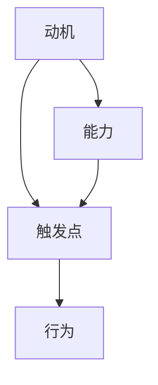

                 

# 运用福格模型培养团队良习惯

> 关键词：团队建设,行为改变,福格模型,行为激励,习惯养成,动机驱动,行为触发点,行为障碍,心理物理学

## 1. 背景介绍

### 1.1 问题由来
在企业中，团队的有效建设和管理一直是领导者关注的重点。然而，多数团队在建立过程中遇到了不少问题，诸如成员间沟通不畅、缺乏团队凝聚力、动力不足、协作效率低下等。这些问题不仅影响了团队的实际产出，也阻碍了企业的长远发展。那么，如何构建一个高效、协作的团队，成为现代企业亟待解决的重要课题。

### 1.2 问题核心关键点
团队建设的核心在于成员之间如何通过有效的沟通和协作，形成共同目标，并激励和维持团队成员的行为一致性。而福格模型作为一种行为科学的理论，为解决这一问题提供了一个行之有效的框架。福格模型强调了行为的三个关键要素：动机、能力、触发点。通过这三者的有机结合，可以有效地激励和引导团队成员养成并维持良好的工作习惯。

### 1.3 问题研究意义
掌握福格模型可以帮助领导者更好地理解和管理团队行为，制定科学的团队建设策略。从理论角度讲，可以更深入地理解行为心理学的内在机制，从而制定更有针对性的激励策略。从实践角度讲，有助于提升团队的协作效率和工作质量，促进企业的业务增长。

## 2. 核心概念与联系

### 2.1 核心概念概述

福格模型由B.J.福格教授提出，是一种基于行为科学的理论框架。该模型将行为的形成解释为动机、能力和触发点三个要素的联合作用。

- **动机**：是指个体产生某种行为的意愿，可以分为内在动机和外在动机。
- **能力**：是指执行某种行为所需的技能和资源，能力越强，执行难度越小。
- **触发点**：是指促使行为发生的外部线索或条件，常见的触发点包括时间、地点、人物等。

这三大要素相互影响，共同决定了行为的产生和维持。

### 2.2 核心概念原理和架构的 Mermaid 流程图(Mermaid 流程节点中不要有括号、逗号等特殊字符)



**流程图解析**：
- A（动机）指向B（能力）和C（触发点），表明动机驱动行为产生。
- B（能力）和C（触发点）双向连接，表示能力是行为的执行条件，触发点是行为的启动条件。
- B和C最终连接到D（行为），表明动机和能力结合触发点，最终导致行为的产生。

## 3. 核心算法原理 & 具体操作步骤

### 3.1 算法原理概述

福格模型提出了一种科学的方法来理解并优化个体的行为模式，这对于构建高效团队有重要指导意义。以下详细阐述福格模型在团队建设中的应用原理：

1. **理解团队成员动机**：通过了解成员的内心需求和兴趣，制定具有吸引力的激励机制。
2. **评估团队成员能力**：识别并提升团队成员所需的技能和资源。
3. **设计触发机制**：在适当的时间和地点，通过特定的事件或人物触发团队成员的行为。

这三个方面综合起来，可以帮助团队形成良好的工作习惯，并推动团队绩效的提升。

### 3.2 算法步骤详解

福格模型在团队建设中的应用，主要分为以下几个步骤：

**Step 1: 动机分析**
- **目标设定**：明确团队的总体目标和成员的个人目标。
- **动机调研**：通过问卷调查、一对一访谈等方式，了解团队成员的动机和需求。
- **激励措施**：根据调研结果，设计合理的激励措施，如奖励、晋升、培训等。

**Step 2: 能力评估**
- **技能盘点**：全面评估团队成员的技术技能和软技能，找出短板和提升空间。
- **资源调配**：合理分配资源，确保团队成员具备完成工作所需的一切条件。
- **能力提升**：通过内部培训、外部培训、导师制等手段，提升团队成员的能力。

**Step 3: 触发机制设计**
- **时间管理**：设计团队日程和里程碑，确保重要任务有足够的时间和资源进行。
- **空间布局**：优化工作环境，创建有利于协作的物理空间。
- **事件驱动**：设定关键节点的团队活动，增强团队凝聚力。

**Step 4: 持续优化**
- **反馈机制**：建立持续的反馈循环，及时调整激励措施和工作环境。
- **复盘分析**：定期评估团队目标和任务的完成情况，进行复盘分析。
- **迭代改进**：根据反馈和复盘结果，不断优化激励措施和触发机制。

### 3.3 算法优缺点

福格模型在团队建设中的应用具有以下优点：
- **系统性**：从动机、能力和触发点三个维度出发，全面考虑团队行为的形成机制。
- **科学性**：基于行为科学理论，有坚实的理论依据。
- **可操作性**：步骤清晰、操作性强，易于执行和优化。

同时，该模型也存在一些局限性：
- **复杂性**：涉及多个维度，需要综合分析和调整。
- **个体差异**：每个成员的动机、能力和需求各不相同，需要针对性地制定策略。
- **环境变化**：团队和外部环境的变化会影响模型效果，需要灵活调整。

### 3.4 算法应用领域

福格模型可以应用于各种规模和类型的团队建设中，特别是在以下领域：

- **研发团队**：推动创新和团队合作，解决技术难题。
- **销售团队**：提升销售业绩和客户满意度，促进业绩增长。
- **客户支持团队**：增强客户服务质量，提升用户满意度。
- **市场营销团队**：协调资源，提升品牌影响力和市场份额。
- **运营团队**：优化流程，提高效率和运营效果。

## 4. 数学模型和公式 & 详细讲解 & 举例说明

### 4.1 数学模型构建

福格模型基于行为科学的心理物理学理论，其中的关键公式为：

$$
B = M \times A \times E
$$

其中，$B$表示行为发生的概率，$M$为动机强度，$A$为行为能力，$E$为触发点强度。

### 4.2 公式推导过程

- **动机强度$M$**：动机强度越高，个体执行行为的意愿越强。可以通过问卷调研、访谈等方式量化。
- **行为能力$A$**：行为能力是指完成某个行为所需的技能和资源。可以通过技能盘点、资源评估等方式获得。
- **触发点强度$E$**：触发点强度是指促使行为发生的外部线索或条件。可以通过工作流程、团队活动等设定。

综合这三个要素，可以得到行为发生的概率。当动机、能力和触发点均处于最优状态时，行为发生的概率最高。

### 4.3 案例分析与讲解

以一个典型的软件开发团队为例，分析如何应用福格模型进行团队建设。

**动机分析**：
- 调研发现团队成员更倾向于追求技术成长和职业发展。
- 激励措施包括技术分享会、技术培训、晋升机会等。

**能力评估**：
- 技能盘点发现团队成员在特定编程语言和框架方面有所欠缺。
- 通过外部培训、内部导师制提升相关技能。

**触发机制设计**：
- 时间管理：设定每日站会、周复盘会议等。
- 空间布局：优化开放式办公环境，增强团队协作。
- 事件驱动：每月举行技术分享会，激励成员展示成果。

通过上述措施，团队成员的动机、能力和触发点均得到了改善，从而提升了团队的工作效果。

## 5. 项目实践：代码实例和详细解释说明

### 5.1 开发环境搭建

福格模型主要应用于管理策略的设计和执行，而非具体的代码开发。但在团队管理工具和激励系统开发中，可以考虑以下环境搭建：

- **Python环境**：使用Python进行数据分析和模型构建，便于快速迭代和测试。
- **数据库**：使用关系型数据库如MySQL或NoSQL数据库如MongoDB，记录团队成员的基本信息和行为数据。
- **Web框架**：使用Django或Flask等Web框架，搭建团队管理系统。
- **消息队列**：使用RabbitMQ或Kafka等消息队列，实现异步任务和触发机制的自动化。

### 5.2 源代码详细实现

以下是基于Python和Django框架的团队管理系统的部分代码实现：

```python
from django.shortcuts import render, redirect
from django.http import HttpResponse
from django.views.decorators.csrf import csrf_exempt
from .models import TeamMember, Motivation, Skills, Trigger
from .forms import MotivationForm, SkillsForm, TriggerForm

@csrf_exempt
def member_motivation(request):
    if request.method == 'POST':
        form = MotivationForm(request.POST)
        if form.is_valid():
            motivation = form.save()
            member = TeamMember.objects.get(id=request.POST['member_id'])
            member.motivation = motivation
            member.save()
            return redirect('home')
    else:
        form = MotivationForm()
    return render(request, 'member_motivation.html', {'form': form})

@csrf_exempt
def member_skills(request):
    if request.method == 'POST':
        form = SkillsForm(request.POST)
        if form.is_valid():
            skills = form.save()
            member = TeamMember.objects.get(id=request.POST['member_id'])
            member.skills = skills
            member.save()
            return redirect('home')
    else:
        form = SkillsForm()
    return render(request, 'member_skills.html', {'form': form})

@csrf_exempt
def member_trigger(request):
    if request.method == 'POST':
        form = TriggerForm(request.POST)
        if form.is_valid():
            trigger = form.save()
            member = TeamMember.objects.get(id=request.POST['member_id'])
            member.trigger = trigger
            member.save()
            return redirect('home')
    else:
        form = TriggerForm()
    return render(request, 'member_trigger.html', {'form': form})
```

以上代码展示了在Django中如何记录和更新团队成员的动机、技能和触发点信息。通过这种形式的管理系统，团队领导可以更加系统化地管理团队成员的行为和表现。

### 5.3 代码解读与分析

**动机管理**：
- `MemberMotivation`模型：记录每个团队成员的动机信息，包括工作目标、兴趣点等。
- `MotivationForm`表单：成员可以在线填写和更新动机信息。

**技能管理**：
- `MemberSkills`模型：记录团队成员的技术和软技能信息。
- `SkillsForm`表单：成员可以在线填写和更新技能信息。

**触发管理**：
- `MemberTrigger`模型：记录团队成员的工作触发点，如工作安排、会议时间等。
- `TriggerForm`表单：成员可以在线填写和更新触发点信息。

通过这些表单和模型，可以系统地收集和更新团队成员的信息，并为制定科学的激励策略和触发机制提供支持。

## 6. 实际应用场景

福格模型在实际应用中，已经在多个团队中取得了显著的效果。以下是一些典型的应用场景：

### 6.1 研发团队管理

在研发团队中，福格模型可以推动团队协作和创新。通过动机调研和技能评估，团队管理者可以了解成员的需求和不足，制定针对性的激励和培训措施，如技术分享会、编程竞赛等，从而激发团队的创新动力。

### 6.2 销售团队激励

销售团队的工作具有高度的竞争性和灵活性，福格模型可以设计有效的激励机制，如设定销售目标、销售竞赛等，通过定期复盘和反馈，提升团队成员的动力和能力。

### 6.3 客户支持团队优化

客户支持团队需要高效响应客户需求，福格模型可以优化工作流程和触发点设计，如设立服务时间窗口、客户反馈机制等，提升团队的服务质量和客户满意度。

## 7. 工具和资源推荐

### 7.1 学习资源推荐

要全面掌握福格模型在团队建设中的应用，以下资源推荐：

1. **《行为改变》（B.J.福格）**：作者本人撰写的理论书籍，深入浅出地介绍了行为科学和福格模型的理论基础和应用案例。
2. **《高效能团队》（Patrick Lencioni）**：探讨团队协作和领导力的经典作品，提供了许多实际案例和工具方法。
3. **《团队动力学》（Johannes Le Batard）**：结合心理学和组织行为学的经典著作，详细分析了团队动态和行为机制。
4. **Coursera《行为科学与管理》课程**：由杜克大学开设的免费在线课程，介绍了行为科学的基本原理和应用方法。
5. **Udemy《团队建设与激励》课程**：通过具体案例和实战演练，帮助学员掌握团队建设的技巧和方法。

### 7.2 开发工具推荐

以下是一些工具推荐，用于福格模型的应用开发和管理：

1. **Django**：Python的Web框架，可以方便地构建和管理团队管理系统。
2. **Flask**：轻量级的Web框架，适用于小型团队管理系统的开发。
3. **SQLite**：轻量级的关系型数据库，适用于小规模的数据存储和管理。
4. **Redis**：内存数据库，适用于高并发的数据访问和缓存。
5. **Docker**：容器化技术，便于团队管理系统的部署和迁移。

### 7.3 相关论文推荐

福格模型在行为科学和管理学领域有着广泛的应用和研究。以下是一些相关论文推荐：

1. **《小行动，大改变》（B.J.福格）**：作者本人撰写的论文，详细探讨了行为改变的心理物理学原理。
2. **《动机、能力和触发点：福格模型的行为科学》（B.J.福格）**：作者在行为科学杂志上发表的文章，系统地介绍了福格模型的理论和应用。
3. **《行为激励的神经机制》（Vianney,B.等）**：神经科学和行为科学的交叉研究，探讨了激励机制的神经基础。
4. **《团队协作中的行为改变》（Thomas,s.等）**：研究团队协作中行为改变的机制和策略。
5. **《数字时代的激励机制》（Daniel,p.等）**：探讨在数字时代如何设计有效的激励机制，促进团队协作和创新。

## 8. 总结：未来发展趋势与挑战

### 8.1 总结

福格模型提供了一种科学、系统的方法来理解和优化团队行为。通过动机、能力和触发点三个维度的综合考虑，福格模型为团队建设提供了有力的理论支持和实践指导。在实际应用中，已经展示了其显著的效果和普适性。

### 8.2 未来发展趋势

展望未来，福格模型在团队建设中的应用将呈现以下几个发展趋势：

1. **智能化**：结合人工智能和机器学习技术，实现动态调整激励策略和触发机制，提升团队适应性和灵活性。
2. **数据驱动**：通过大数据分析和行为数据挖掘，精准识别团队成员的需求和动机，制定更加个性化的激励措施。
3. **多维融合**：与其他管理理论和方法结合，如敏捷管理、精益管理等，形成更加全面和科学的管理体系。
4. **全球化**：不同文化背景下的团队管理，福格模型提供了有力的工具和方法。
5. **多元化**：适应不同规模和类型的团队，从个体到大型企业，均可应用福格模型进行团队建设和管理。

### 8.3 面临的挑战

尽管福格模型在团队建设中有着广泛的应用，但仍然面临一些挑战：

1. **数据隐私**：在收集和分析团队成员的数据时，需要严格遵守隐私保护法规。
2. **文化差异**：不同文化背景下的团队管理，需要灵活调整激励策略和触发机制。
3. **个性化需求**：每个团队成员的需求和动机各不相同，需要个性化定制激励措施。
4. **执行困难**：激励措施的设计和执行需要高度的跨部门协作和资源投入。
5. **持续优化**：团队动态变化，激励策略和触发机制需要持续优化和调整。

### 8.4 研究展望

未来，福格模型需要在以下几个方面进一步探索和突破：

1. **数据融合与分析**：结合大数据分析和人工智能技术，实现对团队行为的精准分析和预测。
2. **激励机制优化**：开发更加智能和个性化的激励机制，提升团队成员的动力和效率。
3. **全球化应用**：开发适用于不同文化背景和语言环境的激励策略。
4. **跨领域融合**：与其他管理理论和方法结合，形成更加全面和科学的管理体系。
5. **政策法规合规**：确保激励措施的合法合规，保护团队成员的隐私和权益。

## 9. 附录：常见问题与解答

**Q1：如何理解和应用福格模型？**

A: 理解福格模型，需要从动机、能力和触发点三个维度出发，全面分析和设计团队行为。通过问卷调研、访谈等方式收集团队成员的动机和需求，评估其能力和资源，设计合理的触发机制，以实现行为的持续优化和改进。

**Q2：福格模型在团队建设中有哪些具体应用？**

A: 福格模型可以应用于动机分析、能力评估和触发机制设计等环节。例如，通过动机调研和技能评估，制定针对性的激励和培训措施，优化工作流程和触发点设计，提升团队成员的动力和能力。

**Q3：如何设计有效的激励策略？**

A: 设计激励策略时，需要考虑团队成员的动机和需求，制定个性化的激励措施。可以采用奖励、晋升、培训、文化活动等多种方式，并结合动态反馈机制，持续优化激励效果。

**Q4：福格模型在不同文化背景下的应用差异有哪些？**

A: 在不同文化背景下，团队成员的动机、能力和触发点各不相同，需要灵活调整激励策略和触发机制。例如，在一些强调集体主义的地区，可能需要更多团队合作和协同激励；在一些强调个人主义的文化中，可能需要更多个性化的激励措施。

**Q5：福格模型在激励策略设计中需要注意哪些问题？**

A: 设计激励策略时，需要注意激励的公平性、透明性和即时性。确保激励措施公开透明，对所有团队成员一视同仁，及时反馈激励效果，以持续改进激励策略。

通过福格模型，我们可以更好地理解和管理团队行为，制定科学的激励措施和触发机制，提升团队的工作效果和满意度。然而，在实际应用中，还需要结合具体情境和团队特点，灵活调整和优化激励策略，确保福格模型在团队建设中发挥最大效用。

---

作者：禅与计算机程序设计艺术 / Zen and the Art of Computer Programming

