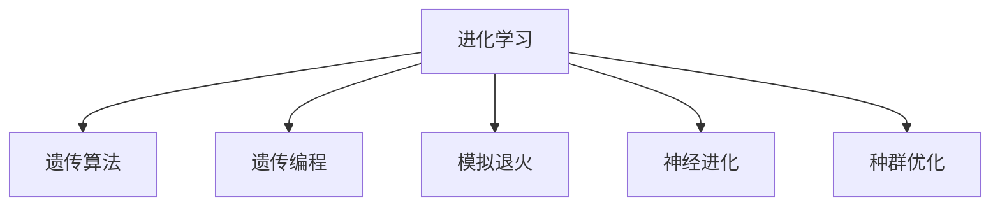

                 

# 进化时代：人工智能的未来

## 1. 背景介绍

### 1.1 问题由来
人工智能（AI）作为21世纪最重要的科技趋势之一，正在深刻改变着人类社会的方方面面。从智能机器人到自动驾驶汽车，从自然语言处理到图像识别，AI技术的广泛应用已经成为新的生产力源泉。然而，AI的发展也面临着诸多挑战，如数据隐私、算法公平、技术鲁棒性等，这些问题制约着AI技术的进一步普及和应用。

### 1.2 问题核心关键点
为了解决这些挑战，学术界和产业界都在积极探索AI技术的新范式和新方向。当前，AI技术正处于从“深度学习”到“广义学习”的转变过程中，广义学习旨在从更广泛的视角和方法上提升AI技术，使其能够更好地适应复杂多变的环境。本文聚焦于广义学习中的进化学习（Evolutionary Learning）范式，探讨其在AI技术发展中的潜在价值和应用前景。

### 1.3 问题研究意义
进化学习是一种借鉴自然界进化规律的AI学习范式，通过模拟自然界的进化过程，实现对环境的适应和优化。该范式具有以下优势：
1. **自适应性**：进化学习能够动态调整模型参数，以适应环境变化，具有较强的鲁棒性。
2. **全局优化**：进化算法能够搜索到全局最优解，避免陷入局部最优。
3. **鲁棒性**：进化算法能够处理噪声数据和不确定性，提高模型的泛化能力。
4. **多样性**：进化学习能够生成多种解，提供更多可供选择的模型。

进化学习在解决传统深度学习无法有效应对的复杂优化问题和鲁棒性问题上显示出巨大潜力，有望成为未来AI技术发展的重要方向。

## 2. 核心概念与联系

### 2.1 核心概念概述

为更好地理解进化学习，本节将介绍几个密切相关的核心概念：

- **进化学习**：一种基于自然界进化规律的AI学习范式，通过模拟自然界的进化过程，实现对环境的适应和优化。
- **遗传算法**：一种常用的进化算法，通过选择、交叉、变异等操作，生成新的个体以逐步优化解。
- **遗传编程**：一种将进化算法应用于程序代码生成的方法，能够生成复杂的程序结构。
- **模拟退火**：一种随机化的优化算法，通过模拟物质退火过程，实现全局最优解的搜索。
- **神经进化**：将进化算法应用于神经网络的学习过程，实现神经网络结构的自动优化。
- **种群优化**：一种基于群体的进化算法，通过模拟种群的行为，搜索最优解。

这些核心概念之间的逻辑关系可以通过以下Mermaid流程图来展示：



这个流程图展示了的核心概念及其之间的关系：

1. 进化学习是基础，通过进化算法模拟自然界的进化过程。
2. 遗传算法、遗传编程、模拟退火、神经进化、种群优化等是进化学习的具体实现方法，提供不同的优化策略和算法。
3. 这些算法在求解不同问题时表现出不同的优势，共同构成了进化学习的广泛应用场景。

## 3. 核心算法原理 & 具体操作步骤

### 3.1 算法原理概述

进化学习基于自然界的进化规律，通过模拟自然选择、遗传变异等机制，实现对环境的适应和优化。其核心思想是：在给定的搜索空间中，通过一系列随机生成的个体（解），不断进化和优化，最终获得最优解。

具体来说，进化学习通过以下几个关键步骤实现对环境的适应和优化：

1. **初始化**：随机生成一组初始解，构成种群。
2. **适应度评估**：对每个解进行适应度评估，通常使用目标函数计算解与目标的差距。
3. **选择操作**：根据适应度评估结果，选择适应度较高的解进行复制和交叉操作，生成下一代解。
4. **交叉操作**：对选定的解进行交叉操作，生成新的解。
5. **变异操作**：对新生成的解进行变异操作，引入新的基因，增强解的多样性。
6. **迭代优化**：重复执行选择、交叉、变异操作，直至满足预设的收敛条件。

### 3.2 算法步骤详解

以遗传算法为例，具体描述进化学习的主要步骤：

**Step 1: 初始化种群**
- 随机生成一组初始解，构成初始种群。每个解代表一个可能的参数向量。

**Step 2: 适应度评估**
- 计算每个解的适应度值，适应度值通常与目标函数的负值成正比。适应度值越高，表示解的性能越好。

**Step 3: 选择操作**
- 根据适应度值选择解，适应度较高的解被选中进行复制和交叉操作。
- 选择方法包括轮盘赌选择、锦标赛选择等，目的是保留性能较好的解，增强种群的多样性。

**Step 4: 交叉操作**
- 对选中的解进行交叉操作，生成新的解。交叉方法包括单点交叉、多点交叉等，目的是增强解的多样性，并保持解的良好性质。

**Step 5: 变异操作**
- 对新生成的解进行变异操作，引入新的基因，增强解的多样性。变异方法包括位变异、交换变异等，目的是避免种群陷入局部最优。

**Step 6: 迭代优化**
- 重复执行选择、交叉、变异操作，直至满足预设的收敛条件。

### 3.3 算法优缺点

进化学习具有以下优点：
1. **全局优化**：进化算法能够搜索到全局最优解，避免陷入局部最优。
2. **鲁棒性**：进化算法能够处理噪声数据和不确定性，提高模型的泛化能力。
3. **自适应性**：进化算法能够动态调整模型参数，以适应环境变化，具有较强的鲁棒性。
4. **多样性**：进化算法能够生成多种解，提供更多可供选择的模型。

同时，该算法也存在一定的局限性：
1. **计算复杂度高**：进化算法通常需要较长的运行时间，特别是在搜索空间较大的情况下。
2. **参数调参困难**：进化算法的性能高度依赖于参数的选择，参数设置不当可能导致算法无法收敛。
3. **局部搜索能力不足**：进化算法在局部搜索能力上不如梯度优化算法，难以处理复杂函数曲面。
4. **易受噪声影响**：进化算法对噪声数据的敏感性较高，可能导致算法性能下降。

尽管存在这些局限性，但就目前而言，进化学习在处理复杂优化问题和鲁棒性问题上显示出巨大潜力，成为未来AI技术发展的重要方向。

### 3.4 算法应用领域

进化学习在多个领域中得到了广泛应用，以下是几个典型的应用场景：

- **优化问题**：在工业、金融、物流等领域，进化学习用于求解复杂的优化问题，如供应链优化、投资组合优化、交通网络优化等。
- **机器学习**：在机器学习中，进化学习用于参数优化、模型选择和特征选择等任务。
- **神经网络**：进化学习用于神经网络的自动设计，优化网络结构、连接权重和学习率等参数。
- **信号处理**：在信号处理领域，进化学习用于滤波器设计、频谱估计和信号压缩等任务。
- **机器人控制**：在机器人控制中，进化学习用于路径规划、动作优化和传感器融合等任务。

随着进化学习技术的不断成熟，相信其将在更广泛的领域得到应用，为解决复杂问题提供新的思路和方法。

## 4. 数学模型和公式 & 详细讲解  
### 4.1 数学模型构建

本节将使用数学语言对进化学习的主要模型进行更加严格的刻画。

假设搜索空间为 $\mathcal{X}$，目标函数为 $f: \mathcal{X} \rightarrow \mathbb{R}$。进化算法通过模拟自然界的进化过程，在搜索空间 $\mathcal{X}$ 上搜索最优解 $x^*$，使得 $f(x^*)$ 最小。

进化算法的核心是种群（Population），由一组解组成，每个解表示一个可能的参数向量。种群的演化过程包括以下步骤：

1. **初始化种群**：随机生成一组初始解 $P_0=\{x_1, x_2, ..., x_{|P_0|}\}$。
2. **适应度评估**：对每个解 $x_i$ 计算其适应度值 $f(x_i)$。
3. **选择操作**：根据适应度值 $f(x_i)$ 选择解，适应度较高的解被选中进行复制和交叉操作。
4. **交叉操作**：对选中的解进行交叉操作，生成新的解 $x_{i,1}, x_{i,2}, ..., x_{i,k}$。
5. **变异操作**：对新生成的解进行变异操作，引入新的基因，增强解的多样性。
6. **迭代优化**：重复执行选择、交叉、变异操作，直至满足预设的收敛条件。

### 4.2 公式推导过程

以遗传算法为例，推导其核心公式。

假设种群大小为 $|P|$，每个解的基因数为 $n$。设 $x_i=(x_{i,1}, x_{i,2}, ..., x_{i,n})$ 为第 $i$ 个解的基因向量，其适应度值为 $f(x_i)$。

1. **选择操作**：
   - 适应度较高的解被选中的概率与其适应度成正比，即选择概率为 $p_i = \frac{f(x_i)}{\sum_{j=1}^{|P|} f(x_j)}$。
   - 通过轮盘赌选择，随机从解集中选出两个解进行交叉操作。

2. **交叉操作**：
   - 单点交叉：随机选取交叉点 $c$，将两个解的基因向量进行交叉操作，生成两个新的解。
   - 多点交叉：在多个交叉点处进行交叉操作，生成多个新的解。

3. **变异操作**：
   - 位变异：随机选取基因位进行变异操作，生成新的解。
   - 交换变异：随机选取两个基因进行交换操作，生成新的解。

### 4.3 案例分析与讲解

以一个简单的例子来说明进化算法的工作原理。假设目标函数为 $f(x) = (x-3)^2$，搜索空间为 $[0, 10]$。

1. **初始化种群**：随机生成一组初始解 $P_0=\{x_1, x_2, ..., x_{|P_0|}\}$。
2. **适应度评估**：计算每个解的适应度值 $f(x_i)$。
3. **选择操作**：根据适应度值 $f(x_i)$ 选择解，适应度较高的解被选中进行复制和交叉操作。
4. **交叉操作**：对选中的解进行交叉操作，生成新的解 $x_{i,1}, x_{i,2}, ..., x_{i,k}$。
5. **变异操作**：对新生成的解进行变异操作，引入新的基因，增强解的多样性。
6. **迭代优化**：重复执行选择、交叉、变异操作，直至满足预设的收敛条件。

通过上述步骤，进化算法能够逐步优化解集，最终找到目标函数的最小值。

## 5. 项目实践：代码实例和详细解释说明
### 5.1 开发环境搭建

在进行进化学习实践前，我们需要准备好开发环境。以下是使用Python进行遗传算法开发的环境配置流程：

1. 安装Anaconda：从官网下载并安装Anaconda，用于创建独立的Python环境。

2. 创建并激活虚拟环境：
```bash
conda create -n genetic-env python=3.8 
conda activate genetic-env
```

3. 安装必要的库：
```bash
pip install numpy scipy matplotlib scikit-learn
```

完成上述步骤后，即可在`genetic-env`环境中开始遗传算法开发。

### 5.2 源代码详细实现

下面是一个简单的遗传算法实现，用于求解目标函数 $f(x) = (x-3)^2$ 的最小值。

```python
import numpy as np
import matplotlib.pyplot as plt

# 定义目标函数
def fitness(x):
    return (x - 3) ** 2

# 定义选择操作
def selection(population, fitness_values):
    # 选择概率
    probabilities = fitness_values / np.sum(fitness_values)
    # 随机选择解
    selected = np.random.choice(len(population), size=len(population), p=probabilities)
    return population[selected]

# 定义交叉操作
def crossover(parent1, parent2):
    crossover_point = np.random.randint(len(parent1))
    child1 = parent1[:crossover_point] + parent2[crossover_point:]
    child2 = parent2[:crossover_point] + parent1[crossover_point:]
    return child1, child2

# 定义变异操作
def mutation(chromosome):
    mutation_point = np.random.randint(len(chromosome))
    chromosome[mutation_point] = np.random.uniform(0, 10)
    return chromosome

# 定义进化算法
def genetic_algorithm(fitness_function, population_size, num_generations):
    population = np.random.uniform(0, 10, size=(population_size, 1))
    fitness_values = np.array([fitness(x) for x in population])
    best_fitness = np.max(fitness_values)
    best_solution = population[np.argmax(fitness_values)]
    
    for generation in range(num_generations):
        # 选择操作
        selected_population = selection(population, fitness_values)
        # 交叉操作
        new_population = []
        for i in range(0, population_size, 2):
            parent1, parent2 = selected_population[i:i+2]
            child1, child2 = crossover(parent1, parent2)
            # 变异操作
            child1 = mutation(child1)
            child2 = mutation(child2)
            new_population.append(child1)
            new_population.append(child2)
        # 更新种群
        population = np.vstack([population, selected_population])
        fitness_values = np.append(fitness_values, np.array([fitness(x) for x in new_population]))
        best_fitness = np.max(fitness_values)
        best_solution = new_population[np.argmax(fitness_values)]
    
    return best_solution, best_fitness

# 测试
num_generations = 100
best_solution, best_fitness = genetic_algorithm(fitness, 50, num_generations)
plt.plot(range(num_generations), [best_fitness for _ in range(num_generations)])
plt.xlabel('Generations')
plt.ylabel('Best Fitness')
plt.show()
```

以上代码实现了遗传算法的核心步骤，并在测试时输出了适应度值的变化曲线。

### 5.3 代码解读与分析

让我们再详细解读一下关键代码的实现细节：

1. **目标函数**：定义了一个简单的目标函数 $f(x) = (x-3)^2$，用于评估种群中每个解的适应度。
2. **选择操作**：通过轮盘赌选择法选择适应度较高的解，生成新的解。
3. **交叉操作**：随机选择两个解，并进行单点交叉操作，生成两个新的解。
4. **变异操作**：随机选择基因位，并进行位变异操作，生成新的解。
5. **进化算法**：在每个代内执行选择、交叉、变异操作，生成下一代种群。

## 6. 实际应用场景

### 6.1 智能优化

在工业、物流等领域，智能优化问题成为常见需求。传统的优化方法如梯度下降等在处理复杂非线性问题时表现不佳，进化学习成为理想的解决方案。通过进化算法，可以在复杂空间中高效搜索最优解，广泛应用于供应链优化、投资组合优化等任务。

**案例**：某电商公司需要优化物流配送路线，以最小化总运输成本。利用遗传算法在配送路线空间中搜索最优解，能够在合理的时间内找到最优解，大幅降低物流成本。

### 6.2 机器学习

在机器学习中，进化算法用于参数优化、模型选择和特征选择等任务。传统的梯度优化方法在处理高维空间和复杂函数曲面时表现不佳，进化算法能够从更广泛的搜索空间中找到更好的解。

**案例**：某金融公司需要预测股票价格，利用遗传算法优化模型参数，能够在更广泛的模型空间中找到更好的预测性能。

### 6.3 神经网络设计

在神经网络设计中，进化算法用于自动设计网络结构和连接权重。传统的神经网络设计需要大量人工经验和调试，进化算法能够自动生成和优化神经网络结构，提高神经网络的设计效率和性能。

**案例**：某公司需要设计一个图像识别模型，利用遗传算法自动设计网络结构，能够在较短的时间内找到最优的网络结构。

### 6.4 生物医学

在生物医学领域，进化算法用于模拟基因突变和进化过程，分析基因与疾病的关系。传统的统计分析方法无法处理大规模基因数据，进化算法能够处理复杂基因数据，提高基因分析的准确性。

**案例**：某医院需要分析基因与疾病的相关性，利用遗传算法模拟基因突变过程，分析基因与疾病的关系。

### 6.5 自动化设计

在自动化设计领域，进化算法用于优化机械结构、电路设计等。传统的优化方法在处理复杂几何和拓扑问题时表现不佳，进化算法能够高效处理复杂设计问题，提高设计效率。

**案例**：某公司需要设计一个新型机器，利用遗传算法优化机器结构和材料选择，能够在较短的时间内找到最优设计方案。

## 7. 工具和资源推荐

### 7.1 学习资源推荐

为了帮助开发者系统掌握进化学习的理论基础和实践技巧，这里推荐一些优质的学习资源：

1. 《进化算法与优化问题》系列书籍：系统介绍了进化算法的基本原理、应用方法和优化技巧，适合初学者入门。
2. 《遗传算法与计算智能》课程：由知名大学教授授课，涵盖了遗传算法的基本概念和应用案例。
3. 《人工免疫系统》系列论文：通过人工免疫系统的灵感，提出了新的进化算法，为进化学习提供了新的思路。
4. 《进化学习算法与应用》书籍：系统介绍了多种进化算法的原理和应用，适合进阶学习者。
5. 《智能计算》期刊：收录了大量关于进化学习、遗传算法等智能计算领域的最新研究成果，适合深入研究。

通过对这些资源的学习实践，相信你一定能够快速掌握进化学习的基本概念和核心技术，并用于解决实际的优化问题。

### 7.2 开发工具推荐

高效的开发离不开优秀的工具支持。以下是几款用于进化算法开发的常用工具：

1. DEAP：一个Python库，提供了多种进化算法的实现，支持多种适应度评估和选择策略。
2. PyEvo：一个Python库，提供了遗传算法、进化策略等算法的实现，支持多种变异和交叉策略。
3. NeuroEvo：一个Python库，专门用于进化神经网络，支持多种神经网络和进化策略。
4. Optuna：一个超参数优化库，支持多种优化算法，如贝叶斯优化、随机搜索等，适用于超参数优化。
5. Genetic Algorithm Toolbox（GATB）：一个MATLAB库，提供了多种进化算法的实现，支持多种适应度评估和选择策略。

合理利用这些工具，可以显著提升进化算法的开发效率，加快创新迭代的步伐。

### 7.3 相关论文推荐

进化学习在多个领域中得到了广泛研究，以下是几篇奠基性的相关论文，推荐阅读：

1. A New Optimisation Paradigm for Feature Selection Using Genetic Algorithms：提出了使用遗传算法进行特征选择的思路，为进化学习在特征选择中的应用提供了新的方法。
2. Simulated Annealing：提出了模拟退火算法，通过模拟物质退火过程，实现全局最优解的搜索。
3. Evolutionary Computation：介绍了进化计算的基本概念和应用方法，为进化学习提供了理论基础。
4. NeuroEvolution：介绍了进化算法在神经网络中的应用，为进化学习在神经网络设计中的应用提供了新的思路。
5. Genetic Programming：介绍了遗传编程的基本概念和应用方法，为进化学习在程序生成中的应用提供了新的方法。

这些论文代表了大进化学习的发展脉络。通过学习这些前沿成果，可以帮助研究者把握学科前进方向，激发更多的创新灵感。

## 8. 总结：未来发展趋势与挑战

### 8.1 总结

本文对进化学习在AI技术中的潜在价值和应用前景进行了全面系统的介绍。首先阐述了进化学习的基本原理和核心算法，明确了进化学习在AI技术发展中的独特价值。其次，从原理到实践，详细讲解了进化学习的主要步骤和实现方法，给出了进化算法的完整代码实例。同时，本文还广泛探讨了进化学习在智能优化、机器学习、神经网络设计等多个领域的应用前景，展示了进化学习范式的广阔应用空间。此外，本文精选了进化学习的各类学习资源，力求为读者提供全方位的技术指引。

通过本文的系统梳理，可以看到，进化学习在处理复杂优化问题和鲁棒性问题上展现出巨大潜力，有望成为未来AI技术发展的重要方向。未来，伴随进化学习技术的不断成熟，相信其将在更广泛的领域得到应用，为解决复杂问题提供新的思路和方法。

### 8.2 未来发展趋势

展望未来，进化学习技术将呈现以下几个发展趋势：

1. **多模态进化学习**：将进化学习应用于多模态数据，如视觉、音频、文本等，实现多模态数据的协同优化。
2. **自适应进化学习**：通过自适应策略，动态调整进化算法参数，增强算法的鲁棒性和自适应性。
3. **元进化学习**：利用进化算法优化进化算法本身，实现算法的优化和进化，提升算法性能。
4. **分布式进化学习**：通过分布式计算，提高进化算法的计算效率和搜索能力。
5. **深度学习与进化学习结合**：将进化学习应用于深度学习模型的参数优化和结构设计，实现模型的优化和进化。
6. **应用场景多样化**：进化学习将应用于更多领域，如工业、金融、医疗等，解决复杂优化问题和鲁棒性问题。

以上趋势凸显了进化学习技术的广阔前景。这些方向的探索发展，必将进一步提升进化学习技术的性能和应用范围，为解决复杂问题提供新的思路和方法。

### 8.3 面临的挑战

尽管进化学习在处理复杂优化问题和鲁棒性问题上显示出巨大潜力，但在迈向更加智能化、普适化应用的过程中，它仍面临着诸多挑战：

1. **计算复杂度高**：进化算法通常需要较长的运行时间，特别是在搜索空间较大的情况下。
2. **参数调参困难**：进化算法的性能高度依赖于参数的选择，参数设置不当可能导致算法无法收敛。
3. **局部搜索能力不足**：进化算法在局部搜索能力上不如梯度优化算法，难以处理复杂函数曲面。
4. **易受噪声影响**：进化算法对噪声数据的敏感性较高，可能导致算法性能下降。
5. **多样性问题**：进化算法在搜索过程中可能出现种群多样性不足的问题，导致算法过早收敛。

这些挑战需要在未来的研究中不断突破和解决，以确保进化学习技术能够更好地应用于实际问题。

### 8.4 未来突破

面对进化学习面临的这些挑战，未来的研究需要在以下几个方面寻求新的突破：

1. **高效并行计算**：利用并行计算和分布式计算，提高进化算法的计算效率，缩短算法运行时间。
2. **自适应进化策略**：通过自适应策略，动态调整进化算法参数，增强算法的鲁棒性和自适应性。
3. **多模态协同优化**：将进化学习应用于多模态数据，实现多模态数据的协同优化，提高算法的泛化能力。
4. **元进化算法**：利用元进化算法优化进化算法本身，实现算法的优化和进化，提升算法性能。
5. **混合优化策略**：将进化算法与其他优化算法结合，如梯度优化、贝叶斯优化等，提高算法的搜索能力和收敛速度。
6. **深度学习与进化学习结合**：将进化学习应用于深度学习模型的参数优化和结构设计，实现模型的优化和进化。

这些研究方向将为进化学习技术带来新的突破，推动其走向更加智能化、普适化的应用场景。只有勇于创新、敢于突破，才能不断拓展进化学习技术的边界，让智能技术更好地造福人类社会。

## 9. 附录：常见问题与解答

**Q1：进化学习与传统优化方法相比，有哪些优势？**

A: 进化学习具有以下优势：
1. **全局优化**：进化算法能够搜索到全局最优解，避免陷入局部最优。
2. **鲁棒性**：进化算法能够处理噪声数据和不确定性，提高模型的泛化能力。
3. **自适应性**：进化算法能够动态调整模型参数，以适应环境变化，具有较强的鲁棒性。
4. **多样性**：进化算法能够生成多种解，提供更多可供选择的模型。

**Q2：如何选择进化算法中的关键参数？**

A: 进化算法中的关键参数包括种群大小、交叉率、变异率、选择策略等。选择合适的参数需要根据具体问题和搜索空间进行调整。一般来说，种群大小越大，搜索能力越强，但计算成本也越高。交叉率和变异率需要根据问题的复杂性和搜索空间的维度进行调整，以保持种群的多样性和适应度。选择策略需要根据适应度分布进行调整，以保证选择操作的公平性和有效性。

**Q3：进化学习在处理数据噪声问题上有哪些优势？**

A: 进化学习具有较好的鲁棒性，能够处理噪声数据和不确定性。其通过模拟自然界的进化过程，通过选择、交叉、变异等操作，能够逐步优化解集，找到最优解。即使在有噪声数据的情况下，进化算法也能够通过多次迭代，逐步去除噪声，找到最优解。

**Q4：进化学习在实际应用中需要注意哪些问题？**

A: 进化学习在实际应用中需要注意以下问题：
1. **计算复杂度高**：进化算法通常需要较长的运行时间，特别是在搜索空间较大的情况下。
2. **参数调参困难**：进化算法的性能高度依赖于参数的选择，参数设置不当可能导致算法无法收敛。
3. **局部搜索能力不足**：进化算法在局部搜索能力上不如梯度优化算法，难以处理复杂函数曲面。
4. **易受噪声影响**：进化算法对噪声数据的敏感性较高，可能导致算法性能下降。

**Q5：进化学习与深度学习结合，有哪些应用场景？**

A: 进化学习与深度学习结合，有以下应用场景：
1. **深度学习模型参数优化**：利用进化算法优化深度学习模型的参数，提升模型性能。
2. **深度学习模型结构设计**：利用进化算法自动设计深度学习模型结构，提高模型设计效率。
3. **深度学习模型超参数优化**：利用进化算法优化深度学习模型的超参数，提升模型性能。
4. **深度学习模型自适应调整**：利用进化算法对深度学习模型进行自适应调整，提高模型适应环境变化的能力。

这些应用场景展示了进化学习与深度学习结合的强大潜力，为深度学习模型的优化和进化提供了新的思路和方法。

---

作者：禅与计算机程序设计艺术 / Zen and the Art of Computer Programming

