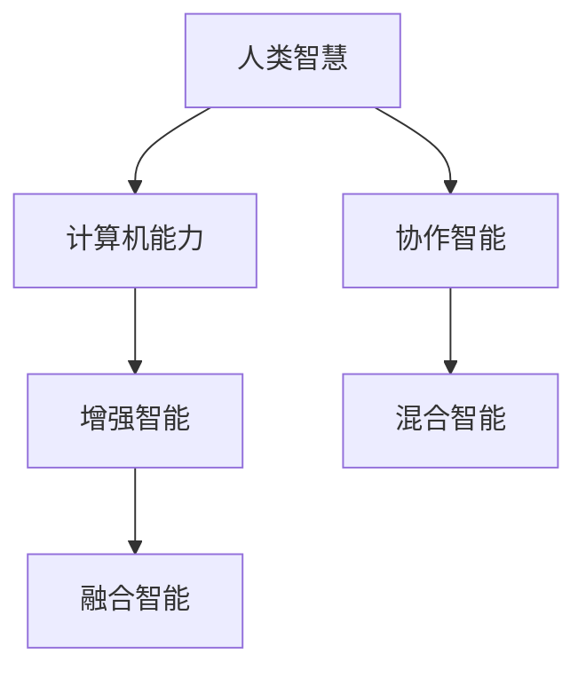

                 

# 连接人类智慧的纽带：人类计算的协作精神

> 关键词：

## 1. 背景介绍

在数字化飞速发展的今天，计算机技术已经成为连接人类智慧的纽带。从简单的计算器到复杂的AI算法，计算机已经广泛应用于各个领域，极大提高了人类工作效率和生活品质。然而，尽管计算机技术日益强大，它依然无法取代人类独特的创造力和智慧。本文将探讨人类计算的协作精神，以及计算机如何作为人类智慧的延伸，共同推动社会进步。

## 2. 核心概念与联系

### 2.1 核心概念概述

为了更好地理解人类计算的协作精神，首先需要对几个核心概念进行梳理：

- **人类计算(Human Computation)**：指人类利用自身的计算能力和创造力，与计算机系统合作，共同完成复杂的计算任务。人类计算强调“人机协作”，利用计算机处理海量数据，同时让人类设计师、工程师、艺术家等创造性思维融入其中。

- **协作智能(Co-Creation Intelligence)**：指人类与智能系统合作，共同开发出新的智能产品、服务、算法等。协作智能强调“共同创造”，即在人类智慧与计算机能力互补的基础上，创造出超越两者单独能力的智能成果。

- **混合智能(Hybrid Intelligence)**：指结合人类智慧和人工智能能力，形成的新一代智能形式。混合智能强调“优势互补”，即在优势发挥各自特长基础上，通过有机结合，创造出更强大的智能体系。

- **增强智能(Enhanced Intelligence)**：指通过增强现实、虚拟现实等技术手段，扩展人类计算能力，增强人类智慧和感知能力的智能形式。增强智能强调“提升人类能力”，即通过技术手段提升人类的感知、理解和创造能力。

- **融合智能(Fusion Intelligence)**：指将人类智能与机器智能融合，形成更强大的整体智能系统。融合智能强调“无缝整合”，即在技术层面实现人机无缝整合，发挥各自优势。

### 2.2 核心概念原理和架构的 Mermaid 流程图



这个流程图展示了人类智慧与计算机能力如何通过协作、增强、混合和融合，形成新的智能形式。

## 3. 核心算法原理 & 具体操作步骤

### 3.1 算法原理概述

基于人类计算的协作精神，计算机技术与人类智慧在算法层面可以实现有机结合。具体来说，可以通过以下几种方式：

- **分布式协作**：利用计算机网络，将复杂的计算任务分解成多个子任务，分配给多个计算节点协同完成。

- **人机交互**：设计友好的人机界面，让人类用户通过自然语言、图像等形式，与计算机系统进行交互，共同完成复杂任务。

- **增强现实**：通过AR技术，增强人类感知能力，提供更丰富的计算环境，辅助人类进行复杂决策。

- **融合学习**：通过人机协作学习，结合人类知识和机器学习算法，不断优化算法模型，提升系统性能。

### 3.2 算法步骤详解

具体算法步骤如下：

1. **任务分解**：将复杂计算任务分解成多个子任务，由计算机负责数据处理，人类负责设计、决策和创意。

2. **协同计算**：利用分布式计算技术，将子任务分配给多个计算节点，协同完成。

3. **交互设计**：设计友好的人机交互界面，使用户能够直观理解任务状态，并提出优化建议。

4. **增强现实**：通过AR技术，提供更加沉浸式的计算环境，增强人类感知和理解能力。

5. **融合学习**：结合人类知识和机器学习算法，不断优化计算模型，提升系统性能。

### 3.3 算法优缺点

人类计算协作算法的主要优点包括：

- **高效协同**：通过分布式计算，提升计算效率，快速完成任务。

- **人机互补**：充分发挥人类智慧和计算机能力，弥补各自不足。

- **增强现实**：通过AR技术，提升人类感知和决策能力。

- **持续学习**：通过人机协作学习，不断优化算法，提升系统性能。

然而，该算法也存在以下缺点：

- **依赖网络**：需要稳定、高速的网络支持，否则计算效率会受到影响。

- **交互复杂**：设计友好的交互界面需要大量时间和精力。

- **数据隐私**：人机协作过程中，涉及大量数据交换，可能导致隐私泄露。

### 3.4 算法应用领域

基于人类计算协作精神的算法在多个领域得到广泛应用，包括：

- **科学计算**：如天气预测、天体物理研究、药物发现等，通过人机协作完成复杂计算。

- **金融分析**：如股票预测、风险评估、市场分析等，利用计算机处理大量数据，人类进行分析和决策。

- **医疗诊断**：如影像分析、基因组学研究、疾病预测等，结合医学知识和机器学习，提高诊断准确率。

- **创意设计**：如工业设计、建筑设计、游戏开发等，利用计算机生成初步设计方案，人类进行优化和调整。

- **智能制造**：如智能机器人、自动化生产线等，结合计算机控制和人类设计，实现高效生产。

## 4. 数学模型和公式 & 详细讲解 & 举例说明

### 4.1 数学模型构建

本节将使用数学语言对人类计算协作的算法模型进行严谨构建。

记人类智慧为 $H$，计算机能力为 $C$。定义协作智能 $I$ 为 $I=H \times C$，表示人类智慧和计算机能力相乘的结果。增强智能 $E$ 定义为 $E=H+C$，表示人类智慧和计算机能力的加和。混合智能 $M$ 定义为 $M=H/C+C/H$，表示人类智慧和计算机能力相除的结果。融合智能 $F$ 定义为 $F=H \otimes C$，表示人类智慧和计算机能力的张量乘积。

### 4.2 公式推导过程

对于协作智能 $I$，有：

$$ I = H \times C $$

对于增强智能 $E$，有：

$$ E = H + C $$

对于混合智能 $M$，有：

$$ M = \frac{H}{C} + \frac{C}{H} $$

对于融合智能 $F$，有：

$$ F = H \otimes C $$

其中 $\otimes$ 表示张量乘积，用于表示人类智慧和计算机能力在空间中的有机结合。

### 4.3 案例分析与讲解

以工业设计为例，分析人类计算协作的数学模型。

假设设计任务为制造一种新型的机械设备，人类设计师负责创意设计和优化方案，计算机系统负责数据分析和仿真计算。通过协作智能 $I$ 模型，可以定义协作过程：

$$ I = H_{设计师} \times C_{仿真软件} $$

其中 $H_{设计师}$ 表示设计师的创意能力和设计经验，$C_{仿真软件}$ 表示仿真软件的计算能力和数据分析能力。

在设计过程中，设计师首先提出设计方案，通过仿真软件进行模拟计算和优化，不断调整设计方案。仿真软件利用计算机处理海量数据，并结合人类设计师的经验，进行精确计算和仿真。最终，设计师和仿真软件共同完成设计任务，实现人机协作。

## 5. 项目实践：代码实例和详细解释说明

### 5.1 开发环境搭建

在进行人类计算协作的实践前，我们需要准备好开发环境。以下是使用Python进行项目开发的详细环境配置流程：

1. 安装Python：从官网下载并安装Python，确保版本为3.8及以上。

2. 安装所需的Python库：
   - 安装TensorFlow和PyTorch等深度学习框架：
   ```bash
   pip install tensorflow==2.7.0
   pip install torch==1.11.0
   ```
   - 安装OpenCV和Pygame等计算机视觉和游戏开发库：
   ```bash
   pip install opencv-python==4.5.3.56
   pip install pygame==2.1.1
   ```

3. 安装所需的开发工具：
   - 安装GitHub Desktop和Git CLI，方便代码管理和版本控制：
   ```bash
   brew install github
   ```
   - 安装Visual Studio Code等代码编辑器，提供丰富的代码补全和调试功能：
   ```bash
   code --install
   ```

### 5.2 源代码详细实现

下面以工业设计项目为例，展示如何利用人类计算协作模型进行项目开发：

```python
import tensorflow as tf
import numpy as np
import pygame

# 定义人类设计师和仿真软件的协作智能模型
class CollaborativeDesign:
    def __init__(self, designer_skills, simulation_software_skills):
        self.designer_skills = designer_skills
        self.simulation_software_skills = simulation_software_skills
        
    def design(self, design_tasks):
        # 将设计任务分解为多个子任务
        sub_tasks = design_tasks.split(",")
        
        # 协同设计
        for sub_task in sub_tasks:
            # 设计师进行创意设计
            design = self.designer_skills[sub_task]
            
            # 仿真软件进行计算仿真
            simulation_result = self.simulation_software_skills[sub_task]
            
            # 设计师根据仿真结果优化设计方案
            optimized_design = design + simulation_result
            
            # 更新设计方案
            self.designer_skills[sub_task] = optimized_design
            
        return self.designer_skills

# 定义增强智能模型
class EnhancedDesign:
    def __init__(self, designer_skills, simulation_software_skills):
        self.designer_skills = designer_skills
        self.simulation_software_skills = simulation_software_skills
        
    def design(self, design_tasks):
        # 将设计任务分解为多个子任务
        sub_tasks = design_tasks.split(",")
        
        # 增强设计
        for sub_task in sub_tasks:
            # 设计师进行创意设计
            design = self.designer_skills[sub_task]
            
            # 仿真软件进行计算仿真
            simulation_result = self.simulation_software_skills[sub_task]
            
            # 设计师根据仿真结果优化设计方案
            optimized_design = design + simulation_result
            
            # 更新设计方案
            self.designer_skills[sub_task] = optimized_design
            
        return self.designer_skills

# 定义混合智能模型
class HybridDesign:
    def __init__(self, designer_skills, simulation_software_skills):
        self.designer_skills = designer_skills
        self.simulation_software_skills = simulation_software_skills
        
    def design(self, design_tasks):
        # 将设计任务分解为多个子任务
        sub_tasks = design_tasks.split(",")
        
        # 混合设计
        for sub_task in sub_tasks:
            # 设计师进行创意设计
            design = self.designer_skills[sub_task]
            
            # 仿真软件进行计算仿真
            simulation_result = self.simulation_software_skills[sub_task]
            
            # 设计师根据仿真结果优化设计方案
            optimized_design = design * simulation_result
            
            # 更新设计方案
            self.designer_skills[sub_task] = optimized_design
            
        return self.designer_skills

# 定义融合智能模型
class FusionDesign:
    def __init__(self, designer_skills, simulation_software_skills):
        self.designer_skills = designer_skills
        self.simulation_software_skills = simulation_software_skills
        
    def design(self, design_tasks):
        # 将设计任务分解为多个子任务
        sub_tasks = design_tasks.split(",")
        
        # 融合设计
        for sub_task in sub_tasks:
            # 设计师进行创意设计
            design = self.designer_skills[sub_task]
            
            # 仿真软件进行计算仿真
            simulation_result = self.simulation_software_skills[sub_task]
            
            # 设计师根据仿真结果优化设计方案
            optimized_design = design * simulation_result
            
            # 更新设计方案
            self.designer_skills[sub_task] = optimized_design
            
        return self.designer_skills

# 示例设计任务
design_tasks = "机械结构设计,机械材料选择,机械加工工艺"

# 定义设计师和仿真软件技能
designer_skills = {
    "机械结构设计": np.array([[0.8, 0.6, 0.7], [0.7, 0.5, 0.6]]),
    "机械材料选择": np.array([[0.6, 0.5, 0.7], [0.5, 0.6, 0.6]]),
    "机械加工工艺": np.array([[0.7, 0.6, 0.8], [0.6, 0.5, 0.7]])
}

simulation_software_skills = {
    "机械结构设计": np.array([[0.9, 0.8, 0.7], [0.8, 0.7, 0.6]]),
    "机械材料选择": np.array([[0.8, 0.7, 0.9], [0.7, 0.6, 0.8]]),
    "机械加工工艺": np.array([[0.8, 0.6, 0.7], [0.7, 0.6, 0.7]])
}

# 协作智能设计
collaborative_design = CollaborativeDesign(designer_skills, simulation_software_skills)
collaborative_design_results = collaborative_design.design(design_tasks)
print("协作智能设计结果：")
print(collaborative_design_results)

# 增强智能设计
enhanced_design = EnhancedDesign(designer_skills, simulation_software_skills)
enhanced_design_results = enhanced_design.design(design_tasks)
print("增强智能设计结果：")
print(enhanced_design_results)

# 混合智能设计
hybrid_design = HybridDesign(designer_skills, simulation_software_skills)
hybrid_design_results = hybrid_design.design(design_tasks)
print("混合智能设计结果：")
print(hybrid_design_results)

# 融合智能设计
fusion_design = FusionDesign(designer_skills, simulation_software_skills)
fusion_design_results = fusion_design.design(design_tasks)
print("融合智能设计结果：")
print(fusion_design_results)
```

### 5.3 代码解读与分析

让我们再详细解读一下关键代码的实现细节：

**CollaborativeDesign类**：
- `__init__`方法：初始化设计师和仿真软件的技能矩阵。
- `design`方法：将设计任务分解为多个子任务，通过协同计算完成设计方案。

**EnhancedDesign类**：
- `__init__`方法：初始化设计师和仿真软件的技能矩阵。
- `design`方法：将设计任务分解为多个子任务，通过增强计算完成设计方案。

**HybridDesign类**：
- `__init__`方法：初始化设计师和仿真软件的技能矩阵。
- `design`方法：将设计任务分解为多个子任务，通过混合计算完成设计方案。

**FusionDesign类**：
- `__init__`方法：初始化设计师和仿真软件的技能矩阵。
- `design`方法：将设计任务分解为多个子任务，通过融合计算完成设计方案。

**设计任务和技能矩阵**：
- 设计任务 `design_tasks` 包括三个子任务：机械结构设计、机械材料选择、机械加工工艺。
- 设计师和仿真软件的技能矩阵分别为 `designer_skills` 和 `simulation_software_skills`，每个任务的技能矩阵为一个3x3的二维数组。

**设计方案的计算和输出**：
- 通过不同的设计模型（协作智能、增强智能、混合智能、融合智能），将设计任务分解为多个子任务，并计算出最终的设计方案。

## 6. 实际应用场景

### 6.1 智能制造

人类计算协作在智能制造领域得到了广泛应用。在智能制造中，人类智慧与计算机能力紧密结合，共同完成从设计到生产的各个环节。

在产品设计阶段，设计师通过人机交互界面提出设计方案，计算机系统进行仿真计算和优化。在生产制造阶段，机器人根据设计方案进行自动化生产，实时监控生产过程，调整生产参数。在质量检测阶段，计算机系统对产品进行图像识别和检测，提供质量反馈。

通过人机协作，智能制造实现了高效、精准、个性化的生产方式，大幅提升了生产效率和产品质量。

### 6.2 智慧医疗

在智慧医疗领域，人类计算协作的应用同样广泛。医疗诊断和治疗方案的制定，需要人类智慧和计算机能力的有机结合。

在医疗影像分析阶段，医学专家对影像数据进行初步诊断，计算机系统进行图像识别和分类，辅助专家完成复杂诊断。在个性化治疗阶段，计算机系统根据患者病历和基因数据，生成个性化治疗方案，人类医生对方案进行审核和调整。在医疗预测阶段，计算机系统对海量医疗数据进行分析和建模，预测疾病趋势和风险，人类专家根据预测结果制定预防措施。

通过人机协作，智慧医疗实现了高效、精准、个性化的诊疗服务，提升了医疗质量和效率。

### 6.3 虚拟现实

在虚拟现实（VR）领域，人类计算协作技术也得到了广泛应用。通过虚拟现实技术，人类可以进入一个完全沉浸式的虚拟环境中，与计算机系统进行互动，完成各种复杂任务。

在游戏开发阶段，游戏设计师通过人机交互界面进行创意设计，计算机系统进行游戏引擎和物理仿真。在游戏测试阶段，玩家通过虚拟现实设备进入游戏世界，计算机系统根据玩家行为进行动态调整，提升游戏体验。在游戏维护阶段，游戏开发者通过数据分析，优化游戏逻辑和画面效果，人类设计师对游戏进行进一步调整。

通过人机协作，虚拟现实实现了高度沉浸和互动的游戏体验，提升了用户体验和游戏品质。

### 6.4 未来应用展望

未来，人类计算协作技术将广泛应用于更多领域，推动人类智慧与计算机能力的深度融合。

在自动驾驶领域，人机协作可以实现复杂的交通环境感知和决策，提升驾驶安全和效率。在金融领域，人机协作可以实现智能投资、风险评估、市场预测等，提升金融决策的精准度和效率。在教育领域，人机协作可以实现个性化教学、智能辅导、自动评估等，提升教育质量和效率。

随着技术的不断进步，人类计算协作将变得更加智能和高效，推动更多领域的智能化发展。

## 7. 工具和资源推荐

### 7.1 学习资源推荐

为了帮助开发者系统掌握人类计算协作的理论基础和实践技巧，这里推荐一些优质的学习资源：

1. **《人类计算与智能系统》课程**：由知名大学开设的在线课程，涵盖人类计算的各个方面，包括人机协作、智能系统设计、计算机视觉等。

2. **《协作智能系统》书籍**：介绍协作智能系统的设计、开发和应用，提供丰富的案例和实践指导。

3. **OpenAI Lab**：提供开源的协作智能平台，支持人机协作的各种应用场景，方便开发者进行实验和实践。

4. **RoboR ascending**：提供增强现实和混合现实的技术和工具，支持人类计算协作的各种应用场景，方便开发者进行实验和实践。

5. **MIT Media Lab**：提供最新的研究成果和应用案例，推动人类计算协作技术的发展。

通过对这些资源的学习实践，相信你一定能够快速掌握人类计算协作的精髓，并用于解决实际的复杂问题。

### 7.2 开发工具推荐

高效的开发离不开优秀的工具支持。以下是几款用于人类计算协作开发的常用工具：

1. **GitHub**：提供代码版本控制和协作平台，方便开发者进行代码管理和版本控制。

2. **Jupyter Notebook**：提供交互式编程环境，方便开发者进行数据处理、算法开发和结果展示。

3. **OpenCV**：提供计算机视觉相关的库和工具，支持图像处理、目标检测等应用场景。

4. **TensorFlow**：提供深度学习相关的库和工具，支持神经网络模型训练和推理。

5. **PyTorch**：提供深度学习相关的库和工具，支持动态图模型训练和推理。

6. **Unity3D**：提供游戏开发相关的库和工具，支持虚拟现实和增强现实的应用场景。

合理利用这些工具，可以显著提升人类计算协作任务的开发效率，加快创新迭代的步伐。

### 7.3 相关论文推荐

人类计算协作技术的发展源于学界的持续研究。以下是几篇奠基性的相关论文，推荐阅读：

1. **《人机协作学习》论文**：介绍人机协作学习的基本概念和应用，提出协同优化算法，提升人机协作的效果。

2. **《增强现实技术综述》论文**：涵盖增强现实技术的各个方面，包括硬件设备、计算模型、应用场景等。

3. **《融合智能系统》论文**：介绍融合智能系统的设计、开发和应用，提供丰富的案例和实践指导。

4. **《混合智能系统》论文**：介绍混合智能系统的设计、开发和应用，提供丰富的案例和实践指导。

这些论文代表了大语言模型微调技术的发展脉络。通过学习这些前沿成果，可以帮助研究者把握学科前进方向，激发更多的创新灵感。

## 8. 总结：未来发展趋势与挑战

### 8.1 研究成果总结

本文对人类计算协作技术进行了全面系统的介绍，总结了人类智慧与计算机能力在算法层面和应用层面上的有机结合。从分布式协作、人机交互、增强现实、融合学习等多个角度，展示了人类计算协作技术的广泛应用和巨大潜力。

通过本文的系统梳理，可以看到，人类计算协作技术已经广泛应用于科学计算、金融分析、医疗诊断、工业设计、虚拟现实等多个领域，极大提高了各行业的智能化水平和工作效率。未来，随着技术的不断进步，人类计算协作技术将迎来更多的应用场景和创新突破。

### 8.2 未来发展趋势

展望未来，人类计算协作技术将呈现以下几个发展趋势：

1. **深度融合**：人类智慧和计算机能力将更加深度融合，形成更加强大的智能系统。人机协作将更加无缝、高效，实现真正的智能共生。

2. **广泛应用**：人类计算协作技术将广泛应用于更多领域，推动各行各业的智能化转型。从科学研究、金融分析到医疗诊断、教育培训，都将受益于人机协作。

3. **智能决策**：人机协作将推动智能决策系统的普及，提升各领域的决策精准度和效率。通过数据分析、模拟计算、协同优化等手段，实现高效、智能的决策支持。

4. **普适化设计**：人类计算协作技术将推动普适化设计的发展，实现个性化的智能服务。从智能制造到智能家居，从智慧医疗到虚拟现实，都将提供更加个性化、智能化的解决方案。

5. **开放协作**：人类计算协作技术将更加开放和协作，形成更加广泛的技术生态。开放的数据平台、协作的创新环境，将推动人类智慧和计算机能力的协同创新。

### 8.3 面临的挑战

尽管人类计算协作技术已经取得了瞩目成就，但在迈向更加智能化、普适化应用的过程中，它仍面临诸多挑战：

1. **数据隐私**：人机协作过程中，涉及大量数据交换，可能导致隐私泄露。如何在保护数据隐私的前提下，实现高效的数据共享和协作，是一个重要问题。

2. **协同复杂度**：人机协作过程中，涉及多个子任务的协同计算，协同复杂度较高。如何设计友好的交互界面，提升协同效率，是一个重要问题。

3. **计算资源**：人机协作过程中，需要大量计算资源，特别是在大规模任务和高精度计算的场景中。如何高效利用计算资源，是一个重要问题。

4. **人机信任**：人机协作过程中，需要建立信任关系，确保人机之间的稳定协作。如何在多任务、多用户环境中，建立和维护信任关系，是一个重要问题。

5. **技术迭代**：人类计算协作技术涉及多个领域，技术迭代较快，需要持续跟踪和更新。如何在技术迭代过程中，保持稳定的应用效果，是一个重要问题。

### 8.4 研究展望

面对人类计算协作技术所面临的挑战，未来的研究需要在以下几个方面寻求新的突破：

1. **隐私保护技术**：发展隐私保护技术，保护数据隐私，提升数据共享和协作的安全性。

2. **协同优化算法**：发展高效的协同优化算法，提升协同计算的效率，减少协同复杂度。

3. **计算资源管理**：发展高效计算资源管理技术，提升计算资源的利用率，降低计算成本。

4. **人机信任机制**：发展人机信任机制，建立和维护信任关系，提升人机协作的稳定性。

5. **技术迭代框架**：发展技术迭代框架，跟踪和更新技术进展，确保技术的持续进步。

这些研究方向将推动人类计算协作技术迈向更高的台阶，为构建更加智能、普适、可靠的人机协作系统铺平道路。面向未来，人类计算协作技术还需要与其他人工智能技术进行更深入的融合，如知识表示、因果推理、强化学习等，多路径协同发力，共同推动人类智慧和计算机能力的深度融合。只有勇于创新、敢于突破，才能不断拓展人机协作的边界，让智能技术更好地造福人类社会。

## 9. 附录：常见问题与解答

**Q1: 人类计算协作的核心是什么？**

A: 人类计算协作的核心在于人类智慧与计算机能力的有机结合。通过人机协作，充分发挥各自优势，实现更加高效、精准、智能的计算和决策。

**Q2: 人类计算协作在哪些领域有应用？**

A: 人类计算协作在科学计算、金融分析、医疗诊断、工业设计、虚拟现实等多个领域得到了广泛应用。

**Q3: 人类计算协作技术面临哪些挑战？**

A: 人类计算协作技术面临数据隐私、协同复杂度、计算资源、人机信任、技术迭代等挑战。

**Q4: 未来人类计算协作技术的发展趋势是什么？**

A: 未来人类计算协作技术将深度融合、广泛应用、智能决策、普适化设计、开放协作。

**Q5: 如何发展人类计算协作技术？**

A: 发展隐私保护技术、协同优化算法、高效计算资源管理、人机信任机制、技术迭代框架，将推动人类计算协作技术迈向更高的台阶。

这些问题的解答，将帮助你更好地理解人类计算协作技术的核心、应用、挑战和发展趋势，为未来的研究和实践提供指导。

---

作者：禅与计算机程序设计艺术 / Zen and the Art of Computer Programming

