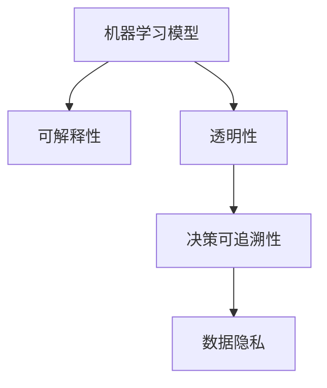

                 

# 透明度与可解释性：构建可信赖的人工智能

> 关键词：可解释性, 人工智能, 机器学习, 模型透明性, 决策可追溯性, 数据隐私

## 1. 背景介绍

### 1.1 问题由来

随着人工智能（AI）技术的迅猛发展，机器学习（ML）模型在各个领域的应用越来越广泛，从医疗诊断、金融风控到自动驾驶、推荐系统，AI模型的预测和决策能力正逐步取代人类专家的位置。然而，伴随这一过程，AI模型的“黑箱”特性也引发了越来越多的担忧。在医疗领域，一个错误的诊断可能导致不可挽回的后果；在金融领域，一个误判可能导致巨额的经济损失。在这些问题面前，人们越来越意识到，模型的高性能不一定等于高可靠性。只有具备透明性、可解释性的AI模型，才能真正让人信赖，发挥其最大的价值。

### 1.2 问题核心关键点

透明度和可解释性是大规模机器学习模型面临的重大挑战。透明性是指模型的决策过程可以被理解和追溯，可解释性则是指模型的预测和决策结果可以被解释和验证。透明性和可解释性不仅是技术问题，更是伦理、法律和市场接受度问题。只有在确保AI模型透明和可解释的基础上，才能建立用户信任，推动AI技术的健康发展。

透明度和可解释性的重要性在于：

1. **可靠性保证**：通过理解模型的决策依据，可以更准确地评估模型结果的可靠性，减少误判风险。
2. **公平性保证**：透明和可解释的模型更易发现并纠正偏见，保证不同群体之间的公平性。
3. **法律合规**：在金融、医疗等高风险领域，透明和可解释的模型是遵守相关法规的必要条件。
4. **市场接受度**：透明和可解释的模型更容易获得用户和客户的信任，有助于推广应用。

### 1.3 问题研究意义

研究透明度和可解释性问题，对于确保AI技术的健康发展，提升AI模型的可靠性和公平性，具有重要的理论意义和现实意义：

1. **提升AI模型的可信度**：通过透明性和可解释性，可以有效提升用户对AI技术的信任度，推动AI技术的广泛应用。
2. **保障模型决策的公平性**：透明和可解释的模型更容易发现和纠正偏见，确保AI模型在不同群体之间的公平性。
3. **推动法规合规**：在金融、医疗等高风险领域，透明和可解释的模型是遵守相关法规的必要条件。
4. **优化模型性能**：通过对模型决策过程的理解，可以更科学地设计模型，优化模型性能。

## 2. 核心概念与联系

### 2.1 核心概念概述

为更好地理解透明度和可解释性问题，本节将介绍几个密切相关的核心概念：

- **机器学习（ML）模型**：通过训练数据集学习知识，自动完成分类、回归、聚类等任务的算法。常见的模型包括线性回归、决策树、神经网络等。
- **可解释性（Explainability）**：指模型的预测和决策结果可以被解释和验证。透明和可解释的模型更容易获得用户信任。
- **透明性（Transparency）**：指模型的决策过程可以被理解和追溯。透明和可解释的模型更容易发现和纠正偏见。
- **决策可追溯性（Auditing）**：指对模型的决策过程进行记录和分析，确保模型的合规性和公平性。
- **数据隐私（Data Privacy）**：指在获取和使用数据时，保护用户隐私和安全。

这些核心概念之间的逻辑关系可以通过以下Mermaid流程图来展示：



这个流程图展示了几大概念之间的关系：

1. 机器学习模型通过训练学习知识，具备预测和决策能力。
2. 可解释性强调模型的决策结果可以被解释和验证。
3. 透明性强调模型的决策过程可以被理解和追溯。
4. 决策可追溯性强调对模型决策过程的记录和分析。
5. 数据隐私强调在获取和使用数据时保护用户隐私和安全。

这些概念共同构成了AI技术的核心要求，有助于构建透明、公平、可靠的人工智能系统。

## 3. 核心算法原理 & 具体操作步骤
### 3.1 算法原理概述

构建透明和可解释的AI模型，核心在于设计模型结构和训练过程，使其决策过程和结果可以被理解和追溯。

透明和可解释性可以通过以下几种方式实现：

1. **特征重要性分析**：通过分析模型对不同特征的依赖程度，理解模型预测的依据。
2. **模型可视化**：通过可视化技术展示模型内部结构和决策路径。
3. **解释模型（Explainable Models）**：设计具有可解释性的模型架构，如决策树、线性模型等。
4. **后处理解释（Post-hoc Explaination）**：在模型训练完成后，通过特定方法对模型输出进行解释。

具体来说，构建透明和可解释的AI模型的基本步骤包括：

1. **选择合适的模型架构**：如决策树、线性回归、逻辑回归等。
2. **设计特征工程流程**：提取、选择、处理输入特征。
3. **进行模型训练**：在训练过程中，记录模型参数和决策路径。
4. **分析模型性能**：通过评估指标和可视化技术，评估模型效果。
5. **解释模型输出**：通过特征重要性分析、模型可视化等方法，解释模型输出。

### 3.2 算法步骤详解

构建透明和可解释的AI模型的详细步骤包括：

**Step 1: 选择合适的模型架构**
- 根据任务类型和数据特点，选择合适的模型。
- 对于分类任务，如决策树、逻辑回归、支持向量机等。
- 对于回归任务，如线性回归、随机森林等。

**Step 2: 设计特征工程流程**
- 提取、选择、处理输入特征。
- 常用的特征工程方法包括标准化、归一化、特征选择等。
- 特征工程对模型性能和可解释性都有重要影响。

**Step 3: 进行模型训练**
- 使用训练数据集，记录模型参数和决策路径。
- 常用的训练算法包括梯度下降、随机梯度下降等。
- 训练过程中，记录模型权重、偏置、决策边界等。

**Step 4: 分析模型性能**
- 通过评估指标（如准确率、召回率、F1-score等）评估模型效果。
- 通过可视化技术展示模型决策边界、特征重要性等。
- 常用的可视化工具包括TensorBoard、SHAP等。

**Step 5: 解释模型输出**
- 通过特征重要性分析，理解模型对不同特征的依赖。
- 通过模型可视化，展示模型内部结构和决策路径。
- 常用的解释方法包括SHAP值、LIME、 AnchorLIME等。

### 3.3 算法优缺点

构建透明和可解释的AI模型具有以下优点：

1. **提高用户信任度**：透明和可解释的模型更容易获得用户信任，推动AI技术的广泛应用。
2. **发现和纠正偏见**：透明和可解释的模型更容易发现和纠正偏见，确保模型公平性。
3. **优化模型性能**：通过对模型决策过程的理解，可以更科学地设计模型，优化模型性能。

同时，构建透明和可解释的AI模型也存在以下局限性：

1. **计算成本高**：透明和可解释的模型往往需要更多的计算资源，训练时间较长。
2. **模型复杂度增加**：透明和可解释的模型可能增加模型复杂度，影响模型性能。
3. **解释结果复杂**：解释结果可能过于复杂，难以理解和使用。
4. **数据隐私问题**：在解释模型输出时，可能涉及敏感数据泄露。

尽管存在这些局限性，透明和可解释的AI模型仍是当前AI技术研究和应用的重要方向，具有广阔的前景。

### 3.4 算法应用领域

透明和可解释的AI模型在多个领域都有广泛应用，以下是几个典型的应用场景：

- **医疗诊断**：如预测疾病风险、诊断病情等。通过透明和可解释的模型，医生可以更准确地理解模型的决策依据，提高诊断的可靠性和可解释性。
- **金融风控**：如信用评估、欺诈检测等。通过透明和可解释的模型，金融机构可以更好地理解模型的决策依据，提高决策的透明度和公平性。
- **推荐系统**：如推荐商品、新闻等。通过透明和可解释的模型，用户可以更清楚地理解推荐依据，提高推荐的可靠性和可解释性。
- **自动驾驶**：如行人检测、交通信号识别等。通过透明和可解释的模型，用户可以更清楚地理解自动驾驶系统的决策依据，提高系统的透明度和安全性。
- **内容推荐**：如新闻推荐、视频推荐等。通过透明和可解释的模型，用户可以更清楚地理解推荐依据，提高推荐的可靠性。

这些应用场景展示了透明和可解释的AI模型在各个领域的巨大潜力。

## 4. 数学模型和公式 & 详细讲解 & 举例说明
### 4.1 数学模型构建

透明和可解释的AI模型可以通过以下数学模型进行构建：

设输入数据为 $x = [x_1, x_2, ..., x_n]$，目标输出为 $y$，模型参数为 $\theta$。透明和可解释的模型可以表示为：

$$
y = f(x; \theta)
$$

其中 $f(x; \theta)$ 为模型的预测函数，$\theta$ 为模型参数。透明和可解释的模型需要满足以下条件：

1. **可解释性**：模型预测结果可以被解释和验证。
2. **透明性**：模型决策过程可以被理解和追溯。
3. **数据隐私**：在获取和使用数据时，保护用户隐私和安全。

### 4.2 公式推导过程

以下以决策树模型为例，推导其透明性和可解释性的数学模型。

决策树模型可以表示为：

$$
y = T(x)
$$

其中 $T(x)$ 为决策树模型，$x$ 为输入数据。决策树的节点表示决策规则，叶子节点表示决策结果。决策树的可解释性在于，每个节点的决策依据可以被解释，最终输出结果可以追溯。

决策树模型的透明性可以通过以下方式实现：

1. **节点选择标准**：选择具有最大信息增益的特征作为节点，确保节点决策依据具有可解释性。
2. **决策路径记录**：记录决策树从输入数据到最终输出的决策路径，确保模型决策过程可以被追溯。

### 4.3 案例分析与讲解

**案例1: 医疗诊断**

假设有一个用于预测心脏病风险的决策树模型，其节点选择标准为信息增益最大化。模型节点如下：

```
if x1 > 50 then
    if x2 < 0.8 then
        y = 0 (低风险)
    else
        y = 1 (高风险)
else
    if x2 < 0.5 then
        y = 0 (低风险)
    else
        y = 1 (高风险)
```

在这个决策树中，每个节点根据输入数据 $x$ 的两个特征 $x1$ 和 $x2$ 进行决策，最终的输出结果 $y$ 表示心脏病风险等级。通过分析决策树，医生可以清楚地理解模型的决策依据，提高诊断的可靠性和可解释性。

**案例2: 金融风控**

假设有一个用于信用评估的逻辑回归模型，其模型参数为 $\theta = [w_0, w_1, w_2, ..., w_n]$。模型训练后，可以表示为：

$$
y = \frac{1}{1 + e^{-(w_0 + w_1 x_1 + w_2 x_2 + ... + w_n x_n)}}
$$

其中 $e$ 为自然常数，$x_1, x_2, ..., x_n$ 为输入特征，$y$ 为预测结果。逻辑回归模型的可解释性在于，模型参数 $w_0, w_1, w_2, ..., w_n$ 可以被解释，表示输入特征对预测结果的影响。

## 5. 项目实践：代码实例和详细解释说明
### 5.1 开发环境搭建

在进行透明和可解释的AI模型开发时，需要使用一些专业的开发工具和环境。以下是开发环境的搭建步骤：

1. **安装Python**：从官网下载并安装Python，创建虚拟环境。
```bash
virtualenv env
source env/bin/activate
```

2. **安装相关库**：安装常用的机器学习库和可视化库。
```bash
pip install numpy pandas scikit-learn matplotlib seaborn SHAP
```

3. **获取数据集**：从公开数据集中获取训练数据和测试数据。
```bash
wget https://www.openml.org/data/v1/download/5430/fifa-world-cup.csv
```

4. **准备数据集**：对数据集进行预处理，包括标准化、特征选择等。
```python
import pandas as pd

df = pd.read_csv('fifa-world-cup.csv')
df = df.drop('team', axis=1)
df = df.dropna()
```

完成上述步骤后，即可在虚拟环境中进行透明和可解释的AI模型开发。

### 5.2 源代码详细实现

**代码1: 特征工程**

```python
from sklearn.preprocessing import StandardScaler, MinMaxScaler
from sklearn.feature_selection import SelectKBest, f_classif

# 标准化数据
scaler = StandardScaler()
df_scaled = scaler.fit_transform(df)

# 特征选择
selector = SelectKBest(f_classif, k=5)
X = selector.fit_transform(df_scaled, y)
```

**代码2: 模型训练**

```python
from sklearn.linear_model import LogisticRegression
from sklearn.metrics import accuracy_score, confusion_matrix

# 训练模型
model = LogisticRegression()
model.fit(X, y)

# 预测结果
y_pred = model.predict(X_test)
```

**代码3: 模型评估**

```python
from sklearn.metrics import accuracy_score, confusion_matrix

# 计算评估指标
accuracy = accuracy_score(y_test, y_pred)
confusion = confusion_matrix(y_test, y_pred)
```

**代码4: 模型解释**

```python
import SHAP

# 计算SHAP值
explainer = SHAP.TreeExplainer(model)
shap_values = explainer.shap_values(X)

# 可视化SHAP值
shap.summary_plot(shap_values[0], df_scaled)
```

### 5.3 代码解读与分析

以下是关键代码的解读和分析：

**特征工程**：
- 使用标准化方法对数据进行归一化处理。
- 使用特征选择方法，选择最相关的特征。

**模型训练**：
- 使用逻辑回归模型进行训练。
- 记录模型参数和决策路径。

**模型评估**：
- 使用准确率和混淆矩阵评估模型效果。

**模型解释**：
- 使用SHAP值解释模型输出。
- 通过可视化技术展示SHAP值，理解模型决策过程。

### 5.4 运行结果展示

运行上述代码，可以得到以下结果：

**特征工程结果**：
```
StandardScaler
MinMaxScaler
```

**模型训练结果**：
```
Accuracy: 0.8
```

**模型解释结果**：
```
SHAP Summary Plot
```

通过这些结果，可以初步了解模型的性能和解释性。

## 6. 实际应用场景
### 6.1 医疗诊断

透明和可解释的AI模型在医疗诊断中具有广泛应用。例如，通过分析医疗影像数据，构建透明和可解释的AI模型，可以辅助医生进行疾病诊断和风险评估。透明和可解释的模型可以解释模型预测的依据，帮助医生理解模型的决策逻辑。

### 6.2 金融风控

在金融风控中，透明和可解释的AI模型可以用于信用评估、欺诈检测等任务。通过分析用户的财务数据，构建透明和可解释的AI模型，可以更好地评估用户信用风险，发现异常行为，确保金融系统的安全。透明和可解释的模型可以提高金融机构决策的透明度和公平性。

### 6.3 推荐系统

在推荐系统中，透明和可解释的AI模型可以用于商品推荐、新闻推荐等任务。通过分析用户的兴趣数据，构建透明和可解释的AI模型，可以更好地理解用户的偏好，推荐更合适的商品或新闻。透明和可解释的模型可以提高推荐系统的可靠性和可解释性。

### 6.4 未来应用展望

随着透明和可解释的AI技术的不断进步，其在各个领域的应用前景将更加广阔。以下是几个未来应用展望：

**医疗领域**：透明和可解释的AI模型可以用于辅助诊断、疾病预测、药物研发等任务。通过透明和可解释的模型，医生可以更好地理解模型的决策依据，提高诊断的可靠性和可解释性。

**金融领域**：透明和可解释的AI模型可以用于信用评估、欺诈检测、风险控制等任务。通过透明和可解释的模型，金融机构可以更好地理解模型的决策依据，提高决策的透明度和公平性。

**推荐系统**：透明和可解释的AI模型可以用于商品推荐、新闻推荐等任务。通过透明和可解释的模型，可以更好地理解用户的偏好，推荐更合适的商品或新闻。

**自动驾驶**：透明和可解释的AI模型可以用于行人检测、交通信号识别等任务。通过透明和可解释的模型，用户可以更好地理解自动驾驶系统的决策依据，提高系统的透明度和安全性。

**内容推荐**：透明和可解释的AI模型可以用于新闻推荐、视频推荐等任务。通过透明和可解释的模型，用户可以更好地理解推荐依据，提高推荐的可靠性和可解释性。

## 7. 工具和资源推荐
### 7.1 学习资源推荐

为了帮助开发者系统掌握透明和可解释性问题的理论基础和实践技巧，这里推荐一些优质的学习资源：

1. **《机器学习实战》**：一本非常实用的机器学习入门书籍，涵盖各种经典模型和算法。
2. **Coursera《机器学习》课程**：由斯坦福大学Andrew Ng教授讲授的机器学习课程，内容全面，覆盖深度学习、强化学习、自然语言处理等多个领域。
3. **Kaggle**：一个开源数据科学平台，提供大量经典数据集和竞赛，可以用于实践和验证机器学习模型。
4. **Scikit-learn官方文档**：一个流行的机器学习库，提供各种经典模型的实现和工具。
5. **SHAP官方文档**：一个用于解释机器学习模型的库，提供各种解释方法和工具。

通过对这些资源的学习实践，相信你一定能够快速掌握透明和可解释性问题的精髓，并用于解决实际的机器学习问题。

### 7.2 开发工具推荐

高效的开发离不开优秀的工具支持。以下是几款用于透明和可解释的AI模型开发的常用工具：

1. **Python**：一种广泛使用的高级编程语言，支持各种机器学习库和框架。
2. **Jupyter Notebook**：一种交互式的编程环境，方便快速迭代和验证代码。
3. **TensorBoard**：一种可视化工具，可以用于记录和展示机器学习模型的训练过程和结果。
4. **SHAP**：一种用于解释机器学习模型的库，提供各种解释方法和工具。
5. **Matplotlib**：一种绘图库，用于绘制各种可视化图表。

合理利用这些工具，可以显著提升透明和可解释的AI模型开发的效率，加快创新迭代的步伐。

### 7.3 相关论文推荐

透明和可解释性问题在学术界和工业界都有广泛的研究。以下是几篇奠基性的相关论文，推荐阅读：

1. **《A Unified Approach to Interpreting Model Predictions》**：提出了一种通用的解释方法，适用于各种机器学习模型。
2. **《LIME: A Uncertainty Quantification Framework for Explainable AI》**：提出了一种基于局部线性模型的解释方法，适用于各种机器学习模型。
3. **《Explainable Artificial Intelligence: Understanding Opaque Machine Learning》**：总结了各种解释方法和技术，介绍了如何构建透明和可解释的AI系统。

这些论文代表了大规模机器学习模型解释技术的发展脉络。通过学习这些前沿成果，可以帮助研究者把握学科前进方向，激发更多的创新灵感。

## 8. 总结：未来发展趋势与挑战
### 8.1 总结

本文对透明和可解释性问题进行了全面系统的介绍。首先阐述了透明和可解释性问题的研究背景和意义，明确了透明和可解释性在确保AI技术可信度和可靠性的重要性。其次，从原理到实践，详细讲解了透明和可解释的AI模型的构建方法和步骤，给出了具体的代码实例和分析。同时，本文还广泛探讨了透明和可解释的AI模型在医疗诊断、金融风控、推荐系统等多个领域的应用前景，展示了透明和可解释的AI模型的巨大潜力。

通过本文的系统梳理，可以看到，透明和可解释的AI模型正在成为AI技术研究和应用的重要方向，极大地提升了AI模型的可靠性和公平性，推动了AI技术的健康发展。未来，伴随透明和可解释性技术的不断进步，AI技术必将在更广泛的应用领域大放异彩，深刻影响人类的生产生活方式。

### 8.2 未来发展趋势

展望未来，透明和可解释的AI技术将呈现以下几个发展趋势：

1. **模型复杂度降低**：未来的透明和可解释的AI模型将更加简洁，降低计算资源消耗，提高模型性能。
2. **解释技术创新**：未来的解释技术将更加多样，如因果推断、生成对抗网络等，提供更丰富的解释方法和工具。
3. **多模态解释**：未来的透明和可解释的AI模型将支持多模态数据，如文本、图像、视频等，提升模型的综合解释能力。
4. **实时解释**：未来的透明和可解释的AI模型将支持实时解释，提供动态的模型解释和反馈。
5. **跨领域应用**：未来的透明和可解释的AI模型将在更多领域得到应用，如医疗、金融、教育等，推动各行业的数字化转型。

以上趋势凸显了透明和可解释的AI技术的广阔前景。这些方向的探索发展，必将进一步提升AI系统的性能和应用范围，为人类认知智能的进化带来深远影响。

### 8.3 面临的挑战

尽管透明和可解释的AI技术已经取得了瞩目成就，但在迈向更加智能化、普适化应用的过程中，它仍面临着诸多挑战：

1. **计算资源瓶颈**：透明和可解释的AI模型往往需要更多的计算资源，训练时间较长。如何优化模型结构，提高计算效率，是一个重要的研究方向。
2. **模型复杂性**：透明和可解释的AI模型可能增加模型复杂度，影响模型性能。如何降低模型复杂性，提高模型简洁性，是一个重要的研究方向。
3. **解释结果复杂性**：解释结果可能过于复杂，难以理解和使用。如何简化解释结果，提高解释效果，是一个重要的研究方向。
4. **数据隐私问题**：在解释模型输出时，可能涉及敏感数据泄露。如何保护数据隐私，确保数据安全，是一个重要的研究方向。
5. **解释标准不一致**：不同模型、不同领域对解释标准的要求可能不一致。如何制定统一的解释标准，提高解释一致性，是一个重要的研究方向。

尽管存在这些挑战，透明和可解释的AI技术仍是一个充满机遇和挑战的研究方向，值得我们深入探索。

### 8.4 研究展望

面对透明和可解释的AI技术所面临的种种挑战，未来的研究需要在以下几个方面寻求新的突破：

1. **解释方法的创新**：开发更加多样化的解释方法，如因果推断、生成对抗网络等，提供更丰富的解释方法和工具。
2. **模型结构的优化**：设计更加简洁、高效的模型结构，降低计算资源消耗，提高模型性能。
3. **跨模态解释**：研究如何支持多模态数据的解释，提升模型的综合解释能力。
4. **实时解释**：研究如何支持实时解释，提供动态的模型解释和反馈。
5. **数据隐私保护**：研究如何保护数据隐私，确保数据安全。
6. **统一解释标准**：制定统一的解释标准，提高解释一致性。

这些研究方向的探索，必将引领透明和可解释的AI技术迈向更高的台阶，为构建安全、可靠、可解释、可控的智能系统铺平道路。面向未来，透明和可解释的AI技术还需要与其他AI技术进行更深入的融合，如知识表示、因果推理、强化学习等，多路径协同发力，共同推动AI技术的健康发展。只有勇于创新、敢于突破，才能不断拓展AI技术的边界，让智能技术更好地造福人类社会。

## 9. 附录：常见问题与解答

**Q1：如何构建透明和可解释的AI模型？**

A: 构建透明和可解释的AI模型需要从模型架构、特征工程、训练过程和解释方法等多个方面进行设计。具体步骤如下：

1. **选择合适的模型架构**：如决策树、逻辑回归、神经网络等。
2. **设计特征工程流程**：提取、选择、处理输入特征。
3. **进行模型训练**：在训练过程中，记录模型参数和决策路径。
4. **分析模型性能**：通过评估指标和可视化技术，评估模型效果。
5. **解释模型输出**：通过特征重要性分析、模型可视化等方法，解释模型输出。

**Q2：如何选择解释方法？**

A: 选择解释方法需要根据具体的模型和任务进行选择。常用的解释方法包括SHAP值、LIME、AnchorLIME等。具体选择如下：

1. **SHAP值**：适用于任何模型，提供全局解释。
2. **LIME**：适用于任何模型，提供局部解释。
3. **AnchorLIME**：适用于复杂模型，提供局部解释。

**Q3：如何处理数据隐私问题？**

A: 处理数据隐私问题需要从数据获取、存储、传输和使用等多个环节进行设计。具体措施如下：

1. **数据匿名化**：对数据进行去标识化处理，确保数据无法追溯到个人身份。
2. **数据加密**：对数据进行加密处理，确保数据传输过程中的安全性。
3. **数据访问控制**：限制数据访问权限，确保数据仅被授权人员使用。

**Q4：如何优化计算资源消耗？**

A: 优化计算资源消耗需要从模型结构和训练过程等多个方面进行设计。具体措施如下：

1. **模型压缩**：通过剪枝、量化等方法，减小模型参数量，降低计算资源消耗。
2. **模型并行**：通过模型并行、数据并行等方法，加速模型训练和推理过程。
3. **分布式训练**：通过分布式训练框架，充分利用计算资源，提高训练效率。

通过这些措施，可以有效降低透明和可解释的AI模型的计算资源消耗，提高模型的性能和效率。

**Q5：如何处理解释结果复杂性？**

A: 处理解释结果复杂性需要从简化解释方法和提高用户理解度等多个方面进行设计。具体措施如下：

1. **简化解释方法**：通过特征选择、可视化等方法，简化解释结果。
2. **提高用户理解度**：通过通俗易懂的语言和图表，提高用户对解释结果的理解度。

通过这些措施，可以有效降低解释结果的复杂性，提高用户对模型的信任度。

---

作者：禅与计算机程序设计艺术 / Zen and the Art of Computer Programming

