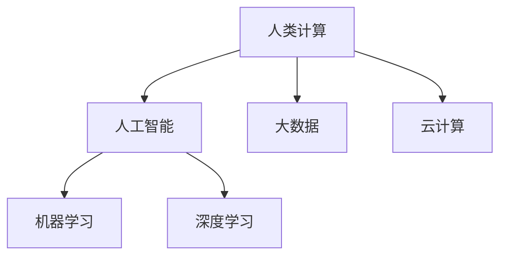

                 

# 释放人类创造力的源泉：人类计算的魅力

在现代科技飞速发展的背景下，计算不再只是计算机科学家的专场，而是逐渐渗透到了每一个角落，成为了推动人类文明进步的重要力量。本文将从背景介绍、核心概念与联系、核心算法原理与操作步骤、数学模型和公式、项目实践、实际应用场景、工具和资源推荐、总结与未来展望、附录等各个层面，深入探讨人类计算的魅力，及其如何释放人类的创造力，引领未来的发展。

## 1. 背景介绍

### 1.1 问题的由来
人类计算的历史可以追溯到古代，从早期的手工计算到现代的电子计算，计算工具的发展一直是科技进步的重要推动力。然而，直到数字计算机的诞生，人类才开始真正进入大规模计算时代。现代计算机不仅解放了人类的双手，更引领了信息时代的到来，带来了互联网、大数据、人工智能等领域的革命。

在计算机和互联网的推动下，信息获取、存储、处理的速度和规模都有了质的飞跃，极大地提高了人类社会的工作效率和生活质量。同时，计算技术的应用也催生了新兴的行业，如云计算、大数据分析、人工智能等，为人类创造力的释放提供了新的舞台。

### 1.2 问题的核心关键点
人类计算的魅力在于其能够让人类在短时间内处理大量复杂数据，并从中提取有价值的信息。这种能力不仅限于数据处理，更是人类认知能力的延伸，体现在多个层面：

- **处理速度**：计算机能够以极高的速度处理海量数据，比人类计算效率高得多。
- **存储能力**：互联网和大数据技术使得数据的存储和传输变得更加便捷和高效。
- **模式识别**：通过机器学习和深度学习等技术，计算机能够自动发现数据中的模式，辅助人类决策。
- **创新驱动**：计算技术的进步推动了科技的创新，带来了新的行业和应用。

这些核心关键点共同构成了人类计算的独特魅力，使其成为释放人类创造力的源泉。

## 2. 核心概念与联系

### 2.1 核心概念概述

为了更好地理解人类计算的魅力，本节将介绍几个核心概念及其相互关系：

- **人类计算**：指通过计算机和互联网技术，自动化处理和分析海量数据的过程。人类计算不仅包括计算和数据处理，还包括信息的获取、存储和分享。
- **人工智能**：一种模拟人类智能的技术，通过机器学习和深度学习等技术，让计算机具备类似人类的推理、决策和创造能力。
- **大数据**：指无法在合理时间内收集、存储、管理和分析的数据集。大数据技术使得人类计算更加高效和精准。
- **云计算**：通过互联网提供计算资源和服务的模式，使得计算资源可以按需获取和使用，大大降低了计算成本。
- **机器学习**：通过数据训练模型，使计算机能够自动学习和改进。机器学习是实现人工智能的核心技术之一。
- **深度学习**：一种特殊的机器学习技术，通过多层神经网络模型，实现对复杂数据的深度理解和处理。

这些核心概念之间的逻辑关系可以通过以下Mermaid流程图来展示：



这个流程图展示了大计算和人工智能的关系，以及它们如何通过大数据和云计算的支持，实现了更高效、更智能的计算过程。

## 3. 核心算法原理 & 具体操作步骤

### 3.1 算法原理概述

人类计算的核心算法原理主要包括数据处理、模式识别和智能决策等几个方面。下面将分别进行详细阐述。

#### 3.1.1 数据处理
数据处理是人工智能的基础，包括数据的采集、清洗、存储和分析等。在数据处理过程中，需要遵循以下基本原则：

- **数据采集**：确保数据来源的广泛性和多样性，提高数据的多样性和代表性。
- **数据清洗**：去除数据中的噪声和异常值，提高数据的质量。
- **数据存储**：选择合适的数据存储技术，确保数据的安全性和可访问性。
- **数据分析**：通过统计分析、机器学习等方法，从数据中提取有用的信息。

#### 3.1.2 模式识别
模式识别是指通过机器学习等技术，识别数据中的模式和规律。模式识别技术在图像识别、语音识别、自然语言处理等领域有着广泛的应用。

模式识别的基本流程包括：

- **特征提取**：从原始数据中提取有用的特征，提高模型训练的效率和精度。
- **模型训练**：通过数据训练模型，使其能够识别新的数据模式。
- **模型评估**：使用验证集和测试集评估模型的性能，优化模型的参数和结构。

#### 3.1.3 智能决策
智能决策是指通过人工智能技术，让计算机辅助或自动进行决策。智能决策在推荐系统、金融预测、医疗诊断等领域有着广泛的应用。

智能决策的基本流程包括：

- **数据输入**：输入决策所需的数据，如用户行为数据、历史交易数据、病人症状等。
- **模型选择**：选择合适的决策模型，如回归模型、分类模型、神经网络等。
- **模型训练**：使用数据训练模型，优化模型的参数和结构。
- **决策输出**：输出决策结果，如推荐商品、预测股票、诊断病情等。

### 3.2 算法步骤详解

#### 3.2.1 数据处理步骤
1. **数据采集**：使用API或爬虫技术，从各种数据源采集数据。
2. **数据清洗**：去除数据中的噪声和异常值，填补缺失值。
3. **数据存储**：将数据存储在数据库中，方便后续处理和分析。

#### 3.2.2 模式识别步骤
1. **特征提取**：使用降维算法（如PCA）或特征工程方法，从原始数据中提取有用的特征。
2. **模型训练**：选择适合的机器学习算法，如SVM、随机森林、神经网络等，训练模型。
3. **模型评估**：使用交叉验证和测试集评估模型的性能，调整模型参数。

#### 3.2.3 智能决策步骤
1. **数据输入**：获取用户输入或传感器数据，如用户行为数据、实时交易数据等。
2. **模型选择**：选择合适的决策模型，如推荐算法、预测模型等。
3. **模型训练**：使用数据训练模型，优化模型参数。
4. **决策输出**：根据模型输出结果，自动或人工进行决策。

### 3.3 算法优缺点

#### 3.3.1 优点
1. **效率高**：计算机可以快速处理海量数据，大幅提高数据处理和分析的效率。
2. **精度高**：机器学习和大数据技术可以发现数据中的复杂模式，提高决策的准确性。
3. **可扩展性**：通过云计算技术，可以按需扩展计算资源，满足不同的计算需求。
4. **自动化**：自动化数据处理和决策，减少人为干预，提高效率和准确性。

#### 3.3.2 缺点
1. **数据依赖**：数据的质量和多样性直接影响算法的性能。
2. **模型复杂**：机器学习模型的训练和优化需要大量的计算资源和时间。
3. **黑箱问题**：一些机器学习算法难以解释其内部决策过程，缺乏透明度。
4. **安全风险**：大量数据和复杂模型可能带来数据泄露和模型攻击的风险。

### 3.4 算法应用领域

人类计算在各个领域都有广泛的应用，以下是几个典型的例子：

- **金融预测**：利用大数据和机器学习技术，进行股票预测、信用评分等。
- **推荐系统**：通过分析用户行为数据，为用户推荐商品、电影等。
- **医疗诊断**：利用医学影像和病人症状数据，辅助医生进行疾病诊断。
- **自动驾驶**：通过传感器和机器学习技术，实现自动驾驶汽车。
- **智能家居**：通过物联网和机器学习技术，实现家居设备的智能化控制。
- **工业制造**：利用大数据和机器学习技术，优化生产流程，提高生产效率。

这些领域的应用展示了人类计算的强大能力和广泛前景，为我们带来了新的发展机遇。

## 4. 数学模型和公式 & 详细讲解 & 举例说明

### 4.1 数学模型构建

人类计算的核心数学模型包括线性回归、决策树、神经网络等。下面以线性回归模型为例，进行详细讲解。

#### 4.1.1 线性回归模型

线性回归模型是机器学习中最基本的模型之一，用于建立变量之间的线性关系。其基本公式如下：

$$ y = \beta_0 + \beta_1 x_1 + \beta_2 x_2 + ... + \beta_n x_n + \epsilon $$

其中，$y$ 是目标变量，$x_i$ 是特征变量，$\beta_i$ 是模型参数，$\epsilon$ 是随机误差。

### 4.2 公式推导过程

线性回归模型的推导过程如下：

1. **模型建立**：假设 $y$ 与 $x_i$ 之间存在线性关系，建立线性回归模型。
2. **参数求解**：利用最小二乘法求解模型参数 $\beta_0$、$\beta_1$、$\beta_2$ 等。
3. **模型评估**：使用均方误差等指标评估模型性能，选择最优模型。

#### 4.2.1 最小二乘法

最小二乘法是求解线性回归模型参数的一种常用方法。其基本思想是使所有样本点到直线的距离的平方和最小。具体步骤如下：

1. **数据准备**：准备训练数据 $(x_i, y_i)$。
2. **模型假设**：假设 $y = \beta_0 + \beta_1 x_1 + \beta_2 x_2 + ... + \beta_n x_n + \epsilon$。
3. **参数求解**：求解最小二乘解，即最小化 $SSR = \sum_{i=1}^n (y_i - \hat{y}_i)^2$。
4. **模型评估**：计算均方误差 $MSE = \frac{1}{n} \sum_{i=1}^n (y_i - \hat{y}_i)^2$。

### 4.3 案例分析与讲解

#### 4.3.1 案例分析
假设我们有一组房价数据，包括房屋面积、房间数量、周边环境评分等特征，以及对应的房价。我们的目标是用线性回归模型预测房价。

#### 4.3.2 案例讲解
1. **数据准备**：准备训练数据 $(x_i, y_i)$，其中 $x_i$ 是房屋面积、房间数量、周边环境评分等，$y_i$ 是房价。
2. **模型建立**：假设房价与房屋面积、房间数量、周边环境评分之间存在线性关系，建立线性回归模型 $y = \beta_0 + \beta_1 x_1 + \beta_2 x_2 + ... + \beta_n x_n + \epsilon$。
3. **参数求解**：使用最小二乘法求解模型参数 $\beta_0$、$\beta_1$、$\beta_2$ 等。
4. **模型评估**：计算均方误差 $MSE = \frac{1}{n} \sum_{i=1}^n (y_i - \hat{y}_i)^2$，评估模型性能。

## 5. 项目实践：代码实例和详细解释说明

### 5.1 开发环境搭建

在进行项目实践前，我们需要准备好开发环境。以下是使用Python进行Scikit-learn开发的环境配置流程：

1. 安装Anaconda：从官网下载并安装Anaconda，用于创建独立的Python环境。

2. 创建并激活虚拟环境：
```bash
conda create -n pythonsklearn python=3.8 
conda activate pythonsklearn
```

3. 安装Scikit-learn：
```bash
pip install scikit-learn
```

4. 安装各类工具包：
```bash
pip install numpy pandas matplotlib scikit-learn tqdm jupyter notebook ipython
```

完成上述步骤后，即可在`pythonsklearn`环境中开始项目实践。

### 5.2 源代码详细实现

下面我们以房价预测任务为例，给出使用Scikit-learn进行线性回归模型训练和测试的Python代码实现。

```python
import pandas as pd
import numpy as np
from sklearn.linear_model import LinearRegression
from sklearn.metrics import mean_squared_error

# 加载数据
data = pd.read_csv('house_prices.csv')

# 准备数据
X = data[['area', 'rooms', 'environment_score']]
y = data['price']

# 分割数据集
from sklearn.model_selection import train_test_split
X_train, X_test, y_train, y_test = train_test_split(X, y, test_size=0.2, random_state=42)

# 训练模型
model = LinearRegression()
model.fit(X_train, y_train)

# 预测结果
y_pred = model.predict(X_test)

# 计算MSE
mse = mean_squared_error(y_test, y_pred)
print('MSE:', mse)
```

以上就是使用Scikit-learn进行线性回归模型训练和测试的完整代码实现。可以看到，Scikit-learn的API设计简洁高效，使得模型开发变得更加快捷和方便。

### 5.3 代码解读与分析

让我们再详细解读一下关键代码的实现细节：

**数据准备**：
- `pd.read_csv()`函数用于加载CSV格式的数据文件，将其转换为Pandas DataFrame。
- `data[['area', 'rooms', 'environment_score']]`用于提取数据中的特征列。
- `data['price']`用于提取目标列。

**数据分割**：
- `train_test_split()`函数用于将数据集分为训练集和测试集，`test_size=0.2`表示测试集占总数据的20%。

**模型训练**：
- `LinearRegression()`函数用于创建线性回归模型。
- `model.fit(X_train, y_train)`用于训练模型，`X_train`和`y_train`分别是训练集特征和目标。

**预测结果**：
- `model.predict(X_test)`用于对测试集进行预测。

**模型评估**：
- `mean_squared_error()`函数用于计算均方误差，`y_test`和`y_pred`分别是测试集目标和模型预测结果。

可以看到，Scikit-learn的API设计简洁高效，使得模型开发变得更加快捷和方便。开发者可以将更多精力放在数据处理、模型改进等高层逻辑上，而不必过多关注底层的实现细节。

## 6. 实际应用场景

### 6.1 金融预测

金融预测是人工智能在金融领域的一个重要应用，利用大数据和机器学习技术，可以预测股票、汇率、利率等金融指标的变化趋势，为投资者提供决策支持。

具体而言，可以通过收集历史金融数据，构建时间序列模型，如ARIMA、LSTM等，进行金融预测。例如，利用LSTM模型对历史股票价格进行预测，可以发现一些潜在的市场趋势和波动规律，帮助投资者做出更好的投资决策。

### 6.2 推荐系统

推荐系统是人工智能在电商和媒体领域的重要应用，通过分析用户行为数据，为用户推荐商品、电影、音乐等。

推荐系统的基本流程包括：
- 数据收集：收集用户浏览、点击、购买等行为数据。
- 特征提取：从用户行为数据中提取有用特征，如浏览时长、点击次数等。
- 模型训练：使用机器学习算法，如协同过滤、矩阵分解等，训练推荐模型。
- 推荐结果：根据模型预测结果，推荐用户可能感兴趣的商品、电影等。

例如，利用协同过滤算法对用户历史行为数据进行分析，可以发现用户可能感兴趣的商品，并将其推荐给用户。推荐系统不仅提高了用户的购物体验，还提高了电商平台的销售效率。

### 6.3 智能家居

智能家居是人工智能在家庭领域的重要应用，通过物联网和机器学习技术，实现家居设备的智能化控制，提高用户的生活质量和舒适度。

智能家居系统的基本流程包括：
- 数据收集：收集家庭设备运行数据、用户行为数据等。
- 数据处理：对数据进行清洗、分析和处理，提取有用信息。
- 模型训练：使用机器学习算法，如决策树、神经网络等，训练智能家居模型。
- 控制决策：根据模型输出结果，自动控制家庭设备，如空调、灯光等。

例如，利用神经网络模型对家庭设备运行数据进行分析，可以发现用户的生活习惯，自动调整家庭设备运行状态，提高用户的生活质量和舒适度。

### 6.4 未来应用展望

随着大数据和人工智能技术的不断发展，基于人类计算的应用场景将更加广泛和多样化。未来，人类计算的应用将不仅仅局限于数据处理和决策支持，还将拓展到更多领域，如工业制造、智能交通、智慧城市等。

例如，在工业制造领域，可以通过大数据和机器学习技术，实现设备故障预测、生产过程优化等。在智能交通领域，可以通过物联网和机器学习技术，实现交通流量预测、道路优化等。在智慧城市领域，可以通过大数据和机器学习技术，实现城市事件监测、智能调度等。

## 7. 工具和资源推荐

### 7.1 学习资源推荐

为了帮助开发者系统掌握人类计算的理论基础和实践技巧，这里推荐一些优质的学习资源：

1. **《深度学习》教材**：由斯坦福大学Andrew Ng教授所著，系统介绍了深度学习的基本概念和算法。
2. **《Python机器学习》教材**：由Sebastian Raschka和Vahid Mirjalili所著，介绍了机器学习的各个方面，包括数据预处理、模型训练等。
3. **Coursera深度学习课程**：由Andrew Ng教授主讲的深度学习课程，内容涵盖了深度学习的基本概念和应用。
4. **Kaggle竞赛平台**：提供大量数据集和机器学习竞赛，帮助开发者锻炼数据处理和模型训练能力。
5. **GitHub开源项目**：GitHub上有大量优秀的开源项目，可以帮助开发者学习机器学习算法的实现。

通过对这些资源的学习实践，相信你一定能够快速掌握人类计算的精髓，并用于解决实际的机器学习问题。

### 7.2 开发工具推荐

高效的开发离不开优秀的工具支持。以下是几款用于人类计算开发的常用工具：

1. **Python**：Python是一种高级编程语言，语法简洁，易于学习和使用。广泛应用于机器学习和数据科学领域。
2. **Scikit-learn**：Scikit-learn是Python的一个机器学习库，提供了大量的机器学习算法和工具，适用于数据处理和模型训练。
3. **TensorFlow**：TensorFlow是Google开发的一个深度学习框架，支持分布式计算和GPU加速。适用于大规模深度学习应用。
4. **Keras**：Keras是一个高级深度学习框架，易于使用，适合快速开发和原型设计。
5. **Jupyter Notebook**：Jupyter Notebook是一个交互式编程环境，支持Python、R等语言，适用于数据处理和模型训练。
6. **PyTorch**：PyTorch是Facebook开发的一个深度学习框架，易于使用，支持GPU加速。适用于深度学习应用。

合理利用这些工具，可以显著提升人类计算任务的开发效率，加快创新迭代的步伐。

### 7.3 相关论文推荐

人类计算的研究源于学界的持续研究。以下是几篇奠基性的相关论文，推荐阅读：

1. **《机器学习》教材**：由Tom Mitchell所著，介绍了机器学习的各个方面，包括基本概念和算法。
2. **《深度学习》教材**：由Ian Goodfellow、Yoshua Bengio和Aaron Courville所著，介绍了深度学习的各个方面，包括神经网络、卷积神经网络等。
3. **《大数据技术》教材**：由Jeffrey Dean、Joanna Chang和Jeff Smith所著，介绍了大数据技术的各个方面，包括分布式计算、数据存储等。
4. **《人工智能》教材**：由John McCarthy、Marvin Minsky、Seymour Papert和Nathaniel Rochester所著，介绍了人工智能的各个方面，包括知识表示、推理等。
5. **《计算机视觉》教材**：由Richard Szeliski所著，介绍了计算机视觉的各个方面，包括图像处理、目标检测等。

这些论文代表了大计算和人工智能的研究进展，通过学习这些前沿成果，可以帮助研究者把握学科前进方向，激发更多的创新灵感。

## 8. 总结：未来发展趋势与挑战

### 8.1 研究成果总结

本文对人类计算的魅力进行了全面系统的介绍，从背景介绍、核心概念与联系、核心算法原理与操作步骤、数学模型和公式、项目实践、实际应用场景、工具和资源推荐、总结与未来展望等各个层面，深入探讨了人类计算的独特魅力。

通过本文的系统梳理，可以看到，人类计算不仅在数据处理和决策支持方面具有独特优势，还能够在多个领域拓展应用，带来新的发展机遇。未来，随着大数据和人工智能技术的不断发展，基于人类计算的应用将更加广泛和多样化，为人类社会带来更加便捷和高效的生活体验。

### 8.2 未来发展趋势

展望未来，人类计算的发展趋势将呈现以下几个方向：

1. **数据量不断增大**：随着互联网和物联网的普及，数据量将呈指数级增长，为人类计算提供了更丰富的数据资源。
2. **计算技术不断提升**：随着计算硬件和算法的不断发展，计算效率和性能将不断提升，为人类计算提供了更强大的计算能力。
3. **人工智能技术不断进步**：随着深度学习和大数据技术的发展，人工智能技术将不断进步，为人类计算提供了更智能的决策支持。
4. **跨领域应用不断拓展**：人类计算的应用将不断拓展到更多领域，如金融、医疗、工业等，为人类社会带来更多创新和变革。
5. **可持续发展不断推进**：人类计算将更加注重可持续发展，通过计算技术优化资源配置，实现更高效、更环保的可持续发展目标。

### 8.3 面临的挑战

尽管人类计算带来了诸多便利和创新，但在应用和发展过程中，仍面临诸多挑战：

1. **数据隐私和安全**：大量数据和复杂模型可能带来数据泄露和模型攻击的风险，如何保障数据隐私和安全将是未来一大挑战。
2. **模型复杂和解释性**：一些机器学习模型难以解释其内部决策过程，缺乏透明度，如何提升模型的可解释性将是未来一大挑战。
3. **计算资源和成本**：大规模计算任务需要大量的计算资源和成本，如何降低计算成本将是未来一大挑战。
4. **算法偏见和公平性**：机器学习模型可能存在算法偏见，导致不公平的决策，如何消除偏见、提高公平性将是未来一大挑战。
5. **技术复杂和应用门槛**：一些先进的技术和算法可能具有较高的应用门槛，如何降低技术复杂性、提高应用门槛将是未来一大挑战。

### 8.4 研究展望

面对人类计算面临的种种挑战，未来的研究需要在以下几个方面寻求新的突破：

1. **提升模型可解释性**：通过引入因果推断、对比学习等方法，提高机器学习模型的可解释性，增强其透明度和可信度。
2. **优化计算资源使用**：通过计算图优化、模型压缩等方法，降低大规模计算任务的资源消耗，实现更高效、更经济的计算。
3. **消除算法偏见**：通过数据清洗、算法优化等方法，消除机器学习模型的算法偏见，提高其公平性和可信度。
4. **降低应用门槛**：通过开发简单易用的工具和平台，降低技术应用的门槛，促进技术在各行各业的普及应用。
5. **推进可持续发展**：通过计算技术优化资源配置，实现更高效、更环保的可持续发展目标，为人类社会带来更加美好的未来。

总之，人类计算作为释放人类创造力的源泉，其未来发展前景广阔，但也需要我们不断克服技术挑战，推进技术的可持续发展。通过学界和产业界的共同努力，相信人类计算必将在更多领域释放其独特的魅力，为人类的生产和生活带来更高效、更便捷、更智能的体验。

## 9. 附录：常见问题与解答

**Q1：人类计算的魅力在哪里？**

A: 人类计算的魅力在于其能够大幅提升数据处理和分析的效率，使人类在短时间内处理海量数据成为可能。通过计算技术，人类可以获得更丰富的数据资源和更智能的决策支持，释放其创造力和潜力，推动社会的进步和发展。

**Q2：如何提升人类计算的效率？**

A: 提升人类计算的效率需要从数据、算法和硬件等多个层面进行优化：

1. **数据优化**：通过数据清洗、数据增强、特征工程等方法，提高数据的质量和多样性。
2. **算法优化**：通过模型选择、模型压缩、算法优化等方法，提高算法的效率和精度。
3. **硬件优化**：通过分布式计算、GPU加速、异构计算等方法，提高计算效率。

**Q3：人类计算面临哪些挑战？**

A: 人类计算在发展过程中面临诸多挑战：

1. **数据隐私和安全**：大量数据和复杂模型可能带来数据泄露和模型攻击的风险，如何保障数据隐私和安全将是未来一大挑战。
2. **模型复杂和解释性**：一些机器学习模型难以解释其内部决策过程，缺乏透明度，如何提升模型的可解释性将是未来一大挑战。
3. **计算资源和成本**：大规模计算任务需要大量的计算资源和成本，如何降低计算成本将是未来一大挑战。
4. **算法偏见和公平性**：机器学习模型可能存在算法偏见，导致不公平的决策，如何消除偏见、提高公平性将是未来一大挑战。
5. **技术复杂和应用门槛**：一些先进的技术和算法可能具有较高的应用门槛，如何降低技术复杂性、提高应用门槛将是未来一大挑战。

**Q4：人类计算的未来发展方向是什么？**

A: 人类计算的未来发展方向包括：

1. **数据量不断增大**：随着互联网和物联网的普及，数据量将呈指数级增长，为人类计算提供了更丰富的数据资源。
2. **计算技术不断提升**：随着计算硬件和算法的不断发展，计算效率和性能将不断提升，为人类计算提供了更强大的计算能力。
3. **人工智能技术不断进步**：随着深度学习和大数据技术的发展，人工智能技术将不断进步，为人类计算提供了更智能的决策支持。
4. **跨领域应用不断拓展**：人类计算的应用将不断拓展到更多领域，如金融、医疗、工业等，为人类社会带来更多创新和变革。
5. **可持续发展不断推进**：人类计算将更加注重可持续发展，通过计算技术优化资源配置，实现更高效、更环保的可持续发展目标。

总之，人类计算作为释放人类创造力的源泉，其未来发展前景广阔，但也需要我们不断克服技术挑战，推进技术的可持续发展。通过学界和产业界的共同努力，相信人类计算必将在更多领域释放其独特的魅力，为人类的生产和生活带来更高效、更便捷、更智能的体验。

---

作者：禅与计算机程序设计艺术 / Zen and the Art of Computer Programming

