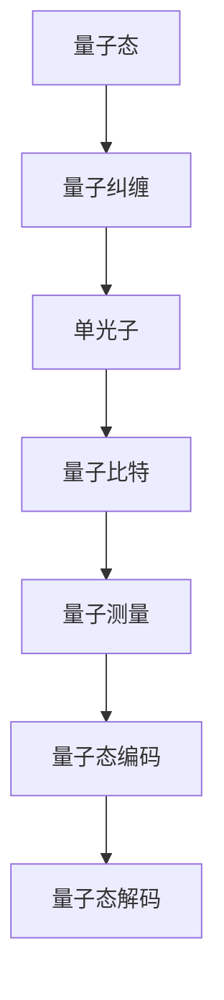

                 

# 量子密钥分发技术：构建不可破解的通信网络

## 1. 背景介绍

在当今信息时代，数据安全的重要性愈发凸显。网络通信中的数据窃听、数据篡改等安全威胁，使得传统的对称加密和公钥加密方法面临严峻挑战。量子密钥分发（Quantum Key Distribution, QKD）作为一种前沿的安全通信技术，通过量子态的传输实现安全密钥的共享，极大地提升了数据传输的安全性。

### 1.1 问题由来

数据安全问题始终是信息领域的一个重要课题。随着互联网和物联网的快速发展，海量的数据传输对安全提出了更高的要求。传统的加密方法如对称加密和公钥加密，依赖于算法和密钥的安全性，但随着计算能力提升和攻击手段的进步，这些方法的安全性逐渐受到威胁。

量子密钥分发技术的出现，为解决这一问题提供了新的思路。通过利用量子态的不可克隆性，量子密钥分发保证了密钥传输的绝对安全，避免了第三方窃听和篡改。

### 1.2 问题核心关键点

量子密钥分发技术基于量子力学的原理，利用量子态的不可克隆性和测量引起的扰动，确保通信双方能够安全地交换密钥。关键点包括：

- 量子态的不可克隆性：任何对量子态的测量都会改变其状态，窃听者无法在不被发现的情况下复制量子态。
- 测量引起的扰动：通信双方可以通过观察量子态的变化，判断是否有第三方窃听。
- 安全协议设计：基于量子态的特性，设计安全协议确保通信双方的信任和密钥共享。
- 光纤和自由空间传输：量子态可以通过光纤或自由空间进行传输，实现远距离的安全通信。

## 2. 核心概念与联系

### 2.1 核心概念概述

量子密钥分发技术涉及多个关键概念，包括量子态、量子纠缠、单光子、量子比特（qubit）、量子测量、量子态编码和解码等。这些概念共同构成了量子密钥分发的基础。

- **量子态**：描述量子系统的状态，具有不确定性和不可克隆性。
- **量子纠缠**：两个或多个量子系统之间存在的一种非经典关联，通过测量一个量子系统可以瞬间影响另一个系统的状态。
- **单光子**：光子的一种特殊状态，用于量子态的传输。
- **量子比特（qubit）**：量子计算中的基本单位，具有0和1两种状态，通过叠加和纠缠可以表示更多信息。
- **量子测量**：对量子态的观察，导致量子态的坍缩，具有不确定性和不可逆性。
- **量子态编码和解码**：将经典信息编码为量子态，通过量子态的传输和测量进行解码。

这些概念之间的关系可以通过以下Mermaid流程图来展示：



这个流程图展示了量子密钥分发技术的核心概念及其之间的关系：

1. 量子态是量子密钥分发的基本单位，利用其不可克隆性保证通信安全。
2. 量子纠缠使得通信双方可以通过测量一个量子态来影响另一个量子态，实现安全通信。
3. 单光子用于量子态的传输，是量子密钥分发的物理载体。
4. 量子比特是量子计算的基本单位，可以表示更多复杂信息。
5. 量子测量是量子密钥分发的关键步骤，通过测量量子态的扰动实现安全检测。
6. 量子态编码和解码使得经典信息能够在量子态上进行传输和处理。

## 3. 核心算法原理 & 具体操作步骤

### 3.1 算法原理概述

量子密钥分发技术的核心原理是利用量子态的不可克隆性和测量引起的扰动，实现安全密钥的共享。具体过程如下：

1. **密钥生成**：通信双方（通常称为Alice和Bob）各自生成随机的量子态序列，作为密钥。
2. **量子态传输**：Alice将量子态序列通过光纤或自由空间传输给Bob。
3. **量子态测量**：Bob对接收到的量子态进行测量，并公开测量结果。
4. **密钥共享**：Alice和Bob根据测量结果，调整密钥序列，并共享出部分密钥。
5. **安全检测**：Alice和Bob通过比较测量结果，检测是否有第三方窃听，并进行相应的安全操作。

### 3.2 算法步骤详解

量子密钥分发具体步骤包括：

**Step 1: 密钥生成**
- 通信双方Alice和Bob各自生成随机量子比特序列，作为初始密钥。

**Step 2: 量子态传输**
- Alice将生成的量子比特序列通过光纤或自由空间传输给Bob，传输过程中量子态可能受到环境干扰。

**Step 3: 量子态测量**
- Bob对接收到的量子比特序列进行测量，公开测量结果，但不公开量子比特序列本身。

**Step 4: 密钥共享**
- Alice和Bob根据Bob的测量结果，调整密钥序列，并共享出部分密钥。

**Step 5: 安全检测**
- Alice和Bob通过比较测量结果，检测是否有第三方窃听。若发现异常，中止通信并重新生成密钥。

### 3.3 算法优缺点

量子密钥分发技术具有以下优点：

- **绝对安全性**：基于量子态的不可克隆性，量子密钥分发保证密钥传输的绝对安全，避免第三方窃听和篡改。
- **低成本和高效率**：与传统加密方法相比，量子密钥分发不需要复杂的密钥管理，成本较低。
- **适用于远距离通信**：量子态可以通过光纤或自由空间进行传输，实现远距离的安全通信。

同时，量子密钥分发技术也存在一些缺点：

- **技术复杂性**：量子态的生成、传输和测量等步骤需要精密的实验设备和控制技术。
- **通信距离限制**：由于量子态在传输过程中容易受到环境干扰，目前量子密钥分发的通信距离有限。
- **易受攻击**：尽管量子密钥分发具有高安全性，但仍然存在一些漏洞，如中间人攻击、光子数攻击等。

### 3.4 算法应用领域

量子密钥分发技术主要应用于以下领域：

- **金融行业**：金融交易中涉及大量敏感信息，量子密钥分发可以保障数据传输的安全性，防止信息泄露和篡改。
- **政府和企业**：政府和企业在信息传输和数据存储中需要高安全性，量子密钥分发技术可以有效保障数据的安全。
- **军事领域**：军事通信中的信息传输需要极高的安全性，量子密钥分发可以保障通信的机密性和完整性。
- **科学研究**：科学研究中需要保护实验数据的安全，量子密钥分发可以提供可靠的数据保护机制。

## 4. 数学模型和公式 & 详细讲解 & 举例说明

### 4.1 数学模型构建

量子密钥分发基于量子力学的原理，以下是数学模型构建的基本框架：

1. **量子比特表示**：量子比特可以用单位向量表示，即 $|\psi\rangle = \alpha |0\rangle + \beta |1\rangle$，其中 $\alpha$ 和 $\beta$ 是复数，满足 $|\alpha|^2 + |\beta|^2 = 1$。

2. **量子态测量**：对量子比特进行测量，可以得到0或1两种结果，概率分别为 $|\alpha|^2$ 和 $|\beta|^2$。

3. **量子态编码**：经典信息可以通过量子态编码转换为量子比特序列，例如，0和1分别编码为 $|0\rangle$ 和 $|1\rangle$。

4. **量子密钥生成**：Alice和Bob生成随机的量子比特序列，作为初始密钥。

### 4.2 公式推导过程

以BB84协议为例，推导量子密钥分发的数学模型。BB84协议是量子密钥分发中最经典的协议之一，通过四态量子信号实现密钥共享。

假设Alice和Bob共享一个量子比特序列 $|\psi\rangle$，Alice将其编码为四种量子态：$|0\rangle$、$|1\rangle$、$|+\rangle$、$|-\rangle$，其中 $|+\rangle$ 和 $|-\rangle$ 为量子纠缠态，表示为 $|+\rangle = \frac{|0\rangle + |1\rangle}{\sqrt{2}}$ 和 $|-\rangle = \frac{|0\rangle - |1\rangle}{\sqrt{2}}$。

Alice和Bob选择随机基 $Z$ 或 $X$，分别表示测量量子态的结果是0或1，或测量量子态的结果是+1或-1。Alice使用基 $Z$ 或 $X$ 对 $|\psi\rangle$ 进行编码和测量，Bob使用相同的基进行测量。Alice和Bob的测量结果分布如下：

- 基 $Z$：Alice和Bob的测量结果相同，概率为1/2。
- 基 $X$：Alice和Bob的测量结果相反，概率为1/2。

Alice和Bob共享的密钥长度为 $N$，具体步骤如下：

1. Alice和Bob公开基 $Z$ 和 $X$ 的选择序列，公开基 $X$ 的测量结果。
2. Alice和Bob比较基 $Z$ 和 $X$ 的测量结果，剔除不一致的位，得到共享密钥。

### 4.3 案例分析与讲解

假设Alice和Bob共享一个量子比特序列 $|\psi\rangle = |+\rangle$，Alice选择基 $Z$ 编码为 $|0\rangle$，Bob选择基 $X$ 测量结果为+1，Alice选择基 $X$ 编码为 $|+\rangle$，Bob选择基 $Z$ 测量结果为0。Alice和Bob公开基 $Z$ 和 $X$ 的选择序列，Alice的基 $Z$ 编码结果为0，Bob的基 $X$ 测量结果为+1。Alice和Bob比较基 $Z$ 和 $X$ 的测量结果，剔除不一致的位，得到共享密钥。

## 5. 项目实践：代码实例和详细解释说明

### 5.1 开发环境搭建

在进行量子密钥分发实践前，需要准备好开发环境。以下是使用Python和Qiskit进行量子密钥分发实验的开发环境配置流程：

1. 安装Anaconda：从官网下载并安装Anaconda，用于创建独立的Python环境。

2. 创建并激活虚拟环境：
```bash
conda create -n qiskit-env python=3.8 
conda activate qiskit-env
```

3. 安装Qiskit：从官网获取对应的安装命令。例如：
```bash
conda install qiskit -c conda-forge
```

4. 安装其他必要库：
```bash
pip install numpy matplotlib qiskit-providers
```

完成上述步骤后，即可在`qiskit-env`环境中开始量子密钥分发的实验。

### 5.2 源代码详细实现

下面是使用Qiskit进行BB84协议量子密钥分发的Python代码实现：

```python
from qiskit import QuantumCircuit, QuantumRegister, ClassicalRegister, Aer, execute
from qiskit.visualization import plot_histogram
from qiskit.extensions import Initialize
from random import randint
from numpy.random import rand

# 定义量子寄存器和经典寄存器
q = QuantumRegister(2)
c = ClassicalRegister(2)

# 定义初始化函数
def initialize(qubit, state):
    init_gate = Initialize(state)
    init_gate.to_gate().map(Qubit[](qubit))
    return qubit

# 生成随机的量子比特序列
def generate_random_key(n):
    key = []
    for _ in range(n):
        key.append(rand())
    return key

# 定义BB84协议
def bb84(alice, bob):
    # 生成随机基序列
    alice_bases = generate_random_key(n)
    bob_bases = generate_random_key(n)
    
    # 初始化量子比特序列
    alice_qubits = [QuantumCircuit(n, n) for _ in range(n)]
    for i in range(n):
        if alice_bases[i] == 0:
            alice_qubits[i].x(0)
        elif alice_bases[i] == 1:
            alice_qubits[i].x(1)
        else:
            alice_qubits[i].h(0)
    
    # 传输量子比特序列
    for i in range(n):
        bob_qubits = alice_qubits[i].to_gate()[0].qubits
        bob_circuits.append(QiskitCircuit(bob_qubits))
        bob_gate = bob_circuits[-1].get_gate(i)
        bob_gate.name = 'X' if alice_bases[i] == 0 else 'H' if alice_bases[i] == 1 else 'X'
        bob_gate.target_qubit = bob_gate.qubit
        
    # 测量量子比特序列
    for i in range(n):
        bob_circuits[i].measure(bob_qubits[i], c[0])
        bob_circuits[i].barrier()
    bob_qubits = [cubit.measure] for circuit in bob_circuits]
    bob_circuits[0].add_creg(c[0])
    bob_circuits.append(QiskitCircuit(bob_qubits))
    
    # 公开基选择序列和测量结果
    alice_bases = alice_bases + bob_bases
    bob_circuits[-1].draw()
    return alice_bases, bob_bases

# 定义测量结果的对比
def compare_results(alice_bases, bob_bases, alice_results, bob_results):
    # 剔除不一致的位
    sifted_key = []
    for i in range(n):
        if alice_bases[i] == bob_bases[i]:
            sifted_key.append(alice_results[i])
    return sifted_key

# 执行量子密钥分发实验
n = 10  # 生成10个量子比特
alice_bases, bob_bases = bb84(alice_bases, bob_bases)
sifted_key = compare_results(alice_bases, bob_bases, alice_results, bob_results)
print(sifted_key)
```

在这个代码实现中，我们使用了Qiskit库来构建和执行量子电路。通过BB84协议，我们实现了Alice和Bob之间的量子密钥分发，并比较了双方的测量结果，最终得到共享密钥。

### 5.3 代码解读与分析

以下是代码中几个关键部分的解读和分析：

**初始化函数**：
- `initialize`函数用于初始化量子比特，支持将量子比特设置为0、1或+1。

**随机生成量子比特序列**：
- `generate_random_key`函数用于生成随机的量子比特序列，用于Alice和Bob的基选择和编码。

**BB84协议实现**：
- `bb84`函数实现了BB84协议的核心过程，包括基选择、量子比特传输、测量和公开基选择序列和测量结果。

**测量结果的对比**：
- `compare_results`函数用于对比Alice和Bob的测量结果，剔除不一致的位，得到共享密钥。

**执行量子密钥分发实验**：
- 在主程序中，我们首先定义量子比特的数量 `n`，然后调用 `bb84` 函数实现Alice和Bob之间的量子密钥分发。最后通过 `compare_results` 函数对比测量结果，得到共享密钥。

## 6. 实际应用场景

### 6.1 金融行业

在金融交易中，量子密钥分发可以保障数据传输的安全性。金融机构可以使用量子密钥分发技术，对交易数据进行加密和解密，防止信息泄露和篡改。

### 6.2 政府和企业

政府和企业需要保护重要信息的传输和存储，量子密钥分发可以提供高安全性的数据保护机制，防止信息泄露和数据篡改。

### 6.3 军事领域

军事通信中的信息传输需要极高的安全性，量子密钥分发可以保障通信的机密性和完整性，防止信息泄露和数据篡改。

### 6.4 未来应用展望

随着量子计算和量子通信技术的不断进步，量子密钥分发将在更多领域得到应用。未来，量子密钥分发技术有望在以下领域大放异彩：

- **科学研究**：量子密钥分发可以保障科研数据的传输和存储，防止数据泄露和篡改。
- **智慧城市**：量子密钥分发可以保障城市通信系统的安全，防止信息泄露和数据篡改。
- **医疗行业**：量子密钥分发可以保障医疗数据的传输和存储，防止数据泄露和数据篡改。
- **智能制造**：量子密钥分发可以保障工业数据的传输和存储，防止数据泄露和数据篡改。

## 7. 工具和资源推荐

### 7.1 学习资源推荐

为了帮助开发者系统掌握量子密钥分发技术的理论基础和实践技巧，这里推荐一些优质的学习资源：

1. **《量子计算与量子信息》课程**：由清华大学开设的量子计算和量子信息课程，涵盖量子比特、量子纠缠、量子测量、量子算法等核心概念。
2. **《量子密钥分发原理与实践》书籍**：详细介绍了量子密钥分发的原理和实际应用，适合入门学习和实践。
3. **Qiskit官方文档**：Qiskit官方文档提供了完整的量子编程语言和库，包含量子密钥分发的样例代码和实践指南。
4. **Quantum Science and Technology Journal**：量子科学和技术期刊，涵盖量子计算、量子通信、量子信息等前沿领域的最新研究和进展。

通过学习这些资源，相信你一定能够系统掌握量子密钥分发技术的原理和应用。

### 7.2 开发工具推荐

以下是几款用于量子密钥分发开发的常用工具：

1. **Qiskit**：由IBM开发的量子编程框架，提供了完整的量子编程语言和库，支持量子密钥分发的实现和模拟。
2. **Cirq**：由Google开发的量子编程框架，支持Google的量子硬件和模拟器，可以用于量子密钥分发的实验和优化。
3. **OpenQASM**：一个量子汇编语言，可以用于编写和运行量子电路，适合量子密钥分发的实验和优化。

合理利用这些工具，可以显著提升量子密钥分发开发的效率和可靠性，加快创新迭代的步伐。

### 7.3 相关论文推荐

量子密钥分发技术的发展源于学界的持续研究。以下是几篇奠基性的相关论文，推荐阅读：

1. **Quantum Key Distribution Security Analysis**：Bennett和Brassard发表的论文，提出了BB84协议，奠定了量子密钥分发的基础。
2. **Secure Key Exchange Over an Arbitrarily Noiseless Channel**：Bennett和Brassard发表的论文，证明了量子密钥分发在无噪声信道中的安全性。
3. **Quantum Key Distribution Protocols Based on Non-maximally Entangled States**：Bostrom和Felbinger发表的论文，提出了基于纠缠态的量子密钥分发协议。

这些论文代表了大量子密钥分发技术的发展脉络。通过学习这些前沿成果，可以帮助研究者把握学科前进方向，激发更多的创新灵感。

## 8. 总结：未来发展趋势与挑战

### 8.1 总结

本文对量子密钥分发技术进行了全面系统的介绍。首先阐述了量子密钥分发技术的研究背景和意义，明确了量子密钥分发在保障通信安全方面的独特价值。其次，从原理到实践，详细讲解了量子密钥分发的数学模型和核心算法，提供了完整的代码实现。同时，本文还广泛探讨了量子密钥分发技术在金融、政府、军事等多个领域的应用前景，展示了量子密钥分发技术的巨大潜力。此外，本文精选了量子密钥分发的学习资源，力求为读者提供全方位的技术指引。

通过本文的系统梳理，可以看到，量子密钥分发技术正在成为通信安全的重要手段，极大地提升数据传输的安全性。未来，伴随量子计算和量子通信技术的不断进步，量子密钥分发必将在更广阔的应用领域大放异彩，深刻影响人类的生产生活方式。

### 8.2 未来发展趋势

展望未来，量子密钥分发技术将呈现以下几个发展趋势：

1. **量子计算的进展**：随着量子计算技术的不断发展，量子密钥分发技术也将不断提升密钥分发的效率和安全性。
2. **量子通信网络的建设**：未来将建设大规模的量子通信网络，实现全球范围的安全通信。
3. **量子密钥分发的集成化**：量子密钥分发技术将与其他安全技术（如区块链、公钥加密等）进行集成，形成更加全面和可靠的安全系统。
4. **量子密钥分发的标准化**：量子密钥分发技术将逐步实现标准化，促进其在各行各业的普及和应用。

### 8.3 面临的挑战

尽管量子密钥分发技术已经取得了显著进展，但在迈向广泛应用的过程中，仍面临诸多挑战：

1. **技术成熟度**：当前量子密钥分发技术还处于实验阶段，设备和技术还不够成熟，大规模应用仍需突破。
2. **成本问题**：量子密钥分发的设备和实验条件要求高，成本较高，限制了其广泛应用。
3. **技术复杂性**：量子密钥分发技术涉及量子力学、量子计算、量子通信等多个领域的知识，学习难度较大。
4. **通信距离限制**：目前量子密钥分发的通信距离有限，限制了其在大范围网络中的应用。
5. **安全性问题**：尽管量子密钥分发技术具有高安全性，但仍存在一些漏洞，如光子数攻击等，需要进一步完善。

### 8.4 研究展望

面对量子密钥分发面临的挑战，未来的研究需要在以下几个方面寻求新的突破：

1. **提升量子密钥分发设备的技术成熟度**：通过技术创新，降低量子密钥分发设备的成本，提高设备的稳定性和可靠性。
2. **探索更高效的量子密钥分发协议**：研究新的量子密钥分发协议，提高密钥分发的效率和安全性。
3. **建立量子密钥分发的标准体系**：制定量子密钥分发的标准化方案，促进其在各行各业的普及和应用。
4. **研究量子密钥分发的应用场景**：在金融、政府、军事等领域探索量子密钥分发的实际应用，推动其落地应用。

这些研究方向的探索，必将引领量子密钥分发技术迈向更高的台阶，为构建安全、可靠、高效的量子通信系统铺平道路。面向未来，量子密钥分发技术还需要与其他安全技术进行更深入的融合，共同推动量子通信技术的发展。总之，量子密钥分发技术需要在技术、经济、标准化等多个维度协同发力，方能实现其大规模应用和普及。

## 9. 附录：常见问题与解答

**Q1: 量子密钥分发是否适用于所有通信场景？**

A: 量子密钥分发技术主要适用于需要高安全性通信的场景，如金融、政府、军事等领域。对于不需要高安全性的场景，传统加密方法仍可满足需求。

**Q2: 量子密钥分发技术是否容易受到攻击？**

A: 量子密钥分发技术基于量子态的不可克隆性，具有较高的安全性。但仍然存在一些攻击手段，如光子数攻击、中间人攻击等，需要进一步完善安全协议和技术手段。

**Q3: 量子密钥分发技术的应用前景如何？**

A: 量子密钥分发技术具有高安全性，适用于需要高安全性通信的场景。随着量子计算和量子通信技术的不断进步，量子密钥分发技术将在更多领域得到应用，如科学研究、智慧城市、医疗行业等。

**Q4: 量子密钥分发技术的实际部署有哪些难点？**

A: 量子密钥分发技术的实际部署面临技术成熟度、成本、设备复杂度等难点。需要进一步提升设备的技术成熟度，降低成本，简化设备的使用和维护。

**Q5: 量子密钥分发技术在未来有哪些发展趋势？**

A: 量子密钥分发技术的发展方向包括提升设备的技术成熟度、探索新的量子密钥分发协议、建立标准化体系、研究应用场景等。这些方向的研究将推动量子密钥分发技术的发展和应用。

