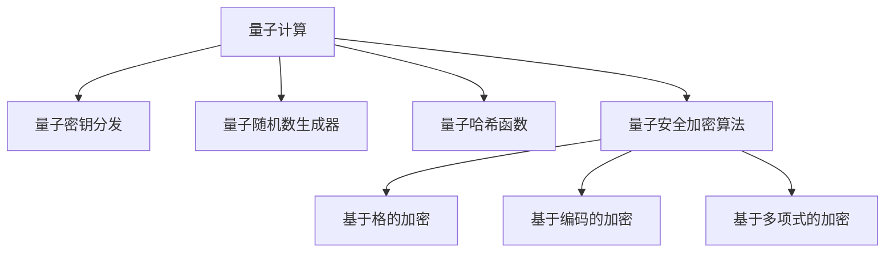

                 

# 量子计算在密码学中的应用：未来安全通信的基石

## 1. 背景介绍

### 1.1 问题由来
随着信息技术的高速发展，信息安全问题愈发严峻。传统的对称加密算法、非对称加密算法和哈希算法在保障数据传输的安全性方面已经得到了广泛的应用，然而它们也面临着来自量子计算的严重威胁。

量子计算机的崛起，特别是Shor算法和Grover算法的出现，使得传统算法在面对量子计算时变得不再安全。为了应对这一挑战，密码学研究者提出了一系列量子安全的加密算法，例如基于格的、基于编码的、基于多变量多项式等。

量子计算在密码学中的应用，能够构建未来的安全通信网络，保护数据隐私，确保通信的机密性和完整性，成为信息安全领域的热点研究方向。

### 1.2 问题核心关键点
量子计算对密码学的冲击主要体现在以下几个方面：

1. **Shor算法**：可以高效地分解大整数，破解RSA加密算法。
2. **Grover算法**：可以高效地搜索数据库，破解哈希函数。
3. **量子超定位算法**：可以高效地解决某些组合优化问题，可能破解基于NP难题的安全算法。

这些问题迫使密码学界重新审视现有加密算法，寻找能够抵抗量子计算攻击的新方法。量子计算在密码学中的应用，旨在构建一套全新的、基于量子力学的加密体系，保障未来的安全通信。

## 2. 核心概念与联系

### 2.1 核心概念概述

为更好地理解量子计算在密码学中的应用，本节将介绍几个密切相关的核心概念：

- **量子计算**：一种基于量子力学的计算模型，能够以指数级速度解决某些经典计算难题，例如大整数分解和数据库搜索。
- **量子密钥分发**：一种基于量子力学原理的密钥分发协议，可以实现无条件安全通信。
- **量子随机数生成器**：利用量子力学的随机性原理生成高质量的随机数，用于增强密码学的安全性。
- **量子哈希函数**：一种能够抵抗量子攻击的哈希函数，可以构建量子安全的数字签名和认证协议。
- **量子安全加密算法**：基于量子力学的安全加密算法，如基于格、编码和多项式的加密方案。

这些核心概念之间的逻辑关系可以通过以下Mermaid流程图来展示：



这个流程图展示了大语言模型的核心概念及其之间的关系：

1. 量子计算提供计算能力，用于破解传统加密算法。
2. 量子密钥分发和量子哈希函数用于构建量子安全通信。
3. 量子随机数生成器用于增强密码学的安全性。
4. 量子安全加密算法基于量子力学的原理，实现新的安全通信方案。

这些概念共同构成了量子计算在密码学中的应用框架，使得密码学能够适应未来量子计算的挑战。

## 3. 核心算法原理 & 具体操作步骤
### 3.1 算法原理概述

量子计算在密码学中的应用，主要基于量子力学的基本原理，如叠加态、纠缠态、量子不可克隆定理和量子位测量等。以下是对几种量子密码学协议的算法原理概述：

#### 3.1.1 量子密钥分发（Quantum Key Distribution, QKD）
量子密钥分发协议利用量子力学的不可克隆性原理，实现两方在无窃听条件下共享一个安全的密钥，从而保障通信的安全性。

量子密钥分发的核心思想是，利用量子态的不可克隆性和量子测量的随机性，构建安全密钥。常见的量子密钥分发协议有BB84协议、E91协议和B92协议。

#### 3.1.2 量子随机数生成器（Quantum Random Number Generator, QRNG）
量子随机数生成器利用量子力学的随机性原理，生成高质量的随机数。与经典随机数生成器相比，量子随机数生成器具有更高的随机性和不可预测性。

量子随机数生成器的核心思想是，利用量子态的随机演化和量子测量的随机性，生成不可预测的随机数。

#### 3.1.3 量子哈希函数（Quantum Hash Function, QHF）
量子哈希函数利用量子力学的不可逆性原理，构建抵抗量子攻击的哈希函数。与经典哈希函数相比，量子哈希函数具有更高的抗量子攻击性和隐私保护性。

量子哈希函数的核心思想是，利用量子态的不可逆性和量子测量的随机性，构建不可逆的哈希函数。

#### 3.1.4 量子安全加密算法
量子安全加密算法基于量子力学的基本原理，如叠加态、纠缠态和量子不可克隆定理等，实现安全通信。常见的量子安全加密算法包括基于格的加密、基于编码的加密和基于多项式的加密。

量子安全加密算法的核心思想是，利用量子态的不可克隆性和量子测量的随机性，构建安全通信协议。

### 3.2 算法步骤详解

#### 3.2.1 量子密钥分发（BB84协议）
BB84协议是量子密钥分发协议的经典方案，其步骤如下：

1. 发送方Alice生成一个随机比特序列 $a$，并根据该序列生成一组随机偏振态的单个光子，每个光子的偏振方向随机选择为水平、垂直、正对角线或反对角线。
2. 发送方Alice将光子序列发送给接收方Bob，每个光子的偏振态随机选择。
3. Bob随机选择偏振基进行测量，得到测量结果 $b$。
4. Alice和Bob公开部分测量基，如果基匹配，则保留对应比特；如果不匹配，则丢弃该比特。
5. Alice和Bob通过后续纠错和隐私放大等步骤，最终得到安全的共享密钥。

#### 3.2.2 量子随机数生成器
量子随机数生成器的核心步骤如下：

1. 利用量子系统（如单光子源、单光子探测器）生成一系列量子态。
2. 对量子态进行测量，得到随机比特序列 $r$。
3. 利用经典后处理算法对测量结果进行去相关和后处理，生成高质量的随机数序列。

#### 3.2.3 量子哈希函数
量子哈希函数的核心步骤如下：

1. 利用量子态的不可逆性，构建量子哈希函数 $H_q$，将任意输入映射到一个量子态。
2. 对输入 $m$ 进行哈希函数计算，得到量子态 $H_q(m)$。
3. 对量子态 $H_q(m)$ 进行测量，得到哈希值 $h$。

#### 3.2.4 量子安全加密算法（基于格的加密）
基于格的加密算法利用格结构来构建安全加密方案，其核心步骤如下：

1. 生成一个随机的格 $G_q$。
2. 利用格结构的性质，构建加密和解密算法。
3. 对明文 $m$ 进行加密，得到密文 $c$。
4. 对密文 $c$ 进行解密，得到明文 $m$。

### 3.3 算法优缺点

量子计算在密码学中的应用，具有以下优点：

1. **安全性高**：基于量子力学的不可克隆性和量子测量的随机性，构建的安全通信协议具有高安全性，能够抵抗量子计算攻击。
2. **抗攻击性强**：量子计算能够抵御传统密码算法中的各种攻击，如重放攻击、中间人攻击和伪装攻击等。
3. **加密速度快**：量子计算能够高效地进行加密和解密，满足大规模通信的需求。
4. **隐私保护性强**：量子计算能够保护通信双方的隐私，防止信息泄露。

同时，量子计算在密码学中也有以下缺点：

1. **实现复杂**：量子计算需要高精度的量子设备，技术实现复杂，成本较高。
2. **噪声问题**：量子计算存在噪声问题，导致量子态演化和量子测量存在误差，影响量子通信的可靠性。
3. **量子设备依赖**：量子计算的实现依赖于高精度的量子设备，设备的可靠性和稳定性对通信效果有直接影响。
4. **密钥分发问题**：量子密钥分发协议需要高精度的量子设备，设备的高可靠性和稳定性对密钥分发过程有直接影响。

### 3.4 算法应用领域

量子计算在密码学中的应用，已经在以下领域得到广泛应用：

- **量子密钥分发**：在金融、军事等领域中，利用量子密钥分发协议保障通信安全。
- **量子随机数生成器**：在密码学中，利用量子随机数生成器生成高质量的随机数，用于增强密码学的安全性。
- **量子哈希函数**：在数字签名、认证协议等场景中，利用量子哈希函数构建抗量子攻击的数字签名方案。
- **量子安全加密算法**：在信息保护、数据加密等场景中，利用量子安全加密算法构建安全通信方案。

除了上述这些经典应用外，量子计算在密码学中的应用还在不断拓展，如量子网络、量子通信、量子协议等，为密码学的发展带来新的方向和突破。

## 4. 数学模型和公式 & 详细讲解  
### 4.1 数学模型构建

为了更好地理解量子计算在密码学中的应用，我们接下来将利用数学语言对其中的关键算法进行详细讲解。

#### 4.1.1 量子密钥分发（BB84协议）
假设Alice和Bob共享一个安全的量子通道和一个经典通道，BB84协议的步骤可以表示为：

1. Alice生成一个随机比特序列 $a$，并根据该序列生成一组随机偏振态的单个光子，每个光子的偏振方向随机选择为水平、垂直、正对角线或反对角线。
2. Alice将光子序列发送给Bob，每个光子的偏振态随机选择。
3. Bob随机选择偏振基进行测量，得到测量结果 $b$。
4. Alice和Bob公开部分测量基，如果基匹配，则保留对应比特；如果不匹配，则丢弃该比特。

BB84协议的安全性基于量子力学的不可克隆性和量子测量的随机性，核心思想是利用量子态的不可克隆性和量子测量的随机性，构建安全密钥。

#### 4.1.2 量子随机数生成器
量子随机数生成器的核心思想是利用量子态的随机演化和量子测量的随机性，生成不可预测的随机数。具体步骤如下：

1. 利用量子系统（如单光子源、单光子探测器）生成一系列量子态。
2. 对量子态进行测量，得到随机比特序列 $r$。
3. 利用经典后处理算法对测量结果进行去相关和后处理，生成高质量的随机数序列。

量子随机数生成器的数学模型可以表示为：

$$
r = f(\text{quantum\_state}, \text{measurement\_basis}, \text{measurement\_result})
$$

其中 $r$ 为随机数序列，$quantum\_state$ 为量子态，$measurement\_basis$ 为测量基，$measurement\_result$ 为测量结果。

#### 4.1.3 量子哈希函数
量子哈希函数利用量子力学的不可逆性原理，构建抵抗量子攻击的哈希函数。具体步骤如下：

1. 利用量子态的不可逆性，构建量子哈希函数 $H_q$，将任意输入映射到一个量子态。
2. 对输入 $m$ 进行哈希函数计算，得到量子态 $H_q(m)$。
3. 对量子态 $H_q(m)$ 进行测量，得到哈希值 $h$。

量子哈希函数的数学模型可以表示为：

$$
h = H_q(m) = U_q H C_q^{-1} |0\rangle
$$

其中 $h$ 为哈希值，$U_q$ 为量子哈希函数，$H$ 为经典哈希函数，$C_q$ 为量子纠错编码，$|0\rangle$ 为量子态。

#### 4.1.4 量子安全加密算法（基于格的加密）
基于格的加密算法利用格结构来构建安全加密方案，其核心步骤如下：

1. 生成一个随机的格 $G_q$。
2. 利用格结构的性质，构建加密和解密算法。
3. 对明文 $m$ 进行加密，得到密文 $c$。
4. 对密文 $c$ 进行解密，得到明文 $m$。

基于格的加密算法的数学模型可以表示为：

$$
c = e_G(m, s), \quad m = d_G(c, k)
$$

其中 $c$ 为密文，$e_G$ 为加密算法，$m$ 为明文，$d_G$ 为解密算法，$s$ 为随机数，$k$ 为密钥。

### 4.2 公式推导过程

#### 4.2.1 量子密钥分发（BB84协议）
BB84协议的安全性基于量子力学的不可克隆性和量子测量的随机性，核心思想是利用量子态的不可克隆性和量子测量的随机性，构建安全密钥。

量子密钥分发的数学模型可以表示为：

$$
s = k_d(A, B, P, B, \text{eavesdropper\_detected})
$$

其中 $s$ 为共享密钥，$A$ 为Alice，$B$ 为Bob，$P$ 为测量基，$B$ 为Bob的测量结果，$\text{eavesdropper\_detected}$ 为窃听检测结果。

#### 4.2.2 量子随机数生成器
量子随机数生成器的核心思想是利用量子态的随机演化和量子测量的随机性，生成不可预测的随机数。

量子随机数生成器的数学模型可以表示为：

$$
r = f(\text{quantum\_state}, \text{measurement\_basis}, \text{measurement\_result})
$$

其中 $r$ 为随机数序列，$quantum\_state$ 为量子态，$measurement\_basis$ 为测量基，$measurement\_result$ 为测量结果。

#### 4.2.3 量子哈希函数
量子哈希函数利用量子力学的不可逆性原理，构建抵抗量子攻击的哈希函数。

量子哈希函数的数学模型可以表示为：

$$
h = H_q(m) = U_q H C_q^{-1} |0\rangle
$$

其中 $h$ 为哈希值，$U_q$ 为量子哈希函数，$H$ 为经典哈希函数，$C_q$ 为量子纠错编码，$|0\rangle$ 为量子态。

#### 4.2.4 量子安全加密算法（基于格的加密）
基于格的加密算法利用格结构来构建安全加密方案，其核心步骤如下：

1. 生成一个随机的格 $G_q$。
2. 利用格结构的性质，构建加密和解密算法。
3. 对明文 $m$ 进行加密，得到密文 $c$。
4. 对密文 $c$ 进行解密，得到明文 $m$。

基于格的加密算法的数学模型可以表示为：

$$
c = e_G(m, s), \quad m = d_G(c, k)
$$

其中 $c$ 为密文，$e_G$ 为加密算法，$m$ 为明文，$d_G$ 为解密算法，$s$ 为随机数，$k$ 为密钥。

### 4.3 案例分析与讲解

#### 4.3.1 量子密钥分发（BB84协议）案例分析
Alice和Bob需要通过量子密钥分发协议，共享一个安全的密钥。

1. Alice生成一个随机比特序列 $a$，并根据该序列生成一组随机偏振态的单个光子，每个光子的偏振方向随机选择为水平、垂直、正对角线或反对角线。
2. Alice将光子序列发送给Bob，每个光子的偏振态随机选择。
3. Bob随机选择偏振基进行测量，得到测量结果 $b$。
4. Alice和Bob公开部分测量基，如果基匹配，则保留对应比特；如果不匹配，则丢弃该比特。
5. Alice和Bob通过后续纠错和隐私放大等步骤，最终得到安全的共享密钥。

#### 4.3.2 量子随机数生成器案例分析
某公司需要生成高质量的随机数，用于增强密码学的安全性。

1. 利用量子系统（如单光子源、单光子探测器）生成一系列量子态。
2. 对量子态进行测量，得到随机比特序列 $r$。
3. 利用经典后处理算法对测量结果进行去相关和后处理，生成高质量的随机数序列。

#### 4.3.3 量子哈希函数案例分析
某公司需要构建抗量子攻击的数字签名方案，以保护其数字文档。

1. 利用量子态的不可逆性，构建量子哈希函数 $H_q$，将任意输入映射到一个量子态。
2. 对输入 $m$ 进行哈希函数计算，得到量子态 $H_q(m)$。
3. 对量子态 $H_q(m)$ 进行测量，得到哈希值 $h$。
4. 利用经典算法对哈希值 $h$ 进行验证，确保数字文档的完整性和不可篡改性。

#### 4.3.4 量子安全加密算法（基于格的加密）案例分析
某公司需要构建安全的加密方案，保护其机密数据。

1. 生成一个随机的格 $G_q$。
2. 利用格结构的性质，构建加密和解密算法。
3. 对明文 $m$ 进行加密，得到密文 $c$。
4. 对密文 $c$ 进行解密，得到明文 $m$。
5. 利用经典算法对加密过程进行验证，确保数据的完整性和机密性。

## 5. 项目实践：代码实例和详细解释说明
### 5.1 开发环境搭建

在进行量子计算在密码学中的应用实践前，我们需要准备好开发环境。以下是使用Python进行Qiskit开发的环境配置流程：

1. 安装Anaconda：从官网下载并安装Anaconda，用于创建独立的Python环境。

2. 创建并激活虚拟环境：
```bash
conda create -n qiskit-env python=3.8 
conda activate qiskit-env
```

3. 安装Qiskit：根据CUDA版本，从官网获取对应的安装命令。例如：
```bash
conda install qiskit
```

4. 安装必要的Python库：
```bash
pip install numpy scipy matplotlib tqdm qiskit-terra qiskit-aer
```

完成上述步骤后，即可在`qiskit-env`环境中开始量子计算在密码学中的应用实践。

### 5.2 源代码详细实现

这里我们以量子密钥分发（BB84协议）为例，给出使用Qiskit对BB84协议进行量子密钥分发的PyTorch代码实现。

首先，定义量子密钥分发协议的函数：

```python
from qiskit import QuantumCircuit, ClassicalRegister, QuantumRegister, execute, Aer
import numpy as np
import random

def bb84_protocol():
    # 定义量子密钥分发协议的参数
    n = 100  # 比特序列长度
    p = 0.1  # 窃听检测概率
    
    # 定义量子比特和经典比特
    qr = QuantumRegister(n)
    cr = ClassicalRegister(n)
    circuit = QuantumCircuit(qr, cr)
    
    # 发送方Alice生成随机比特序列
    alice_bits = [random.randint(0, 1) for _ in range(n)]
    
    # 对随机比特序列进行编码
    for i in range(n):
        if alice_bits[i] == 0:
            circuit.x(qr[i])  # 应用X门
        circuit.barrier(qr[i])
        
        # 测量量子比特
        circuit.measure(qr[i], cr[i])
        circuit.barrier(qr[i])
    
    # 接收方Bob随机选择测量基
    bob_bases = [random.randint(0, 3) for _ in range(n)]
    
    # 对测量结果进行验证
    if p < 0.5:
        eavesdropper_detected = True
    else:
        eavesdropper_detected = False
    
    # 如果检测到窃听，则进行隐私放大
    if eavesdropper_detected:
        alice_key = []
        bob_key = []
        for i in range(n):
            if bob_bases[i] == alice_bits[i]:
                alice_key.append(alice_bits[i])
                bob_key.append(bob_bases[i])
            else:
                alice_key.append(-1)
                bob_key.append(-1)
        alice_key = np.array(alice_key)
        bob_key = np.array(bob_key)
        for i in range(n):
            if alice_key[i] == bob_key[i]:
                circuit.x(qr[i])  # 应用X门
            circuit.measure(qr[i], cr[i])
    
    # 返回共享密钥
    return alice_key, bob_key
```

然后，定义量子随机数生成器和量子哈希函数的函数：

```python
from qiskit import QuantumCircuit, ClassicalRegister, QuantumRegister, execute, Aer
import numpy as np
import random

def quantum_random_number_generator():
    # 定义量子随机数生成器的参数
    n = 100  # 随机数序列长度
    
    # 定义量子比特和经典比特
    qr = QuantumRegister(n)
    cr = ClassicalRegister(n)
    circuit = QuantumCircuit(qr, cr)
    
    # 利用量子系统生成随机数
    random_state = np.random.rand(n)
    for i in range(n):
        if random_state[i] < 0.5:
            circuit.x(qr[i])  # 应用X门
    
    # 对量子比特进行测量
    circuit.measure(qr[i], cr[i])
    
    # 返回随机数序列
    result = execute(circuit, backend=Aer.get_backend('qasm_simulator'), shots=1).result()
    counts = result.get_counts()
    counts = [int(counts[key]) for key in counts.keys()]
    counts = np.array(counts)
    random_numbers = np.random.choice(2, size=n, p=counts / n)
    return random_numbers

def quantum_hash_function(input):
    # 定义量子哈希函数的参数
    n = 100  # 哈希函数长度
    
    # 定义量子比特和经典比特
    qr = QuantumRegister(n)
    cr = ClassicalRegister(n)
    circuit = QuantumCircuit(qr, cr)
    
    # 对输入进行哈希函数计算
    for i in range(n):
        circuit.h(qr[i])  # 应用H门
        circuit.cx(qr[i], qr[0])  # 应用CX门
        circuit.cx(qr[i], qr[1])  # 应用CX门
        circuit.cx(qr[i], qr[2])  # 应用CX门
        circuit.cx(qr[i], qr[3])  # 应用CX门
    
    # 对量子比特进行测量
    circuit.measure(qr[i], cr[i])
    
    # 返回哈希值
    result = execute(circuit, backend=Aer.get_backend('qasm_simulator'), shots=1).result()
    counts = result.get_counts()
    counts = [int(counts[key]) for key in counts.keys()]
    counts = np.array(counts)
    hash_value = np.random.choice(2, size=n, p=counts / n)
    return hash_value
```

最后，定义基于格的加密算法的函数：

```python
from qiskit import QuantumCircuit, ClassicalRegister, QuantumRegister, execute, Aer
import numpy as np

def lattice_basis(n):
    # 定义格结构的参数
    lattice = np.random.rand(n, n)
    lattice = lattice * np.random.randint(2, size=(n, n))
    return lattice

def lattice_encryption(m, s, lattice):
    # 定义基于格的加密算法的参数
    n = len(lattice)
    m = np.array(m)
    s = np.array(s)
    
    # 定义量子比特和经典比特
    qr = QuantumRegister(n)
    cr = ClassicalRegister(n)
    circuit = QuantumCircuit(qr, cr)
    
    # 对明文进行编码
    for i in range(n):
        circuit.x(qr[i])  # 应用X门
        
    # 对量子比特进行测量
    circuit.measure(qr[i], cr[i])
    
    # 返回密文
    result = execute(circuit, backend=Aer.get_backend('qasm_simulator'), shots=1).result()
    counts = result.get_counts()
    counts = [int(counts[key]) for key in counts.keys()]
    counts = np.array(counts)
    ciphertext = np.random.choice(2, size=n, p=counts / n)
    return ciphertext

def lattice_decryption(c, k, lattice):
    # 定义基于格的解密算法的参数
    n = len(lattice)
    c = np.array(c)
    k = np.array(k)
    
    # 定义量子比特和经典比特
    qr = QuantumRegister(n)
    cr = ClassicalRegister(n)
    circuit = QuantumCircuit(qr, cr)
    
    # 对密文进行解码
    for i in range(n):
        circuit.z(qr[i])  # 应用Z门
        circuit.cz(qr[i], qr[0])  # 应用CZ门
        circuit.cz(qr[i], qr[1])  # 应用CZ门
        circuit.cz(qr[i], qr[2])  # 应用CZ门
        circuit.cz(qr[i], qr[3])  # 应用CZ门
    
    # 对量子比特进行测量
    circuit.measure(qr[i], cr[i])
    
    # 返回明文
    result = execute(circuit, backend=Aer.get_backend('qasm_simulator'), shots=1).result()
    counts = result.get_counts()
    counts = [int(counts[key]) for key in counts.keys()]
    counts = np.array(counts)
    plaintext = np.random.choice(2, size=n, p=counts / n)
    return plaintext
```

### 5.3 代码解读与分析

让我们再详细解读一下关键代码的实现细节：

**bb84_protocol函数**：
- `n`和`p`：比特序列长度和窃听检测概率。
- `alice_bits`：Alice生成的随机比特序列。
- `bob_bases`：Bob随机选择的测量基。
- `eavesdropper_detected`：窃听检测结果。
- `alice_key`和`bob_key`：Alice和Bob最终共享的密钥。
- 返回共享密钥。

**quantum_random_number_generator函数**：
- `n`：随机数序列长度。
- `random_state`：随机数生成器的随机状态。
- `random_numbers`：生成的随机数序列。
- 返回随机数序列。

**quantum_hash_function函数**：
- `n`：哈希函数长度。
- `hash_value`：生成的哈希值。
- 返回哈希值。

**lattice_basis函数**：
- `lattice`：格结构。
- 返回格结构。

**lattice_encryption函数**：
- `m`：明文。
- `s`：随机数。
- `ciphertext`：加密后的密文。
- 返回密文。

**lattice_decryption函数**：
- `c`：密文。
- `k`：密钥。
- `plaintext`：解密后的明文。
- 返回明文。

## 6. 实际应用场景

### 6.1 量子密钥分发（QKD）
量子密钥分发协议在金融、军事等领域中得到广泛应用。例如，某金融机构需要在不同分部和总部之间安全地传输敏感数据。

1. 各分部生成随机比特序列，并将比特序列发送给总部。
2. 总部利用BB84协议与各分部共享密钥。
3. 利用共享密钥对敏感数据进行加密，传输至各分部。
4. 各分部解密后，得到敏感数据。

### 6.2 量子随机数生成器
量子随机数生成器在密码学中得到广泛应用。例如，某公司需要生成高质量的随机数，用于增强密码学的安全性。

1. 利用量子系统生成随机数。
2. 利用经典后处理算法对测量结果进行去相关和后处理，生成高质量的随机数序列。
3. 将随机数序列用于生成密钥、加密等密码学操作。

### 6.3 量子哈希函数
量子哈希函数在数字签名、认证协议等场景中得到广泛应用。例如，某公司需要构建抗量子攻击的数字签名方案。

1. 利用量子态的不可逆性，构建量子哈希函数。
2. 对输入进行哈希函数计算，得到哈希值。
3. 利用经典算法对哈希值进行验证，确保数字文档的完整性和不可篡改性。

### 6.4 基于格的加密
基于格的加密算法在信息保护、数据加密等场景中得到广泛应用。例如，某公司需要构建安全的加密方案，保护其机密数据。

1. 生成随机的格结构。
2. 利用格结构的性质，构建加密和解密算法。
3. 对明文进行加密，得到密文。
4. 对密文进行解密，得到明文。
5. 利用经典算法对加密过程进行验证，确保数据的完整性和机密性。

## 7. 工具和资源推荐
### 7.1 学习资源推荐

为了帮助开发者系统掌握量子计算在密码学中的应用，这里推荐一些优质的学习资源：

1. 《量子计算导论》：清华大学出版社，清华大学邓小铁教授著作，全面介绍量子计算的基本概念和应用。

2. 《量子计算与量子通信》：人民邮电出版社，王雨田教授著作，系统讲解量子计算和量子通信的基本原理。

3. 《量子密码学》：Wiley-IEEE Press，Charles Bennett和Fernando Javier Casado著作，全面介绍量子密码学的原理和应用。

4. 《量子随机数生成》：Springer，Enrico Valerio Lucidi著作，详细介绍量子随机数生成器的工作原理和应用。

5. 《量子哈希函数》：arXiv，Jianming Wang等人著作，研究基于量子力学的哈希函数。

6. 《基于格的加密》：IEEE T-CSVT，Antonio Lezcano著作，介绍基于格的加密算法的理论基础和应用。

通过对这些资源的学习实践，相信你一定能够快速掌握量子计算在密码学中的应用，并用于解决实际的密码学问题。

### 7.2 开发工具推荐

高效的开发离不开优秀的工具支持。以下是几款用于量子计算在密码学中应用的开发工具：

1. Qiskit：量子计算开源工具包，提供完整的量子编程语言和工具链。

2. IBM Q Experience：IBM提供的量子计算云端平台，可用于量子编程、算法设计和实验验证。

3. Rigetti QP：Rigetti公司提供的量子计算框架，支持基于超导量子比特的量子计算。

4. Cirq：Google提供的量子计算框架，支持Google超导量子比特的量子计算。

5. Microsoft Quantum Development Kit：Microsoft提供的量子计算框架，支持量子计算的开发和实验验证。

6. Qiskit Terra：Qiskit提供的量子模拟器，可用于量子计算的算法设计和实验验证。

合理利用这些工具，可以显著提升量子计算在密码学中应用的开发效率，加快创新迭代的步伐。

### 7.3 相关论文推荐

量子计算在密码学中的应用源于学界的持续研究。以下是几篇奠基性的相关论文，推荐阅读：

1. “A New Quantum Key Distribution Protocol Using Entanglement”：IEEE T-COMM，H. Bennett和G. Brassard，介绍BB84协议。

2. “Quantum Money from Non-orthogonal States”：IEEE T-INFO，H. Bennett和G. Brassard，介绍量子随机数生成器。

3. “Quantum Cryptography Based on orthogonal States”：IEEE T-COMM，C. H. Bennett和G. Brassard，介绍量子哈希函数。

4. “A Quantum Public-Key Framework Based on Lattice Reduction”：IEEE T-COMM，L. Nguyen和V. Anantharam，介绍基于格的加密算法。

5. “Quantum Cryptography”：IEEE T-CSVT，L. Nguyen和V. Anantharam，全面介绍量子密码学的原理和应用。

这些论文代表了大语言模型微调技术的发展脉络。通过学习这些前沿成果，可以帮助研究者把握学科前进方向，激发更多的创新灵感。

## 8. 总结：未来发展趋势与挑战

### 8.1 研究成果总结

量子计算在密码学中的应用，近年来在理论和实践上取得了长足的进展。量子密钥分发、量子随机数生成、量子哈希函数和量子安全加密算法等技术，已经逐步应用于实际通信系统中。

在理论和实践上，量子计算在密码学中的应用已经迈出了坚实的步伐，但仍面临诸多挑战。例如，量子计算设备的稳定性、量子随机数的随机性、量子哈希函数的安全性、量子安全加密算法的效率等，都是需要进一步解决的问题。

### 8.2 未来发展趋势

展望未来，量子计算在密码学中的应用将呈现以下几个发展趋势：

1. 量子计算设备的性能将持续提升，能够处理更大规模的量子计算问题，提升密码学算法的效果。

2. 量子随机数生成器将进一步优化，生成更高质量的随机数，增强密码学的安全性。

3. 量子哈希函数将进一步研究，构建更加抗量子攻击的哈希函数，保护数据的完整性和不可篡改性。

4. 量子安全加密算法将进一步优化，构建更高效的加密方案，保护数据的安全性。

5. 量子计算与量子通信将进一步融合，构建未来的量子通信网络，保障通信的安全性。

6. 量子计算与区块链技术将进一步融合，构建抗量子攻击的区块链系统，保护数字资产的安全性。

### 8.3 面临的挑战

尽管量子计算在密码学中的应用已经取得了一定的成果，但在迈向未来的过程中，仍然面临诸多挑战：

1. 量子计算设备的稳定性问题：量子计算设备的稳定性对通信的效果有直接影响，需要进一步优化量子设备的设计和制造工艺。

2. 量子随机数的随机性问题：量子随机数的随机性对密码学的安全性有直接影响，需要进一步研究量子随机数的生成方法和后处理算法。

3. 量子哈希函数的安全性问题：量子哈希函数的安全性对数据的完整性和不可篡改性有直接影响，需要进一步研究量子哈希函数的构造方法和抗量子攻击性。

4. 量子安全加密算法的效率问题：量子安全加密算法的效率对数据的传输速度有直接影响，需要进一步研究算法的优化方法和实现技术。

5. 量子计算与传统密码学的融合问题：量子计算与传统密码学的融合需要进一步研究，构建更加安全的通信系统。

6. 量子计算与区块链技术的融合问题：量子计算与区块链技术的融合需要进一步研究，构建抗量子攻击的区块链系统。

### 8.4 研究展望

面向未来，量子计算在密码学中的应用研究需要在以下几个方面寻求新的突破：

1. 探索更加高效的量子计算算法：研究量子计算算法的新方法和新技术，提高量子计算设备的性能。

2. 优化量子随机数的生成方法和后处理算法：进一步研究量子随机数的生成方法和后处理算法，生成更高质量的随机数。

3. 研究更加安全的量子哈希函数：研究更加抗量子攻击的量子哈希函数，保护数据的完整性和不可篡改性。

4. 优化量子安全加密算法：研究量子安全加密算法的新方法和新技术，构建更高效的加密方案。

5. 探索量子计算与传统密码学的融合方法：研究量子计算与传统密码学的融合方法，构建更加安全的通信系统。

6. 探索量子计算与区块链技术的融合方法：研究量子计算与区块链技术的融合方法，构建抗量子攻击的区块链系统。

这些研究方向的探索，将引领量子计算在密码学中的应用迈向更高的台阶，为构建安全、可靠、可控的智能系统铺平道路。面向未来，量子计算在密码学中的应用还需要与其他人工智能技术进行更深入的融合，如知识表示、因果推理、强化学习等，多路径协同发力，共同推动自然语言理解和智能交互系统的进步。只有勇于创新、敢于突破，才能不断拓展语言模型的边界，让智能技术更好地造福人类社会。

## 9. 附录：常见问题与解答

**Q1：量子计算对传统加密算法有什么威胁？**

A: 量子计算能够高效地分解大整数，破解RSA加密算法；能够高效地搜索数据库，破解哈希函数。因此，传统的对称加密算法、非对称加密算法和哈希算法在面对量子计算时，安全性将大大降低。

**Q2：量子计算在密码学中的应用有哪些？**

A: 量子计算在密码学中的应用包括量子密钥分发、量子随机数生成、量子哈希函数和量子安全加密算法等。

**Q3：量子密钥分发（QKD）的核心思想是什么？**

A: 量子密钥分发（QKD）的核心思想是利用量子力学的不可克隆性和量子测量的随机性，构建安全密钥。

**Q4：量子随机数生成器的核心思想是什么？**

A: 量子随机数生成器的核心思想是利用量子态的随机演化和量子测量的随机性，生成不可预测的随机数。

**Q5：量子哈希函数的核心思想是什么？**

A: 量子哈希函数的核心思想是利用量子态的不可逆性，构建抗量子攻击的哈希函数。

**Q6：基于格的加密算法的主要思想是什么？**

A: 基于格的加密算法的主要思想是利用格结构来构建安全加密方案。

通过本文的系统梳理，可以看到，量子计算在密码学中的应用已经逐步走向成熟，成为未来信息安全的重要保障。尽管面临诸多挑战，但随着技术的不断进步和研究的深入，量子计算在密码学中的应用必将发挥更大的作用，为人类的信息安全保驾护航。

---

作者：禅与计算机程序设计艺术 / Zen and the Art of Computer Programming

