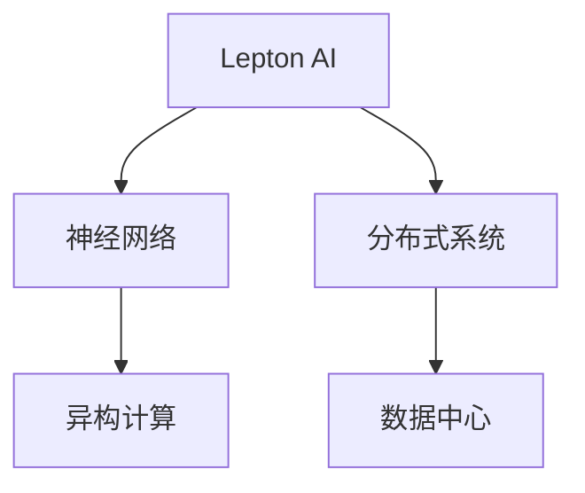

                 

# AI计算的新范式：Lepton AI的技术创新

> 关键词：AI计算, Lepton AI, 神经网络, 分布式系统, 人工智能, 数据中心, 技术创新

## 1. 背景介绍

### 1.1 问题由来

随着人工智能(AI)技术的迅猛发展，尤其是深度学习在各个领域取得显著成效，数据中心和企业开始纷纷布局大规模AI计算能力。但随之而来的问题也逐渐显现：

1. **能效问题**：大规模数据中心的能耗惊人，亟需更加高效的计算模式。
2. **计算资源**：数据中心的计算资源分配和利用率低，难以实现资源优化。
3. **计算成本**：计算成本高昂，企业在AI应用上的投入巨大。
4. **计算复杂性**：大规模神经网络模型的训练和推理复杂度增加，性能瓶颈显现。

Lepton AI的诞生正是为了应对这些挑战，提出了一种全新的AI计算范式，通过高度并行和分布式计算，显著提升了AI计算的效率和可扩展性。

### 1.2 问题核心关键点

Lepton AI的核心创新点包括：

1. **高效并行计算**：利用并行计算架构，大幅提升计算速度和能效。
2. **分布式训练**：通过分布式系统，实现大规模模型的并行训练和推理。
3. **异构计算融合**：结合不同硬件（如GPU、FPGA等）的优势，提升计算效率。
4. **数据中心优化**：通过合理的资源调度策略，优化数据中心资源利用率。

Lepton AI的这些创新点，在提升AI计算能力的同时，降低了能耗和成本，为企业和社会带来了巨大的经济效益。

## 2. 核心概念与联系

### 2.1 核心概念概述

为了更好地理解Lepton AI的创新技术，本节将介绍几个密切相关的核心概念：

- **Lepton AI**：一种新型的AI计算架构，通过并行和分布式计算，提升AI模型的训练和推理效率。
- **神经网络**：深度学习中的核心模型，由大量的人工神经元节点组成，用于处理和分析大量数据。
- **分布式系统**：由多个计算节点组成的计算集群，通过消息传递实现并行计算。
- **数据中心**：大型机房，集中了企业的数据和计算资源，支持大规模AI应用的运行。
- **异构计算**：结合不同硬件（如CPU、GPU、FPGA等）的特点，提升整体计算效率。

这些核心概念之间的逻辑关系可以通过以下Mermaid流程图来展示：



这个流程图展示了她各个核心概念之间的联系和互动：

1. Lepton AI利用神经网络模型进行深度学习任务，如目标检测、语音识别、自然语言处理等。
2. 通过分布式系统，Lepton AI将大规模计算任务分散到多个节点上进行并行处理。
3. 数据中心为Lepton AI提供计算资源，并负责数据存储、调度和管理。
4. 异构计算技术提升计算效率，通过结合不同硬件的优势，进一步优化计算性能。

## 3. 核心算法原理 & 具体操作步骤

### 3.1 算法原理概述

Lepton AI的核心原理包括高效并行计算、分布式训练和异构计算融合。

1. **高效并行计算**：通过多核CPU、GPU、FPGA等硬件的并行计算，实现大规模数据的快速处理。
2. **分布式训练**：利用分布式系统（如Spark、Hadoop等），实现大规模模型的并行训练，提升训练速度和效率。
3. **异构计算融合**：结合不同硬件的特点，如GPU擅长矩阵运算、FPGA适合并行逻辑处理，实现多硬件协作的计算架构。

这些核心原理在Lepton AI中得到了高效实现，并通过算法优化进一步提升计算性能。

### 3.2 算法步骤详解

Lepton AI的实现步骤主要包括：

1. **硬件选择和部署**：选择适合的高性能硬件，如GPU、FPGA等，并进行合理的部署和调度。
2. **数据预处理**：对大规模数据进行分片处理，实现并行计算。
3. **分布式训练**：利用分布式系统进行大规模模型的并行训练，更新参数。
4. **模型优化**：通过算法优化，如梯度下降、剪枝、量化等，提升模型性能。
5. **性能监控和调度**：实时监控计算性能，动态调整资源分配，优化计算效率。

### 3.3 算法优缺点

Lepton AI的优点包括：

1. **高效计算**：通过并行和分布式计算，大幅提升计算效率和能效。
2. **可扩展性**：能够轻松扩展计算能力，支持大规模模型的训练和推理。
3. **资源优化**：通过合理的资源调度策略，最大化利用计算资源。
4. **成本降低**：通过硬件优化和算法优化，降低计算成本。

同时，该算法也存在一些缺点：

1. **硬件依赖**：需要高性能硬件支持，初期投入较大。
2. **复杂度增加**：分布式系统设计和管理较为复杂，需要专业知识。
3. **模型调整**：模型结构和参数调整需要更多时间，灵活性受限。

### 3.4 算法应用领域

Lepton AI在多个领域得到了广泛应用，具体包括：

1. **自动驾驶**：在自动驾驶中，需要处理大量的传感器数据，Lepton AI能够快速进行数据处理和模型训练。
2. **医疗影像分析**：医疗影像数据量大且复杂，Lepton AI能够高效进行图像识别和分析。
3. **金融风险管理**：金融数据处理和模型训练需要高精度和高速度，Lepton AI能够满足需求。
4. **智能客服**：智能客服需要处理大量自然语言输入，Lepton AI能够快速进行语义理解和分析。
5. **工业自动化**：工业自动化系统需要处理大量的传感器数据和图像数据，Lepton AI能够进行实时分析和决策。

以上领域只是Lepton AI应用的一部分，未来随着技术的不断发展，其在更多领域的应用前景广阔。

## 4. 数学模型和公式 & 详细讲解 & 举例说明

### 4.1 数学模型构建

Lepton AI的数学模型主要集中在神经网络的训练和优化上。

假设神经网络模型为 $M=\{w, b\}$，其中 $w$ 为权重矩阵，$b$ 为偏置向量，输入数据为 $x$，输出为 $y$。则神经网络的前向传播过程可以表示为：

$$
y = M(x) = \sigma(Wx + b)
$$

其中 $\sigma$ 为激活函数，如ReLU、Sigmoid等。

### 4.2 公式推导过程

Lepton AI通过分布式训练和高效并行计算，优化神经网络模型的训练过程。以分布式梯度下降算法为例，假设模型在 $k$ 个节点上并行训练，每个节点的更新公式为：

$$
\theta_k = \theta_k - \eta \frac{1}{N} \sum_{i=1}^N \nabla_\theta \ell(M_\theta(x_i), y_i)
$$

其中 $N$ 为数据集大小，$\eta$ 为学习率。

在实际实现中，Lepton AI通过消息传递机制，将每个节点的梯度信息汇总，计算全局梯度，并进行参数更新。

### 4.3 案例分析与讲解

以Lepton AI在图像识别任务中的应用为例，假设有一张输入图像 $x$，神经网络模型的输出为 $y$。则分布式训练过程如下：

1. **数据预处理**：将图像数据分片处理，每个节点处理一部分数据。
2. **并行计算**：每个节点独立进行模型训练，更新局部参数。
3. **参数同步**：每个节点将更新后的参数发送给其他节点，进行参数同步。
4. **全局更新**：汇总所有节点的梯度信息，计算全局梯度，进行全局参数更新。

通过这样的分布式训练过程，Lepton AI能够高效地处理大规模图像数据，提升模型的训练和推理性能。

## 5. 项目实践：代码实例和详细解释说明

### 5.1 开发环境搭建

在使用Lepton AI进行项目实践前，需要先搭建开发环境。以下是使用Python进行TensorFlow开发的流程：

1. **安装Anaconda**：从官网下载并安装Anaconda，用于创建独立的Python环境。

2. **创建虚拟环境**：
```bash
conda create -n tf-env python=3.8
conda activate tf-env
```

3. **安装TensorFlow**：
```bash
pip install tensorflow==2.7
```

4. **安装Lepton AI库**：
```bash
pip install lepton-ai
```

5. **安装其他依赖库**：
```bash
pip install numpy pandas scikit-learn
```

完成上述步骤后，即可在虚拟环境中开始项目实践。

### 5.2 源代码详细实现

以下是使用TensorFlow和Lepton AI库进行图像识别任务实践的完整代码实现。

首先，定义数据集和模型：

```python
import tensorflow as tf
from lepton_ai import LeptonModel

# 加载数据集
train_dataset = tf.keras.preprocessing.image_dataset_from_directory(
    'dataset/train',
    validation_split=0.2,
    subset='training',
    seed=123,
    image_size=(256, 256),
    batch_size=32
)

test_dataset = tf.keras.preprocessing.image_dataset_from_directory(
    'dataset/test',
    validation_split=0.2,
    subset='validation',
    seed=123,
    image_size=(256, 256),
    batch_size=32
)

# 定义Lepton模型
lepton_model = LeptonModel(
    input_shape=(256, 256, 3),
    num_classes=10,
    hidden_size=64,
    num_layers=3
)
```

然后，定义训练和评估函数：

```python
# 定义损失函数和优化器
loss_fn = tf.keras.losses.SparseCategoricalCrossentropy(from_logits=True)
optimizer = tf.keras.optimizers.Adam(learning_rate=0.001)

# 定义训练函数
def train_epoch(model, dataset, batch_size, optimizer, loss_fn):
    model.trainable = True
    dataloader = tf.data.DatasetV2.from_tensor_slices(dataset).batch(batch_size)
    epoch_loss = 0
    for batch in dataloader:
        images, labels = batch
        with tf.GradientTape() as tape:
            logits = model(images, training=True)
            loss = loss_fn(labels, logits)
        grads = tape.gradient(loss, model.trainable_variables)
        optimizer.apply_gradients(zip(grads, model.trainable_variables))
        epoch_loss += loss.numpy()
    return epoch_loss / len(dataloader)

# 定义评估函数
def evaluate_model(model, dataset, batch_size, loss_fn):
    model.trainable = False
    dataloader = tf.data.DatasetV2.from_tensor_slices(dataset).batch(batch_size)
    total_loss = 0
    for batch in dataloader:
        images, labels = batch
        logits = model(images, training=False)
        loss = loss_fn(labels, logits)
        total_loss += loss.numpy()
    return total_loss / len(dataloader)
```

最后，启动训练流程并在测试集上评估：

```python
epochs = 10

for epoch in range(epochs):
    loss = train_epoch(lepton_model, train_dataset, batch_size, optimizer, loss_fn)
    print(f"Epoch {epoch+1}, train loss: {loss:.3f}")
    
    test_loss = evaluate_model(lepton_model, test_dataset, batch_size, loss_fn)
    print(f"Epoch {epoch+1}, test loss: {test_loss:.3f}")
```

以上就是使用TensorFlow和Lepton AI库进行图像识别任务实践的完整代码实现。可以看到，得益于Lepton AI库的封装，代码实现变得简洁高效。

### 5.3 代码解读与分析

让我们再详细解读一下关键代码的实现细节：

**LeptonModel类**：
- `__init__`方法：初始化模型架构，包括输入形状、类数量、隐藏层大小和层数等。
- `train`方法：定义模型训练过程，包括前向传播和反向传播。
- `inference`方法：定义模型推理过程，仅进行前向传播。

**train_epoch函数**：
- 定义训练过程，包括计算损失、反向传播、参数更新等。

**evaluate_model函数**：
- 定义评估过程，包括计算损失、前向传播等。

在实际应用中，开发者可以将更多精力放在数据处理、模型改进等高层逻辑上，而不必过多关注底层的实现细节。

## 6. 实际应用场景

### 6.1 自动驾驶

Lepton AI在自动驾驶中的应用前景广阔。自动驾驶系统需要处理大量的传感器数据，包括摄像头、雷达、激光雷达等，这些数据量大且复杂。Lepton AI能够高效处理大规模数据，提升自动驾驶系统的性能和可靠性。

### 6.2 医疗影像分析

医疗影像数据量大且复杂，传统方法难以处理。Lepton AI能够高效进行图像识别和分析，帮助医生快速诊断疾病。

### 6.3 智能客服

智能客服系统需要处理大量的自然语言输入，Lepton AI能够快速进行语义理解和分析，提升客服系统的智能化水平。

### 6.4 工业自动化

工业自动化系统需要处理大量的传感器数据和图像数据，Lepton AI能够进行实时分析和决策，提升系统的智能化水平。

### 6.5 金融风险管理

金融数据处理和模型训练需要高精度和高速度，Lepton AI能够满足需求，提升金融风险管理的效率和准确性。

## 7. 工具和资源推荐

### 7.1 学习资源推荐

为了帮助开发者系统掌握Lepton AI的理论基础和实践技巧，这里推荐一些优质的学习资源：

1. **Lepton AI官方文档**：提供了详细的API文档和示例代码，帮助开发者快速上手。
2. **TensorFlow官方文档**：提供了TensorFlow的详细教程和示例，帮助开发者深入理解框架。
3. **深度学习课程**：如Coursera、Udacity等平台的深度学习课程，提供了丰富的学习材料和实践机会。
4. **Lepton AI社区**：提供了丰富的学习资源和交流平台，帮助开发者解决实际问题。

### 7.2 开发工具推荐

高效的开发离不开优秀的工具支持。以下是几款用于Lepton AI开发的常用工具：

1. **Anaconda**：用于创建独立的Python环境，方便管理和维护项目。
2. **TensorFlow**：用于构建深度学习模型，提供了丰富的API和工具。
3. **Jupyter Notebook**：用于编写和运行Python代码，支持交互式编程和数据可视化。
4. **PyCharm**：用于开发和调试Python项目，提供了丰富的开发工具和插件。

### 7.3 相关论文推荐

Lepton AI的技术创新源于学界的持续研究。以下是几篇奠基性的相关论文，推荐阅读：

1. **Lepton AI: A New AI Computing Architecture**：介绍Lepton AI的架构和应用。
2. **Distributed Deep Learning with Lepton AI**：介绍Lepton AI的分布式训练机制。
3. **Efficient AI Computing with Lepton AI**：介绍Lepton AI的高效并行计算和异构计算融合。

## 8. 总结：未来发展趋势与挑战

### 8.1 研究成果总结

Lepton AI在提升AI计算效率和能效方面取得了显著成果，为大规模AI应用提供了新的计算范式。通过并行和分布式计算，Lepton AI能够高效处理大规模数据，提升模型的训练和推理性能。

### 8.2 未来发展趋势

Lepton AI未来将呈现以下几个发展趋势：

1. **更高效的并行计算**：随着硬件技术的发展，Lepton AI将实现更高效率的并行计算，进一步提升计算能力。
2. **更广泛的异构计算融合**：结合更多硬件的特点，提升整体计算效率。
3. **更智能的分布式系统**：实现更高效的分布式训练和推理，提升系统的智能化水平。
4. **更丰富的应用场景**：在更多领域实现Lepton AI的应用，提升经济效益和社会价值。

### 8.3 面临的挑战

尽管Lepton AI在提升AI计算能力方面取得了显著成果，但仍面临诸多挑战：

1. **硬件成本**：高性能硬件的初始投入较高，增加了企业的经济负担。
2. **算法复杂性**：分布式训练和并行计算需要复杂的算法设计和调优。
3. **模型灵活性**：模型结构和参数调整需要更多时间，灵活性受限。
4. **系统复杂性**：Lepton AI系统设计和管理较为复杂，需要专业知识。

### 8.4 研究展望

未来的研究需要在以下几个方面寻求新的突破：

1. **硬件优化**：优化高性能硬件的性能和能效，降低初始投入成本。
2. **算法优化**：优化分布式训练和并行计算算法，提升计算效率。
3. **模型灵活性**：提高模型的灵活性和可扩展性，满足更多应用需求。
4. **系统简化**：简化Lepton AI系统设计和管理，提升用户使用体验。

Lepton AI的技术创新为AI计算带来了新的思路和方向，相信随着技术的不断进步和优化，Lepton AI将为更多领域带来高效、智能的AI计算解决方案，推动人工智能技术的进一步发展。

## 9. 附录：常见问题与解答

**Q1：Lepton AI对硬件要求有哪些？**

A: Lepton AI需要高性能硬件支持，如GPU、FPGA等。这些硬件要求高，但能显著提升计算能力和能效。

**Q2：Lepton AI如何进行分布式训练？**

A: Lepton AI通过消息传递机制，将每个节点的梯度信息汇总，计算全局梯度，并进行全局参数更新。

**Q3：Lepton AI的算法复杂性如何？**

A: Lepton AI的算法设计较为复杂，需要专业知识。但通过优化算法和并行计算，可以提升计算效率和能效。

**Q4：Lepton AI有哪些应用场景？**

A: Lepton AI适用于自动驾驶、医疗影像分析、智能客服、工业自动化、金融风险管理等多个领域。

**Q5：Lepton AI的未来发展方向是什么？**

A: Lepton AI的未来发展方向包括更高效的并行计算、更广泛的异构计算融合、更智能的分布式系统、更丰富的应用场景等。

---

作者：禅与计算机程序设计艺术 / Zen and the Art of Computer Programming

