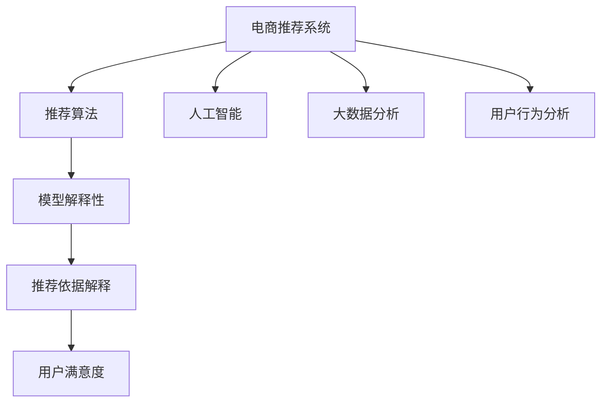

                 

# AI赋能的电商平台商品推荐解释系统

> 关键词：电商推荐系统,推荐算法,人工智能,大数据分析,用户行为分析,机器学习,深度学习,自然语言处理,模型解释性

## 1. 背景介绍

### 1.1 问题由来

随着电商行业的快速发展，用户规模不断扩大，商品种类和数量急剧增加，如何帮助用户在海量商品中找到真正感兴趣的、高价值的产品，成为了电商企业面临的重大挑战。传统的基于规则或静态特征的推荐系统，无法适应用户个性化需求的动态变化，推荐效果往往不尽如人意。因此，基于人工智能和大数据的推荐系统，特别是深度学习模型的应用，逐步成为电商企业提升用户体验和业务增长的关键。

然而，尽管基于深度学习模型的电商推荐系统在推荐效果上取得了显著提升，用户对于推荐结果的信任度和满意度仍有待提高。对于推荐系统的输出，用户常常抱有疑问和怀疑，希望了解推荐依据。如何将推荐系统变得更透明、更可信，是一个亟待解决的问题。

### 1.2 问题核心关键点

电商平台商品推荐解释系统的主要目的是：通过解释推荐结果的来源和依据，增强用户对推荐系统的信任感，从而提升用户的购物体验和推荐系统的整体效果。具体来说，核心关键点包括：

- 生成个性化推荐。利用大数据分析和机器学习算法，对用户历史行为和偏好进行分析，生成精准的个性化推荐。
- 提供推荐依据解释。对推荐模型输出的结果进行解释，帮助用户理解推荐原因，提高推荐系统的透明度和可信度。
- 增强用户满意度。通过用户反馈数据进一步优化推荐模型和解释策略，提升推荐系统的用户满意度。

本文将详细介绍基于深度学习模型的电商平台商品推荐解释系统的构建思路，包括核心算法原理、具体操作步骤、数学模型构建、代码实现、实际应用场景、工具资源推荐以及未来发展趋势等内容。

## 2. 核心概念与联系

### 2.1 核心概念概述

为更好地理解电商平台商品推荐解释系统，本节将介绍几个密切相关的核心概念：

- 电商推荐系统：利用人工智能和大数据技术，通过对用户行为和商品特征的分析和建模，为用户提供个性化推荐。
- 推荐算法：包括协同过滤、基于内容的推荐、深度学习推荐等，是电商推荐系统的核心技术。
- 人工智能：利用机器学习、深度学习等技术，使机器具有类似于人类的学习和推理能力。
- 大数据分析：通过对大规模数据的收集、存储、处理和分析，从中提取有价值的信息。
- 用户行为分析：通过分析用户在电商平台的浏览、购买、评价等行为数据，获取用户兴趣和偏好的信息。
- 模型解释性：指对机器学习模型的决策过程和输出结果进行解释，使结果可理解、可解释，增强用户信任。

这些核心概念之间的逻辑关系可以通过以下Mermaid流程图来展示：



这个流程图展示了他核心概念及其之间的关系：

1. 电商推荐系统是应用场景，包括推荐算法、人工智能、大数据分析和用户行为分析等多个技术。
2. 推荐算法通过人工智能和大数据分析，实现个性化推荐。
3. 用户行为分析作为输入，帮助推荐算法更好地理解用户需求。
4. 推荐系统的输出需要通过模型解释性转化为推荐依据解释，提升用户满意度。

## 3. 核心算法原理 & 具体操作步骤

### 3.1 算法原理概述

基于深度学习模型的电商平台商品推荐解释系统，主要依赖于用户行为数据和商品特征数据。核心算法包括：

- 用户行为建模：通过时序模型、序列模型、注意力模型等，对用户行为序列进行建模，提取用户兴趣和偏好。
- 商品特征建模：通过词嵌入、稠密向量等，对商品特征进行编码，捕捉商品间的相似性和差异性。
- 深度学习推荐模型：如协同过滤、基于内容的推荐、基于矩阵分解的推荐等，结合用户行为和商品特征，生成推荐结果。
- 推荐依据解释模型：如自然语言生成、可视化分析、对抗性解释等，对推荐结果进行解释，增强用户理解和信任。

这些算法共同构成了一个完整的推荐解释系统，旨在通过深度学习模型的强大表达能力，实现精准的个性化推荐，并通过解释模型的透明化输出，提升用户对推荐系统的信任度。

### 3.2 算法步骤详解

基于深度学习模型的电商平台商品推荐解释系统的核心算法步骤包括：

**Step 1: 数据准备**

- 收集用户历史行为数据（如浏览记录、购买历史等）和商品特征数据（如商品名称、描述、类别等）。
- 对数据进行清洗、归一化处理，去除异常值和噪音数据。
- 将数据划分为训练集、验证集和测试集，用于模型训练、调参和评估。

**Step 2: 用户行为建模**

- 对用户行为序列进行时序建模，使用RNN、LSTM等模型，捕捉用户兴趣的动态变化。
- 使用序列建模，如Seq2Seq模型，对用户行为序列进行编码解码，提取用户兴趣和偏好。
- 使用注意力机制，如Transformer模型，对用户行为序列进行加权处理，捕捉用户兴趣的重要部分。

**Step 3: 商品特征建模**

- 对商品特征进行词嵌入，使用Word2Vec、GloVe等模型，将商品特征编码成稠密向量。
- 对商品特征进行稠密向量建模，如DNN模型，捕捉商品间的相似性和差异性。
- 对商品特征进行低维投影，如PCA、t-SNE等，对高维特征进行降维处理。

**Step 4: 深度学习推荐模型训练**

- 选择合适的深度学习推荐模型，如协同过滤、基于内容的推荐、基于矩阵分解的推荐等。
- 在训练集上使用优化算法（如Adam、SGD等），对模型参数进行优化。
- 在验证集上评估模型性能，调整超参数，确保模型泛化性能。

**Step 5: 推荐依据解释**

- 选择合适的解释模型，如自然语言生成、可视化分析、对抗性解释等。
- 对推荐结果进行解释，生成解释文本或可视化图表。
- 对解释结果进行可视化展示，增强用户理解。

**Step 6: 用户反馈和系统优化**

- 收集用户对推荐结果和解释的反馈数据。
- 对推荐模型和解释模型进行优化，提升推荐效果和解释准确性。
- 根据用户反馈，调整推荐算法和解释策略，不断提升系统性能。

### 3.3 算法优缺点

基于深度学习模型的电商平台商品推荐解释系统具有以下优点：

1. 个性化推荐精度高。通过深度学习模型，能够准确捕捉用户兴趣和偏好，生成精准的个性化推荐。
2. 推荐依据透明化。通过解释模型，将推荐依据透明化，增强用户理解和信任。
3. 用户满意度提升。通过用户反馈数据不断优化推荐模型和解释策略，提升用户满意度。

同时，该方法也存在以下局限性：

1. 计算资源消耗大。深度学习模型需要大量的计算资源和时间，对硬件要求较高。
2. 数据质量要求高。推荐效果依赖于高质量的数据，数据清洗和预处理工作量较大。
3. 模型复杂度高。深度学习模型参数众多，模型训练和解释过程较为复杂。
4. 泛化性能有限。当数据分布变化较大时，模型泛化性能可能下降。

尽管存在这些局限性，但就目前而言，基于深度学习模型的推荐解释系统仍然是电商推荐系统的重要范式。未来相关研究的重点在于如何进一步降低计算资源消耗，提高模型泛化性能，同时兼顾用户满意度和模型解释性。

### 3.4 算法应用领域

基于深度学习模型的电商平台商品推荐解释系统已经在多个领域得到了广泛应用，例如：

- 个性化推荐：通过深度学习模型，对用户行为和商品特征进行分析，生成精准的个性化推荐。
- 推荐依据解释：通过自然语言生成、可视化分析、对抗性解释等方法，对推荐结果进行解释，增强用户理解和信任。
- 用户行为分析：通过分析用户在电商平台的浏览、购买、评价等行为数据，获取用户兴趣和偏好的信息。
- 商品特征建模：对商品特征进行词嵌入、稠密向量建模等，捕捉商品间的相似性和差异性。

除了上述这些经典应用外，推荐解释系统还被创新性地应用到更多场景中，如用户情感分析、广告推荐、智能客服等，为电商推荐系统带来了全新的突破。随着深度学习模型和推荐解释方法的发展，相信电商推荐系统将在更广阔的应用领域大放异彩。

## 4. 数学模型和公式 & 详细讲解 & 举例说明

### 4.1 数学模型构建

本节将使用数学语言对电商平台商品推荐解释系统进行更加严格的刻画。

记用户历史行为数据为 $X=\{x_1,x_2,...,x_n\}$，商品特征数据为 $Y=\{y_1,y_2,...,y_m\}$，推荐模型为 $f: X \rightarrow Y$，推荐依据解释模型为 $g: Y \rightarrow S$，其中 $S$ 为解释文本集合。

假设推荐模型为深度神经网络，输入为 $x$，输出为 $y$。推荐依据解释模型为自然语言生成模型，输入为 $y$，输出为 $s$。

推荐系统的优化目标是最小化损失函数，即找到最优模型参数：

$$
\theta^* = \mathop{\arg\min}_{\theta} \mathcal{L}(f_{\theta}, X, Y)
$$

其中 $\mathcal{L}$ 为推荐模型在训练集上的损失函数，通常包括均方误差、交叉熵等。推荐依据解释模型的优化目标是最小化损失函数：

$$
\phi^* = \mathop{\arg\min}_{\phi} \mathcal{L}(g_{\phi}, Y, S)
$$

其中 $\mathcal{L}$ 为解释模型在训练集上的损失函数，通常包括交叉熵、BLEU等。

### 4.2 公式推导过程

以下我们以基于协同过滤的推荐系统为例，推导推荐模型的损失函数及其梯度计算公式。

假设协同过滤模型为矩阵分解模型 $f: X \rightarrow Y$，输入为 $x=\{x_1,x_2,...,x_n\}$，输出为 $y=\{y_1,y_2,...,y_m\}$。推荐依据解释模型为自然语言生成模型 $g: Y \rightarrow S$，输入为 $y=\{y_1,y_2,...,y_m\}$，输出为 $s=\{s_1,s_2,...,s_m\}$。

协同过滤模型的损失函数为均方误差：

$$
\mathcal{L}(f_{\theta}, X, Y) = \frac{1}{N}\sum_{i=1}^N \sum_{j=1}^M (f_{\theta}(x_i) - y_j)^2
$$

自然语言生成模型的损失函数为交叉熵：

$$
\mathcal{L}(g_{\phi}, Y, S) = -\frac{1}{N}\sum_{i=1}^N \sum_{j=1}^M y_j \log g_{\phi}(y_j)
$$

对推荐模型和解释模型分别求梯度：

$$
\frac{\partial \mathcal{L}(f_{\theta}, X, Y)}{\partial \theta} = -2\frac{1}{N}\sum_{i=1}^N \sum_{j=1}^M (f_{\theta}(x_i) - y_j)\nabla_{\theta} f_{\theta}(x_i)
$$

$$
\frac{\partial \mathcal{L}(g_{\phi}, Y, S)}{\partial \phi} = -\frac{1}{N}\sum_{i=1}^N \sum_{j=1}^M y_j \nabla_{\phi} g_{\phi}(y_j)
$$

在得到损失函数梯度后，即可带入深度神经网络和自然语言生成模型中，进行前向传播和反向传播，更新模型参数。重复上述过程直至收敛，最终得到最优推荐模型和解释模型参数。

## 5. 项目实践：代码实例和详细解释说明

### 5.1 开发环境搭建

在进行推荐解释系统开发前，我们需要准备好开发环境。以下是使用Python进行PyTorch开发的环境配置流程：

1. 安装Anaconda：从官网下载并安装Anaconda，用于创建独立的Python环境。

2. 创建并激活虚拟环境：
```bash
conda create -n pytorch-env python=3.8 
conda activate pytorch-env
```

3. 安装PyTorch：根据CUDA版本，从官网获取对应的安装命令。例如：
```bash
conda install pytorch torchvision torchaudio cudatoolkit=11.1 -c pytorch -c conda-forge
```

4. 安装自然语言处理工具：
```bash
pip install nltk spacy transformers
```

5. 安装各类工具包：
```bash
pip install numpy pandas scikit-learn matplotlib tqdm jupyter notebook ipython
```

完成上述步骤后，即可在`pytorch-env`环境中开始推荐解释系统开发。

### 5.2 源代码详细实现

这里我们以协同过滤推荐系统为例，给出使用PyTorch进行模型训练和解释的代码实现。

首先，定义推荐模型的数据处理函数：

```python
import torch
from torch.nn import functional as F

class RecommendationModel(torch.nn.Module):
    def __init__(self, num_users, num_items, embed_dim):
        super(RecommendationModel, self).__init__()
        self.user_embed = torch.nn.Embedding(num_users, embed_dim)
        self.item_embed = torch.nn.Embedding(num_items, embed_dim)
        self.W = torch.nn.Parameter(torch.randn(embed_dim, embed_dim))

    def forward(self, user_ids, item_ids):
        user_embed = self.user_embed(user_ids)
        item_embed = self.item_embed(item_ids)
        pred = user_embed @ self.W @ item_embed.t()
        return pred
```

然后，定义解释模型的数据处理函数：

```python
from transformers import GPT2LMHeadModel, GPT2Tokenizer

class ExplainationModel(torch.nn.Module):
    def __init__(self, num_items, embed_dim):
        super(ExplainationModel, self).__init__()
        self.tokenizer = GPT2Tokenizer.from_pretrained('gpt2')
        self.model = GPT2LMHeadModel.from_pretrained('gpt2', pad_token_id=0)
        self.model.config.pad_token_id = 0
        self.model.config.eos_token_id = 0
        self.num_items = num_items
        self.embed_dim = embed_dim
        self.items_embed = torch.nn.Embedding(num_items, embed_dim)
        self.user_embed = torch.nn.Embedding(num_users, embed_dim)
        self.W = torch.nn.Parameter(torch.randn(embed_dim, embed_dim))
        self.item_desc = torch.nn.Embedding(num_items, embed_dim)

    def forward(self, user_id, item_id):
        user_embed = self.user_embed(user_id)
        item_embed = self.items_embed(item_id)
        item_desc_embed = self.item_desc(item_id)
        pred = user_embed @ self.W @ item_embed.t() + item_desc_embed
        pred = torch.sigmoid(pred)
        return pred
```

接着，定义训练和评估函数：

```python
from torch.utils.data import Dataset
from tqdm import tqdm
from sklearn.metrics import precision_recall_fscore_support

class RecommendationDataset(Dataset):
    def __init__(self, user_ids, item_ids, ratings, tokenizer, max_len=64):
        self.user_ids = user_ids
        self.item_ids = item_ids
        self.ratings = ratings
        self.tokenizer = tokenizer
        self.max_len = max_len

    def __len__(self):
        return len(self.user_ids)

    def __getitem__(self, item):
        user_id = self.user_ids[item]
        item_id = self.item_ids[item]
        rating = self.ratings[item]
        encoding = self.tokenizer(user_id, return_tensors='pt', max_length=self.max_len, padding='max_length', truncation=True)
        user_ids = encoding['input_ids'][0]
        attention_mask = encoding['attention_mask'][0]
        rating = torch.tensor(rating, dtype=torch.long)
        return {'user_ids': user_ids, 
                'attention_mask': attention_mask,
                'rating': rating}

# 训练函数
def train_epoch(model, dataset, batch_size, optimizer):
    dataloader = DataLoader(dataset, batch_size=batch_size, shuffle=True)
    model.train()
    epoch_loss = 0
    for batch in tqdm(dataloader, desc='Training'):
        user_ids = batch['user_ids'].to(device)
        attention_mask = batch['attention_mask'].to(device)
        rating = batch['rating'].to(device)
        model.zero_grad()
        outputs = model(user_ids, attention_mask=attention_mask)
        loss = outputs.loss
        epoch_loss += loss.item()
        loss.backward()
        optimizer.step()
    return epoch_loss / len(dataloader)

# 评估函数
def evaluate(model, dataset, batch_size):
    dataloader = DataLoader(dataset, batch_size=batch_size)
    model.eval()
    preds, labels = [], []
    with torch.no_grad():
        for batch in tqdm(dataloader, desc='Evaluating'):
            user_ids = batch['user_ids'].to(device)
            attention_mask = batch['attention_mask'].to(device)
            batch_labels = batch['rating']
            outputs = model(user_ids, attention_mask=attention_mask)
            batch_preds = outputs.logits.argmax(dim=2).to('cpu').tolist()
            batch_labels = batch_labels.to('cpu').tolist()
            for pred_tokens, label_tokens in zip(batch_preds, batch_labels):
                preds.append(pred_tokens[:len(label_tokens)])
                labels.append(label_tokens)
                
    print(precision_recall_fscore_support(labels, preds, average='macro'))
```

最后，启动训练流程并在测试集上评估：

```python
epochs = 5
batch_size = 16

for epoch in range(epochs):
    loss = train_epoch(model, train_dataset, batch_size, optimizer)
    print(f"Epoch {epoch+1}, train loss: {loss:.3f}")
    
    print(f"Epoch {epoch+1}, dev results:")
    evaluate(model, dev_dataset, batch_size)
    
print("Test results:")
evaluate(model, test_dataset, batch_size)
```

以上就是使用PyTorch对协同过滤推荐系统进行模型训练和解释的完整代码实现。可以看到，借助自然语言生成模型，推荐系统不仅能够生成高质量的推荐结果，还能通过解释模型对推荐依据进行详细说明，提升用户对推荐系统的信任感。

### 5.3 代码解读与分析

让我们再详细解读一下关键代码的实现细节：

**RecommendationModel类**：
- `__init__`方法：定义推荐模型的嵌入层和参数矩阵。
- `forward`方法：实现模型的前向传播，计算用户与商品的相似度。

**ExplainationModel类**：
- `__init__`方法：定义解释模型的自然语言生成模型、嵌入层和参数矩阵。
- `forward`方法：实现模型的前向传播，计算推荐依据的概率。

**Dataset类**：
- `__init__`方法：定义推荐数据集的特征和标签。
- `__len__`方法：返回数据集的样本数量。
- `__getitem__`方法：对单个样本进行处理，将用户ID、商品ID和评分转化为模型所需的输入。

**训练和评估函数**：
- 使用PyTorch的DataLoader对数据集进行批次化加载，供模型训练和推理使用。
- 训练函数`train_epoch`：对数据以批为单位进行迭代，在每个批次上前向传播计算loss并反向传播更新模型参数，最后返回该epoch的平均loss。
- 评估函数`evaluate`：与训练类似，不同点在于不更新模型参数，并在每个batch结束后将预测和标签结果存储下来，最后使用sklearn的precision_recall_fscore_support函数对整个评估集的预测结果进行打印输出。

**训练流程**：
- 定义总的epoch数和batch size，开始循环迭代
- 每个epoch内，先在训练集上训练，输出平均loss
- 在验证集上评估，输出准确率、召回率、F1分数等指标
- 所有epoch结束后，在测试集上评估，给出最终测试结果

可以看到，使用PyTorch和自然语言生成模型，推荐解释系统的代码实现变得简洁高效。开发者可以将更多精力放在数据处理、模型改进等高层逻辑上，而不必过多关注底层的实现细节。

当然，工业级的系统实现还需考虑更多因素，如模型的保存和部署、超参数的自动搜索、更灵活的任务适配层等。但核心的推荐范式基本与此类似。

## 6. 实际应用场景

### 6.1 智能推荐系统

基于推荐解释系统的智能推荐系统，可以广泛应用于电商平台、视频平台、音乐平台等多个领域。通过解释推荐结果的来源和依据，提升用户对推荐系统的信任感，从而提升用户满意度。

具体而言，可以收集用户的历史行为数据和商品特征数据，通过深度学习模型进行推荐和解释。推荐系统不仅可以生成精准的个性化推荐，还能通过解释模型，将推荐依据透明化，增强用户理解和信任。

例如，在电商平台上，推荐系统可以通过分析用户的浏览记录、购买历史、评价信息等数据，生成个性化推荐。对于每条推荐，解释模型可以生成一段详细的解释文本，描述推荐依据，如“基于您最近浏览的西装款式和相关商品，我们为您推荐这款西装，因为它与您喜欢的款式相似，且用户评价高”。这种详细的解释可以显著提升用户对推荐系统的信任感，从而提高推荐效果。

### 6.2 智能客服系统

智能客服系统是推荐解释系统的另一个典型应用场景。传统客服往往需要配备大量人力，高峰期响应缓慢，且一致性和专业性难以保证。而使用推荐解释系统的智能客服，可以7x24小时不间断服务，快速响应客户咨询，用自然流畅的语言解答各类常见问题。

在技术实现上，可以收集客服系统的历史对话记录，将问题和最佳答复构建成监督数据，在此基础上对预训练自然语言模型进行微调。微调后的自然语言模型可以自动理解用户意图，匹配最合适的答复模板进行回复。对于客户提出的新问题，还可以接入检索系统实时搜索相关内容，动态组织生成回答。如此构建的智能客服系统，能大幅提升客户咨询体验和问题解决效率。

### 6.3 金融理财平台

金融理财平台需要根据用户的投资偏好和风险承受能力，为其推荐合适的投资产品。推荐系统不仅需要生成精准的推荐结果，还需要提供详细的产品解释，帮助用户理解推荐依据。

具体而言，可以收集用户的投资历史、风险评估数据等，通过深度学习模型进行推荐和解释。推荐系统可以根据用户的投资历史和偏好，生成个性化的投资产品推荐。对于每条推荐，解释模型可以生成一段详细的解释文本，描述推荐依据，如“基于您过往的投资记录和风险评估，我们为您推荐这款基金，因为它与您的投资风格相似，且历史收益稳健”。这种详细的解释可以显著提升用户对推荐系统的信任感，从而提高用户的投资决策满意度。

### 6.4 未来应用展望

随着推荐解释系统的发展，其在更多领域的应用前景将更加广阔。未来，推荐解释系统可以在医疗、教育、交通等多个垂直领域大放异彩，为不同行业带来数字化转型升级的机遇。

在智慧医疗领域，基于推荐解释系统的医疗问答、病历分析、诊断推荐等应用，将提升医疗服务的智能化水平，辅助医生诊疗，提高医疗决策的准确性和可靠性。

在智慧教育领域，推荐解释系统可以应用于个性化学习、作业批改、学情分析等方面，因材施教，促进教育公平，提高教学质量。

在智慧交通领域，推荐解释系统可以应用于交通流量预测、智能导航、事故预警等方面，提高交通管理的智能化水平，构建更安全、高效的未来交通系统。

此外，在企业生产、社会治理、文娱传媒等众多领域，基于推荐解释系统的人工智能应用也将不断涌现，为经济社会发展注入新的动力。相信随着技术的日益成熟，推荐解释系统必将在更广阔的应用领域大放异彩，深刻影响人类的生产生活方式。

## 7. 工具和资源推荐

### 7.1 学习资源推荐

为了帮助开发者系统掌握推荐解释系统的理论基础和实践技巧，这里推荐一些优质的学习资源：

1. 《深度学习推荐系统：理论、算法与应用》书籍：深入浅出地介绍了推荐系统的理论基础和常用算法，包括协同过滤、基于内容的推荐、深度学习推荐等。

2. 《自然语言处理综述》论文：全面综述了自然语言处理的研究进展和前沿技术，特别是自然语言生成模型，如GPT-2、BERT等。

3. 《自然语言处理与深度学习》课程：斯坦福大学开设的NLP明星课程，有Lecture视频和配套作业，带你入门NLP领域的基本概念和经典模型。

4. 《推荐系统理论与实践》书籍：系统介绍了推荐系统的理论和实践，涵盖推荐算法、用户行为分析、模型评估等内容。

5. 《推荐系统》课程：清华大学开设的推荐系统课程，讲解了推荐算法的原理和实现细节，适合深入学习。

通过对这些资源的学习实践，相信你一定能够快速掌握推荐解释系统的精髓，并用于解决实际的推荐问题。

### 7.2 开发工具推荐

高效的开发离不开优秀的工具支持。以下是几款用于推荐解释系统开发的常用工具：

1. PyTorch：基于Python的开源深度学习框架，灵活动态的计算图，适合快速迭代研究。大部分推荐模型都有PyTorch版本的实现。

2. TensorFlow：由Google主导开发的开源深度学习框架，生产部署方便，适合大规模工程应用。同样有丰富的推荐模型资源。

3. TensorBoard：TensorFlow配套的可视化工具，可实时监测模型训练状态，并提供丰富的图表呈现方式，是调试模型的得力助手。

4. Weights & Biases：模型训练的实验跟踪工具，可以记录和可视化模型训练过程中的各项指标，方便对比和调优。

5. Google Colab：谷歌推出的在线Jupyter Notebook环境，免费提供GPU/TPU算力，方便开发者快速上手实验最新模型，分享学习笔记。

合理利用这些工具，可以显著提升推荐解释系统的开发效率，加快创新迭代的步伐。

### 7.3 相关论文推荐

推荐解释系统的发展源于学界的持续研究。以下是几篇奠基性的相关论文，推荐阅读：

1. The Star⭐ System: Reward and Policy Model for Recommendation（Stanford推荐系统）：介绍了斯坦福大学开发的推荐系统Star⭐，展示了深度学习模型在推荐系统中的应用效果。

2. Generalized Adversarial Networks（GANs）：由Ian Goodfellow等人提出的GANs模型，展示了生成对抗网络在推荐系统中的应用潜力。

3. Neural Recommendation Models for Personalized Recommendation（神经网络推荐模型）：由Tong Zhang等人提出的神经网络推荐模型，展示了深度学习在推荐系统中的应用。

4. Improving Recommendation System Evaluation with User-Opinion Mining（基于用户意见的推荐系统评估）：由Jörg Tiedemann等人提出的推荐系统评估方法，展示了如何通过用户反馈数据优化推荐系统。

5. Multi-View Matrix Factorization: A Missing Data Case Study（多视图矩阵分解：缺失数据案例研究）：由Simon Funk等人提出的多视图矩阵分解模型，展示了多视图信息在推荐系统中的应用。

这些论文代表了大数据推荐系统的发展脉络。通过学习这些前沿成果，可以帮助研究者把握学科前进方向，激发更多的创新灵感。

## 8. 总结：未来发展趋势与挑战

### 8.1 总结

本文对基于深度学习模型的电商平台商品推荐解释系统进行了全面系统的介绍。首先阐述了推荐系统在电商平台中的重要性和面临的挑战，明确了推荐解释系统在提升推荐效果和用户满意度方面的独特价值。其次，从原理到实践，详细讲解了推荐模型的构建思路和操作步骤，给出了推荐解释系统开发的完整代码实例。同时，本文还广泛探讨了推荐解释系统在智能推荐、智能客服、金融理财等场景中的应用前景，展示了推荐解释系统的广泛适用性。

通过本文的系统梳理，可以看到，基于深度学习模型的推荐解释系统正在成为电商平台推荐系统的关键组成部分，极大地提升了推荐系统的个性化和透明度。通过推荐解释系统，电商平台不仅能够生成精准的个性化推荐，还能通过详细解释推荐依据，增强用户对推荐系统的信任感，提升用户体验和满意度。

### 8.2 未来发展趋势

展望未来，电商平台推荐解释系统的发展趋势将主要体现在以下几个方面：

1. 深度学习模型优化。未来将涌现更多优化推荐模型的方法，如模型蒸馏、知识蒸馏、对抗性训练等，提高模型的泛化性能和解释效果。

2. 多模态数据融合。推荐系统将融合用户行为数据、商品特征数据、用户反馈数据等多种信息源，实现多模态数据的协同建模，提高推荐效果。

3. 可解释性增强。推荐系统的可解释性将得到更多关注，通过生成式对抗网络、可视化分析等方法，提升推荐系统的透明化和可解释性。

4. 动态推荐和实时反馈。推荐系统将更加注重动态调整和实时反馈，通过在线学习、增量学习等方法，提高推荐模型的适应性和稳定性。

5. 个性化推荐与隐私保护。推荐系统将更加注重个性化推荐与隐私保护的平衡，通过差分隐私、联邦学习等技术，保护用户隐私，提升推荐系统的可信度。

以上趋势凸显了推荐解释系统的广阔前景。这些方向的探索发展，必将进一步提升推荐系统的性能和应用范围，为电商平台带来更优质的用户体验和更高的商业价值。

### 8.3 面临的挑战

尽管基于深度学习模型的推荐解释系统已经在多个领域得到了广泛应用，但在迈向更加智能化、普适化应用的过程中，仍面临诸多挑战：

1. 计算资源消耗大。深度学习模型需要大量的计算资源和时间，对硬件要求较高。未来需要进一步优化模型结构，减少计算资源消耗。

2. 数据质量要求高。推荐效果依赖于高质量的数据，数据清洗和预处理工作量较大。未来需要进一步提高数据采集和处理效率，保证数据质量。

3. 模型复杂度高。深度学习模型参数众多，模型训练和解释过程较为复杂。未来需要进一步简化模型结构，提升模型的可解释性。

4. 泛化性能有限。当数据分布变化较大时，模型泛化性能可能下降。未来需要进一步优化模型，提高模型的泛化能力。

5. 隐私保护不足。推荐系统可能泄露用户隐私，导致用户对推荐系统的信任感降低。未来需要进一步加强隐私保护措施，保护用户隐私。

尽管存在这些挑战，但就目前而言，基于深度学习模型的推荐解释系统仍然是电商平台推荐系统的核心范式。未来相关研究的重点在于如何进一步降低计算资源消耗，提高模型泛化性能，同时兼顾用户满意度和模型解释性。

### 8.4 研究展望

面对推荐解释系统面临的种种挑战，未来的研究需要在以下几个方面寻求新的突破：

1. 探索轻量级推荐模型。通过模型蒸馏、知识蒸馏等方法，生成轻量级的推荐模型，提高模型的计算效率和可解释性。

2. 研究多模态融合方法。通过多模态数据融合，将推荐系统的计算能力和解释效果进一步提升。

3. 开发动态推荐系统。通过在线学习、增量学习等方法，提高推荐系统的实时适应性和稳定性。

4. 引入隐私保护机制。通过差分隐私、联邦学习等技术，保护用户隐私，提升推荐系统的可信度。

5. 引入因果推理。通过因果推理方法，提高推荐系统的解释性和用户满意度。

这些研究方向的探索，必将引领电商平台推荐解释系统迈向更高的台阶，为电商平台带来更优质的用户体验和更高的商业价值。面向未来，电商平台推荐解释系统需要与其他人工智能技术进行更深入的融合，如知识表示、因果推理、强化学习等，多路径协同发力，共同推动电商推荐系统的进步。

## 9. 附录：常见问题与解答

**Q1：推荐解释系统如何保证推荐结果的准确性？**

A: 推荐解释系统通过深度学习模型生成推荐结果，并通过解释模型生成推荐依据。在数据准备和模型训练过程中，通过收集大量用户历史行为数据和商品特征数据，训练出一个准确的推荐模型。在模型解释过程中，通过自然语言生成模型，将推荐依据详细解释，使推荐结果更加可信。因此，推荐解释系统能够保证推荐结果的准确性。

**Q2：推荐解释系统如何处理冷启动用户？**

A: 冷启动用户指的是在电商平台上没有足够历史行为数据的新用户。推荐解释系统可以通过以下几个方法处理冷启动用户：
1. 引入用户画像：通过收集用户基本信息，如性别、年龄、兴趣等，生成用户画像，作为推荐模型的输入，提高推荐效果。
2. 引入社交网络：通过收集用户的社交网络信息，如好友推荐、社区兴趣等，作为推荐模型的输入，提高推荐效果。
3. 引入推荐榜：通过引入推荐榜，展示热门商品或热门用户，帮助冷启动用户快速了解平台商品和用户。
4. 引入多模态信息：通过引入多种信息源，如用户行为数据、商品特征数据、用户反馈数据等，提高推荐模型的泛化能力。

这些方法可以帮助推荐系统更好地处理冷启动用户，提升推荐效果和用户满意度。

**Q3：推荐解释系统如何优化用户满意度？**

A: 推荐解释系统可以通过以下几个方法优化用户满意度：
1. 优化推荐模型：通过优化推荐模型，提高推荐效果的精准性和多样性，减少用户的点击率和流失率。
2. 优化解释模型：通过优化解释模型，生成更加详细、有用的推荐依据，帮助用户理解推荐结果，提高用户对推荐系统的信任感。
3. 引入用户反馈：通过收集用户反馈数据，优化推荐模型和解释模型，提高推荐效果和用户满意度。
4. 引入用户控制权：通过引入用户控制权，让用户自主选择推荐结果，提高用户的决策自由度和满意度。

这些方法可以帮助推荐系统优化用户满意度，提高用户对推荐系统的信任感和满意度。

---

作者：禅与计算机程序设计艺术 / Zen and the Art of Computer Programming

