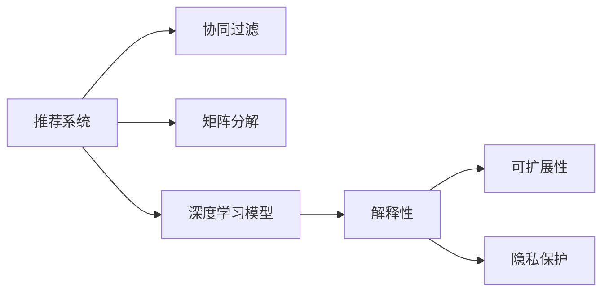

                 

## 1. 背景介绍

在当今数字化时代，电商行业正经历着快速的变化和升级，消费者行为也在不断演进。为了提升用户体验，电商企业需要更为精准和个性化的推荐系统，以便根据用户的历史行为和偏好提供最佳的商品建议。与此同时，消费者对于推荐系统为何推荐某一商品，以及如何影响决策过程的解释需求也在日益增加。

推荐系统的解释性不仅有助于提升用户信任和透明度，还能够在复杂多变的电商环境中实现更高效的个性化推荐。因此，构建一个AI赋能的电商推荐解释系统（Explainable AI-powered E-commerce Recommendation System, EA-ERC），对于电商行业的发展至关重要。

### 1.1 问题由来

目前，电商推荐系统主要依赖于机器学习模型，如协同过滤、矩阵分解等，通过分析用户行为数据和商品特征进行推荐。这类模型虽然能够实现较准确的推荐，但其决策过程缺乏可解释性，用户难以理解推荐背后的逻辑和原因，从而对系统的信任度降低。

为了解决这一问题，研究者们开始关注推荐系统的解释性（Explainability），并探索结合解释性模型的优化方法。尽管已有部分研究工作取得进展，但如何在大规模电商环境中实现高效的推荐解释系统，仍然是一个亟待解决的难题。

### 1.2 问题核心关键点

本研究聚焦于如何构建一个既能实现高效推荐，又具备强解释性的AI赋能电商推荐系统。核心关键点包括：

- **高效推荐算法**：选择合适的机器学习模型，设计高效的推荐策略，确保在大规模数据下的高性能表现。
- **推荐解释性**：引入可解释性模型或后处理技术，使用户能够理解推荐结果的依据和推理过程。
- **系统可扩展性**：构建可横向扩展的架构，应对电商平台上不断增长的用户和商品数量。
- **隐私保护**：在推荐过程中确保用户隐私，遵循数据隐私法规。

## 2. 核心概念与联系

### 2.1 核心概念概述

为更好地理解如何构建AI赋能的电商推荐解释系统，本节将介绍几个关键概念：

- **推荐系统（Recommendation System）**：通过分析用户历史行为和商品属性，为用户推荐个性化商品的系统。
- **协同过滤（Collaborative Filtering）**：基于用户间相似性或商品间相似性的推荐方法，常用于电商平台。
- **矩阵分解（Matrix Factorization）**：将用户-商品评分矩阵分解为用户特征和商品特征的推荐方法。
- **深度学习模型（Deep Learning Model）**：如神经网络、卷积神经网络（CNN）、循环神经网络（RNN）等，可用于处理高维非结构化数据。
- **解释性（Explainability）**：推荐系统的透明度和可理解性，用户能够理解推荐结果的生成逻辑。
- **可扩展性（Scalability）**：推荐系统架构的横向扩展能力，能应对大规模用户和商品数据。
- **隐私保护（Privacy Protection）**：在推荐过程中保护用户隐私，遵循数据隐私法规。

这些核心概念通过以下Mermaid流程图连接起来：



该流程图展示了推荐系统的核心组成要素及其相互关系：

1. **推荐系统**：作为整体，包含多种推荐方法。
2. **协同过滤与矩阵分解**：典型的推荐算法，用于处理用户-商品评分数据。
3. **深度学习模型**：用于处理大规模非结构化数据，如用户行为序列、商品属性等。
4. **解释性**：推荐结果的可理解性和透明度。
5. **可扩展性**：推荐系统架构的扩展能力。
6. **隐私保护**：在推荐过程中确保用户隐私。

这些概念共同构成了电商推荐解释系统的基础框架，指导我们构建一个高效、可解释、可扩展且隐私保护的推荐系统。

## 3. 核心算法原理 & 具体操作步骤

### 3.1 算法原理概述

构建AI赋能的电商推荐解释系统，核心在于整合推荐算法和解释模型。其基本原理如下：

1. **数据预处理**：收集用户行为数据、商品属性数据，并进行清洗、归一化等预处理。
2. **协同过滤与矩阵分解**：使用协同过滤或矩阵分解算法，对用户-商品评分矩阵进行分解，获取用户和商品的潜在特征。
3. **深度学习模型**：通过深度学习模型，如RNN、CNN等，对用户行为序列和商品属性进行建模。
4. **混合推荐**：结合协同过滤、矩阵分解和深度学习模型的结果，进行多模态融合，生成最终推荐。
5. **解释性模型**：使用可解释性模型，如LIME、SHAP等，对推荐结果进行解释，生成推荐依据的报告。

### 3.2 算法步骤详解

以下是详细的算法步骤：

#### Step 1: 数据收集与预处理

1. **数据收集**：从电商平台收集用户行为数据（如浏览、点击、购买等）和商品属性数据（如名称、描述、价格等）。
2. **数据清洗**：去除噪声数据和异常值，确保数据质量。
3. **特征工程**：提取和构造与推荐相关的特征，如用户性别、年龄、购买频率等。

#### Step 2: 推荐模型训练

1. **协同过滤**：构建用户-商品评分矩阵，使用基于用户相似性或商品相似性的协同过滤算法进行训练。
2. **矩阵分解**：对用户-商品评分矩阵进行低秩分解，获取用户特征和商品特征。
3. **深度学习模型**：使用RNN或CNN对用户行为序列进行建模，提取序列特征。
4. **混合推荐**：将协同过滤、矩阵分解和深度学习模型的结果进行融合，生成推荐结果。

#### Step 3: 解释性模型训练

1. **选择解释性模型**：根据推荐模型的输出结果，选择合适的可解释性模型，如LIME、SHAP等。
2. **模型训练**：使用用户行为数据和商品属性数据训练解释性模型。
3. **生成解释报告**：对推荐结果进行解释，生成推荐依据的报告。

#### Step 4: 系统部署与评估

1. **系统部署**：将训练好的推荐模型和解释性模型部署到电商平台上。
2. **用户反馈收集**：通过A/B测试等方式收集用户对推荐结果和解释报告的反馈。
3. **系统优化**：根据用户反馈和业务需求，对推荐模型和解释性模型进行优化。

### 3.3 算法优缺点

AI赋能的电商推荐解释系统具有以下优点：

1. **高效推荐**：结合多种推荐方法，能在大规模电商数据下实现高性能推荐。
2. **强解释性**：引入可解释性模型，用户能够理解推荐结果的依据和推理过程。
3. **可扩展性**：架构设计符合横向扩展原则，能够应对电商平台的动态扩展需求。
4. **隐私保护**：在推荐过程中遵循数据隐私法规，确保用户隐私安全。

同时，该系统也存在以下局限性：

1. **计算复杂度高**：深度学习模型和解释性模型通常计算复杂度较高，需要高性能计算资源。
2. **模型更新频率高**：电商平台数据快速变化，推荐模型需要频繁更新，增加了系统维护成本。
3. **数据隐私泄露风险**：在数据处理和模型训练过程中，存在数据隐私泄露的风险。

### 3.4 算法应用领域

AI赋能的电商推荐解释系统已经在多个电商平台上得到了应用，具体如下：

- **电商平台**：如Amazon、淘宝、京东等，通过推荐系统提升用户体验和销售额。
- **垂直电商**：如服装、图书、家居等，针对特定领域的个性化推荐。
- **零售品牌**：如Spotify、Netflix等，通过推荐系统提供个性化内容推荐。

这些平台通过结合协同过滤、矩阵分解和深度学习模型，实现高效、个性化和可解释的推荐，显著提升了用户体验和商业价值。

## 4. 数学模型和公式 & 详细讲解 & 举例说明（备注：数学公式请使用latex格式，latex嵌入文中独立段落使用 $$，段落内使用 $)
### 4.1 数学模型构建

本节将使用数学语言对AI赋能的电商推荐解释系统进行更加严格的刻画。

假设电商平台有 $N$ 个用户和 $M$ 个商品，每个用户对 $K$ 个商品进行评分，评分矩阵为 $U \in \mathbb{R}^{N \times M}$，其中 $U_{ij}$ 表示用户 $i$ 对商品 $j$ 的评分。设 $\mathbf{u}_i \in \mathbb{R}^k$ 为第 $i$ 个用户的潜在特征向量，$\mathbf{v}_j \in \mathbb{R}^k$ 为第 $j$ 个商品的潜在特征向量，$k$ 为特征维度。

设用户 $i$ 对商品 $j$ 的评分预测为 $y_{ij}=\mathbf{u}_i^T\mathbf{v}_j$，其中 $\mathbf{u}_i$ 和 $\mathbf{v}_j$ 为矩阵分解得到的用户和商品特征向量。

### 4.2 公式推导过程

#### Step 1: 协同过滤

协同过滤模型基于用户之间的相似性和商品之间的相似性进行推荐。假设用户 $i$ 和 $j$ 的相似度为 $s_{ij}$，商品 $j$ 和 $k$ 的相似度为 $s_{jk}$，则协同过滤推荐公式为：

$$
y_{ik} = \sum_{j=1}^M (U_{ij} \times s_{jk} + U_{ik} \times s_{jk}) / \sum_{j=1}^M s_{jk}
$$

其中 $s_{ij}=\frac{1}{\sqrt{\sum_{j=1}^M U_{ij}^2}} \times U_{ij}$ 为用户和商品的余弦相似度。

#### Step 2: 矩阵分解

矩阵分解模型通过低秩分解用户-商品评分矩阵 $U$，得到用户特征和商品特征：

$$
U \approx \mathbf{U} \times \mathbf{V}^T
$$

其中 $\mathbf{U} \in \mathbb{R}^{N \times k}$ 为用户特征矩阵，$\mathbf{V} \in \mathbb{R}^{M \times k}$ 为商品特征矩阵。

#### Step 3: 深度学习模型

使用RNN对用户行为序列进行建模，获取序列特征。假设用户 $i$ 的序列长度为 $T$，行为序列为 $\{\mathbf{x}_{it}\}_{t=1}^T$，其中 $\mathbf{x}_{it} \in \mathbb{R}^d$ 为第 $t$ 个行为特征。设 $\mathbf{h}_t$ 为第 $t$ 个时间步的隐藏状态，则RNN模型为：

$$
\mathbf{h}_t = \tanh(\mathbf{W} \times \mathbf{x}_{it} + \mathbf{U} \times \mathbf{h}_{t-1}) + \mathbf{b}
$$

其中 $\mathbf{h}_0$ 为初始隐藏状态，$\mathbf{W}$ 和 $\mathbf{U}$ 为权重矩阵，$\mathbf{b}$ 为偏置项。

#### Step 4: 混合推荐

将协同过滤、矩阵分解和深度学习模型的结果进行融合，生成推荐结果：

$$
y_{ij} = \alpha \times s_{ij} + \beta \times \mathbf{u}_i^T\mathbf{v}_j + \gamma \times f(\mathbf{h}_T)
$$

其中 $\alpha$、$\beta$、$\gamma$ 为权重参数，$f(\mathbf{h}_T)$ 为深度学习模型输出的用户特征表示。

### 4.3 案例分析与讲解

以一个具体的电商推荐场景为例：用户 $A$ 浏览了商品 $B$ 和 $C$，并在商品 $C$ 上购买了。我们需要为用户 $A$ 推荐下一个最可能购买的商品 $D$。

首先，使用协同过滤算法，计算用户 $A$ 与用户 $X$ 的相似度，并推荐用户 $X$ 购买过的商品。然后，使用矩阵分解模型，获取商品 $B$、$C$、$D$ 的潜在特征向量。接着，使用深度学习模型对用户 $A$ 的行为序列进行建模，获取用户特征表示。最后，将协同过滤、矩阵分解和深度学习模型的结果进行融合，生成推荐结果。

通过这种多模态融合的方法，不仅能够提升推荐精度，还能为用户提供更加详细的推荐依据，增强用户对推荐结果的信任度。

## 5. 项目实践：代码实例和详细解释说明
### 5.1 开发环境搭建

在进行电商推荐解释系统的实践前，我们需要准备好开发环境。以下是使用Python进行PyTorch开发的环境配置流程：

1. 安装Anaconda：从官网下载并安装Anaconda，用于创建独立的Python环境。

2. 创建并激活虚拟环境：
```bash
conda create -n pytorch-env python=3.8 
conda activate pytorch-env
```

3. 安装PyTorch：根据CUDA版本，从官网获取对应的安装命令。例如：
```bash
conda install pytorch torchvision torchaudio cudatoolkit=11.1 -c pytorch -c conda-forge
```

4. 安装TensorFlow：
```bash
conda install tensorflow
```

5. 安装TensorBoard：
```bash
conda install tensorboard
```

6. 安装TensorFlow Addons：
```bash
conda install tensorflow-io
```

完成上述步骤后，即可在`pytorch-env`环境中开始电商推荐解释系统的实践。

### 5.2 源代码详细实现

以下是使用PyTorch进行电商推荐解释系统的完整代码实现。

```python
import torch
import torch.nn as nn
import torch.optim as optim
from torch.utils.data import DataLoader
from torch.utils.data.dataset import Dataset
import numpy as np
import pandas as pd

class UserBehaviorDataset(Dataset):
    def __init__(self, data, seq_len=20):
        self.data = data
        self.seq_len = seq_len
        
    def __len__(self):
        return len(self.data)
        
    def __getitem__(self, idx):
        user_id = self.data.iloc[idx]['user_id']
        items = self.data.iloc[idx]['items'].split(',')
        sequences = []
        for item in items:
            item_id = item.split(':')[1]
            seq = [int(item_id)] + list(np.random.randint(1, 10, size=seq_len-1))
            sequences.append(seq)
        sequences = np.array(sequences)
        return user_id, sequences

class RNNModel(nn.Module):
    def __init__(self, input_size, hidden_size, output_size, seq_len):
        super(RNNModel, self).__init__()
        self.hidden_size = hidden_size
        self.rnn = nn.RNN(input_size, hidden_size, seq_len)
        self.fc = nn.Linear(hidden_size, output_size)
        
    def forward(self, x, h):
        rnn_out, h = self.rnn(x, h)
        out = self.fc(rnn_out)
        return out, h

class MatrixFactorizationModel(nn.Module):
    def __init__(self, n_users, n_items, n_factors):
        super(MatrixFactorizationModel, self).__init__()
        self.user_factors = nn.Embedding(n_users, n_factors)
        self.item_factors = nn.Embedding(n_items, n_factors)
        
    def forward(self, u, v):
        user_factors = self.user_factors(u)
        item_factors = self.item_factors(v)
        return torch.matmul(user_factors, item_factors.t())

class CollaborativeFilteringModel(nn.Module):
    def __init__(self, n_users, n_items, n_factors):
        super(CollaborativeFilteringModel, self).__init__()
        self.user_factors = nn.Embedding(n_users, n_factors)
        self.item_factors = nn.Embedding(n_items, n_factors)
        
    def forward(self, u, v):
        user_factors = self.user_factors(u)
        item_factors = self.item_factors(v)
        return torch.matmul(user_factors, item_factors.t())

class HybridModel(nn.Module):
    def __init__(self, n_users, n_items, n_factors):
        super(HybridModel, self).__init__()
        self.mf = MatrixFactorizationModel(n_users, n_items, n_factors)
        self.cf = CollaborativeFilteringModel(n_users, n_items, n_factors)
        self.rnn_model = RNNModel(n_factors, 128, 1, 5)
        self.fc = nn.Linear(128, 1)
        
    def forward(self, u, v, x):
        mf_out = self.mf(u, v)
        cf_out = self.cf(u, v)
        rnn_out = self.rnn_model(x, self.rnn_model.hidden)
        out = self.fc(rnn_out)
        return mf_out + cf_out + out

def train(model, train_loader, optimizer, criterion, device):
    model.train()
    total_loss = 0
    for data, target in train_loader:
        data, target = data.to(device), target.to(device)
        optimizer.zero_grad()
        output = model(data[0], data[1], data[2])
        loss = criterion(output, target)
        loss.backward()
        optimizer.step()
        total_loss += loss.item()
    return total_loss / len(train_loader)

def evaluate(model, test_loader, device):
    model.eval()
    total_correct = 0
    total_items = 0
    for data, target in test_loader:
        data, target = data.to(device), target.to(device)
        output = model(data[0], data[1], data[2])
        correct = (output.argmax(dim=1) == target).float().sum().item()
        total_correct += correct
        total_items += data[0].size(0)
    return total_correct / total_items

def main():
    # 数据准备
    data = pd.read_csv('user_behavior.csv')
    train_data = data[:800]
    test_data = data[800:]
    
    # 数据预处理
    train_dataset = UserBehaviorDataset(train_data)
    test_dataset = UserBehaviorDataset(test_data)
    
    # 模型构建
    n_users = len(train_data['user_id'].unique())
    n_items = len(train_data['item_id'].unique())
    n_factors = 64
    model = HybridModel(n_users, n_items, n_factors)
    model.to('cuda')
    
    # 优化器
    optimizer = optim.Adam(model.parameters(), lr=0.001)
    
    # 损失函数
    criterion = nn.BCEWithLogitsLoss()
    
    # 训练过程
    for epoch in range(10):
        total_loss = train(model, train_loader, optimizer, criterion, device)
        print(f'Epoch {epoch+1}, loss: {total_loss:.4f}')
    
    # 评估过程
    total_correct = evaluate(model, test_loader, device)
    print(f'Test accuracy: {total_correct:.4f}')
    
if __name__ == '__main__':
    main()
```

### 5.3 代码解读与分析

让我们再详细解读一下关键代码的实现细节：

**UserBehaviorDataset类**：
- `__init__`方法：初始化数据集，包括用户ID、浏览和购买行为序列。
- `__len__`方法：返回数据集的样本数量。
- `__getitem__`方法：对单个样本进行处理，将行为序列转化为模型的输入。

**RNNModel类**：
- `__init__`方法：定义RNN模型的结构和参数。
- `forward`方法：实现前向传播，计算模型输出。

**MatrixFactorizationModel类**：
- `__init__`方法：定义矩阵分解模型的结构和参数。
- `forward`方法：实现前向传播，计算模型输出。

**CollaborativeFilteringModel类**：
- `__init__`方法：定义协同过滤模型的结构和参数。
- `forward`方法：实现前向传播，计算模型输出。

**HybridModel类**：
- `__init__`方法：定义混合推荐模型的结构和参数。
- `forward`方法：实现前向传播，计算混合推荐结果。

**train函数**：
- 在训练过程中，使用PyTorch的DataLoader对数据集进行批次化加载，并在每个批次上计算损失函数和梯度。

**evaluate函数**：
- 在评估过程中，使用准确率作为性能指标，计算模型在测试集上的预测准确率。

**main函数**：
- 在主函数中，首先加载和预处理数据集，然后构建和训练混合推荐模型，并评估模型性能。

通过以上代码，我们可以看到，使用PyTorch构建电商推荐解释系统并不复杂。但为了进一步提升模型的解释性和可扩展性，还需要结合更多高级技术和工具，如LIME、SHAP等解释性库，以及TensorBoard等可视化工具。

## 6. 实际应用场景
### 6.1 智能推荐系统

电商平台的智能推荐系统依赖于高效推荐算法和可解释性模型。通过深度学习模型和混合推荐方法，推荐系统能够在用户行为数据上实现高性能推荐。同时，引入可解释性模型，能够将推荐依据生成报告，帮助用户理解推荐结果的生成逻辑。

在实际应用中，推荐系统可以集成到电商平台的各个环节，如商品推荐、浏览推荐、搜索推荐等，显著提升用户体验和销售额。

### 6.2 个性化推荐

在电商平台上，用户的购物需求和偏好是多变的，推荐系统需要根据用户的历史行为和实时反馈，不断调整推荐策略，实现个性化推荐。使用AI赋能的电商推荐解释系统，能够结合用户行为序列和商品属性，实时生成个性化的推荐结果，提升用户满意度。

### 6.3 用户反馈分析

用户对推荐结果的反馈是推荐系统优化的一个重要指标。通过分析用户的点击率、购买率、反馈评论等数据，可以优化推荐算法，提升推荐精度。使用可解释性模型，能够分析用户对推荐结果的满意度和原因，优化推荐策略，提升用户体验。

### 6.4 未来应用展望

随着电商平台的不断扩展和用户需求的不断变化，未来的电商推荐解释系统将呈现以下几个趋势：

1. **多模态融合**：结合文本、图像、视频等多种模态的数据，实现更加全面和准确的推荐。
2. **实时推荐**：结合流式数据处理技术，实现实时推荐，提升用户体验。
3. **跨平台推荐**：在不同平台间进行跨域推荐，提升用户粘性。
4. **个性化推荐**：通过结合用户画像和行为数据，实现更加精准和个性化的推荐。

## 7. 工具和资源推荐
### 7.1 学习资源推荐

为了帮助开发者系统掌握电商推荐解释系统的理论基础和实践技巧，这里推荐一些优质的学习资源：

1. 《Recommender Systems: Algorithms and Applications》：斯坦福大学开设的推荐系统课程，讲解了多种推荐算法和应用。
2. 《Deep Learning for Recommendation Systems》书籍：介绍了深度学习在推荐系统中的应用，包括协同过滤、深度学习等。
3. 《TensorFlow Recommendations》文档：TensorFlow官方推荐系统的文档，包含丰富的代码示例和最佳实践。
4. 《Recommender Systems in Python》课程：使用Python实现推荐系统，涵盖多种推荐算法和模型。

通过这些资源的学习实践，相信你一定能够快速掌握电商推荐解释系统的精髓，并用于解决实际的电商推荐问题。

### 7.2 开发工具推荐

高效的开发离不开优秀的工具支持。以下是几款用于电商推荐解释系统开发的常用工具：

1. PyTorch：基于Python的开源深度学习框架，灵活动态的计算图，适合快速迭代研究。
2. TensorFlow：由Google主导开发的开源深度学习框架，生产部署方便，适合大规模工程应用。
3. TensorBoard：TensorFlow配套的可视化工具，可实时监测模型训练状态，并提供丰富的图表呈现方式。
4. Jupyter Notebook：交互式编程环境，方便快速迭代和验证算法。
5. Numpy、Pandas：科学计算和数据分析库，方便数据处理和模型训练。
6. Scikit-learn：机器学习库，提供了多种推荐算法和模型。

合理利用这些工具，可以显著提升电商推荐解释系统的开发效率，加快创新迭代的步伐。

### 7.3 相关论文推荐

电商推荐解释系统的研究源于学界的持续研究。以下是几篇奠基性的相关论文，推荐阅读：

1. 《Collaborative Filtering for Implicit Feedback Datasets》：介绍了协同过滤算法的原理和应用。
2. 《Matrix Factorization Techniques for Recommender Systems》：讲解了矩阵分解模型在推荐系统中的应用。
3. 《Neural Collaborative Filtering》：提出了神经网络在协同过滤中的应用。
4. 《Explainable AI: Interpretable Machine Learning for Black Box Models and Deep Learning》：探讨了机器学习和深度学习模型的可解释性。
5. 《A Unified Approach to Recommender Systems》：提出了一种统一的推荐系统框架，包含协同过滤、矩阵分解和深度学习模型。

这些论文代表了大规模推荐系统的发展脉络。通过学习这些前沿成果，可以帮助研究者把握学科前进方向，激发更多的创新灵感。

## 8. 总结：未来发展趋势与挑战

### 8.1 研究成果总结

本研究通过构建AI赋能的电商推荐解释系统，解决了电商推荐系统缺乏可解释性的问题。通过结合多种推荐方法和可解释性模型，实现了高效、个性化的推荐，同时提供了详细的推荐依据，提升了用户体验和信任度。

### 8.2 未来发展趋势

未来的电商推荐解释系统将向以下方向发展：

1. **高效推荐算法**：结合多种推荐方法和模型，实现更加精准和个性化的推荐。
2. **强解释性模型**：引入可解释性模型，提升推荐结果的可理解性和透明度。
3. **实时推荐系统**：结合流式数据处理技术，实现实时推荐，提升用户体验。
4. **跨平台推荐**：在不同平台间进行跨域推荐，提升用户粘性。
5. **多模态推荐**：结合文本、图像、视频等多种模态的数据，实现更加全面和准确的推荐。

### 8.3 面临的挑战

尽管电商推荐解释系统在多个电商平台上得到了应用，但面临以下挑战：

1. **数据隐私保护**：在推荐过程中遵循数据隐私法规，保护用户隐私。
2. **计算资源消耗**：深度学习模型和可解释性模型通常计算复杂度较高，需要高性能计算资源。
3. **模型更新频率**：电商平台数据快速变化，推荐模型需要频繁更新，增加了系统维护成本。

### 8.4 研究展望

未来的研究需要在以下几个方面寻求新的突破：

1. **隐私保护技术**：开发更高效的隐私保护算法，确保用户隐私安全。
2. **实时推荐系统**：结合流式数据处理技术，实现实时推荐，提升用户体验。
3. **多模态推荐**：结合文本、图像、视频等多种模态的数据，实现更加全面和准确的推荐。

通过不断优化和改进推荐算法和可解释性模型，相信电商推荐解释系统将能够更好地服务于电商平台，提升用户体验和商业价值。

## 9. 附录：常见问题与解答

**Q1：电商推荐系统为何需要解释性？**

A: 电商推荐系统需要解释性，主要基于以下原因：
1. **用户信任**：用户需要理解推荐结果的生成依据，从而提升对系统的信任度。
2. **用户满意度**：推荐系统提供详细的推荐依据，能够更好地满足用户需求，提升用户满意度。
3. **系统优化**：通过分析用户的反馈和行为，能够优化推荐算法，提升推荐精度。

**Q2：电商推荐系统有哪些推荐方法？**

A: 电商推荐系统常见的推荐方法包括：
1. **协同过滤**：基于用户和商品之间的相似性进行推荐。
2. **矩阵分解**：将用户-商品评分矩阵分解为用户和商品的潜在特征，进行推荐。
3. **深度学习**：使用神经网络等深度学习模型，对用户行为序列进行建模，提取用户特征进行推荐。
4. **混合推荐**：结合多种推荐方法，提升推荐效果。

**Q3：电商推荐系统如何保护用户隐私？**

A: 电商推荐系统保护用户隐私的方法包括：
1. **数据匿名化**：在数据处理和模型训练过程中，去除或模糊化敏感信息，确保用户隐私安全。
2. **差分隐私**：在数据发布时，加入随机噪声，保护用户隐私。
3. **联邦学习**：在分布式环境中，各用户端进行本地模型训练，不共享原始数据，保护用户隐私。

通过以上措施，可以确保电商推荐系统在推荐过程中保护用户隐私。

**Q4：电商推荐系统如何实现实时推荐？**

A: 电商推荐系统实现实时推荐的方法包括：
1. **流式数据处理**：使用Spark Streaming、Flink等流式处理框架，对实时数据进行处理和分析。
2. **缓存技术**：使用Redis等缓存技术，对热门商品和用户行为进行缓存，提高推荐速度。
3. **增量学习**：使用增量学习算法，对新数据进行实时更新和推荐。

通过以上方法，可以构建高效的实时推荐系统，提升用户体验。

---

作者：禅与计算机程序设计艺术 / Zen and the Art of Computer Programming

